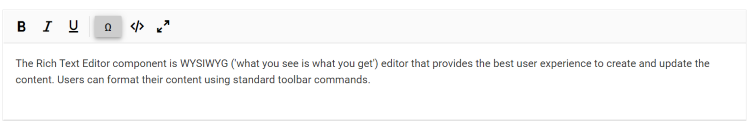

# How to Add a Custom Toolbar Tool in Blazor Rich Text Editor

The Rich Text Editor allows you to configure your own tools to its toolbar using the [RichTextEditorCustomToolbarItems](https://help.syncfusion.com/cr/blazor/Syncfusion.Blazor.RichTextEditor.RichTextEditorCustomToolbarItems.html) tag directive within a [RichTextEditorToolbarSettings](https://help.syncfusion.com/cr/blazor/Syncfusion.Blazor.RichTextEditor.RichTextEditorToolbarSettings.html). The tools can be plain text, icon, or HTML template. Also, define the order and group where the tool should be included.

The following example demonstrates how to add a custom tool to the Rich Text Editor toolbar. In this example, a custom `Ω` symbol tool is added to insert special characters into the editor content.

Refer to the following code sample to configure a custom toolbar item with tooltip text using the [RichTextEditorToolbarSettings.Items](https://help.syncfusion.com/cr/blazor/Syncfusion.Blazor.RichTextEditor.RichTextEditorToolbarSettings.html#Syncfusion_Blazor_RichTextEditor_RichTextEditorToolbarSettings_Items) property.




@using Syncfusion.Blazor.Buttons
@using Syncfusion.Blazor.RichTextEditor

<SfRichTextEditor @ref="RteObj">
    <RichTextEditorToolbarSettings Items="@Tools">
        <RichTextEditorCustomToolbarItems>
            <RichTextEditorCustomToolbarItem Name="Symbol">
                <Template>
                    <SfButton @onclick="ClickHandler">Insert Symbol</SfButton>
                </Template>
            </RichTextEditorCustomToolbarItem>
        </RichTextEditorCustomToolbarItems>
    </RichTextEditorToolbarSettings>
    
The Rich Text Editor component is the WYSIWYG ('what you see is what you get') editor that provides the best user experience to create and update the content. Users can format their content using the standard toolbar commands.

</SfRichTextEditor>

@code {
    SfRichTextEditor RteObj;
    private List<ToolbarItemModel> Tools = new List<ToolbarItemModel>()
    {
        new ToolbarItemModel() { Command = ToolbarCommand.Bold },
        new ToolbarItemModel() { Command = ToolbarCommand.Italic },
        new ToolbarItemModel() { Command = ToolbarCommand.Underline },
        new ToolbarItemModel() { Command = ToolbarCommand.Separator },
        new ToolbarItemModel() { Name = "Symbol", TooltipText = "Insert Symbol" },
        new ToolbarItemModel() { Command = ToolbarCommand.SourceCode },
        new ToolbarItemModel() { Command = ToolbarCommand.FullScreen }
    };
    private async Task ClickHandler()
    {
        ExecuteCommandOption executeCommandOption = new ExecuteCommandOption();
        executeCommandOption.Undo = true;
        await RteObj.ExecuteCommandAsync(CommandName.InsertText, "₹", executeCommandOption);
    }
}




