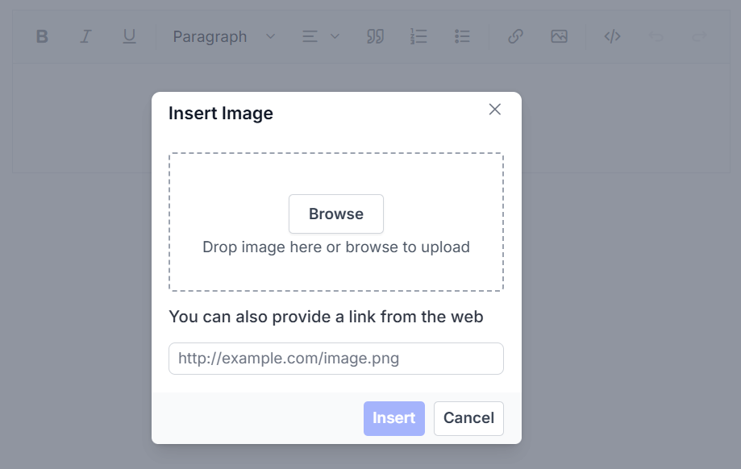

# Customizing Dialog Behavior in Blazor Rich Text Editor

The Blazor Rich Text Editor provides enhanced customization for built-in dialogs through the [RichTextEditorDialogSettings](https://help.syncfusion.com/cr/blazor/Syncfusion.Blazor.RichTextEditor.RichTextEditorDialogSettings.html) property. This feature allows developers to control the appearance, behavior, and positioning of dialogs such as image, link, and audio insertion dialogs.

The following table outlines the available configuration options:

| Options | Description |
|---------|-------------|
| `IsModal` | Accepts a boolean value that determines whether the dialog operates in **modal** (true) or **modeless** (false) mode. |
| `Target` | Specifies the target element for the dialog component. |
| `ZIndex` | Sets the z-index value of the dialog, allowing it to appear above or below other UI elements as needed. |

## Configuring dialog settings

The following example demonstrates how to configure dialog settings in the Blazor Rich Text Editor:









## See also

* [How to edit the quick toolbar settings](../toolbar#audio-quick-toolbar)
* [How to use link editing option in the toolbar items](../tools#insert-link)
