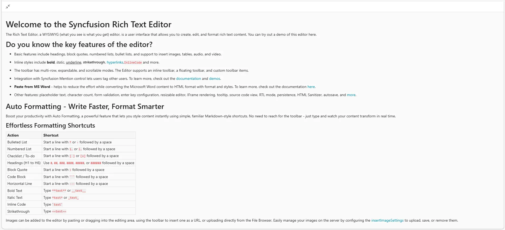

# Full screen Mode in Blazor Rich Text Editor Component

The Full screen mode allows the Rich Text Editor to expand and occupy the entire browser viewport. This provides a distraction-free editing experience and more space to work with content and toolbar features.

You can enable full screen mode using the `Full screen` icon toolbar button. Once activated, the editor transitions into full screen view, hiding other page elements and maximizing the editing area.

## How it works

Click the full screen icon in the toolbar to toggle full screen mode. When enabled, the editor:

- Expands to fill the entire browser window.
- Adjusts its layout to optimize space for content and tools.
- Can be exited by clicking the `Minimize` icon or pressing the `Esc` key.









