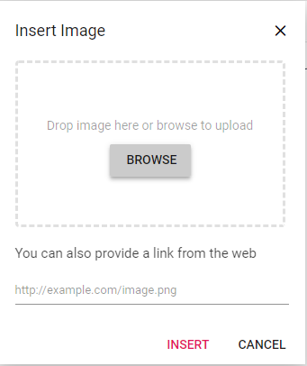
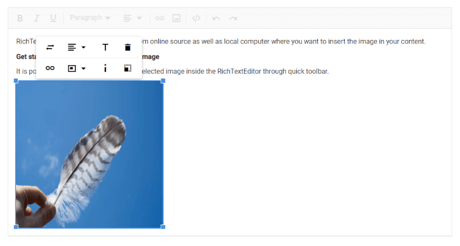

# Insert image in Rich Text Editor

## Inserting images from web urls

To insert an image from an online source like Google, Bing, and more, enable the images tool on the editor’s toolbar. By default, the images tool opens an image dialog that allows inserting an image from the online source.



## Uploading and inserting images

Through the browse option in the image dialog, select the image from the local machine and insert it into the Rich Text Editor content.

If the path field is not specified in [RichTextEditorImageSettings](https://help.syncfusion.com/cr/blazor/Syncfusion.Blazor.RichTextEditor.RichTextEditorImageSettings.html), the image will be converted to `base64`, and a `blob` url for the image will be created, and the generated url will set as the `src` property of the `` tag as follows:

The image selected from the local machine will be uploaded and saved to the specified location.

```


```
N> If you want to insert many tiny images in the editor and don't want a specific physical location for saving images, opt to save the format as `Base64`.


### Server side action

The selected image can be uploaded to the required destination using the controller action below. Map this method name into [RichTextEditorImageSettings.SaveUrl](https://help.syncfusion.com/cr/blazor/Syncfusion.Blazor.RichTextEditor.RichTextEditorImageSettings.html#Syncfusion_Blazor_RichTextEditor_RichTextEditorImageSettings_SaveUrl) and provide required destination path through [RichTextEditorImageSettings.Path](https://help.syncfusion.com/cr/blazor/Syncfusion.Blazor.RichTextEditor.RichTextEditorImageSettings.html#Syncfusion_Blazor_RichTextEditor_RichTextEditorImageSettings_Path) property.

N> [View sample on GitHub.](https://github.com/SyncfusionExamples/blazor-richtexteditor-image-upload).




@using Syncfusion.Blazor.RichTextEditor

<SfRichTextEditor>
    <RichTextEditorImageSettings SaveUrl="api/Image/Save" Path="./Images/" />
</SfRichTextEditor>







using System;
using System.IO;
using System.Net.Http.Headers;
using Microsoft.AspNetCore.Mvc;
using Microsoft.AspNetCore.Http;
using System.Collections.Generic;
using Microsoft.AspNetCore.Hosting;
using Microsoft.AspNetCore.Http.Features;

namespace ImageUpload.Controllers
{
    [ApiController]
    public class ImageController : ControllerBase
    {
        private readonly IWebHostEnvironment hostingEnv;

        public ImageController(IWebHostEnvironment env)
        {
            this.hostingEnv = env;
        }

        [HttpPost("[action]")]
        [Route("api/Image/Save")]
        public void Save(IList<IFormFile> UploadFiles)
        {
            try
            {
                foreach (var file in UploadFiles)
                {
                    if (UploadFiles != null)
                    {
                        string targetPath = hostingEnv.ContentRootPath + "\\wwwroot\\Images";
                        string filename = ContentDispositionHeaderValue.Parse(file.ContentDisposition).FileName.Trim('"');

                        // Create a new directory, if it does not exists
                        if (!Directory.Exists(targetPath))
                        {
                            Directory.CreateDirectory(targetPath);
                        }

                        // Name which is used to save the image
                        filename = targetPath + $@"\{filename}";

                        if (!System.IO.File.Exists(filename))
                        {
                            // Upload a image, if the same file name does not exist in the directory
                            using (FileStream fs = System.IO.File.Create(filename))
                            {
                                file.CopyTo(fs);
                                fs.Flush();
                            }
                            Response.StatusCode = 200;
                        }
                        else
                        {
                            Response.StatusCode = 204;
                        }
                    }
                }
            }
            catch (Exception e)
            {
                Response.Clear();
                Response.ContentType = "application/json; charset=utf-8";
                Response.HttpContext.Features.Get<IHttpResponseFeature>().ReasonPhrase = e.Message;
            }
        }
    }
}






#### Save image in application path

Using the [RichTextEditorImageSettings.Path](https://help.syncfusion.com/cr/blazor/Syncfusion.Blazor.RichTextEditor.RichTextEditorImageSettings.html#Syncfusion_Blazor_RichTextEditor_RichTextEditorImageSettings_Path) property, save the uploaded image in your application path. Also, change the path of the image by creating a folder structure as per your requirements under the folder `wwwroot`. You can’t create a path outside the `wwwroot` folder since any files, including HTML files, CSS files, image files, and JavaScript files, sent to the user's browser should be stored inside the `wwwroot` folder.




@using Syncfusion.Blazor.RichTextEditor

<SfRichTextEditor> 
    <RichTextEditorImageSettings SaveUrl="api/Image/Save" Path="./mnt/momfiles/WEB/NoticeBoard/Image/"></RichTextEditorImageSettings>
</SfRichTextEditor>







  public class ImageController : ControllerBase 
    { 
      private readonly IWebHostEnvironment hostingEnv; 

      public ImageController(IWebHostEnvironment env) 
      { 
          this.hostingEnv = env; 
      } 

      [HttpPost("[action]")] 
      [Route("api/Image/Save")] 
      public void Save(IList<IFormFile> UploadFiles) 
      { 
          try 
          { 
              foreach (var file in UploadFiles) 
              { 
                  if (UploadFiles != null) 
                  { 
                      string targetPath = hostingEnv.ContentRootPath + \\wwwroot\\mnt\\momfiles\\WEB\\NoticeBoard\\Image; 
                      string filename = ContentDispositionHeaderValue.Parse(file.ContentDisposition).FileName.Trim('"'); 

                      // Create a new directory, if it does not exists 
                      if (!Directory.Exists(targetPath)) 
                      { 
                          Directory.CreateDirectory(targetPath); 
                      } 

                      // Name which is used to save the image 
                      filename = targetPath + $@"\{filename}"; 

                      if (!System.IO.File.Exists(filename)) 
                      { 
                          // Upload a image, if the same file name does not exist in the directory 
                          using (FileStream fs = System.IO.File.Create(filename)) 
                          { 
                              file.CopyTo(fs); 
                              fs.Flush(); 
                          } 
                          Response.StatusCode = 200; 
                      } 
                      else 
                      { 
                          Response.StatusCode = 204; 
                      } 
                  } 
              } 
          } 
          catch (Exception e) 
          { 
              Response.Clear(); 
              Response.ContentType = "application/json; charset=utf-8"; 
              Response.HttpContext.Features.Get<IHttpResponseFeature>().ReasonPhrase = e.Message; 
          } 
      } 
  }




### Image save format

By default, the Rich Text Editor inserts the images in [Blob](https://help.syncfusion.com/cr/blazor/Syncfusion.Blazor.RichTextEditor.SaveFormat.html#Syncfusion_Blazor_RichTextEditor_SaveFormat_Blob) format, but you can also change the save format by setting the [RichTextEditorImageSettings.SaveFormat](https://help.syncfusion.com/cr/blazor/Syncfusion.Blazor.RichTextEditor.RichTextEditorImageSettings.html#Syncfusion_Blazor_RichTextEditor_RichTextEditorImageSettings_SaveFormat) property as `SaveFormat.Base64`.




@using Syncfusion.Blazor.RichTextEditor

<SfRichTextEditor> 
    <RichTextEditorImageSettings SaveFormat="SaveFormat.Base64"></RichTextEditorImageSettings> 
</SfRichTextEditor> 




## Restricting maximum image file size

Using the Rich Text Editor's [RichTextEditorImageSettings.MaxFileSize](https://help.syncfusion.com/cr/blazor/Syncfusion.Blazor.RichTextEditor.RichTextEditorImageSettings.html#Syncfusion_Blazor_RichTextEditor_RichTextEditorImageSettings_MaxFileSize) property, you can get the image size before uploading and restrict the image to upload when the given image size is greater than the allowed size.

In the following code, the image size has been validated before uploading and it has been determined whether the image has been uploaded or not.




@using Syncfusion.Blazor.RichTextEditor

<SfRichTextEditor>
    <RichTextEditorImageSettings MaxFileSize="30000000" />
</SfRichTextEditor>

@code {
    private List<ToolbarItemModel> Items = new List<ToolbarItemModel>()
    {
        new ToolbarItemModel() { Command = ToolbarCommand.Image },
        new ToolbarItemModel() { Command = ToolbarCommand.Bold },
        new ToolbarItemModel() { Command = ToolbarCommand.Italic },
        new ToolbarItemModel() { Command = ToolbarCommand.Underline },
        new ToolbarItemModel() { Command = ToolbarCommand.Separator },
        new ToolbarItemModel() { Command = ToolbarCommand.Formats },
        new ToolbarItemModel() { Command = ToolbarCommand.Alignments },
        new ToolbarItemModel() { Command = ToolbarCommand.OrderedList },
        new ToolbarItemModel() { Command = ToolbarCommand.UnorderedList },
        new ToolbarItemModel() { Command = ToolbarCommand.Separator },
        new ToolbarItemModel() { Command = ToolbarCommand.CreateLink },
        new ToolbarItemModel() { Command = ToolbarCommand.CreateTable },
        new ToolbarItemModel() { Command = ToolbarCommand.Separator },
        new ToolbarItemModel() { Command = ToolbarCommand.SourceCode },
        new ToolbarItemModel() { Command = ToolbarCommand.Separator },
        new ToolbarItemModel() { Command = ToolbarCommand.Undo },
        new ToolbarItemModel() { Command = ToolbarCommand.Redo }
    };
}




N> You can't restrict while uploading an image as a hyperlink in the insert image dialog. When inserting images using the link, the editor does not allow you to limit the image size. You could not identify the image file size when the image was provided as a link.

## Delete image 

To delete an image from the Rich Text Editor, select the image and click the `Remove` tool from the quick toolbar. It will delete the image from the Rich Text Editor content.

After selecting the image from the local machine, the URL for the image will be generated. From there also, remove the image from the service location by clicking the cross icon as in the following image.


## Deleting images from server using keyboard and quick toolbar actions

In the Rich Text Editor, deleting images using the `Delete` or `Backspace` keys, or the Quick Toolbar's `Remove` button, removes the image from the editor content not from the server.

This behavior is intentional, allowing undo/redo operations to function properly without breaking references to previously uploaded images.

To explicitly remove images from the server, use the [ImageDelete](https://help.syncfusion.com/cr/blazor/Syncfusion.Blazor.RichTextEditor.RichTextEditorEvents.html#Syncfusion_Blazor_RichTextEditor_RichTextEditorEvents_ImageDelete) event. This event is triggered after an image is removed from the content and provides the src URL of the image, which can be used to initiate a request to your server for deleting the corresponding file.

The following sample demonstrates how to use the `ImageDelete` event in Rich Text Editor to delete images from the server after they are removed from the editor content:

`Index.razor`

```cshtml

@using Syncfusion.Blazor.RichTextEditor

<SfRichTextEditor>
   <RichTextEditorEvents ImageDelete="@OnImageDeleteHandler"></RichTextEditorEvents>
   <RichTextEditorImageSettings SaveUrl="@SaveURL" Path="@Path" RemoveUrl="@RemoveURL"/>
</SfRichTextEditor>
@code{
    private string SaveURL = "[SERVICE_HOSTED_PATH]/api/RichTextEditor/SaveFile";
    private string Path = "[SERVICE_HOSTED_PATH]/RichTextEditor/";
    private string RemoveURL = "[SERVICE_HOSTED_PATH]/api/RichTextEditor/DeleteFile";

    public async Task OnImageDeleteHandler(AfterImageDeleteEventArgs args)
    {
        var imageSrc = args.Src;
        var fileName = imageSrc.Split('/').Last();
        var content = new MultipartFormDataContent();
        var dummyFile = new ByteArrayContent(new byte[0]);
        content.Add(dummyFile, "UploadFiles", fileName);
        try
        {
            var response = await Http.PostAsync(RemoveURL, content);
            if (response.IsSuccessStatusCode)
            {
                Console.WriteLine($"Image deleted successfully: {fileName}");
            }
            else
            {
                Console.WriteLine($"Image deletion failed: {response.StatusCode}");
            }
        }
        catch (Exception ex)
        {
            Console.WriteLine($"Error deleting image: {ex.Message}");
        }
    }

}

```

## Set image dimensions

Sets the default width and height of the image when it is inserted in the Rich Text Editor using the [RichTextEditorImageSettings.Width](https://help.syncfusion.com/cr/blazor/Syncfusion.Blazor.RichTextEditor.RichTextEditorImageSettings.html#Syncfusion_Blazor_RichTextEditor_RichTextEditorImageSettings_Width) and [RichTextEditorImageSettings.Height](https://help.syncfusion.com/cr/blazor/Syncfusion.Blazor.RichTextEditor.RichTextEditorImageSettings.html#Syncfusion_Blazor_RichTextEditor_RichTextEditorImageSettings_Height) property.

You can also adjust the image dimensions using the `Change Size` option in the quick toolbar. After clicking the option, the image size will open as follows. In that, specify the width and height of the image in pixels.


## Adding captions and alt text to images

The image caption and alternative text can be specified for the inserted image in the Rich Text Editor using the [RichTextEditorQuickToolbarSettings](https://help.syncfusion.com/cr/blazor/Syncfusion.Blazor.RichTextEditor.RichTextEditorQuickToolbarSettings.html) options such as `Image Caption` and `Alternative Text`.

Through the `Alternative Text` option, set the alternative text for the image when the image is not successfully uploaded into the Rich Text Editor.

When you click the `Image Caption` button, the image is wrapped in an image element with a caption. Then, type the caption content inside the Rich Text Editor.

## Setting image display position

Configure the default display behavior for inserted images when it is inserted in the Rich Text Editor using the [RichTextEditorImageSettings.Display](https://help.syncfusion.com/cr/blazor/Syncfusion.Blazor.RichTextEditor.RichTextEditorImageSettings.html#Syncfusion_Blazor_RichTextEditor_RichTextEditorImageSettings_Display) property.

N> It has two possible options: `Inline` and `Break`.




@using Syncfusion.Blazor.RichTextEditor

<SfRichTextEditor>
    <RichTextEditorImageSettings Display="ImageDisplay.Inline" />
    <p>The Rich Text Editor allows you to insert images from the online source as well as the local computer where you want to insert the image in your content.</p>
    <p><b>Get started with Quick Toolbar to click on the image</b></p>
    <p>It is possible to add a custom style on the selected image inside the Rich Text Editor through the quick toolbar.</p>
    
</SfRichTextEditor>




## Adding hyperlinks to images

The hyperlink itself can be an image in the Rich Text Editor. If the image is given as a hyperlink, the remove, edit, and open links will be added to the quick toolbar of the image as follows. For further details about the link, refer to the [link documentation](#link-manipulation).


## Resizing images

The Rich Text Editor has built-in image inserting support. The resize points will appear on each corner of the image when focused. So, users can easily resize the image using mouse points or their thumbs through the resize points. Also, the resize calculation will be done based on the aspect ratio.


### Renaming images before inserting

By using the `RichTextEditorImageSettings` property, the server handler can be specified to upload and rename the selected image. Then, the `OnImageUploadSuccess` event could be bound, to receive the modified file name from the server and update it in the Rich Text Editor's insert image dialog.
 
N> [View sample in GitHub.](https://github.com/SyncfusionExamples/blazor-richtexteditor-rename-image)




@using Syncfusion.Blazor.RichTextEditor

<SfRichTextEditor>
    <RichTextEditorImageSettings SaveUrl="[SERVICE_HOSTED_PATH]/api/Image/Rename" Path="./Images/" />
    <RichTextEditorEvents OnImageUploadSuccess="@ImageUploadSuccess" />
</SfRichTextEditor>

@code {
    public string[] header { get; set; }
    private void ImageUploadSuccess(ImageSuccessEventArgs args)
    {
        var headers = args.Response.Headers.ToString();
        header = headers.Split("name: ");
        header = header[1].Split("\r");

        // Update the modified image name to display a image in the editor.
        args.File.Name = header[0];
    }
}
 



To configure the server-side handler in the Web API service, refer the below code.




using System;
using System.IO;
using System.Net.Http.Headers;
using Microsoft.AspNetCore.Mvc;
using Microsoft.AspNetCore.Http;
using System.Collections.Generic;
using Microsoft.AspNetCore.Hosting;
using Microsoft.AspNetCore.Http.Features;

namespace RenameImage.Controllers
{
    [ApiController]
    public class ImageController : ControllerBase
    {
        private double x;
        private string imageFileName;
        private readonly IWebHostEnvironment hostingEnv;

        public ImageController(IWebHostEnvironment env)
        {
            this.hostingEnv = env;
        }

        [HttpPost("[action]")]
        [Route("api/Image/Rename")]
        public void Rename(IList<IFormFile> UploadFiles)
        {
            try
            {
                foreach (IFormFile file in UploadFiles)
                {
                    if (UploadFiles != null)
                    {
                        string targetPath = hostingEnv.ContentRootPath + "\\wwwroot\\Images";
                        string filename = ContentDispositionHeaderValue.Parse(file.ContentDisposition).FileName.Trim('"');

                        // Create a new directory, if it does not exists
                        if (!Directory.Exists(targetPath))
                        {
                            Directory.CreateDirectory(targetPath);
                        }

                        imageFileName = filename;
                        string path = hostingEnv.WebRootPath + "\\Images" + $@"\{filename}";

                        // Rename a uploaded image file name
                        while (System.IO.File.Exists(path))
                        {
                            imageFileName = "rteImage" + x + "-" + filename;
                            path = hostingEnv.WebRootPath + "\\Images" + $@"\rteImage{x}-{filename}";
                            x++;
                        }

                        if (!System.IO.File.Exists(path))
                        {
                            using (FileStream fs = System.IO.File.Create(path))
                            {
                                file.CopyTo(fs);
                                fs.Flush();
                                fs.Close();
                            }

                            // Modified file name shared through response header by adding custom header
                            Response.Headers.Add("name", imageFileName);
                            Response.StatusCode = 200;
                            Response.ContentType = "application/json; charset=utf-8";
                        }
                    }
                }
            }
            catch (Exception e)
            {
                Response.Clear();
                Response.ContentType = "application/json; charset=utf-8";
                Response.HttpContext.Features.Get<IHttpResponseFeature>().ReasonPhrase = e.Message;
            }
        }
    }
}




## See also

* [How to insert image editing option in the toolbar items](../toolbar#image-quick-toolbar)
