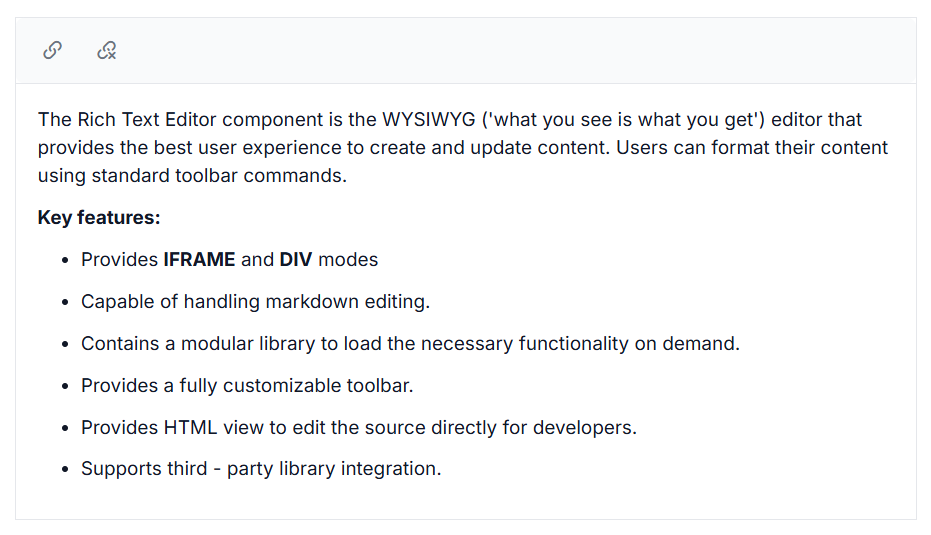

# Link Manipulation in RichTextEditor

The hyperlink can be inserted into the editor for quick access to the related information. The hyperlink itself can be text or an image.

## Insert link

Point the cursor anywhere within the editor where you want to insert the link. It is also possible to select a text or an image within the editor that can be converted to the hyperlink. Click the insert hyperLink tool on the toolbar. The insert link dialog will open. The dialog has the following options.

| Options | Description |
|----------------|--------------------------------------|
| Web Address | Types or pastes the destination for the link you are creating |
| Display Text | Types or edits the required text that you want to display text for the link |
| Tooltip | Displays additional helpful information when you place the pointer on the hyperlink, type the required text in the `Tooltip` field. |
| Open Link | Specifies whether the given link will open in new window or not |

N> The Rich Text Editor link tool validates the URLs as you type them in the web address. URLs considered invalid will be highlighted with a red color by clicking the insert button in the [Insert Link](https://help.syncfusion.com/cr/blazor/Syncfusion.Blazor.RichTextEditor.ToolbarCommand.html#Syncfusion_Blazor_RichTextEditor_ToolbarCommand_CreateLink) dialog.









## Auto link

When you type URL and enter key to the Rich Text Editor, the typed URL will be automatically changed into the hyperlink.

## Auto URL

When the [EnableAutoUrl](https://help.syncfusion.com/cr/blazor/Syncfusion.Blazor.RichTextEditor.SfRichTextEditor.html#Syncfusion_Blazor_RichTextEditor_SfRichTextEditor_EnableAutoUrl) property is enabled, it will accept the given URL (relative or absolute) without validating it for hyperlinks. Otherwise, the given URL will be automatically converted to absolute path URL by prefixing https:// for hyperlinks, and it defaults to false.

## Edit and remove link

Add the custom tools on the selected link inside the Rich Text Editor through the quick toolbar.









## See also

* [How to insert link editing option in the toolbar items](../toolbar#link-quick-toolbar)