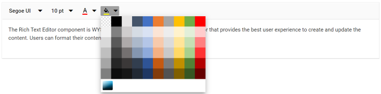
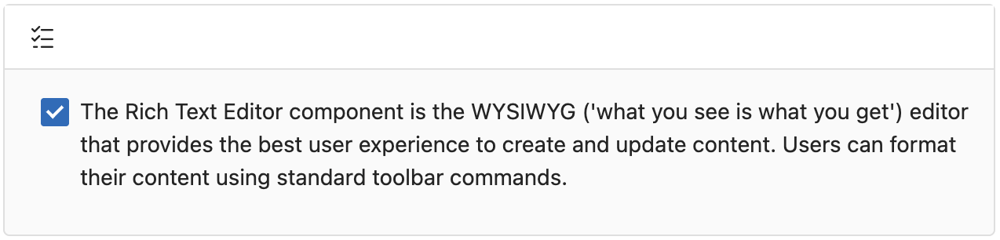

# Styling Tools in Rich Text Editor

## Font family

By default, the editor is initialized with the default items of the font family. To change it, select a different font family from the drop-down menu in the editor’s toolbar.

To apply a different font style to a section of the content, select the text you would like to change and select a required font style from the drop-down to apply the changes to the selected text.

### Built-in font family

The following table lists the default font name and width of the `FontName` dropdown and the available list of font names.

| Default Key | Default Value |
|-----|--------------------------------------|
| [Width](https://help.syncfusion.com/cr/blazor/Syncfusion.Blazor.RichTextEditor.RichTextEditorFontFamily.html#Syncfusion_Blazor_RichTextEditor_RichTextEditorFontFamily_Width) | 65px |
| [Items](https://help.syncfusion.com/cr/blazor/Syncfusion.Blazor.RichTextEditor.RichTextEditorFontFamily.html#Syncfusion_Blazor_RichTextEditor_RichTextEditorFontFamily_Items) | new List&lt;DropDownItemModel&gt;()<br>{<br>&nbsp;&nbsp;&nbsp;&nbsp;new DropDownItemModel() { Text = "Segoe UI", Value = "Segoe UI" },<br>&nbsp;&nbsp;&nbsp;&nbsp;new DropDownItemModel() { Text = "Arial", Value = "Arial,Helvetica,sans-serif" },<br>&nbsp;&nbsp;&nbsp;&nbsp;new DropDownItemModel() { Text = "Georgia", Value = "Georgia,serif" },<br>&nbsp;&nbsp;&nbsp;&nbsp;new DropDownItemModel() { Text = "Impact", Value = "Impact,Charcoal,sans-serif" },<br>&nbsp;&nbsp;&nbsp;&nbsp;new DropDownItemModel() { Text = "Tahoma", Value = "Tahoma,Geneva,sans-serif" },<br>&nbsp;&nbsp;&nbsp;&nbsp;new DropDownItemModel() { Text = "Times New Roman", Value = "Times New Roman,Times,serif" },<br>&nbsp;&nbsp;&nbsp;&nbsp;new DropDownItemModel() { Text = "Verdana", Value = "Verdana,Geneva,sans-serif"}<br>}; |










### Custom font family

The Rich Text Editor provides support for custom fonts with an existing list.
If you want to add additional font names and font sizes to the font drop-down, pass the font information as `List<DropDownItemModel>` data to the [RichTextEditorFontFamily.Items](https://help.syncfusion.com/cr/blazor/Syncfusion.Blazor.RichTextEditor.RichTextEditorFontFamily.html#Syncfusion_Blazor_RichTextEditor_RichTextEditorFontFamily_Items) property.










### Google font support

To use web fonts in the Rich Text Editor, the web fonts do not need to be present on the local machine. To add the web fonts to the Rich Text Editor, refer to the web font links and add the font names in the [RichTextEditorFontFamily](https://help.syncfusion.com/cr/blazor/Syncfusion.Blazor.RichTextEditor.RichTextEditorFontFamily.html) tag.

The following font style links are referred in the page.

### Blazor Server App

* For **.NET 6** app, refer style in the `<head>` of the **~/Pages/_Layout.cshtml** file.

* For **.NET 7** app, refer style in the `<head>` of the **~/Pages/_Host.cshtml** file.




<head>
    <link rel="stylesheet" href="http://fonts.googleapis.com/css?family=Roboto">
    <link rel="stylesheet" href="http://fonts.googleapis.com/css?family=Great+Vibes">
</head>





<head>
    <link rel="stylesheet" href="http://fonts.googleapis.com/css?family=Roboto">
    <link rel="stylesheet" href="http://fonts.googleapis.com/css?family=Great+Vibes">
</head>




### Blazor WebAssembly App

For Blazor WebAssembly App, refer style in the `<head>` of the **~/index.html** file.




<head>
    <link rel="stylesheet" href="http://fonts.googleapis.com/css?family=Roboto">
    <link rel="stylesheet" href="http://fonts.googleapis.com/css?family=Great+Vibes">
</head>













## Font size

By default, the editor is initialized with default items for font size. To change it, select a different font size from the drop-down menu in the editor’s toolbar.

To apply a different font style to a section of the content, select the text that you would like to change and select a required font style from the drop-down to apply the changes to the selected text.

### Built-in font size

The following table lists the default font size and width of the [FontSize](https://help.syncfusion.com/cr/blazor/Syncfusion.Blazor.RichTextEditor.RichTextEditorFontSize.html) dropdown and the available list of the font size.

| Default Key | Default Value |
|-----|--------------------------------------|
| [Width](https://help.syncfusion.com/cr/blazor/Syncfusion.Blazor.RichTextEditor.RichTextEditorFontSize.html#Syncfusion_Blazor_RichTextEditor_RichTextEditorFontSize_Width) | 35px.|
| [Items](https://help.syncfusion.com/cr/blazor/Syncfusion.Blazor.RichTextEditor.RichTextEditorFontSize.html#Syncfusion_Blazor_RichTextEditor_RichTextEditorFontSize_Items) | new List&lt;DropDownItemModel&gt;()<br>{<br>&nbsp;&nbsp;&nbsp;&nbsp;new DropDownItemModel() { Text = "8 pt", Value = "8pt" },<br>&nbsp;&nbsp;&nbsp;&nbsp;new DropDownItemModel() { Text = "10 pt", Value = "10pt" },<br>&nbsp;&nbsp;&nbsp;&nbsp;new DropDownItemModel() { Text = "12 pt", Value = "12pt" },<br>&nbsp;&nbsp;&nbsp;&nbsp;new DropDownItemModel() { Text = "14 pt", Value = "14pt" },<br>&nbsp;&nbsp;&nbsp;&nbsp;new DropDownItemModel() { Text = "18 pt", Value = "18pt" },<br>&nbsp;&nbsp;&nbsp;&nbsp;new DropDownItemModel() { Text = "24 pt", Value = "24pt" },<br>&nbsp;&nbsp;&nbsp;&nbsp;new DropDownItemModel() { Text = "36 pt", Value = "36pt" }<br>}; |










### Custom font size

The Rich Text Editor provides support for customizing the font size with the existing list. If you want to add additional font sizes to the font drop-down, pass the font information as `List<DropDownItemModel>` data to the [RichTextEditorFontSize.Items](https://help.syncfusion.com/cr/blazor/Syncfusion.Blazor.RichTextEditor.RichTextEditorFontSize.html#Syncfusion_Blazor_RichTextEditor_RichTextEditorFontSize_Items) property.










## Formats

By default, the editor is initialized with default items of formats. To change it, select a different format from the drop-down in the editor’s toolbar.

To apply different format styles for sections of the content, select the required format from the drop-down and then apply the changes to the selection.

### Built-in formats

The following table list the default format name and width of the  [Format](https://help.syncfusion.com/cr/blazor/Syncfusion.Blazor.RichTextEditor.RichTextEditorFormat.html#properties) dropdown and the available list of format names.

| Default Key | Default Value |
|-----|--------------------------------------|
| [Width](https://help.syncfusion.com/cr/blazor/Syncfusion.Blazor.RichTextEditor.RichTextEditorFormat.html#Syncfusion_Blazor_RichTextEditor_RichTextEditorFormat_Width) | 65px|
| [Items](https://help.syncfusion.com/cr/blazor/Syncfusion.Blazor.RichTextEditor.RichTextEditorFormat.html#Syncfusion_Blazor_RichTextEditor_RichTextEditorFormat_Items) | new List&lt;DropDownItemModel&gt;()<br>{<br>&nbsp;&nbsp;&nbsp;&nbsp;new DropDownItemModel() { Text = "Paragraph", Value = "P" },<br>&nbsp;&nbsp;&nbsp;&nbsp;new DropDownItemModel() { Text = "Code", Value = "Pre" },<br>&nbsp;&nbsp;&nbsp;&nbsp;new DropDownItemModel() { Text = "Quotation", Value = "BlockQuote" },<br>&nbsp;&nbsp;&nbsp;&nbsp;new DropDownItemModel() { Text = "Heading 1", Value = "H1" },<br>&nbsp;&nbsp;&nbsp;&nbsp;new DropDownItemModel() { Text = "Heading 2", Value = "H2" },<br>&nbsp;&nbsp;&nbsp;&nbsp;new DropDownItemModel() { Text = "Heading 3", Value = "H3" },<br>&nbsp;&nbsp;&nbsp;&nbsp;new DropDownItemModel() { Text = "Heading 4", Value = "H4" }<br>}; |










### Custom format

The Rich Text Editor provides support for custom formats with an existing list. If you want to add additional formats to the format drop-down, pass the format information as `List<DropDownItemModel>` data to the [RichTextEditorFormat.Items](https://help.syncfusion.com/cr/blazor/Syncfusion.Blazor.RichTextEditor.RichTextEditorFormat.html#Syncfusion_Blazor_RichTextEditor_RichTextEditorFormat_Items) property.










## Applying font and background colors

To apply the font color or background color for a selected content of RTE, use the font color and background color tools.

The Rich Text Editor supports providing custom font color and background color with an existing list through the [ColorCode](https://help.syncfusion.com/cr/blazor/Syncfusion.Blazor.RichTextEditor.ColorItemBase.html#Syncfusion_Blazor_RichTextEditor_ColorItemBase_ColorCode) field of the [RichTextEditorFontColor](https://help.syncfusion.com/cr/blazor/Syncfusion.Blazor.RichTextEditor.RichTextEditorFontColor.html) and [RichTextEditorBackgroundColor](https://help.syncfusion.com/cr/blazor/Syncfusion.Blazor.RichTextEditor.RichTextEditorBackgroundColor.html).

The `RichTextEditorFontColor` and `RichTextEditorBackgroundColor` tag has two modes of `Picker` and `Palette`. The `Palette` mode has a predefined set of the `ColorCode`, and in the `Picker` mode, more colors have been provided. Through the `ModeSwitcher`, switch between these two options.











<!--  -->

### Show recent color

The [ShowRecentColors](https://help.syncfusion.com/cr/blazor/Syncfusion.Blazor.RichTextEditor.ColorItemBase.html#Syncfusion_Blazor_RichTextEditor_ColorItemBase_ShowRecentColors) feature in the Rich Text Editor provides quick access to a row of recently used colors displayed below the main palette. This streamlines editing by keeping frequently used colors easily accessible, improving styling efficiency and consistency.

This feature can be enabled separately for the [RichTextEditorFontColor](https://help.syncfusion.com/cr/blazor/Syncfusion.Blazor.RichTextEditor.RichTextEditorFontColor.html) and [RichTextEditorBackgroundColor](https://help.syncfusion.com/cr/blazor/Syncfusion.Blazor.RichTextEditor.RichTextEditorBackgroundColor.html) tools, giving flexibility based on formatting needs. It is especially helpful when working with consistent color themes, eliminating the need to repeatedly search through the full palette.









## Built-in editor content styles

By default, the content styles of the Rich Text Editor are not returned while retrieving the HTML value from the editor. So, the styles are not applied when using the HTML value outside the editor. To get the styles from the Rich Text Editor’s content for your application, copy and use the following styles directly in your application. The styles listed are used in the UI elements of the Rich Text Editor.

N> Make sure to add a CSS class `e-rte-content` to the content container.

```css

.e-rte-content p {
  margin: 0 0 10px;
  margin-bottom: 10px;
}

.e-rte-content li {
  margin-bottom: 10px;
}

.e-rte-content h1 {
  font-size: 2.17em;
  font-weight: 400;
  line-height: 1;
  margin: 10px 0;
}

.e-rte-content h2 {
  font-size: 1.74em;
  font-weight: 400;
  margin: 10px 0;
}

.e-rte-content h3 {
  font-size: 1.31em;
  font-weight: 400;
  margin: 10px 0;
}

.e-rte-content h4 {
  font-size: 1em;
  font-weight: 400;
  margin: 0;
}

.e-rte-content h5 {
  font-size: 00.8em;
  font-weight: 400;
  margin: 0;
}

.e-rte-content h6 {
  font-size: 00.65em;
  font-weight: 400;
  margin: 0;
}

.e-rte-content blockquote {
  margin: 10px 0;
  margin-left: 0;
  padding-left: 5px;
}

.e-rte-content pre {
  background-color: inherit;
  border: 0;
  border-radius: 0;
  color: #333;
  font-size: inherit;
  line-height: inherit;
  margin: 0 0 10px;
  overflow: visible;
  padding: 0;
  white-space: pre-wrap;
  word-break: inherit;
  word-wrap: break-word;
}

.e-rte-content strong, .e-rte-content b {
  font-weight: 700;
}

.e-rte-content a {
  text-decoration: none;
  -webkit-user-select: auto;
  -ms-user-select: auto;
  user-select: auto;
}

.e-rte-content a:hover {
  text-decoration: underline;
}

.e-rte-content h3 + h4,
.e-rte-content h4 + h5,
.e-rte-content h5 + h6 {
  margin-top: 00.6em;
}

.e-rte-content .e-rte-image.e-imgbreak {
  border: 0;
  cursor: pointer;
  display: block;
  float: none;
  margin: 5px auto;
  max-width: 100%;
  position: relative;
}

.e-rte-content .e-rte-image {
  border: 0;
  cursor: pointer;
  display: block;
  float: none;
  margin: auto;
  max-width: 100%;
  position: relative;
}

.e-rte-content .e-rte-image.e-imginline {
  display: inline-block;
  float: none;
  margin-left: 5px;
  margin-right: 5px;
  max-width: calc(100% - (2 * 5px));
  vertical-align: bottom;
}

.e-rte-content .e-rte-image.e-imgcenter {
  cursor: pointer;
  display: block;
  float: none;
  margin: 5px auto;
  max-width: 100%;
  position: relative;
}

.e-rte-content .e-rte-image.e-imgleft {
  float: left;
  margin: 0 5px 0 0;
  text-align: left;
}

.e-rte-content .e-rte-image.e-imgright {
  float: right;
  margin: 0 0 0 5px;
  text-align: right;
}

.e-rte-content .e-rte-img-caption {
  display: inline-block;
  margin: 5px auto;
  max-width: 100%;
  position: relative;
}

.e-rte-content .e-rte-img-caption.e-caption-inline {
  display: inline-block;
  margin: 5px auto;
  margin-left: 5px;
  margin-right: 5px;
  max-width: calc(100% - (2 * 5px));
  position: relative;
  text-align: center;
  vertical-align: bottom;
}

.e-rte-content .e-rte-img-caption.e-imgcenter {
  display: block;
}

.e-rte-content .e-rte-img-caption .e-rte-image.e-imgright,
.e-rte-content .e-rte-img-caption .e-rte-image.e-imgleft {
  float: none;
  margin: 0;
}

.e-rte-content .e-rte-table {
  border-collapse: collapse;
  empty-cells: show;
}

.e-rte-content .e-rte-table td,
.e-rte-content .e-rte-table th {
  border: 1px solid #bdbdbd;
  height: 20px;
  min-width: 20px;
  padding: 2px 5px;
  vertical-align: middle;
}

.e-rte-content .e-rte-table.e-dashed-border td,
.e-rte-content .e-rte-table.e-dashed-border th {
  border-style: dashed;
}

.e-rte-content .e-rte-img-caption .e-img-inner {
  box-sizing: border-box;
  display: block;
  font-size: 16px;
  font-weight: initial;
  margin: auto;
  opacity: .9;
  position: relative;
  text-align: center;
  width: 100%;
}

.e-rte-content .e-rte-img-caption .e-img-wrap {
  display: inline-block;
  margin: auto;
  padding: 0;
  width: 100%;
}

.e-rte-content blockquote {
  border-left: solid 2px #333;
}

.e-rte-content a {
  color: #2e2ef1;
}

.e-rte-content .e-rte-table th {
  background-color: #e0e0e0;
}

```
## Customizing numbered and bulleted lists

This feature allows users to change the appearance of the numbered and bulleted lists. Users can also apply different numbering or bullet formats lists such as lowercase greek, upper Alpha, square, and circles. Also, customize the style type of the lists to be populated in the dropdown from the toolbar by using the [NumberFormatList](https://help.syncfusion.com/cr/blazor/Syncfusion.Blazor.RichTextEditor.RichTextEditorNumberFormatList.html) and [BulletFormatList](https://help.syncfusion.com/cr/blazor/Syncfusion.Blazor.RichTextEditor.RichTextEditorBulletFormatList.html) properties in the Rich Text Editor.










<!--  -->

### Checklist

The `Checklist` feature lets you create interactive task lists with clickable checkboxes. You can configure checkbox behavior, customize the visual appearance, manage item states, and enable keyboard interactions. This makes it perfect for project management, note-taking, and task tracking within your content. You can easily toggle between checked and unchecked states, giving you an intuitive way to manage the completion status of your list items—making it a simple and effective TODO list solution.

#### Inserting a checklist
You can embed interactive task lists directly within the Rich Text Editor. Here’s how you can insert a Checklist:
- **Using the Toolbar**: Click the Checklist button in the editor toolbar, usually represented by a checkbox icon.
- **Using the Shortcut**: Press `Ctrl+Shift+9` (or `Cmd+Shift+9` on macOS) to insert a Checklist at your cursor’s position.
- **Converting Existing Lists**: Select an existing bullet or numbered list and click the Checklist button to convert it into an interactive checklist.
- **Toggling Checklist Items**: You can toggle the state of checklist items between checked and unchecked by clicking the checkbox. If you prefer using the keyboard, press `Ctrl+Enter` (or `Cmd+Enter` on macOS) to toggle the check marks based on your selection or cursor position in the editor.

#### Configuring Checklist
To enable the Checklist feature in your editor, add the `Checklist` toolbar item to the [RichTextEditorToolbarSettings.Items](https://help.syncfusion.com/cr/blazor/Syncfusion.Blazor.RichTextEditor.RichTextEditorToolbarSettings.Items) property. This feature supports customizable behavior and can be easily integrated into your Rich Text Editor toolbar for quick access.

Here’s an example of how you can configure the Checklist in your Rich Text Editor:
Below is an example of how to configure the Checklist in the Rich Text Editor:




@using Syncfusion.Blazor.RichTextEditor

<SfRichTextEditor>
<RichTextEditorToolbarSettings Items="@Items" />
</SfRichTextEditor>
@code {
    private List<ToolbarItemModel> Items = new List<ToolbarItemModel>()
    {
        new ToolbarItemModel() { Command = ToolbarCommand.Checklist }
    };
}






## Formatting code blocks

Configure code block formatting as a separate toolbar button by adding the `InsertCode` Command within the  [RichTextEditorToolbarSettings.Items](https://help.syncfusion.com/cr/blazor/Syncfusion.Blazor.RichTextEditor.RichTextEditorToolbarSettings.html#Syncfusion_Blazor_RichTextEditor_RichTextEditorToolbarSettings_Items) property. The `InsertCode` button has a toggle state to apply code block formatting to the editor and remove code block formatting from the editor.

The following code will configure the InsertCode button in the toolbar and set the background color to `pre` tag for highlighting the code block.










