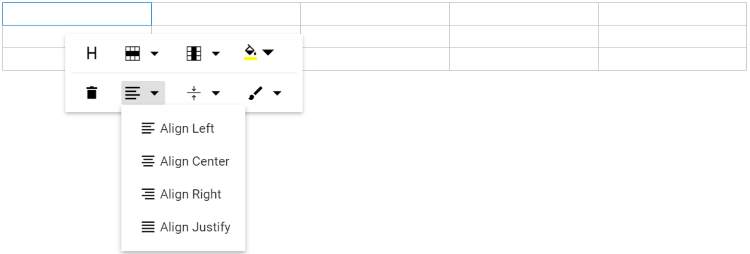
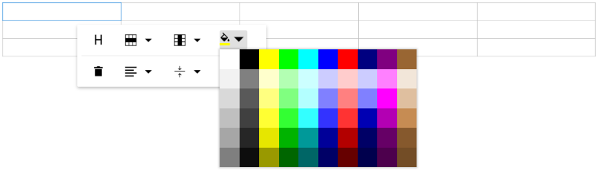

# Table Manipulation in RichTextEditor

The Rich Text Editor allows you to insert the table of content in the edit panel and provide options to add, edit, and remove the table as well as to perform other table-related actions. For inserting the table into the Rich Text Editor, the following list of options has been provided in the [RichTextEditorTableSettings](https://help.syncfusion.com/cr/blazor/Syncfusion.Blazor.RichTextEditor.RichTextEditorTableSettings.html).

| Options | Description | Default Value |
|----------------|---------|-----------------------------|
| [MinWidth](https://help.syncfusion.com/cr/blazor/Syncfusion.Blazor.RichTextEditor.RichTextEditorTableSettings.html#Syncfusion_Blazor_RichTextEditor_RichTextEditorTableSettings_MinWidth) | Sets the default minWidth of the table. | 0 |
| [MaxWidth](https://help.syncfusion.com/cr/blazor/Syncfusion.Blazor.RichTextEditor.RichTextEditorTableSettings.html#Syncfusion_Blazor_RichTextEditor_RichTextEditorTableSettings_MaxWidth) | Sets the default maxWidth of the table. | null |
| [EnableResize](https://help.syncfusion.com/cr/blazor/Syncfusion.Blazor.RichTextEditor.RichTextEditorTableSettings.html#Syncfusion_Blazor_RichTextEditor_RichTextEditorTableSettings_EnableResize) | Enables resize feature in table.| true |
| [Styles](https://help.syncfusion.com/cr/blazor/Syncfusion.Blazor.RichTextEditor.RichTextEditorTableSettings.html#Syncfusion_Blazor_RichTextEditor_RichTextEditorTableSettings_Styles) | This is an array of key value pair, on each pair, key should be name of styling and value is class name. This list will be shown on quick toolbar options to change the styles of table on designing like dashed, double bordered. | `List<DropDownItemModel>` |
| [Width](https://help.syncfusion.com/cr/blazor/Syncfusion.Blazor.RichTextEditor.RichTextEditorTableSettings.html#Syncfusion_Blazor_RichTextEditor_RichTextEditorTableSettings_Width) | Sets the default width of the table. | 100% |

## Insert table

Using the [ToolbarCommand.CreateTable](https://help.syncfusion.com/cr/blazor/Syncfusion.Blazor.RichTextEditor.ToolbarCommand.html#Syncfusion_Blazor_RichTextEditor_ToolbarCommand_CreateTable) toolbar option, select a number of rows and columns to be inserted over the table grid and insert the table into the Rich Text Editor content using the mouse. Tables can also be inserted through the option in the pop-up where the number of rows and columns can be provided manually, and this is the default way in devices.










## Quick Toolbar

The quick toolbar is opened by clicking the table. It has different sets of commands to be performed on the table, which increases the feasibility of editing the table easily.

N> For more details about quick toolbar, refer to this documentation [section](../toolbar#quick-toolbar).

## Table properties

Sets the default width of the table when it is inserted in the Rich Text Editor using the width of the `RichTextEditorTableSettings`.

Using the quick toolbar, users can change the width, cell padding, and cell spacing in the selected table using the [TableToolbarCommand.TableEditProperties](https://help.syncfusion.com/cr/blazor/Syncfusion.Blazor.RichTextEditor.TableToolbarCommand.html#Syncfusion_Blazor_RichTextEditor_TableToolbarCommand_TableEditProperties) command dialog action.

The [TableToolbarCommand.TableCell](https://help.syncfusion.com/cr/blazor/Syncfusion.Blazor.RichTextEditor.TableToolbarCommand.html#Syncfusion_Blazor_RichTextEditor_TableToolbarCommand_TableCell) item should be configured in the [RichTextEditorQuickToolbarSettings.Table](https://help.syncfusion.com/cr/blazor/Syncfusion.Blazor.RichTextEditor.RichTextEditorQuickToolbarSettings.html#Syncfusion_Blazor_RichTextEditor_RichTextEditorQuickToolbarSettings_Table) property to show the merge or split icons while selecting the table cells.


### Table row and column selection

The table row and column selection feature in our editor allows for intuitive and efficient table manipulation using both mouse and keyboard interactions.

**Mouse interaction:**

* Click and drag to select multiple rows or columns.
* Selected cells are highlighted with a distinct background color for better visibility.

**Keyboard interaction:**

* Use <kbd>Shift</kbd> + <kbd>Arrow keys</kbd> to extend the selection of rows or columns.
* Background color highlights selected cells, making it easy to see the current selection.


**Table selection with backspace and delete keys:**

* Press the <kbd>Backspace</kbd> key immediately after the table to select the entire table.
* Press the <kbd>Delete</kbd> key immediately before the table to select the entire table.


**Table content text formatting:**

The text formatting feature in tables allows users to apply various styles to selected cells, enhancing the appearance and readability of data. This includes the application of headings, paragraphs, lists, and inline styles such as bold, italic, and strikethrough. Users can efficiently format multiple cells simultaneously by selecting entire rows or columns.

```cshtml

@using Syncfusion.Blazor.RichTextEditor

<SfRichTextEditor ShowCharCount="true">
    <RichTextEditorToolbarSettings Items="@Tools" />
    <h2>Discover the Table's Powerful Features</h2><p>A table can be created in the editor using either a keyboard shortcut or the      toolbar. With the quick toolbar, you can perform table cell insert, delete, split, and merge operations. You can style the table cells using background colours and borders.</p>      
    <table class="e-rte-table" style="width: 100%; min-width: 0px; height: 151px">
        <thead>
            <tr>
                <th><span>Name</span><br/></th>
                <th><span>Age</span><br/></th>
                <th><span>Gender</span><br/></th>
                <th><span>Occupation</span><br/></th>
            </tr>
        </thead>
        <tbody>
            <tr>
                <td>Selma Rose</td>
                <td>30</td>
                <td>Female</td>
                <td><span>Engineer</span><br/></td>
            </tr>
            <tr>
                <td><span>Robert</span><br/></td>
                <td>28</td>
                <td>Male</td>
                <td><span>Graphic Designer</span></td>
            </tr>
            <tr>
                <td><span>William</span><br/></td>
                <td>35</td>
                <td>Male</td>
                <td>Teacher</td>
            </tr>
        </tbody>
    </table>
</SfRichTextEditor>

@code{
    private List<ToolbarItemModel> Tools = new List<ToolbarItemModel>()
    {
        new ToolbarItemModel() { Command = ToolbarCommand.CreateTable }
    };
}

```

### Cell merge and split

The Rich Text Editor allows users to change the appearance of the tables by splitting or merging the table cells.

The `TableCell` item should be configured in the Table [quickToolbarSettings](../toolbar#table-quick-toolbar) property to show the merge or split icons while selecting the table cells.

### Cell merging

The table cell merge feature allows the merging of two or more rows and columns of cells into a single cell with its contents.


### Cell splitting

The table cell split feature allows the selected cell to be split both horizontally and vertically.


## Table header

The [TableToolbarCommand.TableHeader](https://help.syncfusion.com/cr/blazor/Syncfusion.Blazor.RichTextEditor.TableToolbarCommand.html#Syncfusion_Blazor_RichTextEditor_TableToolbarCommand_TableHeader) command is available with the quick toolbar option through which the header row can be added or removed from the inserted table. The following image illustrates the table header.


## Insert rows

The [TableCommandsArgs.Rows](https://help.syncfusion.com/cr/blazor/Syncfusion.Blazor.RichTextEditor.TableCommandsArgs.html#Syncfusion_Blazor_RichTextEditor_TableCommandsArgs_Rows) can be inserted above or under the required table cell through the quick toolbar. Also, the focused row can be deleted.


## Insert columns

The [TableCommandsArgs.Columns](https://help.syncfusion.com/cr/blazor/Syncfusion.Blazor.RichTextEditor.TableCommandsArgs.html#Syncfusion_Blazor_RichTextEditor_TableCommandsArgs_Columns) can be inserted to the left or right side of the required table cell through the quick toolbar. Also, the focused column can be deleted. The following screenshot shows the available options of the column item.


## Quick insert for table rows and columns

The Rich Text Editor offers a simple and intuitive way to add rows and columns to your tables without interrupting your workflow. You can expand tables directly from the interface, no need to use toolbar buttons.

### Insert columns instantly

- **Where to hover**: Place your cursor over any cell in the **first row** of your table.
- **What you'll see**: A small dot icon (●) will appear at the **top edge** of the cell.
- **How to add**: Hover over the dot to reveal a **plus icon (+)**. Click it to insert a new column to the left.


### Insert rows instantly

- **Where to hover**: Place your cursor over any cell in the **first column** of your table.
- **What you'll see**: A small dot icon (●) will appear at the **left edge** of the cell.
- **How to add**: Hover over the dot to reveal a **plus icon (+)**. Click it to insert a new row above.


## Vertical align

The text inside the table can be aligned to the top, middle, or bottom using the [TableToolbarCommand.TableCellVerticalAlign](https://help.syncfusion.com/cr/blazor/Syncfusion.Blazor.RichTextEditor.TableToolbarCommand.html#Syncfusion_Blazor_RichTextEditor_TableToolbarCommand_TableCellVerticalAlign) command of the quick toolbar.


## Horizontal align

The text inside the table can be aligned left, right, or center using the `TableCellHorizontalAlign` command of the quick toolbar.



## Border Styles

Table styles provided for the class name should be appended to a table element. It helps to design the table in specific CSS styles when inserted in the editor.

By default, it provides `Dashed border` and `Alternate rows`.

`Dashed border`: Applies the dashed border to the table.

`Alternate border`: Applies the alternative background to the table.


### Custom Styles

The Rich Text Editor provides support to custom styles for tables. If you want to add additional styles, pass the styles information as `List<DropDownItemModel>` data to the [RichTextEditorTableSettings.Styles](https://help.syncfusion.com/cr/blazor/Syncfusion.Blazor.RichTextEditor.RichTextEditorTableSettings.html#Syncfusion_Blazor_RichTextEditor_RichTextEditorTableSettings_Styles)  property.










## Cell Color

The background color can be set for each table cell through the [TableToolbarCommand.BackgroundColor](https://help.syncfusion.com/cr/blazor/Syncfusion.Blazor.RichTextEditor.TableToolbarCommand.html#Syncfusion_Blazor_RichTextEditor_TableToolbarCommand_BackgroundColor) command available with the quick toolbar.



## Copy, cut, and paste table rows and columns

The Rich Text Editor supports copying, cutting, and pasting table content, significantly improving the efficiency of table data manipulation. This feature is ideal for applications that require dynamic table content management, allowing users to easily modify and manage table data within the editor.

Users can select multiple table cells by dragging the mouse or by holding the <kbd>Shift</kbd> key and using the <kbd>Arrow keys</kbd>. After selecting the desired cells, the following standard keyboard shortcuts can be used:

| Action | Windows | Mac |
|--------|---------|-----|
| Copy   | <kbd>Ctrl</kbd> + <kbd>C</kbd> | <kbd>⌘</kbd> + <kbd>C</kbd> |
| Cut    | <kbd>Ctrl</kbd> + <kbd>X</kbd> | <kbd>⌘</kbd> + <kbd>X</kbd> |
| Paste  | <kbd>Ctrl</kbd> + <kbd>V</kbd> | <kbd>⌘</kbd> + <kbd>V</kbd> |

**Paste behavior and supported scenarios:**

* Table structure, formatting, and cell properties are automatically preserved during the paste operation.
* The editor intelligently handles cell merging and splitting based on the destination context.
* Supports cross-table operations. Users can copy content from one table and paste it into another.
* Allows pasting partial table content as new tables or into existing table cells.
* Compatible with content from external applications like Excel, Word, and other editors.
* Maintains formatting consistency during both internal and external paste operations.
* Supports pasting into a single clicked cell or a selected range of multiple cells.

N> Refer to the [Blazor Rich Text Editor](https://www.syncfusion.com/blazor-components/blazor-wysiwyg-rich-text-editor) feature tour page for its groundbreaking feature representations. Also, explore the [Blazor Rich Text Editor](https://blazor.syncfusion.com/demos/rich-text-editor/overview?theme=bootstrap5) example to know how to render and configure the rich text editor tools.

## See also

* [How to edit the quick toolbar settings](../toolbar#quick-toolbar)