# Text Formatting in Blazor Rich Text Editor Component

## Basic text styling

The Rich Text Editor's basic styles feature provides essential formatting options, including bold, italic, underline, strikethrough, subscript, superscript, and case changes. These fundamental tools enable users to enhance and customize their text effortlessly. By leveraging these options, users can ensure their content is both visually appealing and well-structured.

### Available text styles

The table below lists the available text styles in the Rich Text Editor's toolbar.

| Name | Icons | Summary | Initialization |
|----------------|---------|---------|------------------------------------------|
| Bold  |  | Makes text thicker and darker | toolbarSettings: { items: ['Bold']} | `<b>bold</b>` |
| Italic | 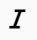 | Slants text to the right | toolbarSettings: { items: ['Italic']} | `<em>italic</em>` |
| Underline | 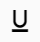 | Adds a line beneath the text | toolbarSettings: { items: ['Underline']} |
| StrikeThrough |  | Applies a line through the text. |toolbarSettings: { items: ['StrikeThrough']}|
| InlineCode | | Formats text as inline code | toolbarSettings: { items: ['InlineCode']} | `<code>inline code</code>`|
| SubScript |  | Positions text slightly below the normal line |toolbarSettings: { items: ['SubScript']}|
| SuperScript |  | Positions text slightly above the normal line |toolbarSettings: { items: ['SuperScript’']}|
| LowerCase |  |  Converts text to lowercase |toolbarSettings: { items: ['LowerCase']}|
| UpperCase |  | Converts text to uppercase |toolbarSettings: { items: ['UpperCase’']}|

Please refer to the sample below to add these basic text styling options in the Rich Text Editor.









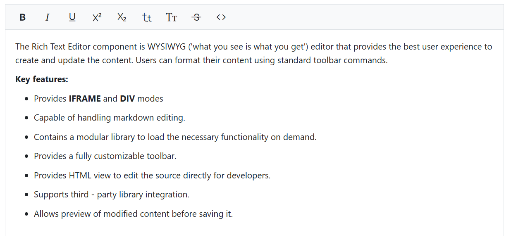

## Text alignments

The Rich Text Editor offers various text alignment options, including left, center, right, and justify. To utilize these alignment options, add the Alignments item to the items property in the toolbarSettings.

> **Important Note:** Text alignment is applied to the entire block element containing the cursor or selected text, not just to the selected text itself. When you apply an alignment, it affects the whole paragraph or block, even if you've only selected a portion of the text.

Here are the available alignment options:

* Align Left:
To left-align your text, place the cursor in the desired paragraph or select any text within it, then click the `Align Left` icon in the toolbar. This will align the entire paragraph with the left margin.

* Align Center:
To center-align your text, place the cursor in the desired paragraph or select any text within it, then click the `Align Center` icon in the toolbar. This will center the entire paragraph within its container.

* Align Right:
To right-align your text, place the cursor in the desired paragraph or select any text within it, then click the `Align Right` icon in the toolbar. This will align the entire paragraph with the right margin.

* Align Justify:
To fully justify your text, place the cursor in the desired paragraph or select any text within it, then click the `Align Justify` icon in the toolbar. This will distribute the entire paragraph evenly across the line, aligning it with both the left and right margins.

Please refer to the sample and code snippets below to add these alignment options in the Rich Text Editor.









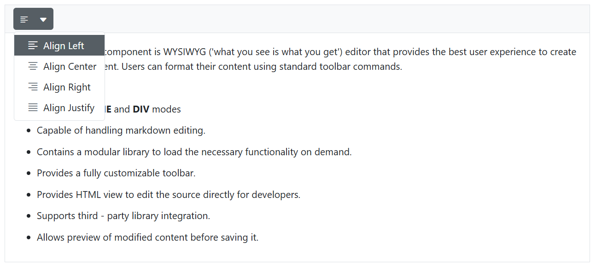

## Number and bullet format list

List formatting in the Rich Text Editor allows users to organize content into structured lists, enhancing readability and visual presentation. The control supports two main types of lists:

1. Ordered Lists
2. Unordered Lists

### Ordered lists

Ordered lists present items in a specific sequence, with each item preceded by a number or letter. The Rich Text Editor provides two ways to create and manage ordered lists:

#### Using the ordered list tool

The `OrderedList` toolbar item offers a quick way to create or toggle a numbered list. To use it, select the desired text in the editor and click the `OrderedList` button in the toolbar. If the selected text is not already a numbered list, it will be converted into one. If it's already a numbered list, clicking the button will remove the list formatting.

#### Number format list tool

For more detailed control over the numbering style, use the `NumberFormatList` dropdown in the toolbar. Select the desired text in the editor, then choose the preferred format from the `NumberFormatList` dropdown. The selected text will be transformed into a numbered list with the chosen style.

##### Available numbering styles:

* `None`: Removes numbering while maintaining list structure and indentation
* `Number`: Uses standard numeric sequencing (1, 2, 3, ...)
* `Lower Roman`: Employs lowercase Roman numerals (i, ii, iii, ...)
* `Lowercase Greek`: Utilizes lowercase Greek letters (α, β, γ, ...)
* `Upper Alpha`: Applies uppercase letters (A, B, C, ...)
* `Lower Alpha`: Uses lowercase letters (a, b, c, ...)
* `Upper Roman`: Employs uppercase Roman numerals (I, II, III, ...)

You can customize the available number formats using the [NumberFormatList](https://help.syncfusion.com/cr/blazor/Syncfusion.Blazor.RichTextEditor.RichTextEditorNumberFormatList.html#Syncfusion_Blazor_RichTextEditor_RichTextEditorNumberFormatList) property of the Rich Text Editor.

The following example demonstrates how to customize the number format lists in the Rich Text Editor:









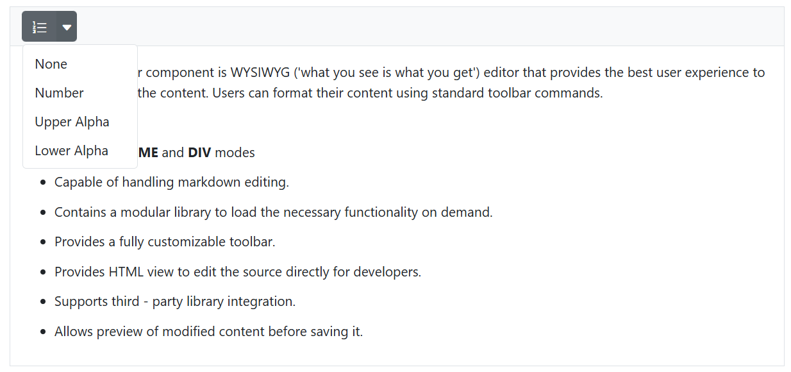

### Unordered lists

Unordered lists present items with visual markers, providing an effective way to list items without implying order or priority. The Rich Text Editor offers two methods for creating and managing unordered lists:

#### Using the unordered list tool

The `UnorderedList` toolbar item provides a fast way to create or toggle a bulleted list. To use it, select the desired text in the editor and click the `UnorderedList` button in the toolbar. If the selected text is not already a bulleted list, it will be converted into one. If it's already a bulleted list, clicking the button will remove the list formatting.

#### Bullet format list tool

For more control over the bullet style, use the `bulletFormatList` dropdown in the toolbar. Select the desired text in the editor, then choose the preferred format from the `bulletFormatList` dropdown. The selected text will be transformed into a bullet list with the chosen style.

##### Available bullet styles

* `None`: Removes bullet points while maintaining list structure and indentation
* `Disc`: Displays solid circular bullets
* `Square`: Uses solid square bullets
* `Circle`: Presents hollow circular bullets

The following example demonstrates how to customize the bullet format lists in the Rich Text Editor:









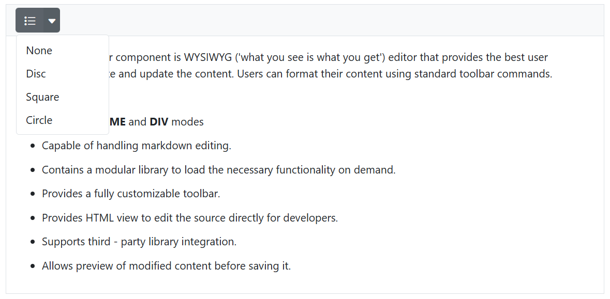

## Nested list creation using Tab key

In the Rich Text Editor, pressing the `Tab` key while the cursor is inside a list item automatically creates a nested list. This behavior allows users to structure their content hierarchically by indenting list items. Each press of the `Tab` key increases the nesting level, converting the current item into a sub-item of the previous one.

Please refer to the below video for visual behavior and interaction examples:

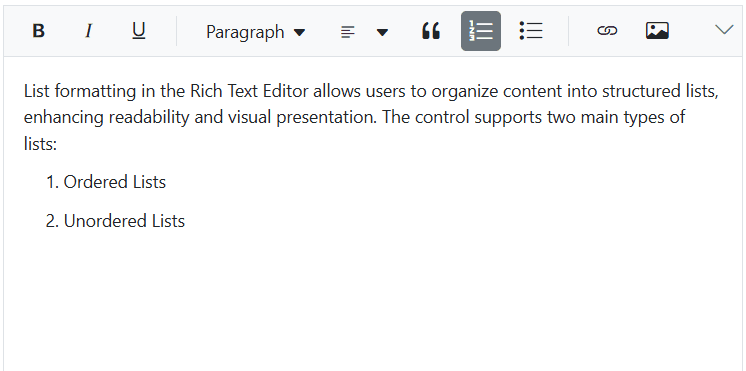

## Increase and decrease indent

The Rich Text Editor allows you to set indentation for text blocks such as paragraphs, headings, or lists. This feature helps you visually organize and structure your content, making it easier to read and understand.

The Rich Text Editor allows you to configure two types of indentation tools, `Indent` and `Outdent` tool  in the Rich Text Editor toolbar using the [RichTextEditorToolbarSettings.Items](https://help.syncfusion.com/cr/blazor/Syncfusion.Blazor.RichTextEditor.RichTextEditorToolbarSettings.html#Syncfusion_Blazor_RichTextEditor_RichTextEditorToolbarSettings_Items) property.

| Options | Description |
|----------------|---------|
| Indent | Increases the indentation |
| Outdent | Decreases the indentation |

To adjust the text indentation:

1. Select the desired text or paragraph.
2. Click the Indent or Outdent button in the toolbar.
3. The indentation of the selected text will be modified accordingly.

To configure the `Indent` and `Outdent` toolbar item, refer to the below code.

### Indentation in lists

The Rich Text Editor provides powerful indentation features for both bullet and number format lists, allowing users to create nested lists and adjust list levels easily.

#### Increasing indent

To increase the indent of a list item:

1. Select the list item you want to indent.
2. Click the "Increase Indent" button in the toolbar or press <Kbd>Ctrl</Kbd> + <Kbd>]</Kbd>.
3. The selected item will be indented, creating a nested list.

#### Decreasing indent

To decrease the indent of a list item:

1. Select the indented list item.
2. Click the "Decrease Indent" button in the toolbar or press <Kbd>Ctrl</Kbd> + <Kbd>[</Kbd>.
3. The selected item will move back to the previous indentation level.

#### Using tab key for indentation

The Tab key provides a quick way to adjust list indentation:

- Pressing Tab will increase the indent of the selected list item, creating a nested list.
- Pressing Shift + Tab will decrease the indent of the selected list item, moving it to the previous level.

This behavior allows for efficient creation and management of multi-level lists without the need to use the toolbar buttons.

## Heading formats

The Rich Text Editor provides a feature to format text with various heading styles, such as Heading 1, Heading 2, Heading 3, and Heading 4. These headings allow for structuring content hierarchically, improving readability, and organizing information effectively.

### Built-in formats

The following table list the default format name and width of the  [Format](https://help.syncfusion.com/cr/blazor/Syncfusion.Blazor.RichTextEditor.RichTextEditorFormat.html#properties) dropdown and the available list of format names.

| Default Key | Default Value |
|-----|--------------------------------------|
| [Width](https://help.syncfusion.com/cr/blazor/Syncfusion.Blazor.RichTextEditor.RichTextEditorFormat.html#Syncfusion_Blazor_RichTextEditor_RichTextEditorFormat_Width) | 65px|
| [Items](https://help.syncfusion.com/cr/blazor/Syncfusion.Blazor.RichTextEditor.RichTextEditorFormat.html#Syncfusion_Blazor_RichTextEditor_RichTextEditorFormat_Items) | new List&lt;DropDownItemModel&gt;() { &nbsp;&nbsp;&nbsp;&nbsp;new DropDownItemModel() { Text = "Paragraph", Value = "P" }, &nbsp;&nbsp;&nbsp;&nbsp;new DropDownItemModel() { Text = "Code", Value = "Pre" }, &nbsp;&nbsp;&nbsp;&nbsp;new DropDownItemModel() { Text = "Quotation", Value = "BlockQuote" }, &nbsp;&nbsp;&nbsp;&nbsp;new DropDownItemModel() { Text = "Heading 1", Value = "H1" }, &nbsp;&nbsp;&nbsp;&nbsp;new DropDownItemModel() { Text = "Heading 2", Value = "H2" }, &nbsp;&nbsp;&nbsp;&nbsp;new DropDownItemModel() { Text = "Heading 3", Value = "H3" }, &nbsp;&nbsp;&nbsp;&nbsp;new DropDownItemModel() { Text = "Heading 4", Value = "H4" } }; |









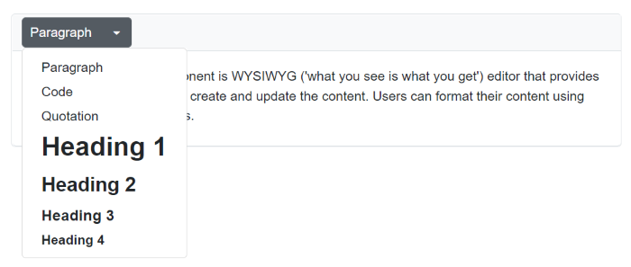

### Custom format

The Rich Text Editor provides support for custom formats with an existing list. If you want to add additional formats to the format drop-down, pass the format information as `List<DropDownItemModel>` data to the [RichTextEditorFormat.Items](https://help.syncfusion.com/cr/blazor/Syncfusion.Blazor.RichTextEditor.RichTextEditorFormat.html#Syncfusion_Blazor_RichTextEditor_RichTextEditorFormat_Items) property.









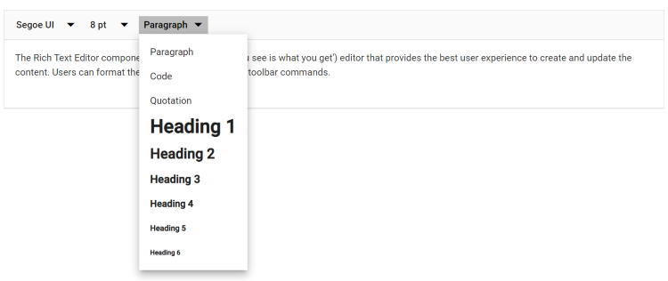

## Quotation formatting

The Rich Text Editor facilitates quotation formatting through the `Blockquote` tool available in the toolbar. Blockquotes are designed to visually highlight significant text, emphasizing key information or quotations by setting them apart from the main content for added emphasis and clarity.

To format text as a quotation, select the desired text and click on the `Blockquote` icon in the toolbar. The selected text will be formatted as a blockquote, typically indented and styled differently from the surrounding content.

Use the `Blockquote` tool in the editor below to see the feature in action.

> In a markdown editor, blockquotes are represented using the `>` symbol.









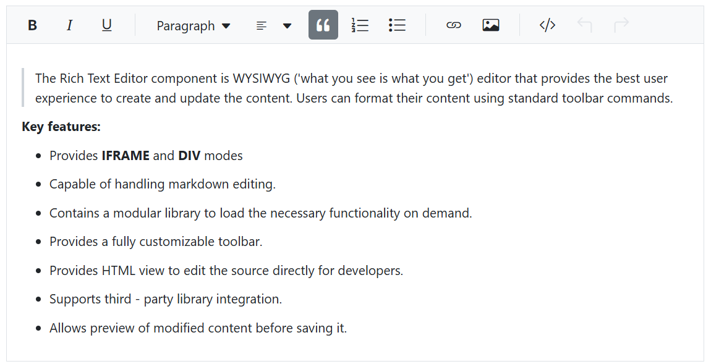

### Nested blockquotes

The Rich Text Editor also supports nested blockquotes, allowing one blockquote to be placed inside another. 

While the toolbar does not provide a direct method to apply blockquote formatting recursively (i.e., within an already blockquote section), nested blockquotes can still be achieved in the following ways:

1. **Pasting preformatted content:** If you paste content that already contains nested blockquote tags (e.g., from another editor or email), the Rich Text Editor will preserve and render the nested structure correctly.
2. **Pre-loading nested blockquote HTML:** You can initialize the editor with nested blockquote content using the value property.
3. **Manual editing via Source Code view:** You can manually insert nested blockquote tags using the SourceCode toolbar option.









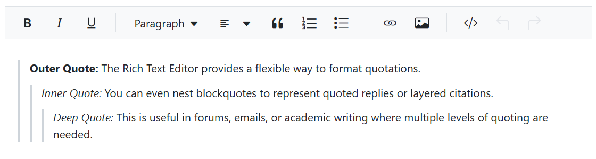

## Horizontal line

The Rich Text Editor enables users to insert horizontal dividers using the `HorizontalLine` tool available in the toolbar. Horizontal lines (
) help visually separate sections of content, enhancing readability and structural clarity.

To insert a horizontal line, place the cursor at the desired location and click the `HorizontalLine` icon in the toolbar. A full-width line will be added, creating a clear visual break between sections of text or other elements.

Use the `HorizontalLine` tool in the editor below to see the feature in action.









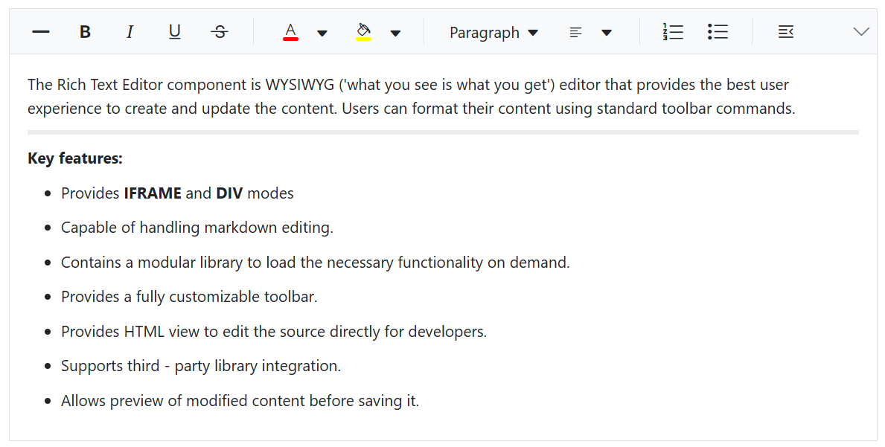

## Format Painter in Blazor Rich Text Editor

The format painter tool enables users to replicate formatting from one text segment and apply it to another. It can be accessed through the toolbar or via keyboard shortcuts, allowing the transfer of styles from individual words to entire paragraphs. Customization options are available through the Rich Text Editor[FormatPainterSettings](https://help.syncfusion.com/cr/blazor/Syncfusion.Blazor.RichTextEditor.RichTextEditorFormatPainterSettings.html) property.

### Configuring format painter tool in the toolbar

You can add the `FormatPainter` tool in the Rich Text Editor using the [RichTextEditorToolbarSettings.Items](https://help.syncfusion.com/cr/blazor/Syncfusion.Blazor.RichTextEditor.RichTextEditorToolbarSettings.html#Syncfusion_Blazor_RichTextEditor_RichTextEditorToolbarSettings_Items) property.

Double-clicking the Format Painter toolbar button enables **sticky mode**, allowing multiple formatting applications until the `Escape` key is pressed. In sticky mode, the format painter remains active until the `Escape` key is pressed again to disable it.

The following example demonstrates how to add the Format Painter tool to the Rich Text Editor toolbar.









## Clear formatting

The Rich Text Editor component offers a powerful `Clear Format` feature to remove any applied formatting from selected text.

This feature is particularly useful when you need to:

- Remove multiple styles at once
- Quickly standardize text formatting
- Prepare text for new styling

### Configuring clear format

The Clear Format feature allows users to remove all formatting (like bold, italic, font styles, etc.) from selected text in the Rich Text Editor. To enable this feature, you need to include it in the toolbar configuration.

Steps to Configure:

- Open the component file where the Rich Text Editor is implemented.
- Locate the [RichTextEditorToolbarSettings.Items](https://help.syncfusion.com/cr/blazor/Syncfusion.Blazor.RichTextEditor.RichTextEditorToolbarSettings.html#Syncfusion_Blazor_RichTextEditor_RichTextEditorToolbarSettings_Items) property in your editor configuration.
- Add `ClearFormat` to the `Items` array within the `ToolbarSettings`.

Here's an example of how to configure the Clear Format feature:









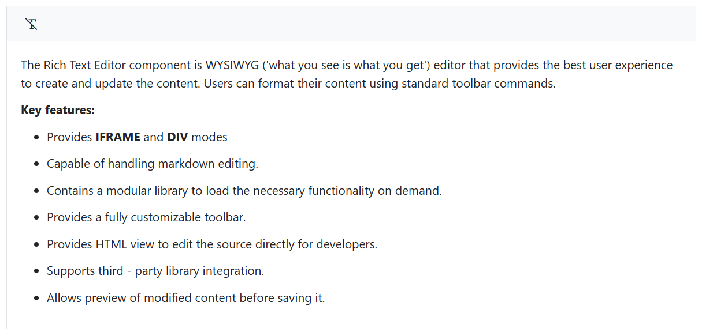

### Using clear format

Once configured, you can use the Clear Format feature as follows:

1. Select the text with formatting you want to remove.
2. Click the `Clear Format` button in the toolbar.
3. The selected text will revert to its original, unformatted state.

Using `Clear Format` makes it easy to undo styling changes and keep your text looking consistent. Examples and code snippets below show how to use 'Clear Format' effectively in the Rich Text Editor.









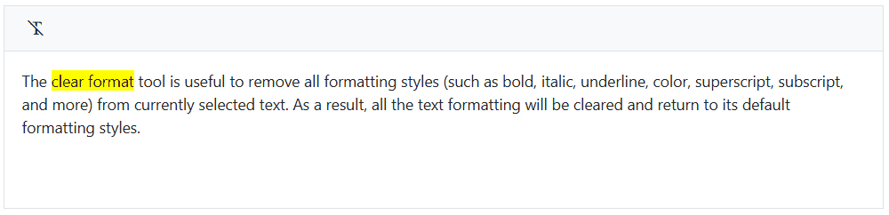

## Markdown Auto Format

The Rich Text Editor enables users to automatically format Markdown syntax into HTML content using the `EnableMarkdownAutoFormat` property. This feature helps streamline content creation by converting Markdown elements into their corresponding HTML tags, enhancing efficiency and consistency.

Markdown auto-formatting is enabled by default. When using the editor, Markdown syntax will automatically convert into HTML elements as you type, creating a smooth and efficient editing experience.

Use the `EnableMarkdownAutoFormat` tool in the editor below to see the feature in action.









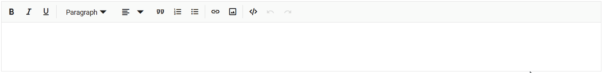
