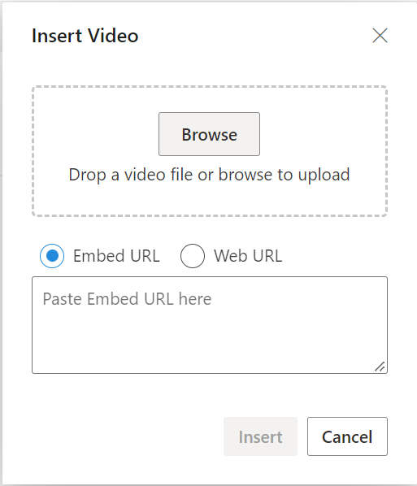
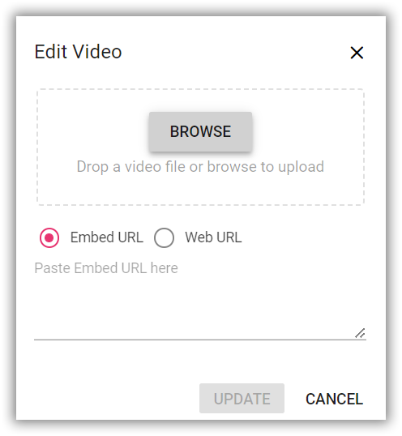
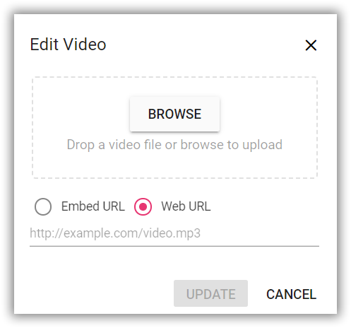
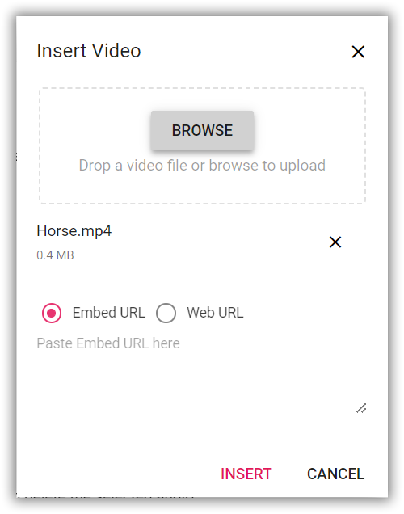
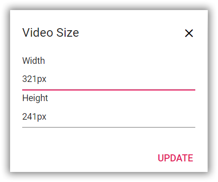

# Insert Video in Blazor Rich Text Editor Component

After inserting a video file, you can replace it using the Rich Text Editor[RichTextEditorQuickToolbarSettings](https://help.syncfusion.com/cr/blazor/Syncfusion.Blazor.RichTextEditor.RichTextEditorQuickToolbarSettings.html#Syncfusion_Blazor_RichTextEditor_RichTextEditorQuickToolbarSettings_Audio) `Replace` option. Replace the video file either by using the embedded URL or the web URL and the browse option in the video dialog.

| Options | Description |
|----------------|---------|
| [AllowedTypes](https://help.syncfusion.com/cr/blazor/Syncfusion.Blazor.RichTextEditor.RichTextEditorVideoSettings.html#Syncfusion_Blazor_RichTextEditor_RichTextEditorVideoSettings_AllowedTypes) | Specifies the extensions of the video types allowed to insert on bowering and passing the extensions with comma separators. For example, pass allowedTypes as `.mp4,` `.mov,` `.wmv,` and `.avi.`|
| [VideoLayoutOption](https://help.syncfusion.com/cr/blazor/Syncfusion.Blazor.RichTextEditor.VideoToolbarCommand.html#Syncfusion_Blazor_RichTextEditor_VideoToolbarCommand_VideoLayoutOption) | Sets the default display for a video when it is inserted into the Rich Text Editor. Possible options are `Inline` and `Break.` |
| [SaveFormat](https://help.syncfusion.com/cr/blazor/Syncfusion.Blazor.RichTextEditor.RichTextEditorMediaSettings.html#Syncfusion_Blazor_RichTextEditor_RichTextEditorMediaSettings_SaveFormat) | Sets the default save format of the video element when inserted. Possible options are `Blob` and `Base64.` |
| [Width](https://help.syncfusion.com/cr/blazor/Syncfusion.Blazor.RichTextEditor.RichTextEditorMediaSettings.html#Syncfusion_Blazor_RichTextEditor_RichTextEditorMediaSettings_Width) | Sets the default width of the video when it is inserted in the Rich Text Editor.|
| [MinWidth](https://help.syncfusion.com/cr/blazor/Syncfusion.Blazor.RichTextEditor.RichTextEditorVideoSettings.html#Syncfusion_Blazor_RichTextEditor_RichTextEditorVideoSettings_MinWidth) | Sets the minWidth of the video element when it is inserted in the Rich Text Editor.|
| [MaxWidth](https://help.syncfusion.com/cr/blazor/Syncfusion.Blazor.RichTextEditor.RichTextEditorVideoSettings.html#Syncfusion_Blazor_RichTextEditor_RichTextEditorVideoSettings_MaxWidth) | Sets the maxWidth of the video element when it is inserted in the Rich Text Editor.|
| [Height](https://help.syncfusion.com/cr/blazor/Syncfusion.Blazor.RichTextEditor.RichTextEditorMediaSettings.html#Syncfusion_Blazor_RichTextEditor_RichTextEditorMediaSettings_Height) | Sets the default height of the video when it is inserted in the Rich Text Editor.|
| [MinHeight](https://help.syncfusion.com/cr/blazor/Syncfusion.Blazor.RichTextEditor.RichTextEditorVideoSettings.html#Syncfusion_Blazor_RichTextEditor_RichTextEditorVideoSettings_MinHeight) | Sets the minHeight of the video element when it is inserted in the Rich Text Editor.|
| [MaxHeight](https://help.syncfusion.com/cr/blazor/Syncfusion.Blazor.RichTextEditor.RichTextEditorVideoSettings.html#Syncfusion_Blazor_RichTextEditor_RichTextEditorVideoSettings_MaxHeight) | Sets the maxHeight of the video element when it is inserted in the Rich Text Editor.|
| [SaveUrl](https://help.syncfusion.com/cr/blazor/Syncfusion.Blazor.RichTextEditor.RichTextEditorMediaSettings.html#Syncfusion_Blazor_RichTextEditor_RichTextEditorMediaSettings_SaveUrl) | Provides URL to map the action result method to save the video.|
| [Path](https://help.syncfusion.com/cr/blazor/Syncfusion.Blazor.RichTextEditor.RichTextEditorMediaSettings.html#Syncfusion_Blazor_RichTextEditor_RichTextEditorMediaSettings_Path) | Specifies the location to store the video.|
| [EnableResize](https://help.syncfusion.com/cr/blazor/Syncfusion.Blazor.RichTextEditor.RichTextEditorVideoSettings.html#Syncfusion_Blazor_RichTextEditor_RichTextEditorVideoSettings_EnableResize) | Sets the resizing action for the video element.|
| [ResizeByPercent](https://help.syncfusion.com/cr/blazor/Syncfusion.Blazor.RichTextEditor.RichTextEditorVideoSettings.html#Syncfusion_Blazor_RichTextEditor_RichTextEditorVideoSettings_ResizeByPercent) | Sets the percentage values for the video element with the resizing action.|

## Configure video tool in the toolbar

To include the video tool in the Rich Text Editor, you can add the toolbar item `Video` to the [RichTextEditorToolbarSettings.Items](https://help.syncfusion.com/cr/aspnetmvc-js2/Syncfusion.EJ2.RichTextEditor.RichTextEditorToolbarSettings.html#Syncfusion_EJ2_RichTextEditor_RichTextEditorToolbarSettings_Items) property.

To configure `Video` toolbar item, refer to the below code.









## Insert video from web

To insert a video from the hosted link or local machine, you should enable the video tool on the editor’s toolbar. By default, the video tool opens the dialog, allowing you to insert a video as an embedded URL. You can switch to a web URL to insert the video file from the online source.

## Insert from web URL

By default, the video tool opens the video dialog, allowing you to insert an embedded URL.



## Upload and insert video

In the video dialog, by using the `browse` option, select the video from the local machine and insert it into the Rich Text Editor content.

If the path field is not specified in the [RichTextEditorVideoSettings](https://help.syncfusion.com/cr/blazor/Syncfusion.Blazor.RichTextEditor.RichTextEditorVideoSettings.html), the video will be converted into `Blob` url or `Base64` and inserted inside the Rich Text Editor.

### Server-side action

The selected video can be uploaded to the required destination using the controller action below. Map this method name in [RichTextEditorMediaSettings.SaveUrl](https://help.syncfusion.com/cr/blazor/Syncfusion.Blazor.RichTextEditor.RichTextEditorMediaSettings.html#Syncfusion_Blazor_RichTextEditor_RichTextEditorMediaSettings_SaveUrl) and provide required destination path through [RichTextEditorMediaSettings.Path](https://help.syncfusion.com/cr/blazor/Syncfusion.Blazor.RichTextEditor.RichTextEditorMediaSettings.html#Syncfusion_Blazor_RichTextEditor_RichTextEditorMediaSettings_Path) properties.

N> If you want to insert lower-sized video files in the editor and don't want a specific physical location for saving the video, you can save the format as `Base64`.











using System;
using System.IO;
using System.Net.Http.Headers;
using Microsoft.AspNetCore.Mvc;
using Microsoft.AspNetCore.Http;
using System.Collections.Generic;
using Microsoft.AspNetCore.Hosting;
using Microsoft.AspNetCore.Http.Features;

namespace VideoUpload.Controllers
{
    [ApiController]
    public class VideoController : ControllerBase
    {
        private readonly IWebHostEnvironment hostingEnv;

        public VideoController(IWebHostEnvironment env)
        {
            this.hostingEnv = env;
        }

        [HttpPost("[action]")]
        [Route("api/Video/Save")]
        public void Save(IList<IFormFile> UploadFiles)
        {
            try
            {
                foreach (var file in UploadFiles)
                {
                    if (UploadFiles != null)
                    {
                        string targetPath = hostingEnv.ContentRootPath + "\\wwwroot\\Video";
                        string filename = ContentDispositionHeaderValue.Parse(file.ContentDisposition).FileName.Trim('"');

                        // Create a new directory, if it does not exists
                        if (!Directory.Exists(targetPath))
                        {
                            Directory.CreateDirectory(targetPath);
                        }

                        // Name which is used to save the video
                        filename = targetPath + $@"\{filename}";

                        if (!System.IO.File.Exists(filename))
                        {
                            // Upload a video, if the same file name does not exist in the directory
                            using (FileStream fs = System.IO.File.Create(filename))
                            {
                                file.CopyTo(fs);
                                fs.Flush();
                            }
                            Response.StatusCode = 200;
                        }
                        else
                        {
                            Response.StatusCode = 204;
                        }
                    }
                }
            }
            catch (Exception e)
            {
                Response.Clear();
                Response.ContentType = "application/json; charset=utf-8";
                Response.HttpContext.Features.Get<IHttpResponseFeature>().ReasonPhrase = e.Message;
            }
        }
    }
}




### Video save format

The video files can be saved as `Blob` or `Base64` url by using the [RichTextEditorMediaSettings.saveFormat](https://help.syncfusion.com/cr/blazor/Syncfusion.Blazor.RichTextEditor.RichTextEditorMediaSettings.html#Syncfusion_Blazor_RichTextEditor_RichTextEditorMediaSettings_SaveFormat) property, which is of enum type and the generated url will be set to the `src` attribute of the `<source>` tag.

N> By default, the files are saved in the `Blob` format.

```cshtml

<video>
    <source src="blob:http://ej2.syncfusion.com/3ab56a6e-ec0d-490f-85a5-f0aeb0ad8879" type="video/mp4" >
</video>
<video>
    <source src="data:video/mp4;base64,iVBORw0KGgoAAAANSUhEUgAAADAAAAAwCAYAAABXAvmHA" type="video/mp4" >
</video>

```

## Maximum file size restriction

By using the Rich Text Editor's [RichTextEditorVideoSettings.MaxFileSize](https://help.syncfusion.com/cr/blazor/Syncfusion.Blazor.RichTextEditor.RichTextEditorVideoSettings.html#Syncfusion_Blazor_RichTextEditor_RichTextEditorVideoSettings_MaxFileSize) property, you can restrict the video to upload when the given video size is greater than the allowed fileSize.

In the following example, the video size has been validated before uploading and determined whether the video has been uploaded or not.









## Replacing video

After inserting a video file, you can replace it using the Rich Text Editor [RichTextEditorQuickToolbarSettings](https://help.syncfusion.com/cr/blazor/Syncfusion.Blazor.RichTextEditor.RichTextEditorQuickToolbarSettings.html#Syncfusion_Blazor_RichTextEditor_RichTextEditorQuickToolbarSettings_Audio) `Replace` option. Replace the video file either by using the embedded URL or the web URL and the browse option in the video dialog.





## Delete video

To remove a video from the Rich Text Editor content, select the video and click the “Remove” tool from the quick toolbar. It will delete the video from the Rich Text Editor content.

Once you select the video from the local machine, the URL for the video will be generated. You can remove the video from the service location by clicking the cross icon.



## Dimension

Set the default `Width,` `MinWidth,` `Height,` and `MinHeight` of the video element when it is inserted in the Rich Text Editor using the [RichTextEditorMediaSettings.Width](https://help.syncfusion.com/cr/blazor/Syncfusion.Blazor.RichTextEditor.RichTextEditorMediaSettings.html#Syncfusion_Blazor_RichTextEditor_RichTextEditorMediaSettings_Width), [RichTextEditorVideoSettings.MinWidth](https://help.syncfusion.com/cr/blazor/Syncfusion.Blazor.RichTextEditor.RichTextEditorVideoSettings.html#Syncfusion_Blazor_RichTextEditor_RichTextEditorVideoSettings_MinWidth), [RichTextEditorMediaSettings.Height](https://help.syncfusion.com/cr/blazor/Syncfusion.Blazor.RichTextEditor.RichTextEditorMediaSettings.html#Syncfusion_Blazor_RichTextEditor_RichTextEditorMediaSettings_Height), and [RichTextEditorVideoSettings.MinHeight](https://help.syncfusion.com/cr/blazor/Syncfusion.Blazor.RichTextEditor.RichTextEditorVideoSettings.html#Syncfusion_Blazor_RichTextEditor_RichTextEditorVideoSettings_MinHeight) properties.

Change the width and height of the [RichTextEditorQuickToolbarSettings](https://help.syncfusion.com/cr/blazor/Syncfusion.Blazor.RichTextEditor.RichTextEditorQuickToolbarSettings.html#Syncfusion_Blazor_RichTextEditor_RichTextEditorQuickToolbarSettings_Video) using the `Change Size` option. Once you click on the option, the video size dialog will open as follows. In that, specify the width and height of the video in pixels.



## Display Position

Sets the default display for a video when it is inserted in the Rich Text Editor using the [RichTextEditorMediaSettings.layoutOption](https://help.syncfusion.com/cr/blazor/Syncfusion.Blazor.RichTextEditor.RichTextEditorMediaSettings.html#Syncfusion_Blazor_RichTextEditor_RichTextEditorMediaSettings_LayoutOption). It has two possible options: `Inline` and `Break`. When updating the display positions, it updates the video elements’ layout position.

N> The default `layoutOption` property is set to `Inline`.









## Resize video

The Rich Text Editor has built-in video resizing support, which is enabled for the video elements added. The resize points will appear on each corner of the video when focusing so users can easily resize the video using mouse points or thumb through the resize points. Also, the resize calculation will be done based on the aspect ratio.

You can disable the resize action by configuring `false` for the [RichTextEditorVideoSettings.EnableResize](https://help.syncfusion.com/cr/blazor/Syncfusion.Blazor.RichTextEditor.RichTextEditorVideoSettings.html#Syncfusion_Blazor_RichTextEditor_RichTextEditorVideoSettings_EnableResize) property.

N> If the [RichTextEditorVideoSettings.MinWidth](https://help.syncfusion.com/cr/blazor/Syncfusion.Blazor.RichTextEditor.RichTextEditorVideoSettings.html#Syncfusion_Blazor_RichTextEditor_RichTextEditorVideoSettings_MinWidth) and [RichTextEditorVideoSettings.MinHeight](https://help.syncfusion.com/cr/blazor/Syncfusion.Blazor.RichTextEditor.RichTextEditorVideoSettings.html#Syncfusion_Blazor_RichTextEditor_RichTextEditorVideoSettings_MinHeight) properties are configured the video resizing does not shrink below the specified values.


## Rename video before inserting

By using the [RichTextEditorVideoSettings](https://help.syncfusion.com/cr/blazor/Syncfusion.Blazor.RichTextEditor.RichTextEditorVideoSettings.html) property, you can specify the server handler to upload the selected video. Then by binding the `FileUploadSuccess` event, you can receive the modified file name from the server and update it in the Rich Text Editor's insert video dialog.

Refer `rename.cs` controller file for configure the server-side.












using System;
using System.IO;
using System.Net.Http.Headers;
using Microsoft.AspNetCore.Mvc;
using Microsoft.AspNetCore.Http;
using System.Collections.Generic;
using Microsoft.AspNetCore.Hosting;
using Microsoft.AspNetCore.Http.Features;

namespace RenameVideo.Controllers
{
    [ApiController]
    public class VideoController : ControllerBase
    {
        private double x;
        private string videofileName;
        private readonly IWebHostEnvironment hostingEnv;

        public VideoController(IWebHostEnvironment env)
        {
            this.hostingEnv = env;
        }

        [HttpPost("[action]")]
        [Route("api/Vedio/Rename")]
        public void Rename(IList<IFormFile> UploadFiles)
        {
            try
            {
                foreach (IFormFile file in UploadFiles)
                {
                    if (UploadFiles != null)
                    {
                        string targetPath = hostingEnv.ContentRootPath + "\\wwwroot\\Video";
                        string filename = ContentDispositionHeaderValue.Parse(file.ContentDisposition).FileName.Trim('"');

                        // Create a new directory, if it does not exists
                        if (!Directory.Exists(targetPath))
                        {
                            Directory.CreateDirectory(targetPath);
                        }

                        videofileName = filename;
                        string path = hostingEnv.WebRootPath + "\\Images" + $@"\{filename}";

                        // Rename a uploaded image file name
                        while (System.IO.File.Exists(path))
                        {
                            videofileName = "rteImage" + x + "-" + filename;
                            path = hostingEnv.WebRootPath + "\\Images" + $@"\rteImage{x}-{filename}";
                            x++;
                        }

                        if (!System.IO.File.Exists(path))
                        {
                            using (FileStream fs = System.IO.File.Create(path))
                            {
                                file.CopyTo(fs);
                                fs.Flush();
                                fs.Close();
                            }

                            // Modified file name shared through response header by adding custom header
                            Response.Headers.Add("name", videofileName);
                            Response.StatusCode = 200;
                            Response.ContentType = "application/json; charset=utf-8";
                        }
                    }
                }
            }
            catch (Exception e)
            {
                Response.Clear();
                Response.ContentType = "application/json; charset=utf-8";
                Response.HttpContext.Features.Get<IHttpResponseFeature>().ReasonPhrase = e.Message;
            }
        }
    }
}




## Upload video with authentication

The Rich Text Editor control allows you to add additional data with the File Upload, which can be received on the server side. By using the `FileUploading` event and its `CustomFormData` argument, you can pass parameters to the controller action. On the server side, you can fetch the custom headers by accessing the form collection from the current request, which retrieves the values sent using the POST method.

N> By default, it doesn't support the `UseDefaultCredentials` property, so you need to append the default credentials with the upload request manually.












using System;
using System.IO;
using System.Net.Http.Headers;
using Microsoft.AspNetCore.Mvc;
using Microsoft.AspNetCore.Http;
using System.Collections.Generic;
using Microsoft.AspNetCore.Hosting;
using Microsoft.AspNetCore.Http.Features;

namespace VideoUpload.Controllers
{
    [ApiController]
    public class VideoController : ControllerBase
    {
        private readonly IWebHostEnvironment hostingEnv;

        public VideoController(IWebHostEnvironment env)
        {
            this.hostingEnv = env;
        }

        [HttpPost("[action]")]
        [Route("api/Video/Save")]
        public void Save(IList<IFormFile> UploadFiles)
        {
            string currentPath = Request.Form["Authorization"].ToString();
            try
            {
                foreach (var file in UploadFiles)
                {
                    if (UploadFiles != null)
                    {
                        string targetPath = hostingEnv.ContentRootPath + "\\wwwroot\\Video";
                        string filename = ContentDispositionHeaderValue.Parse(file.ContentDisposition).FileName.Trim('"');

                        // Create a new directory, if it does not exists
                        if (!Directory.Exists(targetPath))
                        {
                            Directory.CreateDirectory(targetPath);
                        }

                        // Name which is used to save the video
                        filename = targetPath + $@"\{filename}";

                        if (!System.IO.File.Exists(filename))
                        {
                            // Upload a video, if the same file name does not exist in the directory
                            using (FileStream fs = System.IO.File.Create(filename))
                            {
                                file.CopyTo(fs);
                                fs.Flush();
                            }
                            Response.StatusCode = 200;
                        }
                        else
                        {
                            Response.StatusCode = 204;
                        }
                    }
                }
            }
            catch (Exception e)
            {
                Response.Clear();
                Response.ContentType = "application/json; charset=utf-8";
                Response.HttpContext.Features.Get<IHttpResponseFeature>().ReasonPhrase = e.Message;
            }
        }
    }
}




## See also

* [How to edit the quick toolbar settings](../toolbar#video-quick-toolbar)
* [How to use link editing option in the toolbar items](../tools#insert-link)