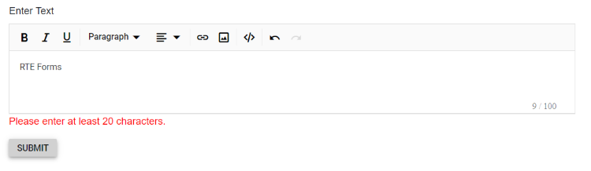

# Edit-Form Validation

The Rich Text Editor supports validation with the [EditForm](https://learn.microsoft.com/en-us/aspnet/core/blazor/forms-and-input-components?view=aspnetcore-8.0). The user-typed text content inside the editor is validated using [data annotations](https://learn.microsoft.com/en-us/aspnet/core/mvc/models/validation?view=aspnetcore-8.0) attributes. In the following example, the `FormModel` class has the `Description` property marked required with the `RequiredAttribute` and `MinLengthAttribute` for minimum string length validation and an error message. The `Description` property is bound to the editor via the `@bind-Value` property, and validation works based on user input.

N> [View the sample on GitHub.](https://github.com/SyncfusionExamples/blazor-richtexteditor-editform-validation)









## Validation attributes

The Rich Text Editor provides the functionality of character counting and its validation. So, you can validate the editor's value on form submission by applying validation attributes and validation messages to the editor.

| Rules | Description |
|----------------|---------|
| [Required](https://learn.microsoft.com/en-us/dotnet/api/system.componentmodel.dataannotations.requiredattribute?view=net-7.0) | Requires a value for the Rich Text Editor. |
| [MinLength](https://learn.microsoft.com/en-us/dotnet/api/system.componentmodel.dataannotations.minlengthattribute?view=net-7.0) | Enforces a minimum character count. |
| [MaxLength](https://learn.microsoft.com/en-us/dotnet/api/system.componentmodel.dataannotations.maxlengthattribute?view=net-7.0) | Enforces a maximum character count. |









## Custom placement of validation message

The validation error message can be displayed in a custom location instead of the default position.









N> You can refer to our [Blazor Rich Text Editor](https://www.syncfusion.com/blazor-components/blazor-wysiwyg-rich-text-editor) feature tour page for its groundbreaking feature representations. You can also explore our [Blazor Rich Text Editor](https://blazor.syncfusion.com/demos/rich-text-editor/overview?theme=bootstrap5) example to know how to render and configure the rich text editor tools.