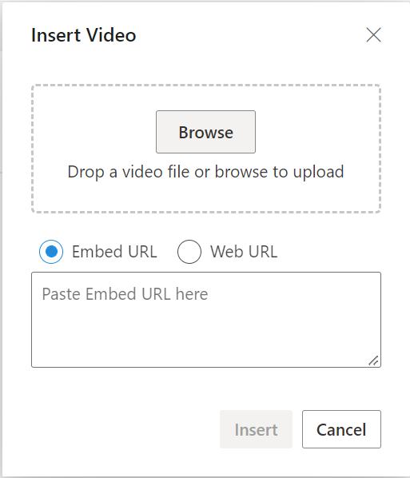
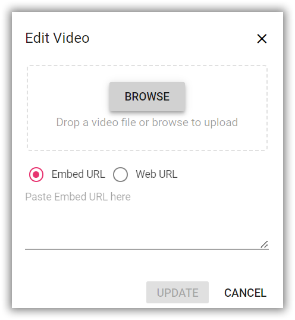
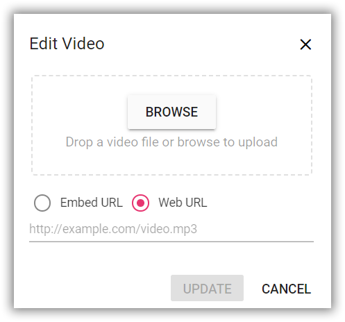
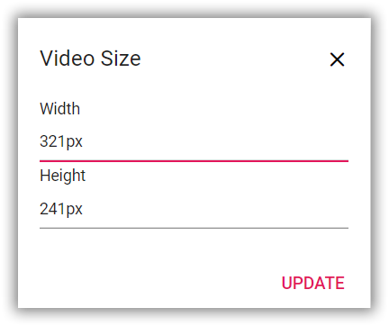

# Insert Video in RichTextEditor

The Rich Text Editor allows you to insert videos from online sources and local computers where you want to insert the video in your content. For inserting the video to the Rich Text Editor, the following list of options have been provided in the [RichTextEditorVideoSettings](https://help.syncfusion.com/cr/blazor/Syncfusion.Blazor.RichTextEditor.RichTextEditorVideoSettings.html).

| Options | Description |
|----------------|---------|
| AllowedTypes | Specifies the extensions of the video types allowed to insert on bowering and passing the extensions with comma separators. For example, pass allowedTypes as `.mp4`, `.mov`, `.wmv` and `.avi`.|
| LayoutOption | Sets the default display for an video when it is inserted in to the Rich Text Editor. Possible options are: `Inline` and `Break`.|
| SaveFormat | Sets the default save format of the video element when inserted. Possible options are: `Blob` and `Base64`.|
| Width | Sets the default width of the video when it is inserted in the Rich Text Editor.|
| MinWidth | Sets the minWidth of the video element when it is inserted in the Rich Text Editor.|
| MaxWidth | Sets the maxWidth of the video element when it is inserted in the Rich Text Editor.|
| Height | Sets the default height of the video when it is inserted in the Rich Text Editor.|
| MinHeight | Sets the minHeight of the video element when it is inserted in the Rich Text Editor.|
| MaxHeight | Sets the maxHeight of the video element when it is inserted in the Rich Text Editor.|
| SaveUrl | Provides URL to map the action result method to save the video.|
| RemoveUrl | Provides URL to map the action result method to remove the video.|
| Path | Specifies the location to store the video.|
| Resize | Sets the resizing action for the video element.|
| ResizeByPercent | Sets the percentage values for the video element with the resizing action.|

## Configure video tool in the toolbar

To include the video tool in the Rich Text Editor, you can add the toolbar item `Video` to the [RichTextEditorToolbarSettings.Items](https://help.syncfusion.com/cr/aspnetmvc-js2/Syncfusion.EJ2.RichTextEditor.RichTextEditorToolbarSettings.html#Syncfusion_EJ2_RichTextEditor_RichTextEditorToolbarSettings_Items) property.

To configure `Video` toolbar item, refer to the below code.









## Insert video from web

To insert a video from the hosted link or local machine, you should enable the video tool on the editor’s toolbar. By default, the video tool opens the dialog, allowing you to insert a video as an embedded URL. You can switch to a web URL to insert the video file from the online source.

## Insert from web URL

The video tool default opens the video dialog, allowing you to insert an embedded URL.



## Upload and insert video

In the video dialog, by using the `browse` option, select the video from the local machine and insert it into the Rich Text Editor content.

If the path field is not specified in the [RichTextEditorVideoSettings]https://help.syncfusion.com/cr/blazor/Syncfusion.Blazor.RichTextEditor.RichTextEditorVideoSettings.html), the video will be converted into `Blob` url or `Base64` and inserted inside the Rich Text Editor.

### Restrict video upload based on size

Using the Rich Text Editor `FileUploading` event, you can restrict the video to upload when the given video size is greater than the allowed fileSize. Also, the video size in the argument will be returned in `bytes`.

In the following example, the video size has been validated before uploading and determined whether the video has been uploaded or not.









### Server-side action

The selected video can be uploaded to the required destination using the controller action below. Map this method name in [RichTextEditorVideoSettings.SaveUrl]() and provide required destination path through [RichTextEditorVideoSettings.Path]() properties.

> If you want to insert lower-sized video files in the editor and don't want a specific physical location for saving the video, you can save the format as `Base64`.
In the following code blocks, you can insert the video files which are saved in the specified path.









`controller.cs`

```cshtml

using System;
using System.IO;
using FileUpload.Models;
using System.Diagnostics;
using System.Net.Http.Headers;
using Microsoft.AspNetCore.Mvc;
using Microsoft.AspNetCore.Http;
using System.Collections.Generic;
using Microsoft.AspNetCore.Hosting;
namespace FileUpload.Controllers
{
    public class HomeController : Controller
    {
        private IHostingEnvironment hostingEnv;
        public HomeController(IHostingEnvironment env)
        {
            hostingEnv = env;
        }
        public IActionResult Index()
        {
            return View();
        }
        [AcceptVerbs("Post")]
        public void SaveFiles(IList<IFormFile> UploadFiles)
        {
            try
            {
                foreach (IFormFile file in UploadFiles)
                {
                    if (UploadFiles != null)
                    {
                        string filename = ContentDispositionHeaderValue.Parse(file.ContentDisposition).FileName.Trim('"');
                        filename = hostingEnv.WebRootPath + "\\Files" + $@"\{filename}";
                        // Create a new directory, if it does not exists
                        if (!Directory.Exists(hostingEnv.WebRootPath + "\\Files"))
                        {
                            Directory.CreateDirectory(hostingEnv.WebRootPath + "\\Files");
                        }
                        if (!System.IO.File.Exists(filename))
                        {
                            using (FileStream fs = System.IO.File.Create(filename))
                            {
                                file.CopyTo(fs);
                                fs.Flush();
                            }
                            Response.StatusCode = 200;
                        }
                    }
                }
            }
            catch (Exception)
            {
                Response.StatusCode = 204;
            }
        }
        [ResponseCache(Duration = 0, Location = ResponseCacheLocation.None, NoStore = true)]
        public IActionResult Error()
        {
            return View(new ErrorViewModel { RequestId = Activity.Current?.Id ?? HttpContext.TraceIdentifier });
        }
    }
}

```

### Video save format

The video files can be saved as `Blob` or `Base64` url by using the [RichTextEditorVideoSettings.saveFormat](https://help.syncfusion.com/cr/aspnetcore-js2/Syncfusion.EJ2.RichTextEditor.RichTextEditorVideoSettings.html#Syncfusion_EJ2_RichTextEditor_RichTextEditorVideoSettings_SaveFormat) property, which is of enum type and the generated url will be set to the `src` attribute of the `<source>` tag.

> By default, the files are saved in the `Blob` format.

```cshtml

<video>
    <source src="blob:http://ej2.syncfusion.com/3ab56a6e-ec0d-490f-85a5-f0aeb0ad8879" type="video/mp4" >
</video>
<video>
    <source src="data:video/mp4;base64,iVBORw0KGgoAAAANSUhEUgAAADAAAAAwCAYAAABXAvmHA" type="video/mp4" >
</video>

```

## Replacing video

Once a video file has been inserted, you can replace it using the Rich Text Editor [RichTextEditorQuickToolbarSettings](https://help.syncfusion.com/cr/blazor/Syncfusion.Blazor.RichTextEditor.RichTextEditorQuickToolbarSettings.html#Syncfusion_Blazor_RichTextEditor_RichTextEditorQuickToolbarSettings_Audio) `videoReplace` option. You can replace the video file either by using the embedded URL or the web URL and the browse option in the video dialog.





## Delete video

To remove a video from the Rich Text Editor content, select the video and click the `videoRemove` tool from the quick toolbar. It will delete the video from the Rich Text Editor content as well as from the service location if the [RichTextEditorVideoSettings.RemoveUrl]() is given.

Once you select the video from the local machine, the URL for the video will be generated. You can remove the video from the service location by clicking the cross icon.


The following example explains how to configure `RichTextEditorVideoSettings.RemoveUrl` to remove a saved video from the remote service location when the following video remove actions are performed:

* `delete` key action.
* `backspace` key action.
* Removing uploaded video file from the insert video dialog.
* Deleting video using the quick toolbar `videoRemove` option.









`controller.cs`

```cshtml

using System;
using System.IO;
using FileUpload.Models;
using System.Diagnostics;
using System.Net.Http.Headers;
using Microsoft.AspNetCore.Mvc;
using Microsoft.AspNetCore.Http;
using System.Collections.Generic;
using Microsoft.AspNetCore.Hosting;
namespace FileUpload.Controllers
{
    public class HomeController : Controller
    {
        private IWebHostEnvironment hostingEnv;

        public HomeController(IWebHostEnvironment env)
        {
            hostingEnv = env;
        }

        public ActionResult Index()
        {
            return View();
        }

        [AcceptVerbs("Post")]
        public void SaveImage(IList<IFormFile> UploadFiles)
        {
            try
            {
                foreach (IFormFile file in UploadFiles)
                {
                    if (UploadFiles != null)
                    {
                        string filename = ContentDispositionHeaderValue.Parse(file.ContentDisposition).FileName.Trim('"');
                        filename = hostingEnv.WebRootPath + "\\Uploads" + $@"\{filename}";

                        // Create a new directory, if it does not exists
                        if (!Directory.Exists(hostingEnv.WebRootPath + "\\Uploads"))
                        {
                            Directory.CreateDirectory(hostingEnv.WebRootPath + "\\Uploads");
                        }

                        if (!System.IO.File.Exists(filename))
                        {
                            using (FileStream fs = System.IO.File.Create(filename))
                            {
                                file.CopyTo(fs);
                                fs.Flush();
                            }
                            Response.StatusCode = 200;
                        }
                    }
                }
            }
            catch (Exception)
            {
                Response.StatusCode = 204;
            }
        }

        [AcceptVerbs("Post")]
        public void RemoveImage(IList<IFormFile> UploadFiles)
        {
            try
            {
                foreach (IFormFile file in UploadFiles)
                {
                    if (UploadFiles != null)
                    {
                        // Do remove action here}
                        Response.StatusCode = 200;
                    }
                }
            }
            catch (Exception)
            {
                Response.StatusCode = 204;
            }
        }
    }
}

```

## Dimension

Set the default Width, MinWidth, Height and MinHeight of the video element, when it is inserted in the Rich Text Editor using the [Width](), [MinWidth](https://help.syncfusion.com/cr/blazor/Syncfusion.Blazor.RichTextEditor.RichTextEditorVideoSettings.html#Syncfusion_Blazor_RichTextEditor_RichTextEditorVideoSettings_MinWidth), [Height](), [MinHeight](https://help.syncfusion.com/cr/blazor/Syncfusion.Blazor.RichTextEditor.RichTextEditorVideoSettings.html#Syncfusion_Blazor_RichTextEditor_RichTextEditorVideoSettings_MinHeight) properties.

Through the [RichTextEditorQuickToolbarSettings](https://help.syncfusion.com/cr/blazor/Syncfusion.Blazor.RichTextEditor.RichTextEditorQuickToolbarSettings.html#Syncfusion_Blazor_RichTextEditor_RichTextEditorQuickToolbarSettings_Video),  also you can change the width and height using `Change Size` option. Once you click on the option, the video size dialog will open as below. In that, specify the width and height of the video in pixels.



## Display Position

Sets the default display for an video when it is inserted in the Rich Text Editor using the `RichTextEditorVideoSettings.layoutOption`. It has two possible options: `Inline` and `Break`. When updating the display positions, it updates the video elements’ layout position.









## Resize video

The Rich Text Editor has built-in video resizing support, which is enabled for the video elements added. The resize points will appear on each corner of the video when focusing so users can easily resize the video using mouse points or thumb through the resize points. Also, the resize calculation will be done based on the aspect ratio.

You can disable the resize action by configuring `false` for the [RichTextEditorVideoSettings.Resize]() property.

> If the [MinWidth](https://help.syncfusion.com/cr/blazor/Syncfusion.Blazor.RichTextEditor.RichTextEditorVideoSettings.html#Syncfusion_Blazor_RichTextEditor_RichTextEditorVideoSettings_MinWidth) and [MinHeight](https://help.syncfusion.com/cr/blazor/Syncfusion.Blazor.RichTextEditor.RichTextEditorVideoSettings.html#Syncfusion_Blazor_RichTextEditor_RichTextEditorVideoSettings_MinHeight) properties are configured the video resizing does not shrink below the specified values.


## Rename video before inserting

By using the [RichTextEditorVideoSettings](https://help.syncfusion.com/cr/blazor/Syncfusion.Blazor.RichTextEditor.RichTextEditorVideoSettings.html) property, you can specify the server handler to upload the selected video. Then by binding the `FileUploadSuccess` event, you can receive the modified file name from the server and update it in the Rich Text Editor's insert video dialog.

Refer `rename.cs` controller file for configure the server-side.










`rename.cs`

```cshtml

int x = 0;
string file;
[AcceptVerbs("Post")]
public void Rename()
{
    try
    {
        var httpPostedFile = System.Web.HttpContext.Current.Request.Files["UploadFiles"];
        fileName = httpPostedFile.FileName;
        if (httpPostedFile != null)
        {
            var fileSave = System.Web.HttpContext.Current.Server.MapPath("~/Files");
            if (!Directory.Exists(fileSave))
            {
                Directory.CreateDirectory(fileSave);
            }
            var fileName = Path.GetFileName(httpPostedFile.FileName);
            var fileSavePath = Path.Combine(fileSave, fileName);
            while (System.IO.File.Exists(fileSavePath))
            {
                fileName = "rteFiles" + x + "-" + fileName;
                fileSavePath = Path.Combine(fileSave, fileName);
                x++;
            }
            if (!System.IO.File.Exists(fileSavePath))
            {
                httpPostedFile.SaveAs(fileSavePath);
                HttpResponse Response = System.Web.HttpContext.Current.Response;
                Response.Clear();
                Response.Headers.Add("name", fileName);
                Response.ContentType = "application/json; charset=utf-8";
                Response.StatusDescription = "File uploaded succesfully";
                Response.End();
            }
        }
    }
    catch (Exception e)
    {
        HttpResponse Response = System.Web.HttpContext.Current.Response;
        Response.Clear();
        Response.ContentType = "application/json; charset=utf-8";
        Response.StatusCode = 204;
        Response.Status = "204 No Content";
        Response.StatusDescription = e.Message;
        Response.End();
    }
}

```

## Upload video with authentication

The Rich Text Editor control allows you to add additional data with the File Upload, which can be received on the server side. By using the `FileUploading` event and its `CustomFormData` argument, you can pass parameters to the controller action. On the server side, you can fetch the custom headers by accessing the form collection from the current request, which retrieves the values sent using the POST method.

> By default it doesn't support `UseDefaultCredentials` property, we need to manually append the default credentials with the upload request.









`controller.cs`

```cshtml

using System;
using System.IO;
using FileUpload.Models;
using System.Diagnostics;
using System.Net.Http.Headers;
using Microsoft.AspNetCore.Mvc;
using Microsoft.AspNetCore.Http;
using System.Collections.Generic;
using Microsoft.AspNetCore.Hosting;

namespace FileUpload.Controllers
{
    public class HomeController : Controller
    {
        private IHostingEnvironment hostingEnv;

        public HomeController(IHostingEnvironment env)
        {
            hostingEnv = env;
        }

        public IActionResult Index()
        {
            return View();
        }

        [AcceptVerbs("Post")]
        public void SaveFiles(IList<IFormFile> UploadFiles)
        {
            string currentPath = Request.Form["Authorization"].ToString();
            try
            {
                foreach (IFormFile file in UploadFiles)
                {
                    if (UploadFiles != null)
                    {
                        string filename = ContentDispositionHeaderValue.Parse(file.ContentDisposition).FileName.Trim('"');
                        filename = hostingEnv.WebRootPath + "\\Files" + $@"\{filename}";

                        // Create a new directory, if it does not exists
                        if (!Directory.Exists(hostingEnv.WebRootPath + "\\Files"))
                        {
                            Directory.CreateDirectory(hostingEnv.WebRootPath + "\\Files");
                        }

                        if (!System.IO.File.Exists(filename))
                        {
                            using (FileStream fs = System.IO.File.Create(filename))
                            {
                                file.CopyTo(fs);
                                fs.Flush();
                            }
                            Response.StatusCode = 200;
                        }
                    }
                }
            }
            catch (Exception)
            {
                Response.StatusCode = 204;
            }
        }

        [ResponseCache(Duration = 0, Location = ResponseCacheLocation.None, NoStore = true)]
        public IActionResult Error()
        {
            return View(new ErrorViewModel { RequestId = Activity.Current?.Id ?? HttpContext.TraceIdentifier });
        }
    }
}

```

## See Also

* [How to edit the quick toolbar settings](./toolbar/#quick-toolbar)
* [How to use link editing option in the toolbar items](./link)