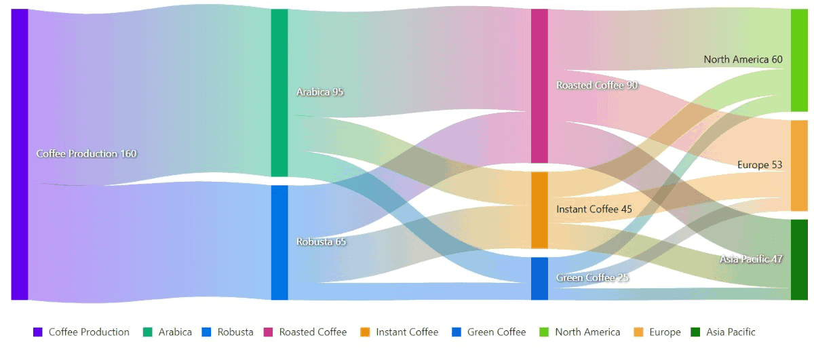
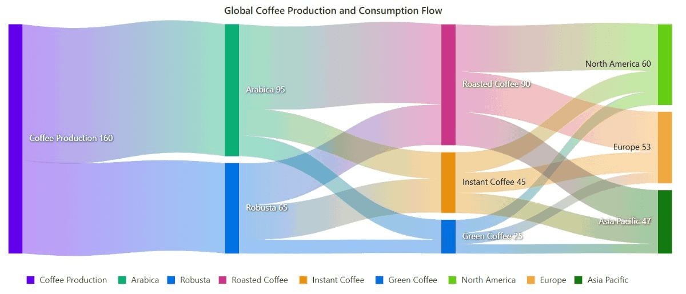

<!-- markdownlint-disable MD040 -->

# Getting Started with Blazor Sankey Component in Blazor WASM App

This section briefly explains about how to include [Blazor Sankey](https://www.syncfusion.com/blazor-components/blazor-charts) component in your Blazor WASM App using Visual Studio.

## Prerequisites

* [System requirements for Blazor components](https://blazor.syncfusion.com/documentation/system-requirements)

## Create a new Blazor App in Visual Studio

You can create a **Blazor WebAssembly App** using Visual Studio via [Microsoft Templates](https://learn.microsoft.com/en-us/aspnet/core/blazor/tooling?view=aspnetcore-7.0) or the [Syncfusion Blazor Extension](https://blazor.syncfusion.com/documentation/visual-studio-integration/template-studio).

## Install Syncfusion Blazor Sankey NuGet in the App

To add **Blazor Sankey** component in the app, open the NuGet package manager in Visual Studio (*Tools → NuGet Package Manager → Manage NuGet Packages for Solution*), search and install [Syncfusion.Blazor.Sankey](https://www.nuget.org/packages/Syncfusion.Blazor.Sankey). Alternatively, you can utilize the following package manager command to achieve the same.




Install-Package Syncfusion.Blazor.Sankey -Version {{ site.releaseversion }}




N> Syncfusion Blazor components are available in [nuget.org](https://www.nuget.org/packages?q=syncfusion.blazor). Refer to [NuGet packages](https://blazor.syncfusion.com/documentation/nuget-packages) topic for available NuGet packages list with component details.

## Register Syncfusion Blazor Service

Open **~/_Imports.razor** file and import the Syncfusion.Blazor namespace.




@using Syncfusion.Blazor
@using Syncfusion.Blazor.Sankey




Now, register the Syncfusion Blazor Service in the **~/Program.cs** file of your Blazor WASM App.




using Microsoft.AspNetCore.Components;
using Microsoft.AspNetCore.Components.Web;
using Syncfusion.Blazor;

var builder = WebApplication.CreateBuilder(args);

// Add services to the container.
builder.Services.AddRazorPages();
builder.Services.AddServerSideBlazor();
builder.Services.AddSyncfusionBlazor();

var app = builder.Build();
....




## Add script resources

The script can be accessed from NuGet through [Static Web Assets](https://blazor.syncfusion.com/documentation/appearance/themes#static-web-assets). Reference the script in the `<head>` of the main page as follows:

* For **.NET 6** Blazor WASM App, include it in **~/Pages/_Layout.cshtml** file.

* For **.NET 7** Blazor WASM App, include it in the **~/Pages/_Host.cshtml** file.

```html
<head>
    ....
    <script src="_content/Syncfusion.Blazor.Core/scripts/syncfusion-blazor.min.js" type="text/javascript"></script>
</head>
```
N> Check out the [Adding Script Reference](https://blazor.syncfusion.com/documentation/common/adding-script-references) topic to learn different approaches for adding script references in your Blazor application.

## Add Blazor Sankey Component

Add the Syncfusion Blazor Sankey component in the **~/Pages/Index.razor** file.




<SfSankey Nodes=@Nodes Links=@Links>

</SfSankey>

@code {
    public List<SankeyDataNode> Nodes = new List<SankeyDataNode>();
    public List<SankeyDataLink> Links = new List<SankeyDataLink>();

    protected override void OnInitialized()
    {
        Nodes = new List<SankeyDataNode>()
        {
            new SankeyDataNode() { Id = "Coffee Production" },
            new SankeyDataNode() { Id = "Arabica" },
            new SankeyDataNode() { Id = "Robusta" },
            new SankeyDataNode() { Id = "Roasted Coffee" },
            new SankeyDataNode() { Id = "Instant Coffee" },
            new SankeyDataNode() { Id = "Green Coffee" },
            new SankeyDataNode() { Id = "North America" },
            new SankeyDataNode() { Id = "Europe" },
            new SankeyDataNode() { Id = "Asia Pacific" },
        };
        Links = new List<SankeyDataLink>()
        {
            new SankeyDataLink() { SourceId = "Coffee Production", TargetId = "Arabica", Value = 95 },
            new SankeyDataLink() { SourceId = "Coffee Production", TargetId = "Robusta", Value = 65 },
            new SankeyDataLink() { SourceId = "Arabica", TargetId = "Roasted Coffee", Value = 60 },
            new SankeyDataLink() { SourceId = "Arabica", TargetId = "Instant Coffee", Value = 20 },
            new SankeyDataLink() { SourceId = "Arabica", TargetId = "Green Coffee", Value = 15 },
            new SankeyDataLink() { SourceId = "Robusta", TargetId = "Roasted Coffee", Value = 30 },
            new SankeyDataLink() { SourceId = "Robusta", TargetId = "Instant Coffee", Value = 25 },
            new SankeyDataLink() { SourceId = "Robusta", TargetId = "Green Coffee", Value = 10 },
            new SankeyDataLink() { SourceId = "Roasted Coffee", TargetId = "North America", Value = 35 },
            new SankeyDataLink() { SourceId = "Roasted Coffee", TargetId = "Europe", Value = 30 },
            new SankeyDataLink() { SourceId = "Roasted Coffee", TargetId = "Asia Pacific", Value = 25 },
            new SankeyDataLink() { SourceId = "Instant Coffee", TargetId = "North America", Value = 15 },
            new SankeyDataLink() { SourceId = "Instant Coffee", TargetId = "Europe", Value = 15 },
            new SankeyDataLink() { SourceId = "Instant Coffee", TargetId = "Asia Pacific", Value = 15 },
            new SankeyDataLink() { SourceId = "Green Coffee", TargetId = "North America", Value = 10 },
            new SankeyDataLink() { SourceId = "Green Coffee", TargetId = "Europe", Value = 8 },
            new SankeyDataLink() { SourceId = "Green Coffee", TargetId = "Asia Pacific", Value = 7 },
        };
        base.OnInitialized();
    }
}




* Press <kbd>Ctrl</kbd>+<kbd>F5</kbd> (Windows) or <kbd>⌘</kbd>+<kbd>F5</kbd> (macOS) to launch the application. This will render the Syncfusion Blazor Sankey component in your default web browser.



## Populate Blazor Sankey with data

To bind data for the sankey, you can assign an IEnumerable object to the [Nodes]() and [Links]() properties. These properties define the structure of the nodes and the relationships between them.




<SfSankey Nodes=@Nodes Links=@Links>

</SfSankey>

@code {
    public List<SankeyDataNode> Nodes = new List<SankeyDataNode>();
    public List<SankeyDataLink> Links = new List<SankeyDataLink>();

    protected override void OnInitialized()
    {
        Nodes = new List<SankeyDataNode>()
        {
            new SankeyDataNode() { Id = "Coffee Production" },
            new SankeyDataNode() { Id = "Arabica" },
            new SankeyDataNode() { Id = "Robusta" },
            new SankeyDataNode() { Id = "Roasted Coffee" },
            new SankeyDataNode() { Id = "Instant Coffee" },
            new SankeyDataNode() { Id = "Green Coffee" },
            new SankeyDataNode() { Id = "North America" },
            new SankeyDataNode() { Id = "Europe" },
            new SankeyDataNode() { Id = "Asia Pacific" },
        };
        Links = new List<SankeyDataLink>()
        {
            new SankeyDataLink() { SourceId = "Coffee Production", TargetId = "Arabica", Value = 95 },
            new SankeyDataLink() { SourceId = "Coffee Production", TargetId = "Robusta", Value = 65 },
            new SankeyDataLink() { SourceId = "Arabica", TargetId = "Roasted Coffee", Value = 60 },
            new SankeyDataLink() { SourceId = "Arabica", TargetId = "Instant Coffee", Value = 20 },
            new SankeyDataLink() { SourceId = "Arabica", TargetId = "Green Coffee", Value = 15 },
            new SankeyDataLink() { SourceId = "Robusta", TargetId = "Roasted Coffee", Value = 30 },
            new SankeyDataLink() { SourceId = "Robusta", TargetId = "Instant Coffee", Value = 25 },
            new SankeyDataLink() { SourceId = "Robusta", TargetId = "Green Coffee", Value = 10 },
            new SankeyDataLink() { SourceId = "Roasted Coffee", TargetId = "North America", Value = 35 },
            new SankeyDataLink() { SourceId = "Roasted Coffee", TargetId = "Europe", Value = 30 },
            new SankeyDataLink() { SourceId = "Roasted Coffee", TargetId = "Asia Pacific", Value = 25 },
            new SankeyDataLink() { SourceId = "Instant Coffee", TargetId = "North America", Value = 15 },
            new SankeyDataLink() { SourceId = "Instant Coffee", TargetId = "Europe", Value = 15 },
            new SankeyDataLink() { SourceId = "Instant Coffee", TargetId = "Asia Pacific", Value = 15 },
            new SankeyDataLink() { SourceId = "Green Coffee", TargetId = "North America", Value = 10 },
            new SankeyDataLink() { SourceId = "Green Coffee", TargetId = "Europe", Value = 8 },
            new SankeyDataLink() { SourceId = "Green Coffee", TargetId = "Asia Pacific", Value = 7 },
        };
        base.OnInitialized();
    }
}




## Add titles

Using the [Title]() property, you can add a title to the sankey to provide the user with quick information about the data plotted in the chart.




<SfSankey Title="Global Coffee Production and Consumption Flow" Nodes=@Nodes Links=@Links>
</SfSankey>





## Add data label to node label

You can add data labels to improve the readability of the sankey. This can be achieved by setting the [Visible]() property to **true** in the [SankeyLabelSettings]().




<SfSankey Title="Global Coffee Production and Consumption Flow" Nodes=@Nodes Links=@Links>
    <SankeyLabelSettings Visible="true"></SankeyLabelSettings>
</SfSankey>





## Enable tooltip

The tooltip can be enabled by setting the [Enable]() property in [SankeyTooltipSettings]() to **true**. However, the tooltip is enabled by default in the sankey.




<SfSankey Title="Global Coffee Production and Consumption Flow" Nodes=@Nodes Links=@Links>
   <SankeyTooltipSettings Enable="true"></SankeyTooltipSettings>
</SfSankey>





## Enable legend

You can use legend for the sankey by setting the [Visible]() property to **true** in [SankeyLegendSettings](). However, the legend is enabled by default in the sankey.




<SfSankey Title="Global Coffee Production and Consumption Flow" Nodes=@Nodes Links=@Links>
    <SankeyLegendSettings Visible="true"></SankeyLegendSettings>
</SfSankey>






N> [View Sample in GitHub](https://github.com/SyncfusionExamples/Blazor-Getting-Started-Examples/tree/main/Chart).

## See also

* [Getting Started with Syncfusion Blazor for Client-Side in .NET Core CLI](https://blazor.syncfusion.com/documentation/getting-started/blazor-webassembly-dotnet-cli)
* [Getting Started with Syncfusion Blazor for Server-Side in Visual Studio](https://blazor.syncfusion.com/documentation/getting-started/blazor-server-side-visual-studio)
* [Getting Started with Syncfusion Blazor for Server-Side in .NET Core CLI](https://blazor.syncfusion.com/documentation/getting-started/blazor-server-side-dotnet-cli)
