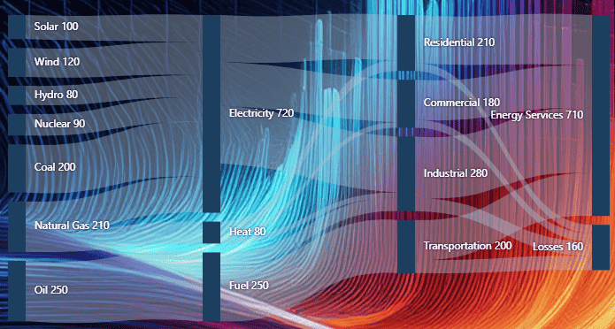

# Blazor Sankey Diagram: Customization

The Blazor Sankey Diagram includes extensive options to tailor appearance and behavior. This guide covers background styling, dimensions, right-to-left (RTL) layout, and orientation.

## Setting Background

Customize the diagram background using `BackgroundColor` and `BackgroundImage`. `BackgroundColor` accepts any valid CSS color (hex, named color, rgb/rgba). `BackgroundImage` applies an image by specifying its URL or file path.




@using Syncfusion.Blazor;
@using Syncfusion.Blazor.Sankey;

<SfSankey BackgroundColor="@_backgroundColor" Nodes=@Nodes Links=@Links>
    <SankeyNodeSettings Color="#1c3f60" ></SankeyNodeSettings>
    <SankeyLinkSettings Color="#afc1d0" ></SankeyLinkSettings>
    <SankeyLabelSettings Color="#FFFFFF" FontWeight="400" ></SankeyLabelSettings>
    <SankeyLegendSettings Visible="false"></SankeyLegendSettings>
</SfSankey>

@code {
    string _backgroundColor = "#0b1320";
    public List<SankeyDataNode> Nodes = new List<SankeyDataNode>();
    public List<SankeyDataLink> Links = new List<SankeyDataLink>();
    protected override void OnInitialized()
    {
        Nodes = new List<SankeyDataNode>()
        {
            new SankeyDataNode() { Id = "Solar", Label = new SankeyDataLabel() { Text = "Solar" } },
            new SankeyDataNode() { Id = "Wind", Label = new SankeyDataLabel() { Text = "Wind" } },
            new SankeyDataNode() { Id = "Hydro", Label = new SankeyDataLabel() { Text = "Hydro" } },
            new SankeyDataNode() { Id = "Nuclear", Label = new SankeyDataLabel() { Text = "Nuclear" } },
            new SankeyDataNode() { Id = "Coal", Label = new SankeyDataLabel() { Text = "Coal" } },
            new SankeyDataNode() { Id = "Natural Gas", Label = new SankeyDataLabel() { Text = "Natural Gas" } },
            new SankeyDataNode() { Id = "Oil", Label = new SankeyDataLabel() { Text = "Oil" } },
            new SankeyDataNode() { Id = "Electricity", Label = new SankeyDataLabel() { Text = "Electricity" } },
            new SankeyDataNode() { Id = "Heat", Label = new SankeyDataLabel() { Text = "Heat" } },
            new SankeyDataNode() { Id = "Fuel", Label = new SankeyDataLabel() { Text = "Fuel" } },
            new SankeyDataNode() { Id = "Residential", Label = new SankeyDataLabel() { Text = "Residential" } },
            new SankeyDataNode() { Id = "Commercial", Label = new SankeyDataLabel() { Text = "Commercial" } },
            new SankeyDataNode() { Id = "Industrial", Label = new SankeyDataLabel() { Text = "Industrial" } },
            new SankeyDataNode() { Id = "Transportation", Label = new SankeyDataLabel() { Text = "Transportation" } },
            new SankeyDataNode() { Id = "Energy Services", Label = new SankeyDataLabel() { Text = "Energy Services" } },
            new SankeyDataNode() { Id = "Losses", Label = new SankeyDataLabel() { Text = "Losses" } }
        };

        Links = new List<SankeyDataLink>()
        {
            // Energy Sources to Carriers
            new SankeyDataLink() { SourceId = "Solar", TargetId = "Electricity", Value = 100 },
            new SankeyDataLink() { SourceId = "Wind", TargetId = "Electricity", Value = 120 },
            new SankeyDataLink() { SourceId = "Hydro", TargetId = "Electricity", Value = 80 },
            new SankeyDataLink() { SourceId = "Nuclear", TargetId = "Electricity", Value = 90 },
            new SankeyDataLink() { SourceId = "Coal", TargetId = "Electricity", Value = 200 },
            new SankeyDataLink() { SourceId = "Natural Gas", TargetId = "Electricity", Value = 130 },
            new SankeyDataLink() { SourceId = "Natural Gas", TargetId = "Heat", Value = 80 },
            new SankeyDataLink() { SourceId = "Oil", TargetId = "Fuel", Value = 250 },

            // Energy Carriers to Sectors
            new SankeyDataLink() { SourceId = "Electricity", TargetId = "Residential", Value = 170 },
            new SankeyDataLink() { SourceId = "Electricity", TargetId = "Commercial", Value = 160 },
            new SankeyDataLink() { SourceId = "Electricity", TargetId = "Industrial", Value = 210 },
            new SankeyDataLink() { SourceId = "Heat", TargetId = "Residential", Value = 40 },
            new SankeyDataLink() { SourceId = "Heat", TargetId = "Commercial", Value = 20 },
            new SankeyDataLink() { SourceId = "Heat", TargetId = "Industrial", Value = 20 },
            new SankeyDataLink() { SourceId = "Fuel", TargetId = "Transportation", Value = 200 },
            new SankeyDataLink() { SourceId = "Fuel", TargetId = "Industrial", Value = 50 },

            // Sectors to End Use and Losses
            new SankeyDataLink() { SourceId = "Residential", TargetId = "Energy Services", Value = 180 },
            new SankeyDataLink() { SourceId = "Commercial", TargetId = "Energy Services", Value = 150 },
            new SankeyDataLink() { SourceId = "Industrial", TargetId = "Energy Services", Value = 230 },
            new SankeyDataLink() { SourceId = "Transportation", TargetId = "Energy Services", Value = 150 },
            new SankeyDataLink() { SourceId = "Residential", TargetId = "Losses", Value = 30 },
            new SankeyDataLink() { SourceId = "Commercial", TargetId = "Losses", Value = 30 },
            new SankeyDataLink() { SourceId = "Industrial", TargetId = "Losses", Value = 50 },
            new SankeyDataLink() { SourceId = "Transportation", TargetId = "Losses", Value = 50 }
        };
        base.OnInitialized();
    }
}




**Background Image**




<SfSankey BackgroundImage="sankey-bg-img.webp" Nodes=@Nodes Links=@Links>
...
</SfSankey>




## Dimensions (Width and Height)

Control diagram size using `Width` and `Height`. Values can be specified in pixels or percentages.




@using Syncfusion.Blazor;
@using Syncfusion.Blazor.Sankey;

<SfSankey Width="@_width" Height="@_height" Nodes=@Nodes Links=@Links>
</SfSankey>

@code {
    string _width = "800px";
    string _height = "450px";
    public List<SankeyDataNode> Nodes = new List<SankeyDataNode>();
    public List<SankeyDataLink> Links = new List<SankeyDataLink>();
    protected override void OnInitialized()
    {
        Nodes = new List<SankeyDataNode>()
        {
            new SankeyDataNode() { Id = "Solar", Label = new SankeyDataLabel() { Text = "Solar" } },
            new SankeyDataNode() { Id = "Wind", Label = new SankeyDataLabel() { Text = "Wind" } },
            new SankeyDataNode() { Id = "Hydro", Label = new SankeyDataLabel() { Text = "Hydro" } },
            new SankeyDataNode() { Id = "Nuclear", Label = new SankeyDataLabel() { Text = "Nuclear" } },
            new SankeyDataNode() { Id = "Coal", Label = new SankeyDataLabel() { Text = "Coal" } },
            new SankeyDataNode() { Id = "Natural Gas", Label = new SankeyDataLabel() { Text = "Natural Gas" } },
            new SankeyDataNode() { Id = "Oil", Label = new SankeyDataLabel() { Text = "Oil" } },
            new SankeyDataNode() { Id = "Electricity", Label = new SankeyDataLabel() { Text = "Electricity" } },
            new SankeyDataNode() { Id = "Heat", Label = new SankeyDataLabel() { Text = "Heat" } },
            new SankeyDataNode() { Id = "Fuel", Label = new SankeyDataLabel() { Text = "Fuel" } },
            new SankeyDataNode() { Id = "Residential", Label = new SankeyDataLabel() { Text = "Residential" } },
            new SankeyDataNode() { Id = "Commercial", Label = new SankeyDataLabel() { Text = "Commercial" } },
            new SankeyDataNode() { Id = "Industrial", Label = new SankeyDataLabel() { Text = "Industrial" } },
            new SankeyDataNode() { Id = "Transportation", Label = new SankeyDataLabel() { Text = "Transportation" } },
            new SankeyDataNode() { Id = "Energy Services", Label = new SankeyDataLabel() { Text = "Energy Services" } },
            new SankeyDataNode() { Id = "Losses", Label = new SankeyDataLabel() { Text = "Losses" } }
        };

        Links = new List<SankeyDataLink>()
        {
            // Energy Sources to Carriers
            new SankeyDataLink() { SourceId = "Solar", TargetId = "Electricity", Value = 100 },
            new SankeyDataLink() { SourceId = "Wind", TargetId = "Electricity", Value = 120 },
            new SankeyDataLink() { SourceId = "Hydro", TargetId = "Electricity", Value = 80 },
            new SankeyDataLink() { SourceId = "Nuclear", TargetId = "Electricity", Value = 90 },
            new SankeyDataLink() { SourceId = "Coal", TargetId = "Electricity", Value = 200 },
            new SankeyDataLink() { SourceId = "Natural Gas", TargetId = "Electricity", Value = 130 },
            new SankeyDataLink() { SourceId = "Natural Gas", TargetId = "Heat", Value = 80 },
            new SankeyDataLink() { SourceId = "Oil", TargetId = "Fuel", Value = 250 },

            // Energy Carriers to Sectors
            new SankeyDataLink() { SourceId = "Electricity", TargetId = "Residential", Value = 170 },
            new SankeyDataLink() { SourceId = "Electricity", TargetId = "Commercial", Value = 160 },
            new SankeyDataLink() { SourceId = "Electricity", TargetId = "Industrial", Value = 210 },
            new SankeyDataLink() { SourceId = "Heat", TargetId = "Residential", Value = 40 },
            new SankeyDataLink() { SourceId = "Heat", TargetId = "Commercial", Value = 20 },
            new SankeyDataLink() { SourceId = "Heat", TargetId = "Industrial", Value = 20 },
            new SankeyDataLink() { SourceId = "Fuel", TargetId = "Transportation", Value = 200 },
            new SankeyDataLink() { SourceId = "Fuel", TargetId = "Industrial", Value = 50 },

            // Sectors to End Use and Losses
            new SankeyDataLink() { SourceId = "Residential", TargetId = "Energy Services", Value = 180 },
            new SankeyDataLink() { SourceId = "Commercial", TargetId = "Energy Services", Value = 150 },
            new SankeyDataLink() { SourceId = "Industrial", TargetId = "Energy Services", Value = 230 },
            new SankeyDataLink() { SourceId = "Transportation", TargetId = "Energy Services", Value = 150 },
            new SankeyDataLink() { SourceId = "Residential", TargetId = "Losses", Value = 30 },
            new SankeyDataLink() { SourceId = "Commercial", TargetId = "Losses", Value = 30 },
            new SankeyDataLink() { SourceId = "Industrial", TargetId = "Losses", Value = 50 },
            new SankeyDataLink() { SourceId = "Transportation", TargetId = "Losses", Value = 50 }
        };
        base.OnInitialized();
    }
}




## Right-to-Left (RTL) Support

Enable RTL by setting `EnableRTL` to `true`. The entire layout—including nodes, links, labels, and legend—adapts to right‑to‑left flow.

**Effects of enabling RTL**

1. Node order is reversed, placing the first node on the right.
2. Link direction flows right‑to‑left.
3. Labels align for RTL reading.
4. Tooltips, if enabled, position appropriately for RTL.
5. Legend layout and order are mirrored.




@using Syncfusion.Blazor;
@using Syncfusion.Blazor.Sankey;

<SfSankey Nodes=@Nodes Links=@Links EnableRTL="true">
</SfSankey>

@code {
    string _width = "800px";
    string _height = "450px";
    public List<SankeyDataNode> Nodes = new List<SankeyDataNode>();
    public List<SankeyDataLink> Links = new List<SankeyDataLink>();
    protected override void OnInitialized()
    {
        Nodes = new List<SankeyDataNode>()
        {
            new SankeyDataNode() { Id = "Solar", Label = new SankeyDataLabel() { Text = "Solar" } },
            new SankeyDataNode() { Id = "Wind", Label = new SankeyDataLabel() { Text = "Wind" } },
            new SankeyDataNode() { Id = "Hydro", Label = new SankeyDataLabel() { Text = "Hydro" } },
            new SankeyDataNode() { Id = "Nuclear", Label = new SankeyDataLabel() { Text = "Nuclear" } },
            new SankeyDataNode() { Id = "Coal", Label = new SankeyDataLabel() { Text = "Coal" } },
            new SankeyDataNode() { Id = "Natural Gas", Label = new SankeyDataLabel() { Text = "Natural Gas" } },
            new SankeyDataNode() { Id = "Oil", Label = new SankeyDataLabel() { Text = "Oil" } },
            new SankeyDataNode() { Id = "Electricity", Label = new SankeyDataLabel() { Text = "Electricity" } },
            new SankeyDataNode() { Id = "Heat", Label = new SankeyDataLabel() { Text = "Heat" } },
            new SankeyDataNode() { Id = "Fuel", Label = new SankeyDataLabel() { Text = "Fuel" } },
            new SankeyDataNode() { Id = "Residential", Label = new SankeyDataLabel() { Text = "Residential" } },
            new SankeyDataNode() { Id = "Commercial", Label = new SankeyDataLabel() { Text = "Commercial" } },
            new SankeyDataNode() { Id = "Industrial", Label = new SankeyDataLabel() { Text = "Industrial" } },
            new SankeyDataNode() { Id = "Transportation", Label = new SankeyDataLabel() { Text = "Transportation" } },
            new SankeyDataNode() { Id = "Energy Services", Label = new SankeyDataLabel() { Text = "Energy Services" } },
            new SankeyDataNode() { Id = "Losses", Label = new SankeyDataLabel() { Text = "Losses" } }
        };

        Links = new List<SankeyDataLink>()
        {
            // Energy Sources to Carriers
            new SankeyDataLink() { SourceId = "Solar", TargetId = "Electricity", Value = 100 },
            new SankeyDataLink() { SourceId = "Wind", TargetId = "Electricity", Value = 120 },
            new SankeyDataLink() { SourceId = "Hydro", TargetId = "Electricity", Value = 80 },
            new SankeyDataLink() { SourceId = "Nuclear", TargetId = "Electricity", Value = 90 },
            new SankeyDataLink() { SourceId = "Coal", TargetId = "Electricity", Value = 200 },
            new SankeyDataLink() { SourceId = "Natural Gas", TargetId = "Electricity", Value = 130 },
            new SankeyDataLink() { SourceId = "Natural Gas", TargetId = "Heat", Value = 80 },
            new SankeyDataLink() { SourceId = "Oil", TargetId = "Fuel", Value = 250 },

            // Energy Carriers to Sectors
            new SankeyDataLink() { SourceId = "Electricity", TargetId = "Residential", Value = 170 },
            new SankeyDataLink() { SourceId = "Electricity", TargetId = "Commercial", Value = 160 },
            new SankeyDataLink() { SourceId = "Electricity", TargetId = "Industrial", Value = 210 },
            new SankeyDataLink() { SourceId = "Heat", TargetId = "Residential", Value = 40 },
            new SankeyDataLink() { SourceId = "Heat", TargetId = "Commercial", Value = 20 },
            new SankeyDataLink() { SourceId = "Heat", TargetId = "Industrial", Value = 20 },
            new SankeyDataLink() { SourceId = "Fuel", TargetId = "Transportation", Value = 200 },
            new SankeyDataLink() { SourceId = "Fuel", TargetId = "Industrial", Value = 50 },

            // Sectors to End Use and Losses
            new SankeyDataLink() { SourceId = "Residential", TargetId = "Energy Services", Value = 180 },
            new SankeyDataLink() { SourceId = "Commercial", TargetId = "Energy Services", Value = 150 },
            new SankeyDataLink() { SourceId = "Industrial", TargetId = "Energy Services", Value = 230 },
            new SankeyDataLink() { SourceId = "Transportation", TargetId = "Energy Services", Value = 150 },
            new SankeyDataLink() { SourceId = "Residential", TargetId = "Losses", Value = 30 },
            new SankeyDataLink() { SourceId = "Commercial", TargetId = "Losses", Value = 30 },
            new SankeyDataLink() { SourceId = "Industrial", TargetId = "Losses", Value = 50 },
            new SankeyDataLink() { SourceId = "Transportation", TargetId = "Losses", Value = 50 }
        };
        base.OnInitialized();
    }
}



## Orientation

Control the flow direction using the `Orientation` property. Values include `Horizontal`, `Vertical`, and `Auto` (default). Vertical orientation can be effective for tall layouts or to emphasize top‑down relationships.

**Changes in vertical orientation**

1. Nodes are arranged from top to bottom.
2. Links flow downward between nodes.
3. Labels align with the vertical flow (node labels typically to the right).
4. Space can be used more efficiently for many nodes or longer labels.
5. A top‑down arrangement can imply hierarchical or sequential relationships.
6. Vertical layouts can be more responsive on narrow screens.
7. Large diagrams scroll vertically instead of horizontally.




<SfSankey Width="@_width" Height="@_height" Nodes=@Nodes Links=@Links Orientation="SankeyOrientation.Vertical">
</SfSankey>

@code {
    string _width = "650px";
    string _height = "650px";
    public List<SankeyDataNode> Nodes = new List<SankeyDataNode>();
    public List<SankeyDataLink> Links = new List<SankeyDataLink>();
    protected override void OnInitialized()
    {
        Nodes = new List<SankeyDataNode>()
        {
            new SankeyDataNode() { Id = "Solar", Label = new SankeyDataLabel() { Text = "Solar" } },
            new SankeyDataNode() { Id = "Wind", Label = new SankeyDataLabel() { Text = "Wind" } },
            new SankeyDataNode() { Id = "Hydro", Label = new SankeyDataLabel() { Text = "Hydro" } },
            new SankeyDataNode() { Id = "Nuclear", Label = new SankeyDataLabel() { Text = "Nuclear" } },
            new SankeyDataNode() { Id = "Coal", Label = new SankeyDataLabel() { Text = "Coal" } },
            new SankeyDataNode() { Id = "Natural Gas", Label = new SankeyDataLabel() { Text = "Natural Gas" } },
            new SankeyDataNode() { Id = "Oil", Label = new SankeyDataLabel() { Text = "Oil" } },
            new SankeyDataNode() { Id = "Electricity", Label = new SankeyDataLabel() { Text = "Electricity" } },
            new SankeyDataNode() { Id = "Heat", Label = new SankeyDataLabel() { Text = "Heat" } },
            new SankeyDataNode() { Id = "Fuel", Label = new SankeyDataLabel() { Text = "Fuel" } },
            new SankeyDataNode() { Id = "Residential", Label = new SankeyDataLabel() { Text = "Residential" } },
            new SankeyDataNode() { Id = "Commercial", Label = new SankeyDataLabel() { Text = "Commercial" } },
            new SankeyDataNode() { Id = "Industrial", Label = new SankeyDataLabel() { Text = "Industrial" } },
            new SankeyDataNode() { Id = "Transportation", Label = new SankeyDataLabel() { Text = "Transportation" } },
            new SankeyDataNode() { Id = "Energy Services", Label = new SankeyDataLabel() { Text = "Energy Services" } },
            new SankeyDataNode() { Id = "Losses", Label = new SankeyDataLabel() { Text = "Losses" } }
        };

        Links = new List<SankeyDataLink>()
        {
            // Energy Sources to Carriers
            new SankeyDataLink() { SourceId = "Solar", TargetId = "Electricity", Value = 100 },
            new SankeyDataLink() { SourceId = "Wind", TargetId = "Electricity", Value = 120 },
            new SankeyDataLink() { SourceId = "Hydro", TargetId = "Electricity", Value = 80 },
            new SankeyDataLink() { SourceId = "Nuclear", TargetId = "Electricity", Value = 90 },
            new SankeyDataLink() { SourceId = "Coal", TargetId = "Electricity", Value = 200 },
            new SankeyDataLink() { SourceId = "Natural Gas", TargetId = "Electricity", Value = 130 },
            new SankeyDataLink() { SourceId = "Natural Gas", TargetId = "Heat", Value = 80 },
            new SankeyDataLink() { SourceId = "Oil", TargetId = "Fuel", Value = 250 },

            // Energy Carriers to Sectors
            new SankeyDataLink() { SourceId = "Electricity", TargetId = "Residential", Value = 170 },
            new SankeyDataLink() { SourceId = "Electricity", TargetId = "Commercial", Value = 160 },
            new SankeyDataLink() { SourceId = "Electricity", TargetId = "Industrial", Value = 210 },
            new SankeyDataLink() { SourceId = "Heat", TargetId = "Residential", Value = 40 },
            new SankeyDataLink() { SourceId = "Heat", TargetId = "Commercial", Value = 20 },
            new SankeyDataLink() { SourceId = "Heat", TargetId = "Industrial", Value = 20 },
            new SankeyDataLink() { SourceId = "Fuel", TargetId = "Transportation", Value = 200 },
            new SankeyDataLink() { SourceId = "Fuel", TargetId = "Industrial", Value = 50 },

            // Sectors to End Use and Losses
            new SankeyDataLink() { SourceId = "Residential", TargetId = "Energy Services", Value = 180 },
            new SankeyDataLink() { SourceId = "Commercial", TargetId = "Energy Services", Value = 150 },
            new SankeyDataLink() { SourceId = "Industrial", TargetId = "Energy Services", Value = 230 },
            new SankeyDataLink() { SourceId = "Transportation", TargetId = "Energy Services", Value = 150 },
            new SankeyDataLink() { SourceId = "Residential", TargetId = "Losses", Value = 30 },
            new SankeyDataLink() { SourceId = "Commercial", TargetId = "Losses", Value = 30 },
            new SankeyDataLink() { SourceId = "Industrial", TargetId = "Losses", Value = 50 },
            new SankeyDataLink() { SourceId = "Transportation", TargetId = "Losses", Value = 50 }
        };
        base.OnInitialized();
    }
}




## Key Points

* Background color and image can be combined for richer visuals.
* Percentage values for `Width` and `Height` support responsive layouts.
* `EnableRTL` provides right‑to‑left language support.
* `Orientation` determines horizontal or vertical layout.

## See also

* [Nodes](./nodes)
* [Links](./links)
* [Labels](./labels)
