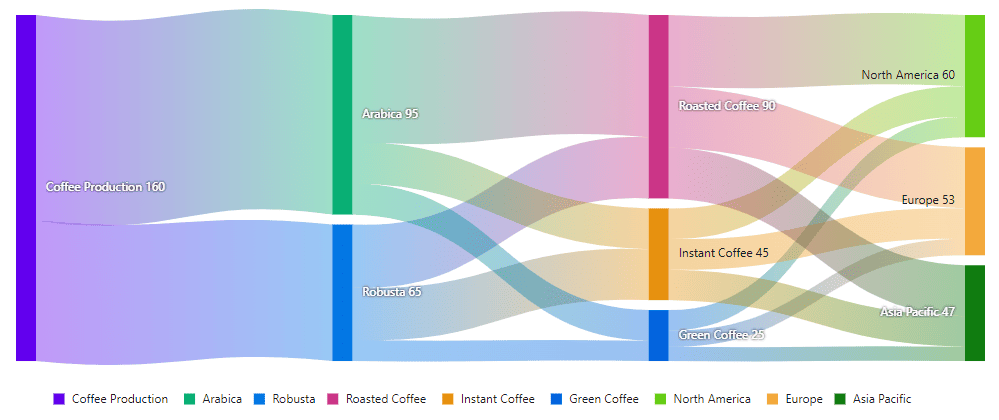

# Data Binding in the Blazor Sankey Diagram

The Blazor Sankey Diagram is designed to visualize relationships and flows between categories using nodes and links. Data binding allows you to easily provide the necessary information for the sankey diagram to render effectively. Below, we explore how to bind data to the sankey diagram in Blazor.

## Overview of Data Binding

The Sankey Diagram accepts data for:

1. **Nodes**: Represent entities or categories in the flow.
2. **Links**: Represent the connections and their magnitude between the nodes.

The data can be bound using collections of objects that define the properties of nodes and links. The component dynamically generates the diagram based on this data.

## Understanding Data Models
The Blazor Sankey Diagram uses predefined data models for nodes and links. These models are already available in the `Syncfusion.Blazor.Sankey` namespace. Here's an overview of their key properties:

### SankeyDataNode
- `Id`: A string property that serves as a unique identifier for the node.
- `Label`: An object of type `SankeyDataLabel` that can be used to customize the node's label.

### SankeyDataLink
- `SourceId`: A string property identifying the source node of the link.
- `TargetId`: A string property identifying the target node of the link.
- `Value`: A double property representing the weight or magnitude of the connection.

There's no need to define these classes yourself as they are provided by the Syncfusion&reg; library.

## Binding Data to the Sankey Diagram
To use the Sankey Diagram, you need to create collections of `SankeyDataNode` and `SankeyDataLink` objects and bind them to the component. Here's how you can do this.

Below is an example of how to bind data to the Sankey Diagram in a Blazor application:




<SfSankey Nodes=@Nodes Links=@Links>
</SfSankey>

@code {
    public List<SankeyDataNode> Nodes = new List<SankeyDataNode>();
    public List<SankeyDataLink> Links = new List<SankeyDataLink>();

    protected override void OnInitialized()
    {
        Nodes = new List<SankeyDataNode>()
        {
            new SankeyDataNode() { Id = "Coffee Production" },
            new SankeyDataNode() { Id = "Arabica" },
            new SankeyDataNode() { Id = "Robusta" },
            new SankeyDataNode() { Id = "Roasted Coffee" },
            new SankeyDataNode() { Id = "Instant Coffee" },
            new SankeyDataNode() { Id = "Green Coffee" },
            new SankeyDataNode() { Id = "North America" },
            new SankeyDataNode() { Id = "Europe" },
            new SankeyDataNode() { Id = "Asia Pacific" },
        };
        Links = new List<SankeyDataLink>()
        {
            new SankeyDataLink() { SourceId = "Coffee Production", TargetId = "Arabica", Value = 95 },
            new SankeyDataLink() { SourceId = "Coffee Production", TargetId = "Robusta", Value = 65 },
            new SankeyDataLink() { SourceId = "Arabica", TargetId = "Roasted Coffee", Value = 60 },
            new SankeyDataLink() { SourceId = "Arabica", TargetId = "Instant Coffee", Value = 20 },
            new SankeyDataLink() { SourceId = "Arabica", TargetId = "Green Coffee", Value = 15 },
            new SankeyDataLink() { SourceId = "Robusta", TargetId = "Roasted Coffee", Value = 30 },
            new SankeyDataLink() { SourceId = "Robusta", TargetId = "Instant Coffee", Value = 25 },
            new SankeyDataLink() { SourceId = "Robusta", TargetId = "Green Coffee", Value = 10 },
            new SankeyDataLink() { SourceId = "Roasted Coffee", TargetId = "North America", Value = 35 },
            new SankeyDataLink() { SourceId = "Roasted Coffee", TargetId = "Europe", Value = 30 },
            new SankeyDataLink() { SourceId = "Roasted Coffee", TargetId = "Asia Pacific", Value = 25 },
            new SankeyDataLink() { SourceId = "Instant Coffee", TargetId = "North America", Value = 15 },
            new SankeyDataLink() { SourceId = "Instant Coffee", TargetId = "Europe", Value = 15 },
            new SankeyDataLink() { SourceId = "Instant Coffee", TargetId = "Asia Pacific", Value = 15 },
            new SankeyDataLink() { SourceId = "Green Coffee", TargetId = "North America", Value = 10 },
            new SankeyDataLink() { SourceId = "Green Coffee", TargetId = "Europe", Value = 8 },
            new SankeyDataLink() { SourceId = "Green Coffee", TargetId = "Asia Pacific", Value = 7 },
        };
        base.OnInitialized();
    }
}




### Key Points

- The `Nodes` parameter expects a collection of `SankeyDataNode` objects.
- The `Links` parameter expects a collection of `SankeyDataLink` objects.
- Ensure that `SourceId` and `TargetId` in `SankeyDataLink` match the `Id` values in `SankeyDataNode`.

## Advanced Binding Scenarios

You can bind data from various sources such as:
- REST APIs: Fetch data dynamically using HTTP requests.
- Databases: Load data using Entity Framework or similar ORM tools.
- JSON Files: Deserialize JSON data into the node and link models.

### Example: Binding Data from a REST API




@inject HttpClient HttpClient

<SfSankey Nodes=@Nodes Links=@Links>
</SfSankey>

@code {
    public List<SankeyDataNode> Nodes = new List<SankeyDataNode>();
    public List<SankeyDataLink> Links = new List<SankeyDataLink>();

    protected override async Task OnInitializedAsync()
    {
        var data = await HttpClient.GetFromJsonAsync<SankeyDataResponse>("api/sankey");
        Nodes = data.Nodes;
        Links = data.Links;
    }

    public class SankeyDataResponse
    {
        public List<SankeyDataNode> Nodes { get; set; }
        public List<SankeyDataLink> Links { get; set; }
    }
}




### Updated REST API Example
Ensure that your API endpoint provides a JSON response in the following format:




{
    "Nodes": [
        { "Id": "Coffee Production" },
        { "Id": "Arabica" },
        { "Id": "Robusta" },
        ...
    ],
    "Links": [
        { "SourceId": "Coffee Production", "TargetId": "Arabica", "Value": 95 },
        { "SourceId": "Coffee Production", "TargetId": "Robusta", "Value": 65 },
        ...
    ]
}




## See also

* [Nodes](./nodes)
* [Links](./links)
* [Labels](./labels)