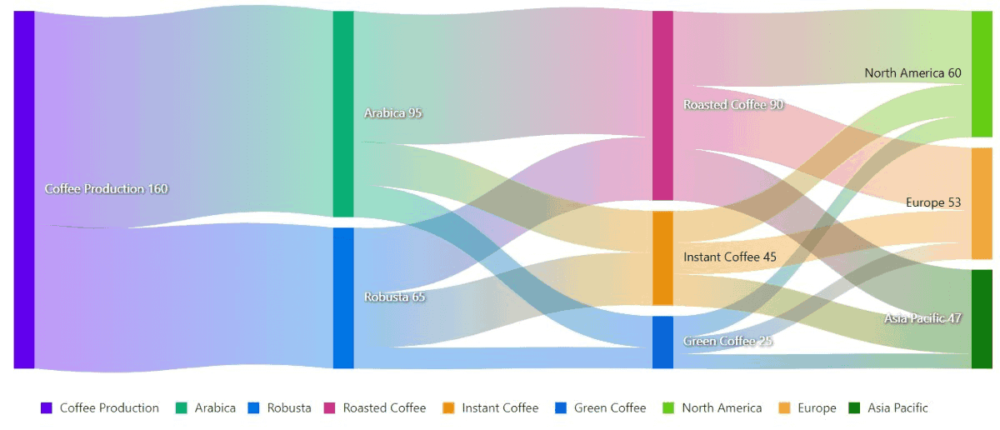
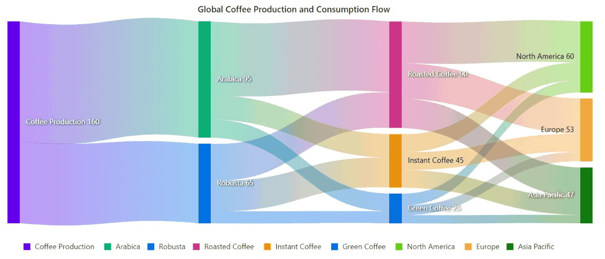
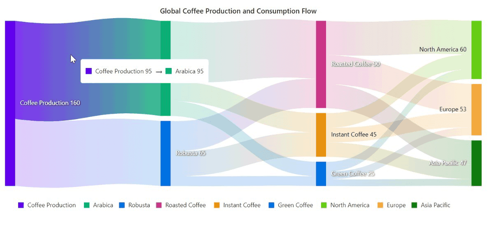

<!-- markdownlint-disable MD040 -->

# Getting Started with Blazor Sankey Diagram in Blazor Web App

This section briefly explains about how to include [Blazor Sankey](https://www.syncfusion.com/blazor-components) diagram in your Blazor Web App using [Visual Studio](https://visualstudio.microsoft.com/vs/), [Visual Studio Code](https://code.visualstudio.com/), and the [.NET CLI](https://learn.microsoft.com/en-us/dotnet/core/tools/).





## Prerequisites

* [System requirements for Blazor components](https://blazor.syncfusion.com/documentation/system-requirements)

## Create a new Blazor Web App in Visual Studio

Create a **Blazor Web App** using Visual Studio 2022 via [Microsoft Templates](https://learn.microsoft.com/en-us/aspnet/core/blazor/tooling?view=aspnetcore-10.0&pivots=vs) or the [Syncfusion<sup style="font-size:70%">&reg;</sup> Blazor Extension](https://blazor.syncfusion.com/documentation/visual-studio-integration/template-studio). For detailed instructions, refer to the [Blazor Web App Getting Started](https://blazor.syncfusion.com/documentation/getting-started/blazor-web-app) documentation.

Configure the appropriate [Interactive render mode](https://learn.microsoft.com/en-us/aspnet/core/blazor/components/render-modes?view=aspnetcore-10.0#render-modes) and [Interactivity location](https://learn.microsoft.com/en-us/aspnet/core/blazor/tooling?view=aspnetcore-10.0&pivots=vs) while creating a Blazor Web App.


## Install Syncfusion<sup style="font-size:70%">&reg;</sup> Blazor Sankey NuGet in the App

To add the **Blazor Sankey Diagram** in the app, open the NuGet package manager in Visual Studio (*Tools → NuGet Package Manager → Manage NuGet Packages for Solution*), then search and install [Syncfusion.Blazor.Sankey](https://www.nuget.org/packages/Syncfusion.Blazor.Sankey). Alternatively, run the following commands in the Package Manager Console.

If using the `WebAssembly or Auto` render modes in the Blazor Web App, install Syncfusion<sup style="font-size:70%">&reg;</sup> Blazor components NuGet packages in the client project.

Alternatively, run the following commands in the Package Manager Console to achieve the same.




Install-Package Syncfusion.Blazor.Sankey -Version {{ site.releaseversion }}




N> Syncfusion<sup style="font-size:70%">&reg;</sup> Blazor components are available in [nuget.org](https://www.nuget.org/packages?q=syncfusion.blazor). Refer to the [NuGet packages](https://blazor.syncfusion.com/documentation/nuget-packages) topic for the available NuGet packages list with component details.





## Prerequisites

* [System requirements for Blazor components](https://blazor.syncfusion.com/documentation/system-requirements)

## Create a new Blazor Web App in Visual Studio Code

Create a **Blazor Web App** using Visual Studio Code via [Microsoft Templates](https://learn.microsoft.com/en-us/aspnet/core/blazor/tooling?view=aspnetcore-10.0&pivots=vsc) or the [Syncfusion<sup style="font-size:70%">&reg;</sup> Blazor Extension](https://blazor.syncfusion.com/documentation/visual-studio-code-integration/create-project). For detailed instructions, refer to the [Blazor Web App Getting Started](https://blazor.syncfusion.com/documentation/getting-started/blazor-web-app?tabcontent=visual-studio-code) documentation.

Configure the appropriate interactive render mode and interactivity location when setting up a Blazor Web App. For detailed information, refer to the [interactive render mode documentation](https://blazor.syncfusion.com/documentation/common/interactive-render-mode).

For example, to create a Blazor Web App with the `Auto` interactive render mode, use the following commands.




dotnet new blazor -o BlazorWebApp -int Auto
cd BlazorWebApp
cd BlazorWebApp.Client




## Install Syncfusion<sup style="font-size:70%">&reg;</sup> Blazor Sankey NuGet in the App

If using the `WebAssembly` or `Auto` render modes in the Blazor Web App, install Syncfusion<sup style="font-size:70%">&reg;</sup> Blazor component NuGet packages in the client project.

* Press <kbd>Ctrl</kbd>+<kbd>`</kbd> to open the integrated terminal in Visual Studio Code.
* Ensure you’re in the project root directory where your `.csproj` file is located.
* Run the following command to install a [Syncfusion.Blazor.Sankey](https://www.nuget.org/packages/Syncfusion.Blazor.Sankey) NuGet package and ensure all dependencies are installed.





dotnet add package Syncfusion.Blazor.Sankey -v {{ site.releaseversion }}
dotnet restore





N> Syncfusion<sup style="font-size:70%">&reg;</sup> Blazor components are available in [nuget.org](https://www.nuget.org/packages?q=syncfusion.blazor). Refer to the [NuGet packages](https://blazor.syncfusion.com/documentation/nuget-packages) topic for the available NuGet packages list with component details.





## Prerequisites

Install the latest version of [.NET SDK](https://dotnet.microsoft.com/en-us/download). If you previously installed the SDK, you can determine the installed version by executing the following command in a command prompt (Windows) or terminal (macOS) or command shell (Linux).




dotnet --version




## Create a Blazor Web App using .NET CLI

Run the following command to create a new Blazor Web App in a command prompt (Windows) or terminal (macOS) or command shell (Linux). For detailed instructions, refer to [this Blazor Web App Getting Started](https://blazor.syncfusion.com/documentation/getting-started/blazor-web-app?tabcontent=.net-cli) documentation.

Configure the appropriate interactive render mode and interactivity location when setting up a Blazor Web Application. For detailed information, refer to the [interactive render mode documentation](https://blazor.syncfusion.com/documentation/common/interactive-render-mode).

For example, to create a Blazor Web App with the `Auto` interactive render mode, use the following commands:




dotnet new blazor -o BlazorApp -int Auto
cd BlazorApp
cd BlazorApp.Client




This command creates a new Blazor Web App and places it in a new directory called `BlazorApp` inside your current location. See the [Create a Blazor App](https://dotnet.microsoft.com/en-us/learn/aspnet/blazor-tutorial/create) and [dotnet new CLI command](https://learn.microsoft.com/en-us/aspnet/core/blazor/tooling?pivots=cli&view=aspnetcore-10.0) topics for more details.

## Install Syncfusion<sup style="font-size:70%">&reg;</sup> Blazor Sankey NuGet in the App

Here's an example of how to add **Blazor Sankey** component in the application using the following command in the command prompt (Windows) or terminal (Linux and macOS) to install a [Syncfusion.Blazor.Sankey](https://www.nuget.org/packages/Syncfusion.Blazor.Sankey/) NuGet package. See [Install and manage packages using the dotnet CLI](https://learn.microsoft.com/en-us/nuget/consume-packages/install-use-packages-dotnet-cli) topics for more details.

If using the `WebAssembly or Auto` render modes in the Blazor Web App, install Syncfusion<sup style="font-size:70%">&reg;</sup> Blazor component NuGet packages in the client project.




dotnet add package Syncfusion.Blazor.Sankey --version {{ site.releaseversion }}
dotnet restore




N> Syncfusion<sup style="font-size:70%">&reg;</sup> Blazor components are available in [nuget.org](https://www.nuget.org/packages?q=syncfusion.blazor). Refer to the [NuGet packages](https://blazor.syncfusion.com/documentation/nuget-packages) topic for the available NuGet packages list with component details.





## Add Import Namespaces

Open the **~/_Imports.razor** file from the client project and import the `Syncfusion.Blazor` and `Syncfusion.Blazor.Sankey` namespaces.




@using Syncfusion.Blazor
@using Syncfusion.Blazor.Sankey




## Register Syncfusion<sup style="font-size:70%">&reg;</sup> Blazor Service

Register the Syncfusion<sup style="font-size:70%">&reg;</sup> Blazor Service in the **~/Program.cs** file of your Blazor Web App.

If the **Interactive Render Mode** is set to `WebAssembly` or `Auto`, register the Syncfusion<sup style="font-size:70%">&reg;</sup> Blazor service in the **~/Program.cs** files of the main `server` project and associated `.Client` project.




...
...
using Syncfusion.Blazor;

var builder = WebApplication.CreateBuilder(args);

// Add services to the container.
builder.Services.AddRazorComponents()
    .AddInteractiveServerComponents()
    .AddInteractiveWebAssemblyComponents();
builder.Services.AddSyncfusionBlazor();

var app = builder.Build();
....




...
using Syncfusion.Blazor;

var builder = WebAssemblyHostBuilder.CreateDefault(args);
builder.Services.AddSyncfusionBlazor();

await builder.Build().RunAsync();




## Add script resources

The script can be accessed from NuGet through [Static Web Assets](https://blazor.syncfusion.com/documentation/appearance/themes#static-web-assets). Include the script reference at the end of the `<body>` in the **~/Components/App.razor** file as shown below:

```html
<head>
    ....
    <script src="_content/Syncfusion.Blazor.Core/scripts/syncfusion-blazor.min.js" type="text/javascript"></script>
</head>
```

N> Check out the [Adding Script Reference](https://blazor.syncfusion.com/documentation/common/adding-script-references) topic to learn different approaches for adding script references in your Blazor application.

## Add Blazor Sankey Diagram

Add the Syncfusion<sup style="font-size:70%">&reg;</sup> Blazor Sankey Diagram component to a Razor page located under the Pages folder (e.g., Pages/Home.razor) in either the **Server** or **Client** project. If an interactivity location as `Per page/component` in the web app, define a render mode at top of the component, as follows:




<SfSankey Nodes=@Nodes Links=@Links>

</SfSankey>

@code {
    public List<SankeyDataNode> Nodes = new List<SankeyDataNode>();
    public List<SankeyDataLink> Links = new List<SankeyDataLink>();

    protected override void OnInitialized()
    {
        Nodes = new List<SankeyDataNode>()
        {
            new SankeyDataNode() { Id = "Coffee Production" },
            new SankeyDataNode() { Id = "Arabica" },
            new SankeyDataNode() { Id = "Robusta" },
            new SankeyDataNode() { Id = "Roasted Coffee" },
            new SankeyDataNode() { Id = "Instant Coffee" },
            new SankeyDataNode() { Id = "Green Coffee" },
            new SankeyDataNode() { Id = "North America" },
            new SankeyDataNode() { Id = "Europe" },
            new SankeyDataNode() { Id = "Asia Pacific" },
        };
        Links = new List<SankeyDataLink>()
        {
            new SankeyDataLink() { SourceId = "Coffee Production", TargetId = "Arabica", Value = 95 },
            new SankeyDataLink() { SourceId = "Coffee Production", TargetId = "Robusta", Value = 65 },
            new SankeyDataLink() { SourceId = "Arabica", TargetId = "Roasted Coffee", Value = 60 },
            new SankeyDataLink() { SourceId = "Arabica", TargetId = "Instant Coffee", Value = 20 },
            new SankeyDataLink() { SourceId = "Arabica", TargetId = "Green Coffee", Value = 15 },
            new SankeyDataLink() { SourceId = "Robusta", TargetId = "Roasted Coffee", Value = 30 },
            new SankeyDataLink() { SourceId = "Robusta", TargetId = "Instant Coffee", Value = 25 },
            new SankeyDataLink() { SourceId = "Robusta", TargetId = "Green Coffee", Value = 10 },
            new SankeyDataLink() { SourceId = "Roasted Coffee", TargetId = "North America", Value = 35 },
            new SankeyDataLink() { SourceId = "Roasted Coffee", TargetId = "Europe", Value = 30 },
            new SankeyDataLink() { SourceId = "Roasted Coffee", TargetId = "Asia Pacific", Value = 25 },
            new SankeyDataLink() { SourceId = "Instant Coffee", TargetId = "North America", Value = 15 },
            new SankeyDataLink() { SourceId = "Instant Coffee", TargetId = "Europe", Value = 15 },
            new SankeyDataLink() { SourceId = "Instant Coffee", TargetId = "Asia Pacific", Value = 15 },
            new SankeyDataLink() { SourceId = "Green Coffee", TargetId = "North America", Value = 10 },
            new SankeyDataLink() { SourceId = "Green Coffee", TargetId = "Europe", Value = 8 },
            new SankeyDataLink() { SourceId = "Green Coffee", TargetId = "Asia Pacific", Value = 7 },
        };
        base.OnInitialized();
    }
}




* Press <kbd>Ctrl</kbd>+<kbd>F5</kbd> (Windows) or <kbd>⌘</kbd>+<kbd>F5</kbd> (macOS) to launch the application. This will render the Syncfusion<sup style="font-size:70%">&reg;</sup> Blazor Sankey Diagram in the default web browser.



## Populate Blazor Sankey Diagram with data

To bind data for the sankey diagram, you can assign an IEnumerable object to the  `Nodes` and `Links` properties. These properties define the structure of the nodes and the relationships between them.




<SfSankey Nodes=@Nodes Links=@Links>

</SfSankey>

@code {
    public List<SankeyDataNode> Nodes = new List<SankeyDataNode>();
    public List<SankeyDataLink> Links = new List<SankeyDataLink>();

    protected override void OnInitialized()
    {
        Nodes = new List<SankeyDataNode>()
        {
            new SankeyDataNode() { Id = "Coffee Production" },
            new SankeyDataNode() { Id = "Arabica" },
            new SankeyDataNode() { Id = "Robusta" },
            new SankeyDataNode() { Id = "Roasted Coffee" },
            new SankeyDataNode() { Id = "Instant Coffee" },
            new SankeyDataNode() { Id = "Green Coffee" },
            new SankeyDataNode() { Id = "North America" },
            new SankeyDataNode() { Id = "Europe" },
            new SankeyDataNode() { Id = "Asia Pacific" },
        };
        Links = new List<SankeyDataLink>()
        {
            new SankeyDataLink() { SourceId = "Coffee Production", TargetId = "Arabica", Value = 95 },
            new SankeyDataLink() { SourceId = "Coffee Production", TargetId = "Robusta", Value = 65 },
            new SankeyDataLink() { SourceId = "Arabica", TargetId = "Roasted Coffee", Value = 60 },
            new SankeyDataLink() { SourceId = "Arabica", TargetId = "Instant Coffee", Value = 20 },
            new SankeyDataLink() { SourceId = "Arabica", TargetId = "Green Coffee", Value = 15 },
            new SankeyDataLink() { SourceId = "Robusta", TargetId = "Roasted Coffee", Value = 30 },
            new SankeyDataLink() { SourceId = "Robusta", TargetId = "Instant Coffee", Value = 25 },
            new SankeyDataLink() { SourceId = "Robusta", TargetId = "Green Coffee", Value = 10 },
            new SankeyDataLink() { SourceId = "Roasted Coffee", TargetId = "North America", Value = 35 },
            new SankeyDataLink() { SourceId = "Roasted Coffee", TargetId = "Europe", Value = 30 },
            new SankeyDataLink() { SourceId = "Roasted Coffee", TargetId = "Asia Pacific", Value = 25 },
            new SankeyDataLink() { SourceId = "Instant Coffee", TargetId = "North America", Value = 15 },
            new SankeyDataLink() { SourceId = "Instant Coffee", TargetId = "Europe", Value = 15 },
            new SankeyDataLink() { SourceId = "Instant Coffee", TargetId = "Asia Pacific", Value = 15 },
            new SankeyDataLink() { SourceId = "Green Coffee", TargetId = "North America", Value = 10 },
            new SankeyDataLink() { SourceId = "Green Coffee", TargetId = "Europe", Value = 8 },
            new SankeyDataLink() { SourceId = "Green Coffee", TargetId = "Asia Pacific", Value = 7 },
        };
        base.OnInitialized();
    }
}




## Add title

Using the `Title` property, you can add a title to the sankey diagram to provide the user with quick information about the data plotted in the sankey diagram.




<SfSankey Title="Global Coffee Production and Consumption Flow" Nodes=@Nodes Links=@Links>
</SfSankey>





## Add node labels

You can add data labels to improve the readability of the sankey diagram. This can be achieved by setting the `Visible` property to **true** in the `SankeyLabelSettings`.




<SfSankey Title="Global Coffee Production and Consumption Flow" Nodes=@Nodes Links=@Links>
    <SankeyLabelSettings Visible="true"></SankeyLabelSettings>
</SfSankey>






## Enable tooltip

The tooltip can be enabled by setting the `Enable` property in `SankeyTooltipSettings` to **true**. However, the tooltip is enabled by default in the sankey diagram.




<SfSankey Title="Global Coffee Production and Consumption Flow" Nodes=@Nodes Links=@Links>
   <SankeyTooltipSettings Enable="true"></SankeyTooltipSettings>
</SfSankey>






## Enable legend

You can use legend for the sankey diagram by setting the `Visible` property to **true** in `SankeyLegendSettings`. However, the legend is enabled by default in the sankey diagram.




<SfSankey Title="Global Coffee Production and Consumption Flow" Nodes=@Nodes Links=@Links>
    <SankeyLegendSettings Visible="true"></SankeyLegendSettings>
</SfSankey>





## See also

1. [Getting Started with Syncfusion<sup style="font-size:70%">&reg;</sup> Blazor for client-side in .NET Core CLI](https://blazor.syncfusion.com/documentation/getting-started/blazor-webassembly-dotnet-cli)
2. [Getting Started with Syncfusion<sup style="font-size:70%">&reg;</sup> Blazor for client-side in Visual Studio](https://blazor.syncfusion.com/documentation/getting-started/blazor-webassembly-visual-studio)
3. [Getting Started with Syncfusion<sup style="font-size:70%">&reg;</sup> Blazor for server-side in .NET Core CLI](https://blazor.syncfusion.com/documentation/getting-started/blazor-server-side-dotnet-cli)
