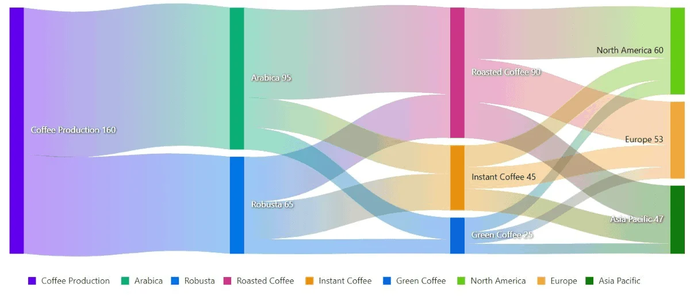
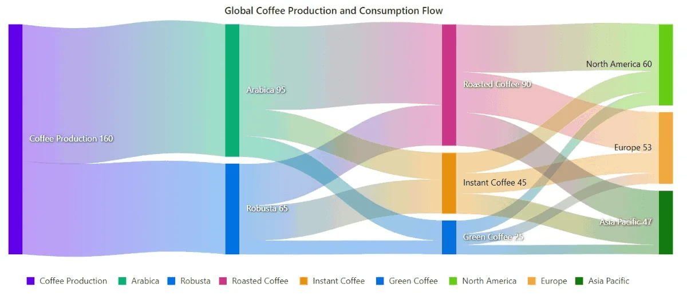
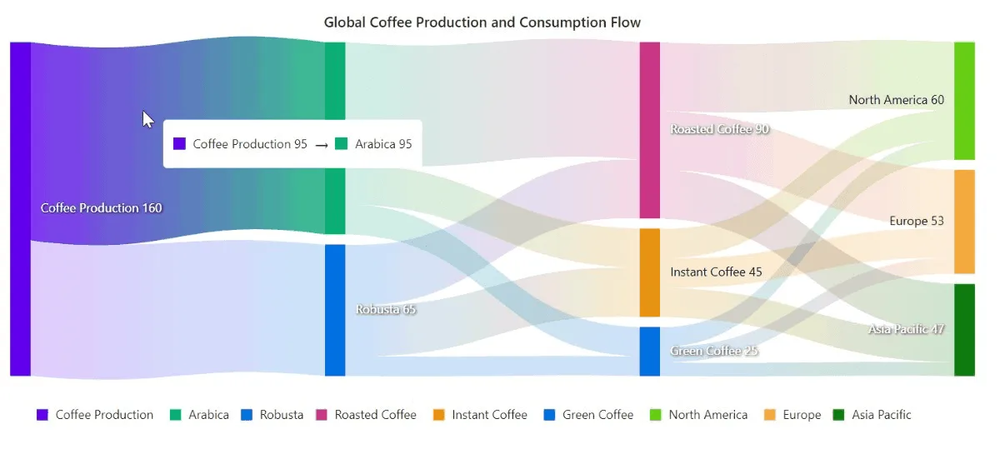

<!-- markdownlint-disable MD040 -->

# Getting Started with Blazor Sankey Diagram in Blazor Web App

This section briefly explains about how to include [Blazor Sankey Diagram](https://www.syncfusion.com/blazor-components/blazor-sankey) in your Blazor Web App using [Visual Studio](https://visualstudio.microsoft.com/vs/), [Visual Studio Code](https://code.visualstudio.com/), and the [.NET CLI](https://learn.microsoft.com/en-us/dotnet/core/tools/).

## Create a new Blazor Web App





Create a **Blazor Web App** using Visual Studio via [Microsoft Templates](https://learn.microsoft.com/en-us/aspnet/core/blazor/tooling?view=aspnetcore-10.0&pivots=vs) or the [Blazor Extension](https://blazor.syncfusion.com/documentation/visual-studio-integration/template-studio). For detailed instructions, refer to the [Blazor Web App Getting Started](https://blazor.syncfusion.com/documentation/getting-started/blazor-web-app) documentation.





Run the following command to create a new Blazor Web App.




dotnet new blazor -o BlazorWebApp --interactivity Auto
cd BlazorWebApp
cd BlazorWebApp.Client




Alternatively, create a **Blazor Web App** using Visual Studio Code via [Microsoft Templates](https://learn.microsoft.com/en-us/aspnet/core/blazor/tooling?view=aspnetcore-10.0&pivots=vsc), the [Blazor Extension](https://blazor.syncfusion.com/documentation/visual-studio-code-integration/create-project), or the [C# Dev Kit](https://marketplace.visualstudio.com/items?itemName=ms-dotnettools.csdevkit) extension.





Run the following command to create a new Blazor Web App.




dotnet new blazor -o BlazorWebApp --interactivity Auto
cd BlazorWebApp
cd BlazorWebApp.Client








N> Configure the appropriate [Interactive render mode](https://learn.microsoft.com/en-us/aspnet/core/blazor/components/render-modes?view=aspnetcore-10.0#render-modes) and [Interactivity location](https://learn.microsoft.com/en-us/aspnet/core/blazor/tooling?view=aspnetcore-10.0&pivots=vs) while creating a Blazor Web App. For detailed information, refer to the [interactive render mode documentation](https://blazor.syncfusion.com/documentation/common/interactive-render-mode).

## Install the required Blazor package

Install the [Syncfusion.Blazor.Sankey](https://www.nuget.org/packages/Syncfusion.Blazor.Sankey) NuGet package. All Syncfusion Blazor packages are available on [nuget.org](https://www.nuget.org/packages?q=syncfusion.blazor). See the [NuGet packages](https://blazor.syncfusion.com/documentation/nuget-packages) topic for details. If using the `WebAssembly` or `Auto` render modes in the Blazor Web App, install these packages in the `.Client` project.





1. Go to *Tools → NuGet Package Manager → Manage NuGet Package for Solution*.
2. Search the required NuGet package (`Syncfusion.Blazor.Sankey`) and install it.

Alternatively, you can install the same package using the Package Manager Console with the following command.




Install-Package Syncfusion.Blazor.Sankey -Version {{ site.releaseversion }}








Open the terminal and run the following command.




dotnet add package Syncfusion.Blazor.Sankey -v {{ site.releaseversion }}








Open the command prompt and run the following command.




dotnet add package Syncfusion.Blazor.Sankey -v {{ site.releaseversion }}








## Add import namespaces

After the packages are installed, open the **~/_Imports.razor** file in the `.Client` project and import the `Syncfusion.Blazor` and `Syncfusion.Blazor.Sankey` namespaces.




@using Syncfusion.Blazor
@using Syncfusion.Blazor.Sankey




## Register the Blazor service

Open the **Program.cs** file in Blazor Web App and register the Blazor service. If the **Interactive Render Mode** is set to `WebAssembly` or `Auto`, register the Blazor service in **Program.cs** files of both the server and client projects in your Blazor Web App.




....
using Syncfusion.Blazor;
....
builder.Services.AddSyncfusionBlazor();
....




## Add script resources

The script can be accessed from NuGet through [Static Web Assets](https://blazor.syncfusion.com/documentation/appearance/themes#static-web-assets). Include the [script references](https://blazor.syncfusion.com/documentation/common/adding-script-references) in the **App.razor** file.







## Add Blazor Sankey Diagram component

Open a Razor file located in the **~/Pages/*.razor** (for example, **Home.razor**) and add the [Blazor Sankey Diagram](https://www.syncfusion.com/blazor-components/blazor-sankey) component inside the razor file.

N> If the interactivity location is set to `Per page/component` in the Web App, define a render mode at the top of the razor file. (For example, `InteractiveServer`, `InteractiveWebAssembly` or `InteractiveAuto`). If the **Interactivity** is set to `Global` with `Auto` or `WebAssembly`, the render mode is automatically configured in the `App.razor` file by default.




@rendermode InteractiveAuto

@using Syncfusion.Blazor.Sankey

<SfSankey Nodes=@Nodes Links=@Links>

</SfSankey>

@code {
    public List<SankeyDataNode> Nodes = new List<SankeyDataNode>();
    public List<SankeyDataLink> Links = new List<SankeyDataLink>();

    protected override void OnInitialized()
    {
        Nodes = new List<SankeyDataNode>()
        {
            new SankeyDataNode() { Id = "Coffee Production" },
            new SankeyDataNode() { Id = "Arabica" },
            new SankeyDataNode() { Id = "Robusta" },
            new SankeyDataNode() { Id = "Roasted Coffee" },
            new SankeyDataNode() { Id = "Instant Coffee" },
            new SankeyDataNode() { Id = "Green Coffee" },
            new SankeyDataNode() { Id = "North America" },
            new SankeyDataNode() { Id = "Europe" },
            new SankeyDataNode() { Id = "Asia Pacific" },
        };
        Links = new List<SankeyDataLink>()
        {
            new SankeyDataLink() { SourceId = "Coffee Production", TargetId = "Arabica", Value = 95 },
            new SankeyDataLink() { SourceId = "Coffee Production", TargetId = "Robusta", Value = 65 },
            new SankeyDataLink() { SourceId = "Arabica", TargetId = "Roasted Coffee", Value = 60 },
            new SankeyDataLink() { SourceId = "Arabica", TargetId = "Instant Coffee", Value = 20 },
            new SankeyDataLink() { SourceId = "Arabica", TargetId = "Green Coffee", Value = 15 },
            new SankeyDataLink() { SourceId = "Robusta", TargetId = "Roasted Coffee", Value = 30 },
            new SankeyDataLink() { SourceId = "Robusta", TargetId = "Instant Coffee", Value = 25 },
            new SankeyDataLink() { SourceId = "Robusta", TargetId = "Green Coffee", Value = 10 },
            new SankeyDataLink() { SourceId = "Roasted Coffee", TargetId = "North America", Value = 35 },
            new SankeyDataLink() { SourceId = "Roasted Coffee", TargetId = "Europe", Value = 30 },
            new SankeyDataLink() { SourceId = "Roasted Coffee", TargetId = "Asia Pacific", Value = 25 },
            new SankeyDataLink() { SourceId = "Instant Coffee", TargetId = "North America", Value = 15 },
            new SankeyDataLink() { SourceId = "Instant Coffee", TargetId = "Europe", Value = 15 },
            new SankeyDataLink() { SourceId = "Instant Coffee", TargetId = "Asia Pacific", Value = 15 },
            new SankeyDataLink() { SourceId = "Green Coffee", TargetId = "North America", Value = 10 },
            new SankeyDataLink() { SourceId = "Green Coffee", TargetId = "Europe", Value = 8 },
            new SankeyDataLink() { SourceId = "Green Coffee", TargetId = "Asia Pacific", Value = 7 },
        };
        base.OnInitialized();
    }
}




**Run the application**





Press <kbd>Ctrl</kbd>+<kbd>F5</kbd> (Windows) or <kbd>⌘</kbd>+<kbd>F5</kbd> (macOS) to launch the application. The Blazor Sankey Diagram component will render in your default web browser.





Open the terminal and navigate to the main project folder (for example, `BlazorWebApp`) and run the following command.




cd ..
cd BlazorWebApp
dotnet run








Open the command prompt and navigate to the main project folder (for example, `BlazorWebApp`) and run the following command.




cd ..
cd BlazorWebApp
dotnet run








## Populate Blazor Sankey Diagram with data

To bind data for the sankey diagram, you can assign an IEnumerable object to the  `Nodes` and `Links` properties. These properties define the structure of the nodes and the relationships between them.




@using Syncfusion.Blazor.Sankey

<SfSankey Nodes=@Nodes Links=@Links>

</SfSankey>

@code {
    public List<SankeyDataNode> Nodes = new List<SankeyDataNode>();
    public List<SankeyDataLink> Links = new List<SankeyDataLink>();

    protected override void OnInitialized()
    {
        Nodes = new List<SankeyDataNode>()
        {
            new SankeyDataNode() { Id = "Coffee Production" },
            new SankeyDataNode() { Id = "Arabica" },
            new SankeyDataNode() { Id = "Robusta" },
            new SankeyDataNode() { Id = "Roasted Coffee" },
            new SankeyDataNode() { Id = "Instant Coffee" },
            new SankeyDataNode() { Id = "Green Coffee" },
            new SankeyDataNode() { Id = "North America" },
            new SankeyDataNode() { Id = "Europe" },
            new SankeyDataNode() { Id = "Asia Pacific" },
        };
        Links = new List<SankeyDataLink>()
        {
            new SankeyDataLink() { SourceId = "Coffee Production", TargetId = "Arabica", Value = 95 },
            new SankeyDataLink() { SourceId = "Coffee Production", TargetId = "Robusta", Value = 65 },
            new SankeyDataLink() { SourceId = "Arabica", TargetId = "Roasted Coffee", Value = 60 },
            new SankeyDataLink() { SourceId = "Arabica", TargetId = "Instant Coffee", Value = 20 },
            new SankeyDataLink() { SourceId = "Arabica", TargetId = "Green Coffee", Value = 15 },
            new SankeyDataLink() { SourceId = "Robusta", TargetId = "Roasted Coffee", Value = 30 },
            new SankeyDataLink() { SourceId = "Robusta", TargetId = "Instant Coffee", Value = 25 },
            new SankeyDataLink() { SourceId = "Robusta", TargetId = "Green Coffee", Value = 10 },
            new SankeyDataLink() { SourceId = "Roasted Coffee", TargetId = "North America", Value = 35 },
            new SankeyDataLink() { SourceId = "Roasted Coffee", TargetId = "Europe", Value = 30 },
            new SankeyDataLink() { SourceId = "Roasted Coffee", TargetId = "Asia Pacific", Value = 25 },
            new SankeyDataLink() { SourceId = "Instant Coffee", TargetId = "North America", Value = 15 },
            new SankeyDataLink() { SourceId = "Instant Coffee", TargetId = "Europe", Value = 15 },
            new SankeyDataLink() { SourceId = "Instant Coffee", TargetId = "Asia Pacific", Value = 15 },
            new SankeyDataLink() { SourceId = "Green Coffee", TargetId = "North America", Value = 10 },
            new SankeyDataLink() { SourceId = "Green Coffee", TargetId = "Europe", Value = 8 },
            new SankeyDataLink() { SourceId = "Green Coffee", TargetId = "Asia Pacific", Value = 7 },
        };
        base.OnInitialized();
    }
}




## Add title

Using the `Title` property, you can add a title to the sankey diagram to provide the user with quick information about the data plotted in the sankey diagram.




@using Syncfusion.Blazor.Sankey

<SfSankey Title="Global Coffee Production and Consumption Flow" Nodes=@Nodes Links=@Links>
</SfSankey>




## Add node labels

You can add data labels to improve the readability of the sankey diagram. This can be achieved by setting the `Visible` property to **true** in the `SankeyLabelSettings`.




@using Syncfusion.Blazor.Sankey

<SfSankey Title="Global Coffee Production and Consumption Flow" Nodes=@Nodes Links=@Links>
    <SankeyLabelSettings Visible="true"></SankeyLabelSettings>
</SfSankey>




## Enable tooltip

The tooltip can be enabled by setting the `Enable` property in `SankeyTooltipSettings` to **true**. However, the tooltip is enabled by default in the sankey diagram.




@using Syncfusion.Blazor.Sankey

<SfSankey Title="Global Coffee Production and Consumption Flow" Nodes=@Nodes Links=@Links>
   <SankeyTooltipSettings Enable="true"></SankeyTooltipSettings>
</SfSankey>




## Enable legend

You can use legend for the sankey diagram by setting the `Visible` property to **true** in `SankeyLegendSettings`. However, the legend is enabled by default in the sankey diagram.




@using Syncfusion.Blazor.Sankey

<SfSankey Title="Global Coffee Production and Consumption Flow" Nodes=@Nodes Links=@Links>
    <SankeyLegendSettings Visible="true"></SankeyLegendSettings>
</SfSankey>




## See also

1. [Getting Started with Blazor for client-side in .NET Core CLI](https://blazor.syncfusion.com/documentation/getting-started/blazor-webassembly-dotnet-cli)
2. [Getting Started with Blazor for client-side in Visual Studio](https://blazor.syncfusion.com/documentation/getting-started/blazor-webassembly-visual-studio)
3. [Getting Started with Blazor for server-side in .NET Core CLI](https://blazor.syncfusion.com/documentation/getting-started/blazor-server-side-dotnet-cli)
