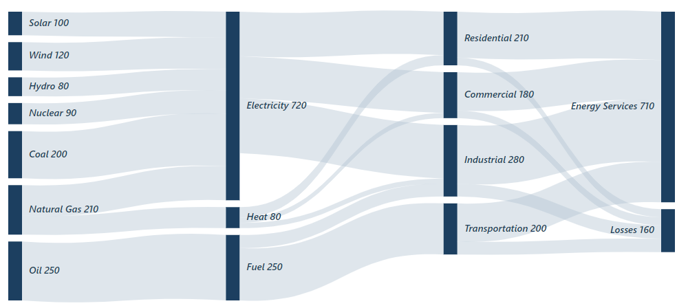

# Labels in Blazor Sankey Diagram

## Overview

Labels in a Sankey Diagram are crucial for providing textual information for nodes, thereby enhancing the readability and comprehension of data flows. In the Blazor Sankey Diagram, labels can be configured and customized to meet various design and informational needs, making your diagrams more effective in conveying underlying data structures.

## Basic Label Configuration

Labels are included within the node configuration and can be tailored using `SankeyLabelSettings`. Below is an example of how to set up labels in the Sankey Diagram:




@using Syncfusion.Blazor;
@using Syncfusion.Blazor.Sankey;

<SfSankey Nodes=@Nodes Links=@Links>
    <SankeyNodeSettings Color="#1c3f60" ></SankeyNodeSettings>
    <SankeyLinkSettings Color="#afc1d0" ></SankeyLinkSettings>
    <SankeyLabelSettings Color="#1c3f60" FontWeight="600" FontSize="14px" FontStyle="italic"></SankeyLabelSettings>
    <SankeyLegendSettings Visible="false"></SankeyLegendSettings>
</SfSankey>

@code {
    string _backgroundColor = "#0b1320";
    public List<SankeyDataNode> Nodes = new List<SankeyDataNode>();
    public List<SankeyDataLink> Links = new List<SankeyDataLink>();

    protected override void OnInitialized()
    {
        Nodes = new List<SankeyDataNode>()
        {
            new SankeyDataNode() { Id = "Solar", Label = new SankeyDataLabel() { Text = "Solar" } },
            new SankeyDataNode() { Id = "Wind", Label = new SankeyDataLabel() { Text = "Wind" } },
            new SankeyDataNode() { Id = "Hydro", Label = new SankeyDataLabel() { Text = "Hydro" } },
            new SankeyDataNode() { Id = "Nuclear", Label = new SankeyDataLabel() { Text = "Nuclear" } },
            new SankeyDataNode() { Id = "Coal", Label = new SankeyDataLabel() { Text = "Coal" } },
            new SankeyDataNode() { Id = "Natural Gas", Label = new SankeyDataLabel() { Text = "Natural Gas" } },
            new SankeyDataNode() { Id = "Oil", Label = new SankeyDataLabel() { Text = "Oil" } },
            new SankeyDataNode() { Id = "Electricity", Label = new SankeyDataLabel() { Text = "Electricity" } },
            new SankeyDataNode() { Id = "Heat", Label = new SankeyDataLabel() { Text = "Heat" } },
            new SankeyDataNode() { Id = "Fuel", Label = new SankeyDataLabel() { Text = "Fuel" } },
            new SankeyDataNode() { Id = "Residential", Label = new SankeyDataLabel() { Text = "Residential" } },
            new SankeyDataNode() { Id = "Commercial", Label = new SankeyDataLabel() { Text = "Commercial" } },
            new SankeyDataNode() { Id = "Industrial", Label = new SankeyDataLabel() { Text = "Industrial" } },
            new SankeyDataNode() { Id = "Transportation", Label = new SankeyDataLabel() { Text = "Transportation" } },
            new SankeyDataNode() { Id = "Energy Services", Label = new SankeyDataLabel() { Text = "Energy Services" } },
            new SankeyDataNode() { Id = "Losses", Label = new SankeyDataLabel() { Text = "Losses" } }
        };

        Links = new List<SankeyDataLink>()
        {
            new SankeyDataLink() { SourceId = "Solar", TargetId = "Electricity", Value = 100 },
            new SankeyDataLink() { SourceId = "Wind", TargetId = "Electricity", Value = 120 },
            new SankeyDataLink() { SourceId = "Hydro", TargetId = "Electricity", Value = 80 },
            new SankeyDataLink() { SourceId = "Nuclear", TargetId = "Electricity", Value = 90 },
            new SankeyDataLink() { SourceId = "Coal", TargetId = "Electricity", Value = 200 },
            new SankeyDataLink() { SourceId = "Natural Gas", TargetId = "Electricity", Value = 130 },
            new SankeyDataLink() { SourceId = "Natural Gas", TargetId = "Heat", Value = 80 },
            new SankeyDataLink() { SourceId = "Oil", TargetId = "Fuel", Value = 250 },
            new SankeyDataLink() { SourceId = "Electricity", TargetId = "Residential", Value = 170 },
            new SankeyDataLink() { SourceId = "Electricity", TargetId = "Commercial", Value = 160 },
            new SankeyDataLink() { SourceId = "Electricity", TargetId = "Industrial", Value = 210 },
            new SankeyDataLink() { SourceId = "Heat", TargetId = "Residential", Value = 40 },
            new SankeyDataLink() { SourceId = "Heat", TargetId = "Commercial", Value = 20 },
            new SankeyDataLink() { SourceId = "Heat", TargetId = "Industrial", Value = 20 },
            new SankeyDataLink() { SourceId = "Fuel", TargetId = "Transportation", Value = 200 },
            new SankeyDataLink() { SourceId = "Fuel", TargetId = "Industrial", Value = 50 },
            new SankeyDataLink() { SourceId = "Residential", TargetId = "Energy Services", Value = 180 },
            new SankeyDataLink() { SourceId = "Commercial", TargetId = "Energy Services", Value = 150 },
            new SankeyDataLink() { SourceId = "Industrial", TargetId = "Energy Services", Value = 230 },
            new SankeyDataLink() { SourceId = "Transportation", TargetId = "Energy Services", Value = 150 },
            new SankeyDataLink() { SourceId = "Residential", TargetId = "Losses", Value = 30 },
            new SankeyDataLink() { SourceId = "Commercial", TargetId = "Losses", Value = 30 },
            new SankeyDataLink() { SourceId = "Industrial", TargetId = "Losses", Value = 50 },
            new SankeyDataLink() { SourceId = "Transportation", TargetId = "Losses", Value = 50 }
        };
        base.OnInitialized();
    }
}




In this example, labels are defined for each node with specific `SankeyLabelSettings` to determine their visual style. The settings include font color, weight, size, and style, ensuring labels contribute to both functional clarity and aesthetic quality.

## Customizing Label Appearance

Customizing the appearance of labels in the Blazor Sankey Diagram provides an opportunity to enhance the visual clarity and impact of your data visualization. By utilizing various properties within the SankeyLabelSettings, you can tailor labels to align with your application's design aesthetics and functional requirements. These customizations contribute to a more refined and informative diagram, making it easier for users to interpret complex data relationships.

- **Visible**: Controls whether labels are shown; set to `false` to hide them if diagram space is limited.
- **FontSize**: Adjusts the font size, accommodating different display sizes or emphasis levels.
- **Color**: Sets the text color, important for visibility and theme coherence.
- **FontFamily**: Defines the text font family, which can match the application's overall typography for design consistency.
- **FontWeight**: Specifies the thickness of the text, like "400" for normal or "700" for bold, enhancing emphasis where needed.
- **Padding**: Determines space around the text, allowing for better alignment and placement within nodes.
- **FontStyle**: Enables styles such as "italic" for creative or hierarchical text presentation.




<SankeyLabelSettings 
    Visible="true" 
    FontSize="12" 
    Color="black" 
    FontFamily="Arial" 
    FontWeight="400" 
    Padding="8">
</SankeyLabelSettings>




## Key Considerations

- Use concise yet descriptive label text to ensure clarity without cluttering the diagram.
- Employ various font sizes and weights to create a visual hierarchy that highlights significant data points.
- Ensure label color contrasts sufficiently with the node color to maintain readability.
- Adjust padding to perfect label placement within nodes, preventing overlap or misalignment.
- Use the `Visible` property strategically to manage label density based on diagram complexity.

By skillfully configuring and customizing labels within the Blazor Sankey Diagram, developers can generate informative and user-friendly flow diagrams. Effective label usage underscores the significance of nodes and enhances users' ability to interpret data visualizations easily.

## See also

* [Nodes](./nodes)
* [Links](./links)
* [Legend](./legend)
* [Tooltip](./tooltip)
