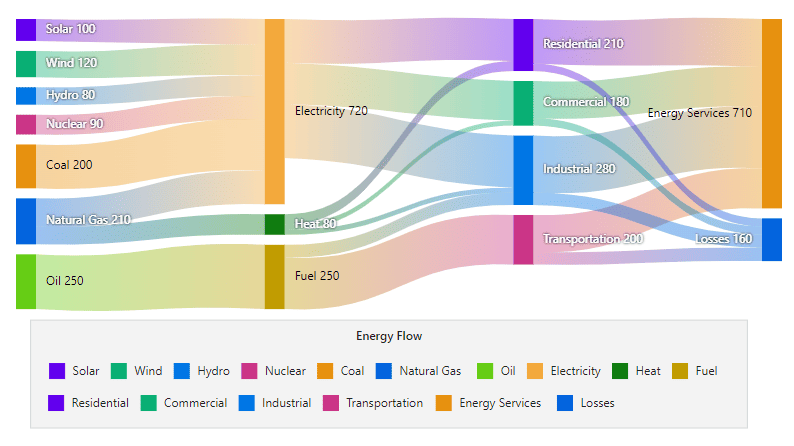

# Legends in Blazor Sankey Diagram

## Overview

Legends provide a visual key for interpreting nodes or links in a Sankey diagram. This topic explains how to configure and customize legends in the Blazor Sankey Diagram.

## Basic Legend Configuration

Legends present the categories or elements in a data flow, associating items with descriptive labels and colors. The `SankeyLegendSettings` API controls legend visibility, position, size, and layout to create an organized and interpretable visualization.

The following example demonstrates enabling a legend, positioning it, adjusting height, and binding data for the Sankey diagram.




@using Syncfusion.Blazor;
@using Syncfusion.Blazor.Sankey;

<SfSankey Nodes="@Nodes" Links="@Links">
    <SankeyLegendSettings 
        Visible="true" 
        Position="SankeyLegendPosition.Bottom" 
        Height="200px">
    </SankeyLegendSettings>
</SfSankey>

@code {
    public List<SankeyDataNode> Nodes = new List<SankeyDataNode>();
    public List<SankeyDataLink> Links = new List<SankeyDataLink>();

    protected override void OnInitialized()
    {
        Nodes = new List<SankeyDataNode>()
        {
            new SankeyDataNode() { Id = "Solar", Label = new SankeyDataLabel() { Text = "Solar" } },
            new SankeyDataNode() { Id = "Wind", Label = new SankeyDataLabel() { Text = "Wind" } },
            new SankeyDataNode() { Id = "Hydro", Label = new SankeyDataLabel() { Text = "Hydro" } },
            new SankeyDataNode() { Id = "Nuclear", Label = new SankeyDataLabel() { Text = "Nuclear" } },
            new SankeyDataNode() { Id = "Coal", Label = new SankeyDataLabel() { Text = "Coal" } },
            new SankeyDataNode() { Id = "Natural Gas", Label = new SankeyDataLabel() { Text = "Natural Gas" } },
            new SankeyDataNode() { Id = "Oil", Label = new SankeyDataLabel() { Text = "Oil" } },
            new SankeyDataNode() { Id = "Electricity", Label = new SankeyDataLabel() { Text = "Electricity" } },
            new SankeyDataNode() { Id = "Heat", Label = new SankeyDataLabel() { Text = "Heat" } },
            new SankeyDataNode() { Id = "Fuel", Label = new SankeyDataLabel() { Text = "Fuel" } },
            new SankeyDataNode() { Id = "Residential", Label = new SankeyDataLabel() { Text = "Residential" } },
            new SankeyDataNode() { Id = "Commercial", Label = new SankeyDataLabel() { Text = "Commercial" } },
            new SankeyDataNode() { Id = "Industrial", Label = new SankeyDataLabel() { Text = "Industrial" } },
            new SankeyDataNode() { Id = "Transportation", Label = new SankeyDataLabel() { Text = "Transportation" } },
            new SankeyDataNode() { Id = "Energy Services", Label = new SankeyDataLabel() { Text = "Energy Services" } },
            new SankeyDataNode() { Id = "Losses", Label = new SankeyDataLabel() { Text = "Losses" } }
        };

        Links = new List<SankeyDataLink>()
        {
            // Energy Sources to Carriers
            new SankeyDataLink() { SourceId = "Solar", TargetId = "Electricity", Value = 100 },
            new SankeyDataLink() { SourceId = "Wind", TargetId = "Electricity", Value = 120 },
            new SankeyDataLink() { SourceId = "Hydro", TargetId = "Electricity", Value = 80 },
            new SankeyDataLink() { SourceId = "Nuclear", TargetId = "Electricity", Value = 90 },
            new SankeyDataLink() { SourceId = "Coal", TargetId = "Electricity", Value = 200 },
            new SankeyDataLink() { SourceId = "Natural Gas", TargetId = "Electricity", Value = 130 },
            new SankeyDataLink() { SourceId = "Natural Gas", TargetId = "Heat", Value = 80 },
            new SankeyDataLink() { SourceId = "Oil", TargetId = "Fuel", Value = 250 },

            // Energy Carriers to Sectors
            new SankeyDataLink() { SourceId = "Electricity", TargetId = "Residential", Value = 170 },
            new SankeyDataLink() { SourceId = "Electricity", TargetId = "Commercial", Value = 160 },
            new SankeyDataLink() { SourceId = "Electricity", TargetId = "Industrial", Value = 210 },
            new SankeyDataLink() { SourceId = "Heat", TargetId = "Residential", Value = 40 },
            new SankeyDataLink() { SourceId = "Heat", TargetId = "Commercial", Value = 20 },
            new SankeyDataLink() { SourceId = "Heat", TargetId = "Industrial", Value = 20 },
            new SankeyDataLink() { SourceId = "Fuel", TargetId = "Transportation", Value = 200 },
            new SankeyDataLink() { SourceId = "Fuel", TargetId = "Industrial", Value = 50 },

            // Sectors to End Use and Losses
            new SankeyDataLink() { SourceId = "Residential", TargetId = "Energy Services", Value = 180 },
            new SankeyDataLink() { SourceId = "Commercial", TargetId = "Energy Services", Value = 150 },
            new SankeyDataLink() { SourceId = "Industrial", TargetId = "Energy Services", Value = 230 },
            new SankeyDataLink() { SourceId = "Transportation", TargetId = "Energy Services", Value = 150 },
            new SankeyDataLink() { SourceId = "Residential", TargetId = "Losses", Value = 30 },
            new SankeyDataLink() { SourceId = "Commercial", TargetId = "Losses", Value = 30 },
            new SankeyDataLink() { SourceId = "Industrial", TargetId = "Losses", Value = 50 },
            new SankeyDataLink() { SourceId = "Transportation", TargetId = "Losses", Value = 50 }
        };
        base.OnInitialized();
    }
}




## Legend Customization and Configuration

The Sankey Diagram supports a comprehensive set of legend options, ranging from visibility and sizing to layout and styling. Appearance settings enable precise control over legend elements, including item spacing, shape size, and ordering. A legend title can be added to provide additional context.

- `Visible`: Shows or hides the legend.
- `Position`: Sets the position of the legend (Auto, Top, Left, Bottom, Right).
- `Width`, `Height`: Defines legend dimensions.
- `Padding`: Sets outer padding around the legend collection.
- `ItemPadding`: Sets spacing between legend items.
- `ShapeWidth`, `ShapeHeight`: Control legend shape size.
- `ShapePadding`: Sets spacing between legend shapes and text.
- `Background`: Sets legend background color.
- `Opacity`: Sets legend background transparency.
- `EnableHighlight`: Highlights corresponding elements on legend hover.
- `Title`: Sets a title for the legend.
- `IsInversed`: Inverts the order of shape and text in legend items.
- `Reverse`: Reverses the ordering of legend items.




@using Syncfusion.Blazor;
@using Syncfusion.Blazor.Sankey;

<SfSankey Nodes="@Nodes" Links="@Links">
    <SankeyLegendSettings 
    Visible="true" 
    Position="SankeyLegendPosition.Bottom"
    Width="100%"
    Height="200px"
    Background="#f0f0f0"
    Opacity="0.8"
    BorderColor="#cccccc"
    BorderWidth="1"
    ShapeWidth="15"
    ShapeHeight="15"
    EnableHighlight="true"
    Title="Energy Flow"
    IsInversed="false"
    Reverse="false">
    <SankeyLegendMargin Left="20" Right="20" Top="20" Bottom="20"></SankeyLegendMargin>
</SankeyLegendSettings>
</SfSankey>

@code {
    public List<SankeyDataNode> Nodes = new List<SankeyDataNode>();
    public List<SankeyDataLink> Links = new List<SankeyDataLink>();

    protected override void OnInitialized()
    {
        Nodes = new List<SankeyDataNode>()
        {
            new SankeyDataNode() { Id = "Solar", Label = new SankeyDataLabel() { Text = "Solar" } },
            new SankeyDataNode() { Id = "Wind", Label = new SankeyDataLabel() { Text = "Wind" } },
            new SankeyDataNode() { Id = "Hydro", Label = new SankeyDataLabel() { Text = "Hydro" } },
            new SankeyDataNode() { Id = "Nuclear", Label = new SankeyDataLabel() { Text = "Nuclear" } },
            new SankeyDataNode() { Id = "Coal", Label = new SankeyDataLabel() { Text = "Coal" } },
            new SankeyDataNode() { Id = "Natural Gas", Label = new SankeyDataLabel() { Text = "Natural Gas" } },
            new SankeyDataNode() { Id = "Oil", Label = new SankeyDataLabel() { Text = "Oil" } },
            new SankeyDataNode() { Id = "Electricity", Label = new SankeyDataLabel() { Text = "Electricity" } },
            new SankeyDataNode() { Id = "Heat", Label = new SankeyDataLabel() { Text = "Heat" } },
            new SankeyDataNode() { Id = "Fuel", Label = new SankeyDataLabel() { Text = "Fuel" } },
            new SankeyDataNode() { Id = "Residential", Label = new SankeyDataLabel() { Text = "Residential" } },
            new SankeyDataNode() { Id = "Commercial", Label = new SankeyDataLabel() { Text = "Commercial" } },
            new SankeyDataNode() { Id = "Industrial", Label = new SankeyDataLabel() { Text = "Industrial" } },
            new SankeyDataNode() { Id = "Transportation", Label = new SankeyDataLabel() { Text = "Transportation" } },
            new SankeyDataNode() { Id = "Energy Services", Label = new SankeyDataLabel() { Text = "Energy Services" } },
            new SankeyDataNode() { Id = "Losses", Label = new SankeyDataLabel() { Text = "Losses" } }
        };

        Links = new List<SankeyDataLink>()
        {
            // Energy Sources to Carriers
            new SankeyDataLink() { SourceId = "Solar", TargetId = "Electricity", Value = 100 },
            new SankeyDataLink() { SourceId = "Wind", TargetId = "Electricity", Value = 120 },
            new SankeyDataLink() { SourceId = "Hydro", TargetId = "Electricity", Value = 80 },
            new SankeyDataLink() { SourceId = "Nuclear", TargetId = "Electricity", Value = 90 },
            new SankeyDataLink() { SourceId = "Coal", TargetId = "Electricity", Value = 200 },
            new SankeyDataLink() { SourceId = "Natural Gas", TargetId = "Electricity", Value = 130 },
            new SankeyDataLink() { SourceId = "Natural Gas", TargetId = "Heat", Value = 80 },
            new SankeyDataLink() { SourceId = "Oil", TargetId = "Fuel", Value = 250 },

            // Energy Carriers to Sectors
            new SankeyDataLink() { SourceId = "Electricity", TargetId = "Residential", Value = 170 },
            new SankeyDataLink() { SourceId = "Electricity", TargetId = "Commercial", Value = 160 },
            new SankeyDataLink() { SourceId = "Electricity", TargetId = "Industrial", Value = 210 },
            new SankeyDataLink() { SourceId = "Heat", TargetId = "Residential", Value = 40 },
            new SankeyDataLink() { SourceId = "Heat", TargetId = "Commercial", Value = 20 },
            new SankeyDataLink() { SourceId = "Heat", TargetId = "Industrial", Value = 20 },
            new SankeyDataLink() { SourceId = "Fuel", TargetId = "Transportation", Value = 200 },
            new SankeyDataLink() { SourceId = "Fuel", TargetId = "Industrial", Value = 50 },

            // Sectors to End Use and Losses
            new SankeyDataLink() { SourceId = "Residential", TargetId = "Energy Services", Value = 180 },
            new SankeyDataLink() { SourceId = "Commercial", TargetId = "Energy Services", Value = 150 },
            new SankeyDataLink() { SourceId = "Industrial", TargetId = "Energy Services", Value = 230 },
            new SankeyDataLink() { SourceId = "Transportation", TargetId = "Energy Services", Value = 150 },
            new SankeyDataLink() { SourceId = "Residential", TargetId = "Losses", Value = 30 },
            new SankeyDataLink() { SourceId = "Commercial", TargetId = "Losses", Value = 30 },
            new SankeyDataLink() { SourceId = "Industrial", TargetId = "Losses", Value = 50 },
            new SankeyDataLink() { SourceId = "Transportation", TargetId = "Losses", Value = 50 }
        };
        base.OnInitialized();
    }
}




### Legend Text and Title Styles

Legend typography can be tailored using `SankeyLegendTextStyle` and `SankeyLegendTitleStyle`. Configure font size, family, weight, color, and style to match the application’s visual language.




<SankeyLegendSettings>
    <SankeyLegendTextStyle 
        FontSize="11px" 
        FontFamily="Segoe UI" 
        FontWeight="500" 
        Color="#666666" 
        FontStyle="normal">
    </SankeyLegendTextStyle>
    <SankeyLegendTitleStyle 
        FontSize="13px" 
        FontFamily="Segoe UI" 
        FontWeight="600" 
        Color="#333333" 
        FontStyle="normal">
    </SankeyLegendTitleStyle>
</SankeyLegendSettings>




## Key Considerations

- Keep legend items concise and unambiguous to support quick scanning.
- Choose positions that avoid overlap with the primary diagram content.
- Align legend styling with the application theme for consistency.
- Use `EnableHighlight` to assist targeted exploration of flows.
- Adjust `IsInversed` or `Reverse` to optimize reading order when needed.

## Legend Interaction

When `EnableHighlight` is true, hovering over a legend item highlights corresponding elements in the Sankey diagram, assisting quick identification of flows or categories.

By configuring and styling legends effectively, Sankey diagrams become clearer and more discoverable, especially in scenarios with multiple categories or complex flows.

## See also

* [Nodes](./nodes)
* [Links](./links)
* [Labels](./labels)
