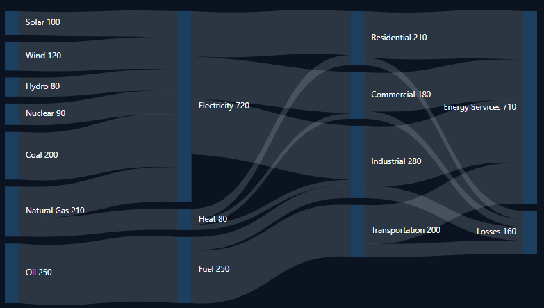

# Links in Blazor Sankey Diagram

## Overview

Links in a Sankey diagram represent the connections and flow between nodes. They visually depict the relationships and quantities transferred between different entities or stages in a process. This topic covers how to define, customize, and work with links in the Blazor Sankey Diagram.

## Basic Link Configuration

To add links to your Sankey Diagram, you need to define a collection of `SankeyDataLink` objects. Each link requires a source node, a target node, and a value representing the flow quantity.

- Each link must have a `SourceId` and `TargetId` corresponding to existing node IDs.
- The `Value` property determines the thickness of the link and represents the quantity flowing between nodes.
- Links are automatically rendered based on the node positions and specified values.

Here's an example of how to configure links in the Sankey Diagram:




@using Syncfusion.Blazor;
@using Syncfusion.Blazor.Sankey;

<SfSankey BackgroundColor="@_backgroundColor" Nodes=@Nodes Links=@Links>
    <SankeyNodeSettings Color="#1c3f60" ></SankeyNodeSettings>
    <SankeyLinkSettings Color="#afc1d0" Opacity="0.2"></SankeyLinkSettings>
    <SankeyLabelSettings Color="#FFFFFF" FontWeight="400" ></SankeyLabelSettings>
    <SankeyLegendSettings Visible="false"></SankeyLegendSettings>
</SfSankey>
@code {
    string _backgroundColor = "#0b1320";
    public List<SankeyDataNode> Nodes = new List<SankeyDataNode>();
    public List<SankeyDataLink> Links = new List<SankeyDataLink>();
    protected override void OnInitialized()
    {
        Nodes = new List<SankeyDataNode>()
        {
            new SankeyDataNode() { Id = "Solar", Label = new SankeyDataLabel() { Text = "Solar" } },
            new SankeyDataNode() { Id = "Wind", Label = new SankeyDataLabel() { Text = "Wind" } },
            new SankeyDataNode() { Id = "Hydro", Label = new SankeyDataLabel() { Text = "Hydro" } },
            new SankeyDataNode() { Id = "Nuclear", Label = new SankeyDataLabel() { Text = "Nuclear" } },
            new SankeyDataNode() { Id = "Coal", Label = new SankeyDataLabel() { Text = "Coal" } },
            new SankeyDataNode() { Id = "Natural Gas", Label = new SankeyDataLabel() { Text = "Natural Gas" } },
            new SankeyDataNode() { Id = "Oil", Label = new SankeyDataLabel() { Text = "Oil" } },
            new SankeyDataNode() { Id = "Electricity", Label = new SankeyDataLabel() { Text = "Electricity" } },
            new SankeyDataNode() { Id = "Heat", Label = new SankeyDataLabel() { Text = "Heat" } },
            new SankeyDataNode() { Id = "Fuel", Label = new SankeyDataLabel() { Text = "Fuel" } },
            new SankeyDataNode() { Id = "Residential", Label = new SankeyDataLabel() { Text = "Residential" } },
            new SankeyDataNode() { Id = "Commercial", Label = new SankeyDataLabel() { Text = "Commercial" } },
            new SankeyDataNode() { Id = "Industrial", Label = new SankeyDataLabel() { Text = "Industrial" } },
            new SankeyDataNode() { Id = "Transportation", Label = new SankeyDataLabel() { Text = "Transportation" } },
            new SankeyDataNode() { Id = "Energy Services", Label = new SankeyDataLabel() { Text = "Energy Services" } },
            new SankeyDataNode() { Id = "Losses", Label = new SankeyDataLabel() { Text = "Losses" } }
        };

        Links = new List<SankeyDataLink>()
        {
            // Energy Sources to Carriers
            new SankeyDataLink() { SourceId = "Solar", TargetId = "Electricity", Value = 100 },
            new SankeyDataLink() { SourceId = "Wind", TargetId = "Electricity", Value = 120 },
            new SankeyDataLink() { SourceId = "Hydro", TargetId = "Electricity", Value = 80 },
            new SankeyDataLink() { SourceId = "Nuclear", TargetId = "Electricity", Value = 90 },
            new SankeyDataLink() { SourceId = "Coal", TargetId = "Electricity", Value = 200 },
            new SankeyDataLink() { SourceId = "Natural Gas", TargetId = "Electricity", Value = 130 },
            new SankeyDataLink() { SourceId = "Natural Gas", TargetId = "Heat", Value = 80 },
            new SankeyDataLink() { SourceId = "Oil", TargetId = "Fuel", Value = 250 },

            // Energy Carriers to Sectors
            new SankeyDataLink() { SourceId = "Electricity", TargetId = "Residential", Value = 170 },
            new SankeyDataLink() { SourceId = "Electricity", TargetId = "Commercial", Value = 160 },
            new SankeyDataLink() { SourceId = "Electricity", TargetId = "Industrial", Value = 210 },
            new SankeyDataLink() { SourceId = "Heat", TargetId = "Residential", Value = 40 },
            new SankeyDataLink() { SourceId = "Heat", TargetId = "Commercial", Value = 20 },
            new SankeyDataLink() { SourceId = "Heat", TargetId = "Industrial", Value = 20 },
            new SankeyDataLink() { SourceId = "Fuel", TargetId = "Transportation", Value = 200 },
            new SankeyDataLink() { SourceId = "Fuel", TargetId = "Industrial", Value = 50 },

            // Sectors to End Use and Losses
            new SankeyDataLink() { SourceId = "Residential", TargetId = "Energy Services", Value = 180 },
            new SankeyDataLink() { SourceId = "Commercial", TargetId = "Energy Services", Value = 150 },
            new SankeyDataLink() { SourceId = "Industrial", TargetId = "Energy Services", Value = 230 },
            new SankeyDataLink() { SourceId = "Transportation", TargetId = "Energy Services", Value = 150 },
            new SankeyDataLink() { SourceId = "Residential", TargetId = "Losses", Value = 30 },
            new SankeyDataLink() { SourceId = "Commercial", TargetId = "Losses", Value = 30 },
            new SankeyDataLink() { SourceId = "Industrial", TargetId = "Losses", Value = 50 },
            new SankeyDataLink() { SourceId = "Transportation", TargetId = "Losses", Value = 50 }
        };
        base.OnInitialized();
    }
}




In this example, we define multiple links connecting nodes across different categories such as source, energy types, and usage groups.

## Customizing Link Appearance

In a Sankey Diagram, links represent the flow of data between nodes, and their appearance plays a critical role in making the visualization clear and aesthetically pleasing. The `SankeyLinkSettings` in the Syncfusion&reg; Blazor Sankey Diagram allows you to customize these links to match your design requirements or emphasize specific data points.

- **`Color`**: Specifies the color of the links, which can be provided in standard formats like HEX (`#RRGGBB`) or RGBA (`rgba(r, g, b, a)`). This setting allows you to visually distinguish different flows in the diagram.
- **`ColorType`**: Determines how the link color is applied, offering three options:
  - **`SankeyColorType.Source`**: The link color matches the source node, highlighting the origin of the flow.
  - **`SankeyColorType.Target`**: The link color matches the target node, emphasizing the destination.
  - **`SankeyColorType.Blend`**: A gradient blend of source and target node colors, illustrating the connection between them dynamically.
- **`Opacity`**: Defines the overall transparency of the links, with values ranging from `0.0` (completely transparent) to `1.0` (fully opaque). The default value is `0.8`, ensuring a balance between visibility and unobtrusiveness.
- **`HighlightOpacity`**: Sets the opacity of links when hovered over, enabling a visual cue for interactivity. The default value is `0.8`, but it can be adjusted for more emphasis.
- **`InactiveOpacity`**: Specifies the opacity of inactive links (those not hovered over), providing a contrast that directs attention to the active flow. The default value is `0.2`.

Below is an example configuration that demonstrates how to apply these properties to customize the links in a Sankey Diagram. Adjusting these settings can help you create a visualization that aligns with your data storytelling needs.




<SankeyLinkSettings 
    Color="blue" 
    ColorType="SankeyColorType.Source" 
    HighlightOpacity="1" 
    InactiveOpacity="0.3" 
    Opacity="0.7">
</SankeyLinkSettings>




## Key Considerations

- Use meaningful values for links to accurately represent the flow between nodes.
- Adjust link colors and opacities to enhance visibility and distinguish between different types of flows.
- Consider using the `ColorType` property to create visually appealing color schemes that help users understand the data flow direction.
- Utilize the `HighlightOpacity` and `InactiveOpacity` properties to improve user interaction and focus on specific data flows.

By effectively configuring and customizing links in the Blazor Sankey Diagram, you can create informative and visually appealing flow diagrams that clearly communicate the relationships and quantities in your data. The example provided demonstrates how to create a comprehensive visualization of device usage patterns across different demographic groups, showcasing the power and flexibility of the Sankey Diagram.

## See also

* [Nodes](./nodes)
* [Labels](./labels)
* [Legend](./legend)
* [tooltip](./tooltip)