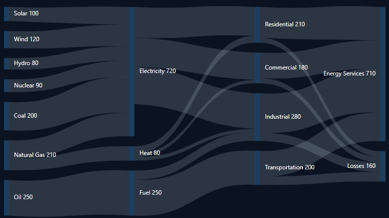

# Nodes in Blazor Sankey Diagram

## Overview

Nodes are fundamental elements in a Sankey Diagram, representing entities or stages in a process flow. This topic describes how to define, customize, and work with nodes in the Blazor Sankey Diagram.

## Basic Node Configuration

To add nodes to a Sankey Diagram, define a collection of `SankeyDataNode` objects. Each node requires a unique identifier and optional properties for display and layout.

- Each node must include a unique `Id` property.
- The `Label` property is of type `SankeyDataLabel` and specifies the text displayed for the node.
- Node positions are determined automatically based on connections defined in the `Links` collection.

Here is an example of configuring nodes in the Sankey Diagram:




@using Syncfusion.Blazor;
@using Syncfusion.Blazor.Sankey;

<SfSankey BackgroundColor="@_backgroundColor" Nodes=@Nodes Links=@Links>
    <SankeyNodeSettings Color="#1c3f60" Width="10" Padding="20"></SankeyNodeSettings>
    <SankeyLinkSettings Color="#afc1d0" Opacity="0.2"></SankeyLinkSettings>
    <SankeyLabelSettings Color="#FFFFFF" FontWeight="400" ></SankeyLabelSettings>
    <SankeyLegendSettings Visible="false"></SankeyLegendSettings>
</SfSankey>

@code {
    string _backgroundColor = "#0b1320";

    public List<SankeyDataNode> Nodes = new List<SankeyDataNode>();
    public List<SankeyDataLink> Links = new List<SankeyDataLink>();

    protected override void OnInitialized()
    {
        Nodes = new List<SankeyDataNode>()
        {
            new SankeyDataNode() { Id = "Solar", Label = new SankeyDataLabel() { Text = "Solar" } },
            new SankeyDataNode() { Id = "Wind", Label = new SankeyDataLabel() { Text = "Wind" } },
            new SankeyDataNode() { Id = "Hydro", Label = new SankeyDataLabel() { Text = "Hydro" } },
            new SankeyDataNode() { Id = "Nuclear", Label = new SankeyDataLabel() { Text = "Nuclear" } },
            new SankeyDataNode() { Id = "Coal", Label = new SankeyDataLabel() { Text = "Coal" } },
            new SankeyDataNode() { Id = "Natural Gas", Label = new SankeyDataLabel() { Text = "Natural Gas" } },
            new SankeyDataNode() { Id = "Oil", Label = new SankeyDataLabel() { Text = "Oil" } },
            new SankeyDataNode() { Id = "Electricity", Label = new SankeyDataLabel() { Text = "Electricity" } },
            new SankeyDataNode() { Id = "Heat", Label = new SankeyDataLabel() { Text = "Heat" } },
            new SankeyDataNode() { Id = "Fuel", Label = new SankeyDataLabel() { Text = "Fuel" } },
            new SankeyDataNode() { Id = "Residential", Label = new SankeyDataLabel() { Text = "Residential" } },
            new SankeyDataNode() { Id = "Commercial", Label = new SankeyDataLabel() { Text = "Commercial" } },
            new SankeyDataNode() { Id = "Industrial", Label = new SankeyDataLabel() { Text = "Industrial" } },
            new SankeyDataNode() { Id = "Transportation", Label = new SankeyDataLabel() { Text = "Transportation" } },
            new SankeyDataNode() { Id = "Energy Services", Label = new SankeyDataLabel() { Text = "Energy Services" } },
            new SankeyDataNode() { Id = "Losses", Label = new SankeyDataLabel() { Text = "Losses" } }
        };

        Links = new List<SankeyDataLink>()
        {
            // Energy Sources to Carriers
            new SankeyDataLink() { SourceId = "Solar", TargetId = "Electricity", Value = 100 },
            new SankeyDataLink() { SourceId = "Wind", TargetId = "Electricity", Value = 120 },
            new SankeyDataLink() { SourceId = "Hydro", TargetId = "Electricity", Value = 80 },
            new SankeyDataLink() { SourceId = "Nuclear", TargetId = "Electricity", Value = 90 },
            new SankeyDataLink() { SourceId = "Coal", TargetId = "Electricity", Value = 200 },
            new SankeyDataLink() { SourceId = "Natural Gas", TargetId = "Electricity", Value = 130 },
            new SankeyDataLink() { SourceId = "Natural Gas", TargetId = "Heat", Value = 80 },
            new SankeyDataLink() { SourceId = "Oil", TargetId = "Fuel", Value = 250 },

            // Energy Carriers to Sectors
            new SankeyDataLink() { SourceId = "Electricity", TargetId = "Residential", Value = 170 },
            new SankeyDataLink() { SourceId = "Electricity", TargetId = "Commercial", Value = 160 },
            new SankeyDataLink() { SourceId = "Electricity", TargetId = "Industrial", Value = 210 },
            new SankeyDataLink() { SourceId = "Heat", TargetId = "Residential", Value = 40 },
            new SankeyDataLink() { SourceId = "Heat", TargetId = "Commercial", Value = 20 },
            new SankeyDataLink() { SourceId = "Heat", TargetId = "Industrial", Value = 20 },
            new SankeyDataLink() { SourceId = "Fuel", TargetId = "Transportation", Value = 200 },
            new SankeyDataLink() { SourceId = "Fuel", TargetId = "Industrial", Value = 50 },

            // Sectors to End Use and Losses
            new SankeyDataLink() { SourceId = "Residential", TargetId = "Energy Services", Value = 180 },
            new SankeyDataLink() { SourceId = "Commercial", TargetId = "Energy Services", Value = 150 },
            new SankeyDataLink() { SourceId = "Industrial", TargetId = "Energy Services", Value = 230 },
            new SankeyDataLink() { SourceId = "Transportation", TargetId = "Energy Services", Value = 150 },
            new SankeyDataLink() { SourceId = "Residential", TargetId = "Losses", Value = 30 },
            new SankeyDataLink() { SourceId = "Commercial", TargetId = "Losses", Value = 30 },
            new SankeyDataLink() { SourceId = "Industrial", TargetId = "Losses", Value = 50 },
            new SankeyDataLink() { SourceId = "Transportation", TargetId = "Losses", Value = 50 }
        };
        base.OnInitialized();
    }
}




In this example, nodes represent categories such as sources, energy types, and usage groups.

## Customizing Node Appearance

Nodes represent the primary entities in a Sankey Diagram, and their appearance can be tailored to improve clarity and style. Using `SankeyNodeSettings`, properties such as width, alignment, padding, and spacing can be configured to avoid overlap and enhance readability.

- `Width`: Sets the node width. The default value is `20`; increase or decrease to adjust emphasis.
- `Alignment`: Controls node alignment options:
  - Left: Aligns nodes to the left edge of the layout.
  - Top: Aligns nodes to the top edge of the layout.
  - Stretch: Stretches nodes to fill available space.
- `Offset`: Applies an additional offset relative to the alignment to fine‑tune placement.
- `Padding`: Defines spacing around nodes to prevent overlap with other elements.
- `Color`: Customizes the fill color of nodes (configurable).
- `Opacity`: Adjusts node transparency (configurable).

Example:




<SankeyNodeSettings 
    Width="30" 
    Alignment="SankeyNodeAlign.Left" 
    Offset="10" 
    Padding="10">
</SankeyNodeSettings>



## Key Considerations

- Use meaningful IDs and labels to improve diagram readability.
- Adjust node width, padding, and alignment to maintain visual hierarchy and spacing.
- Define links to accurately represent relationships and flow between nodes.
- Leverage `SankeyLinkSettings` and `SankeyLabelSettings` to style links and labels consistently.

Mastering node configuration enables creation of rich, informative flow diagrams that communicate complex processes and relationships effectively. The example demonstrates a comprehensive visualization of energy usage patterns across sectors.

## See also

* [Links](./links)
* [Labels](./labels)
* [Legend](./legend)
* [tooltip](./tooltip)
