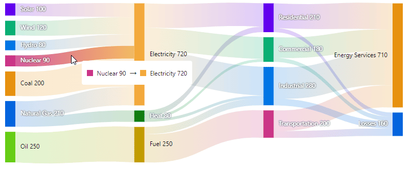

# Tooltips in Blazor Sankey Diagram

The **Blazor Sankey Diagram** is a powerful tool for visualizing energy flow, financial data, or any other system with nodes and links. The component allows you to display a flow diagram where nodes represent entities, and links represent the relationships or flows between them.

This guide provides step-by-step instructions on how to configure and customize tooltips within the **Blazor Sankey Diagram**.

## Basic Tooltip Configuration

Tooltips can be added to your Sankey diagram using the `SankeyTooltipSettings`. Below is an example of how to configure tooltips in the Sankey Diagram:




@using Syncfusion.Blazor;
@using Syncfusion.Blazor.Sankey;

<SfSankey Nodes=@Nodes Links=@Links>
    <SankeyTooltipSettings Enable="true"></SankeyTooltipSettings>
</SfSankey>
@code {
    public List<SankeyDataNode> Nodes = new List<SankeyDataNode>();
    public List<SankeyDataLink> Links = new List<SankeyDataLink>();        
    protected override void OnInitialized()
    {
        Nodes = new List<SankeyDataNode>()
        {
            new SankeyDataNode() { Id = "Solar", Label = new SankeyDataLabel() { Text = "Solar" } },
            new SankeyDataNode() { Id = "Wind", Label = new SankeyDataLabel() { Text = "Wind" } },
            new SankeyDataNode() { Id = "Hydro", Label = new SankeyDataLabel() { Text = "Hydro" } },
            new SankeyDataNode() { Id = "Nuclear", Label = new SankeyDataLabel() { Text = "Nuclear" } },
            new SankeyDataNode() { Id = "Coal", Label = new SankeyDataLabel() { Text = "Coal" } },
            new SankeyDataNode() { Id = "Natural Gas", Label = new SankeyDataLabel() { Text = "Natural Gas" } },
            new SankeyDataNode() { Id = "Oil", Label = new SankeyDataLabel() { Text = "Oil" } },
            new SankeyDataNode() { Id = "Electricity", Label = new SankeyDataLabel() { Text = "Electricity" } },
            new SankeyDataNode() { Id = "Heat", Label = new SankeyDataLabel() { Text = "Heat" } },
            new SankeyDataNode() { Id = "Fuel", Label = new SankeyDataLabel() { Text = "Fuel" } },
            new SankeyDataNode() { Id = "Residential", Label = new SankeyDataLabel() { Text = "Residential" } },
            new SankeyDataNode() { Id = "Commercial", Label = new SankeyDataLabel() { Text = "Commercial" } },
            new SankeyDataNode() { Id = "Industrial", Label = new SankeyDataLabel() { Text = "Industrial" } },
            new SankeyDataNode() { Id = "Transportation", Label = new SankeyDataLabel() { Text = "Transportation" } },
            new SankeyDataNode() { Id = "Energy Services", Label = new SankeyDataLabel() { Text = "Energy Services" } },
            new SankeyDataNode() { Id = "Losses", Label = new SankeyDataLabel() { Text = "Losses" } }
        };

        Links = new List<SankeyDataLink>()
        {
            // Energy Sources to Carriers
            new SankeyDataLink() { SourceId = "Solar", TargetId = "Electricity", Value = 100 },
            new SankeyDataLink() { SourceId = "Wind", TargetId = "Electricity", Value = 120 },
            new SankeyDataLink() { SourceId = "Hydro", TargetId = "Electricity", Value = 80 },
            new SankeyDataLink() { SourceId = "Nuclear", TargetId = "Electricity", Value = 90 },
            new SankeyDataLink() { SourceId = "Coal", TargetId = "Electricity", Value = 200 },
            new SankeyDataLink() { SourceId = "Natural Gas", TargetId = "Electricity", Value = 130 },
            new SankeyDataLink() { SourceId = "Natural Gas", TargetId = "Heat", Value = 80 },
            new SankeyDataLink() { SourceId = "Oil", TargetId = "Fuel", Value = 250 },

            // Energy Carriers to Sectors
            new SankeyDataLink() { SourceId = "Electricity", TargetId = "Residential", Value = 170 },
            new SankeyDataLink() { SourceId = "Electricity", TargetId = "Commercial", Value = 160 },
            new SankeyDataLink() { SourceId = "Electricity", TargetId = "Industrial", Value = 210 },
            new SankeyDataLink() { SourceId = "Heat", TargetId = "Residential", Value = 40 },
            new SankeyDataLink() { SourceId = "Heat", TargetId = "Commercial", Value = 20 },
            new SankeyDataLink() { SourceId = "Heat", TargetId = "Industrial", Value = 20 },
            new SankeyDataLink() { SourceId = "Fuel", TargetId = "Transportation", Value = 200 },
            new SankeyDataLink() { SourceId = "Fuel", TargetId = "Industrial", Value = 50 },

            // Sectors to End Use and Losses
            new SankeyDataLink() { SourceId = "Residential", TargetId = "Energy Services", Value = 180 },
            new SankeyDataLink() { SourceId = "Commercial", TargetId = "Energy Services", Value = 150 },
            new SankeyDataLink() { SourceId = "Industrial", TargetId = "Energy Services", Value = 230 },
            new SankeyDataLink() { SourceId = "Transportation", TargetId = "Energy Services", Value = 150 },
            new SankeyDataLink() { SourceId = "Residential", TargetId = "Losses", Value = 30 },
            new SankeyDataLink() { SourceId = "Commercial", TargetId = "Losses", Value = 30 },
            new SankeyDataLink() { SourceId = "Industrial", TargetId = "Losses", Value = 50 },
            new SankeyDataLink() { SourceId = "Transportation", TargetId = "Losses", Value = 50 }
        };
        base.OnInitialized();
    }
}




## Customizing Tooltip Appearance

The **Blazor Sankey Diagram** allows you to customize the appearance and behavior of tooltips through several properties. The tooltip settings allow for full control over how tooltips appear, including their background color, opacity, and animation effects for both nodes and links.

- **`Enable`**: Controls whether tooltips are displayed. Default is `true`.
- **`Fill`**: Sets the background color of the tooltip.
- **`Opacity`**: Adjusts the tooltip opacity (0 to 1). Default is `0.75`.
- **`NodeFormat`**: Defines the format for node tooltips.
- **`LinkFormat`**: Specifies the format for link tooltips.
- **`EnableAnimation`**: Toggles tooltip animation. Default is `true`.
- **`Duration`**: Sets the duration (in milliseconds) for the tooltip animation. Default is `300`.
- **`FadeOutDuration`**: Specifies the fade-out duration for tooltips (in milliseconds). Default is `1000`.




@using Syncfusion.Blazor;
@using Syncfusion.Blazor.Sankey;

<SfSankey Nodes=@Nodes Links=@Links Title="Energy Flow" SubTitle="-2024">
    <SankeyTooltipSettings 
    Enable="true" 
    Fill="#afc1d0" 
    Opacity="0.9"
    NodeFormat="Node: {name} Value: {value}"
    LinkFormat="From {source} {source-value} , {target} {target-value}"
    EnableAnimation="true"
    Duration="500"
    FadeOutDuration="1500">
    <SankeyTooltipTextStyle 
        Color="#333333" 
        FontSize="12px" 
        FontFamily="Arial">
    </SankeyTooltipTextStyle>
</SankeyTooltipSettings>
</SfSankey>
@code {
    public List<SankeyDataNode> Nodes = new List<SankeyDataNode>();
    public List<SankeyDataLink> Links = new List<SankeyDataLink>();        
    protected override void OnInitialized()
    {
        Nodes = new List<SankeyDataNode>()
        {
            new SankeyDataNode() { Id = "Solar", Label = new SankeyDataLabel() { Text = "Solar" } },
            new SankeyDataNode() { Id = "Wind", Label = new SankeyDataLabel() { Text = "Wind" } },
            new SankeyDataNode() { Id = "Hydro", Label = new SankeyDataLabel() { Text = "Hydro" } },
            new SankeyDataNode() { Id = "Nuclear", Label = new SankeyDataLabel() { Text = "Nuclear" } },
            new SankeyDataNode() { Id = "Coal", Label = new SankeyDataLabel() { Text = "Coal" } },
            new SankeyDataNode() { Id = "Natural Gas", Label = new SankeyDataLabel() { Text = "Natural Gas" } },
            new SankeyDataNode() { Id = "Oil", Label = new SankeyDataLabel() { Text = "Oil" } },
            new SankeyDataNode() { Id = "Electricity", Label = new SankeyDataLabel() { Text = "Electricity" } },
            new SankeyDataNode() { Id = "Heat", Label = new SankeyDataLabel() { Text = "Heat" } },
            new SankeyDataNode() { Id = "Fuel", Label = new SankeyDataLabel() { Text = "Fuel" } },
            new SankeyDataNode() { Id = "Residential", Label = new SankeyDataLabel() { Text = "Residential" } },
            new SankeyDataNode() { Id = "Commercial", Label = new SankeyDataLabel() { Text = "Commercial" } },
            new SankeyDataNode() { Id = "Industrial", Label = new SankeyDataLabel() { Text = "Industrial" } },
            new SankeyDataNode() { Id = "Transportation", Label = new SankeyDataLabel() { Text = "Transportation" } },
            new SankeyDataNode() { Id = "Energy Services", Label = new SankeyDataLabel() { Text = "Energy Services" } },
            new SankeyDataNode() { Id = "Losses", Label = new SankeyDataLabel() { Text = "Losses" } }
        };

        Links = new List<SankeyDataLink>()
        {
            // Energy Sources to Carriers
            new SankeyDataLink() { SourceId = "Solar", TargetId = "Electricity", Value = 100 },
            new SankeyDataLink() { SourceId = "Wind", TargetId = "Electricity", Value = 120 },
            new SankeyDataLink() { SourceId = "Hydro", TargetId = "Electricity", Value = 80 },
            new SankeyDataLink() { SourceId = "Nuclear", TargetId = "Electricity", Value = 90 },
            new SankeyDataLink() { SourceId = "Coal", TargetId = "Electricity", Value = 200 },
            new SankeyDataLink() { SourceId = "Natural Gas", TargetId = "Electricity", Value = 130 },
            new SankeyDataLink() { SourceId = "Natural Gas", TargetId = "Heat", Value = 80 },
            new SankeyDataLink() { SourceId = "Oil", TargetId = "Fuel", Value = 250 },

            // Energy Carriers to Sectors
            new SankeyDataLink() { SourceId = "Electricity", TargetId = "Residential", Value = 170 },
            new SankeyDataLink() { SourceId = "Electricity", TargetId = "Commercial", Value = 160 },
            new SankeyDataLink() { SourceId = "Electricity", TargetId = "Industrial", Value = 210 },
            new SankeyDataLink() { SourceId = "Heat", TargetId = "Residential", Value = 40 },
            new SankeyDataLink() { SourceId = "Heat", TargetId = "Commercial", Value = 20 },
            new SankeyDataLink() { SourceId = "Heat", TargetId = "Industrial", Value = 20 },
            new SankeyDataLink() { SourceId = "Fuel", TargetId = "Transportation", Value = 200 },
            new SankeyDataLink() { SourceId = "Fuel", TargetId = "Industrial", Value = 50 },

            // Sectors to End Use and Losses
            new SankeyDataLink() { SourceId = "Residential", TargetId = "Energy Services", Value = 180 },
            new SankeyDataLink() { SourceId = "Commercial", TargetId = "Energy Services", Value = 150 },
            new SankeyDataLink() { SourceId = "Industrial", TargetId = "Energy Services", Value = 230 },
            new SankeyDataLink() { SourceId = "Transportation", TargetId = "Energy Services", Value = 150 },
            new SankeyDataLink() { SourceId = "Residential", TargetId = "Losses", Value = 30 },
            new SankeyDataLink() { SourceId = "Commercial", TargetId = "Losses", Value = 30 },
            new SankeyDataLink() { SourceId = "Industrial", TargetId = "Losses", Value = 50 },
            new SankeyDataLink() { SourceId = "Transportation", TargetId = "Losses", Value = 50 }
        };
        base.OnInitialized();
    }
}




## Advanced Tooltip Configuration

### Custom Tooltip Templates

For more advanced customizations, you can use custom templates for both node and link tooltips by utilizing the `SankeyNodeTemplate` and `SankeyLinkTemplate` properties. This allows you to define HTML templates that customize the layout and content of the tooltips.




@using Syncfusion.Blazor;
@using Syncfusion.Blazor.Sankey;

<SfSankey Nodes=@Nodes Links=@Links Title="Energy Flow" SubTitle="-2024">
    <SankeyTooltipSettings>
        <SankeyNodeTemplate>
            @{
                var data = context as SankeyNodeContext;
                if (data != null)
                {
                    

                        

                            
Node: @data.Node.Id

                        

                        

                            
Value: @data.Node.Label.Text 

                        

                    

                }
            }
        </SankeyNodeTemplate>
        <SankeyLinkTemplate>
            @{
                var data = context as SankeyLinkContext;
                if (data != null)
                {
                    <table class="table table-striped mt-3">
                        <thead>
                            <tr>
                                <th>Source Node</th>
                                <th>Destination Node</th>
                                <th>Value</th>
                            </tr>
                        </thead>
                        <tbody>
                            <tr>
                                <td>@data.Link.SourceId</td>
                                <td>@data.Link.TargetId</td>
                                <td>@data.Link.Value</td>
                            </tr>
                        </tbody>
                    </table>
                }
            }
        </SankeyLinkTemplate>
    </SankeyTooltipSettings>
</SfSankey>

@code {
    public List<SankeyDataNode> Nodes = new List<SankeyDataNode>();
    public List<SankeyDataLink> Links = new List<SankeyDataLink>();        
    protected override void OnInitialized()
    {
        Nodes = new List<SankeyDataNode>()
        {
            new SankeyDataNode() { Id = "Solar", Label = new SankeyDataLabel() { Text = "100" } },
            new SankeyDataNode() { Id = "Wind", Label = new SankeyDataLabel() { Text = "120" } },
            new SankeyDataNode() { Id = "Hydro", Label = new SankeyDataLabel() { Text = "80" } },
            new SankeyDataNode() { Id = "Nuclear", Label = new SankeyDataLabel() { Text = "90" } },
            new SankeyDataNode() { Id = "Coal", Label = new SankeyDataLabel() { Text = "200" } },
            new SankeyDataNode() { Id = "Natural Gas", Label = new SankeyDataLabel() { Text = "210" } },
            new SankeyDataNode() { Id = "Oil", Label = new SankeyDataLabel() { Text = "250" } },
            new SankeyDataNode() { Id = "Electricity", Label = new SankeyDataLabel() { Text = "720" } },
            new SankeyDataNode() { Id = "Heat", Label = new SankeyDataLabel() { Text = "80" } },
            new SankeyDataNode() { Id = "Fuel", Label = new SankeyDataLabel() { Text = "250" } },
            new SankeyDataNode() { Id = "Residential", Label = new SankeyDataLabel() { Text = "210" } },
            new SankeyDataNode() { Id = "Commercial", Label = new SankeyDataLabel() { Text = "180" } },
            new SankeyDataNode() { Id = "Industrial", Label = new SankeyDataLabel() { Text = "280" } },
            new SankeyDataNode() { Id = "Transportation", Label = new SankeyDataLabel() { Text = "200" } },
            new SankeyDataNode() { Id = "Energy Services", Label = new SankeyDataLabel() { Text = "710" } },
            new SankeyDataNode() { Id = "Losses", Label = new SankeyDataLabel() { Text = "160" } }
        };

        Links = new List<SankeyDataLink>()
        {
            // Energy Sources to Carriers
            new SankeyDataLink() { SourceId = "Solar", TargetId = "Electricity", Value = 100 },
            new SankeyDataLink() { SourceId = "Wind", TargetId = "Electricity", Value = 120 },
            new SankeyDataLink() { SourceId = "Hydro", TargetId = "Electricity", Value = 80 },
            new SankeyDataLink() { SourceId = "Nuclear", TargetId = "Electricity", Value = 90 },
            new SankeyDataLink() { SourceId = "Coal", TargetId = "Electricity", Value = 200 },
            new SankeyDataLink() { SourceId = "Natural Gas", TargetId = "Electricity", Value = 130 },
            new SankeyDataLink() { SourceId = "Natural Gas", TargetId = "Heat", Value = 80 },
            new SankeyDataLink() { SourceId = "Oil", TargetId = "Fuel", Value = 250 },

            // Energy Carriers to Sectors
            new SankeyDataLink() { SourceId = "Electricity", TargetId = "Residential", Value = 170 },
            new SankeyDataLink() { SourceId = "Electricity", TargetId = "Commercial", Value = 160 },
            new SankeyDataLink() { SourceId = "Electricity", TargetId = "Industrial", Value = 210 },
            new SankeyDataLink() { SourceId = "Heat", TargetId = "Residential", Value = 40 },
            new SankeyDataLink() { SourceId = "Heat", TargetId = "Commercial", Value = 20 },
            new SankeyDataLink() { SourceId = "Heat", TargetId = "Industrial", Value = 20 },
            new SankeyDataLink() { SourceId = "Fuel", TargetId = "Transportation", Value = 200 },
            new SankeyDataLink() { SourceId = "Fuel", TargetId = "Industrial", Value = 50 },

            // Sectors to End Use and Losses
            new SankeyDataLink() { SourceId = "Residential", TargetId = "Energy Services", Value = 180 },
            new SankeyDataLink() { SourceId = "Commercial", TargetId = "Energy Services", Value = 150 },
            new SankeyDataLink() { SourceId = "Industrial", TargetId = "Energy Services", Value = 230 },
            new SankeyDataLink() { SourceId = "Transportation", TargetId = "Energy Services", Value = 150 },
            new SankeyDataLink() { SourceId = "Residential", TargetId = "Losses", Value = 30 },
            new SankeyDataLink() { SourceId = "Commercial", TargetId = "Losses", Value = 30 },
            new SankeyDataLink() { SourceId = "Industrial", TargetId = "Losses", Value = 50 },
            new SankeyDataLink() { SourceId = "Transportation", TargetId = "Losses", Value = 50 }
        };
        base.OnInitialized();
    }
}




**Node Template**

**Link Template**

These templates allow you to completely customize the content and appearance of tooltips for nodes and links.

## Key Considerations

- Use clear and concise tooltip content to improve readability.
- Choose appropriate colors and opacity levels that contrast well with your Sankey diagram.
- Consider using custom templates for more complex tooltip designs or to include additional data.
- Adjust animation settings to ensure smooth transitions without being distracting.
- Use the `NodeFormat` and `LinkFormat` properties for quick customization of tooltip content without needing to create full templates.

## Tooltip Interaction

Tooltips appear when users hover over nodes or links in the Sankey diagram. The `EnableAnimation` property, when set to true, allows for smooth transitions as the tooltip moves between different elements.

By effectively configuring and customizing tooltips in the Blazor Sankey Diagram, you can create more informative and interactive diagrams. Tooltips play a crucial role in helping users understand detailed information about specific nodes and links without cluttering the main diagram view.

## See also

* [Nodes](./nodes)
* [Links](./links)
* [Labels](./labels)