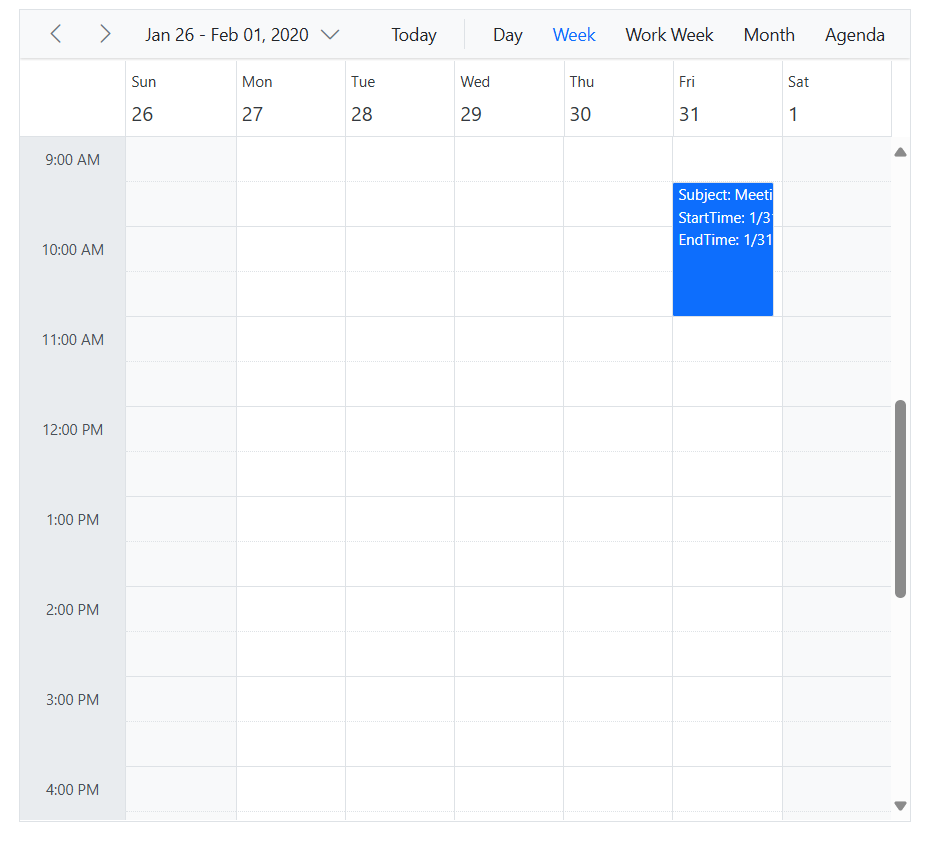
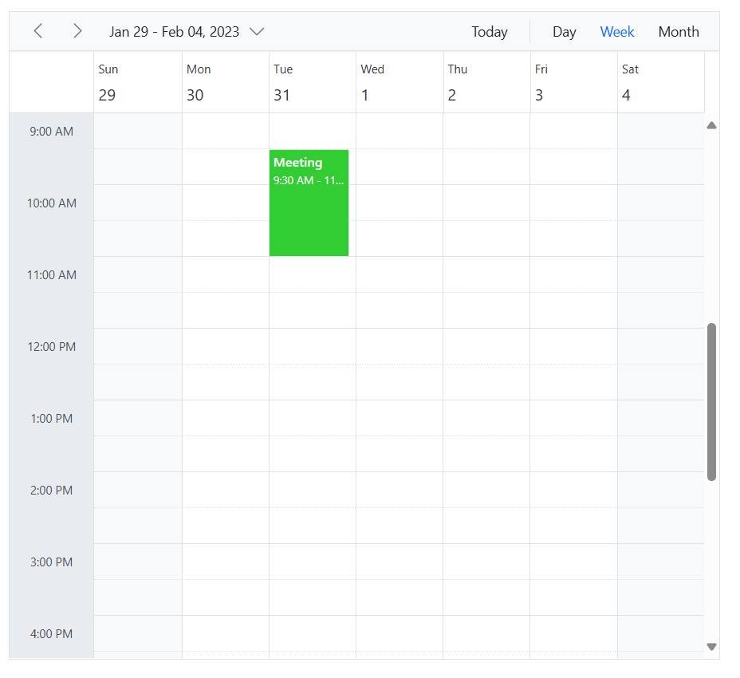
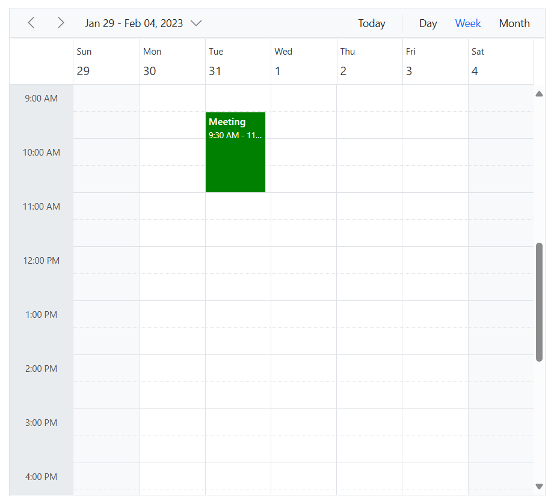

# Appointment Customization in Blazor Scheduler Component

The look and feel of the Scheduler events can be customized using any one of the following ways.

* [Using event template](#using-template)
* [Using EventRendered event](#using-eventrendered-event)
* [Using CssClass property](#using-cssclass)

## Using Template

An event template provides full control over the rendering of each appointment's content. Text, images, links, and even other Blazor components can be dynamically added to customize the look of events. This is achieved using the [`Template`](https://help.syncfusion.com/cr/blazor/Syncfusion.Blazor.Schedule.ScheduleEventSettings-1.html#Syncfusion_Blazor_Schedule_ScheduleEventSettings_1_Template) option available within the `ScheduleEventSettings` property.

To get started quickly customizing events using a template, refer to this video:



The following code example customizes the appointment.

```cshtml
@using Syncfusion.Blazor.Schedule

<SfSchedule TValue="AppointmentData" Height="650px" @bind-SelectedDate="@CurrentDate">
    <ScheduleEventSettings DataSource="@DataSource">
        <Template>
            <div>Subject: @((context as AppointmentData).Subject)</div>
            <div>StartTime: @((context as AppointmentData).StartTime)</div>
            <div>EndTime:  @((context as AppointmentData).EndTime)</div>
        </Template>
    </ScheduleEventSettings>
    <ScheduleViews>
        <ScheduleView Option="View.Day"></ScheduleView>
        <ScheduleView Option="View.Week"></ScheduleView>
        <ScheduleView Option="View.WorkWeek"></ScheduleView>
        <ScheduleView Option="View.Month"></ScheduleView>
        <ScheduleView Option="View.Agenda"></ScheduleView>
    </ScheduleViews>
</SfSchedule>
@code {
    DateTime CurrentDate = new DateTime(2020, 1, 31);
    List<AppointmentData> DataSource = new List<AppointmentData>
    {
        new AppointmentData { Id = 1, Subject = "Meeting", StartTime = new DateTime(2020, 1, 31, 9, 30, 0) , EndTime = new DateTime(2020, 1, 31, 11, 0, 0) }
    };

    public class AppointmentData
    {
        public int Id { get; set; }
        public string Subject { get; set; }
        public string Location { get; set; }
        public DateTime StartTime { get; set; }
        public DateTime EndTime { get; set; }
        public string Description { get; set; }
        public bool IsAllDay { get; set; }
        public string RecurrenceRule { get; set; }
        public string RecurrenceException { get; set; }
        public Nullable<int> RecurrenceID { get; set; }
    }
}
```





N> All the built-in fields that are mapped to the appropriate field properties within the `ScheduleEventSettings`, as well as custom mapped fields from the Scheduler dataSource can be accessed within the template code.

## Using EventRendered Event

The [EventRendered](https://help.syncfusion.com/cr/blazor/Syncfusion.Blazor.Schedule.ScheduleEvents-1.html#Syncfusion_Blazor_Schedule_ScheduleEvents_1_EventRendered) event triggers just before each appointment is rendered on the Scheduler. This event is highly versatile and can be used to dynamically customize the visual appearance of events based on specific criteria or conditions.

In the following code example, the custom class has been added to events using [CssClasses](https://help.syncfusion.com/cr/blazor/Syncfusion.Blazor.Schedule.EventRenderedArgs-1.html#Syncfusion_Blazor_Schedule_EventRenderedArgs_1_CssClasses) to apply color to the events.

```cshtml
@using Syncfusion.Blazor.Schedule

<SfSchedule TValue="AppointmentData" Height="650px" @bind-SelectedDate="@CurrentDate">
    <ScheduleEvents TValue="AppointmentData" EventRendered="OnEventRendered"></ScheduleEvents>
    <ScheduleViews>
        <ScheduleView Option="View.Day"></ScheduleView>
        <ScheduleView Option="View.Week"></ScheduleView>
        <ScheduleView Option="View.Month"></ScheduleView>
    </ScheduleViews>
    <ScheduleEventSettings DataSource="@DataSource"></ScheduleEventSettings>
</SfSchedule>
@code {
    DateTime CurrentDate = new DateTime(2023, 1, 31);
    public List<string> CustomClass = new List<string>()  { "custom-class" } ;
    public void OnEventRendered(EventRenderedArgs<AppointmentData> args)
    {
        args.CssClasses = CustomClass;
    }
    List<AppointmentData> DataSource = new List<AppointmentData>
    {
        new AppointmentData{ Id = 1, Subject = "Meeting", StartTime = new DateTime(2023, 1, 31, 9, 30, 0) , EndTime = new DateTime(2023, 1, 31, 11, 0, 0) }
    };

    public class AppointmentData
    {
        public int Id { get; set; }
        public string Subject { get; set; }
        public string Location { get; set; }
        public DateTime StartTime { get; set; }
        public DateTime EndTime { get; set; }
        public string Description { get; set; }
        public bool IsAllDay { get; set; }
        public string RecurrenceRule { get; set; }
        public string RecurrenceException { get; set; }
        public Nullable<int> RecurrenceID { get; set; }
    }
}
<style>
    .e-schedule .e-vertical-view .e-all-day-appointment-wrapper .e-appointment.custom-class,
    .e-schedule .e-vertical-view .e-day-wrapper .e-appointment.custom-class,
    .e-schedule .e-month-view .e-appointment.custom-class {
        background: #32CD32;
    }
</style>
```




Events can also be customized by adding or modifying its element attribute using [Attributes](https://help.syncfusion.com/cr/blazor/Syncfusion.Blazor.Schedule.EventRenderedArgs-1.html#Syncfusion_Blazor_Schedule_EventRenderedArgs_1_Attributes). In the following code example, event attributes have been modified through the `Attributes` to apply color to the events.

```cshtml
@using Syncfusion.Blazor.Schedule

<SfSchedule TValue="AppointmentData" Height="650px" @bind-SelectedDate="@CurrentDate">
    <ScheduleEvents TValue="AppointmentData" EventRendered="OnEventRendered"></ScheduleEvents>
    <ScheduleViews>
        <ScheduleView Option="View.Day"></ScheduleView>
        <ScheduleView Option="View.Week"></ScheduleView>
        <ScheduleView Option="View.Month"></ScheduleView>
    </ScheduleViews>
    <ScheduleEventSettings DataSource="@DataSource"></ScheduleEventSettings>
</SfSchedule>
@code {
    DateTime CurrentDate = new DateTime(2023, 1, 31);
    public List<string> CustomClass = new List<string>() { "custom-class" };
    public void OnEventRendered(EventRenderedArgs<AppointmentData> args)
    {
        Dictionary<string, object> attributes = new Dictionary<string, object>();
        attributes.Add("style", "background: green");
        args.Attributes = attributes;
    }
    List<AppointmentData> DataSource = new List<AppointmentData>
    {
        new AppointmentData{ Id = 1, Subject = "Meeting", StartTime = new DateTime(2023, 1, 31, 9, 30, 0) , EndTime = new DateTime(2023, 1, 31, 11, 0, 0) }
    };

    public class AppointmentData
    {
        public int Id { get; set; }
        public string Subject { get; set; }
        public string Location { get; set; }
        public DateTime StartTime { get; set; }
        public DateTime EndTime { get; set; }
        public string Description { get; set; }
        public bool IsAllDay { get; set; }
        public string RecurrenceRule { get; set; }
        public string RecurrenceException { get; set; }
        public Nullable<int> RecurrenceID { get; set; }
    }
}
```




## Using CssClass 

The customization of events can also be achieved using the built-in field [CssClass](https://help.syncfusion.com/cr/blazor/Syncfusion.Blazor.Schedule.SfSchedule-1.html#Syncfusion_Blazor_Schedule_SfSchedule_1_CssClass) in which you can pass the class name to be applied to specific appointments. In the following example, the background of appointments has been changed.

```cshtml
@using Syncfusion.Blazor.Schedule

@using Syncfusion.Blazor.Schedule
<SfSchedule TValue="AppointmentData" Height="650px" @bind-SelectedDate="@CurrentDate">
    <ScheduleViews>
        <ScheduleView Option="View.Day"></ScheduleView>
        <ScheduleView Option="View.Week"></ScheduleView>
        <ScheduleView Option="View.Month"></ScheduleView>
    </ScheduleViews>
    <ScheduleEventSettings DataSource="@DataSource"></ScheduleEventSettings>
</SfSchedule>
@code {
    DateTime CurrentDate = new DateTime(2023, 1, 31);
    List<AppointmentData> DataSource = new List<AppointmentData>
    {
        new AppointmentData{ Id = 1, Subject = "Meeting", StartTime = new DateTime(2023, 1, 31, 9, 30, 0) , EndTime = new DateTime(2023, 1, 31, 11, 0, 0), CssClass = "progress" },
        new AppointmentData{ Id = 2, Subject = "Meeting-postponed", StartTime = new DateTime(2023, 1, 28, 9, 30, 0) , EndTime = new DateTime(2023, 1, 28, 11, 0, 0), CssClass = "delayed" }
    };

    public class AppointmentData
    {
        public int Id { get; set; }
        public string Subject { get; set; }
        public string Location { get; set; }
        public DateTime StartTime { get; set; }
        public DateTime EndTime { get; set; }
        public string Description { get; set; }
        public string CssClass { get; set; }
        public bool IsAllDay { get; set; }
        public string RecurrenceRule { get; set; }
        public string RecurrenceException { get; set; }
        public Nullable<int> RecurrenceID { get; set; }
    }
}
<style>
    .e-schedule .e-vertical-view .e-all-day-appointment-wrapper .e-appointment.progress,
    .e-schedule .e-vertical-view .e-day-wrapper .e-appointment.progress,
    .e-schedule .e-month-view .e-appointment.progress {
        background: #32CD32;
    }

    .e-schedule .e-vertical-view .e-all-day-appointment-wrapper .e-appointment.delayed,
    .e-schedule .e-vertical-view .e-day-wrapper .e-appointment.delayed,
    .e-schedule .e-month-view .e-appointment.delayed {
        background: #CD5C5C;
    }
</style>
```



Also, the customization of events can be achieved using [CssClass](https://help.syncfusion.com/cr/blazor/Syncfusion.Blazor.Schedule.SfSchedule-1.html#Syncfusion_Blazor_Schedule_SfSchedule_1_CssClass) property of the Scheduler. In the following example, the background of appointments has been changed using the CssClass.

```cshtml
@using Syncfusion.Blazor.Schedule

<SfSchedule TValue="AppointmentData" Height="550px" CssClass="custom-class" @bind-SelectedDate="@CurrentDate">
    <ScheduleEventSettings DataSource="@DataSource"></ScheduleEventSettings>
    <ScheduleViews>
        <ScheduleView Option="View.Day"></ScheduleView>
        <ScheduleView Option="View.Week"></ScheduleView>
        <ScheduleView Option="View.WorkWeek"></ScheduleView>
        <ScheduleView Option="View.Month"></ScheduleView>
        <ScheduleView Option="View.Agenda"></ScheduleView>
    </ScheduleViews>
</SfSchedule>

@code{
    DateTime CurrentDate = new DateTime(2020, 1, 31);
    List<AppointmentData> DataSource = new List<AppointmentData>
    {
        new AppointmentData { Id = 1, Subject = "Meeting", StartTime = new DateTime(2020, 1, 31, 9, 30, 0) , EndTime = new DateTime(2020, 1, 31, 11, 0, 0) }
    };

    public class AppointmentData
    {
        public int Id { get; set; }
        public string Subject { get; set; }
        public string Location { get; set; }
        public DateTime StartTime { get; set; }
        public DateTime EndTime { get; set; }
        public string Description { get; set; }
        public bool IsAllDay { get; set; }
        public string RecurrenceRule { get; set; }
        public string RecurrenceException { get; set; }
        public Nullable<int> RecurrenceID { get; set; }
    }
}

<style>
    .custom-class.e-schedule .e-vertical-view .e-all-day-appointment-wrapper .e-appointment,
    .custom-class.e-schedule .e-vertical-view .e-day-wrapper .e-appointment,
    .custom-class.e-schedule .e-month-view .e-appointment {
        background: #32CD32;
    }
</style>
```




N> The events can't be customized using the styles that are `height`, `width`, `top`, `left`, `right`, and `display`.