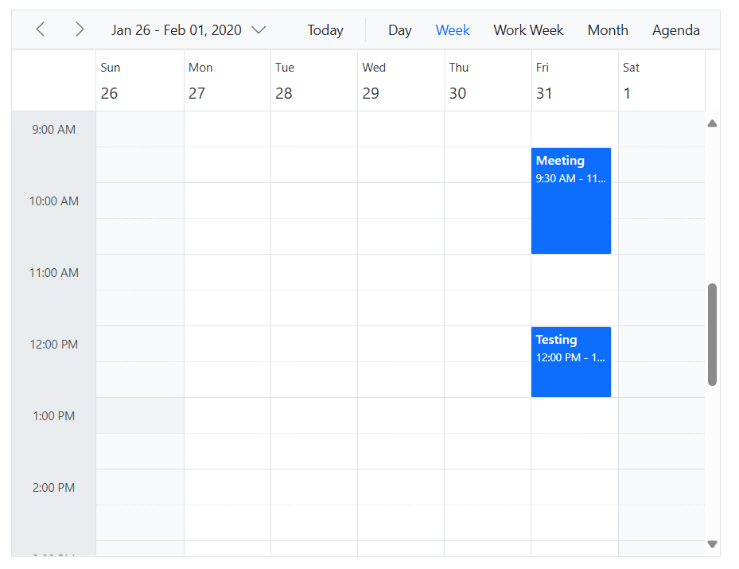
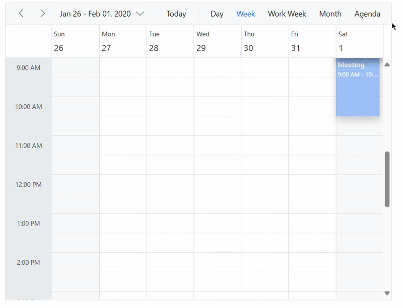

# Drag and Drop in Blazor Scheduler Component

Appointments within the Scheduler can be easily rescheduled by dragging and dropping them to a new time slot or resource. This functionality is enabled by ensuring the [`AllowDragAndDrop`](https://help.syncfusion.com/cr/blazor/Syncfusion.Blazor.Schedule.SfSchedule-1.html#Syncfusion_Blazor_Schedule_SfSchedule_1_AllowDragAndDrop) property on the `SfSchedule` component is set to `true`. On mobile devices, events can be dragged and dropped by tap-holding an appointment and then dragging it to the desired location.

N> By default, drag-and-drop actions are applicable in all Scheduler views except the Agenda and Month-Agenda views.

To get started quickly with the drag options available in the Scheduler, refer to this video:



## Drag and Drop Multiple Appointments

Multiple appointments can be dragged and dropped simultaneously by enabling the [`AllowMultiDrag`](https://help.syncfusion.com/cr/blazor/Syncfusion.Blazor.Schedule.SfSchedule-1.html#Syncfusion_Blazor_Schedule_SfSchedule_1_AllowMultiDrag) property. To select multiple appointments, hold down the <kbd>CTRL</kbd> key while clicking on desired events. Once the events are selected, release the <kbd>CTRL</kbd> key and then drag any of the selected events to move the entire group.

Multiple events can also be dragged from one resource to another. In scenarios where selected events originate from different resources, all selected events will be moved to the single resource associated with the target drop location.

N> Multiple event drag and drop is not supported on mobile devices.

```cshtml
@using Syncfusion.Blazor.Schedule

<SfSchedule TValue="AppointmentData" Height="550px" AllowMultiDrag="true" @bind-SelectedDate="@CurrentDate">
    <ScheduleEventSettings DataSource="@DataSource"></ScheduleEventSettings>
    <ScheduleViews>
        <ScheduleView Option="View.Day"></ScheduleView>
        <ScheduleView Option="View.Week"></ScheduleView>
        <ScheduleView Option="View.WorkWeek"></ScheduleView>
        <ScheduleView Option="View.Month"></ScheduleView>
        <ScheduleView Option="View.Agenda"></ScheduleView>
    </ScheduleViews>
</SfSchedule>

@code{
    DateTime CurrentDate = new DateTime(2020, 1, 31);
    List<AppointmentData> DataSource = new List<AppointmentData>
    {
        new AppointmentData{ Id = 1, Subject = "Meeting", StartTime = new DateTime(2020, 1, 31, 9, 30, 0) , EndTime = new DateTime(2020, 1, 31, 11, 0, 0)},
        new AppointmentData{ Id = 2, Subject = "Testing", StartTime = new DateTime(2020, 1, 31, 12, 0, 0) , EndTime = new DateTime(2020, 1, 31, 13, 0, 0)}
    };
    public class AppointmentData
    {
        public int Id { get; set; }
        public string Subject { get; set; }
        public string Location { get; set; }
        public DateTime StartTime { get; set; }
        public DateTime EndTime { get; set; }
        public string Description { get; set; }
        public bool IsAllDay { get; set; }
        public string RecurrenceRule { get; set; }
        public string RecurrenceException { get; set; }
        public Nullable<int> RecurrenceID { get; set; }
    }
}
```





## Disable the Drag Action

By default, appointments can be dragged and dropped within any applicable Scheduler view. To disable this functionality, set the [`AllowDragAndDrop`](https://help.syncfusion.com/cr/blazor/Syncfusion.Blazor.Schedule.SfSchedule-1.html#Syncfusion_Blazor_Schedule_SfSchedule_1_AllowDragAndDrop) property to `false` on the `SfSchedule` component.

```cshtml
@using Syncfusion.Blazor.Schedule

<SfSchedule TValue="AppointmentData" Height="550px" AllowDragAndDrop="false" @bind-SelectedDate="@CurrentDate">
    <ScheduleEventSettings DataSource="@DataSource"></ScheduleEventSettings>
    <ScheduleViews>
        <ScheduleView Option="View.Day"></ScheduleView>
        <ScheduleView Option="View.Week"></ScheduleView>
        <ScheduleView Option="View.WorkWeek"></ScheduleView>
        <ScheduleView Option="View.Month"></ScheduleView>
        <ScheduleView Option="View.Agenda"></ScheduleView>
    </ScheduleViews>
</SfSchedule>

@code{
    DateTime CurrentDate = new DateTime(2020, 1, 31);
    List<AppointmentData> DataSource = new List<AppointmentData>
    {
        new AppointmentData{ Id = 1, Subject = "Meeting", StartTime = new DateTime(2020, 1, 31, 9, 30, 0) , EndTime = new DateTime(2020, 1, 31, 11, 0, 0)}
    };
    public class AppointmentData
    {
        public int Id { get; set; }
        public string Subject { get; set; }
        public string Location { get; set; }
        public DateTime StartTime { get; set; }
        public DateTime EndTime { get; set; }
        public string Description { get; set; }
        public bool IsAllDay { get; set; }
        public string RecurrenceRule { get; set; }
        public string RecurrenceException { get; set; }
        public Nullable<int> RecurrenceID { get; set; }
    }
}
```


## Preventing Drag and Drop on Specific Targets

The drag action can be prevented on particular target HTML elements by configuring the `ExcludeSelectors` option within the [`OnDragStart`](https://help.syncfusion.com/cr/blazor/Syncfusion.Blazor.Schedule.ScheduleEvents-1.html#Syncfusion_Blazor_Schedule_ScheduleEvents_1_OnDragStart) event arguments. This allows appointments to be dropped only on permissible areas.

```cshtml
@using Syncfusion.Blazor.Schedule

<SfSchedule TValue="AppointmentData" Height="550px" @bind-SelectedDate="@CurrentDate">
    <ScheduleEvents TValue="AppointmentData" OnDragStart="OnAppointmentDrag"></ScheduleEvents>
    <ScheduleEventSettings DataSource="@DataSource"></ScheduleEventSettings>
    <ScheduleViews>
        <ScheduleView Option="View.Day"></ScheduleView>
        <ScheduleView Option="View.Week"></ScheduleView>
        <ScheduleView Option="View.WorkWeek"></ScheduleView>
        <ScheduleView Option="View.Month"></ScheduleView>
        <ScheduleView Option="View.Agenda"></ScheduleView>
    </ScheduleViews>
</SfSchedule>

@code{
    DateTime CurrentDate = new DateTime(2020, 1, 31);
    public void OnAppointmentDrag(DragEventArgs<AppointmentData> args)
    {
        args.ExcludeSelectors = "e-header-cells,e-all-day-cells";
    }
    List<AppointmentData> DataSource = new List<AppointmentData>
    {
        new AppointmentData{ Id = 1, Subject = "Meeting", StartTime = new DateTime(2020, 1, 31, 9, 30, 0) , EndTime = new DateTime(2020, 1, 31, 11, 0, 0)}
    };
    public class AppointmentData
    {
        public int Id { get; set; }
        public string Subject { get; set; }
        public string Location { get; set; }
        public DateTime StartTime { get; set; }
        public DateTime EndTime { get; set; }
        public string Description { get; set; }
        public bool IsAllDay { get; set; }
        public string RecurrenceRule { get; set; }
        public string RecurrenceException { get; set; }
        public Nullable<int> RecurrenceID { get; set; }
    }
}
```


## Disable Scrolling on Drag Action

By default, when dragging an appointment near the edges of the Scheduler (top/bottom in vertical views, left/right in timeline views), automatic scrolling occurs. To prevent this behavior, set `args.Scroll.Enable` to `false` within the [`OnDragStart`](https://help.syncfusion.com/cr/blazor/Syncfusion.Blazor.Schedule.ScheduleEvents-1.html#Syncfusion_Blazor_Schedule_ScheduleEvents_1_OnDragStart) event arguments.

```cshtml
@using Syncfusion.Blazor.Schedule

<SfSchedule TValue="AppointmentData" Height="550px" SelectedDate="@CurrentDate">
    <ScheduleEvents TValue="AppointmentData" OnDragStart="OnAppointmentDrag"></ScheduleEvents>
    <ScheduleEventSettings DataSource="@DataSource"></ScheduleEventSettings>
    <ScheduleViews>
        <ScheduleView Option="View.Day"></ScheduleView>
        <ScheduleView Option="View.Week"></ScheduleView>
        <ScheduleView Option="View.WorkWeek"></ScheduleView>
        <ScheduleView Option="View.Month"></ScheduleView>
        <ScheduleView Option="View.Agenda"></ScheduleView>
    </ScheduleViews>
</SfSchedule>

@code{
    DateTime CurrentDate = new DateTime(2020, 1, 31);
    public void OnAppointmentDrag(DragEventArgs<AppointmentData> args)
    {
        args.Scroll.Enable = false;
    }
    List<AppointmentData> DataSource = new List<AppointmentData>
    {
        new AppointmentData{ Id = 1, Subject = "Meeting", StartTime = new DateTime(2020, 1, 31, 9, 30, 0) , EndTime = new DateTime(2020, 1, 31, 11, 0, 0)}
    };
    public class AppointmentData
    {
        public int Id { get; set; }
        public string Subject { get; set; }
        public string Location { get; set; }
        public DateTime StartTime { get; set; }
        public DateTime EndTime { get; set; }
        public string Description { get; set; }
        public bool IsAllDay { get; set; }
        public string RecurrenceRule { get; set; }
        public string RecurrenceException { get; set; }
        public Nullable<int> RecurrenceID { get; set; }
    }
}
```





## Controlling Scroll Speed While Dragging An Event

The speed of the automatic scrolling action that occurs when dragging an appointment to the Scheduler edges can be controlled. This is done within the [`OnDragStart`](https://help.syncfusion.com/cr/blazor/Syncfusion.Blazor.Schedule.ScheduleEvents-1.html#Syncfusion_Blazor_Schedule_ScheduleEvents_1_OnDragStart) event by setting the desired values for `args.Scroll.ScrollBy` and `args.Scroll.TimeDelay`. The default values are 30 minutes for `ScrollBy` and 100ms for `TimeDelay`.

```cshtml
@using Syncfusion.Blazor.Schedule

<SfSchedule TValue="AppointmentData" Height="550px" @bind-SelectedDate="@CurrentDate">
    <ScheduleEvents TValue="AppointmentData" OnDragStart="OnAppointmentDrag"></ScheduleEvents>
    <ScheduleEventSettings DataSource="@DataSource"></ScheduleEventSettings>
    <ScheduleViews>
        <ScheduleView Option="View.Day"></ScheduleView>
        <ScheduleView Option="View.Week"></ScheduleView>
        <ScheduleView Option="View.WorkWeek"></ScheduleView>
        <ScheduleView Option="View.Month"></ScheduleView>
        <ScheduleView Option="View.Agenda"></ScheduleView>
    </ScheduleViews>
</SfSchedule>

@code{
    DateTime CurrentDate = new DateTime(2020, 1, 31);
    public void OnAppointmentDrag(DragEventArgs<AppointmentData> args)
    {
        args.Scroll.ScrollBy = 5;
        args.Scroll.TimeDelay = 200;
    }
    List<AppointmentData> DataSource = new List<AppointmentData>
    {
        new AppointmentData{ Id = 1, Subject = "Meeting", StartTime = new DateTime(2020, 1, 31, 9, 30, 0) , EndTime = new DateTime(2020, 1, 31, 11, 0, 0)}
    };
    public class AppointmentData
    {
        public int Id { get; set; }
        public string Subject { get; set; }
        public string Location { get; set; }
        public DateTime StartTime { get; set; }
        public DateTime EndTime { get; set; }
        public string Description { get; set; }
        public bool IsAllDay { get; set; }
        public string RecurrenceRule { get; set; }
        public string RecurrenceException { get; set; }
        public Nullable<int> RecurrenceID { get; set; }
    }
}
```


## Auto Navigation of Date Ranges on Dragging an Event

When an event is dragged to the left or right extreme edges of the Scheduler and held there for a few seconds without being dropped, the Scheduler can automatically navigate to the previous or next date range. This `Navigation` action is `false` by default and can be enabled by setting `args.Navigation.Enable` to `true` within the [`OnDragStart`](https://help.syncfusion.com/cr/blazor/Syncfusion.Blazor.Schedule.ScheduleEvents-1.html#Syncfusion_Blazor_Schedule_ScheduleEvents_1_OnDragStart) event.

The delay before navigation occurs is controlled by `args.Navigation.TimeDelay`, which defaults to 2000ms. This value determines how long an appointment needs to be held at the extremity before the date range shifts. A custom delay value for navigation can be configured using `TimeDelay` within the `OnDragStart` event.

```cshtml
@using Syncfusion.Blazor.Schedule

<SfSchedule TValue="AppointmentData" Height="550px" @bind-SelectedDate="@CurrentDate">
    <ScheduleEvents TValue="AppointmentData" OnDragStart="OnAppointmentDrag"></ScheduleEvents>
    <ScheduleEventSettings DataSource="@DataSource"></ScheduleEventSettings>
    <ScheduleViews>
        <ScheduleView Option="View.Day"></ScheduleView>
        <ScheduleView Option="View.Week"></ScheduleView>
        <ScheduleView Option="View.WorkWeek"></ScheduleView>
        <ScheduleView Option="View.Month"></ScheduleView>
        <ScheduleView Option="View.Agenda"></ScheduleView>
    </ScheduleViews>
</SfSchedule>

@code{
    DateTime CurrentDate = new DateTime(2020, 1, 31);
    public void OnAppointmentDrag(DragEventArgs<AppointmentData> args)
    {
        args.Navigation.Enable = true;
        args.Navigation.TimeDelay = 4000;
    }
    List<AppointmentData> DataSource = new List<AppointmentData>
    {
        new AppointmentData{ Id = 1, Subject = "Meeting", StartTime = new DateTime(2020, 1, 31, 9, 30, 0) , EndTime = new DateTime(2020, 1, 31, 11, 0, 0)}
    };
    public class AppointmentData
    {
        public int Id { get; set; }
        public string Subject { get; set; }
        public string Location { get; set; }
        public DateTime StartTime { get; set; }
        public DateTime EndTime { get; set; }
        public string Description { get; set; }
        public bool IsAllDay { get; set; }
        public string RecurrenceRule { get; set; }
        public string RecurrenceException { get; set; }
        public Nullable<int> RecurrenceID { get; set; }
    }
}
```


## Setting Drag Time Interval

By default, when dragging an appointment, it snaps to an interval of 30 minutes. To change this dragging time interval, pass the appropriate value (in minutes) to the `args.Interval` option within the [`OnDragStart`](https://help.syncfusion.com/cr/blazor/Syncfusion.Blazor.Schedule.ScheduleEvents-1.html#Syncfusion_Blazor_Schedule_ScheduleEvents_1_OnDragStart) event.

```cshtml
@using Syncfusion.Blazor.Schedule

<SfSchedule TValue="AppointmentData" Height="550px" @bind-SelectedDate="@CurrentDate">
    <ScheduleEvents TValue="AppointmentData" OnDragStart="OnAppointmentDrag"></ScheduleEvents>
    <ScheduleEventSettings DataSource="@DataSource"></ScheduleEventSettings>
    <ScheduleViews>
        <ScheduleView Option="View.Day"></ScheduleView>
        <ScheduleView Option="View.Week"></ScheduleView>
        <ScheduleView Option="View.WorkWeek"></ScheduleView>
        <ScheduleView Option="View.Month"></ScheduleView>
        <ScheduleView Option="View.Agenda"></ScheduleView>
    </ScheduleViews>
</SfSchedule>

@code{
    DateTime CurrentDate = new DateTime(2020, 1, 31);
    public void OnAppointmentDrag(DragEventArgs<AppointmentData> args)
    {
        args.Interval = 10;
    }
    List<AppointmentData> DataSource = new List<AppointmentData>
    {
        new AppointmentData{ Id = 1, Subject = "Meeting", StartTime = new DateTime(2020, 1, 31, 9, 30, 0) , EndTime = new DateTime(2020, 1, 31, 11, 0, 0)}
    };
    public class AppointmentData
    {
        public int Id { get; set; }
        public string Subject { get; set; }
        public string Location { get; set; }
        public DateTime StartTime { get; set; }
        public DateTime EndTime { get; set; }
        public string Description { get; set; }
        public bool IsAllDay { get; set; }
        public string RecurrenceRule { get; set; }
        public string RecurrenceException { get; set; }
        public Nullable<int> RecurrenceID { get; set; }
    }
}
```



## Drag and Drop Items from External Source

It is possible to drag unplanned items from any external source into the Scheduler. These dropped items are then saved as new appointment data using the [`AddEventAsync`](https://help.syncfusion.com/cr/blazor/Syncfusion.Blazor.Schedule.SfSchedule-1.html#Syncfusion_Blazor_Schedule_SfSchedule_1_AddEventAsync__0_) method of the Scheduler.

To get started quickly with dropping items from an external source to the Scheduler, refer to this video:



In this example, the tree view control is used as an external source and the child nodes from the tree view component are dragged and dropped onto the Scheduler. Therefore, it is necessary to make use of the `OnNodeDragStop` event of the TreeView component, where an event object can be formed and save it using the [AddEventAsync](https://help.syncfusion.com/cr/blazor/Syncfusion.Blazor.Schedule.SfSchedule-1.html#Syncfusion_Blazor_Schedule_SfSchedule_1_AddEventAsync__0_) method.

```cshtml
@using Syncfusion.Blazor.Schedule
@using Syncfusion.Blazor.Navigations

<div class="row">
    <div class="col-lg-8 e-droppable">
        <SfSchedule @ref="ScheduleRef" TValue="AppointmentData" Height="650px" @bind-SelectedDate="@CurrentDate">
            <ScheduleGroup Resources="@GroupData"></ScheduleGroup>
            <ScheduleResources>
                <ScheduleResource TItem="ResourceData" TValue="int" DataSource="@Consultants" Field="ConsultantID" Title="Consultant" Name="Consultants" TextField="Text" IdField="Id" ColorField="Color"></ScheduleResource>
            </ScheduleResources>
            <ScheduleEventSettings DataSource="@DataSource">
            </ScheduleEventSettings>
            <ScheduleViews>
                <ScheduleView Option="View.Day"></ScheduleView>
                <ScheduleView Option="View.Week"></ScheduleView>
                <ScheduleView Option="View.WorkWeek"></ScheduleView>
                <ScheduleView Option="View.Month"></ScheduleView>
                <ScheduleView Option="View.Agenda"></ScheduleView>
            </ScheduleViews>
        </SfSchedule>
    </div>
    <div class="col-lg-4">
        <h3>Waiting list</h3>
        <SfTreeView TValue="EmployeeData" AllowDragAndDrop="true">
            <TreeViewFieldsSettings DataSource="@WaitingListData" Id="Id" Text="Name"></TreeViewFieldsSettings>
            <TreeViewEvents TValue="EmployeeData" OnNodeDragStop="DragStop"></TreeViewEvents>
        </SfTreeView>
    </div>
</div>

@code{
    DateTime CurrentDate = new DateTime(2020, 1, 31);
    SfSchedule<AppointmentData> ScheduleRef;
    public string[] GroupData = new string[] { "Consultants" };
    public List<ResourceData> Consultants { get; set; } = new List<ResourceData> {
    new ResourceData { Text = "Margaret", Id = 1, Color = "#1aaa55" },
    new ResourceData { Text = "Robert", Id = 2, Color = "#357cd2" },
    new ResourceData { Text = "Laura", Id = 3, Color = "#7fa900" },
    new ResourceData { Text = "Robson", Id = 4, Color = "#9e5fff" },
    new ResourceData { Text = "Laura", Id = 5, Color = "#bbdc00" }
    };
    public List<EmployeeData> WaitingListData { get; set; } = new List<EmployeeData>() {
    new EmployeeData { Id = 1, Name = "Johnson" },
    new EmployeeData { Id = 2, Name = "Sourav" },
    new EmployeeData { Id = 3,  Name = "Sanjay" }
    };
    List<AppointmentData> DataSource = new List<AppointmentData>
{
    new AppointmentData{ Id = 1, Subject = "General-Check up", StartTime = new DateTime(2020, 1, 31, 9, 30, 0) , EndTime = new DateTime(2020, 1, 31, 11, 0, 0), ConsultantID=1 }
    };

    async void DragStop(DragAndDropEventArgs args)
    {
        args.Cancel = true;
        CellClickEventArgs cellData = await ScheduleRef.GetTargetCellAsync((int)args.Left, (int)args.Top);
        if (cellData != null)
        {
            var resourceDetails = ScheduleRef.GetResourceByIndex(cellData.GroupIndex);
            Random rnd = new Random();
            AppointmentData eventData = new AppointmentData
            {
                Id = rnd.Next(1000),
                Subject = args.DraggedNodeData.Text,
                StartTime = cellData.StartTime,
                EndTime = cellData.EndTime,
                IsAllDay = cellData.IsAllDay,
                ConsultantID = resourceDetails.GroupData.ConsultantID,
            };
            await ScheduleRef.OpenEditorAsync(eventData, CurrentAction.Add);
        }
    }

    public class AppointmentData
    {
        public int Id { get; set; }
        public string Subject { get; set; }
        public DateTime StartTime { get; set; }
        public DateTime EndTime { get; set; }
        public string RecurrenceRule { get; set; }
        public Nullable<int> RecurrenceID { get; set; }
        public string RecurrenceException { get; set; }
        public bool? IsAllDay { get; set; }
        public Nullable<int> ConsultantID { get; set; }
    }
    public class EmployeeData
    {
        public int Id { get; set; }
        public string Name { get; set; }
    }
    public class ResourceData
    {
        public int Id { get; set; }
        public string Text { get; set; }
        public string Color { get; set; }
    }
}
```


## Drag and Drop Items to External Source

Events can also be dragged from the Scheduler to an external target. This is configured by setting the target's CSS selector to the [`EventDragArea`](https://help.syncfusion.com/cr/blazor/Syncfusion.Blazor.Schedule.SfSchedule-1.html#Syncfusion_Blazor_Schedule_SfSchedule_1_EventDragArea) property of the source Scheduler.
In the following example, two Scheduler instances are used. Events from the first Scheduler can be dragged and dropped into the second Scheduler. The [Dragged](https://help.syncfusion.com/cr/blazor/Syncfusion.Blazor.Schedule.ScheduleEvents-1.html#Syncfusion_Blazor_Schedule_ScheduleEvents_1_Dragged) event of the source Scheduler is used to handle the transfer: the dragged event is deleted from the first Scheduler and then added to the second.

```cshtml
@using Syncfusion.Blazor.Schedule

<div class="row">
    <div class="col-lg-6">
        <SfSchedule @ref="Schedule1Ref" Height="550px" TValue="AppointmentData" EventDragArea=".ScheduleClass" @bind-SelectedDate="@CurrentDate">
            <ScheduleEvents TValue="AppointmentData" Dragged="OnDragged"></ScheduleEvents>
            <ScheduleEventSettings DataSource="@ScheduleData"></ScheduleEventSettings>
            <ScheduleViews>
                <ScheduleView Option="View.Day"></ScheduleView>
                <ScheduleView Option="View.Week"></ScheduleView>
                <ScheduleView Option="View.WorkWeek"></ScheduleView>
                <ScheduleView Option="View.Month"></ScheduleView>
                <ScheduleView Option="View.Agenda"></ScheduleView>
            </ScheduleViews>
        </SfSchedule>
    </div>
    <div class="col-lg-6">
        <SfSchedule @ref="Schedule2Ref" Height="550px" TValue="AppointmentData" CssClass="ScheduleClass" SelectedDate="@(new DateTime(2020, 1, 6))">
            <ScheduleViews>
                <ScheduleView Option="View.Day"></ScheduleView>
                <ScheduleView Option="View.Week"></ScheduleView>
                <ScheduleView Option="View.WorkWeek"></ScheduleView>
                <ScheduleView Option="View.Month"></ScheduleView>
                <ScheduleView Option="View.Agenda"></ScheduleView>
            </ScheduleViews>
        </SfSchedule>
    </div>
</div>


@code {
    DateTime CurrentDate = new DateTime(2020, 1, 6);
    SfSchedule<AppointmentData> Schedule1Ref;
    SfSchedule<AppointmentData> Schedule2Ref;
    List<AppointmentData> ScheduleData = new List<AppointmentData>
    {
        new AppointmentData { Id = 1, Subject = "Meeting", StartTime = new DateTime(2020, 1, 6, 9, 30, 0) , EndTime = new DateTime(2020, 1, 6, 11, 0, 0)}
    };
    public async Task OnDragged(DragEventArgs<AppointmentData> args)
    {
        await Schedule1Ref.DeleteEventAsync(args.Data.Id);
        Random random = new Random();
        args.Data.Id = Convert.ToInt32(random.Next());
        await Schedule2Ref.AddEventAsync(args.Data);
    }
    public class AppointmentData
    {
        public int Id { get; set; }
        public string Subject { get; set; }
        public string Location { get; set; }
        public string Description { get; set; }
        public DateTime StartTime { get; set; }
        public DateTime EndTime { get; set; }
        public Nullable<bool> IsAllDay { get; set; }
        public bool IsReadonly { get; set; }
        public string RecurrenceRule { get; set; }
        public Nullable<int> RecurrenceID { get; set; }
        public string RecurrenceException { get; set; }
        public string StartTimezone { get; set; }
        public string EndTimezone { get; set; }
    }
}
```


## Opening the Editor Window on Drag Stop

In some scenarios, after an appointment is dragged and dropped to a new location, an editor window might need to appear, pre-filled with the appointment's updated details. This allows the user to review or modify the changes before finally saving them. If the "Cancel" button is clicked in the editor, the changes should be reverted. This behavior can be implemented using the [`Dragged`](https://help.syncfusion.com/cr/blazor/Syncfusion.Blazor.Schedule.ScheduleEvents-1.html#Syncfusion_Blazor_Schedule_ScheduleEvents_1_Dragged) event of the Scheduler.

```cshtml
@using Syncfusion.Blazor.Schedule

<SfSchedule TValue="AppointmentData" @ref="ScheduleRef" Height="550px" @bind-SelectedDate="@CurrentDate">
    <ScheduleEvents TValue="AppointmentData" Dragged="OnAppointmentDragStop"></ScheduleEvents>
    <ScheduleEventSettings DataSource="@DataSource"></ScheduleEventSettings>
    <ScheduleViews>
        <ScheduleView Option="View.Day"></ScheduleView>
        <ScheduleView Option="View.Week"></ScheduleView>
        <ScheduleView Option="View.WorkWeek"></ScheduleView>
        <ScheduleView Option="View.Month"></ScheduleView>
        <ScheduleView Option="View.Agenda"></ScheduleView>
    </ScheduleViews>
</SfSchedule>

@code{
    DateTime CurrentDate = new DateTime(2020, 1, 31);
    SfSchedule<AppointmentData> ScheduleRef;
    public async Task OnAppointmentDragStop(DragEventArgs<AppointmentData> args)
    {
        args.Cancel = true;
        await this.ScheduleRef.OpenEditorAsync(args.Data, CurrentAction.Save);
    }
    List<AppointmentData> DataSource = new List<AppointmentData>
    {
        new AppointmentData{ Id = 1, Subject = "Meeting", StartTime = new DateTime(2020, 1, 31, 9, 30, 0) , EndTime = new DateTime(2020, 1, 31, 11, 0, 0)}
    };
    public class AppointmentData
    {
        public int Id { get; set; }
        public string Subject { get; set; }
        public string Location { get; set; }
        public DateTime StartTime { get; set; }
        public DateTime EndTime { get; set; }
        public string Description { get; set; }
        public bool IsAllDay { get; set; }
        public string RecurrenceRule { get; set; }
        public string RecurrenceException { get; set; }
        public Nullable<int> RecurrenceID { get; set; }
    }
}
```

