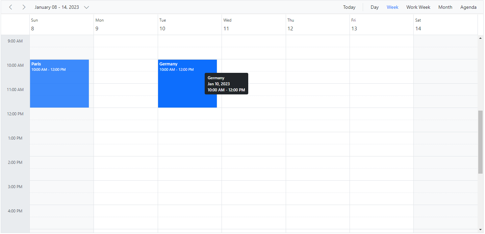

# Appointments in Blazor Scheduler Component

Appointments can be anything that are scheduled for a specific time period. It can be created on varied time range and each appointments are categorized based on this range. 

To get start quickly about appointments and how to customize it, you can check on this video:



## Event fields

The Scheduler dataSource usually holds the event instances, where each of the instance includes a collection of appropriate [fields](https://help.syncfusion.com/cr/blazor/Syncfusion.Blazor.Schedule.ScheduleField.html). It is mandatory to map these fields with the equivalent fields of database, when remote data is bound to it. When the local data is bound, then the field names defined within the instances needs to be mapped with the scheduler event fields correctly.

N> To create an event on Scheduler, it is enough to define the `StartTime` and `EndTime` fields. In case, if remote data is bound to Scheduler, then `Id` field becomes mandatory to process the CRUD actions on appropriate events.

### Built-in fields

The built-in fields available on Scheduler event object are as follows.

| Field name | Description |
|-------|---------|
| Id | The [`Id`](https://help.syncfusion.com/cr/blazor/Syncfusion.Blazor.Schedule.ScheduleField.html#Syncfusion_Blazor_Schedule_ScheduleField_Id) field needs to be defined as mandatory, and usually assigns a unique ID value to each of the events.|
| Subject | The [`Subject`](https://help.syncfusion.com/cr/blazor/Syncfusion.Blazor.Schedule.FieldSubject.html) field is optional, and usually assigns the summary text to each of the events.|
| StartTime | The [`StartTime`](https://help.syncfusion.com/cr/blazor/Syncfusion.Blazor.Schedule.FieldStartTime.html) field defines the start time of an event and it is mandatory to provide it for any of the valid event objects.|
| EndTime | The [`EndTime`](https://help.syncfusion.com/cr/blazor/Syncfusion.Blazor.Schedule.FieldEndTime.html) field defines the end time of an event and it is mandatory to provide the end time for any of the valid event objects.|
| StartTimezone | It maps the [`StartTimezone`](https://help.syncfusion.com/cr/blazor/Syncfusion.Blazor.Schedule.FieldStartTimezone.html) field from the dataSource and usually accepts the valid IANA timezone names. It is assumed that the value provided for this field is taken into consideration while processing the `StartTime` field. When this field is not mapped with any timezone names, then the events will be processed based on the timezone assigned to the Scheduler.|
| EndTimezone | It maps the [`EndTimezone`](https://help.syncfusion.com/cr/blazor/Syncfusion.Blazor.Schedule.FieldEndTimezone.html) field from the dataSource and usually accepts the valid IANA timezone names. It is assumed that the value provided for this field is taken into consideration while processing the `EndTime` field. When this field is not mapped with any timezone names, then the events will be processed based on the timezone assigned to the Scheduler.|
| Location | It maps the [`Location`](https://help.syncfusion.com/cr/blazor/Syncfusion.Blazor.Schedule.FieldLocation.html) field from the dataSource and the location text value will be displayed over the events.|
| Description | It maps the [`Description`](https://help.syncfusion.com/cr/blazor/Syncfusion.Blazor.Schedule.FieldDescription.html) field from the dataSource and denotes the event description which is optional.|
| IsAllDay | The [`IsAllDay`](https://help.syncfusion.com/cr/blazor/Syncfusion.Blazor.Schedule.FieldIsAllDay.html) field is mapped from the dataSource and is used to denote whether an event is created for an entire day or for specific time alone. Usually, an event with `IsAllDay` field set to true will be considered as an all-day event. |
| RecurrenceID | It maps the [`RecurrenceID`](https://help.syncfusion.com/cr/blazor/Syncfusion.Blazor.Schedule.FieldRecurrenceId.html) field from dataSource and usually holds the ID value of the parent recurrence event. This field is applicable only for the edited occurrence events.|
| RecurrenceRule | It maps the [`RecurrenceRule`](https://help.syncfusion.com/cr/blazor/Syncfusion.Blazor.Schedule.FieldRecurrenceRule.html) field from dataSource and holds the recurrence rule value in a string format. Also, it uniquely identifies whether the event belongs to a recurring type or normal ones. |
| RecurrenceException | It maps the [`RecurrenceException`](https://help.syncfusion.com/cr/blazor/Syncfusion.Blazor.Schedule.FieldRecurrenceException.html) field from dataSource and is used to hold the collection of exception dates in UTC format, on which the recurring occurrences needs to be excluded. |
| IsReadonly | It maps the [`IsReadonly`](https://help.syncfusion.com/cr/blazor/Syncfusion.Blazor.Schedule.ScheduleField.html#Syncfusion_Blazor_Schedule_ScheduleField_IsReadonly) field from dataSource. It is mainly used to make specific appointments as readonly when set to `true`. |
| IsBlock | It maps the [`IsBlock`](https://help.syncfusion.com/cr/blazor/Syncfusion.Blazor.Schedule.ScheduleField.html#Syncfusion_Blazor_Schedule_ScheduleField_IsBlock) field from dataSource. It is used to block the particular time ranges in the Scheduler and prevents the event creation on those time slots. |
| CssClass | It maps the [`CssClass`](https://help.syncfusion.com/cr/blazor/Syncfusion.Blazor.Schedule.ScheduleField.html#Syncfusion_Blazor_Schedule_ScheduleField_CssClass) field from the dataSource. It is used to customize the particular events. |

### Binding different field names

When the fields of event instances has the default mapping name, it is not mandatory to map them manually. If a Scheduler's dataSource holds the events collection with different field names, then it is necessary to map them with its equivalent field name within the [EventSettings](https://help.syncfusion.com/cr/blazor/Syncfusion.Blazor.Schedule.ISchedule.html#Syncfusion_Blazor_Schedule_ISchedule_EventSettings) property.

```cshtml
@using Syncfusion.Blazor.Schedule

<SfSchedule TValue="AppointmentData" Height="550px" @bind-SelectedDate="@CurrentDate">
    <ScheduleEventSettings DataSource="@DataSource">
        <ScheduleField Id="TravelId" IsBlock="IsDisabled">
            <FieldSubject Name="TravelSummary"></FieldSubject>
            <FieldLocation Name="Source"></FieldLocation>
            <FieldDescription Name="Comments"></FieldDescription>
            <FieldIsAllDay Name="FullDay"></FieldIsAllDay>
            <FieldStartTime Name="DepartureTime"></FieldStartTime>
            <FieldEndTime Name="ArrivalTime"></FieldEndTime>
            <FieldStartTimezone Name="Origin"></FieldStartTimezone>
            <FieldEndTimezone Name="Destination"></FieldEndTimezone>
        </ScheduleField>
    </ScheduleEventSettings>
    <ScheduleViews>
        <ScheduleView Option="View.Day"></ScheduleView>
        <ScheduleView Option="View.Week"></ScheduleView>
        <ScheduleView Option="View.WorkWeek"></ScheduleView>
        <ScheduleView Option="View.Month"></ScheduleView>
        <ScheduleView Option="View.Agenda"></ScheduleView>
    </ScheduleViews>
</SfSchedule>

@code{
    DateTime CurrentDate = new DateTime(2020, 1, 10);
    List<AppointmentData> DataSource = new List<AppointmentData>
    {
        new AppointmentData { TravelId = 1, TravelSummary = "Paris", DepartureTime = new DateTime(2020, 1, 10, 10, 0, 0) , ArrivalTime = new DateTime(2020, 1, 10, 12, 30, 0),
        Source = "London", Comments = "Summer vacation planned for outstation.", Origin= "Asia/Yekaterinburg", Destination= "Asia/Yekaterinburg" },
        new AppointmentData { TravelId = 2, TravelSummary = "Tokyo", DepartureTime = new DateTime(2020, 1, 11, 10, 0, 0), ArrivalTime = new DateTime(2020, 1, 11, 12, 30, 0),
        Source = "Beijing", Comments = "Conference on emerging technologies.", Origin = "Asia/Yekaterinburg", Destination = "Asia/Yekaterinburg", IsDisabled = true }
    };
    public class AppointmentData
    {
        public int TravelId { get; set; }
        public string TravelSummary { get; set; }
        public DateTime DepartureTime { get; set; }
        public DateTime ArrivalTime { get; set; }
        public bool FullDay { get; set; }
        public string Source { get; set; }
        public string Comments { get; set; }
        public string Origin { get; set; }
        public string Destination { get; set; }
        public bool IsDisabled { get; set; }
    }
}
```

N> The mapper field [`Id`](https://help.syncfusion.com/cr/blazor/Syncfusion.Blazor.Schedule.ScheduleField.html#Syncfusion_Blazor_Schedule_ScheduleField_Id) is of string type and has no additional validation options, whereas all other fields has additional options.

### Event field settings

Each field of the Scheduler events are provided with additional settings such as options to set default value, to map with appropriate data source fields, to validate every event fields and to provide label values for those fields in the event window.

| Options | Description |
| ------- | ----------- |
| Default | Accepts the default value to the applicable fields (Subject, Location and Description), when no values are provided to them from dataSource. |
| Name | Accepts the field name to be mapped from the dataSource fields. |
| Title | Accepts the label values to be displayed for the fields of event editor. |
| Validation | Defines the validation rules to be applied on the event fields within the event editor. |

In following example, the Subject field in event editor will display its appropriate label as **Summary**. When no subject value is provided while saving an event, then the appointment will be saved with the default subject value as **Add Summary**.

```cshtml
@using Syncfusion.Blazor.Schedule

<SfSchedule TValue="AppointmentData" Height="550px" @bind-SelectedDate="@CurrentDate">
    <ScheduleEventSettings TValue="AppointmentData" DataSource="@DataSource">
        <ScheduleField Id="Id">
            <FieldSubject Name="Subject" Title="Summary" Default="Add Summary"></FieldSubject>
            <FieldLocation Name="Location"></FieldLocation>
            <FieldDescription Name="Description"></FieldDescription>
            <FieldStartTime Name="StartTime"></FieldStartTime>
            <FieldEndTime Name="EndTime"></FieldEndTime>
        </ScheduleField>
    </ScheduleEventSettings>
    <ScheduleViews>
        <ScheduleView Option="View.Day"></ScheduleView>
        <ScheduleView Option="View.Week"></ScheduleView>
        <ScheduleView Option="View.WorkWeek"></ScheduleView>
        <ScheduleView Option="View.Month"></ScheduleView>
        <ScheduleView Option="View.Agenda"></ScheduleView>
    </ScheduleViews>
</SfSchedule>
@code{
    DateTime CurrentDate = new DateTime(2020, 1, 31);
    List<AppointmentData> DataSource = new List<AppointmentData>
    {
        new AppointmentData { Id = 1, Subject = "Meeting", StartTime = new DateTime(2020, 1, 31, 9, 30, 0) , EndTime = new DateTime(2020, 1, 31, 11, 0, 0) }
    };
    public class AppointmentData
    {
        public int Id { get; set; }
        public string Subject { get; set; }
        public string Location { get; set; }
        public DateTime StartTime { get; set; }
        public DateTime EndTime { get; set; }
        public string Description { get; set; }
        public bool IsAllDay { get; set; }
        public string RecurrenceRule { get; set; }
        public string RecurrenceException { get; set; }
        public Nullable<int> RecurrenceID { get; set; }
    }
}
```

### Adding Custom fields

Apart from the default Scheduler fields, the user can include 'n' number of custom fields for appointments. The following code example shows how to include two custom fields namely **Status** and **Priority** within event collection. It is not necessary to bind the custom fields within the [EventSettings](https://help.syncfusion.com/cr/blazor/Syncfusion.Blazor.Schedule.ISchedule.html#Syncfusion_Blazor_Schedule_ISchedule_EventSettings). However, those additional fields can be accessed easily, for internal processing as well as from application end.

```cshtml
@using Syncfusion.Blazor.Schedule

<SfSchedule TValue="AppointmentData" Height="550px" @bind-SelectedDate="@CurrentDate">
    <ScheduleEventSettings DataSource="@DataSource">
    </ScheduleEventSettings>
    <ScheduleViews>
        <ScheduleView Option="View.Day"></ScheduleView>
        <ScheduleView Option="View.Week"></ScheduleView>
        <ScheduleView Option="View.WorkWeek"></ScheduleView>
        <ScheduleView Option="View.Month"></ScheduleView>
        <ScheduleView Option="View.Agenda"></ScheduleView>
    </ScheduleViews>
</SfSchedule>

@code{
    DateTime CurrentDate = new DateTime(2020, 1, 31);
    List<AppointmentData> DataSource = new List<AppointmentData>
    {
        new AppointmentData { Id = 1, Subject = "Meeting", StartTime = new DateTime(2020, 1, 31, 9, 30, 0) , EndTime = new DateTime(2020, 1, 31, 11, 0, 0),
        Status = "Completed", Priority = "High"}
    };
    public class AppointmentData
    {
        public int Id { get; set; }
        public string Subject { get; set; }
        public string Location { get; set; }
        public DateTime StartTime { get; set; }
        public DateTime EndTime { get; set; }
        public string Description { get; set; }
        public bool IsAllDay { get; set; }
        public string RecurrenceRule { get; set; }
        public string RecurrenceException { get; set; }
        public Nullable<int> RecurrenceID { get; set; }
        public string Status { get; set; }
        public string Priority { get; set; }
    }
}
```

## Normal events

Represents an appointment that is created for any specific time interval within a day.

### Creating a normal event

The following example depicts how to define a normal event on the Scheduler, with event data being loaded from simple list of appointment collection.

```cshtml
@using Syncfusion.Blazor.Schedule

<SfSchedule TValue="AppointmentData" Height="550px" @bind-SelectedDate="@CurrentDate">
    <ScheduleEventSettings DataSource="@DataSource"></ScheduleEventSettings>
    <ScheduleViews>
        <ScheduleView Option="View.Day"></ScheduleView>
        <ScheduleView Option="View.Week"></ScheduleView>
        <ScheduleView Option="View.WorkWeek"></ScheduleView>
        <ScheduleView Option="View.Month"></ScheduleView>
        <ScheduleView Option="View.Agenda"></ScheduleView>
    </ScheduleViews>
</SfSchedule>

@code{
    DateTime CurrentDate = new DateTime(2020, 1, 31);
    List<AppointmentData> DataSource = new List<AppointmentData>
    {
        new AppointmentData { Id = 1, Subject = "Meeting", StartTime = new DateTime(2020, 1, 31, 9, 30, 0) , EndTime = new DateTime(2020, 1, 31, 11, 0, 0) }
    };
    public class AppointmentData
    {
        public int Id { get; set; }
        public string Subject { get; set; }
        public DateTime StartTime { get; set; }
        public DateTime EndTime { get; set; }
    }
}
```

## Spanned events

Represents an appointment that is created for more than 24 hours, and usually displayed on the all-day row. Also, represents another type of appointment that is created for more than one day but less than 24 hours, and usually displayed appropriately on both the days.

N> For example, in week view if an appointment is created for two days say from November 25, 2020 – 11.00 PM to November 26, 2020 - 2.00 AM but less than 24 hours time interval, then the appointment split into two partitions and will be displayed on both the days.

## All-day events

It represents an appointment that is created for an entire day such as holiday events. It is usually displayed separately in an all-day row, a separate row for all-day appointments below the date header section. In Timeline views, the all-day appointments displays in the working space area, and no separate all-day row is present in that view.

N> To change normal appointment into all-day event, set [`IsAllDay`](https://help.syncfusion.com/cr/blazor/Syncfusion.Blazor.Schedule.FieldIsAllDay.html) field to true.

### Hide all-day row events

The CSS customization can be used to prevent the display of all-day row appointments on the Scheduler UI.

```css
.e-schedule .e-date-header-wrap .e-schedule-table thead {
    display: none;
}
```

## Block Date and Time

It is possible to block a set of dates or a particular time ranges on the Scheduler. To do so, define an appointment object within [EventSettings](https://help.syncfusion.com/cr/blazor/Syncfusion.Blazor.Schedule.ISchedule.html#Syncfusion_Blazor_Schedule_ISchedule_EventSettings) along with the required time range to block and set the [IsBlock](https://help.syncfusion.com/cr/blazor/Syncfusion.Blazor.Schedule.ScheduleField.html#Syncfusion_Blazor_Schedule_ScheduleField_IsBlock) field to **true**. Usually, the event objects defined with `IsBlock` field set to true will block the entire time cells lying within the appropriate time ranges specified through `StartTime` and `EndTime` fields.

```cshtml
@using Syncfusion.Blazor.Schedule

<SfSchedule TValue="AppointmentData" Height="550px" @bind-SelectedDate="@CurrentDate">
    <ScheduleEventSettings DataSource="@DataSource"></ScheduleEventSettings>
    <ScheduleViews>
        <ScheduleView Option="View.Day"></ScheduleView>
        <ScheduleView Option="View.Week"></ScheduleView>
        <ScheduleView Option="View.WorkWeek"></ScheduleView>
        <ScheduleView Option="View.Month"></ScheduleView>
        <ScheduleView Option="View.Agenda"></ScheduleView>
    </ScheduleViews>
</SfSchedule>

@code{
    DateTime CurrentDate = new DateTime(2023, 1, 31);
    List<AppointmentData> DataSource = new List<AppointmentData>
    {
        new AppointmentData { Id = 1, Subject = "Meeting", StartTime = new DateTime(2023, 1, 31, 9, 30, 0) , EndTime = new DateTime(2023, 1, 31, 11, 0, 0),
        IsBlock = true }
    };
    public class AppointmentData
    {
        public int Id { get; set; }
        public string Subject { get; set; }
        public string Location { get; set; }
        public DateTime StartTime { get; set; }
        public DateTime EndTime { get; set; }
        public string Description { get; set; }
        public bool IsAllDay { get; set; }
        public bool IsBlock { get; set; }
        public string RecurrenceRule { get; set; }
        public string RecurrenceException { get; set; }
        public Nullable<int> RecurrenceID { get; set; }
    }
}
```


Block events can also be defined to repeat on several days as shown in the following code example.

```cshtml
@using Syncfusion.Blazor.Schedule

<SfSchedule TValue="AppointmentData" Height="550px" @bind-SelectedDate="@CurrentDate">
    <ScheduleEventSettings DataSource="@DataSource"></ScheduleEventSettings>
    <ScheduleViews>
        <ScheduleView Option="View.Day"></ScheduleView>
        <ScheduleView Option="View.Week"></ScheduleView>
        <ScheduleView Option="View.WorkWeek"></ScheduleView>
        <ScheduleView Option="View.Month"></ScheduleView>
        <ScheduleView Option="View.Agenda"></ScheduleView>
    </ScheduleViews>
</SfSchedule>

@code{
    DateTime CurrentDate = new DateTime(2020, 1, 31);
    List<AppointmentData> DataSource = new List<AppointmentData>
    {
        new AppointmentData { Id = 1, Subject = "Meeting", StartTime = new DateTime(2020, 1, 31, 9, 30, 0) , EndTime = new DateTime(2020, 1, 31, 11, 0, 0),
        IsBlock = true, RecurrenceRule = "FREQ=DAILY;INTERVAL=1;COUNT=5" }
    };
    public class AppointmentData
    {
        public int Id { get; set; }
        public string Subject { get; set; }
        public string Location { get; set; }
        public DateTime StartTime { get; set; }
        public DateTime EndTime { get; set; }
        public string Description { get; set; }
        public bool IsAllDay { get; set; }
        public bool IsBlock { get; set; }
        public string RecurrenceRule { get; set; }
        public string RecurrenceException { get; set; }
        public Nullable<int> RecurrenceID { get; set; }
    }
}
```


## Readonly

An interaction with the appointments of Scheduler can be enabled/disabled using the [Readonly](https://help.syncfusion.com/cr/blazor/Syncfusion.Blazor.Schedule.SfSchedule-1.html#Syncfusion_Blazor_Schedule_SfSchedule_1_Readonly) property. With this property enabled, you can simply navigate between the Scheduler dates, views and can be able to view the appointment details in the quick info window. Most importantly, the users are not allowed to perform any CRUD actions on Scheduler, when this property is set to true. By default, it is set as **false**.

```cshtml
@using Syncfusion.Blazor.Schedule

<SfSchedule TValue="AppointmentData" Height="550px" Readonly="true" @bind-SelectedDate="@CurrentDate">
    <ScheduleEventSettings DataSource="DataSource"></ScheduleEventSettings>
    <ScheduleViews>
        <ScheduleView Option="View.Day"></ScheduleView>
        <ScheduleView Option="View.Week"></ScheduleView>
        <ScheduleView Option="View.WorkWeek"></ScheduleView>
        <ScheduleView Option="View.Month"></ScheduleView>
        <ScheduleView Option="View.Agenda"></ScheduleView>
    </ScheduleViews>
</SfSchedule>

@code{
    DateTime CurrentDate = new DateTime(2020, 1, 31);
    List<AppointmentData> DataSource = new List<AppointmentData>
    {
        new AppointmentData { Id = 1, Subject = "Meeting", StartTime = new DateTime(2020, 1, 31, 9, 30, 0) , EndTime = new DateTime(2020, 1, 31, 11, 0, 0) }
    };
    public class AppointmentData
    {
        public int Id { get; set; }
        public string Subject { get; set; }
        public string Location { get; set; }
        public DateTime StartTime { get; set; }
        public DateTime EndTime { get; set; }
        public string Description { get; set; }
        public bool IsAllDay { get; set; }
        public string RecurrenceRule { get; set; }
        public string RecurrenceException { get; set; }
        public Nullable<int> RecurrenceID { get; set; }
    }
}
```

## Make specific events readonly

There are scenarios where you need to restrict the CRUD action on specific appointments alone based on certain conditions. In the following example, the events that has occurred on the past hours from the current date of the Scheduler are made as read-only and the CRUD actions has been prevented only on those appointments. This can be achieved by setting [IsReadonly](https://help.syncfusion.com/cr/blazor/Syncfusion.Blazor.Schedule.ScheduleField.html#Syncfusion_Blazor_Schedule_ScheduleField_IsReadonly) field of read-only events to `true`.

```cshtml
@using Syncfusion.Blazor.Schedule

<SfSchedule TValue="AppointmentData" Height="550px" @bind-SelectedDate="@CurrentDate">
    <ScheduleEventSettings DataSource="DataSource"> </ScheduleEventSettings>
    <ScheduleViews>
        <ScheduleView Option="View.Day"></ScheduleView>
        <ScheduleView Option="View.Week"></ScheduleView>
        <ScheduleView Option="View.WorkWeek"></ScheduleView>
        <ScheduleView Option="View.Month"></ScheduleView>
        <ScheduleView Option="View.Agenda"></ScheduleView>
    </ScheduleViews>
</SfSchedule>

@code{
    DateTime CurrentDate = new DateTime(2020, 1, 31);
    List<AppointmentData> DataSource = new List<AppointmentData>
    {
        new AppointmentData { Id = 1, Subject = "Paris", StartTime = new DateTime(2020, 1, 28, 10, 0, 0) , EndTime = new DateTime(2020, 1, 28, 12, 0, 0),
        IsReadonly = true },
        new AppointmentData { Id = 2, Subject = "Germany", StartTime = new DateTime(2020, 1, 31, 10, 0, 0) , EndTime = new DateTime(2020, 1, 31, 12, 0, 0) }
    };
    public class AppointmentData
    {
        public int Id { get; set; }
        public string Subject { get; set; }
        public string Location { get; set; }
        public DateTime StartTime { get; set; }
        public DateTime EndTime { get; set; }
        public string Description { get; set; }
        public bool IsAllDay { get; set; }
        public bool IsReadonly { get; set; }
        public string RecurrenceRule { get; set; }
        public string RecurrenceException { get; set; }
        public Nullable<int> RecurrenceID { get; set; }
    }
}
```

N> By default, the event editor is prevented to open on the read-only events when [`IsReadonly`](https://help.syncfusion.com/cr/blazor/Syncfusion.Blazor.Schedule.ScheduleField.html#Syncfusion_Blazor_Schedule_ScheduleField_IsReadonly) field is set to **true**.

## Customize the order of the overlapping events

By default, the scheduler will render the overlapping events based on the start and end time. Now, the order of the overlapping events can be customized based on the custom fields by using the [SortBy](https://help.syncfusion.com/cr/blazor/Syncfusion.Blazor.Schedule.ScheduleEventSettings-1.html#Syncfusion_Blazor_Schedule_ScheduleEventSettings_1_SortBy) property grouped under the [EventSettings](https://help.syncfusion.com/cr/blazor/Syncfusion.Blazor.Schedule.ISchedule.html#Syncfusion_Blazor_Schedule_ISchedule_EventSettings) property. The following code example shows how to sort the appointments based on the custom field **RankId** as follows.

```cshtml
@using Syncfusion.Blazor.Schedule

<SfSchedule TValue="AppointmentSortData" Width="100%" EnableAutoRowHeight="true" @bind-SelectedDate="@CurrentDate" @bind-CurrentView="@SelectedView">
    <ScheduleEventSettings SortBy="RankId" DataSource="@DataSource"></ScheduleEventSettings>
    <ScheduleViews>
        <ScheduleView Option="View.Day"></ScheduleView>
        <ScheduleView Option="View.Week"></ScheduleView>
        <ScheduleView Option="View.WorkWeek"></ScheduleView>
        <ScheduleView Option="View.Month"></ScheduleView>
        <ScheduleView Option="View.TimelineDay"></ScheduleView>
        <ScheduleView Option="View.TimelineWeek"></ScheduleView>
        <ScheduleView Option="View.TimelineWorkWeek"></ScheduleView>
        <ScheduleView Option="View.TimelineMonth"></ScheduleView>
    </ScheduleViews>
</SfSchedule>

@code{
    DateTime CurrentDate = new DateTime(2023, 2, 14);
    View SelectedView = View.Week;
    DataSource = new List<AppointmentSortData>
    {
        new AppointmentSortData { Id = 1, Subject = "Rank A", RankId="A", StartTime = new DateTime(2023, 2, 13, 10, 0, 0) , EndTime = new DateTime(2023, 2, 13, 12, 0, 0) },
        new AppointmentSortData { Id = 2, Subject = "Rank B", RankId="B", StartTime = new DateTime(2023, 2, 13, 7, 0, 0) , EndTime = new DateTime(2023, 2, 13, 15, 0, 0) },
        new AppointmentSortData { Id = 3, Subject = "Rank C", RankId="C", StartTime = new DateTime(2023, 2, 13, 9, 0, 0) , EndTime = new DateTime(2023, 2, 13, 10, 30, 0) },
        new AppointmentSortData { Id = 4, Subject = "Rank D", RankId="D", StartTime = new DateTime(2023, 2, 13, 9, 30, 0) , EndTime = new DateTime(2023, 2, 13, 14, 0, 0) }
    };
    public class AppointmentSortData
    {
        public int Id { get; set; }
        public string Subject { get; set; }
        public string Location { get; set; }
        public DateTime StartTime { get; set; }
        public DateTime EndTime { get; set; }
        public string Description { get; set; }
        public bool IsAllDay { get; set; }
        public string RecurrenceRule { get; set; }
        public string RecurrenceException { get; set; }
        public Nullable<int> RecurrenceID { get; set; }
        public string RankId { get; set; }
    }
}
```


## Preventing Overlapping Events

By default, the scheduler displays overlapping events according to their start and end times. To prevent overlapping, you can set the [AllowOverlap](https://help.syncfusion.com/cr/blazor/Syncfusion.Blazor.Schedule.SfSchedule-1.html#Syncfusion_Blazor_Schedule_SfSchedule_1_AllowOverlap) property to `false`.

When this property is set to `false`, any new or updated events that overlap with existing ones will trigger an overlap alert. The overlapping events will be collected in the [OverlapCollection](https://help.syncfusion.com/cr/blazor/Syncfusion.Blazor.Schedule.PopupOpenEventArgs-1.html#Syncfusion_Blazor_Schedule_PopupOpenEventArgs_1_OverlapCollection) within the [PopupOpenEventArgs](https://help.syncfusion.com/cr/blazor/Syncfusion.Blazor.Schedule.PopupOpenEventArgs-1.html).

When the [AllowOverlap](https://help.syncfusion.com/cr/blazor/Syncfusion.Blazor.Schedule.SfSchedule-1.html#Syncfusion_Blazor_Schedule_SfSchedule_1_AllowOverlap) property is set to false, the scheduler behaves as follows:
* **Initial Load Behavior:** Upon initial loading, the scheduler prioritizes non-overlapping events based on their duration and all-day status. Events with longer durations and those marked as all-day receive higher priority to ensure there are no overlaps.
* **Recurring Appointments:** If there are conflicts within a recurring appointment series during the initial load, the scheduler will display all occurrences of the series, except for the conflicting instance.
* **Event Modifications:** When a user edits, saves, or removes appointments, the scheduler checks for potential overlaps. If a conflict is detected, the action is blocked, and a conflict alert is displayed to the user to address the issue.
* **Dynamic Recurrence Series Creation or Editing:** When a user creates or edits a recurrence series dynamically, the scheduler will prevent any occurrences of the series from being added if a conflict is found within the series.

```cshtml
@using Syncfusion.Blazor.Schedule

<SfSchedule TValue="AppointmentData" AllowOverlap="false" Height="550px" @bind-SelectedDate="@CurrentDate">
    <ScheduleEventSettings DataSource="@DataSource"></ScheduleEventSettings>
    <ScheduleViews>
        <ScheduleView Option="View.Day"></ScheduleView>
        <ScheduleView Option="View.Week"></ScheduleView>
        <ScheduleView Option="View.WorkWeek"></ScheduleView>
        <ScheduleView Option="View.Month"></ScheduleView>
        <ScheduleView Option="View.Agenda"></ScheduleView>
    </ScheduleViews>
</SfSchedule>

@code {
    DateTime CurrentDate = new DateTime(2024, 12, 2);
    List<AppointmentData> DataSource = new List<AppointmentData>
    {
        new AppointmentData { Id = 1, Subject = "Board Meeting", StartTime = new DateTime(2024, 12, 1, 9, 30, 0),
        EndTime = new DateTime(2024, 12, 1, 11, 0, 0) },
        new AppointmentData { Id = 2, Subject = "Annual Conference", StartTime = new DateTime(2024, 12, 2, 10, 0, 0),
        EndTime = new DateTime(2024, 12, 2, 11, 0, 0) },
        new AppointmentData { Id = 3, Subject = "Tech Symposium", StartTime = new DateTime(2024, 12, 2, 10, 30, 0),
        EndTime = new DateTime(2024, 12, 2, 11, 30, 0) },
        new AppointmentData { Id = 4, Subject = "Client Meeting", StartTime = new DateTime(2024, 12, 3, 12, 0, 0),
        EndTime = new DateTime(2024, 12, 3, 14, 0, 0), RecurrenceRule = "FREQ=DAILY;INTERVAL=1;COUNT=5" },
        new AppointmentData { Id = 5, Subject = "Project Review", StartTime = new DateTime(2024, 12, 4, 11, 0, 0),
        EndTime = new DateTime(2024, 12, 4, 14, 0, 0) },
        new AppointmentData { Id = 6, Subject = "Strategy Session", StartTime = new DateTime(2024, 12, 6, 9, 30, 0),
        EndTime = new DateTime(2024, 12, 6, 11, 0, 0) },
    };

    public class AppointmentData
    {
        public int Id { get; set; }
        public string Subject { get; set; }
        public DateTime StartTime { get; set; }
        public DateTime EndTime { get; set; }
        public bool IsAllDay { get; set; }
        public string RecurrenceRule { get; set; }
        public Nullable<int> RecurrenceID { get; set; }
        public string RecurrenceException { get; set; }

    }
}
```

### Limitations
* The [AllowOverlap](https://help.syncfusion.com/cr/blazor/Syncfusion.Blazor.Schedule.SfSchedule-1.html#Syncfusion_Blazor_Schedule_SfSchedule_1_AllowOverlap) property checks for overlaps only within the currently rendered date event collection. This means that if you have events scheduled outside of the visible date range, the overlap check will not consider them by default.

* If you need to check for overlaps with events that are outside the current rendered dates, you can trigger the [ActionBegin](https://help.syncfusion.com/cr/blazor/Syncfusion.Blazor.Schedule.ScheduleEvents-1.html#Syncfusion_Blazor_Schedule_ScheduleEvents_1_OnActionBegin) event. This event allows you to perform custom logic to check for overlaps across all events, including those outside the visible date range, ensuring a more comprehensive overlap check.

```cshtml
<SfSchedule TValue="AppointmentData" AllowOverlap="false" Height="550px" @bind-SelectedDate="@CurrentDate">
    <ScheduleEvents TValue="AppointmentData" OnActionBegin="OnActionBegin"></ScheduleEvents>
    <ScheduleEventSettings DataSource="@DataSource"></ScheduleEventSettings>
    <ScheduleViews>
        <ScheduleView Option="View.Day"></ScheduleView>
        <ScheduleView Option="View.Week"></ScheduleView>
        <ScheduleView Option="View.WorkWeek"></ScheduleView>
        <ScheduleView Option="View.Month"></ScheduleView>
        <ScheduleView Option="View.Agenda"></ScheduleView>
    </ScheduleViews>
</SfSchedule>

@code {
    DateTime CurrentDate = new DateTime(2024, 12, 2);
    List<AppointmentData> DataSource = new List<AppointmentData>
    {
        new AppointmentData { Id = 1, Subject = "Board Meeting", StartTime = new DateTime(2024, 12, 1, 9, 30, 0),
        EndTime = new DateTime(2024, 12, 1, 11, 0, 0) },
        new AppointmentData { Id = 2, Subject = "Annual Conference", StartTime = new DateTime(2024, 12, 2, 10, 0, 0),
        EndTime = new DateTime(2024, 12, 2, 11, 0, 0) },
        new AppointmentData { Id = 3, Subject = "Tech Symposium", StartTime = new DateTime(2024, 12, 2, 10, 30, 0),
        EndTime = new DateTime(2024, 12, 2, 11, 30, 0) },
        new AppointmentData { Id = 4, Subject = "Client Meeting", StartTime = new DateTime(2024, 12, 3, 12, 0, 0),
        EndTime = new DateTime(2024, 12, 3, 14, 0, 0), RecurrenceRule = "FREQ=DAILY;INTERVAL=1;COUNT=5" },
        new AppointmentData { Id = 5, Subject = "Project Review", StartTime = new DateTime(2024, 12, 4, 11, 0, 0),
        EndTime = new DateTime(2024, 12, 4, 14, 0, 0) },
        new AppointmentData { Id = 6, Subject = "Strategy Session", StartTime = new DateTime(2024, 12, 6, 9, 30, 0),
        EndTime = new DateTime(2024, 12, 6, 11, 0, 0) },
    };
    public void OnActionBegin(ActionEventArgs<AppointmentData> args)
    {
        if (args.ActionType == ActionType.EventCreate || args.ActionType == ActionType.EventChange)
        {
            // you can perform custom logic to check for overlaps across all events.
        }
    }

    public class AppointmentData
    {
        public int Id { get; set; }
        public string Subject { get; set; }
        public DateTime StartTime { get; set; }
        public DateTime EndTime { get; set; }
        public bool IsAllDay { get; set; }
        public string RecurrenceRule { get; set; }
        public Nullable<int> RecurrenceID { get; set; }
        public string RecurrenceException { get; set; }
    }
}
```

## Restricting event creation on specific time slots
You can restrict the users to create and update more than one appointment on specific time slots. Also, you can disable the CRUD action on those time slots if it is already occupied, which can be achieved using Scheduler’s public method [IsSlotAvailableAsync](https://help.syncfusion.com/cr/blazor/Syncfusion.Blazor.Schedule.SfSchedule-1.html#Syncfusion_Blazor_Schedule_SfSchedule_1_IsSlotAvailableAsync__0_).

>Note: The **IsSlotAvailableAsync** is centered around verifying appointments within the present view's date range. Yet, it does not encompass an evaluation of availability for recurrence occurrences that fall beyond this particular date range.

```cshtml
@using Syncfusion.Blazor.Schedule
<SfSchedule @ref="ScheduleObj" TValue="AppointmentData" Height="600px" @bind-SelectedDate="@CurrentDate">
    <ScheduleEvents TValue="AppointmentData" OnActionBegin="OnActionBegin"></ScheduleEvents>
    <ScheduleViews>
        <ScheduleView Option="View.Week"></ScheduleView>
    </ScheduleViews>
    <ScheduleEventSettings DataSource="@DataSource"></ScheduleEventSettings>
</SfSchedule>
@code{
    private DateTime CurrentDate = new DateTime(2022, 1, 9);
    SfSchedule<AppointmentData> ScheduleObj;
    List<AppointmentData> DataSource = new List<AppointmentData>
    {
        new AppointmentData { Id = 1, Subject = "Meeting", StartTime = new DateTime(2022, 1, 9, 9, 30, 0) , EndTime = new DateTime(2022, 1, 9, 11, 0, 0),
        RecurrenceRule = "FREQ=DAILY;INTERVAL=1;COUNT=5" }
    };
    public async Task OnActionBegin(ActionEventArgs<AppointmentData> args)
    {
        bool availability = true;
        if (args.ActionType == ActionType.EventCreate || args.ActionType == ActionType.EventChange)  
        {
            var records = args.AddedRecords ?? args.ChangedRecords;
            if(records == null)
            {
                return;
            }
            availability = await ScheduleObj.IsSlotAvailableAsync(records.First());
        }
        args.Cancel = !availability;
    }
    public class AppointmentData
    {
        public int Id { get; set; }
        public string Subject { get; set; }
        public string Location { get; set; }
        public DateTime StartTime { get; set; }
        public DateTime EndTime { get; set; }
        public string Description { get; set; }
        public bool IsAllDay { get; set; }
        public string RecurrenceRule { get; set; }
        public string RecurrenceException { get; set; }
        public Nullable<int> RecurrenceID { get; set; }
    }
}
```

## Differentiate the past time events

To differentiate the appearance of the appointments based on specific criteria such as displaying the past hour appointments with different colors on Scheduler, [EventRendered](https://help.syncfusion.com/cr/blazor/Syncfusion.Blazor.Schedule.ScheduleEvents-1.html#Syncfusion_Blazor_Schedule_ScheduleEvents_1_EventRendered) event can be used which triggers before the appointment renders on the Scheduler.

In the following code example, the appointments beyond current date of the scheduler were differentiated with chocolate brown color.

```cshtml
@using Syncfusion.Blazor.Schedule

<SfSchedule TValue="AppointmentData" Width="100%" Height="550px" @bind-SelectedDate="@SelectedDate">
    <ScheduleViews>
        <ScheduleView Option="View.Day"></ScheduleView>
        <ScheduleView Option="View.Week"></ScheduleView>
        <ScheduleView Option="View.WorkWeek"></ScheduleView>
        <ScheduleView Option="View.Month"></ScheduleView>
    </ScheduleViews>
    <ScheduleEvents TValue="AppointmentData" EventRendered="OnEventRendered"></ScheduleEvents>
    <ScheduleEventSettings DataSource="@DataSource"></ScheduleEventSettings>
</SfSchedule>

@code{
    public DateTime SelectedDate = new DateTime(2023,1,10);
    public List<string> CustomClass = new List<string>() { "e-past-app" };
    public void OnEventRendered(EventRenderedArgs<AppointmentData> args)
    {
        if(args.Data.StartTime < SelectedDate)
        {
            args.CssClasses = CustomClass;
        }
    }
    List<AppointmentData> DataSource = new List<AppointmentData>
    {
        new AppointmentData { Id = 1, Subject = "Meeting", StartTime = new DateTime(2023, 1, 10, 9, 30, 0) , EndTime = new DateTime(2023, 1, 10, 11, 0, 0) },
        new AppointmentData { Id = 1, Subject = "Conference", StartTime = new DateTime(2023, 1, 9, 11, 30, 0) , EndTime = new DateTime(2023, 1, 9, 13, 0, 0) }
    };
    public class AppointmentData
    {
        public int Id { get; set; }
        public string Subject { get; set; }
        public DateTime StartTime { get; set; }
        public DateTime EndTime { get; set; }
    }
}
<style>
    .e-schedule .e-vertical-view .e-day-wrapper .e-appointment.e-past-app, .e-schedule .e-month-view .e-appointment.e-past-app {
        background-color: chocolate;
    }
</style>
```

## Appointments occupying entire cell

The Scheduler allows the event to occupy the full height of the cell without its header part by setting `true` for [EnableMaxHeight](https://help.syncfusion.com/cr/blazor/Syncfusion.Blazor.Schedule.ScheduleEventSettings-1.html#Syncfusion_Blazor_Schedule_ScheduleEventSettings_1_EnableMaxHeight) Property.

More indicator can be shown if more than one appointment is available in a same cell by setting `true` to [EnableIndicator](https://help.syncfusion.com/cr/blazor/Syncfusion.Blazor.Schedule.ScheduleEventSettings-1.html#Syncfusion_Blazor_Schedule_ScheduleEventSettings_1_EnableIndicator) property whereas its default value is false.

```cshtml
@using Syncfusion.Blazor.Schedule

<SfSchedule TValue="AppointmentData" Width="100%" Height="550px" SelectedDate="@(new DateTime(2023, 3, 11))" CurrentView="View.Month">
    <ScheduleViews>
        <ScheduleView Option="View.Week"></ScheduleView>
        <ScheduleView Option="View.Month"></ScheduleView>
        <ScheduleView Option="View.TimelineWeek"></ScheduleView>
        <ScheduleView Option="View.TimelineMonth"></ScheduleView>
    </ScheduleViews>
    <ScheduleEventSettings DataSource="@DataSource" EnableMaxHeight="true" EnableIndicator="true"></ScheduleEventSettings>
</SfSchedule>

@code{
    List<AppointmentData> DataSource = new List<AppointmentData>
    {
        new AppointmentData { Id = 1, Subject = "Meeting", StartTime = new DateTime(2023, 3, 11, 9, 30, 0) , EndTime = new DateTime(2023, 3, 11, 11, 0, 0) },
        new AppointmentData { Id = 2, Subject = "Conference", StartTime = new DateTime(2023, 3, 11, 9, 30, 0) , EndTime = new DateTime(2023, 3, 11, 11, 0, 0) }
    };
    public class AppointmentData
    {
        public int Id { get; set; }
        public string Subject { get; set; }
        public string Location { get; set; }
        public DateTime StartTime { get; set; }
        public DateTime EndTime { get; set; }
        public string Description { get; set; }
        public bool IsAllDay { get; set; }
        public string RecurrenceRule { get; set; }
        public string RecurrenceException { get; set; }
        public Nullable<int> RecurrenceID { get; set; }
    }
}
```


N> The [`EnableIndicator`](https://help.syncfusion.com/cr/blazor/Syncfusion.Blazor.Schedule.ScheduleEventSettings-1.html#Syncfusion_Blazor_Schedule_ScheduleEventSettings_1_EnableIndicator) property will work, only when the [`EnableMaxHeight`](https://help.syncfusion.com/cr/blazor/Syncfusion.Blazor.Schedule.ScheduleEventSettings-1.html#Syncfusion_Blazor_Schedule_ScheduleEventSettings_1_EnableMaxHeight) property value is set to true.

## Display tooltip for appointments

The tooltip shows the Scheduler appointment's information in a formatted style by making use of the tooltip related options.

### Show or hide built-in tooltip

The tooltip can be displayed for appointments by setting `true` to the [EnableTooltip](https://help.syncfusion.com/cr/blazor/Syncfusion.Blazor.Schedule.ScheduleEventSettings-1.html#Syncfusion_Blazor_Schedule_ScheduleEventSettings_1_EnableTooltip) option within the `ScheduleEventSettings` tag helper.

```cshtml
@using Syncfusion.Blazor.Schedule

<SfSchedule TValue="AppointmentData" Height="550px" @bind-SelectedDate="@CurrentDate">
    <ScheduleEventSettings DataSource="@DataSource" EnableTooltip="true"></ScheduleEventSettings>
    <ScheduleViews>
        <ScheduleView Option="View.Day"></ScheduleView>
        <ScheduleView Option="View.Week"></ScheduleView>
        <ScheduleView Option="View.WorkWeek"></ScheduleView>
        <ScheduleView Option="View.Month"></ScheduleView>
        <ScheduleView Option="View.Agenda"></ScheduleView>
    </ScheduleViews>
</SfSchedule>

@code{
    DateTime CurrentDate = new DateTime(2023, 1, 10);
    List<AppointmentData> DataSource = new List<AppointmentData>
    {
        new AppointmentData { Id = 1, Subject = "Paris", StartTime = new DateTime(2023, 1, 8, 10, 0, 0) , EndTime = new DateTime(2023, 1, 8, 12, 0, 0),
        IsReadonly = true },
        new AppointmentData { Id = 2, Subject = "Germany", StartTime = new DateTime(2023, 1, 10, 10, 0, 0) , EndTime = new DateTime(2023, 1, 10, 12, 0, 0) }
    };
    public class AppointmentData
    {
        public int Id { get; set; }
        public string Subject { get; set; }
        public string Location { get; set; }
        public DateTime StartTime { get; set; }
        public DateTime EndTime { get; set; }
        public string Description { get; set; }
        public bool IsAllDay { get; set; }
        public bool IsReadonly { get; set; }
        public string RecurrenceRule { get; set; }
        public string RecurrenceException { get; set; }
        public Nullable<int> RecurrenceID { get; set; }
    }
}
```



### Customizing event tooltip using template

After enabling the default tooltip, it is possible to customize the display of needed event information on tooltip by making use of the [TooltipTemplate](https://help.syncfusion.com/cr/blazor/Syncfusion.Blazor.Schedule.ScheduleEventSettings-1.html#Syncfusion_Blazor_Schedule_ScheduleEventSettings_1_TooltipTemplate) option within the `ScheduleEventSettings`.

```cshtml
@using Syncfusion.Blazor.Schedule

<SfSchedule TValue="AppointmentData" Height="550px" @bind-SelectedDate="@CurrentDate">
    <ScheduleEventSettings DataSource="@DataSource" EnableTooltip="true">
        <TooltipTemplate>
            <div class="tooltip-wrap">
                <div>@((context as AppointmentData).Subject)</div>
                <div>From&nbsp;:&nbsp;@((context as AppointmentData).StartTime)</div>
                <div>To&nbsp;&nbsp;&nbsp;&nbsp;&nbsp;&nbsp;:&nbsp;@((context as AppointmentData).EndTime) </div>
            </div>
        </TooltipTemplate>
    </ScheduleEventSettings>
    <ScheduleViews>
        <ScheduleView Option="View.Day"></ScheduleView>
        <ScheduleView Option="View.Week"></ScheduleView>
        <ScheduleView Option="View.WorkWeek"></ScheduleView>
        <ScheduleView Option="View.Month"></ScheduleView>
        <ScheduleView Option="View.Agenda"></ScheduleView>
    </ScheduleViews>
</SfSchedule>

@code{
    DateTime CurrentDate = new DateTime(2023, 1, 13);
    List<AppointmentData> DataSource = new List<AppointmentData>
    {
        new AppointmentData { Id = 1, Subject = "Paris", StartTime = new DateTime(2023, 1, 11, 10, 0, 0) , EndTime = new DateTime(2023, 1, 11, 12, 0, 0) },
        new AppointmentData { Id = 2, Subject = "Germany", StartTime = new DateTime(2023, 1, 14, 10, 0, 0) , EndTime = new DateTime(2023, 1, 14, 12, 0, 0) }
    };
    public class AppointmentData
    {
        public int Id { get; set; }
        public string Subject { get; set; }
        public string Location { get; set; }
        public DateTime StartTime { get; set; }
        public DateTime EndTime { get; set; }
        public string Description { get; set; }
        public bool IsAllDay { get; set; }
        public string RecurrenceRule { get; set; }
        public string RecurrenceException { get; set; }
        public Nullable<int> RecurrenceID { get; set; }
    }
}
```


N> All the field names that are mapped from the Scheduler dataSource to the appropriate field properties such as subject, description, location, startTime and endTime within the `ScheduleEventSettings` can be accessed within the template.

### How to prevent the tooltip for specific events

By using the [`TooltipOpening`](https://help.syncfusion.com/cr/blazor/Syncfusion.Blazor.Schedule.SfSchedule-1.html#Syncfusion_Blazor_Schedule_SfSchedule_1_TooltipOpening) event, you can selectively control when tooltips appear, based on appointment data or other custom conditions.

To prevent a tooltip from appearing for certain events, you can set the `cancel` property to `true` within the [`TooltipOpening`](https://help.syncfusion.com/cr/blazor/Syncfusion.Blazor.Schedule.SfSchedule-1.html#Syncfusion_Blazor_Schedule_SfSchedule_1_TooltipOpening) event. This ensures that tooltips are only displayed for the relevant appointments, improving user experience by minimizing unnecessary distractions.

```cshtml
@using Syncfusion.Blazor.Schedule
 
<SfSchedule TValue="AppointmentData" Height="550px" @bind-SelectedDate="@CurrentDate">
<ScheduleEvents TValue="AppointmentData" TooltipOpening="tooltipOpen"></ScheduleEvents>
<ScheduleEventSettings DataSource="@DataSource" EnableTooltip="true"></ScheduleEventSettings>
<ScheduleViews>
<ScheduleView Option="View.Day"></ScheduleView>
<ScheduleView Option="View.Week"></ScheduleView>
<ScheduleView Option="View.WorkWeek"></ScheduleView>
<ScheduleView Option="View.Month"></ScheduleView>
<ScheduleView Option="View.Agenda"></ScheduleView>
</ScheduleViews>
</SfSchedule>
 
@code {
    DateTime CurrentDate = new DateTime(2025, 1, 10);
    List<AppointmentData> DataSource = new List<AppointmentData>
    {
        new AppointmentData { Id = 1, Subject = "Paris", StartTime = new DateTime(2025, 1, 8, 10, 0, 0) , EndTime = new DateTime(2023, 1, 8, 12, 0, 0),
        IsReadonly = true },
        new AppointmentData { Id = 2, Subject = "Germany", StartTime = new DateTime(2025, 1, 10, 10, 0, 0) , EndTime = new DateTime(2023, 1, 10, 12, 0, 0) }
        new AppointmentData { Id = 3, Subject = "Vacation", StartTime = new DateTime(2025, 1, 10, 10, 0, 0) , EndTime = new DateTime(2023, 1, 10, 12, 0, 0) }
    };
    public void tooltipOpen(TooltipOpenEventArgs<AppointmentData> args)
    {
        if(args.Data.Subject == "Vacation" ){
            args.Cancel = true;
        }
    }
    public class AppointmentData
    {
        public int Id { get; set; }
        public string Subject { get; set; }
        public string Location { get; set; }
        public DateTime StartTime { get; set; }
        public DateTime EndTime { get; set; }
        public string Description { get; set; }
        public bool IsAllDay { get; set; }
        public bool IsReadonly { get; set; }
        public string RecurrenceRule { get; set; }
        public string RecurrenceException { get; set; }
        public Nullable<int> RecurrenceID { get; set; }
    }
}
```

## Appointment selection

Appointment selection can be done either through mouse or keyboard actions. The selected events in UI will have a box shadow effect around to differentiate it from other appointments.

| Action | Description |
|-------|---------|
| Mouse click or Single tap on appointments | Selects single appointment. |
| Ctrl + [Mouse click] or [Single tap] on appointments | Selects multiple appointments.|

## Deleting multiple appointments

With the options available to select multiple appointments, it is also possible to delete the multiple selected appointments simply by pressing the `delete` key. In case of deleting multiple selected occurrences of an event series, only those occurrences will be deleted and not the entire series.

## Retrieve event details from the UI of an event

It is possible to access the information about the event fields of an appointment based on the X and Y co-ordinates. This can be achieved by passing an X and Y co-ordinates to the public method [GetTargetEventAsync](https://help.syncfusion.com/cr/blazor/Syncfusion.Blazor.Schedule.SfSchedule-1.html#Syncfusion_Blazor_Schedule_SfSchedule_1_GetTargetEventAsync_System_Int32_System_Int32_). You can also get the selected appointment details using [GetSelectedEventsAsync](https://help.syncfusion.com/cr/blazor/Syncfusion.Blazor.Schedule.SfSchedule-1.html#Syncfusion_Blazor_Schedule_SfSchedule_1_GetSelectedEventsAsync) method.

## Get the current view appointments

To retrieve the appointments present in the current view of the Scheduler, the [GetCurrentViewEvents](https://help.syncfusion.com/cr/blazor/Syncfusion.Blazor.Schedule.SfSchedule-1.html#Syncfusion_Blazor_Schedule_SfSchedule_1_GetCurrentViewEvents) public method can be used. In the following example, current view appointment collection rendered has been traced in [DataBound](https://help.syncfusion.com/cr/blazor/Syncfusion.Blazor.Schedule.ScheduleEvents-1.html#Syncfusion_Blazor_Schedule_ScheduleEvents_1_DataBound) event.

```cshtml
@using Syncfusion.Blazor.Schedule

<SfSchedule TValue="AppointmentData" @ref="ScheduleRef" Width="100%" Height="550px" @bind-SelectedDate="@CurrentDate">
    <ScheduleEvents TValue="AppointmentData" DataBound="OnDataBound"></ScheduleEvents>
    <ScheduleEventSettings DataSource="@DataSource"></ScheduleEventSettings>
    <ScheduleViews>
        <ScheduleView Option="View.Day"></ScheduleView>
        <ScheduleView Option="View.Week"></ScheduleView>
        <ScheduleView Option="View.WorkWeek"></ScheduleView>
        <ScheduleView Option="View.Month"></ScheduleView>
        <ScheduleView Option="View.Agenda"></ScheduleView>
    </ScheduleViews>
</SfSchedule>

@code{
    DateTime CurrentDate = new DateTime(2020, 1, 10);
    SfSchedule<AppointmentData> ScheduleRef;
    public void OnDataBound(DataBoundEventArgs<AppointmentData> args)
    {
        List<AppointmentData> eventCollection = ScheduleRef.GetCurrentViewEvents();
        //You can get the current view appointment collections in the EventCollection variable
    }
    List<AppointmentData> DataSource = new List<AppointmentData>
    {
        new AppointmentData { Id = 1, Subject = "Meeting", StartTime = new DateTime(2020, 1, 10, 9, 30, 0) , EndTime = new DateTime(2020, 1, 10, 11, 30, 0) },
        new AppointmentData { Id = 1, Subject = "Conference", StartTime = new DateTime(2020, 1, 9, 11, 30, 0) , EndTime = new DateTime(2020, 1, 9, 13, 0, 0) }
    };
    public class AppointmentData
    {
        public int Id { get; set; }
        public string Subject { get; set; }
        public string Location { get; set; }
        public DateTime StartTime { get; set; }
        public DateTime EndTime { get; set; }
        public string Description { get; set; }
        public bool IsAllDay { get; set; }
        public string RecurrenceRule { get; set; }
        public string RecurrenceException { get; set; }
        public Nullable<int> RecurrenceID { get; set; }
    }
}
```

## Get the entire appointment collections

The entire collection of appointments rendered on the Scheduler can be accessed using the [GetEventsAsync](https://help.syncfusion.com/cr/blazor/Syncfusion.Blazor.Schedule.SfSchedule-1.html#Syncfusion_Blazor_Schedule_SfSchedule_1_GetEventsAsync_System_Nullable_System_DateTime__System_Nullable_System_DateTime__System_Nullable_System_Boolean__) public method. In the following example, entire appointment collection rendered on the Scheduler has been traced in [DataBound](https://help.syncfusion.com/cr/blazor/Syncfusion.Blazor.Schedule.ScheduleEvents-1.html#Syncfusion_Blazor_Schedule_ScheduleEvents_1_DataBound) event.

```cshtml
@using Syncfusion.Blazor.Schedule

<SfSchedule TValue="AppointmentData" @ref="ScheduleRef" Width="100%" Height="550px" SelectedDate="@(new DateTime(2020,1,10))">
    <ScheduleEvents TValue="AppointmentData" DataBound="OnDataBound"></ScheduleEvents>
    <ScheduleEventSettings DataSource="@DataSource"></ScheduleEventSettings>
    <ScheduleViews>
        <ScheduleView Option="View.Day"></ScheduleView>
        <ScheduleView Option="View.Week"></ScheduleView>
        <ScheduleView Option="View.WorkWeek"></ScheduleView>
        <ScheduleView Option="View.Month"></ScheduleView>
        <ScheduleView Option="View.Agenda"></ScheduleView>
    </ScheduleViews>
</SfSchedule>

@code{
    SfSchedule<AppointmentData> ScheduleRef;
    public async void OnDataBound(DataBoundEventArgs<AppointmentData> args)
    {
        List<AppointmentData> EventCollection = await ScheduleRef.GetEventsAsync();
        //You can get the entire appointment collections in the EventCollection variable
    }
    List<AppointmentData> DataSource = new List<AppointmentData>
    {
        new AppointmentData { Id = 1, Subject = "Meeting", StartTime = new DateTime(2020, 1, 10, 9, 30, 0) , EndTime = new DateTime(2020, 1, 10, 11, 30, 0) },
        new AppointmentData { Id = 1, Subject = "Conference", StartTime = new DateTime(2020, 2, 9, 11, 30, 0) , EndTime = new DateTime(2020, 2, 9, 13, 0, 0) }
    };
    public class AppointmentData
    {
        public int Id { get; set; }
        public string Subject { get; set; }
        public string Location { get; set; }
        public DateTime StartTime { get; set; }
        public DateTime EndTime { get; set; }
        public string Description { get; set; }
        public bool IsAllDay { get; set; }
        public string RecurrenceRule { get; set; }
        public string RecurrenceException { get; set; }
        public Nullable<int> RecurrenceID { get; set; }
    }
}
```

N> You can also get the specific range of appointments by passing the start and end time in the `GetEventsAsync` method. To get the block events, you can make use of the method `GetBlockEventsAsync`.

## Appointment filtering

The appointments can be filtered by passing the predicate value to [Query](https://help.syncfusion.com/cr/blazor/Syncfusion.Blazor.Schedule.ScheduleEventSettings-1.html#Syncfusion_Blazor_Schedule_ScheduleEventSettings_1_Query) option in `ScheduleEventSettings`. The following code example shows how to filter and render the selected appointments alone in the Scheduler.

```cshtml
@using Syncfusion.Blazor.Schedule
@using Syncfusion.Blazor.Data
@using Syncfusion.Blazor.Buttons

<SfCheckBox TChecked="bool" @bind-Checked="MargretChecked" Value="@MargretId" ValueChange="@OnChange" Label="Margaret" CssClass="margaret"></SfCheckBox>
<SfCheckBox TChecked="bool" @bind-Checked="RobertChecked" Value="@RobertId" ValueChange="@OnChange" Label="Robert" CssClass="robert"></SfCheckBox>
<SfCheckBox TChecked="bool" @bind-Checked="LauraChecked" Value="@LauraId" ValueChange="@OnChange" Label="Laura" CssClass="laura"></SfCheckBox>

<SfSchedule TValue="AppointmentData" CssClass='schedule-resource' Width="100%" Height="650px" @bind-SelectedDate="@CurrentDate">
    <ScheduleResources>
        <ScheduleResource TValue="int[]" TItem="ResourceData" DataSource="@OwnersData" Field="OwnerId" Title="Owners" Name="Owners" TextField="OwnerText" IdField="OwnerId" ColorField="Color" AllowMultiple="true"></ScheduleResource>
    </ScheduleResources>
    <ScheduleEventSettings DataSource="@DataSource" Query="@ScheduleQuery"></ScheduleEventSettings>
    <ScheduleViews>
        <ScheduleView Option="View.Day"></ScheduleView>
        <ScheduleView Option="View.Week"></ScheduleView>
        <ScheduleView Option="View.WorkWeek"></ScheduleView>
        <ScheduleView Option="View.Month"></ScheduleView>
        <ScheduleView Option="View.Agenda"></ScheduleView>
    </ScheduleViews>
</SfSchedule>

@code{
    public DateTime CurrentDate { get; set; } = new DateTime(2020, 6, 5);
    public bool MargretChecked { get; set; } = true;
    public bool RobertChecked { get; set; } = true;
    public bool LauraChecked { get; set; } = true;

    public string MargretId { get; set; } = "1";
    public string RobertId { get; set; } = "2";
    public string LauraId { get; set; } = "3";

    public dynamic predicate;
    public Query ScheduleQuery { get; set; } = null;

    List<AppointmentData> DataSource = new List<AppointmentData>
{
        new AppointmentData {
            Id = 1,
            Subject = "Burning Man",
            StartTime = new DateTime(2020, 5, 29, 15, 0, 0),
            EndTime = new DateTime(2020, 5, 29, 17, 0, 0),
            OwnerId = 1},
        new AppointmentData{
            Id = 2,
            Subject = "Marketing Forum",
            StartTime = new DateTime(2020, 5, 31, 10, 0, 0),
            EndTime = new DateTime(2020, 5, 31, 11, 30, 0),
            OwnerId = 2},
        new AppointmentData{
            Id = 3,
            Subject = "Business Factory",
            StartTime = new DateTime(2020, 5, 31, 13, 30, 0),
            EndTime = new DateTime(2020, 5, 31, 15, 0, 0),
            OwnerId = 3},
        new AppointmentData{
            Id = 4,
            Subject = "Burning Man",
            StartTime = new DateTime(2020, 6, 1, 11, 30, 0),
            EndTime = new DateTime(2020, 6, 1, 13, 0, 0),
            OwnerId = 1},
        new AppointmentData{
            Id = 5,
            Subject = "Funnel Hacking",
            StartTime = new DateTime(2020, 6, 2, 9, 30, 0),
            EndTime = new DateTime(2020, 6, 2, 11, 0, 0),
            OwnerId = 3},
        new AppointmentData{
            Id = 6,
            Subject = "The human gathering",
            StartTime = new DateTime(2020, 6, 2, 13, 0, 0),
            EndTime = new DateTime(2020, 6, 2, 14, 30, 0),
            OwnerId = 2},
        new AppointmentData{
            Id = 7,
            Subject = "Techweek",
            StartTime = new DateTime(2020, 6, 3, 11, 0, 0),
            EndTime = new DateTime(2020, 6, 3, 12, 30, 0),
            OwnerId = 2},
        new AppointmentData{
            Id = 8,
            Subject = "Grow Conference",
            StartTime = new DateTime(2020, 6, 4, 10, 0, 0),
            EndTime = new DateTime(2020, 6, 4, 11, 30, 0),
            OwnerId = 1},
        new AppointmentData{
            Id = 9,
            Subject = "Data Science Conference",
            StartTime = new DateTime(2020, 6, 4, 13, 30, 0),
            EndTime = new DateTime(2020, 6, 4, 15, 0, 0),
            OwnerId = 1},
        new AppointmentData{
            Id = 10,
            Subject = "Blogcademy",
            StartTime = new DateTime(2020, 6, 5, 12, 0, 0),
            EndTime = new DateTime(2020, 6, 5, 13, 30, 0),
            OwnerId = 3},
        new AppointmentData{
            Id = 11,
            Subject = "World Domination Summit",
            StartTime = new DateTime(2020, 6, 6, 9, 30, 0),
            EndTime = new DateTime(2020, 6, 6, 11, 0, 0),
            OwnerId = 2},
        new AppointmentData{
            Id = 12,
            Subject = "Content Marketing",
            StartTime = new DateTime(2020, 6, 6, 13, 0, 0),
            EndTime = new DateTime(2020, 6, 6, 14, 30, 0),
            OwnerId = 1},
        new AppointmentData{
            Id = 13,
            Subject = "Mobile World Conference",
            StartTime = new DateTime(2020, 6, 12, 18, 0, 0),
            EndTime = new DateTime(2020, 6, 12, 20, 0, 0),
            OwnerId = 1}
    };

    public void OnChange(ChangeEventArgs<bool> args)
    {
        predicate = null;
        if (MargretChecked)
        {
            if (predicate != null)
            {
                predicate = predicate.Or("OwnerId", "equal", Convert.ToInt32(MargretId));
            }
            else
            {
                predicate = new WhereFilter() { Field = "OwnerId", Operator = "equal", value = Convert.ToInt32(MargretId) };
            }
        }
        if (RobertChecked)
        {
            if (predicate != null)
            {
                predicate = predicate.Or("OwnerId", "equal", Convert.ToInt32(RobertId));
            }
            else
            {
                predicate = new WhereFilter() { Field = "OwnerId", Operator = "equal", value = Convert.ToInt32(RobertId) };
            }
        }
        if (LauraChecked)
        {
            if (predicate != null)
            {
                predicate = predicate.Or("OwnerId", "equal", Convert.ToInt32(LauraId));
            }
            else
            {
                predicate = new WhereFilter() { Field = "OwnerId", Operator = "equal", value = Convert.ToInt32(LauraId) };
            }
        }
        if (predicate == null)
        {
            predicate = new WhereFilter() { Field = "OwnerId", Operator = "notequal", value = Convert.ToInt32(MargretId) }.And("OwnerId", "notequal", Convert.ToInt32(RobertId)).And("OwnerId", "notequal", Convert.ToInt32(LauraId));
        }
        ScheduleQuery = new Query().Where(predicate);
    }
    public List<ResourceData> OwnersData { get; set; } = new List<ResourceData>
{
    new ResourceData { OwnerText = "Margaret", OwnerId = 1, Color = "#ea7a57" },
    new ResourceData { OwnerText = "Robert", OwnerId = 2, Color = "#df5286" },
    new ResourceData { OwnerText = "Laura", OwnerId = 3, Color = "#865fcf" }
};
    public class ResourceData
    {
        public int OwnerId { get; set; }
        public string OwnerText { get; set; }
        public string Color { get; set; }
    }

    public class AppointmentData
    {
        public int Id { get; set; }
        public string Subject { get; set; }
        public string Location { get; set; }
        public DateTime StartTime { get; set; }
        public DateTime EndTime { get; set; }
        public string Description { get; set; }
        public bool IsAllDay { get; set; }
        public string RecurrenceRule { get; set; }
        public string RecurrenceException { get; set; }
        public Nullable<int> RecurrenceID { get; set; }
        public int OwnerId { get; set; }
    }
}
<style>
    .e-checkbox-wrapper.margaret .e-frame {
        background-color: #ea7a57;
        border-color: transparent;
    }

   .e-checkbox-wrapper.robert .e-frame {
        background-color: #df5286;
        border-color: transparent;
    }

   .e-checkbox-wrapper.laura .e-frame {
        background-color: #865fcf;
        border-color: transparent;
    }
</style>
```

## Refresh appointments

If the requirement is to simply refresh the appointments instead of refreshing the entire Scheduler elements from the application end, make use of the [RefreshEventsAsync](https://help.syncfusion.com/cr/blazor/Syncfusion.Blazor.Schedule.SfSchedule-1.html#Syncfusion_Blazor_Schedule_SfSchedule_1_RefreshEventsAsync) public method.

```csharp
ScheduleRef.RefreshEventsAsync();
```
