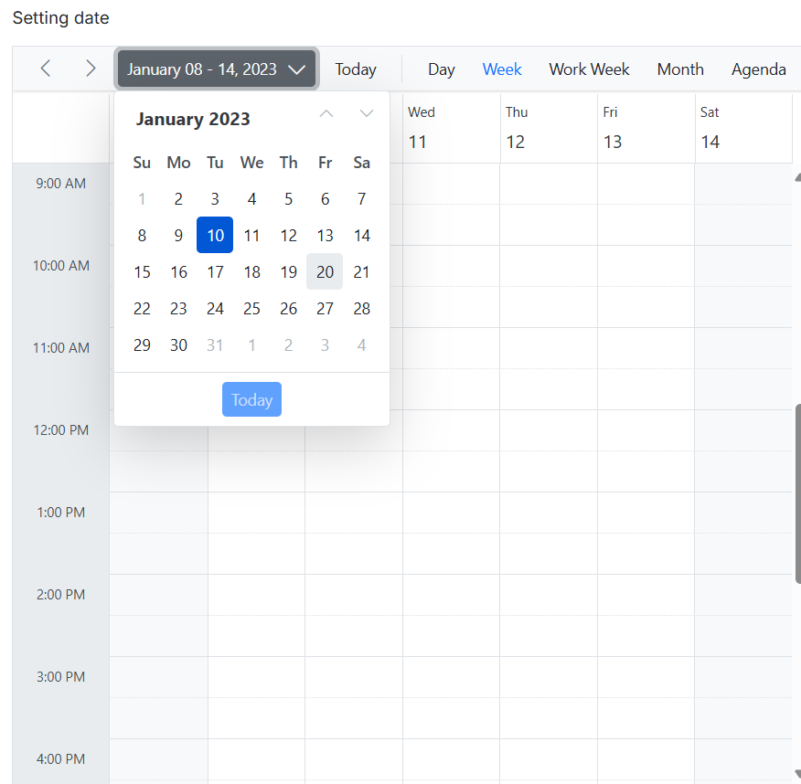

# Cell Customizations in Blazor Scheduler Component

The cells within the Scheduler component can be extensively customized using the cell template.

## Setting Cell Dimensions in Vertical Views

The height and width of the Scheduler cells can be customized either to increase or reduce its size through the [`CssClass`](https://help.syncfusion.com/cr/blazor/Syncfusion.Blazor.Schedule.SfSchedule-1.html#Syncfusion_Blazor_Schedule_SfSchedule_1_CssClass) property, which overrides the default CSS applied on cells of vertical views.

```cshtml
@using Syncfusion.Blazor.Schedule

<SfSchedule TValue="AppointmentData" CssClass="schedule-cell-dimension" Height="550px">
    <ScheduleViews>
        <ScheduleView Option="View.Day"></ScheduleView>
        <ScheduleView Option="View.Week"></ScheduleView>
        <ScheduleView Option="View.WorkWeek"></ScheduleView>
        <ScheduleView Option="View.Month"></ScheduleView>
        <ScheduleView Option="View.Agenda"></ScheduleView>
    </ScheduleViews>
</SfSchedule>

<style>
    .schedule-cell-dimension.e-schedule .e-vertical-view .e-date-header-wrap table col,
    .schedule-cell-dimension.e-schedule .e-vertical-view .e-content-wrap table col {
        width: 200px;
    }

    .schedule-cell-dimension.e-schedule .e-vertical-view .e-time-cells-wrap table td,
    .schedule-cell-dimension.e-schedule .e-vertical-view .e-work-cells {
        height: 100px;
    }

    .schedule-cell-dimension.e-schedule .e-month-view .e-work-cells,
    .schedule-cell-dimension.e-schedule .e-month-view .e-date-header-wrap table col {
        width: 200px;
    }

    .schedule-cell-dimension.e-schedule .e-month-view .e-work-cells {
        height: 200px;
    }
</style>
@code{
    public class AppointmentData
    {
        public int Id { get; set; }
        public string Subject { get; set; }
        public string Location { get; set; }
        public DateTime StartTime { get; set; }
        public DateTime EndTime { get; set; }
        public string Description { get; set; }
        public bool IsAllDay { get; set; }
        public string RecurrenceRule { get; set; }
        public string RecurrenceException { get; set; }
        public Nullable<int> RecurrenceID { get; set; }
    }
}
```



## Setting Cell Dimensions in Timeline Views

The height and width of the Scheduler cells can be customized either to increase or reduce its size through the [`CssClass`](https://help.syncfusion.com/cr/blazor/Syncfusion.Blazor.Schedule.SfSchedule-1.html#Syncfusion_Blazor_Schedule_SfSchedule_1_CssClass) property, which overrides the default CSS applied on cells of timeline views.

```cshtml
@using Syncfusion.Blazor.Schedule

<SfSchedule TValue="AppointmentData" CssClass="schedule-cell-dimension" Height="550px">
    <ScheduleViews>
        <ScheduleView Option="View.TimelineWeek" MaxEventsPerRow="10"></ScheduleView>
        <ScheduleView Option="View.TimelineMonth" MaxEventsPerRow="10"></ScheduleView>
    </ScheduleViews>
</SfSchedule>

<style>
    .schedule-cell-dimension.e-schedule .e-timeline-view .e-date-header-wrap table col,
    .schedule-cell-dimension.e-schedule .e-timeline-view .e-content-wrap table col {
        width: 200px;
    }

    .schedule-cell-dimension.e-schedule .e-timeline-month-view .e-date-header-wrap table col,
    .schedule-cell-dimension.e-schedule .e-timeline-month-view .e-content-wrap table col {
        width: 200px;
    }
</style>
@code{
    public class AppointmentData
    {
        public int Id { get; set; }
        public string Subject { get; set; }
        public string Location { get; set; }
        public DateTime StartTime { get; set; }
        public DateTime EndTime { get; set; }
        public string Description { get; set; }
        public bool IsAllDay { get; set; }
        public string RecurrenceRule { get; set; }
        public string RecurrenceException { get; set; }
        public Nullable<int> RecurrenceID { get; set; }
    }
}
```



## Customizing Cells Using CellTemplate

The [`CellTemplate`](https://help.syncfusion.com/cr/blazor/Syncfusion.Blazor.Schedule.ScheduleTemplates.html#Syncfusion_Blazor_Schedule_ScheduleTemplates_CellTemplate) allows for powerful customization of the background of individual cells. This can include displaying specific images, custom text, or conditional styling based on the date value of the cell.

```cshtml
@using Syncfusion.Blazor.Schedule

<SfSchedule TValue="AppointmentData" Width="100%" Height="650px" @bind-SelectedDate="@CurrentDate">
    <ScheduleTemplates>
        <CellTemplate>
            <div class="templatewrap">
                @{
                    @if ((int)(context as TemplateContext).Date.Month == 11 && (int)(context as TemplateContext).Date.Day == 23)
                    {
                        <div class="caption">Thanksgiving day</div>
                    }
                    @if ((int)(context as TemplateContext).Date.Month == 12 && (int)(context as TemplateContext).Date.Day == 9)
                    {
                        <div class="caption">Party time</div>
                    }
                    @if ((int)(context as TemplateContext).Date.Month == 12 && (int)(context as TemplateContext).Date.Day == 13)
                    {
                        <div class="caption">Party time</div>
                    }
                    @if ((int)(context as TemplateContext).Date.Month == 12 && (int)(context as TemplateContext).Date.Day == 22)
                    {
                        <div class="caption">Happy birthday</div>
                    }
                    @if ((int)(context as TemplateContext).Date.Month == 12 && (int)(context as TemplateContext).Date.Day == 24)
                    {
                        <div class="caption">Christmas Eve</div>
                    }
                    @if ((int)(context as TemplateContext).Date.Month == 12 && (int)(context as TemplateContext).Date.Day == 25)
                    {
                        <div class="caption">Christmas day</div>
                    }
                    @if ((int)(context as TemplateContext).Date.Month == 1 && (int)(context as TemplateContext).Date.Day == 1)
                    {
                        <div class="caption">New Year"s Day</div>
                    }
                    @if ((int)(context as TemplateContext).Date.Month == 1 && (int)(context as TemplateContext).Date.Day == 14)
                    {
                        <div class="caption">Get together</div>
                    }
                }
            </div>
        </CellTemplate>
    </ScheduleTemplates>
    <ScheduleViews>
        <ScheduleView Option="View.Month" MaxEventsPerRow="2"></ScheduleView>
    </ScheduleViews>
</SfSchedule>
<style>
    .e-schedule .e-month-view .e-work-cells {
        position: relative;
    }

    .e-schedule .templatewrap {
        text-align: center;
        position: absolute;
        width: 100%;
    }

    .e-schedule .caption {
        overflow: hidden;
        text-overflow: ellipsis;
        vertical-align: middle;
    }
</style>

@code {
    DateTime CurrentDate = new DateTime(2023, 1, 15);
    public class AppointmentData
    {
        public int Id { get; set; }
        public string Subject { get; set; }
        public string Location { get; set; }
        public DateTime StartTime { get; set; }
        public DateTime EndTime { get; set; }
        public string Description { get; set; }
        public bool IsAllDay { get; set; }
        public string RecurrenceRule { get; set; }
        public string RecurrenceException { get; set; }
        public Nullable<int> RecurrenceID { get; set; }
    }
}
```



## Customizing Cell Header in Month View

The month header of each date cell in the month view can be customized using the [CellHeaderTemplate](https://help.syncfusion.com/cr/blazor/Syncfusion.Blazor.Schedule.ScheduleTemplates.html#Syncfusion_Blazor_Schedule_ScheduleTemplates_CellHeaderTemplate).

```cshtml
@using Syncfusion.Blazor.Schedule
@using System.Globalization
<SfSchedule TValue="AppointmentData" Width="100%" Height="650px" @bind-SelectedDate="@CurrentDate">
    <ScheduleTemplates>
        <CellHeaderTemplate>
            <div>@context.Date.ToString("dd ddd", CultureInfo.InvariantCulture)</div>
        </CellHeaderTemplate>
    </ScheduleTemplates>
    <ScheduleEventSettings DataSource="@DataSource"></ScheduleEventSettings>
    <ScheduleViews>
        <ScheduleView Option="View.Month"></ScheduleView>
    </ScheduleViews>
</SfSchedule>
@code {
    private DateTime CurrentDate = new DateTime(2023, 1, 6);
    List<AppointmentData> DataSource = new List<AppointmentData>
    {
        new AppointmentData { Id = 1, Subject = "Meeting", StartTime = new DateTime(2023, 1, 6, 9, 30, 0) , EndTime = new DateTime(2023, 1, 6, 11, 0, 0),
        RecurrenceRule = "FREQ=DAILY;INTERVAL=1;COUNT=5" }
    };   
    public class AppointmentData
    {
        public int Id { get; set; }
        public string Subject { get; set; }
        public DateTime StartTime { get; set; }
        public DateTime EndTime { get; set; }
        public bool IsAllDay { get; set; }
        public string RecurrenceRule { get; set; }
        public Nullable<int> RecurrenceID { get; set; }
        public string RecurrenceException { get; set; }
    }
}
```



## Customizing Cells Using OnRenderCell Event

Cells can also be customized programmatically by using the [`OnRenderCell`](https://help.syncfusion.com/cr/blazor/Syncfusion.Blazor.Schedule.ScheduleEvents-1.html#Syncfusion_Blazor_Schedule_ScheduleEvents_1_OnRenderCell) event. In this event, the provided [`RenderCellEventArgs`](https://help.syncfusion.com/cr/blazor/Syncfusion.Blazor.Schedule.RenderCellEventArgs.html#properties) expose properties such as [`ElementType`](https://help.syncfusion.com/cr/blazor/Syncfusion.Blazor.Schedule.RenderCellEventArgs.html#Syncfusion_Blazor_Schedule_RenderCellEventArgs_ElementType) (e.g., `WorkCells`, `AllDayCells`), `Date`, and `CssClasses` to enable conditional styling.

```cshtml
@using Syncfusion.Blazor.Schedule

<SfSchedule TValue="AppointmentData" Width="100%" Height="550px" @bind-SelectedDate="@CurrentDate">
    <ScheduleEvents TValue="AppointmentData" OnRenderCell="OnRenderCell"></ScheduleEvents>
    <ScheduleEventSettings DataSource="@DataSource"></ScheduleEventSettings>
    <ScheduleViews>
        <ScheduleView Option="View.Day"></ScheduleView>
        <ScheduleView Option="View.Week"></ScheduleView>
        <ScheduleView Option="View.WorkWeek"></ScheduleView>
        <ScheduleView Option="View.Month"></ScheduleView>
        <ScheduleView Option="View.Agenda"></ScheduleView>
    </ScheduleViews>
</SfSchedule>
<style>
    .e-schedule .e-vertical-view .e-work-hours.custom-class {
        background-color: ivory;
    }
</style>

@code{
    private DateTime CurrentDate = new DateTime(2023, 3, 10);
    public string[] CustomClass = { "custom-class" };
    public void OnRenderCell(RenderCellEventArgs args)
    {
        //Here you can customize with your code
        if (args.ElementType == ElementType.WorkCells)
        {
            args.CssClasses = new List<string>(CustomClass);//The default work hours color is changed to ivory color
        }
    }
    List<AppointmentData> DataSource = new List<AppointmentData>
    {
        new AppointmentData { Id = 1, Subject = "Meeting", StartTime = new DateTime(2023, 3, 10, 9, 30, 0) , EndTime = new DateTime(2023, 3, 10, 12, 0, 0) }
    };
    public class AppointmentData
    {
        public int Id { get; set; }
        public string Subject { get; set; }
        public string Location { get; set; }
        public DateTime StartTime { get; set; }
        public DateTime EndTime { get; set; }
        public string Description { get; set; }
        public bool IsAllDay { get; set; }
        public string RecurrenceRule { get; set; }
        public string RecurrenceException { get; set; }
        public Nullable<int> RecurrenceID { get; set; }
    }
}
```


## Customizing the Minimum and Maximum Date Values

To define the minimum and maximum date range selectable and navigable within the Scheduler, the [`MinDate`](https://help.syncfusion.com/cr/blazor/Syncfusion.Blazor.Schedule.SfSchedule-1.html#Syncfusion_Blazor_Schedule_SfSchedule_1_MinDate) and [`MaxDate`](https://help.syncfusion.com/cr/blazor/Syncfusion.Blazor.Schedule.SfSchedule-1.html#Syncfusion_Blazor_Schedule_SfSchedule_1_MaxDate) properties are used. Dates outside this specified range will appear in a disabled state, and date navigation will be blocked beyond these limits.

N> By default, the `MinDate` property is set to `new DateTime(1900, 1, 1)` and `MaxDate` to `new DateTime(2099, 12, 31)`. These default values can be customized as needed.

```cshtml
@using Syncfusion.Blazor.Schedule

<p>Setting date</p>
<SfSchedule TValue="AppointmentData" Height="650px" MinDate="new DateTime(2023, 1, 2)" MaxDate="new DateTime(2023, 1, 30)" @bind-SelectedDate="@CurrentDate">
    <ScheduleViews>
        <ScheduleView Option="View.Day"></ScheduleView>
        <ScheduleView Option="View.Week"></ScheduleView>
        <ScheduleView Option="View.WorkWeek"></ScheduleView>
        <ScheduleView Option="View.Month"></ScheduleView>
        <ScheduleView Option="View.Agenda"></ScheduleView>
    </ScheduleViews>
</SfSchedule>
@code{
    private DateTime CurrentDate = new DateTime(2023, 1, 10);
    public class AppointmentData
    {
        public int Id { get; set; }
        public string Subject { get; set; }
        public DateTime StartTime { get; set; }
        public DateTime EndTime { get; set; }
    }
}
```




## Customizing Weekend Cell Background Color

The background color of weekend cells can be customized using the [`OnRenderCell`](https://help.syncfusion.com/cr/blazor/Syncfusion.Blazor.Schedule.ScheduleEvents-1.html#Syncfusion_Blazor_Schedule_ScheduleEvents_1_OnRenderCell) event. This event allows adding [`CssClasses`](https://help.syncfusion.com/cr/blazor/Syncfusion.Blazor.Schedule.RenderCellEventArgs.html#Syncfusion_Blazor_Schedule_RenderCellEventArgs_CssClasses) to cells based on their `Date` and [`ElementType`](https://help.syncfusion.com/cr/blazor/Syncfusion.Blazor.Schedule.RenderCellEventArgs.html#Syncfusion_Blazor_Schedule_RenderCellEventArgs_ElementType).

```cshtml
@using Syncfusion.Blazor.Schedule

<SfSchedule TValue="AppointmentData" Width="100%" Height="550px" @bind-SelectedDate="@CurrentDate" CssClass="schedule-cell-customization">
    <ScheduleEvents TValue="AppointmentData" OnRenderCell="OnRenderCell"></ScheduleEvents>
    <ScheduleEventSettings DataSource="@DataSource"></ScheduleEventSettings>
    <ScheduleViews>
        <ScheduleView Option="View.Day"></ScheduleView>
        <ScheduleView Option="View.Week"></ScheduleView>
        <ScheduleView Option="View.WorkWeek"></ScheduleView>
        <ScheduleView Option="View.Month"></ScheduleView>
        <ScheduleView Option="View.Agenda"></ScheduleView>
    </ScheduleViews>
</SfSchedule>
<style>
    .schedule-cell-customization.e-schedule .e-vertical-view .e-work-cells.custom-class {
        background-color: #ffdea2;
    }

    .schedule-cell-customization.e-schedule .e-month-view .e-work-cells:not(.e-work-days) {
        background-color: #f08080;
    }
</style>
@code {
    private DateTime CurrentDate = new DateTime(2023, 3, 10);
    public string[] CustomClass = { "custom-class" };
    public void OnRenderCell(RenderCellEventArgs args)
    {
        //Here you can customize with your code
        if (args.ElementType == ElementType.WorkCells)
        {
            if (args.Date.DayOfWeek == DayOfWeek.Sunday || args.Date.DayOfWeek == DayOfWeek.Saturday)
            {
                args.CssClasses = new List<string>(CustomClass);
            }
        }
    }
    List<AppointmentData> DataSource = new List<AppointmentData>
    {
        new AppointmentData { Id = 1, Subject = "Meeting", StartTime = new DateTime(2023, 3, 10, 9, 30, 0) , EndTime = new DateTime(2023, 3, 10, 12, 0, 0) }
    };
    public class AppointmentData
    {
        public int Id { get; set; }
        public string Subject { get; set; }
        public string Location { get; set; }
        public DateTime StartTime { get; set; }
        public DateTime EndTime { get; set; }
        public string Description { get; set; }
        public bool IsAllDay { get; set; }
        public string RecurrenceRule { get; set; }
        public string RecurrenceException { get; set; }
        public Nullable<int> RecurrenceID { get; set; }
    }
}
```



And, the background color for weekend cells in the Month view through the [`CssClass`](https://help.syncfusion.com/cr/blazor/Syncfusion.Blazor.Schedule.SfSchedule-1.html#Syncfusion_Blazor_Schedule_SfSchedule_1_CssClass) property, which overrides the default CSS applied on cells.

```CSS

.schedule-cell-customization.e-schedule .e-month-view .e-work-cells:not(.e-work-days) {
    background-color: #f08080;
}

```

## How to Disable Multiple Cell and Row Selection in Schedule

By default, the [`AllowMultiCellSelection`](https://help.syncfusion.com/cr/blazor/Syncfusion.Blazor.Schedule.SfSchedule-1.html#Syncfusion_Blazor_Schedule_SfSchedule_1_AllowMultiCellSelection) and [`AllowMultiRowSelection`](https://help.syncfusion.com/cr/blazor/Syncfusion.Blazor.Schedule.SfSchedule-1.html#Syncfusion_Blazor_Schedule_SfSchedule_1_AllowMultiRowSelection) properties of the Scheduler are set to `true`, allowing users to select multiple cells and rows. To disable this behavior, set both properties to `false`.
