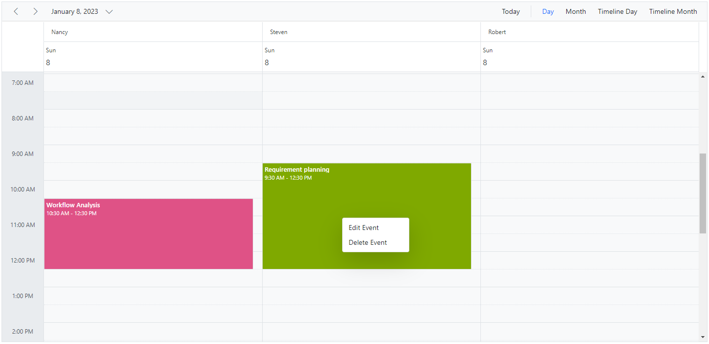

# Context Menu in Blazor Scheduler Component

The context menu can be displayed on work cells, resource cells and appointments of Scheduler by making use of the [`ContextMenu`](https://blazor.syncfusion.com/documentation/context-menu/getting-started) control manually from the application end. In the following code example, context menu control is being added from sample end and set its target as `Scheduler` and the target element is got by using [GetElementInfoAsync](https://help.syncfusion.com/cr/blazor/Syncfusion.Blazor.Schedule.SfSchedule-1.html#Syncfusion_Blazor_Schedule_SfSchedule_1_GetElementInfoAsync_System_Int32_System_Int32_) public method in Blazor.

On Scheduler cells, the menu items can be displayed such as `New Event`, `New Recurring Event` and `Today` option. For appointments, its related options can be displayed such as `Edit Event` and `Delete Event`. For resource cells, the related resource cell information can be displayed. The default event window can be opened for appointment creation and editing using the [OpenEditorAsync](https://help.syncfusion.com/cr/blazor/Syncfusion.Blazor.Schedule.SfSchedule-1.html#Syncfusion_Blazor_Schedule_SfSchedule_1_OpenEditorAsync__0_Syncfusion_Blazor_Schedule_CurrentAction_) method of Scheduler.

The deletion of appointments can be done by using the [DeleteEventAsync](https://help.syncfusion.com/cr/blazor/Syncfusion.Blazor.Schedule.SfSchedule-1.html#Syncfusion_Blazor_Schedule_SfSchedule_1_DeleteEventAsync__1___0_System_Nullable_Syncfusion_Blazor_Schedule_CurrentAction__) public method. Also, the [SelectedDate](https://help.syncfusion.com/cr/blazor/Syncfusion.Blazor.Schedule.SfSchedule-1.html#Syncfusion_Blazor_Schedule_SfSchedule_1_SelectedDate) property can be used to navigate between different dates.

N> You can also display custom menu options on Scheduler cells and appointments. Context menu will open on tap-hold in responsive mode.

```cshtml
@using Syncfusion.Blazor.Schedule
@using Syncfusion.Blazor.Navigations
<SfSchedule TValue="AppointmentData" @ref="ScheduleRef" Height="650px" @bind-SelectedDate="@SelectedDate">
    <ScheduleGroup Resources="@groupData"></ScheduleGroup>
    <ScheduleResources>
        <ScheduleResource TItem="ResourceData" TValue="int[]" DataSource="@Resources" Field="TaskId" Title="Category" Name="Categories" TextField="Name" IdField="Id" GroupIDField="GroupId" ColorField="Color" AllowMultiple="true"></ScheduleResource>
    </ScheduleResources>
    <ScheduleEventSettings DataSource="@DataSource"></ScheduleEventSettings>
    <ScheduleViews>
        <ScheduleView Option="View.Day"></ScheduleView>
        <ScheduleView Option="View.Month"></ScheduleView>
        <ScheduleView Option="View.TimelineDay"></ScheduleView>
        <ScheduleView Option="View.TimelineMonth"></ScheduleView>
    </ScheduleViews>
</SfSchedule>
<SfContextMenu TValue="MenuItem" Target=".e-schedule">
    <MenuItems>
        <MenuItem Text="New Event" Id="Add" Hidden="@isCell"></MenuItem>
        <MenuItem Text="New Recurring Event" Hidden="@isCell" Id="AddRecurrence"></MenuItem>
        <MenuItem Text="Today" Id="Today" Hidden="@isCell"></MenuItem>
        <MenuItem Text="Edit Event" Id="Save" Hidden="@isEvent"></MenuItem>
        <MenuItem Text="Edit Event" Id="EditRecurrenceEvent" Hidden="@isRecurrence">
            <MenuItems>
                <MenuItem Text="Edit Occurrence" Id="EditOccurrence" Hidden="@isRecurrence"></MenuItem>
                <MenuItem Text="Edit Series" Id="EditSeries" Hidden="@isRecurrence"></MenuItem>
            </MenuItems>
        </MenuItem>
        <MenuItem Text="Delete Event" Id="Delete" Hidden="@isEvent"></MenuItem>
        <MenuItem Text="Delete Event" Id="DeleteRecurrenceEvent" Hidden="@isRecurrence">
            <MenuItems>
                <MenuItem Text="Delete Occurrence" Id="DeleteOccurrence" Hidden="@isRecurrence"></MenuItem>
                <MenuItem Text="Delete Series" Id="DeleteSeries" Hidden="@isRecurrence"></MenuItem>
            </MenuItems>
        </MenuItem>
        <MenuItem Text="Rename" Id="Rename" Hidden="@isResource"></MenuItem>
    </MenuItems>
    <MenuEvents TValue="MenuItem" OnOpen="OnOpen" ItemSelected="OnItemSelected"></MenuEvents>
</SfContextMenu>

@code{
    private DateTime SelectedDate { get; set; } = new DateTime(2023, 1, 8);
    private bool isCell;
    private bool isEvent;
    private bool isRecurrence;
    private bool isResource;
    SfSchedule<AppointmentData> ScheduleRef;
    private AppointmentData EventData { get; set; }
    private CellClickEventArgs CellData { get; set; }
    private ElementInfo<AppointmentData> ElementData { get; set; }
    private string[] groupData = new string[] { "Projects", "Categories" };
    private List<ResourceData> Resources { get; set; } = new List<ResourceData> {
        new ResourceData { Name = "Nancy", Id= 1, GroupId = 1, Color = "#df5286" },
        new ResourceData { Name = "Steven", Id= 2, GroupId = 1, Color = "#7fa900" },
        new ResourceData { Name = "Robert", Id= 3, GroupId = 2, Color = "#ea7a57" }, 
    };
    public class ResourceData
    {
        public string Name { get; set; }
        public int Id { get; set; }
        public int GroupId { get; set; }
        public string Color { get; set; }
    }
    public List<AppointmentData> DataSource = new List<AppointmentData>
    {
        new AppointmentData { Id = 1, Subject = "Workflow Analysis", StartTime = new DateTime(2023, 1, 8, 10, 30, 0) , EndTime = new DateTime(2023, 1, 8, 12, 30, 0) , IsAllDay = false, TaskId = 1},
        new AppointmentData { Id = 2, Subject = "Requirement planning", StartTime = new DateTime(2023, 1, 8, 9, 30, 0) , EndTime = new DateTime(2023, 1, 8, 12, 30, 0) , IsAllDay = false, TaskId = 2},
    };

    public async Task OnOpen(BeforeOpenCloseMenuEventArgs<MenuItem> args)
    {
        if (args.ParentItem == null)
        {
            isResource = true;
            ElementData = await ScheduleRef.GetElementInfoAsync((int)args.Left, (int)args.Top);
            if (ElementData.ElementType == ElementType.Event)
            {
                EventData = ElementData.EventData;
                if (EventData.Id == 0)
                {
                    args.Cancel = true;
                }
                if (EventData.RecurrenceRule != null)
                {
                    isCell = isEvent = true;
                    isRecurrence = false;
                }
                else
                {
                    isCell = isRecurrence = true;
                    isEvent = false;
                }
            }
            else
            {
                isCell = false;
                isEvent = isRecurrence = true;
            }

            if (ElementData.ElementType == ElementType.WorkCells)
            {
                var groupIndex = this.ScheduleRef.GetGroupIndex((ElementData.ResourceData.Last() as ResourceData).Id, "Categories");
                CellClickEventArgs cellData = new CellClickEventArgs
                {
                    StartTime = ElementData.StartTime,
                    EndTime = ElementData.EndTime,
                    IsAllDay = ElementData.IsAllDay,
                    GroupIndex = groupIndex,
                };
                CellData = cellData;
                isCell = false;
                isEvent = isRecurrence = true;
            }

            if (ElementData.ElementType == ElementType.ResourceHeader)
            {
                isResource = false;
                Console.WriteLine(ElementData.ResourceData);
            }
        }
    }
    public async Task OnItemSelected(MenuEventArgs<MenuItem> args)
    {
        var SelectedMenuItem = args.Item.Id;
        var ActiveCellsData = await ScheduleRef.GetSelectedCellsAsync();
        if (ActiveCellsData == null)
        {
            ActiveCellsData = CellData;
        }
        switch (SelectedMenuItem)
        {
            case "Today":
                SelectedDate = DateTime.Now;
                break;
            case "Add":
                await ScheduleRef.OpenEditorAsync(ActiveCellsData, CurrentAction.Add);
                break;
            case "AddRecurrence":
                await ScheduleRef.OpenEditorAsync(ActiveCellsData, CurrentAction.Add, RepeatType.Daily);
                break;
            case "Save":
                await ScheduleRef.OpenEditorAsync(EventData, CurrentAction.Save);
                break;
            case "EditOccurrence":
                await ScheduleRef.OpenEditorAsync(EventData, CurrentAction.EditOccurrence);
                break;
            case "EditSeries":
                List<AppointmentData> Events = await ScheduleRef.GetEventsAsync();
                EventData = (AppointmentData)Events.Where(data => data.Id == EventData.RecurrenceID).FirstOrDefault();
                await ScheduleRef.OpenEditorAsync(EventData, CurrentAction.EditSeries);
                break;
            case "Delete":
                await ScheduleRef.DeleteEventAsync(EventData);
                break;
            case "DeleteOccurrence":
                await ScheduleRef.DeleteEventAsync(EventData, CurrentAction.DeleteOccurrence);
                break;
            case "DeleteSeries":
                await ScheduleRef.DeleteEventAsync(EventData, CurrentAction.DeleteSeries);
                break;
        }
    }
    public class AppointmentData
    {
        public int Id { get; set; }
        public string Subject { get; set; }
        public string Location { get; set; }
        public DateTime StartTime { get; set; }
        public DateTime EndTime { get; set; }
        public string Description { get; set; }
        public bool IsAllDay { get; set; }
        public string RecurrenceRule { get; set; }
        public string RecurrenceException { get; set; }
        public Nullable<int> RecurrenceID { get; set; }
        public int TaskId { get; set; }
    }
}

```

