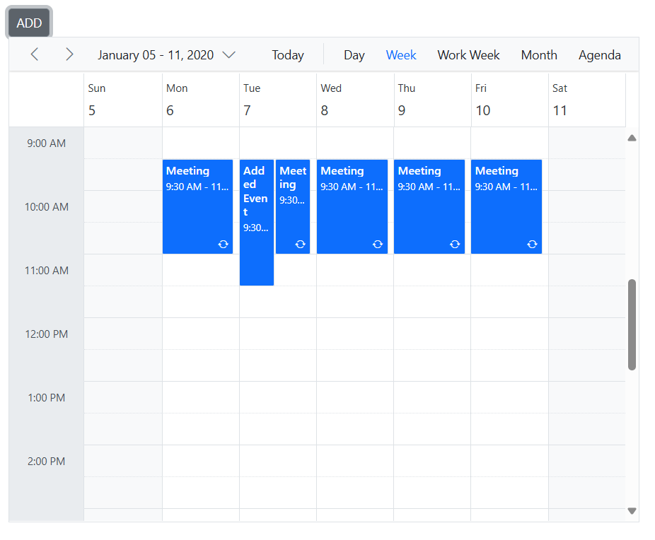

# CRUD Actions in Blazor Scheduler Component

Appointments, also known as events, are central to user interaction within the Scheduler. The component provides intuitive ways to manipulate these appointments (add, edit, delete) either through its interactive editor, quick popups, inline editing, or via drag-and-resize actions.

## Add

Appointments of any type—normal, all-day, spanned, or recurring events—can be easily added to the Scheduler using one of the following methods:

* [Creation using Editor Window](#creation-using-editor-window)
* [Creation using AddEventAsync Method](#creation-using-addeventasync-method)
* [Inline Creation](#inline-creation)

### Creation using Editor Window

The default editor window opens when a user double-clicks on an empty cell in the Scheduler. This comprehensive editor provides various event-related options such as Subject, Location, Start and End time, All-day status, Timezone, Description, and recurrence options. Users can provide detailed information for the event through these fields. After filling in the appropriate values, clicking the `Save` button adds the event.

Alternatively, a single click on a Scheduler cell opens a quick popup, allowing the user to simply enter a subject and save the appointment. For a selected time range (e.g., multiple cells selected by dragging), pressing the <kbd>Enter</kbd> key can also open this quick popup to save an appointment for that duration.

### Creation using AddEventAsync Method

Appointments can be dynamically created and added to the Scheduler programmatically using the [`AddEventAsync`](https://help.syncfusion.com/cr/blazor/Syncfusion.Blazor.Schedule.SfSchedule-1.html#Syncfusion_Blazor_Schedule_SfSchedule_1_AddEventAsync__0_) method.

```cshtml
@using Syncfusion.Blazor.Schedule
@using Syncfusion.Blazor.Buttons

<SfButton Content="ADD" OnClick="OnClick"></SfButton>

<SfSchedule @ref="ScheduleRef" TValue="AppointmentData" Height="550px" @bind-SelectedDate="@CurrentDate">
    <ScheduleEventSettings DataSource="@DataSource"></ScheduleEventSettings>
    <ScheduleViews>
        <ScheduleView Option="View.Day"></ScheduleView>
        <ScheduleView Option="View.Week"></ScheduleView>
        <ScheduleView Option="View.WorkWeek"></ScheduleView>
        <ScheduleView Option="View.Month"></ScheduleView>
        <ScheduleView Option="View.Agenda"></ScheduleView>
    </ScheduleViews>
</SfSchedule>
@code{
    DateTime CurrentDate = new DateTime(2020, 1, 6);
    SfSchedule<AppointmentData> ScheduleRef;
    List<AppointmentData> DataSource = new List<AppointmentData>
    {
        new AppointmentData { Id = 1, Subject = "Meeting", StartTime = new DateTime(2020, 1, 6, 9, 30, 0) , EndTime = new DateTime(2020, 1, 6, 11, 0, 0),
        RecurrenceRule = "FREQ=DAILY;INTERVAL=1;COUNT=5" }
    };
    public async Task OnClick()
    {
        AppointmentData eventData = new AppointmentData
        {
            Id = 10,
            Subject = "Added Event",
            StartTime = new DateTime(2020, 1, 7, 9, 30, 0),
            EndTime = new DateTime(2020, 1, 7, 11, 30, 0),
        };
        await ScheduleRef.AddEventAsync(eventData);
    }
    public class AppointmentData
    {
        public int Id { get; set; }
        public string Subject { get; set; }
        public string Location { get; set; }
        public DateTime StartTime { get; set; }
        public DateTime EndTime { get; set; }
        public string Description { get; set; }
        public bool IsAllDay { get; set; }
        public string RecurrenceRule { get; set; }
        public string RecurrenceException { get; set; }
        public Nullable<int> RecurrenceID { get; set; }
    }
}
```




### Inline Creation

Another convenient way to create appointments is by enabling the [`AllowInline`](https://help.syncfusion.com/cr/blazor/Syncfusion.Blazor.Schedule.SfSchedule-1.html#Syncfusion_Blazor_Schedule_SfSchedule_1_AllowInline) property. This allows users to single-click on Scheduler cells or press the <kbd>Enter</kbd> key on selected cells to display an appointment-like textbox. Users can then type the event's `Subject` directly. Pressing <kbd>Enter</kbd> or clicking outside the textbox will save the new appointment.

```cshtml
@using Syncfusion.Blazor.Schedule

<SfSchedule TValue="AppointmentData" Height="550px" AllowInline="true" @bind-SelectedDate="@CurrentDate">
    <ScheduleEventSettings DataSource="@DataSource"></ScheduleEventSettings>
    <ScheduleViews>
        <ScheduleView Option="View.Day"></ScheduleView>
        <ScheduleView Option="View.Week"></ScheduleView>
        <ScheduleView Option="View.WorkWeek"></ScheduleView>
        <ScheduleView Option="View.Month"></ScheduleView>
        <ScheduleView Option="View.Agenda"></ScheduleView>
    </ScheduleViews>
</SfSchedule>

@code{
    DateTime CurrentDate = new DateTime(2020, 1, 6);
    List<AppointmentData> DataSource = new List<AppointmentData>
    {
        new AppointmentData { Id = 1, Subject = "Meeting", StartTime = new DateTime(2020, 1, 6, 9, 30, 0) , EndTime = new DateTime(2020, 1, 6, 11, 0, 0) }
    };
    public class AppointmentData
    {
        public int Id { get; set; }
        public string Subject { get; set; }
        public string Location { get; set; }
        public DateTime StartTime { get; set; }
        public DateTime EndTime { get; set; }
        public string Description { get; set; }
        public bool IsAllDay { get; set; }
        public string RecurrenceRule { get; set; }
        public string RecurrenceException { get; set; }
        public Nullable<int> RecurrenceID { get; set; }
    }
}
```


### Inserting Events into a Database at Server-Side

When adding normal or recurring events to the Scheduler, an `insert` action is triggered. The following code example illustrates how to handle a new event persisting to a database on the server side.

```sh
if (param.action == "insert" || (param.action == "batch" && param.added != null)) // this block of code will execute while inserting the appointments
{
    var value = (param.action == "insert") ? param.value : param.added[0];
    int intMax = db.ScheduleEventDatas.Select(x => x.Id).DefaultIfEmpty(0).Max();
    DateTime startTime = Convert.ToDateTime(value.StartTime);
    DateTime endTime = Convert.ToDateTime(value.EndTime);
    ScheduleEventData appointment = new ScheduleEventData()
    {
        Id = intMax + 1,
        StartTime = startTime,
        EndTime = endTime,
        Subject = value.Subject,
        IsAllDay = value.IsAllDay,
        StartTimezone = value.StartTimezone,
        EndTimezone = value.EndTimezone,
        RecurrenceRule = value.RecurrenceRule,
        RecurrenceID = value.RecurrenceID,
        RecurrenceException = value.RecurrenceException
    };
    db.ScheduleEventDatas.InsertOnSubmit(appointment);
    db.SubmitChanges();
}
```


### Restricting Add Action Based on Specific Criteria

In the following example, the specific fields of Scheduler editor window such as Subject and Location are made to undergo validation such that if it is left as blank, then the default `required` validation message will be displayed, while clicking on a save button.

Additionally, a regular expression (regex) condition can be applied to the `Location` field to prevent special characters, displaying a custom validation message if violated.

```cshtml
@using Syncfusion.Blazor.Schedule

<SfSchedule TValue="AppointmentData" Height="550px" @bind-SelectedDate="@CurrentDate">
    <ScheduleEventSettings DataSource="@DataSource">
        <ScheduleField>
            <FieldSubject Name="Subject" Validation="@ValidationRules"></FieldSubject>
            <FieldLocation Name="Location" Validation="@LocationValidationRules"></FieldLocation>
            <FieldDescription Name="Description" Validation="@DescriptionValidationRules"></FieldDescription>
            <FieldStartTime Name="StartTime" Validation="@ValidationRules"></FieldStartTime>
            <FieldEndTime Name="EndTime" Validation="@ValidationRules"></FieldEndTime>
        </ScheduleField>
    </ScheduleEventSettings>
    <ScheduleViews>
        <ScheduleView Option="View.Day"></ScheduleView>
        <ScheduleView Option="View.Week"></ScheduleView>
        <ScheduleView Option="View.WorkWeek"></ScheduleView>
        <ScheduleView Option="View.Month"></ScheduleView>
        <ScheduleView Option="View.Agenda"></ScheduleView>
    </ScheduleViews>
</SfSchedule>
@code{
    DateTime CurrentDate = new DateTime(2020, 1, 6);
    static Dictionary<string, object> ValidationMessages = new Dictionary<string, object>() { { "regex", "Special character(s) not allowed in this field" } };
    ValidationRules ValidationRules = new ValidationRules { Required = true };
    ValidationRules LocationValidationRules = new ValidationRules { Required = true, RegexPattern = "^[a-zA-Z0-9- ]*$", Messages = ValidationMessages };
    ValidationRules DescriptionValidationRules = new ValidationRules { Required = true, MinLength = 5, MaxLength = 500 };

    List<AppointmentData> DataSource = new List<AppointmentData>
    {
        new AppointmentData { Id = 1, Subject = "Meeting", StartTime = new DateTime(2020, 1, 6, 9, 30, 0) , EndTime = new DateTime(2020, 1, 6, 11, 0, 0) }
    };

    public class AppointmentData
    {
        public int Id { get; set; }
        public string Subject { get; set; }
        public string Location { get; set; }
        public DateTime StartTime { get; set; }
        public DateTime EndTime { get; set; }
        public string Description { get; set; }
        public bool IsAllDay { get; set; }
        public string RecurrenceRule { get; set; }
        public string RecurrenceException { get; set; }
        public Nullable<int> RecurrenceID { get; set; }
    }
}
```



The creation of appointments can also be dynamically prevented based on runtime conditions. For example, to prevent appointment creation on weekend days, the [`OnActionBegin`](https://help.syncfusion.com/cr/blazor/Syncfusion.Blazor.Schedule.ScheduleEvents-1.html#Syncfusion_Blazor_Schedule_ScheduleEvents_1_OnActionBegin) event can be used to check the start date of the proposed appointment.

```cshtml
@using Syncfusion.Blazor.Schedule

<SfSchedule TValue="AppointmentData" Width="100%" Height="550px" @bind-SelectedDate="@CurrentDate">
    <ScheduleEvents TValue="AppointmentData" OnActionBegin="OnActionBegin"></ScheduleEvents>
    <ScheduleViews>
        <ScheduleView Option="View.Day"></ScheduleView>
        <ScheduleView Option="View.Week"></ScheduleView>
        <ScheduleView Option="View.Month" MaxEventsPerRow="2"></ScheduleView>
    </ScheduleViews>
    <ScheduleEventSettings DataSource="@DataSource"></ScheduleEventSettings>
</SfSchedule>
@code {
    DateTime CurrentDate = new DateTime(2019, 1, 6);
    public void OnActionBegin(ActionEventArgs<AppointmentData> args)
    {
        if (args.ActionType == ActionType.EventCreate)
        {
            int[] weekEnds = new int[2] { 0, 6 };
            AppointmentData data = args.AddedRecords[0];
            DateTime date = data.StartTime;
            int weekDay = (int)date.DayOfWeek;
            if (weekDay == weekEnds[0] || weekDay == weekEnds[1])
            {
                args.Cancel = true;
            }
        }
    }
    List<AppointmentData> DataSource = new List<AppointmentData>
    {
        new AppointmentData { Id = 1, Subject = "Meeting", StartTime = new DateTime(2019, 1, 7, 11, 0, 0) , EndTime = new DateTime(2019, 1, 7, 12, 30, 0) },
        new AppointmentData { Id = 2, Subject = "vacation", StartTime = new DateTime(2019, 1, 8, 8, 30, 0) , EndTime = new DateTime(2019, 1, 8, 9, 30, 0) },
        new AppointmentData { Id = 6, Subject = "conference", StartTime = new DateTime(2019, 1, 11, 18, 0, 0) , EndTime = new DateTime(2019, 1, 11, 19, 30, 0) }
    };

    public class AppointmentData
    {
        public int Id { get; set; }
        public string Subject { get; set; }
        public string Location { get; set; }
        public DateTime StartTime { get; set; }
        public DateTime EndTime { get; set; }
        public string Description { get; set; }
        public bool IsAllDay { get; set; }
        public string RecurrenceRule { get; set; }
        public string RecurrenceException { get; set; }
        public Nullable<int> RecurrenceID { get; set; }
    }
}
```


## Edit

Appointments (normal, all-day, spanned, or recurring events) can be easily edited using any of the following methods:

*   [Update using Editor Window](#update-using-editor-window)
*   [Update using `SaveEventAsync` Method](#update-using-saveeventasync-method)
*   [Inline Editing](#inline-editing)

### Update using Editor Window

The default editor window, pre-filled with appointment details, can be opened by double-clicking on the desired event. This editor provides event options such as Subject, Location, Start and End time, All-day status, Timezone, Description, and recurrence options. Users can edit the desired field values and then click the `Save` button to update the event.

N> A single click on an appointment opens a quick info popup with "Edit" and "Delete" options. Clicking "Edit" opens the default editor pre-filled with event details. "Delete" prompts for delete confirmation.

### Update using SaveEventAsync Method

Appointments can be programmatically edited and updated using the [`SaveEventAsync`](https://help.syncfusion.com/cr/blazor/Syncfusion.Blazor.Schedule.SfSchedule-1.html#Syncfusion_Blazor_Schedule_SfSchedule_1_SaveEventAsync__0_Syncfusion_Blazor_Schedule_CurrentAction__0_) method.

In the following example, an event with a specific `Id` (e.g., `1`) is edited, and its subject is changed with new text. When the modified data object is passed to the `SaveEventAsync` method, the changes are reflected in the original event. The `Id` field is mandatory in this process, as the modified event object must hold a valid `Id` value that exists in the Scheduler's data source.

```cshtml
@using Syncfusion.Blazor.Schedule
@using Syncfusion.Blazor.Buttons

<SfButton Content="EDIT" OnClick="OnClick"></SfButton>

<SfSchedule @ref="ScheduleRef" TValue="AppointmentData" Height="550px" @bind-SelectedDate="@CurrentDate">
    <ScheduleEventSettings DataSource="@DataSource"></ScheduleEventSettings>
    <ScheduleViews>
        <ScheduleView Option="View.Day"></ScheduleView>
        <ScheduleView Option="View.Week"></ScheduleView>
        <ScheduleView Option="View.WorkWeek"></ScheduleView>
        <ScheduleView Option="View.Month"></ScheduleView>
        <ScheduleView Option="View.Agenda"></ScheduleView>
    </ScheduleViews>
</SfSchedule>
@code{
    DateTime CurrentDate = new DateTime(2020, 1, 6);
    SfSchedule<AppointmentData> ScheduleRef;
    List<AppointmentData> DataSource = new List<AppointmentData>
    {
        new AppointmentData { Id = 1, Subject = "Testing", StartTime = new DateTime(2020, 1, 6, 9, 30, 0) , EndTime = new DateTime(2020, 1, 6, 11, 0, 0)},
        new AppointmentData { Id = 2, Subject = "Conference", StartTime = new DateTime(2020, 1, 11, 9, 30, 0) , EndTime = new DateTime(2020, 1, 11, 11, 0, 0)}
    };
    public async Task OnClick()
    {
        AppointmentData eventData = new AppointmentData
        {
            Id = 1,
            Subject = "Edited",
            StartTime = new DateTime(2020, 1, 6, 10, 30, 0),
            EndTime = new DateTime(2020, 1, 6, 12, 0, 0),
        };
        await ScheduleRef.SaveEventAsync(eventData);
    }
    public class AppointmentData
    {
        public int Id { get; set; }
        public string Subject { get; set; }
        public string Location { get; set; }
        public DateTime StartTime { get; set; }
        public DateTime EndTime { get; set; }
        public string Description { get; set; }
        public bool IsAllDay { get; set; }
        public string RecurrenceRule { get; set; }
        public string RecurrenceException { get; set; }
        public Nullable<int> RecurrenceID { get; set; }
    }
}
```



### Inline Editing

Another convenient way to edit appointments is by enabling the [`AllowInline`](https://help.syncfusion.com/cr/blazor/Syncfusion.Blazor.Schedule.SfSchedule-1.html#Syncfusion_Blazor_Schedule_SfSchedule_1_AllowInline) property. This allows users to single-click on an appointment to directly edit its `Subject`. Pressing <kbd>Enter</kbd> or clicking outside the appointment will update the existing appointment.

```cshtml
@using Syncfusion.Blazor.Schedule

<SfSchedule TValue="AppointmentData" Height="550px" AllowInline="true" @bind-SelectedDate="@CurrentDate">
    <ScheduleEventSettings DataSource="@DataSource"></ScheduleEventSettings>
    <ScheduleViews>
        <ScheduleView Option="View.Day"></ScheduleView>
        <ScheduleView Option="View.Week"></ScheduleView>
        <ScheduleView Option="View.WorkWeek"></ScheduleView>
        <ScheduleView Option="View.Month"></ScheduleView>
        <ScheduleView Option="View.Agenda"></ScheduleView>
    </ScheduleViews>
</SfSchedule>

@code{
    DateTime CurrentDate = new DateTime(2020, 1, 6);
    List<AppointmentData> DataSource = new List<AppointmentData>
    {
        new AppointmentData { Id = 1, Subject = "Meeting", StartTime = new DateTime(2020, 1, 6, 9, 30, 0) , EndTime = new DateTime(2020, 1, 6, 11, 0, 0) }
    };
    public class AppointmentData
    {
        public int Id { get; set; }
        public string Subject { get; set; }
        public string Location { get; set; }
        public DateTime StartTime { get; set; }
        public DateTime EndTime { get; set; }
        public string Description { get; set; }
        public bool IsAllDay { get; set; }
        public string RecurrenceRule { get; set; }
        public string RecurrenceException { get; set; }
        public Nullable<int> RecurrenceID { get; set; }
    }
}
```


### Updating Events in a Database at Server-Side

While editing the normal events in the Scheduler, `update` action takes place and the following code example describes how to update event into database at server side.

```sh
if (param.action == "update" || (param.action == "batch" && param.changed != null)) // this block of code will execute while updating the appointment
{
    var value = (param.action == "update") ? param.value : param.changed[0];
    var filterData = db.ScheduleEventDatas.Where(c => c.Id == Convert.ToInt32(value.Id));
    if (filterData.Count() > 0)
    {
        DateTime startTime = Convert.ToDateTime(value.StartTime);
        DateTime endTime = Convert.ToDateTime(value.EndTime);
        ScheduleEventData appointment = db.ScheduleEventDatas.Single(A => A.Id == Convert.ToInt32(value.Id));
        appointment.StartTime = startTime;
        appointment.EndTime = endTime;
        appointment.StartTimezone = value.StartTimezone;
        appointment.EndTimezone = value.EndTimezone;
        appointment.Subject = value.Subject;
        appointment.IsAllDay = value.IsAllDay;
        appointment.RecurrenceRule = value.RecurrenceRule;
        appointment.RecurrenceID = value.RecurrenceID;
        appointment.RecurrenceException = value.RecurrenceException;
    }
    db.SubmitChanges();
}
```


### How to Edit a Single Occurrence or Entire Series and Update it in a Database at Server-Side

Recurring appointments can be edited in two distinct ways:

* Single occurrence
* Entire series

*   **Editing a Single Occurrence:** When a recurring event is double-clicked, a popup prompts the user to choose between editing the single event or the entire series. Selecting the "EDIT EVENT" option will edit only that specific occurrence of the recurring appointment.
    
    This process involves:
    *   A new event being created from the parent event's data and added to the Scheduler's data source. Its fields are overwritten with the newly modified data.
    *   A [`RecurrenceID`](https://help.syncfusion.com/cr/blazor/Syncfusion.Blazor.Schedule.FieldRecurrenceId.html) field is added to the new event, holding the `Id` value of the parent recurring event. A new `Id` is also generated for this specific occurrence.
    *   The parent recurring event is updated with an appropriate [`RecurrenceException`](https://help.syncfusion.com/cr/blazor/Syncfusion.Blazor.Schedule.FieldRecurrenceException.html) field to store the date of the edited occurrence.

    Therefore, editing a single occurrence from a recurring event typically involves a batch action, encompassing both `Add` (for the new occurrence) and `Edit` (for the parent's `RecurrenceException`) actions.

    N> If an existing edited occurrence of a recurring event is modified, only that individual event object in the database is updated. In this case, only an `update` action occurs on the edited occurrence.

```sh
if (param.action == "insert" || (param.action == "batch" && param.added != null)) // this block of code will execute while inserting the appointments
{
    var value = (param.action == "insert") ? param.value : param.added[0];
    int intMax = db.ScheduleEventDatas.Select(x => x.Id).DefaultIfEmpty(0).Max();
    DateTime startTime = Convert.ToDateTime(value.StartTime);
    DateTime endTime = Convert.ToDateTime(value.EndTime);
    ScheduleEventData appointment = new ScheduleEventData()
    {
        Id = intMax + 1,
        StartTime = startTime,
        EndTime = endTime,
        Subject = value.Subject,
        IsAllDay = value.IsAllDay,
        StartTimezone = value.StartTimezone,
        EndTimezone = value.EndTimezone,
        RecurrenceRule = value.RecurrenceRule,
        RecurrenceID = value.RecurrenceID,
        RecurrenceException = value.RecurrenceException
    };
    db.ScheduleEventDatas.InsertOnSubmit(appointment);
    db.SubmitChanges();
}
if (param.action == "update" || (param.action == "batch" && param.changed != null)) // this block of code will execute while updating the appointment
{
    var value = (param.action == "update") ? param.value : param.changed[0];
    var filterData = db.ScheduleEventDatas.Where(c => c.Id == Convert.ToInt32(value.Id));
    if (filterData.Count() > 0)
    {
        DateTime startTime = Convert.ToDateTime(value.StartTime);
        DateTime endTime = Convert.ToDateTime(value.EndTime);
        ScheduleEventData appointment = db.ScheduleEventDatas.Single(A => A.Id == Convert.ToInt32(value.Id));
        appointment.StartTime = startTime;
        appointment.EndTime = endTime;
        appointment.StartTimezone = value.StartTimezone;
        appointment.EndTimezone = value.EndTimezone;
        appointment.Subject = value.Subject;
        appointment.IsAllDay = value.IsAllDay;
        appointment.RecurrenceRule = value.RecurrenceRule;
        appointment.RecurrenceID = value.RecurrenceID;
        appointment.RecurrenceException = value.RecurrenceException;
    }
    db.SubmitChanges();
}
```

*   **Editing Entire Series:** When the "EDIT SERIES" option is selected from the popup (after double-clicking a recurring event), the entire recurring series is updated with the new values. If the parent event has any previously edited occurrences, those child occurrences will be removed from the data source, and only the single parent data will be updated.
    
    Editing an entire series also typically involves a batch process, combining both `Delete` (for existing edited occurrences) and `Edit` (for the master series event) actions.

```sh
if (param.action == "update" || (param.action == "batch" && param.changed != null)) // this block of code will execute while updating the appointment
{
    var value = (param.action == "update") ? param.value : param.changed[0];
    var filterData = db.ScheduleEventDatas.Where(c => c.Id == Convert.ToInt32(value.Id));
    if (filterData.Count() > 0)
    {
        DateTime startTime = Convert.ToDateTime(value.StartTime);
        DateTime endTime = Convert.ToDateTime(value.EndTime);
        ScheduleEventData appointment = db.ScheduleEventDatas.Single(A => A.Id == Convert.ToInt32(value.Id));
        appointment.StartTime = startTime;
        appointment.EndTime = endTime;
        appointment.StartTimezone = value.StartTimezone;
        appointment.EndTimezone = value.EndTimezone;
        appointment.Subject = value.Subject;
        appointment.IsAllDay = value.IsAllDay;
        appointment.RecurrenceRule = value.RecurrenceRule;
        appointment.RecurrenceID = value.RecurrenceID;
        appointment.RecurrenceException = value.RecurrenceException;
    }
    db.SubmitChanges();
}
if (param.action == "remove" || (param.action == "batch" && param.deleted != null)) // this block of code will execute while removing the appointment
{
    if (param.action == "remove")
    {
        int key = Convert.ToInt32(param.key);
        ScheduleEventData appointment = db.ScheduleEventDatas.Where(c => c.Id == key).FirstOrDefault();
        if (appointment != null) db.ScheduleEventDatas.DeleteOnSubmit(appointment);
    }
    else
    {
        foreach (var apps in param.deleted)
        {
            ScheduleEventData appointment = db.ScheduleEventDatas.Where(c => c.Id == apps.Id).FirstOrDefault();
            if (apps != null) db.ScheduleEventDatas.DeleteOnSubmit(appointment);
        }
    }
    db.SubmitChanges();
}
```

N> For more details on handling recurrence exceptions, refer to the [Adding exceptions](https://blazor.syncfusion.com/documentation/scheduler/recurring-events#adding-exceptions) topic.

### Restricting Edit Action Based on Specific Criteria

The editing of appointments can be dynamically prevented based on runtime conditions. For example, to prevent appointments from being updated outside of defined working hours, the [`OnActionBegin`](https://help.syncfusion.com/cr/blazor/Syncfusion.Blazor.Schedule.ScheduleEvents-1.html#Syncfusion_Blazor_Schedule_ScheduleEvents_1_OnActionBegin) event can be used to check the proposed new time range.

```cshtml
@using Syncfusion.Blazor.Schedule

<SfSchedule TValue="AppointmentData" Width="100%" Height="550px" @bind-SelectedDate="@CurrentDate">
    <ScheduleWorkHours Highlight="true" Start="@StartHour" End="@EndHour"></ScheduleWorkHours>
    <ScheduleEvents TValue="AppointmentData" OnActionBegin="OnActionBegin"></ScheduleEvents>
    <ScheduleViews>
        <ScheduleView Option="View.Day"></ScheduleView>
        <ScheduleView Option="View.Week"></ScheduleView>
        <ScheduleView Option="View.Month" MaxEventsPerRow="2"></ScheduleView>
    </ScheduleViews>
    <ScheduleEventSettings DataSource="@DataSource"></ScheduleEventSettings>
</SfSchedule>
@code {
    DateTime CurrentDate = new DateTime(2019, 1, 6);
    public string StartHour { get; set; } = "09:00";
    public string EndHour { get; set; } = "18:00";
    public void OnActionBegin(ActionEventArgs<AppointmentData> args)
    {
        if (args.ActionType == ActionType.EventChange)
        {
            bool workHours = false, flag = false;
            int[] weekEnds = new int[2] { 0, 6 };
            AppointmentData data = args.ChangedRecords[0];
            DateTime date = data.StartTime;
            int weekDay = (int)date.DayOfWeek;
            if (weekDay == weekEnds[0] || weekDay == weekEnds[1])
            {
                flag = true;
            }
            int hour = data.StartTime.Hour;
            int workHoursStart = Convert.ToInt32(StartHour.Substring(0, 2));
            int workHoursEnd = Convert.ToInt32(EndHour.Substring(0, 2));
            if (workHoursStart <= hour && workHoursEnd > hour)
            {
                workHours = true;
            }
            if (flag || !workHours)
            {
                args.Cancel = true;
            }
        }
    }
    List<AppointmentData> DataSource = new List<AppointmentData>
    {
        new AppointmentData { Id = 1, Subject = "Meeting", StartTime = new DateTime(2019, 1, 6, 9, 0, 0) , EndTime = new DateTime(2019, 1, 6, 11, 30, 0) },
        new AppointmentData { Id = 2, Subject = "vacation", StartTime = new DateTime(2019, 1, 8, 10, 30, 0) , EndTime = new DateTime(2019, 1, 8, 12, 30, 0) },
        new AppointmentData { Id = 6, Subject = "conference", StartTime = new DateTime(2019, 1, 11, 18, 0, 0) , EndTime = new DateTime(2019, 1, 11, 19, 30, 0) }
    };

    public class AppointmentData
    {
        public int Id { get; set; }
        public string Subject { get; set; }
        public string Location { get; set; }
        public DateTime StartTime { get; set; }
        public DateTime EndTime { get; set; }
        public string Description { get; set; }
        public bool IsAllDay { get; set; }
        public string RecurrenceRule { get; set; }
        public string RecurrenceException { get; set; }
        public Nullable<int> RecurrenceID { get; set; }
    }
}
```


## Delete

The appointments can be deleted in either of the following ways,

*   Selecting an appointment and clicking the delete icon from the quick popup.
*   Selecting an appointment and pressing the <kbd>Delete</kbd> key.
*   Selecting multiple appointments (e.g., by holding <kbd>Ctrl</kbd> and clicking) and then pressing the <kbd>Delete</kbd> key.
*   Double-clicking an event to open the default event editor, then choosing the `Delete` button within the editor.

For most of these actions, a pop-up with a delete confirmation message will be displayed, prompting the user to confirm the deletion.

### Deletion Using Editor Window

When an event is double-clicked, the default editor window opens. This window includes a `Delete` button, typically at the bottom-left, which allows for the deletion of that specific appointment. When an appointment is deleted through this editor, the delete confirmation alert is usually bypassed, and the event is deleted immediately.

### Deletion Using DeleteEventAsync Method

Appointments can be programmatically removed using the [`DeleteEventAsync`](https://help.syncfusion.com/cr/blazor/Syncfusion.Blazor.Schedule.SfSchedule-1.html#Syncfusion_Blazor_Schedule_SfSchedule_1_DeleteEventAsync__0_System_Nullable_Syncfusion_Blazor_Schedule_CurrentAction__) method. This method supports deleting both normal and recurring events.

#### Deleting a Normal Event

A normal appointment can be deleted from the Scheduler by simply passing its `Id` value or the entire event object collection to the [`DeleteEventAsync`](https://help.syncfusion.com/cr/blazor/Syncfusion.Blazor.Schedule.SfSchedule-1.html#Syncfusion_Blazor_Schedule_SfSchedule_1_DeleteEventAsync__0_System_Nullable_Syncfusion_Blazor_Schedule_CurrentAction__) method.

```cshtml
@using Syncfusion.Blazor.Schedule
@using Syncfusion.Blazor.Buttons

<SfButton Content="DELETE" OnClick="OnClick"></SfButton>

<SfSchedule @ref="ScheduleRef" TValue="AppointmentData" Height="550px" @bind-SelectedDate="@CurrentDate">
    <ScheduleEventSettings DataSource="@DataSource"></ScheduleEventSettings>
    <ScheduleViews>
        <ScheduleView Option="View.Day"></ScheduleView>
        <ScheduleView Option="View.Week"></ScheduleView>
        <ScheduleView Option="View.WorkWeek"></ScheduleView>
        <ScheduleView Option="View.Month"></ScheduleView>
        <ScheduleView Option="View.Agenda"></ScheduleView>
    </ScheduleViews>
</SfSchedule>
@code{
    DateTime CurrentDate = new DateTime(2020, 1, 6);
    SfSchedule<AppointmentData> ScheduleRef;
    List<AppointmentData> DataSource = new List<AppointmentData>
    {
        new AppointmentData { Id = 1, Subject = "Testing", StartTime = new DateTime(2020, 1, 6, 9, 30, 0) , EndTime = new DateTime(2020, 1, 6, 11, 0, 0)},
        new AppointmentData { Id = 2, Subject = "Conference", StartTime = new DateTime(2020, 1, 8, 9, 30, 0) , EndTime = new DateTime(2020, 1, 8, 11, 0, 0)}
    };
    public async Task OnClick()
    {
        await ScheduleRef.DeleteEventAsync(2);
    }
    public class AppointmentData
    {
        public int Id { get; set; }
        public string Subject { get; set; }
        public string Location { get; set; }
        public DateTime StartTime { get; set; }
        public DateTime EndTime { get; set; }
        public string Description { get; set; }
        public bool IsAllDay { get; set; }
        public string RecurrenceRule { get; set; }
        public string RecurrenceException { get; set; }
        public Nullable<int> RecurrenceID { get; set; }
    }
}
```


#### Deleting a Recurring Event

Recurring events can be removed either as an entire series or by deleting a single occurrence. The [`DeleteEventAsync`](https://help.syncfusion.com/cr/blazor/Syncfusion.Blazor.Schedule.SfSchedule-1.html#Syncfusion_Blazor_Schedule_SfSchedule_1_DeleteEventAsync__0_System_Nullable_Syncfusion_Blazor_Schedule_CurrentAction__) method supports this by accepting `CurrentAction.DeleteSeries` or `CurrentAction.DeleteOccurrence` parameters.

```cshtml
@using Syncfusion.Blazor.Schedule
@using Syncfusion.Blazor.Buttons

<SfButton Content="DELETE SERIES" OnClick="OnClick"></SfButton>

<SfSchedule @ref="ScheduleRef" TValue="AppointmentData" Height="550px" @bind-SelectedDate="@CurrentDate">
    <ScheduleEventSettings DataSource="@DataSource"></ScheduleEventSettings>
    <ScheduleViews>
        <ScheduleView Option="View.Day"></ScheduleView>
        <ScheduleView Option="View.Week"></ScheduleView>
        <ScheduleView Option="View.WorkWeek"></ScheduleView>
        <ScheduleView Option="View.Month"></ScheduleView>
        <ScheduleView Option="View.Agenda"></ScheduleView>
    </ScheduleViews>
</SfSchedule>
@code{
    DateTime CurrentDate = new DateTime(2020, 1, 6);
    SfSchedule<AppointmentData> ScheduleRef;
    List<AppointmentData> DataSource = new List<AppointmentData>
    {
        new AppointmentData { Id = 1, Subject = "Meeting", StartTime = new DateTime(2020, 1, 6, 9, 30, 0) , EndTime = new DateTime(2020, 1, 6, 11, 0, 0),
        RecurrenceRule = "FREQ=DAILY;INTERVAL=1;COUNT=3"},
        new AppointmentData { Id = 2, Subject = "Testing", StartTime = new DateTime(2020, 1, 7, 12, 0, 0) , EndTime = new DateTime(2020, 1, 7, 13, 30, 0),
        RecurrenceRule = "FREQ=DAILY;INTERVAL=1;COUNT=3"}
    };
    public async Task OnClick()
    {
        AppointmentData eventData = new AppointmentData
        {
            Id = 2,
            Subject = "Testing",
            StartTime = new DateTime(2020, 1, 7, 12, 0, 0),
            EndTime = new DateTime(2020, 1, 7, 13, 30, 0),
            RecurrenceID = 2,
            RecurrenceRule = "FREQ=DAILY;INTERVAL=1;COUNT=3"
        };
        await ScheduleRef.DeleteEventAsync(eventData, CurrentAction.DeleteSeries);
    }
        public class AppointmentData
    {
        public int Id { get; set; }
        public string Subject { get; set; }
        public string Location { get; set; }
        public DateTime StartTime { get; set; }
        public DateTime EndTime { get; set; }
        public string Description { get; set; }
        public bool IsAllDay { get; set; }
        public string RecurrenceRule { get; set; }
        public string RecurrenceException { get; set; }
        public Nullable<int> RecurrenceID { get; set; }
    }
}
```


### Removing Events from a Database at Server-Side

While deleting the event from the Scheduler, `remove` action takes place and the following code example describes how to delete event from database at server side.

```sh
if (param.action == "remove" || (param.action == "batch" && param.deleted != null)) // this block of code will execute while removing the appointment
{
    if (param.action == "remove")
    {
        int key = Convert.ToInt32(param.key);
        ScheduleEventData appointment = db.ScheduleEventDatas.Where(c => c.Id == key).FirstOrDefault();
        if (appointment != null) db.ScheduleEventDatas.DeleteOnSubmit(appointment);
    }
    else
    {
        foreach (var apps in param.deleted)
        {
            ScheduleEventData appointment = db.ScheduleEventDatas.Where(c => c.Id == apps.Id).FirstOrDefault();
            if (apps != null) db.ScheduleEventDatas.DeleteOnSubmit(appointment);
        }
    }
    db.SubmitChanges();
}
```


### How to Delete a Single Occurrence or Entire Series from Scheduler and Update it in a Database at Server-Side

The recurring events can be deleted in either of the following two ways.

* Single occurrence
* Entire series

**Single occurrence** - When attempting to delete a recurring event, a popup prompts users to choose between deleting the single event or the entire series. Selecting the "DELETE EVENT" option removes only that specific occurrence from the Scheduler UI.
    
    This process involves:
    *   The selected occurrence being removed from the Scheduler user interface.
    *   The parent recurring event object being updated with an appropriate  [`RecurrenceException`](https://help.syncfusion.com/cr/blazor/Syncfusion.Blazor.Schedule.FieldRecurrenceException.html) field, which stores the date of the deleted occurrence.

    Therefore, deleting a single occurrence from a recurring event results in an `update` action on the parent recurring event in the database.
    
N> If an existing edited occurrence of a recurring event is deleted, only that individual edited occurrence (present in the database as a separate event object) is removed. In this case, a `delete` action occurs instead of an `update` action on the parent, and the parent recurring event object remains unchanged.

```sh
if (param.action == "update" || (param.action == "batch" && param.changed != null)) // this block of code will execute while updating the appointment
{
    var value = (param.action == "update") ? param.value : param.changed[0];
    var filterData = db.ScheduleEventDatas.Where(c => c.Id == Convert.ToInt32(value.Id));
    if (filterData.Count() > 0)
    {
        DateTime startTime = Convert.ToDateTime(value.StartTime);
        DateTime endTime = Convert.ToDateTime(value.EndTime);
        ScheduleEventData appointment = db.ScheduleEventDatas.Single(A => A.Id == Convert.ToInt32(value.Id));
        appointment.StartTime = startTime;
        appointment.EndTime = endTime;
        appointment.StartTimezone = value.StartTimezone;
        appointment.EndTimezone = value.EndTimezone;
        appointment.Subject = value.Subject;
        appointment.IsAllDay = value.IsAllDay;
        appointment.RecurrenceRule = value.RecurrenceRule;
        appointment.RecurrenceID = value.RecurrenceID;
        appointment.RecurrenceException = value.RecurrenceException;
    }
    db.SubmitChanges();
}
```

**Entire series** When the "DELETE SERIES" option is selected from the popup, the entire recurring series is deleted. If the parent event has any previously edited occurrences (maintained as separate event objects), those child occurrences will also be removed from the data source. This action leads to a `remove` operation, deleting one or more event objects simultaneously.

```sh
if (param.action == "remove" || (param.action == "batch" && param.deleted != null)) // this block of code will execute while removing the appointment
{
    if (param.action == "remove")
    {
        int key = Convert.ToInt32(param.key);
        ScheduleEventData appointment = db.ScheduleEventDatas.Where(c => c.Id == key).FirstOrDefault();
        if (appointment != null) db.ScheduleEventDatas.DeleteOnSubmit(appointment);
    }
    else
    {
        foreach (var apps in param.deleted)
        {
            ScheduleEventData appointment = db.ScheduleEventDatas.Where(c => c.Id == apps.Id).FirstOrDefault();
            if (apps != null) db.ScheduleEventDatas.DeleteOnSubmit(appointment);
        }
    }
    db.SubmitChanges();
}
```

## Drag and Drop

When a normal event is dragged and dropped in the Scheduler, an event editing action is performed. If a recurring event instance is dragged and dropped to a new time range, a batch action occurs, similar to the "Editing a single occurrence" process. This will involve both an `Add` (for the new occurrence) and an `Edit` (for the parent's `RecurrenceException`) action.

N> By default, dragging a recurring instance only edits that specific occurrence and does not affect the entire series.

```cshtml
@using Syncfusion.Blazor.Schedule

<SfSchedule TValue="AppointmentData" Width="100%" Height="550px" @bind-SelectedDate="@CurrentDate">
    <ScheduleEventSettings DataSource="@DataSource"></ScheduleEventSettings>
    <ScheduleViews>
        <ScheduleView Option="View.Day"></ScheduleView>
        <ScheduleView Option="View.Week"></ScheduleView>
        <ScheduleView Option="View.WorkWeek"></ScheduleView>
        <ScheduleView Option="View.Month"></ScheduleView>
        <ScheduleView Option="View.Agenda"></ScheduleView>
    </ScheduleViews>
</SfSchedule>
@code {
    DateTime CurrentDate = new DateTime(2020, 1, 31);
    List<AppointmentData> DataSource = new List<AppointmentData>
    {
        new AppointmentData { Id = 1, Subject = "Meeting", StartTime = new DateTime(2020, 1, 31, 9, 30, 0) , EndTime = new DateTime(2020, 1, 31, 11, 0, 0) }
    };
    public class AppointmentData
    {
        public int Id { get; set; }
        public string Subject { get; set; }
        public string Location { get; set; }
        public DateTime StartTime { get; set; }
        public DateTime EndTime { get; set; }
        public string Description { get; set; }
        public bool IsAllDay { get; set; }
        public string RecurrenceRule { get; set; }
        public string RecurrenceException { get; set; }
        public Nullable<int> RecurrenceID { get; set; }
    }
}
```

## Resize

When a normal event is resized in the Scheduler, an event editing action is performed. If a recurring event instance is resized to a new duration, a batch action occurs, similar to the "Editing a single occurrence" process. This will involve both an `Add` (for the new occurrence) and an `Edit` (for the parent's `RecurrenceException`) action.

N> By default, resizing a recurring instance only edits that specific occurrence and does not affect the entire series.

```cshtml
@using Syncfusion.Blazor.Schedule

<SfSchedule TValue="AppointmentData" Width="100%" Height="550px" @bind-SelectedDate="@CurrentDate">
    <ScheduleEventSettings DataSource="@DataSource"></ScheduleEventSettings>
    <ScheduleViews>
        <ScheduleView Option="View.Day"></ScheduleView>
        <ScheduleView Option="View.Week"></ScheduleView>
        <ScheduleView Option="View.WorkWeek"></ScheduleView>
        <ScheduleView Option="View.Month"></ScheduleView>
        <ScheduleView Option="View.Agenda"></ScheduleView>
    </ScheduleViews>
</SfSchedule>
@code {
    DateTime CurrentDate = new DateTime(2020, 1, 31);
    List<AppointmentData> DataSource = new List<AppointmentData>
    {
        new AppointmentData { Id = 1, Subject = "Meeting", StartTime = new DateTime(2020, 1, 31, 9, 30, 0) , EndTime = new DateTime(2020, 1, 31, 11, 0, 0) }
    };
    public class AppointmentData
    {
        public int Id { get; set; }
        public string Subject { get; set; }
        public string Location { get; set; }
        public DateTime StartTime { get; set; }
        public DateTime EndTime { get; set; }
        public string Description { get; set; }
        public bool IsAllDay { get; set; }
        public string RecurrenceRule { get; set; }
        public string RecurrenceException { get; set; }
        public Nullable<int> RecurrenceID { get; set; }
    }
}
```
