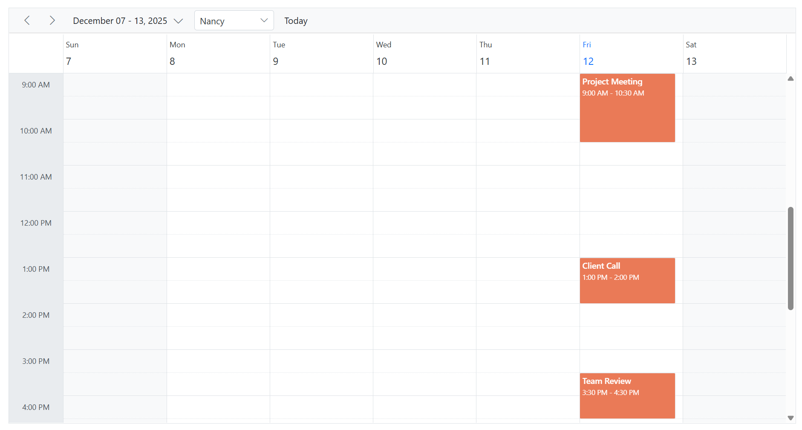

# Customize the Scheduler Toolbar

Syncfusion Blazor Scheduler enables comprehensive toolbar customization to match your application's navigation and filtering requirements. By using the `ScheduleToolBar` component and its child items, you can:

- Integrate built-in navigation controls (Previous, Next, Today, Views).
- Embed custom elements, such as dropdowns and buttons.
- Rearrange, add, or remove toolbar items to streamline user workflows.
- Apply adaptive spacing or separators for a responsive layout.

Use these configuration options to deliver an intuitive and branded scheduling experience.

## Built-in toolbar items

The Scheduler provides the following built-in toolbar components:

| Item                  | Description                                                                                     |
| --------------------- | ----------------------------------------------------------------------------------------------- |
| `ScheduleToolBarPrevious`  | Navigates to the previous date range.                                                           |
| `ScheduleToolBarNext`        | Navigates to the next date range.                                                               |
| `ScheduleToolBarDateRange`   | Displays the current visible date range.                                                        |
| `ScheduleToolBarToday`       | Navigates to today's date.                                                                      |
| `ScheduleToolBarViews` | Renders view-switching buttons for any user-configured views. However, if only a single view is configured, the view-switching buttons will not be rendered. If no views are explicitly configured, the Scheduler renders its default set of built-in views. |
| `ScheduleToolBarNewEvent`    | Renders an "Add" button for creating new appointments. This is visible when `EnableAdaptiveUI` is `true` on desktop or when the Scheduler is rendered on mobile devices. |

## Custom toolbar item

For more advanced scenarios, the `ScheduleToolBarCustom` component allows you to add custom content to the toolbar. It supports different item types through the `Type` property to accommodate various UI elements.

| Type                | Description                                                                           |
| ------------------- | ------------------------------------------------------------------------------------- |
| `ItemType.Button`   | (Default) Renders custom content as a button-style item for clickable actions.        |
| `ItemType.Input`    | Used to embed input controls, such as a `SfDropDownList` or `SfTextBox`, into the toolbar.    |
| `ItemType.Spacer`   | Adds an adaptive space that pushes subsequent items, creating horizontal separation. |
| `ItemType.Separator`| Adds a vertical divider line to visually separate groups of toolbar items.            |

N> When adding input elements such as dropdowns or textboxes within `ScheduleToolBarCustom`, the `Type` property must be set to `ItemType.Input` to ensure proper rendering and interaction behavior.

## Configuring Custom Toolbar

In this comprehensive example, we create a custom toolbar that enhances navigation and adds resource-based filtering within the Blazor Scheduler. The toolbar includes built-in navigation controls (previous/next, date range, and today) along with a custom dropdown for selecting a resource. When the dropdown value changes, the `OnOwnerChange` event updates the `EventQuery` filter, which is bound to both the `ScheduleResource` and the `ScheduleEventSettings`. This dynamic binding ensures the scheduler displays appointments only for the selected resource.

```cshtml
@using Syncfusion.Blazor.Schedule
@using Syncfusion.Blazor.Navigations
@using Syncfusion.Blazor.DropDowns
@using Syncfusion.Blazor.Data

<SfSchedule TValue="AppointmentData" Height="550px" @bind-SelectedDate="@CurrentDate">
    <ScheduleEventSettings Query="@EventQuery" DataSource="@DataSource"></ScheduleEventSettings>
    <ScheduleResources>
        <ScheduleResource TItem="OwnerData" TValue="int[]" Field="OwnerId" Title="Owner" Name="Owners" AllowMultiple="true"
                          DataSource="@OwnerCollections" TextField="OwnerText" IdField="OwnerId" ColorField="Color" Query="@EventQuery">
        </ScheduleResource>
    </ScheduleResources>
    <ScheduleToolBar>
        <ScheduleToolBarPrevious />
        <ScheduleToolBarNext />
        <ScheduleToolBarDateRange />
        <ScheduleToolBarCustom Type="ItemType.Spacer" />
        <ScheduleToolBarCustom Type="ItemType.Input">
            <SfDropDownList TValue="int" TItem="OwnerData" @bind-Value="@SelectedOwner" ShowClearButton="false" Width="125px" DataSource="@OwnerCollections">
                <DropDownListFieldSettings Text="OwnerText" Value="OwnerId"></DropDownListFieldSettings>
                <DropDownListEvents TValue="int" TItem="OwnerData" ValueChange="OnOwnerChange"></DropDownListEvents>
            </SfDropDownList>
        </ScheduleToolBarCustom>
        <ScheduleToolBarCustom Type="ItemType.Spacer" />
        <ScheduleToolBarToday />
    </ScheduleToolBar>
    <ScheduleViews>
        <ScheduleView Option="View.Month"></ScheduleView>
    </ScheduleViews>
</SfSchedule>

@code {
    private DateTime CurrentDate = new DateTime(2025, 12, 10);
    private Query? EventQuery { get; set; }
    private List<OwnerData> OwnerCollections = new List<OwnerData>();
    private List<AppointmentData> DataSource = new List<AppointmentData>();
    private int SelectedOwner = 1;

    protected override void OnInitialized()
    {
        OwnerCollections = new List<OwnerData>
        {
            new OwnerData { OwnerId = 1, OwnerText = "Nancy", Color = "#ea7a57" },
            new OwnerData { OwnerId = 2, OwnerText = "Steven", Color = "#7fa900" },
            new OwnerData { OwnerId = 3, OwnerText = "Michael", Color = "#5978ee" }
        };
        InitializeAppointments();
        EventQuery = new Query().Where("OwnerId", "equal", SelectedOwner);
    }

    private void InitializeAppointments()
    {
        DataSource = new List<AppointmentData>
        {
            new AppointmentData
            {
                Id = 1,
                Subject = "Project Meeting",
                StartTime = new DateTime(2025, 12, 10, 9, 0, 0),
                EndTime = new DateTime(2025, 12, 10, 10, 0, 0),
                OwnerId = 1,
                Description = "Project discussion with Nancy"
            },
            new AppointmentData
            {
                Id = 2,
                Subject = "Design Discussion",
                StartTime = new DateTime(2025, 12, 10, 10, 0, 0),
                EndTime = new DateTime(2025, 12, 10, 11, 00, 0),
                OwnerId = 2,
                Description = "Design review with Steven"
            },
            new AppointmentData
            {
                Id = 3,
                Subject = "Budget Meeting",
                StartTime = new DateTime(2025, 12, 10, 11, 0, 0),
                EndTime = new DateTime(2025, 12, 10, 12, 0, 0),
                OwnerId = 3,
                Description = "Budget discussion with Michael"
            }
        };
    }

    private async void OnOwnerChange(ChangeEventArgs<int, OwnerData> args)
    {
        SelectedOwner = args.Value;
        EventQuery = new Query().Where("OwnerId", "equal", SelectedOwner);
    }

    public class OwnerData
    {
        public int OwnerId { get; set; }
        public string? OwnerText { get; set; }
        public string? Color { get; set; }
    }

    public class AppointmentData
    {
        public int Id { get; set; }
        public string? Subject { get; set; }
        public DateTime StartTime { get; set; }
        public DateTime EndTime { get; set; }
        public string? Description { get; set; }
        public int OwnerId { get; set; }
        public bool IsAllDay { get; set; }
        public string? RecurrenceRule { get; set; }
        public string? RecurrenceException { get; set; }
        public Nullable<int> RecurrenceID { get; set; }
    }
}
```

