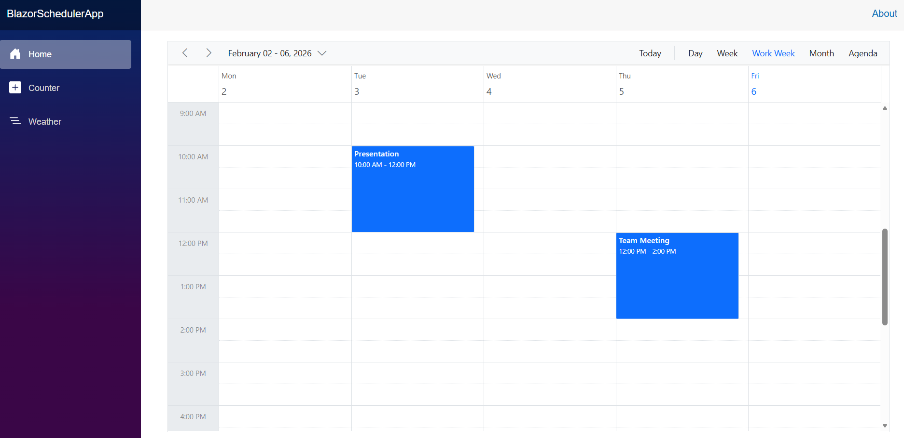
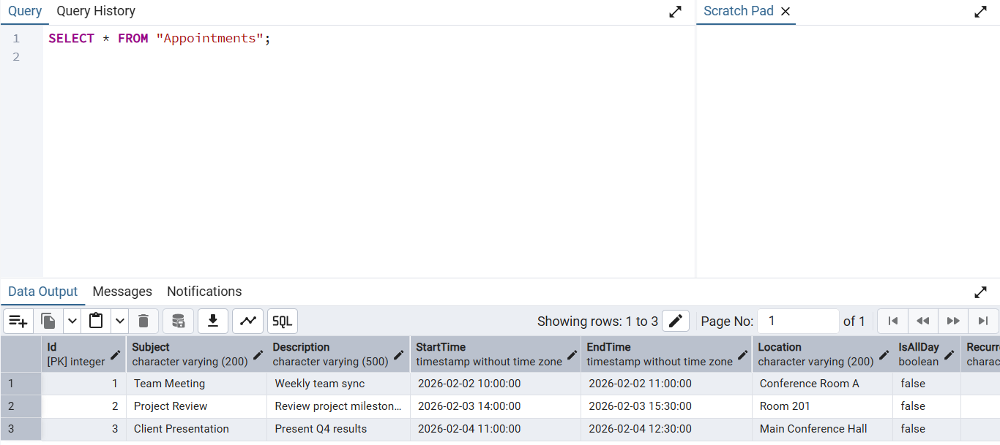

# Connecting PostgreSQL Server data to Syncfusion Blazor Scheduler Component

The Syncfusion<sup style="font-size:70%">&reg;</sup> Blazor Scheduler component supports binding data from a [PostgreSQL](https://www.nuget.org/packages/Npgsql.EntityFrameworkCore.PostgreSQL) Server database using Entity Framework Core. This approach enables seamless integration of appointment data with full CRUD (Create, Read, Update, Delete) functionality.

This documentation explains how to connect and retrieve appointment data from a PostgreSQL Server database using **Npgsql EntityFrameworkCore PostgreSQL** and **Entity Framework Core** and bind the data to a Blazor Scheduler component.

## Prerequisites

Before you begin, ensure you have the following installed:

- **.NET SDK 9.0 or later** 
- **PostgreSQL 14.0 or later** - [Download](https://www.postgresql.org/download/)
- **Visual Studio 2022 (v17.8+) or later** or **Visual Studio Code** with C# extension

> **Note**: Ensure PostgreSQL service is running and you have the username and password ready for database configuration.

## Project Structure

```
BlazorSchedulerApp/
├── Components/
│   ├── Layout/
│   │   ├── MainLayout.razor
│   │   └── NavMenu.razor              # Navigation menu with calendar icon
│   └── Pages/
│       └── Scheduler.razor            # Scheduler component with CRUD operations
├── Data/
│   └── ApplicationDbContext.cs        # EF Core DbContext configuration
├── Migrations/
│   ├── 20260201045445_InitialCreate.cs                # Initial migration
│   ├── 20260201045445_InitialCreate.Designer.cs      # Migration metadata
│   └── ApplicationDbContextModelSnapshot.cs          # Model snapshot
├── Models/
│   └── Appointment.cs                 # Appointment entity model
├── Services/
│   └── AppointmentService.cs          # Business logic for CRUD operations
├── wwwroot/
│   └── app.css                        # Application styles
├── _Imports.razor                     # Global imports
├── App.razor                          # Root component with Syncfusion theme
├── appsettings.json                   # Configuration with connection string
├── Program.cs                         # Application entry point
└── BlazorSchedulerApp.csproj          # Project file with NuGet packages
```

## Binding data from PostgreSQL Server using Entity Framework Core

This section explains how to retrieve appointment data from a PostgreSQL Server database using Entity Framework Core and bind it to the Syncfusion<sup style="font-size:70%">&reg;</sup> Blazor Scheduler component. The following steps demonstrate the actual project creation flow.

### Step 1: Create a Blazor Web App

Create a **Blazor Web App** using Visual Studio 2022 or .NET CLI.

**Using Visual Studio 2022 or later:**
1. Open Visual Studio 2022
2. Click **Create a new project**
3. Search for **Blazor Web App** template
4. Configure project name as **BlazorSchedulerApp**
5. Select **.NET 9.0** as the target framework
6. Set **Interactive render mode** to **Server**
7. Set **Interactivity location** to **Per page/component**
8. Click **Create**

**Using .NET CLI:**
```bash
dotnet new blazor -n BlazorSchedulerApp --interactivity Server
cd BlazorSchedulerApp
```

> Configure the Interactive render mode to **InteractiveServer** during project creation as the Scheduler requires interactivity for CRUD operations.

### Step 2: Install Required NuGet Packages

Install the following NuGet packages using the Package Manager Console or .NET CLI:

**Using Package Manager Console:**
```powershell
Install-Package Syncfusion.Blazor.Schedule
Install-Package Syncfusion.Blazor.Themes
Install-Package Npgsql.EntityFrameworkCore.PostgreSQL
Install-Package Microsoft.EntityFrameworkCore.Design
Install-Package Microsoft.EntityFrameworkCore.Tools
```

**Using .NET CLI:**
```bash
dotnet add package Syncfusion.Blazor.Schedule
dotnet add package Syncfusion.Blazor.Themes
dotnet add package Npgsql.EntityFrameworkCore.PostgreSQL
dotnet add package Microsoft.EntityFrameworkCore.Design
dotnet add package Microsoft.EntityFrameworkCore.Tools
```

> After installing packages, build the project to ensure all dependencies are restored correctly: `dotnet build`

### Step 3: Configure Database Connection String

Before creating models and context, configure the PostgreSQL connection string in `appsettings.json`.



{
  "ConnectionStrings": {
    "DefaultConnection": "Host=localhost;Port=5432;Database=SchedulerEvents;Username=postgres;Password=your_password"
  },
  "Logging": {
    "LogLevel": {
      "Default": "Information",
      "Microsoft.AspNetCore": "Warning"
    }
  },
  "AllowedHosts": "*"
}



**Connection String Parameters:**
- **Host**: PostgreSQL server address (localhost for local development)
- **Port**: PostgreSQL port (default: 5432)
- **Database**: Name of the database to create/use (SchedulerEvents)
- **Username**: PostgreSQL username (default: postgres)
- **Password**: Your PostgreSQL password

> **Important**: Replace `your_password` with your actual PostgreSQL password.

> **Database Creation**: You must create the `SchedulerEvents` database in PostgreSQL before running migrations. Use pgAdmin or psql command line: `CREATE DATABASE "SchedulerEvents";`

### Step 4: Create the Appointment Model

Create a model class to represent scheduler appointments with all required properties.



using System.ComponentModel.DataAnnotations;

namespace BlazorSchedulerApp.Models
{
    public class Appointment
    {
        [Key]
        public int Id { get; set; }

        [StringLength(200)]
        public string Subject { get; set; } = string.Empty;

        [StringLength(500)]
        public string Description { get; set; } = string.Empty;

        [Required]
        public DateTime StartTime { get; set; }

        [Required]
        public DateTime EndTime { get; set; }

        [StringLength(200)]
        public string Location { get; set; } = string.Empty;

        public bool IsAllDay { get; set; }

        [StringLength(50)]
        public string RecurrenceRule { get; set; } = string.Empty;

        public int? RecurrenceID { get; set; }

        public string? RecurrenceException { get; set; }
    }
}



**Key Properties Explanation:**

- **Id**: Primary key for the appointment (auto-generated by database)
- **Subject**: Title of the appointment
- **StartTime/EndTime**: Date and time range for the appointment
- **Location**: Where the appointment takes place
- **IsAllDay**: Flag for all-day events
- **RecurrenceRule**: Rule for recurring appointments (e.g., daily, weekly)
- **RecurrenceID**: Links recurring appointment instances
- **RecurrenceException**: Handles exceptions in recurring series

> **Note**: The `Subject` property does not have the `[Required]` attribute to allow empty titles. The service layer will provide a default value "Add Title" if the subject is empty.

### Step 5: Create the Database Context

Configure Entity Framework Core DbContext with PostgreSQL connection and seed data.



using Microsoft.EntityFrameworkCore;
using BlazorSchedulerApp.Models;

namespace BlazorSchedulerApp.Data
{
    public class ApplicationDbContext : DbContext
    {
        public ApplicationDbContext(DbContextOptions<ApplicationDbContext> options)
            : base(options)
        {
        }

        public DbSet<Appointment> Appointments { get; set; } = null!;

        protected override void OnModelCreating(ModelBuilder modelBuilder)
        {
            base.OnModelCreating(modelBuilder);

            // Configure the Appointment entity
            modelBuilder.Entity<Appointment>(entity =>
            {
                entity.HasKey(e => e.Id);
                entity.Property(e => e.Subject).IsRequired().HasMaxLength(200);
                entity.Property(e => e.Description).HasMaxLength(500);
                entity.Property(e => e.Location).HasMaxLength(200);
                entity.Property(e => e.StartTime).IsRequired();
                entity.Property(e => e.EndTime).IsRequired();
            });

            // Seed initial appointment data (using UTC timestamps for PostgreSQL)
            modelBuilder.Entity<Appointment>().HasData(
                new Appointment
                {
                    Id = 1,
                    Subject = "Team Meeting",
                    Description = "Weekly team sync",
                    StartTime = DateTime.UtcNow.Date.AddDays(1).AddHours(10),
                    EndTime = DateTime.UtcNow.Date.AddDays(1).AddHours(11),
                    Location = "Conference Room A",
                    IsAllDay = false
                },
                new Appointment
                {
                    Id = 2,
                    Subject = "Project Review",
                    Description = "Review project milestones",
                    StartTime = DateTime.UtcNow.Date.AddDays(2).AddHours(14),
                    EndTime = DateTime.UtcNow.Date.AddDays(2).AddHours(15).AddMinutes(30),
                    Location = "Room 201",
                    IsAllDay = false
                },
                new Appointment
                {
                    Id = 3,
                    Subject = "Client Presentation",
                    Description = "Present Q4 results",
                    StartTime = DateTime.UtcNow.Date.AddDays(3).AddHours(11),
                    EndTime = DateTime.UtcNow.Date.AddDays(3).AddHours(12).AddMinutes(30),
                    Location = "Main Conference Hall",
                    IsAllDay = false
                }
            );
        }
    }
}



**DbContext Configuration Highlights:**

- **OnModelCreating**: Configures entity properties, constraints, and seed data
- **Seed Data**: Provides 3 sample appointments for testing
- **UTC Timestamps**: Uses `DateTime.UtcNow` for PostgreSQL compatibility
- **HasData**: Seeds data that will be inserted when migrations are applied

### Step 6: Create the Appointment Service

Implement a service layer to handle all database CRUD operations.



using Microsoft.EntityFrameworkCore;
using BlazorSchedulerApp.Data;
using BlazorSchedulerApp.Models;

namespace BlazorSchedulerApp.Services
{
    public class AppointmentService
    {
        private readonly ApplicationDbContext _context;

        public AppointmentService(ApplicationDbContext context)
        {
            _context = context;
        }

        /// <summary>
        /// Retrieves all appointments from the database
        /// </summary>
        public async Task<List<Appointment>> GetAllAppointmentsAsync()
        {
            try
            {
                return await _context.Appointments.ToListAsync();
            }
            catch (Exception ex)
            {
                Console.WriteLine($"Error getting appointments: {ex.Message}");
                return new List<Appointment>();
            }
        }

        /// <summary>
        /// Retrieves a single appointment by ID
        /// </summary>
        public async Task<Appointment?> GetAppointmentByIdAsync(int id)
        {
            try
            {
                return await _context.Appointments.FindAsync(id);
            }
            catch (Exception ex)
            {
                Console.WriteLine($"Error getting appointment: {ex.Message}");
                return null;
            }
        }

        /// <summary>
        /// Creates a new appointment in the database
        /// </summary>
        public async Task<Appointment> CreateAppointmentAsync(Appointment appointment)
        {
            try
            {
                // Reset Id to 0 to let database generate it
                appointment.Id = 0;
                
                // Provide default subject if empty
                if (string.IsNullOrWhiteSpace(appointment.Subject))
                {
                    appointment.Subject = "Add Title";
                }
                
                _context.Appointments.Add(appointment);
                await _context.SaveChangesAsync();
                return appointment;
            }
            catch (Exception ex)
            {
                Console.WriteLine($"Error creating appointment: {ex.Message}");
                throw;
            }
        }

        /// <summary>
        /// Updates an existing appointment in the database
        /// </summary>
        public async Task<Appointment> UpdateAppointmentAsync(Appointment appointment)
        {
            try
            {
                // Provide default subject if empty
                if (string.IsNullOrWhiteSpace(appointment.Subject))
                {
                    appointment.Subject = "Add Title";
                }
                
                // Detach any existing tracked entity with same Id to avoid tracking conflicts
                var existingEntity = _context.Appointments.Local
                    .FirstOrDefault(e => e.Id == appointment.Id);
                if (existingEntity != null)
                {
                    _context.Entry(existingEntity).State = EntityState.Detached;
                }

                _context.Entry(appointment).State = EntityState.Modified;
                await _context.SaveChangesAsync();
                return appointment;
            }
            catch (Exception ex)
            {
                Console.WriteLine($"Error updating appointment: {ex.Message}");
                throw;
            }
        }

        /// <summary>
        /// Deletes an appointment from the database
        /// </summary>
        public async Task<bool> DeleteAppointmentAsync(int id)
        {
            try
            {
                var appointment = await _context.Appointments.FindAsync(id);
                if (appointment != null)
                {
                    _context.Appointments.Remove(appointment);
                    await _context.SaveChangesAsync();
                    return true;
                }
                return false;
            }
            catch (Exception ex)
            {
                Console.WriteLine($"Error deleting appointment: {ex.Message}");
                return false;
            }
        }
    }
}



**Service Layer Benefits:**

- Encapsulates database logic away from UI components
- Provides error handling and logging
- Allows for easier testing and maintenance
- Handles Entity Framework change tracking issues

**Error Handling in Service:**

Each method includes try-catch blocks to:
- Log errors to console for debugging
- Prevent application crashes
- Return safe default values (empty list, null, false)

### Step 7: Configure Application Services and Middleware

Update `Program.cs` to register services and configure the PostgreSQL connection.



using BlazorSchedulerApp.Components;
using BlazorSchedulerApp.Data;
using BlazorSchedulerApp.Services;
using Microsoft.EntityFrameworkCore;
using Syncfusion.Blazor;

// Configure AppContext to handle DateTime timestamps for PostgreSQL
// This prevents double UTC conversion issues
AppContext.SetSwitch("Npgsql.EnableLegacyTimestampBehavior", true);

var builder = WebApplication.CreateBuilder(args);

// Add services to the container
builder.Services.AddRazorComponents()
    .AddInteractiveServerComponents();

// Register Syncfusion Blazor service
builder.Services.AddSyncfusionBlazor();

// Configure PostgreSQL DbContext
builder.Services.AddDbContext<ApplicationDbContext>(options =>
    options.UseNpgsql(builder.Configuration.GetConnectionString("DefaultConnection")));

// Register Application Services
builder.Services.AddScoped<AppointmentService>();

var app = builder.Build();

// Configure the HTTP request pipeline
if (!app.Environment.IsDevelopment())
{
    app.UseExceptionHandler("/Error", createScopeForErrors: true);
    app.UseHsts();
}

app.UseHttpsRedirection();
app.UseAntiforgery();

app.MapStaticAssets();
app.MapRazorComponents<App>()
    .AddInteractiveServerRenderMode();

app.Run();



**Important Configuration Notes:**

- **EnableLegacyTimestampBehavior**: Prevents PostgreSQL from automatically converting DateTime to UTC, avoiding timezone offset issues
- **AddScoped**: Creates a new service instance per user session, suitable for database operations
- **UseNpgsql**: Configures Entity Framework to use PostgreSQL provider


### Step 8: Register Syncfusion Namespaces

Add required namespaces in `_Imports.razor`:




@using System.Net.Http
@using System.Net.Http.Json
@using Microsoft.AspNetCore.Components.Forms
@using Microsoft.AspNetCore.Components.Routing
@using Microsoft.AspNetCore.Components.Web
@using static Microsoft.AspNetCore.Components.Web.RenderMode
@using Microsoft.AspNetCore.Components.Web.Virtualization
@using Microsoft.JSInterop
@using BlazorSchedulerApp
@using BlazorSchedulerApp.Components
@using BlazorSchedulerApp.Models
@using BlazorSchedulerApp.Services
@using Syncfusion.Blazor
@using Syncfusion.Blazor.Schedule



> **Note**: These namespaces make Syncfusion components and your models available throughout the application without needing to add `@using` directives in every file.

### Step 9: Add Syncfusion Theme and Bootstrap Icons

Update `App.razor` to include Syncfusion theme CSS and scripts.



<!DOCTYPE html>
<html lang="en">

<head>
    <meta charset="utf-8" />
    <meta name="viewport" content="width=device-width, initial-scale=1.0" />
    <base href="/" />
    <ResourcePreloader />
    <link rel="stylesheet" href="@Assets["lib/bootstrap/dist/css/bootstrap.min.css"]" />
    <link rel="stylesheet" href="https://cdn.jsdelivr.net/npm/bootstrap-icons@1.11.3/font/bootstrap-icons.min.css" />
    <link rel="stylesheet" href="@Assets["app.css"]" />
    <link rel="stylesheet" href="@Assets["BlazorSchedulerApp.styles.css"]" />
    <link href="_content/Syncfusion.Blazor.Themes/bootstrap5.3.css" rel="stylesheet" />
    <ImportMap />
    <link rel="icon" type="image/png" href="favicon.png" />
    <HeadOutlet />
</head>

<body>
    <Routes />
    <ReconnectModal />
    <script src="@Assets["_framework/blazor.web.js"]"></script>
    <script src="_content/Syncfusion.Blazor.Core/scripts/syncfusion-blazor.min.js" type="text/javascript"></script>
</body>

</html>



**Theme Options:**

- `bootstrap5.3.css` - Bootstrap 5.3 theme (used in this example)
- `material3.css` - Material Design 3 theme
- `fluent.css` - Microsoft Fluent Design theme
- `tailwind.css` - Tailwind CSS theme

**Bootstrap Icons:**

The line `<link rel="stylesheet" href="https://cdn.jsdelivr.net/npm/bootstrap-icons@1.11.3/font/bootstrap-icons.min.css" />` is added to display icons in the navigation menu, including the calendar icon for the Scheduler page.

**Critical: Syncfusion JavaScript File**

The line `<script src="_content/Syncfusion.Blazor.Core/scripts/syncfusion-blazor.min.js" type="text/javascript"></script>` is **REQUIRED** for Syncfusion components to work with InteractiveServer render mode. Without this script:
- You'll see errors like `"Could not find 'sfBlazor.Toolbar.initialize' ('sfBlazor' was undefined)"`
- Components will fail to initialize and throw JavaScript interop exceptions
- The Scheduler will not render properly

This script enables the JavaScript interop layer that Syncfusion components need for client-side functionality.

### Step 10: Create the Scheduler Component

Create the Blazor Scheduler component with full CRUD functionality.




@page "/scheduler"
@using BlazorSchedulerApp.Models
@using BlazorSchedulerApp.Services
@rendermode InteractiveServer
@inject AppointmentService AppointmentService

<PageTitle>Appointment Scheduler</PageTitle>

<div class="container-fluid">
    <div class="row">
        <div class="col-12">
            @if (appointments == null)
            {
                <div class="text-center">
                    <div class="spinner-border text-primary" role="status">
                        <span class="visually-hidden">Loading...</span>
                    </div>
                    <p>Loading appointments...</p>
                </div>
            }
            else
            {
                <SfSchedule TValue="Appointment" 
                           @ref="scheduleRef"
                           Height="650px" 
                           @bind-SelectedDate="@currentDate"
                           @bind-CurrentView="@currentView"
                           ShowQuickInfo="true">
                    
                    <ScheduleViews>
                        <ScheduleView Option="View.Day"></ScheduleView>
                        <ScheduleView Option="View.Week"></ScheduleView>
                        <ScheduleView Option="View.WorkWeek"></ScheduleView>
                        <ScheduleView Option="View.Month"></ScheduleView>
                        <ScheduleView Option="View.Agenda"></ScheduleView>
                    </ScheduleViews>
                    
                    <ScheduleEventSettings TValue="Appointment" 
                                          DataSource="@appointments"
                                          AllowAdding="true"
                                          AllowEditing="true"
                                          AllowDeleting="true">
                    </ScheduleEventSettings>
                    
                    <ScheduleEvents TValue="Appointment"
                                   OnActionBegin="OnActionBegin"
                                   ActionCompleted="OnActionCompleted">
                    </ScheduleEvents>
                </SfSchedule>
            }
        </div>
    </div>
</div>

@code {
    private SfSchedule<Appointment>? scheduleRef;
    private List<Appointment> appointments = new List<Appointment>();
    private DateTime currentDate = DateTime.Today;
    private View currentView = View.Week;

    protected override async Task OnInitializedAsync()
    {
        await LoadAppointments();
    }

    private async Task LoadAppointments()
    {
        try
        {
            appointments = await AppointmentService.GetAllAppointmentsAsync();
        }
        catch (Exception ex)
        {
            Console.WriteLine($"Error loading appointments: {ex.Message}");
            appointments = new List<Appointment>();
        }
    }

    private async Task OnActionBegin(ActionEventArgs<Appointment> args)
    {
        // Only cancel CRUD operations, allow navigation operations to proceed
        if (args.ActionType == ActionType.EventCreate || 
            args.ActionType == ActionType.EventChange || 
            args.ActionType == ActionType.EventRemove)
        {
            args.Cancel = true;
        }
        
        try
        {
            if (args.ActionType == ActionType.EventCreate)
            {
                if (args.AddedRecords != null && args.AddedRecords.Count > 0)
                {
                    foreach (var appointment in args.AddedRecords)
                    {
                        var created = await AppointmentService.CreateAppointmentAsync(appointment);
                        appointments.Add(created);
                    }
                }
                
                if (scheduleRef != null)
                {
                    await scheduleRef.RefreshAsync();
                }
            }
            else if (args.ActionType == ActionType.EventChange)
            {
                if (args.ChangedRecords != null && args.ChangedRecords.Count > 0)
                {
                    foreach (var appointment in args.ChangedRecords)
                    {
                        await AppointmentService.UpdateAppointmentAsync(appointment);
                        
                        var existingIndex = appointments.FindIndex(a => a.Id == appointment.Id);
                        if (existingIndex >= 0)
                        {
                            appointments[existingIndex] = appointment;
                        }
                    }
                }
                
                if (scheduleRef != null)
                {
                    await scheduleRef.RefreshAsync();
                }
            }
            else if (args.ActionType == ActionType.EventRemove)
            {
                if (args.DeletedRecords != null && args.DeletedRecords.Count > 0)
                {
                    foreach (var appointment in args.DeletedRecords)
                    {
                        await AppointmentService.DeleteAppointmentAsync(appointment.Id);
                        appointments.RemoveAll(a => a.Id == appointment.Id);
                    }
                }
                
                if (scheduleRef != null)
                {
                    await scheduleRef.RefreshAsync();
                }
            }
        }
        catch (Exception ex)
        {
            Console.WriteLine($"Error in OnActionBegin: {ex.Message}");
        }
    }

    private async Task OnActionCompleted(ActionEventArgs<Appointment> args)
    {
        Console.WriteLine($"Action Completed: {args.ActionType}");
    }
}



**Key Implementation Details:**

- **args.Cancel = true**: Prevents Syncfusion's default data handling, allowing custom database operations
- **Selective Cancellation**: Only CRUD operations are canceled; navigation (ViewNavigate, DateNavigate) works normally
- **RefreshAsync()**: Updates the scheduler UI after database changes
- **Manual List Management**: Keeps the in-memory list synchronized with database changes

**Why Cancel Syncfusion's Default Behavior?**

By setting `args.Cancel = true`, we prevent Syncfusion from managing the data internally. This allows us to:
1. Control exactly when and how data is saved to the database
2. Add custom validation and business logic
3. Handle errors gracefully
4. Keep the in-memory list synchronized with the database

### Step 11: Update Navigation Menu

Add a navigation link to the Scheduler page with a calendar icon.

**Update NavMenu.razor**

Open `Components/Layout/NavMenu.razor` and locate the `<nav class="flex-column">` element that contains the existing navigation items (Home, Weather, Counter, etc.). Add the following navigation item **after the last existing `<div class="nav-item px-3">` block** and **before the closing `</nav>` tag**:



        ...existing navigation items...

        <div class="nav-item px-3">
            <NavLink class="nav-link" href="scheduler">
                <span class="bi bi-calendar-check-fill-nav-menu" aria-hidden="true"></span> Scheduler
            </NavLink>
        </div>
    </nav>
</div>



**Expected Result**: The Scheduler link will appear as the last item in your navigation menu, with a calendar icon displayed next to the text.

**Update NavMenu.razor.css**

Open `Components/Layout/NavMenu.razor.css` and **append the following CSS at the end of the file** to ensure the calendar icon displays correctly:




/* Calendar icon for Scheduler navigation */
.bi-calendar-check-fill-nav-menu {
    background-image: url("data:image/svg+xml,%3Csvg xmlns='http://www.w3.org/2000/svg' width='16' height='16' fill='white' class='bi bi-calendar-check-fill' viewBox='0 0 16 16'%3E%3Cpath d='M4 .5a.5.5 0 0 0-1 0V1H2a2 2 0 0 0-2 2v1h16V3a2 2 0 0 0-2-2h-1V.5a.5.5 0 0 0-1 0V1H4V.5zM16 14V5H0v9a2 2 0 0 0 2 2h12a2 2 0 0 0 2-2zm-5.146-5.146-3 3a.5.5 0 0 1-.708 0l-1.5-1.5a.5.5 0 0 1 .708-.708L7.5 10.793l2.646-2.647a.5.5 0 0 1 .708.708z'/%3E%3C/svg%3E");
}



> **Note**: The CSS uses an inline SVG data URI to display the Bootstrap calendar-check icon. This approach ensures the icon works without additional dependencies beyond the Bootstrap Icons CSS already included in `App.razor`.

### Step 12: Create and Apply Database Migrations

Now that all the code is in place, generate Entity Framework Core migrations to create the database schema.

**Create the PostgreSQL Database**

Before creating migrations, ensure the PostgreSQL database `SchedulerEvents` exists. Create it using one of the following methods:

**Using pgAdmin:**
1. Open pgAdmin
2. Right-click on **Databases**
3. Select **Create > Database**
4. Name it **SchedulerEvents**
5. Click **Save**

**Using psql command line:**
```bash
psql -U postgres
CREATE DATABASE "SchedulerEvents";
\q
```

**Generate the Migration**

Open a terminal in the project directory and run:

```bash
cd BlazorSchedulerApp
dotnet ef migrations add InitialCreate
```

This creates three files in the `Migrations/` folder:
- `<timestamp>_InitialCreate.cs` - Contains Up() and Down() methods for schema changes
- `<timestamp>_InitialCreate.Designer.cs` - Migration metadata
- `ApplicationDbContextModelSnapshot.cs` - Current model state snapshot

> **Note**: The `<timestamp>` is automatically generated by EF Core based on the current date and time (e.g., `20260201045445`). Your files will have a different timestamp.

**What gets created in the migration:**
- CREATE TABLE statement for Appointments table
- INSERT statements for 3 seed appointments
- Column definitions with data types, constraints, and nullability

**Apply the Migration to Database**

Apply the migration to create tables and insert seed data:

```bash
dotnet ef database update
```

**What happens during update:**
1. Connects to PostgreSQL using connection string from appsettings.json
2. Creates `__EFMigrationsHistory` table (if it doesn't exist) to track applied migrations
3. Executes the Up() method from InitialCreate migration
4. Creates `Appointments` table with all columns and constraints
5. Inserts 3 seed appointments
6. Records the migration in `__EFMigrationsHistory`

**Expected Output:**
```
Build started...
Build succeeded.
fail: Microsoft.EntityFrameworkCore.Database.Command[20102]
      Failed executing DbCommand (15ms) [...]
      SELECT "MigrationId", "ProductVersion"
      FROM "__EFMigrationsHistory"
```

> **Note**: The "Failed executing DbCommand" message is **NORMAL on first run**. It simply means the `__EFMigrationsHistory` table doesn't exist yet. EF Core will create it automatically and then apply the migration successfully.

**Verify Migration Success:**

Check that the migration completed successfully by looking for:
```
info: Microsoft.EntityFrameworkCore.Migrations[20402]
      Applying migration '<timestamp>_InitialCreate'.
Done.
```

You can verify the database structure using pgAdmin or psql:
```bash
psql -U postgres -d SchedulerEvents -c "\dt"
psql -U postgres -d SchedulerEvents -c "SELECT * FROM \"Appointments\";"
```

### Step 13: Build and Run the Application

With migrations applied and the database populated with seed data, you're ready to run the application.

**Build the Application**

Ensure there are no compilation errors:

```bash
dotnet build
```

**Run the Application**

Start the application:

```bash
dotnet run
```

Or use watch mode for automatic reload during development:

```bash
dotnet watch
```

**Access the Scheduler**

The application will start on a port configured in `launchSettings.json` (typically `http://localhost:5xxx`).

Open your browser and navigate to the Scheduler page:
```
http://localhost:<port>/scheduler
```

> **Note**: Replace `<port>` with the actual port number shown in the terminal output when the application starts (e.g., `http://localhost:5138/scheduler`).

You can perform CRUD operations on the scheduler that will be reflected in the PostgreSQL database table.


## Output Preview

The following screenshots demonstrate the completed application:


*Image illustrating the Syncfusion Blazor Scheduler*


*Image illustrating the events of Syncfusion Blazor Scheduler in PostgreSQL*

## Troubleshooting

### JavaScript Interop Errors

**Error**: `Could not find 'sfBlazor.Toolbar.initialize'` or `'sfBlazor' was undefined`

**Solution**: Add Syncfusion JavaScript file in `App.razor` before closing `</body>` tag:
```html
<script src="_content/Syncfusion.Blazor.Core/scripts/syncfusion-blazor.min.js" type="text/javascript"></script>
```

### Database Connection Failed

**Error**: Cannot connect to PostgreSQL database

**Solutions**:
- Verify PostgreSQL service is running (`pg_ctl status`)
- Check connection string in `appsettings.json`
- Ensure `SchedulerEvents` database exists
- Confirm username and password are correct

### Migration Errors

**Error**: `dotnet ef database update` fails

**Solutions**:
- Ensure PostgreSQL is running and database exists
- Verify user has CREATE TABLE permissions
- Check password in connection string
- If corrupted, delete `Migrations` folder and run: `dotnet ef migrations add InitialCreate`

> **Note**: The error `relation "__EFMigrationsHistory" does not exist` on first run is normal.

### Timezone Issues

**Error**: Appointment times are incorrect (offset by several hours)

**Solution**: Add this line at the top of `Program.cs`:
```csharp
AppContext.SetSwitch("Npgsql.EnableLegacyTimestampBehavior", true);
```

### Scheduler Navigation Not Working

**Error**: View switching or date navigation buttons don't respond

**Solution**: In `OnActionBegin`, only cancel CRUD operations:
```csharp
if (args.ActionType == ActionType.EventCreate || 
    args.ActionType == ActionType.EventChange || 
    args.ActionType == ActionType.EventRemove)
{
    args.Cancel = true;
}
```

### Appointments Not Persisting

**Error**: Appointments disappear after page refresh

**Solutions**:
- Check browser console (F12) for JavaScript errors
- Verify `OnActionBegin` calls service methods correctly
- Ensure `RefreshAsync()` is called after operations
- Check PostgreSQL logs for SQL errors

To learn more about the functionality of the Schedule component, refer to the [documentation](https://blazor.syncfusion.com/documentation/scheduler/getting-started).

> [View the PostgreSQL with Schedule sample in the GitHub repository]().