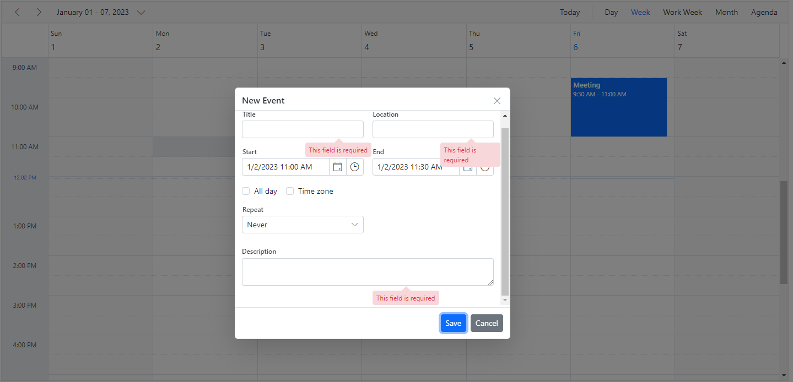

# Editor Window Customization in Blazor Scheduler Component

The Scheduler utilizes popups and dialogs for notifications and includes an editor window with event fields to facilitate appointment creation and editing. The editor window and its fields can be customized, and validations can be applied to these fields.

## Event Editor

The editor window usually opens on the Scheduler, when a The editor window typically opens in the Scheduler when a cell or event is double-clicked. Double-clicking a cell opens the detailed editor window in "Add new" mode, while double-clicking an existing event opens it in "Edit" mode.

On mobile devices, the detailed editor window can be opened in edit mode by tapping the edit icon on the popup that appears after a single tap on an event. The editor window can also be opened in add mode by single-tapping a cell, which displays a `+` indication; tapping it again opens the editor window.

N> The editor window can be prevented from opening, by rendering Scheduler in a [`Readonly`](https://help.syncfusion.com/cr/blazor/Syncfusion.Blazor.Schedule.SfSchedule-1.html#Syncfusion_Blazor_Schedule_SfSchedule_1_Readonly) mode or by doing code customization within the [`OnPopupOpen`](https://help.syncfusion.com/cr/blazor/Syncfusion.Blazor.Schedule.ScheduleEvents-1.html#Syncfusion_Blazor_Schedule_ScheduleEvents_1_OnPopupOpen) event.

### How to change the editor window header title and text of footer buttons

The header title and the text of buttons displayed at the footer of the editor window can be changed by modifying the appropriate localized word collection in the `.resx` file for the specific culture. This file is typically located in the `Project root folder > Resources > SfResources-en-US.resx` directory.

The following image illustrates the customization of localized words in the resx file.


After changing the localized words, the editor window for creating new events will appear as shown in the following image.


### How to Change the Label Text of Default Editor Fields

To change the default labels for fields such as "Title," "Location," and other field names in the editor window, utilize the `Title` property available within the field option of `ScheduleEventSettings`.

```cshtml
@using Syncfusion.Blazor.Schedule

<SfSchedule TValue="AppointmentData" Height="550px" @bind-SelectedDate="@CurrentDate">
    <ScheduleEventSettings DataSource="@DataSource">
        <ScheduleField>
            <FieldSubject Title="Travel Summary"></FieldSubject>
            <FieldLocation Title="Source"></FieldLocation>
            <FieldDescription Title="Comments"></FieldDescription>
            <FieldIsAllDay Title="Full Day"></FieldIsAllDay>
            <FieldStartTime Title="Departure Time"></FieldStartTime>
            <FieldEndTime Title="Arrival Time"></FieldEndTime>
            <FieldStartTimezone Title="Origin"></FieldStartTimezone>
            <FieldEndTimezone Title="Destination"></FieldEndTimezone>
        </ScheduleField>
    </ScheduleEventSettings>
    <ScheduleViews>
        <ScheduleView Option="View.Day"></ScheduleView>
        <ScheduleView Option="View.Week"></ScheduleView>
        <ScheduleView Option="View.WorkWeek"></ScheduleView>
        <ScheduleView Option="View.Month"></ScheduleView>
        <ScheduleView Option="View.Agenda"></ScheduleView>
    </ScheduleViews>
</SfSchedule>

@code{
    DateTime CurrentDate = new DateTime(2023, 1, 31);
    List<AppointmentData> DataSource = new List<AppointmentData>
    {
        new AppointmentData { Id = 1, Subject = "Meeting", StartTime = new DateTime(2023, 1, 31, 9, 30, 0) , EndTime = new DateTime(2023, 1, 31, 11, 0, 0) }
    };
    public class AppointmentData
    {
        public int Id { get; set; }
        public string Subject { get; set; }
        public DateTime StartTime { get; set; }
        public DateTime EndTime { get; set; }
        public bool IsAllDay { get; set; }
        public string RecurrenceRule { get; set; }
        public Nullable<int> RecurrenceID { get; set; }
        public string RecurrenceException { get; set; }
    }
}
```



### Field Validation

It is possible to validate the required fields of the editor window before submission by adding appropriate validation rules to each field. The following code example demonstrates applying validations to the Subject, Location, and Description fields.

```cshtml
@using Syncfusion.Blazor.Schedule

<SfSchedule TValue="AppointmentData" Height="550px" @bind-SelectedDate="@CurrentDate">
    <ScheduleEventSettings DataSource="@DataSource">
        <ScheduleField>
            <FieldSubject Name="Subject" Validation="@ValidationRules"></FieldSubject>
            <FieldLocation Name="Location" Validation="@LocationValidationRules"></FieldLocation>
            <FieldDescription Name="Description" Validation="@DescriptionValidationRules"></FieldDescription>
            <FieldStartTime Name="StartTime"></FieldStartTime>
            <FieldEndTime Name="EndTime"></FieldEndTime>
        </ScheduleField>
    </ScheduleEventSettings>
    <ScheduleViews>
        <ScheduleView Option="View.Day"></ScheduleView>
        <ScheduleView Option="View.Week"></ScheduleView>
        <ScheduleView Option="View.WorkWeek"></ScheduleView>
        <ScheduleView Option="View.Month"></ScheduleView>
        <ScheduleView Option="View.Agenda"></ScheduleView>
    </ScheduleViews>
</SfSchedule>

@code{
    DateTime CurrentDate = new DateTime(2023, 1, 6);
    static Dictionary<string, object> ValidationMessages = new Dictionary<string, object>() { { "regex", "Special character(s) not allowed in this field" } };
    ValidationRules ValidationRules = new ValidationRules { Required = true };
    ValidationRules LocationValidationRules = new ValidationRules { Required = true, RegexPattern = "^[a-zA-Z0-9- ]*$", Messages = ValidationMessages };
    ValidationRules DescriptionValidationRules = new ValidationRules { Required = true, MinLength = 5, MaxLength = 500 };
    List<AppointmentData> DataSource = new List<AppointmentData>
    {
        new AppointmentData { Id = 1, Subject = "Meeting", StartTime = new DateTime(2023, 1, 6, 9, 30, 0) , EndTime = new DateTime(2023, 1, 6, 11, 0, 0) }
    };

    public class AppointmentData
    {
        public int Id { get; set; }
        public string Subject { get; set; }
        public DateTime StartTime { get; set; }
        public DateTime EndTime { get; set; }
        public bool IsAllDay { get; set; }
        public string RecurrenceRule { get; set; }
        public string RecurrenceException { get; set; }
        public Nullable<int> RecurrenceID { get; set; }
    }
}
```




### Customizing the Default Time Duration in Editor Window

In default event editor window, start and end time duration are processed based on the [`Interval`](https://help.syncfusion.com/cr/blazor/Syncfusion.Blazor.Schedule.ScheduleTimeScale.html#Syncfusion_Blazor_Schedule_ScheduleTimeScale_Interval) value set within the [`ScheduleTimeScale`](https://help.syncfusion.com/cr/blazor/Syncfusion.Blazor.Schedule.ScheduleTimeScale.html) property. By default, [`Interval`](https://help.syncfusion.com/cr/blazor/Syncfusion.Blazor.Schedule.ScheduleTimeScale.html#Syncfusion_Blazor_Schedule_ScheduleTimeScale_Interval) value is set to 30, and therefore the start and end time duration within the event editor will be in a 30 minutes time difference. This duration value can be changed by changing the [`Duration`](https://help.syncfusion.com/cr/blazor/Syncfusion.Blazor.Schedule.PopupOpenEventArgs-1.html#Syncfusion_Blazor_Schedule_PopupOpenEventArgs_1_Duration) option within the [`OnPopupOpen`](https://help.syncfusion.com/cr/blazor/Syncfusion.Blazor.Schedule.ScheduleEvents-1.html#Syncfusion_Blazor_Schedule_ScheduleEvents_1_OnPopupOpen) event.

```cshtml
@using Syncfusion.Blazor.Schedule

<SfSchedule TValue="AppointmentData" Height="550px" @bind-SelectedDate="@CurrentDate">
    <ScheduleEvents TValue="AppointmentData" OnPopupOpen="@OnPopupOpen"></ScheduleEvents>
    <ScheduleEventSettings DataSource="@DataSource">
    </ScheduleEventSettings>
    <ScheduleViews>
        <ScheduleView Option="View.Day"></ScheduleView>
        <ScheduleView Option="View.Week"></ScheduleView>
        <ScheduleView Option="View.WorkWeek"></ScheduleView>
        <ScheduleView Option="View.Month"></ScheduleView>
        <ScheduleView Option="View.Agenda"></ScheduleView>
    </ScheduleViews>
</SfSchedule>

@code{
    DateTime CurrentDate = new DateTime(2020, 1, 31);
    public void OnPopupOpen(PopupOpenEventArgs<AppointmentData> args)
    {
        if (args.Type == PopupType.Editor)
        {
            args.Duration = 60;
        }
    }
    List<AppointmentData> DataSource = new List<AppointmentData>
    {
        new AppointmentData { Id = 1, Subject = "Meeting", StartTime = new DateTime(2020, 1, 31, 9, 30, 0) , EndTime = new DateTime(2020, 1, 31, 11, 0, 0) }
    };
    public class AppointmentData
    {
        public int Id { get; set; }
        public string Subject { get; set; }
        public DateTime StartTime { get; set; }
        public DateTime EndTime { get; set; }
        public bool IsAllDay { get; set; }
        public string RecurrenceRule { get; set; }
        public Nullable<int> RecurrenceID { get; set; }
        public string RecurrenceException { get; set; }
    }
}
```


### How to Prevent the Display of Editor and Quick Popups

It is possible to prevent the display of editor and quick popup windows by passing the value `true` to `cancel` option within the [`OnPopupOpen`](https://help.syncfusion.com/cr/blazor/Syncfusion.Blazor.Schedule.ScheduleEvents-1.html#Syncfusion_Blazor_Schedule_ScheduleEvents_1_OnPopupOpen) event.

```cshtml
@using Syncfusion.Blazor.Schedule

<SfSchedule TValue="AppointmentData" Height="550px" @bind-SelectedDate="@CurrentDate">
    <ScheduleEvents TValue="AppointmentData" OnPopupOpen="@OnPopupOpen"></ScheduleEvents>
    <ScheduleEventSettings DataSource="@DataSource">
    </ScheduleEventSettings>
    <ScheduleViews>
        <ScheduleView Option="View.Day"></ScheduleView>
        <ScheduleView Option="View.Week"></ScheduleView>
        <ScheduleView Option="View.WorkWeek"></ScheduleView>
        <ScheduleView Option="View.Month"></ScheduleView>
        <ScheduleView Option="View.Agenda"></ScheduleView>
    </ScheduleViews>
</SfSchedule>

@code{
    private DateTime CurrentDate = new DateTime(2020, 1, 31);
    public void OnPopupOpen(PopupOpenEventArgs<AppointmentData> args)
    {
        if (args.Type == PopupType.Editor || args.Type == PopupType.QuickInfo)
        {
            args.Cancel = true;
        }
    }
    List<AppointmentData> DataSource = new List<AppointmentData>
    {
        new AppointmentData { Id = 1, Subject = "Meeting", StartTime = new DateTime(2020, 1, 31, 9, 30, 0) , EndTime = new DateTime(2020, 1, 31, 11, 0, 0) }
    };
    public class AppointmentData
    {
        public int Id { get; set; }
        public string Subject { get; set; }
        public DateTime StartTime { get; set; }
        public DateTime EndTime { get; set; }
        public bool IsAllDay { get; set; }
        public string RecurrenceRule { get; set; }
        public Nullable<int> RecurrenceID { get; set; }
        public string RecurrenceException { get; set; }
    }
}
```


In case, in order to prevent only specific popups on Scheduler, check the condition based on the popup type. The types of the popup that can be checked within the [`OnPopupOpen`](https://help.syncfusion.com/cr/blazor/Syncfusion.Blazor.Schedule.ScheduleEvents-1.html#Syncfusion_Blazor_Schedule_ScheduleEvents_1_OnPopupOpen) event are as follows.

| Type | Description |
|------|-------------|
| `Editor` | For Detailed editor window.|
| `QuickInfo` | For Quick popup which opens on cell click.|
| `EditEventInfo` |For  Quick popup which opens on event click.|
| `ViewEventInfo` | For Quick popup which opens on responsive mode.|
| `EventContainer` | For more event indicator popup.|
| `RecurrenceAlert` | For edit recurrence event alert popup.|
| `DeleteAlert` | For delete confirmation popup.|
| `ValidationAlert` | For validation alert popup.|
| `RecurrenceValidationAlert` | For recurrence validation alert popup.|

### How to Open Editor Window Manually

The editor window can be opened manually for a specific time or certain events by using the [`OpenEditorAsync`](https://help.syncfusion.com/cr/blazor/Syncfusion.Blazor.Schedule.SfSchedule-1.html#Syncfusion_Blazor_Schedule_SfSchedule_1_OpenEditorAsync__0_Syncfusion_Blazor_Schedule_CurrentAction_) method which allows the [TValue](https://help.syncfusion.com/cr/blazor/Syncfusion.Blazor.Schedule.SfSchedule-1.html#Syncfusion_Blazor_Schedule_SfSchedule_1_OpenEditor__0_Syncfusion_Blazor_Schedule_CurrentAction_) or [CellClickEventArgs](https://help.syncfusion.com/cr/blazor/Syncfusion.Blazor.Schedule.CellClickEventArgs.html) and `CurrentAction` as parameters.

N> [Here](https://blazor.syncfusion.com/documentation/scheduler/how-to/open-editor-window-on-single-click) is the example to open the editor window on a single click.

## Customizing Event Editor using Template

The event editor window can be customized using the [`EditorTemplate`](https://help.syncfusion.com/cr/blazor/Syncfusion.Blazor.Schedule.ScheduleTemplates.html#Syncfusion_Blazor_Schedule_ScheduleTemplates_EditorTemplate) option. Each field defined within the template must use two-way binding for the `Value` property of its components to perform CRUD operations.

For a quick start on customizing the editor window using templates, refer to this video:



```cshtml
@using Syncfusion.Blazor.Schedule
@using Syncfusion.Blazor.Calendars
@using Syncfusion.Blazor.DropDowns
@using Syncfusion.Blazor.Inputs

<SfSchedule TValue="AppointmentData" Width="100%" Height="650px" @bind-SelectedDate="@CurrentDate">
    <ScheduleTemplates>
        <EditorTemplate>
            <table class="custom-event-editor" width="100%" cellpadding="5">
                <tbody>
                    <tr>
                        <td class="e-textlabel">Summary</td>
                        <td colspan="4">
                            <SfTextBox @bind-Value="@((context as AppointmentData).Subject)"></SfTextBox>
                        </td>
                    </tr>
                    <tr>
                        <td class="e-textlabel">Status</td>
                        <td colspan="4">
                            <SfDropDownList ID="EventType" DataSource="@StatusData" Placeholder="Choose status" @bind-Value="@((context as AppointmentData).EventType)">
                                <DropDownListFieldSettings Value="Id"></DropDownListFieldSettings>
                            </SfDropDownList>
                        </td>
                    </tr>
                    <tr>
                        <td class="e-textlabel">From</td>
                        <td colspan="4">
                            <SfDateTimePicker @bind-Value="@((context as AppointmentData).StartTime)"></SfDateTimePicker>
                        </td>
                    </tr>
                    <tr>
                        <td class="e-textlabel">To</td>
                        <td colspan="4">
                            <SfDateTimePicker @bind-Value="@((context as AppointmentData).EndTime)"></SfDateTimePicker>
                        </td>
                    </tr>
                    <tr>
                        <td class="e-textlabel">Reason</td>
                        <td colspan="4">
                            <SfTextBox Multiline="true" @bind-Value="@((context as AppointmentData).Description)"></SfTextBox>
                        </td>
                    </tr>
                </tbody>
            </table>
        </EditorTemplate>
    </ScheduleTemplates>
    <ScheduleEventSettings DataSource="@DataSource"></ScheduleEventSettings>
    <ScheduleViews>
        <ScheduleView Option="View.Day"></ScheduleView>
        <ScheduleView Option="View.Week"></ScheduleView>
        <ScheduleView Option="View.WorkWeek"></ScheduleView>
        <ScheduleView Option="View.Month"></ScheduleView>
        <ScheduleView Option="View.Agenda"></ScheduleView>
    </ScheduleViews>
</SfSchedule>

@code{
    DateTime CurrentDate = new DateTime(2020, 1, 31);
    public class DDFields
    {
        public string Id { get; set; }
        public string Text { get; set; }
    }
    List<DDFields> StatusData = new List<DDFields>() {
        new DDFields(){ Id= "New", Text= "New" },
        new DDFields(){ Id= "Requested", Text= "Requested" },
        new DDFields(){ Id= "Confirmed", Text= "Confirmed" },
    };

    List<AppointmentData> DataSource = new List<AppointmentData>
    {
    new AppointmentData { Id = 1, Subject = "Meeting", StartTime = new DateTime(2020, 1, 31, 9, 30, 0) , EndTime = new DateTime(2020, 1, 31, 11, 0, 0), EventType = "Confirmed" }
    };
    public class AppointmentData
    {
        public int Id { get; set; }
        public string Subject { get; set; }
        public DateTime StartTime { get; set; }
        public DateTime EndTime { get; set; }
        public string Description { get; set; }
        public string EventType { get; set; }
    }
}
```




### How to Customize Header and Footer using Template

The editor window's header and footer can be enhanced with custom designs using the [`EditorHeaderTemplate`](https://help.syncfusion.com/cr/blazor/Syncfusion.Blazor.Schedule.ScheduleTemplates.html#Syncfusion_Blazor_Schedule_ScheduleTemplates_EditorHeaderTemplate) and [`EditorFooterTemplate`](https://help.syncfusion.com/cr/blazor/Syncfusion.Blazor.Schedule.ScheduleTemplates.html#Syncfusion_Blazor_Schedule_ScheduleTemplates_EditorFooterTemplate) options.

In this demonstration, the editor's header is tailored according to the appointment's subject field using the [`EditorHeaderTemplate`](https://help.syncfusion.com/cr/blazor/Syncfusion.Blazor.Schedule.ScheduleTemplates.html#Syncfusion_Blazor_Schedule_ScheduleTemplates_EditorHeaderTemplate). Furthermore, the [`EditorFooterTemplate`](https://help.syncfusion.com/cr/blazor/Syncfusion.Blazor.Schedule.ScheduleTemplates.html#Syncfusion_Blazor_Schedule_ScheduleTemplates_EditorFooterTemplate) is used to manage the functionality of validating specific fields before proceeding with a save action or canceling it if validation requirements are not met.

```cshtml
@using Syncfusion.Blazor.Schedule
@using Syncfusion.Blazor.Buttons
<SfSchedule TValue="AppointmentData" Height="650px" @ref="scheduleObj">
    <ScheduleEvents TValue="AppointmentData" OnPopupClose="OnPopupClose"></ScheduleEvents>
    <ScheduleTemplates>
        <EditorHeaderTemplate>
            @{
                var subject = (context as AppointmentData)?.Subject;
            }
            @if (string.IsNullOrEmpty(subject))
            {
                <div>Create New Event</div>
            }
            else
            {
                <div>@subject</div>
            }
        </EditorHeaderTemplate>
        <EditorFooterTemplate>
            <div id="event-footer">
                <div id="verify">
                    <SfCheckBox @bind-Checked="@isChecked" @onchange="@(() => isSaveButtonDisabled = !isChecked)">
                        <label htmlFor="check-box" id="text">Verified</label>
                    </SfCheckBox>
                </div><div id="right-button">
                    <SfButton IsPrimary="true" Disabled="@isSaveButtonDisabled" OnClick="@(() => FooterButtonClick(true))">Save</SfButton>
                    <SfButton IsPrimary="true" OnClick="@(() => FooterButtonClick(false))">Cancel</SfButton>
                </div>
            </div>
        </EditorFooterTemplate>
    </ScheduleTemplates>
    <ScheduleEventSettings DataSource="@DataSource"></ScheduleEventSettings>
</SfSchedule>

@code {
    SfSchedule<AppointmentData> scheduleObj;
    private bool isSaveClick = false;
    private bool isChecked = false;
    private bool isSaveButtonDisabled = true;
    List<AppointmentData> DataSource = new List<AppointmentData>
    {
        new AppointmentData
        {
            Id = 1,
            Subject = "Surgery - Andrew",
            StartTime = new DateTime(DateTime.Today.Year, DateTime.Today.Month, DateTime.Today.Day, 9, 0, 0),
            EndTime = new DateTime(DateTime.Today.Year, DateTime.Today.Month, DateTime.Today.Day, 10, 0, 0),
            IsAllDay = false
        },
        new AppointmentData
        {
            Id = 2,
            Subject = "Consulting - John",
            StartTime = new DateTime(DateTime.Today.Year, DateTime.Today.Month, DateTime.Today.Day, 10, 0, 0),
            EndTime = new DateTime(DateTime.Today.Year, DateTime.Today.Month, DateTime.Today.Day, 11, 30, 0),
            IsAllDay = false
        },
        new AppointmentData
        {
            Id = 3,
            Subject = "Therapy - Robert",
            StartTime = new DateTime(DateTime.Today.Year, DateTime.Today.Month, DateTime.Today.Day, 11, 30, 0),
            EndTime = new DateTime(DateTime.Today.Year, DateTime.Today.Month, DateTime.Today.Day, 12, 30, 0),
            IsAllDay = false
        },
        new AppointmentData
        {
            Id = 4,
            Subject = "Observation - Steven",
            StartTime = new DateTime(DateTime.Today.Year, DateTime.Today.Month, DateTime.Today.Day, 12, 30, 0),
            EndTime = new DateTime(DateTime.Today.Year, DateTime.Today.Month, DateTime.Today.Day, 13, 30, 0),
            IsAllDay = false
        }
    };
    public async Task OnPopupClose(PopupCloseEventArgs<AppointmentData> args)
    {
        if (args.Type == PopupType.Editor && args.Data != null && isSaveClick)
        {
            if (args.Data.Id != 0)
            {
                await scheduleObj.SaveEventAsync(args.Data);
            }
            else
            {
                args.Data.Id = await scheduleObj.GetMaxEventIdAsync<int>();
                await scheduleObj.AddEventAsync(args.Data);
            }

        }
    }
    private void FooterButtonClick(bool isSave)
    {
        isSaveClick = isSave;
        scheduleObj.CloseEditor();
    }

    public class AppointmentData
    {
        public int Id { get; set; }
        public string Subject { get; set; }
        public string Location { get; set; }
        public DateTime StartTime { get; set; }
        public DateTime EndTime { get; set; }
        public string Description { get; set; }
        public bool IsAllDay { get; set; }
        public string RecurrenceRule { get; set; }
        public string RecurrenceException { get; set; }
        public Nullable<int> RecurrenceID { get; set; }
    }
}
<style>
    #verify {
        position: fixed;
        padding: 0 20px;
    }

    #right-button {
        padding: 0 10px;
    }
</style>
```



### How to Add Resource Options Within Editor Template

A resource field can be added within the editor template using the following code example.

```cshtml
@using Syncfusion.Blazor.Schedule
@using Syncfusion.Blazor.Calendars
@using Syncfusion.Blazor.DropDowns
@using Syncfusion.Blazor.Inputs

<SfSchedule TValue="AppointmentData" Width="100%" Height="650px" @bind-SelectedDate="@CurrentDate">
    <ScheduleGroup Resources="@Resources"></ScheduleGroup>
    <ScheduleResources>
        <ScheduleResource TItem="ResourceData" TValue="int" DataSource="@OwnersData" Field="OwnerId" Title="Owner" Name="Owners" TextField="OwnerText" IdField="Id" ColorField="OwnerColor"></ScheduleResource>
    </ScheduleResources>
    <ScheduleTemplates>
        <EditorTemplate>
            <table class="custom-event-editor" width="100%" cellpadding="5">
                <tbody>
                    <tr>
                        <td class="e-textlabel">Summary</td>
                        <td colspan="4">
                            <SfTextBox @bind-Value="@((context as AppointmentData).Subject)"></SfTextBox>
                        </td>
                    </tr>
                    <tr>
                        <td class="e-textlabel">Status</td>
                        <td colspan="4">
                            <SfDropDownList TValue="int" TItem="ResourceData" ID="OwnerId" DataSource="@OwnersData" Placeholder="Choose owner" @bind-Value="@((context as AppointmentData).OwnerId)">
                                <DropDownListFieldSettings Text="OwnerText" Value="Id"></DropDownListFieldSettings>
                            </SfDropDownList>
                        </td>
                    </tr>
                    <tr>
                        <td class="e-textlabel">From</td>
                        <td colspan="4">
                            <SfDateTimePicker @bind-Value="@((context as AppointmentData).StartTime)"></SfDateTimePicker>
                        </td>
                    </tr>
                    <tr>
                        <td class="e-textlabel">To</td>
                        <td colspan="4">
                            <SfDateTimePicker @bind-Value="@((context as AppointmentData).EndTime)"></SfDateTimePicker>
                        </td>
                    </tr>
                    <tr>
                        <td class="e-textlabel">Reason</td>
                        <td colspan="4">
                            <SfTextBox Multiline="true" @bind-Value="@((context as AppointmentData).Description)"></SfTextBox>
                        </td>
                    </tr>
                </tbody>
            </table>
        </EditorTemplate>
    </ScheduleTemplates>
    <ScheduleEventSettings DataSource="@DataSource"></ScheduleEventSettings>
    <ScheduleViews>
        <ScheduleView Option="View.Day"></ScheduleView>
        <ScheduleView Option="View.Week"></ScheduleView>
        <ScheduleView Option="View.WorkWeek"></ScheduleView>
        <ScheduleView Option="View.Month"></ScheduleView>
        <ScheduleView Option="View.Agenda"></ScheduleView>
    </ScheduleViews>
</SfSchedule>

@code{
    DateTime CurrentDate = new DateTime(2023, 1, 31);
    public string[] Resources { get; set; } = { "Owners" };
    public List<ResourceData> OwnersData { get; set; } = new List<ResourceData>
    {
        new ResourceData { OwnerText = "Nancy", Id = 1, OwnerColor = "#ffaa00" },
        new ResourceData { OwnerText = "Steven", Id = 2, OwnerColor = "#f8a398" },
        new ResourceData { OwnerText = "Michael", Id = 3, OwnerColor = "#7499e1" }
    };
    List<AppointmentData> DataSource = new List<AppointmentData>
    {
        new AppointmentData { Id = 1, Subject = "Meeting", StartTime = new DateTime(2023, 1, 31, 9, 30, 0) , EndTime = new DateTime(2023, 1, 31, 11, 0, 0), OwnerId = 1 }
    };
    public class AppointmentData
    {
        public int Id { get; set; }
        public string Subject { get; set; }
        public DateTime StartTime { get; set; }
        public DateTime EndTime { get; set; }
        public string Description { get; set; }
        public int OwnerId { get; set; }
    }
    public class ResourceData
    {
        public int Id { get; set; }
        public string OwnerText { get; set; }
        public string OwnerColor { get; set; }
    }
}
```



N> The `EditorTemplate` is not applicable when `AllowMultiple` is set to `true` without enabling `AllowGroupEdit`. In such cases, a custom editor window should be used.

## How to Add Recurrence Options Within Editor Template

```cshtml
@using Syncfusion.Blazor.Schedule
@using Syncfusion.Blazor.Calendars
@using Syncfusion.Blazor.DropDowns
@using Syncfusion.Blazor.Inputs

<SfSchedule TValue="AppointmentData" Width="100%" Height="650px" @bind-SelectedDate="@CurrentDate">
    <ScheduleTemplates>
        <EditorTemplate>
            <table class="custom-event-editor" width="100%" cellpadding="5">
                <tbody>
                    <tr>
                        <td class="e-textlabel">Summary</td>
                        <td colspan="4">
                            <SfTextBox @bind-Value="@((context as AppointmentData).Subject)"></SfTextBox>
                        </td>
                    </tr>
                    <tr>
                        <td class="e-textlabel">Status</td>
                        <td colspan="4">
                            <SfDropDownList ID="EventType" DataSource="@StatusData" Placeholder="Choose status" @bind-Value="@((context as AppointmentData).EventType)">
                                <DropDownListFieldSettings Value="Id"></DropDownListFieldSettings>
                            </SfDropDownList>
                        </td>
                    </tr>
                    <tr>
                        <td class="e-textlabel">From</td>
                        <td colspan="4">
                            <SfDateTimePicker @bind-Value="@((context as AppointmentData).StartTime)"></SfDateTimePicker>
                        </td>
                    </tr>
                    <tr>
                        <td class="e-textlabel">To</td>
                        <td colspan="4">
                            <SfDateTimePicker @bind-Value="@((context as AppointmentData).EndTime)"></SfDateTimePicker>
                        </td>
                    </tr>
                    <tr>
                        <td class="e-textlabel">Reason</td>
                        <td colspan="4">
                            <SfTextBox Multiline="true" @bind-Value="@((context as AppointmentData).Description)"></SfTextBox>
                        </td>
                    </tr>
                    <tr>
                        <td class="e-textlabel">Recurrence</td>
                        <td colspan="4">
                            <SfRecurrenceEditor @bind-Value="@((context as AppointmentData).RecurrenceRule)"></SfRecurrenceEditor>
                        </td>
                    </tr>
                </tbody>
            </table>
        </EditorTemplate>
    </ScheduleTemplates>
    <ScheduleEventSettings DataSource="@DataSource"></ScheduleEventSettings>
    <ScheduleViews>
        <ScheduleView Option="View.Day"></ScheduleView>
        <ScheduleView Option="View.Week"></ScheduleView>
        <ScheduleView Option="View.WorkWeek"></ScheduleView>
        <ScheduleView Option="View.Month"></ScheduleView>
        <ScheduleView Option="View.Agenda"></ScheduleView>
    </ScheduleViews>
</SfSchedule>

@code{
    private DateTime CurrentDate = new DateTime(2023, 1, 31);
    public class DDFields
    {
        public string Id { get; set; }
        public string Text { get; set; }
    }
    List<DDFields> StatusData = new List<DDFields>()
    {
        new DDFields(){ Id= "New", Text= "New" },
        new DDFields(){ Id= "Requested", Text= "Requested" },
        new DDFields(){ Id= "Confirmed", Text= "Confirmed" },
    };
    List<AppointmentData> DataSource = new List<AppointmentData>
    {
        new AppointmentData { Id = 1, Subject = "Meeting", StartTime = new DateTime(2023, 1, 31, 9, 30, 0) , EndTime = new DateTime(2023, 1, 31, 11, 0, 0), EventType = "Confirmed" }
    };
    public class AppointmentData
    {
        public int Id { get; set; }
        public string Subject { get; set; }
        public DateTime StartTime { get; set; }
        public DateTime EndTime { get; set; }
        public bool IsAllDay { get; set; }
        public string RecurrenceRule { get; set; }
        public Nullable<int> RecurrenceID { get; set; }
        public string RecurrenceException { get; set; }
        public string Description { get; set; }
        public string EventType { get; set; }
    }
}
```



## Apply Validations on Editor Template Fields

In the following code example, validation has been added to the `EventType` field by importing `DataAnnotations` namespace and that field is set as `Required` and displays the validation message for this field by using the `ValidationMessage` tag.

```cshtml
@using Syncfusion.Blazor.Schedule
@using Syncfusion.Blazor.Calendars
@using Syncfusion.Blazor.DropDowns
@using Syncfusion.Blazor.Inputs
@using System.ComponentModel.DataAnnotations

<SfSchedule TValue="AppointmentData" Width="100%" Height="650px" @bind-SelectedDate="@CurrentDate">
    <ScheduleTemplates>
        <EditorTemplate>
            <table class="custom-event-editor" width="100%" cellpadding="5">
                <tbody>
                    <tr>
                        <td class="e-textlabel">Summary</td>
                        <td colspan="4">
                            <SfTextBox @bind-Value="@((context as AppointmentData).Subject)"></SfTextBox>
                        </td>
                    </tr>
                    <tr>
                        <td class="e-textlabel">Status</td>
                        <td colspan="4">
                            <SfDropDownList ID="EventType" DataSource="@StatusData" Placeholder="Choose status" @bind-Value="@((context as AppointmentData).EventType)">
                                <DropDownListFieldSettings Value="Id"></DropDownListFieldSettings>
                            </SfDropDownList>
                            <ValidationMessage For="()=>((context as AppointmentData).EventType)"/>
                        </td>
                    </tr>
                    <tr>
                        <td class="e-textlabel">From</td>
                        <td colspan="4">
                            <SfDateTimePicker @bind-Value="@((context as AppointmentData).StartTime)"></SfDateTimePicker>
                        </td>
                    </tr>
                    <tr>
                        <td class="e-textlabel">To</td>
                        <td colspan="4">
                            <SfDateTimePicker @bind-Value="@((context as AppointmentData).EndTime)"></SfDateTimePicker>
                        </td>
                    </tr>
                    <tr>
                        <td class="e-textlabel">Reason</td>
                        <td colspan="4">
                            <SfTextBox Multiline="true" @bind-Value="@((context as AppointmentData).Description)"></SfTextBox>
                        </td>
                    </tr>
                    <tr>
                        <td class="e-textlabel">Recurrence</td>
                        <td colspan="4">
                            <SfRecurrenceEditor @bind-Value="@((context as AppointmentData).RecurrenceRule)"></SfRecurrenceEditor>
                        </td>
                    </tr>
                </tbody>
            </table>
        </EditorTemplate>
    </ScheduleTemplates>
    <ScheduleEventSettings DataSource="@DataSource"></ScheduleEventSettings>
    <ScheduleViews>
        <ScheduleView Option="View.Day"></ScheduleView>
        <ScheduleView Option="View.Week"></ScheduleView>
        <ScheduleView Option="View.WorkWeek"></ScheduleView>
        <ScheduleView Option="View.Month"></ScheduleView>
        <ScheduleView Option="View.Agenda"></ScheduleView>
    </ScheduleViews>
</SfSchedule>

@code{
    private DateTime CurrentDate = new DateTime(2023, 1, 31);
    public class DDFields
    {
        public string Id { get; set; }
        public string Text { get; set; }
    }
    List<DDFields> StatusData = new List<DDFields>() {
        new DDFields(){ Id= "New", Text= "New" },
        new DDFields(){ Id= "Requested", Text= "Requested" },
        new DDFields(){ Id= "Confirmed", Text= "Confirmed" },
    };
    Dictionary<string, object> StartName = new Dictionary<string, object>()
    {
        {"data-name","StartTime"},
    };
    List<AppointmentData> DataSource = new List<AppointmentData>
    {
        new AppointmentData { Id = 1, Subject = "Meeting", StartTime = new DateTime(2023, 1, 31, 9, 30, 0) , EndTime = new DateTime(2023, 1, 31, 11, 0, 0), EventType = "Confirmed" }
    };
    public class AppointmentData
    {
        [Required]
        public string EventType { get; set; }
        public int Id { get; set; }
        public string Subject { get; set; }
        public DateTime StartTime { get; set; }
        public DateTime EndTime { get; set; }
        public bool IsAllDay { get; set; }
        public string RecurrenceRule { get; set; }
        public Nullable<int> RecurrenceID { get; set; }
        public string RecurrenceException { get; set; }
        public string Description { get; set; }
    }
}
```



## Quick Popups

Quick info popups appear when a cell or appointment is single-clicked in desktop mode. Single-clicking a cell allows for providing a subject and saving it. When an event is single-clicked, a popup provides an overview of the event information. Events can also be edited or deleted through the options available in this popup.

By default, these popups are displayed over cells and appointments of Scheduler and to disable this action, set `false` to [`ShowQuickInfo`](https://help.syncfusion.com/cr/blazor/Syncfusion.Blazor.Schedule.SfSchedule-1.html#Syncfusion_Blazor_Schedule_SfSchedule_1_ShowQuickInfo) property.

```cshtml
@using Syncfusion.Blazor.Schedule

<SfSchedule TValue="AppointmentData" Height="550px" @bind-SelectedDate="@CurrentDate" ShowQuickInfo="false">
    <ScheduleEventSettings DataSource="@DataSource">
    </ScheduleEventSettings>
    <ScheduleViews>
        <ScheduleView Option="View.Day"></ScheduleView>
        <ScheduleView Option="View.Week"></ScheduleView>
        <ScheduleView Option="View.WorkWeek"></ScheduleView>
        <ScheduleView Option="View.Month"></ScheduleView>
        <ScheduleView Option="View.Agenda"></ScheduleView>
    </ScheduleViews>
</SfSchedule>

@code{
    DateTime CurrentDate = new DateTime(2020, 1, 31);
    List<AppointmentData> DataSource = new List<AppointmentData>
    {
        new AppointmentData { Id = 1, Subject = "Meeting", StartTime = new DateTime(2020, 1, 31, 9, 30, 0) , EndTime = new DateTime(2020, 1, 31, 11, 0, 0) }
    };
    public class AppointmentData
    {
        public int Id { get; set; }
        public string Subject { get; set; }
        public DateTime StartTime { get; set; }
        public DateTime EndTime { get; set; }
        public bool IsAllDay { get; set; }
        public string RecurrenceRule { get; set; }
        public Nullable<int> RecurrenceID { get; set; }
        public string RecurrenceException { get; set; }
    }
}
```


N> The quick popup that opens while single clicking on the cells are not applicable on mobile devices.

### How to Change the Watermark Text of Quick Popup Subject

By default, `Add Title` text is displayed on the subject field of the quick popup. To change the default watermark text, modify the value of the appropriate localized word collection in the resx file for the specific culture.

### Customizing Quick Popups

The look and feel of the built-in quick popup window, which opens when single clicked on the cells or appointments can be customized by making use of the [`ScheduleQuickInfoTemplates`](https://help.syncfusion.com/cr/blazor/Syncfusion.Blazor.Schedule.ScheduleQuickInfoTemplates.html) option of the Scheduler. There are 3 sub-options available to customize them easily,

* Header - Accepts the template design that customizes the header part of the quick popup.
* Content - Accepts the template design that customizes the content part of the quick popup.
* Footer - Accepts the template design that customizes the footer part of the quick popup.

The quick popup accepts templates that customize both the cell-click quick popup and the event-click quick popup, or only one of them, by utilizing the `TemplateType` option. This option defaults to `TemplateType.Both` and also accepts `TemplateType.Cell` or `TemplateType.Event` values.

For a quick start on customizing quick popups in the Scheduler, refer to this video:



### Customizing Quick Popup on Cell

The quick popup can be customized specifically for cell clicks by setting `TemplateType.Cell` to the `TemplateType` option within [`ScheduleQuickInfoTemplates`](https://help.syncfusion.com/cr/blazor/Syncfusion.Blazor.Schedule.ScheduleQuickInfoTemplates.html).

```cshtml
@using Syncfusion.Blazor.Schedule
@using Syncfusion.Blazor.Inputs
@using Syncfusion.Blazor.Buttons
@using Syncfusion.Blazor.DropDowns
@using System.Globalization

<SfSchedule TValue="AppointmentData" @ref="SheduleRef" CssClass="quick-info" Width="100%" Height="650px" SelectedDate="@(new DateTime(2023, 1, 9))">
    <ScheduleQuickInfoTemplates TemplateType="TemplateType.Cell">
        <HeaderTemplate>
            <div class="quick-info-header">
                <div class="quick-info-header-content" style="align-items: center; color: #919191;">
                    <div class="quick-info-title">
                        Add Appointment
                    </div>
                    <div class="duration-text">@(GetEventDetails((context as AppointmentData)))</div>
                </div>
            </div>
        </HeaderTemplate>
        <ContentTemplate>
            <div class="e-cell-content">
                <div class="content-area">
                    <SfTextBox @ref="SubjectRef" Value="@((context as AppointmentData).Subject)" Placeholder="Title"></SfTextBox>
                </div>
                <div class="content-area">
                    <SfDropDownList @ref="EventTypeRef" TValue="int" TItem="RoomsData" Index="0" DataSource="@ResourceData" Placeholder="Choose Type">
                        <DropDownListFieldSettings Text="Name" Value="Id"></DropDownListFieldSettings>
                    </SfDropDownList>
                </div>
                <div class="content-area">
                    <SfTextBox @ref="DescriptionRef" Value="@((context as AppointmentData).Description)" Placeholder="Notes"></SfTextBox>
                </div>
            </div>
        </ContentTemplate>
        <FooterTemplate>
            <div class="cell-footer">
                <SfButton Content="More Details" OnClick="@(e => OnMoreDetailsClick(e, context as AppointmentData))"></SfButton>
                <SfButton Content="Add" IsPrimary="true" OnClick="@(e => OnAdd(e, context as AppointmentData))"></SfButton>
            </div>
        </FooterTemplate>
    </ScheduleQuickInfoTemplates>
    <ScheduleViews>
        <ScheduleView Option="View.Week"></ScheduleView>
    </ScheduleViews>
    <ScheduleResources>
        <ScheduleResource TValue="int" TItem="RoomsData" DataSource="@ResourceData" Field="RoomId" Title="Room Type" Name="MeetingRoom" TextField="Name" IdField="Id" ColorField="Color" AllowMultiple="false"></ScheduleResource>
    </ScheduleResources>
    <ScheduleEventSettings DataSource="@DataSource"></ScheduleEventSettings>
</SfSchedule>

@code{
    SfSchedule<AppointmentData> SheduleRef;
    SfDropDownList<int, RoomsData> EventTypeRef;
    SfTextBox SubjectRef;
    SfTextBox DescriptionRef;

    private string GetEventDetails(AppointmentData data)
    {
        return data.StartTime.ToString("dddd dd, MMMM yyyy", CultureInfo.InvariantCulture) + " (" + data.StartTime.ToString("hh:mm tt", CultureInfo.InvariantCulture) + "-" + data.EndTime.ToString("hh:mm tt", CultureInfo.InvariantCulture) + ")";
    }
    private async void OnMoreDetailsClick(MouseEventArgs args, AppointmentData data)
    {
        await SheduleRef.CloseQuickInfoPopupAsync();
        AppointmentData eventData = new AppointmentData
        {
            Id = new Random().Next(1000),
            Subject = SubjectRef.Value ?? "",
            StartTime = data.StartTime,
            EndTime = data.EndTime,
            Location = data.Location,
            Description = DescriptionRef.Value ?? "",
            IsAllDay = data.IsAllDay,
            RoomId = EventTypeRef.Value,
            RecurrenceException = data.RecurrenceException,
            RecurrenceID = data.RecurrenceID,
            RecurrenceRule = data.RecurrenceRule
        };
        await SheduleRef.OpenEditorAsync(eventData, CurrentAction.Add);
    }

    private async Task OnAdd(MouseEventArgs args, AppointmentData data)
    {
        await SheduleRef.CloseQuickInfoPopupAsync();
        AppointmentData cloneData = new AppointmentData
        {
            Id = new Random().Next(1000),
            Subject = SubjectRef.Value ?? "",
            Description = DescriptionRef.Value ?? "",
            StartTime = data.StartTime,
            EndTime = data.EndTime,
            RoomId = EventTypeRef.Value,
            Location = data.Location,
            IsAllDay = data.IsAllDay,
            RecurrenceException = data.RecurrenceException,
            RecurrenceID = data.RecurrenceID,
            RecurrenceRule = data.RecurrenceRule
        };
        await SheduleRef.AddEventAsync(cloneData);
    }
    public List<AppointmentData> DataSource = new List<AppointmentData>
    {
        new AppointmentData { Id = 1, Subject = "Board Meeting", Description = "Meeting to discuss business goal of 2023.", StartTime = new DateTime(2023, 1, 5, 9, 30, 0), EndTime = new DateTime(2023, 1, 5, 11, 0, 0), RoomId = 1},
        new AppointmentData { Id = 2, Subject = "Training session on JSP", Description = "Knowledge sharing on JSP topics.", StartTime = new DateTime(2023, 1, 7, 9, 30, 0), EndTime = new DateTime(2023, 1, 7, 11, 0, 0), RoomId = 2}
    };
    private List<RoomsData> ResourceData { get; set; } = new List<RoomsData> {
        new RoomsData { Name = "Jammy", Id = 1, Color = "#ea7a57", Capacity = 20, Type = "Conference" },
        new RoomsData { Name = "Tweety", Id = 2, Color = "#7fa900", Capacity = 7, Type = "Cabin" },
        new RoomsData { Name = "Nestle", Id = 3, Color = "#5978ee", Capacity = 5, Type = "Cabin" }
    };
    public class AppointmentData
    {
        public int Id { get; set; }
        public string Subject { get; set; }
        public string Location { get; set; }
        public string Description { get; set; }
        public DateTime StartTime { get; set; }
        public DateTime EndTime { get; set; }
        public Nullable<bool> IsAllDay { get; set; }
        public string RecurrenceRule { get; set; }
        public Nullable<int> RecurrenceID { get; set; }
        public string RecurrenceException { get; set; }
        public int RoomId { get; set; }
    }
    public class RoomsData
    {
        public string Name { get; set; }
        public int Id { get; set; }
        public int Capacity { get; set; }
        public string Color { get; set; }
        public string Type { get; set; }
    }
}
<style>
    /*HeaderStyles*/
    .quick-info-header {
        background-color: white;
        padding: 8px 18px;
    }

    .quick-info-header-content {
        justify-content: flex-end;
        display: flex;
        flex-direction: column;
        padding: 5px 10px 5px;
    }

    .quick-info-title {
        font-weight: 500;
        font-size: 16px;
        letter-spacing: 0.48px;
        height: 22px;
    }

    .duration-text {
        font-size: 11px;
        letter-spacing: 0.33px;
        height: 14px;
    }
    /*ContentStyles*/
    .content-area {
        padding: 10px;
        width: 100%;
    }

    .meeting-type-wrap, .meeting-subject-wrap, .notes-wrap {
        font-size: 11px;
        color: #666;
        letter-spacing: 0.33px;
        height: 24px;
        padding: 5px;
    }

    .quick-info .e-popup-content {
    }
    /*FooterStyles*/
    .cell-footer.e-btn {
        background-color: #ffffff;
        border-color: #878787;
        color: #878787;
    }

    .cell-footer {
        padding-top: 10px;
    }

    .e-quick-popup-wrapper .e-cell-popup .e-popup-content {
        padding: 0 14px;
    }
</style>
```



### Customizing Quick Popup on Event

The quick popup can be customized specifically for event clicks by setting `TemplateType.Event` to the `TemplateType` option within [`ScheduleQuickInfoTemplates`](https://help.syncfusion.com/cr/blazor/Syncfusion.Blazor.Schedule.ScheduleQuickInfoTemplates.html).

```cshtml
@using Syncfusion.Blazor.Schedule
@using Syncfusion.Blazor.Buttons
@using System.Globalization

<SfSchedule TValue="AppointmentData" @ref="SheduleRef" CssClass="quick-info" Width="100%" Height="650px" SelectedDate="@(new DateTime(2023, 1, 9))">
    <ScheduleQuickInfoTemplates TemplateType="TemplateType.Event">
        <HeaderTemplate>
            <div class="quick-info-header">
                <div class="quick-info-header-content" style="@("background:" + this.ResourceData.Where(item => item.Id.Equals((context as AppointmentData).RoomId)).FirstOrDefault().Color + "; color: #FFFFFF;")">
                    <div class="quick-info-title">
                        Appointment Details
                    </div>
                    <div class="duration-text">@(GetEventDetails((context as AppointmentData)))</div>
                </div>
            </div>
        </HeaderTemplate>
        <ContentTemplate>
            @{
                AppointmentData Data = context as AppointmentData;
                <div class="event-content">
                    <div class="meeting-type-wrap">
                        <label>Subject</label>:
                        <span>@(Data.Subject)</span>
                    </div>
                    <div class="meeting-subject-wrap">
                        <label>Type</label>:
                        <span>@((Data.RoomId != 0) ? ResourceData.Where(item => item.Id.Equals(Data.RoomId)).FirstOrDefault().Name : "")</span>
                    </div>
                    <div class="notes-wrap">
                        <label>Notes</label>:
                        <span>@(Data.Description)</span>
                    </div>
                </div>
            }
        </ContentTemplate>
        <FooterTemplate>
            <div class="event-footer">
                <SfButton IsPrimary="true" Content="More Details" OnClick="@(e => OnMoreDetailsClick(e, context as AppointmentData))"></SfButton>
            </div>
        </FooterTemplate>
    </ScheduleQuickInfoTemplates>
    <ScheduleViews>
        <ScheduleView Option="View.Week"></ScheduleView>
    </ScheduleViews>
    <ScheduleResources>
        <ScheduleResource TValue="int" TItem="RoomsData" DataSource="@ResourceData" Field="RoomId" Title="Room Type" Name="MeetingRoom" TextField="Name" IdField="Id" ColorField="Color" AllowMultiple="false"></ScheduleResource>
    </ScheduleResources>
    <ScheduleEventSettings DataSource="@DataSource"></ScheduleEventSettings>
</SfSchedule>

@code{
    SfSchedule<AppointmentData> SheduleRef;

    private string GetEventDetails(AppointmentData data)
    {
        return data.StartTime.ToString("dddd dd, MMMM yyyy", CultureInfo.InvariantCulture) + " (" + data.StartTime.ToString("hh:mm tt", CultureInfo.InvariantCulture) + "-" + data.EndTime.ToString("hh:mm tt", CultureInfo.InvariantCulture) + ")";
    }
    private async void OnMoreDetailsClick(MouseEventArgs args, AppointmentData data)
    {
        await SheduleRef.CloseQuickInfoPopupAsync();
        AppointmentData eventData = new AppointmentData
        {
            Id = data.Id,
            Subject = data.Subject,
            Location = data.Location,
            Description = data.Description,
            StartTime = data.StartTime,
            EndTime = data.EndTime,
            IsAllDay = data.IsAllDay,
            RoomId = data.RoomId,
            RecurrenceException = data.RecurrenceException,
            RecurrenceID = data.RecurrenceID,
            RecurrenceRule = data.RecurrenceRule
        };
        await SheduleRef.OpenEditorAsync(eventData, CurrentAction.Save);
    }
    public List<AppointmentData> DataSource = new List<AppointmentData>
    {
        new AppointmentData { Id = 1, Subject = "Board Meeting", Description = "Meeting to discuss business goal of 2023.", StartTime = new DateTime(2023, 1, 5, 9, 30, 0), EndTime = new DateTime(2023, 1, 5, 11, 0, 0), RoomId = 1},
        new AppointmentData { Id = 2, Subject = "Training session on JSP", Description = "Knowledge sharing on JSP topics.", StartTime = new DateTime(2023, 1, 7, 9, 30, 0), EndTime = new DateTime(2023, 1, 7, 11, 0, 0), RoomId = 2}
    };
    private List<RoomsData> ResourceData { get; set; } = new List<RoomsData> {
        new RoomsData { Name = "Jammy", Id = 1, Color = "#ea7a57", Capacity = 20, Type = "Conference" },
        new RoomsData { Name = "Tweety", Id = 2, Color = "#7fa900", Capacity = 7, Type = "Cabin" },
        new RoomsData { Name = "Nestle", Id = 3, Color = "#5978ee", Capacity = 5, Type = "Cabin" }
    };
    public class AppointmentData
    {
        public int Id { get; set; }
        public string Subject { get; set; }
        public string Location { get; set; }
        public string Description { get; set; }
        public DateTime StartTime { get; set; }
        public DateTime EndTime { get; set; }
        public Nullable<bool> IsAllDay { get; set; }
        public string RecurrenceRule { get; set; }
        public Nullable<int> RecurrenceID { get; set; }
        public string RecurrenceException { get; set; }
        public int RoomId { get; set; }
    }
    public class RoomsData
    {
        public string Name { get; set; }
        public int Id { get; set; }
        public int Capacity { get; set; }
        public string Color { get; set; }
        public string Type { get; set; }
    }
}
<style>
    /*HeaderStyles*/
    .quick-info-header {
        background-color: white;
        padding: 8px 18px;
    }

    .quick-info-header-content {
        justify-content: flex-end;
        display: flex;
        flex-direction: column;
        padding: 5px 10px 5px;
    }

    .quick-info-title {
        font-weight: 500;
        font-size: 16px;
        letter-spacing: 0.48px;
        height: 22px;
    }

    .duration-text {
        font-size: 11px;
        letter-spacing: 0.33px;
        height: 14px;
    }
    /*ContentStyles*/
    .content-area {
        padding: 10px;
        width: 100%;
    }

    .event-content {
        height: 90px;
        display: flex;
        flex-direction: column;
        justify-content: center;
        padding: 0 15px;
    }

    .meeting-type-wrap, .meeting-subject-wrap, .notes-wrap {
        font-size: 11px;
        color: #666;
        letter-spacing: 0.33px;
        height: 24px;
        padding: 5px;
    }

    .event-content div label {
        display: inline-block;
        min-width: 45px;
        color: #666;
    }

    .event-content div span {
        font-size: 11px;
        color: #151515;
        letter-spacing: 0.33px;
        line-height: 14px;
        padding-left: 8px;
    }

    .quick-info .e-popup-content {
    }
</style>
```



### Customizing the Different Combinations for Cell and Event Quick Popups

The quick popup accepts the template that customizes only event click quick popup by giving `TemplateType.Both` to the `TemplateType` option in [`ScheduleQuickInfoTemplates`](https://help.syncfusion.com/cr/blazor/Syncfusion.Blazor.Schedule.ScheduleQuickInfoTemplates.html).

```cshtml
@using Syncfusion.Blazor.Schedule
@using Syncfusion.Blazor.Inputs
@using Syncfusion.Blazor.Buttons
@using Syncfusion.Blazor.DropDowns
@using System.Globalization

<SfSchedule TValue="AppointmentData" @ref="SheduleRef" CssClass="quick-info" Width="100%" Height="650px" SelectedDate="@(new DateTime(2023, 1, 9))">
    <ScheduleQuickInfoTemplates>
        <HeaderTemplate>
            <div class="quick-info-header">
                <div class="quick-info-header-content" style="@(GetHeaderStyles((context as AppointmentData)))">
                    <div class="quick-info-title">
                        @((context as AppointmentData).Id == default(int)? "Add Appointment" : "Appointment Details")
                    </div>
                    <div class="duration-text">@(GetEventDetails((context as AppointmentData)))</div>
                </div>
            </div>
        </HeaderTemplate>
        <ContentTemplate>
            @if ((context as AppointmentData).Id == default(int))
            {
                <div class="e-cell-content">
                    <div class="content-area">
                        <SfTextBox @ref="SubjectRef" Value="@((context as AppointmentData).Subject)" Placeholder="Title"></SfTextBox>
                    </div>
                    <div class="content-area">
                        <SfDropDownList @ref="EventTypeRef" TValue="int" TItem="RoomsData" Index="0" DataSource="@ResourceData" Placeholder="Choose Type">
                            <DropDownListFieldSettings Text="Name" Value="Id"></DropDownListFieldSettings>
                        </SfDropDownList>
                    </div>
                    <div class="content-area">
                        <SfTextBox @ref="DescriptionRef" Value="@((context as AppointmentData).Description)" Placeholder="Notes"></SfTextBox>
                    </div>
                </div>
            }
            else
            {
                AppointmentData Data = context as AppointmentData;
                <div class="event-content">
                    <div class="meeting-type-wrap">
                        <label>Subject</label>:
                        <span>@(Data.Subject)</span>
                    </div>
                    <div class="meeting-subject-wrap">
                        <label>Type</label>:
                        <span>@((Data.RoomId != 0) ? ResourceData.Where(item => item.Id.Equals(Data.RoomId)).FirstOrDefault().Name : "")</span>
                    </div>
                    <div class="notes-wrap">
                        <label>Notes</label>:
                        <span>@(Data.Description)</span>
                    </div>
                </div>
            }
        </ContentTemplate>
        <FooterTemplate>
            @if ((context as AppointmentData).Id == default(int))
            {
                <div class="cell-footer">
                    <SfButton Content="More Details" OnClick="@(e => OnMoreDetailsClick(e, (context as AppointmentData), false))"></SfButton>
                    <SfButton Content="Add" IsPrimary="true" OnClick="@(e => OnAdd(e, (context as AppointmentData)))"></SfButton>
                </div>
            }
            else
            {
                <div class="event-footer">
                    <SfButton IsPrimary="true" Content="More Details" OnClick="@(e => OnMoreDetailsClick(e, (context as AppointmentData), true))"></SfButton>
                </div>
            }
        </FooterTemplate>
    </ScheduleQuickInfoTemplates>
    <ScheduleViews>
        <ScheduleView Option="View.Day"></ScheduleView>
        <ScheduleView Option="View.Week"></ScheduleView>
        <ScheduleView Option="View.Month"></ScheduleView>
    </ScheduleViews>
    <ScheduleResources>
        <ScheduleResource TValue="int" TItem="RoomsData" DataSource="@ResourceData" Field="RoomId" Title="Room Type" Name="MeetingRoom" TextField="Name" IdField="Id" ColorField="Color" AllowMultiple="false"></ScheduleResource>
    </ScheduleResources>
    <ScheduleEventSettings DataSource="@DataSource"></ScheduleEventSettings>
</SfSchedule>

@code{
    SfSchedule<AppointmentData> SheduleRef;
    SfDropDownList<int, RoomsData> EventTypeRef;
    SfTextBox SubjectRef;
    SfTextBox DescriptionRef;

    private string GetEventDetails(AppointmentData data)
    {
        return data.StartTime.ToString("dddd dd, MMMM yyyy", CultureInfo.InvariantCulture) + " (" + data.StartTime.ToString("hh:mm tt", CultureInfo.InvariantCulture) + "-" + data.EndTime.ToString("hh:mm tt", CultureInfo.InvariantCulture) + ")";
    }
    private string GetHeaderStyles(AppointmentData data)
    {
        if (data.Id == default(int))
        {
            //CellClick Header Styles
            return "align-items: center ; color: #919191;";
        }
        else
        {
            //EventClick Header Styles
            return "background:" + this.ResourceData.Where(item => item.Id.Equals(data.RoomId)).FirstOrDefault().Color + "; color: #FFFFFF;";
        }
    }
    private async void OnMoreDetailsClick(MouseEventArgs args, AppointmentData data, bool isEventData)
    {
        await SheduleRef.CloseQuickInfoPopupAsync();
        if (isEventData == false)
        {
            AppointmentData eventData = new AppointmentData
            {
                Id = new Random().Next(1000),
                Subject = SubjectRef.Value ?? "",
                StartTime = data.StartTime,
                EndTime = data.EndTime,
                Location = data.Location,
                Description = DescriptionRef.Value ?? "",
                IsAllDay = data.IsAllDay,
                RoomId = EventTypeRef.Value,
                RecurrenceException = data.RecurrenceException,
                RecurrenceID = data.RecurrenceID,
                RecurrenceRule = data.RecurrenceRule
            };
            await SheduleRef.OpenEditorAsync(eventData, CurrentAction.Add);
        }
        else
        {
            AppointmentData eventData = new AppointmentData
            {
                Id = data.Id,
                Subject = data.Subject,
                Location = data.Location,
                Description = data.Description,
                StartTime = data.StartTime,
                EndTime = data.EndTime,
                IsAllDay = data.IsAllDay,
                RoomId = data.RoomId,
                RecurrenceException = data.RecurrenceException,
                RecurrenceID = data.RecurrenceID,
                RecurrenceRule = data.RecurrenceRule
            };
            await SheduleRef.OpenEditorAsync(eventData, CurrentAction.Save);
        }
    }

    private async Task OnAdd(MouseEventArgs args, AppointmentData data)
    {
        await SheduleRef.CloseQuickInfoPopupAsync();
        AppointmentData cloneData = new AppointmentData
        {
            Id = new Random().Next(1000),
            Subject = SubjectRef.Value ?? "",
            Description = DescriptionRef.Value ?? "",
            StartTime = data.StartTime,
            EndTime = data.EndTime,
            RoomId = EventTypeRef.Value,
            Location = data.Location,
            IsAllDay = data.IsAllDay,
            RecurrenceException = data.RecurrenceException,
            RecurrenceID = data.RecurrenceID,
            RecurrenceRule = data.RecurrenceRule
        };
        await SheduleRef.AddEventAsync(cloneData);
    }
    public List<AppointmentData> DataSource = new List<AppointmentData>
{
    new AppointmentData { Id = 1, Subject = "Board Meeting", Description = "Meeting to discuss business goal of 2023.", StartTime = new DateTime(2023, 1, 5, 9, 30, 0), EndTime = new DateTime(2023, 1, 5, 11, 0, 0), RoomId = 1},
    new AppointmentData { Id = 2, Subject = "Training session on JSP", Description = "Knowledge sharing on JSP topics.", StartTime = new DateTime(2023, 1, 7, 9, 30, 0), EndTime = new DateTime(2023, 1, 7, 11, 0, 0), RoomId = 2}
};
    private List<RoomsData> ResourceData { get; set; } = new List<RoomsData> {
    new RoomsData { Name = "Jammy", Id = 1, Color = "#ea7a57", Capacity = 20, Type = "Conference" },
    new RoomsData { Name = "Tweety", Id = 2, Color = "#7fa900", Capacity = 7, Type = "Cabin" },
    new RoomsData { Name = "Nestle", Id = 3, Color = "#5978ee", Capacity = 5, Type = "Cabin" }
};
    public class AppointmentData
    {
        public int Id { get; set; }
        public string Subject { get; set; }
        public string Location { get; set; }
        public string Description { get; set; }
        public DateTime StartTime { get; set; }
        public DateTime EndTime { get; set; }
        public Nullable<bool> IsAllDay { get; set; }
        public string RecurrenceRule { get; set; }
        public Nullable<int> RecurrenceID { get; set; }
        public string RecurrenceException { get; set; }
        public int RoomId { get; set; }
    }
    public class RoomsData
    {
        public string Name { get; set; }
        public int Id { get; set; }
        public int Capacity { get; set; }
        public string Color { get; set; }
        public string Type { get; set; }
    }
}
<style>
    /*HeaderStyles*/
    .quick-info-header {
        background-color: white;
        padding: 8px 18px;
    }

    .quick-info-header-content {
        justify-content: flex-end;
        display: flex;
        flex-direction: column;
        padding: 5px 10px 5px;
    }

    .quick-info-title {
        font-weight: 500;
        font-size: 16px;
        letter-spacing: 0.48px;
        height: 22px;
    }

    .duration-text {
        font-size: 11px;
        letter-spacing: 0.33px;
        height: 14px;
    }
    /*ContentStyles*/
    .content-area {
        padding: 10px;
        width: 100%;
    }

    .event-content {
        height: 90px;
        display: flex;
        flex-direction: column;
        justify-content: center;
        padding: 0 15px;
    }

    .meeting-type-wrap, .meeting-subject-wrap, .notes-wrap {
        font-size: 11px;
        color: #666;
        letter-spacing: 0.33px;
        height: 24px;
        padding: 5px;
    }

    .event-content div label {
        display: inline-block;
        min-width: 45px;
        color: #666;
    }

    .event-content div span {
        font-size: 11px;
        color: #151515;
        letter-spacing: 0.33px;
        line-height: 14px;
        padding-left: 8px;
    }

    .quick-info .e-popup-content {
    }
    /*FooterStyles*/
    .cell-footer.e-btn {
        background-color: #ffffff;
        border-color: #878787;
        color: #878787;
    }

    .cell-footer {
        padding-top: 10px;
    }

    .e-quick-popup-wrapper .e-cell-popup .e-popup-content {
        padding: 0 14px;
    }
</style>
```



### How to Enable/Disable Quick Popup on Selection End

By default, the [`QuickInfoOnSelectionEnd`](https://help.syncfusion.com/cr/blazor/Syncfusion.Blazor.Schedule.SfSchedule-1.html#Syncfusion_Blazor_Schedule_SfSchedule_1_QuickInfoOnSelectionEnd) property is set to `false` to prevent the quick popup at the end of multiple cell selection. The quick popup will be shown at the selection end by setting `true` value to this property.

```cshtml
@using Syncfusion.Blazor.Schedule

<SfSchedule TValue="AppointmentData" Height="550px" QuickInfoOnSelectionEnd="true" @bind-SelectedDate="@CurrentDate">
    <ScheduleEventSettings DataSource="@DataSource"></ScheduleEventSettings>
    <ScheduleViews>
        <ScheduleView Option="View.Day"></ScheduleView>
        <ScheduleView Option="View.Week"></ScheduleView>
        <ScheduleView Option="View.WorkWeek"></ScheduleView>
        <ScheduleView Option="View.Month"></ScheduleView>
        <ScheduleView Option="View.Agenda"></ScheduleView>
    </ScheduleViews>
</SfSchedule>

@code{
    DateTime CurrentDate = new DateTime(2020, 2, 11);
    List<AppointmentData> DataSource = new List<AppointmentData>
    {
        new AppointmentData { Id = 1, Subject = "Paris", StartTime = new DateTime(2020, 2, 11, 10, 0, 0) , EndTime = new DateTime(2020, 2, 11, 12, 0, 0) },
        new AppointmentData { Id = 2, Subject = "Germany", StartTime = new DateTime(2020, 2, 13, 10, 0, 0) , EndTime = new DateTime(2020, 2, 13, 12, 0, 0) }
    };
    public class AppointmentData
    {
        public int Id { get; set; }
        public string Subject { get; set; }
        public string Location { get; set; }
        public DateTime StartTime { get; set; }
        public DateTime EndTime { get; set; }
        public string Description { get; set; }
        public bool IsAllDay { get; set; }
        public string RecurrenceRule { get; set; }
        public string RecurrenceException { get; set; }
        public Nullable<int> RecurrenceID { get; set; }
    }
}
```


### How to Enable/Disable the Multiple Days Selection

By default, the Scheduler allows multiple-day selection. This action can be prevented by setting the [`AllowMultiRowSelection`](https://help.syncfusion.com/cr/blazor/Syncfusion.Blazor.Schedule.SfSchedule-1.html#Syncfusion_Blazor_Schedule_SfSchedule_1_AllowMultiRowSelection) property to `false`, whereas its default value is `true`.

```cshtml
@using Syncfusion.Blazor.Schedule

<SfSchedule TValue="AppointmentData" Height="550px" AllowMultiRowSelection="false" @bind-SelectedDate="@CurrentDate">
    <ScheduleEventSettings DataSource="@DataSource"></ScheduleEventSettings>
    <ScheduleViews>
        <ScheduleView Option="View.Day"></ScheduleView>
        <ScheduleView Option="View.Week"></ScheduleView>
        <ScheduleView Option="View.WorkWeek"></ScheduleView>
        <ScheduleView Option="View.Month"></ScheduleView>
        <ScheduleView Option="View.Agenda"></ScheduleView>
    </ScheduleViews>
</SfSchedule>

@code{
    DateTime CurrentDate = new DateTime(2020, 2, 11);
    List<AppointmentData> DataSource = new List<AppointmentData>
    {
        new AppointmentData { Id = 1, Subject = "Paris", StartTime = new DateTime(2020, 2, 11, 10, 0, 0) , EndTime = new DateTime(2020, 2, 11, 12, 0, 0) },
        new AppointmentData { Id = 2, Subject = "Germany", StartTime = new DateTime(2020, 2, 13, 10, 0, 0) , EndTime = new DateTime(2020, 2, 13, 12, 0, 0) }
    };
    public class AppointmentData
    {
        public int Id { get; set; }
        public string Subject { get; set; }
        public string Location { get; set; }
        public DateTime StartTime { get; set; }
        public DateTime EndTime { get; set; }
        public string Description { get; set; }
        public bool IsAllDay { get; set; }
        public string RecurrenceRule { get; set; }
        public string RecurrenceException { get; set; }
        public Nullable<int> RecurrenceID { get; set; }
    }
}
```



### How to Close Quick Info Popup Manually

The quick info popup can be closed in the Scheduler by using the [`CloseQuickInfoPopupAsync`](https://help.syncfusion.com/cr/blazor/Syncfusion.Blazor.Schedule.SfSchedule-1.html#Syncfusion_Blazor_Schedule_SfSchedule_1_CloseQuickInfoPopupAsync) public method.

```cshtml
@using Syncfusion.Blazor.Schedule
@using Syncfusion.Blazor.Buttons

<SfButton Content="Close popup" OnClick="@(e => OnBtnClick())"></SfButton>
<SfSchedule TValue="AppointmentData" @ref="ScheduleObj" Width="100%" Height="750px" @bind-SelectedDate="@SelectedDate">
    <ScheduleEventSettings DataSource="@DataSource"></ScheduleEventSettings>
    <ScheduleViews>
        <ScheduleView Option="View.Day"></ScheduleView>
        <ScheduleView Option="View.Week"></ScheduleView>
        <ScheduleView Option="View.WorkWeek"></ScheduleView>
        <ScheduleView Option="View.Month"></ScheduleView>
        <ScheduleView Option="View.Agenda"></ScheduleView>
    </ScheduleViews>
</SfSchedule>

@code{

    SfSchedule<AppointmentData> ScheduleObj;
    private DateTime SelectedDate = new DateTime(2020, 4, 1);
    private async Task OnBtnClick()
    {
       await ScheduleObj.CloseQuickInfoPopupAsync();
    }
    List<AppointmentData> DataSource = new List<AppointmentData>
    {
        new AppointmentData { Id = 1, Subject = "Meeting", StartTime = new DateTime(2020, 4, 1, 9, 30, 0) , EndTime = new DateTime(2020, 4, 1, 11, 0, 0), EventType = "Confirmed" }
    };
    public class AppointmentData
    {

        public string EventType { get; set; }
        public int Id { get; set; }
        public string Subject { get; set; }
        public DateTime StartTime { get; set; }
        public DateTime EndTime { get; set; }
        public bool IsAllDay { get; set; }
        public string RecurrenceRule { get; set; }
        public Nullable<int> RecurrenceID { get; set; }
        public string RecurrenceException { get; set; }
        public string Description { get; set; }
    }
}
```


## More Events Indicator and Popup

When the number of appointments in a particular time range (or with a height exceeding the default cell height in month and timeline views) surpasses the default cell height, a "+ more" text indicator is displayed at the bottom of those cells. This indicator signifies additional appointments; clicking it displays a popup showing all appointments for that day.

N> To disable this option of showing popup with all hidden appointments, while clicking on the text indicator, you can do code customization within the [`OnPopupOpen`](https://help.syncfusion.com/cr/blazor/Syncfusion.Blazor.Schedule.ScheduleEvents-1.html#Syncfusion_Blazor_Schedule_ScheduleEvents_1_OnPopupOpen) event.

The same indicator appears in the all-day row of calendar views (day, week, and work week) when the appointment count in a cell exceeds three. Clicking the text indicator in this context does not open a popup but provides expand/collapse options for viewing the remaining appointments in the all-day row.

```cshtml
@using Syncfusion.Blazor.Schedule

<SfSchedule TValue="AppointmentData" Height="550px" @bind-SelectedDate="@CurrentDate">
    <ScheduleEvents TValue="AppointmentData" OnPopupOpen="OnPopupOpen"></ScheduleEvents>
    <ScheduleEventSettings DataSource="@DataSource">
    </ScheduleEventSettings>
    <ScheduleViews>
        <ScheduleView Option="View.Month" MaxEventsPerRow="2"></ScheduleView>
    </ScheduleViews>
</SfSchedule>

@code{
    DateTime CurrentDate = new DateTime(2023, 1, 9);
    public void OnPopupOpen(PopupOpenEventArgs<AppointmentData> args)
    {
        if (args.Type == PopupType.EventContainer)
        {
            args.Cancel = true;
        }
    }
    List<AppointmentData> DataSource = new List<AppointmentData>
    {
        new AppointmentData { Id = 1, Subject = "Meeting-1", StartTime = new DateTime(2023, 1, 9, 9, 30, 0) , EndTime = new DateTime(2023, 1, 9, 11, 0, 0) },
        new AppointmentData { Id = 2, Subject = "Meeting-2", StartTime = new DateTime(2023, 1, 9, 9, 30, 0) , EndTime = new DateTime(2023, 1, 9, 11, 0, 0) },
        new AppointmentData { Id = 3, Subject = "Meeting-3", StartTime = new DateTime(2023, 1, 9, 9, 30, 0) , EndTime = new DateTime(2023, 1, 9, 11, 0, 0) }
    };
    public class AppointmentData
    {
        public int Id { get; set; }
        public string Subject { get; set; }
        public DateTime StartTime { get; set; }
        public DateTime EndTime { get; set; }
        public bool IsAllDay { get; set; }
        public string RecurrenceRule { get; set; }
        public Nullable<int> RecurrenceID { get; set; }
        public string RecurrenceException { get; set; }
    }
}
```



### How to Prevent the Display of Popup When Clicking on the More Text Indicator

The display of the popup window can be prevented by setting the `Cancel` option to `true` within the [`MoreEventsClicked`](https://help.syncfusion.com/cr/blazor/Syncfusion.Blazor.Schedule.ScheduleEvents-1.html#Syncfusion_Blazor_Schedule_ScheduleEvents_1_MoreEventsClicked) event.

```cshtml
@using Syncfusion.Blazor.Schedule

<SfSchedule TValue="AppointmentData" @ref="ScheduleObj" Width="100%" Height="750px" @bind-SelectedDate="@SelectedDate">
       <ScheduleEventSettings DataSource="@DataSource"></ScheduleEventSettings>
       <ScheduleViews>
           <ScheduleView Option="View.Month"></ScheduleView>
       </ScheduleViews>
    <ScheduleEvents TValue="AppointmentData" MoreEventsClicked="OnMoreEventsClicked"></ScheduleEvents>
</SfSchedule>

@code{

    SfSchedule<AppointmentData> ScheduleObj;

    private DateTime SelectedDate = new DateTime(2020, 1, 31);

    private void OnMoreEventsClicked(MoreEventsClickArgs args)
    {
        args.Cancel = true;
    }
    List<AppointmentData> DataSource = new List<AppointmentData>
    {
        new AppointmentData { Id = 1, Subject = "Meeting", StartTime = new DateTime(2020, 1, 15, 9, 30, 0) , EndTime = new DateTime(2020, 1, 15, 11, 0, 0), EventType = "Confirmed" },
        new AppointmentData { Id = 1, Subject = "Scrum Meeting", StartTime = new DateTime(2020, 1, 15, 10, 30, 0) , EndTime = new DateTime(2020, 1, 15, 11, 0, 0), EventType = "Confirmed" }
    };
    public class AppointmentData
    {

        public string EventType { get; set; }
        public int Id { get; set; }
        public string Subject { get; set; }
        public DateTime StartTime { get; set; }
        public DateTime EndTime { get; set; }
        public bool IsAllDay { get; set; }
        public string RecurrenceRule { get; set; }
        public Nullable<int> RecurrenceID { get; set; }
        public string RecurrenceException { get; set; }
        public string Description { get; set; }
    }
}
```
