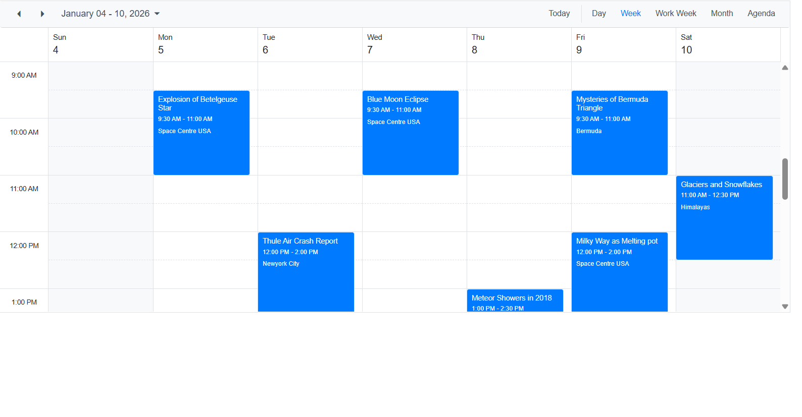

# Syncfusion Blazor Scheduler Integration with OData v4 and EF Core

This [Syncfusion<sup style="font-size:70%">&reg;</sup>  Blazor Scheduler](https://www.syncfusion.com/blazor-components/blazor-scheduler) enables users to seamlessly manage and synchronize event data between the **Scheduler** and an **Entity Framework** Core–backed [**OData v4**](https://www.odata.org/documentation/) service. The Scheduler retrieves existing appointments from the OData API and displays them in an interactive, user-friendly calendar interface.

## Prerequisites

- **.NET SDK** (>=8) Verify with:
    ```bash
    dotnet --version
    ```
- **SQL Server** or LocalDB available. The guide uses LocalDB connection by default.
- A code editor (Visual Studio / VS Code).

## Creating new project

### Step 1: Create a Blazor Web App using Visual Studio

1. Open Visual Studio
2. Click **Create a new project**
3. Search for **Blazor Web App** template
4. Configure project name as **SfSchedulerApp**
5. Select **.NET 8.0 or Compatible** as the target framework
6. Set **Interactive render mode** to **Server**
7. Set **Interactivity location** to **Per page/component**
8. Click **Create**

> Configure the Interactive render mode to **InteractiveServer** during project creation as the Scheduler requires interactivity for CRUD operations.

### Step 2: Install Required NuGet Packages and Configure Blazor Scheduler Component using Entity Framework Core

Before installing the necessary NuGet packages, a new Blazor Web Application must be created using the default template. This template automatically generates essential starter files—such as `Program.cs`, `appsettings.json`, the `wwwroot` folder, and the `Components` folder.

For this guide, a Blazor application named **SfSchedulerApp** has been created. Once the project is set up, the next step involves installing the required NuGet packages. NuGet packages are software libraries that add functionality to the application. These packages enable Entity Framework Core.

To add the **Blazor Scheduler** component with using Entity Framework Core in the app, open the NuGet package manager in Visual Studio (*Tools → NuGet Package Manager → Manage NuGet Packages for Solution*), then search and install [Syncfusion.Blazor.Schedule](https://www.nuget.org/packages/Syncfusion.Blazor.Schedule), [Syncfusion.Blazor.Themes](https://www.nuget.org/packages/Syncfusion.Blazor.Themes/), [Microsoft.AspNetCore.OData](https://www.nuget.org/packages/Microsoft.AspNetCore.OData), and [Microsoft.EntityFrameworkCore.Design](https://www.nuget.org/packages/Microsoft.EntityFrameworkCore.Design/).

#### Project File Reference

The installed packages are reflected in the `BlazorSchedulerApp.csproj` file:

```xml
<ItemGroup>
    <PackageReference Include="Microsoft.AspNetCore.OData" Version="9.4.1" />
    <PackageReference Include="Microsoft.EntityFrameworkCore.Design" Version="10.0.4">
      <IncludeAssets>runtime; build; native; contentfiles; analyzers; buildtransitive</IncludeAssets>
      <PrivateAssets>all</PrivateAssets>
    </PackageReference>
    <PackageReference Include="Syncfusion.Blazor.Schedule" Version="*" />
    <PackageReference Include="Syncfusion.Blazor.Themes" Version="*" />
```

All required packages are now installed.

> **Note**: After installing packages, build the project to ensure all dependencies are restored correctly: `dotnet build`

## Including Syncfusion Scheduler Namespaces
To use the **Syncfusion Scheduler** in your Blazor pages, **import** the necessary namespaces.
```razor
@using Syncfusion.Blazor
@using Syncfusion.Blazor.Schedule
```

## Add the Styles
Apply **Syncfusion’s built‑in theme** to the **Scheduler**, include the theme stylesheet

Add the styles in the `<head>` section of `app.razor` file
```razor
<link rel="stylesheet" href="_content/Syncfusion.Blazor.Themes/bootstrap5.css" />
```

## Add the Script
**Syncfusion Blazor components** require a **JavaScript file** to enable component interactions.

Add the **script** in the `<body>` section of `app.razor` file
```razor
<script src="_content/Syncfusion.Blazor.Core/scripts/syncfusion-blazor.min.js"
            type="text/javascript"></script>
```

## Make the application interactive
Enable **interactive server‑side rendering** for your **Blazor Web App**

Add this line in the `<body>` section of `app.razor` file to make the application **interactive**
```razor
<Routes @rendermode="InteractiveServer" />
```

## Setting Up Syncfusion Blazor in the App Pipeline
Register the **Syncfusion Blazor services** in `Program.cs` so **Scheduler components** can render and work properly.
```csharp
using Syncfusion.Blazor;
builder.Services.AddSyncfusionBlazor();
```

### Building the Scheduler page

This page renders the **Syncfusion Blazor Scheduler** and binds it to event data retrieved from your **OData endpoint**

```razor
@page "/"
@using RestfulServices.Models
@using Syncfusion.Blazor
@using Syncfusion.Blazor.Schedule
@using Syncfusion.Blazor.Data
@using System.Net.Http.Json
@inject HttpClient Http

@if (EventsLoaded)
{
    <SfSchedule TValue="EventData" Height="650px" SelectedDate="@(new DateTime(2026, 01, 5))">
        <ScheduleEventSettings TValue="EventData"
                               DataSource="@Events" >
        </ScheduleEventSettings>
    </SfSchedule>
}
else
{
    <div>Loading events...</div>
}
@code {
    private IEnumerable<EventData> Events = new List<EventData>();
    private bool EventsLoaded = false;
    public Query QueryData = new Query().From("Events");

    protected override async Task OnInitializedAsync()
    {
        try
        {
            var odataResponse = await Http.GetFromJsonAsync<ODataListResponse<EventData>>(
                "https://localhost:5001/odata/Events");

            Events = odataResponse?.Value ?? new List<EventData>();
        }
        catch
        {
            Events = new List<EventData>();
        }
        finally
        {
            EventsLoaded = true;
        }
    }
    public class ODataListResponse<T>
    {
        public List<T> Value { get; set; } = new();
    }
}
```

## Mapping the Models to Scheduler’s fields
Create a folder `Models` and `EventData` class that matches Syncfusion required fields so the Scheduler can automatically bind and interpret your event data.
```csharp
namespace RestfulServices.Models
{
    public class EventData
    {
        public int Id { get; set; }
        public string? Subject { get; set; }
        public string? Location { get; set; }
        public DateTime? StartTime { get; set; }
        public DateTime? EndTime { get; set; }
        public string? StartTimezone { get; set; }
        public string? EndTimezone { get; set; }
        public bool? IsAllDay { get; set; }
        public bool? IsBlock { get; set; }
        public bool? IsReadOnly { get; set; }
        public int? FollowingID { get; set; }
        public string? RecurrenceRule { get; set; }
        public int? RecurrenceID { get; set; }
        public string? RecurrenceException { get; set; }
        public string? Description { get; set; }
    }
}
```

## Configuring the Entity Framework Core Data Context for Scheduler Events

To store and manage **Scheduler events** using **Entity Framework Core**, create a **database context** in the `Models/SchedulerDataContext` file that represents your data layer.

This context exposes a **DbSet** collection, which EF Core will map to a database table.
```csharp

namespace RestfulServices.Models
{
    public class ScheduleDataContext : DbContext
    {

        public ScheduleDataContext(DbContextOptions<ScheduleDataContext> options)
            : base(options)
        {
        }

        public DbSet<EventData> EventsData { get; set; }

        protected override void OnModelCreating(ModelBuilder modelBuilder)
        {

        }

    }
}
```

## Creating an In‑Memory Data Source for Scheduler Events

The DataSource class provides a simple in‑memory collection of event records and adding some default events in `Models/DataSource.cs` file
```csharp
namespace RestfulServices.Models
{
    public static class DataSource
    {
        private static IList<EventData>? _eventsData { get; set; }

        public static IList<EventData> GetEvents()
        {
            if (_eventsData != null)
            {
                return _eventsData;
            }

            _eventsData = new List<EventData>();

            EventData related = new EventData
            {
                Id = 1,
                Subject = "Explosion of Betelgeuse Star",
                Location = "Space Centre USA",
                StartTime = new DateTime(2026, 1, 5, 9, 30, 0),
                EndTime = new DateTime(2026, 1, 5, 11, 0, 0)
            };
            _eventsData.Add(related);

            EventData events = new EventData
            {
                Id = 2,
                Subject = "Thule Air Crash Report",
                Location = "Newyork City",
                StartTime = new DateTime(2026, 1, 6, 12, 0, 0),
                EndTime = new DateTime(2026, 1, 6, 14, 0, 0)
            };
            _eventsData.Add(events);

            events = new EventData
            {
                Id = 3,
                Subject = "Blue Moon Eclipse",
                Location = "Space Centre USA",
                StartTime = new DateTime(2026, 1, 7, 9, 30, 0),
                EndTime = new DateTime(2026, 1, 7, 11, 0, 0)
            };
            _eventsData.Add(events);

            events = new EventData
            {
                Id = 4,
                Subject = "Meteor Showers in 2018",
                Location = "Space Centre USA",
                StartTime = new DateTime(2026, 1, 8, 13, 0, 0),
                EndTime = new DateTime(2026, 1, 8, 14, 30, 0)
            };
            _eventsData.Add(events);

            events = new EventData
            {
                Id = 5,
                Subject = "Milky Way as Melting pot",
                Location = "Space Centre USA",
                StartTime = new DateTime(2026, 1, 9, 12, 0, 0),
                EndTime = new DateTime(2026, 1, 9, 14, 0, 0)
            };
            _eventsData.Add(events);

            events = new EventData
            {
                Id = 6,
                Subject = "Mysteries of Bermuda Triangle",
                Location = "Bermuda",
                StartTime = new DateTime(2026, 1, 9, 9, 30, 0),
                EndTime = new DateTime(2026, 1, 9, 11, 0, 0)
            };
            _eventsData.Add(events);

            events = new EventData
            {
                Id = 7,
                Subject = "Glaciers and Snowflakes",
                Location = "Himalayas",
                StartTime = new DateTime(2026, 1, 10, 11, 0, 0),
                EndTime = new DateTime(2026, 1, 10, 12, 30, 0)
            };
            _eventsData.Add(events);

            events = new EventData
            {
                Id = 8,
                Subject = "Life on Mars",
                Location = "Space Centre USA",
                StartTime = new DateTime(2026, 1, 11, 9, 0, 0),
                EndTime = new DateTime(2026, 1, 11, 10, 0, 0)
            };
            _eventsData.Add(events);

            events = new EventData
            {
                Id = 9,
                Subject = "Alien Civilization",
                Location = "Space Centre USA",
                StartTime = new DateTime(2026, 1, 13, 11, 0, 0),
                EndTime = new DateTime(2026, 1, 13, 13, 0, 0)
            };
            _eventsData.Add(events);

            return _eventsData;
        }
    }
}
```

##  Exposing CRUD Endpoints for Scheduler Events
Create a `Controllers/EventController.cs` file which is  responsible for handling **CRUD operations** on **Scheduler events**

### Seed Data Into Database
The constructor receives the EF Core database context and initializes the controller
```csharp
using Microsoft.AspNetCore.Mvc;
using System;
using System.Collections.Generic;
using System.Linq;
using System.Threading.Tasks;
using RestfulServices.Models;
using Microsoft.AspNetCore.OData;
using Microsoft.AspNetCore.OData.Routing.Controllers;
using Microsoft.AspNetCore.OData.Query;
using Microsoft.AspNetCore.OData.Formatter;

namespace RestfulServices.Controllers
{
    //[Route("api/")]
    //[ApiController]
    public class EventsController : ODataController
    {
        private ScheduleDataContext _db;
        // GET: api/<EventsController>
        public EventsController(ScheduleDataContext context)
        {
            _db = context;
            if (context.EventsData.Count() == 0)
            {
                foreach (var b in DataSource.GetEvents())
                {
                    context.EventsData.Add(b);
                }
                context.SaveChanges();
            }

        }
    }
}
```

### GET Retrieve All Events
To **Return** all event records stored use this in the **EventsController class**

```csharp
[HttpGet]
[EnableQuery]
public IActionResult Get()
{
    return Ok(_db.EventsData);
}
```
[EnableQuery] allows Syncfusion’s OData adaptor to apply filtering, sorting, and paging automatically

### POST Create a New Event
To **Add** a **new event** to the database use this in the **EventsController class**

```csharp
public async Task Post([FromBody] EventData events)
{
    _db.EventsData.Add(events);
    await _db.SaveChangesAsync();
}
```
This method is called when a user creates a new appointment in the Syncfusion Scheduler

### PUT Update an Existing Event
To **Replace** an **existing event** with the updated values use this in the **EventsController class**

```csharp
public async Task Put([FromODataUri] int key, [FromBody] EventData events)
{
    var entity = await _db.EventsData.FindAsync(events.Id);
    if (entity != null)
    {
        _db.Entry(entity).CurrentValues.SetValues(events);
        await _db.SaveChangesAsync();
    }
}
```
This method is typically used when the Scheduler sends a full update request for edits

### PATCH Partially Update an Event
To **Update** only specific fields of an event use this in the **EventsController class**

```csharp
public async Task Patch([FromODataUri] int key, [FromBody] EventData events)
{
    var entity = await _db.EventsData.FindAsync(key);
    //events.Patch(entity);
    if (entity != null)
    {
        _db.Entry(entity).CurrentValues.SetValues(events);
        await _db.SaveChangesAsync();
    }
}
```
The Scheduler may call this when only certain properties **like time change** are modified

### DELETE Remove an Event
To **Delete** an event from the database use this in the EventsController class

```csharp
public async Task Delete([FromODataUri] int key)
{
    var od = _db.EventsData.Find(key);
    if (od != null)
    {
        _db.EventsData.Remove(od);
        await _db.SaveChangesAsync();
    }
}
```
This method is triggered when a user removes an appointment from the Scheduler

## 13 Running the application

```bash
dotnet build
dotnet run
```

Open the app in your browser on the port shown in the console

## Output


> For additional help, see the [Blazor Entity Framework sample on GitHub](https://github.com/SyncfusionExamples/blazor-scheduler-crud-using-restful-service)

## TroubleShooting
### Problem
The Scheduler does not load correctly, or interactive features (drag, drop, resize, edit popup, etc.) do not work.

### Errors
- SfSchedule is not a function
- Scheduler renders but is not interactive

### Solution
Add the Syncfusion script reference inside the <body> of `App.razor`
```razor
<script src="_content/Syncfusion.Blazor.Core/scripts/syncfusion-blazor.min.js"
            type="text/javascript"></script>
```