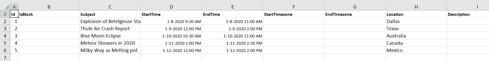
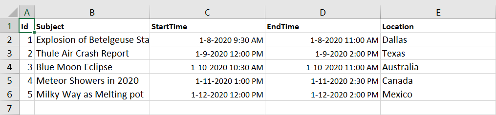
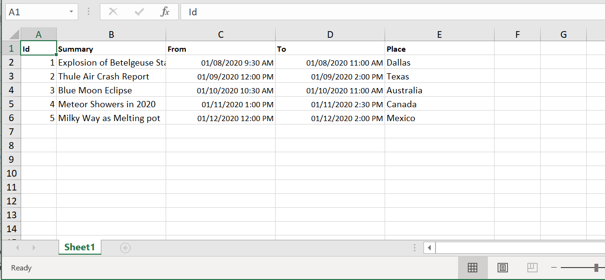
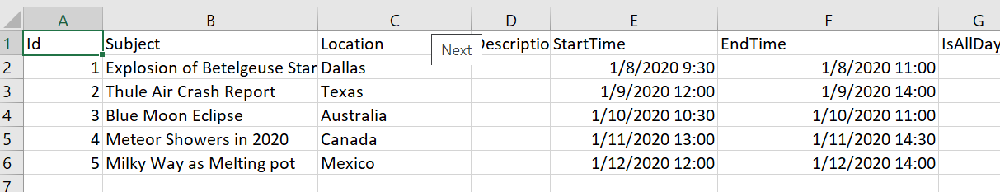

# Exporting in Blazor Scheduler Component

The Scheduler supports exporting all its appointments both to an Excel or ICS extension file. It offers different methods to export its appointments in an Excel or iCal format file. Let's look onto the ways on how to implement the exporting functionality in Scheduler.

## Excel Exporting

The Scheduler allows to export all its events into an Excel format file by using the [`ExportToExcelAsync`](https://help.syncfusion.com/cr/blazor/Syncfusion.Blazor.Schedule.SfSchedule-1.html#Syncfusion_Blazor_Schedule_SfSchedule_1_ExportToExcelAsync_Syncfusion_Blazor_Schedule_ExportOptions_) method. By default, it exports all the default fields of Scheduler mapped through `<ScheduleEventSettings>` property.

```cshtml
@using Syncfusion.Blazor.Schedule
@using Syncfusion.Blazor.Buttons

<SfButton Content="Excel Export" OnClick="OnExportToExcel"></SfButton>
<SfSchedule @ref="ScheduleRef" TValue="AppointmentData" Height="650px" @bind-SelectedDate="@CurrentDate">
    <ScheduleEventSettings DataSource="@DataSource"></ScheduleEventSettings>
    <ScheduleViews>
        <ScheduleView Option="View.Week"></ScheduleView>
    </ScheduleViews>
</SfSchedule>

@code{
    DateTime CurrentDate = new DateTime(2020, 1, 10);
    SfSchedule<AppointmentData> ScheduleRef;
    List<AppointmentData> DataSource = new List<AppointmentData>
    {
        new AppointmentData { Id = 1, Subject = "Explosion of Betelgeuse Star", Location = "Dallas",  StartTime = new DateTime(2020, 1, 8, 9, 30, 0), EndTime = new DateTime(2020, 1, 8, 11, 0, 0)  },
        new AppointmentData { Id = 2, Subject = "Thule Air Crash Report", Location = "Texas", StartTime = new DateTime(2020, 1, 9, 12, 0, 0), EndTime = new DateTime(2020, 1, 9, 14, 0, 0)  },
        new AppointmentData { Id = 3, Subject = "Blue Moon Eclipse", Location = "Australia", StartTime = new DateTime(2020, 1, 10, 10, 30, 0), EndTime = new DateTime(2020, 1, 10, 11, 0, 0)  },
        new AppointmentData { Id = 4, Subject = "Meteor Showers in 2020", Location = "Canada", StartTime = new DateTime(2020, 1, 11, 13, 0, 0), EndTime = new DateTime(2020, 1, 11, 14, 30, 0)  },
        new AppointmentData { Id = 5, Subject = "Milky Way as Melting pot", Location = "Mexico", StartTime = new DateTime(2020, 1, 12, 12, 0, 0), EndTime = new DateTime(2020, 1, 12, 14, 0, 0)  }
    };
    public class AppointmentData
    {
        public int Id { get; set; }
        public string Subject { get; set; }
        public string Location { get; set; }
        public DateTime StartTime { get; set; }
        public DateTime EndTime { get; set; }
        public string Description { get; set; }
        public bool IsAllDay { get; set; }
        public string RecurrenceRule { get; set; }
        public string RecurrenceException { get; set; }
        public Nullable<int> RecurrenceID { get; set; }
    }
    public async Task OnExportToExcel()
    {
        await ScheduleRef.ExportToExcelAsync();
    }
}
```



### Exporting with custom fields

By default, Scheduler exports all the default event fields that are mapped to it through the `<ScheduleEventSettings>` property. To limit the number of fields on the exported excel file, it provides an option to export only the custom fields of the event data. To export such custom fields alone, define the required `Fields` and pass it as argument to the [`ExportToExcelAsync`](https://help.syncfusion.com/cr/blazor/Syncfusion.Blazor.Schedule.SfSchedule-1.html#Syncfusion_Blazor_Schedule_SfSchedule_1_ExportToExcelAsync_Syncfusion_Blazor_Schedule_ExportOptions_) method as shown in the following example. In the following code example, only 'Id', 'Subject', 'StartTime', 'EndTime' fields were exported.

```cshtml
@using Syncfusion.Blazor.Schedule
@using Syncfusion.Blazor.Buttons

<SfButton Content="Excel Export" OnClick="OnExportToExcel"></SfButton>
<SfSchedule @ref="ScheduleRef" TValue="AppointmentData" Height="650px" @bind-SelectedDate="@CurrentDate">
    <ScheduleEventSettings DataSource="@DataSource"></ScheduleEventSettings>
    <ScheduleViews>
        <ScheduleView Option="View.Week"></ScheduleView>
    </ScheduleViews>
</SfSchedule>

@code{
    DateTime CurrentDate = new DateTime(2020, 1, 10);
    SfSchedule<AppointmentData> ScheduleRef;
    List<AppointmentData> DataSource = new List<AppointmentData>
    {
        new AppointmentData { Id = 1, Subject = "Explosion of Betelgeuse Star", Location = "Dallas",  StartTime = new DateTime(2020, 1, 8, 9, 30, 0), EndTime = new DateTime(2020, 1, 8, 11, 0, 0)  },
        new AppointmentData { Id = 2, Subject = "Thule Air Crash Report", Location = "Texas", StartTime = new DateTime(2020, 1, 9, 12, 0, 0), EndTime = new DateTime(2020, 1, 9, 14, 0, 0)  },
        new AppointmentData { Id = 3, Subject = "Blue Moon Eclipse", Location = "Australia", StartTime = new DateTime(2020, 1, 10, 10, 30, 0), EndTime = new DateTime(2020, 1, 10, 11, 0, 0)  },
        new AppointmentData { Id = 4, Subject = "Meteor Showers in 2020", Location = "Canada", StartTime = new DateTime(2020, 1, 11, 13, 0, 0), EndTime = new DateTime(2020, 1, 11, 14, 30, 0)  },
        new AppointmentData { Id = 5, Subject = "Milky Way as Melting pot", Location = "Mexico", StartTime = new DateTime(2020, 1, 12, 12, 0, 0), EndTime = new DateTime(2020, 1, 12, 14, 0, 0)  }
    };
    public class AppointmentData
    {
        public int Id { get; set; }
        public string Subject { get; set; }
        public string Location { get; set; }
        public DateTime StartTime { get; set; }
        public DateTime EndTime { get; set; }
    }
    public async Task OnExportToExcel()
    {
        ExportOptions Options = new ExportOptions() { ExportType = ExcelFormat.Xlsx, Fields = new string[] { "Id", "Subject", "StartTime", "EndTime" } };
        await ScheduleRef.ExportToExcelAsync(Options);
    }
}
```



### Exporting individual occurrences of a recurring series

By default, the Scheduler exports recurring events as a single data by exporting only its parent record into the excel file. If you want to export each individual occurrences of a recurring series appointment as separate records in an Excel file, define the [`IncludeOccurrences`](https://help.syncfusion.com/cr/blazor/Syncfusion.Blazor.Schedule.ExportOptions.html#Syncfusion_Blazor_Schedule_ExportOptions_IncludeOccurrences) option as `true` and pass it as argument to the [`ExportToExcelAsync`](https://help.syncfusion.com/cr/blazor/Syncfusion.Blazor.Schedule.SfSchedule-1.html#Syncfusion_Blazor_Schedule_SfSchedule_1_ExportToExcelAsync_Syncfusion_Blazor_Schedule_ExportOptions_) method. By default, the [`IncludeOccurrences`](https://help.syncfusion.com/cr/blazor/Syncfusion.Blazor.Schedule.ExportOptions.html#Syncfusion_Blazor_Schedule_ExportOptions_IncludeOccurrences) option is set to `false`.

```cshtml
@using Syncfusion.Blazor.Schedule
@using Syncfusion.Blazor.Buttons

<SfButton Content="Excel Export" OnClick="OnExportToExcel"></SfButton>
<SfSchedule @ref="ScheduleRef" TValue="AppointmentData" Height="650px" @bind-SelectedDate="@CurrentDate">
    <ScheduleEventSettings DataSource="@DataSource"></ScheduleEventSettings>
    <ScheduleViews>
        <ScheduleView Option="View.Week"></ScheduleView>
    </ScheduleViews>
</SfSchedule>

@code{
    DateTime CurrentDate = new DateTime(2020, 1, 10);
    SfSchedule<AppointmentData> ScheduleRef;
    List<AppointmentData> DataSource = new List<AppointmentData>
    {
        new AppointmentData { Id = 1, Subject = "Explosion of Betelgeuse Star", Location = "Dallas",  StartTime = new DateTime(2020, 1, 8, 9, 30, 0), EndTime = new DateTime(2020, 1, 8, 11, 0, 0)  },
        new AppointmentData { Id = 2, Subject = "Thule Air Crash Report", Location = "Texas", StartTime = new DateTime(2020, 1, 9, 12, 0, 0), EndTime = new DateTime(2020, 1, 9, 14, 0, 0)  },
        new AppointmentData { Id = 3, Subject = "Blue Moon Eclipse", Location = "Australia", StartTime = new DateTime(2020, 1, 10, 10, 30, 0), EndTime = new DateTime(2020, 1, 10, 11, 0, 0)  },
        new AppointmentData { Id = 4, Subject = "Meteor Showers in 2020", Location = "Canada", StartTime = new DateTime(2020, 1, 11, 13, 0, 0), EndTime = new DateTime(2020, 1, 11, 14, 30, 0)  },
        new AppointmentData { Id = 5, Subject = "Milky Way as Melting pot", Location = "Mexico", StartTime = new DateTime(2020, 1, 12, 12, 0, 0), EndTime = new DateTime(2020, 1, 12, 14, 0, 0)  }
    };
    public class AppointmentData
    {
        public int Id { get; set; }
        public string Subject { get; set; }
        public string Location { get; set; }
        public DateTime StartTime { get; set; }
        public DateTime EndTime { get; set; }
    }
    public ExportOptions ExportValues = new ExportOptions { IncludeOccurrences = true };
    public async Task OnExportToExcel()
    {
       await ScheduleRef.ExportToExcelAsync(ExportValues);
    }
}
```

### Exporting custom event data

By default, the whole event collection bound to the Scheduler gets exported as an excel file. To export only specific events of Scheduler or some custom event collection, you need to pass those custom data collection as a parameter to the [`ExportToExcelAsync`](https://help.syncfusion.com/cr/blazor/Syncfusion.Blazor.Schedule.SfSchedule-1.html#Syncfusion_Blazor_Schedule_SfSchedule_1_ExportToExcelAsync_Syncfusion_Blazor_Schedule_ExportOptions_) method as shown in this following example, through the [`CustomData`](https://help.syncfusion.com/cr/blazor/Syncfusion.Blazor.Schedule.ExportOptions.html#Syncfusion_Blazor_Schedule_ExportOptions_CustomData) option.

N> By default, the event data are taken from Scheduler dataSource.

```cshtml
@using Syncfusion.Blazor.Schedule
@using Syncfusion.Blazor.Buttons

<SfButton Content="Excel Export" OnClick="OnExportToExcel"></SfButton>
<SfSchedule @ref="ScheduleRef" TValue="AppointmentData" Width="100%" Height="650px" @bind-SelectedDate="@CurrentDate">
    <ScheduleEventSettings DataSource="@DataSource"></ScheduleEventSettings>
    <ScheduleViews>
        <ScheduleView Option="View.Week"></ScheduleView>
    </ScheduleViews>
</SfSchedule>

@code{
    DateTime CurrentDate = new DateTime(2020, 1, 10);
    SfSchedule<AppointmentData> ScheduleRef;
    List<AppointmentData> DataSource = new List<AppointmentData>
    {
        new AppointmentData { Id = 1, Subject = "Explosion of Betelgeuse Star", Location = "Dallas",  StartTime = new DateTime(2020, 1, 8, 9, 30, 0), EndTime = new DateTime(2020, 1, 8, 11, 0, 0)  },
        new AppointmentData { Id = 2, Subject = "Thule Air Crash Report", Location = "Texas", StartTime = new DateTime(2020, 1, 9, 12, 0, 0), EndTime = new DateTime(2020, 1, 9, 14, 0, 0)  },
        new AppointmentData { Id = 3, Subject = "Blue Moon Eclipse", Location = "Australia", StartTime = new DateTime(2020, 1, 10, 10, 30, 0), EndTime = new DateTime(2020, 1, 10, 11, 0, 0)  },
        new AppointmentData { Id = 4, Subject = "Meteor Showers in 2020", Location = "Canada", StartTime = new DateTime(2020, 1, 11, 13, 0, 0), EndTime = new DateTime(2020, 1, 11, 14, 30, 0)  },
        new AppointmentData { Id = 5, Subject = "Milky Way as Melting pot", Location = "Mexico", StartTime = new DateTime(2020, 1, 12, 12, 0, 0), EndTime = new DateTime(2020, 1, 12, 14, 0, 0)  }
    };
    public ExportOptions ExportValues = new ExportOptions { CustomData = customData };
    static List<AppointmentData> customData = new List<AppointmentData>()
    {
        new AppointmentData
        {
            Id = 1,
            Subject = "Explosion of Betelgeuse Star",
            Location = "Space Centre USA",
            StartTime = new DateTime(2020, 1, 31, 9, 30, 0) ,
            EndTime = new DateTime(2020, 1, 31, 11, 0, 0)
        },
        new AppointmentData
        {
            Id = 2,
            Subject = "Thule Air Crash Report",
            Location = "Newyork City",
            StartTime = new DateTime(2020, 1, 31, 12, 0, 0),
            EndTime = new DateTime(2020, 1, 31, 11, 0, 0)
        }
    };
    public async Task OnExportToExcel()
    {
        await ScheduleRef.ExportToExcelAsync(ExportValues);
    }
    public class AppointmentData
    {
        public int Id { get; set; }
        public string Subject { get; set; }
        public string Location { get; set; }
        public DateTime StartTime { get; set; }
        public DateTime EndTime { get; set; }
        public string Description { get; set; }
        public bool IsAllDay { get; set; }
        public string RecurrenceRule { get; set; }
        public string RecurrenceException { get; set; }
        public Nullable<int> RecurrenceID { get; set; }
    }
}
```

### Customizing the column header texts with custom fields exporting

You can change the field names of appointment in the column header when exporting using the [`FieldsInfo`](https://help.syncfusion.com/cr/blazor/Syncfusion.Blazor.Schedule.ExportOptions.html#Syncfusion_Blazor_Schedule_ExportOptions_FieldsInfo) option through the [`ExportFieldInfo`](https://help.syncfusion.com/cr/blazor/Syncfusion.Blazor.Schedule.ExportFieldInfo.html) class and pass it as an argument to the [`ExportToExcelAsync`](https://help.syncfusion.com/cr/blazor/Syncfusion.Blazor.Schedule.SfSchedule-1.html#Syncfusion_Blazor_Schedule_SfSchedule_1_ExportToExcelAsync_Syncfusion_Blazor_Schedule_ExportOptions_) method as shown in the following code example.

```cshtml
@using Syncfusion.Blazor.Schedule
@using Syncfusion.Blazor.Buttons

<SfButton Content="Excel Export" OnClick="OnExportToExcel"></SfButton>
<SfSchedule @ref="ScheduleRef" TValue="AppointmentData" Height="650px" @bind-SelectedDate="@CurrentDate">
    <ScheduleEventSettings DataSource="@DataSource"></ScheduleEventSettings>
    <ScheduleViews>
        <ScheduleView Option="View.Week"></ScheduleView>
    </ScheduleViews>
</SfSchedule>

@code{
    DateTime CurrentDate = new DateTime(2020, 1, 10);
    SfSchedule<AppointmentData> ScheduleRef;
    List<AppointmentData> DataSource = new List<AppointmentData>
    {
        new AppointmentData { Id = 1, Subject = "Explosion of Betelgeuse Star", Location = "Dallas",  StartTime = new DateTime(2020, 1, 8, 9, 30, 0), EndTime = new DateTime(2020, 1, 8, 11, 0, 0)  },
        new AppointmentData { Id = 2, Subject = "Thule Air Crash Report", Location = "Texas", StartTime = new DateTime(2020, 1, 9, 12, 0, 0), EndTime = new DateTime(2020, 1, 9, 14, 0, 0)  },
        new AppointmentData { Id = 3, Subject = "Blue Moon Eclipse", Location = "Australia", StartTime = new DateTime(2020, 1, 10, 10, 30, 0), EndTime = new DateTime(2020, 1, 10, 11, 0, 0)  },
        new AppointmentData { Id = 4, Subject = "Meteor Showers in 2020", Location = "Canada", StartTime = new DateTime(2020, 1, 11, 13, 0, 0), EndTime = new DateTime(2020, 1, 11, 14, 30, 0)  },
        new AppointmentData { Id = 5, Subject = "Milky Way as Melting pot", Location = "Mexico", StartTime = new DateTime(2020, 1, 12, 12, 0, 0), EndTime = new DateTime(2020, 1, 12, 14, 0, 0)  }
    };
    public async Task OnExportToExcel()
    {
        List<ExportFieldInfo> exportFields = new List<ExportFieldInfo>();
        exportFields.Add(new ExportFieldInfo { Name = "Id", Text = "Id" });
        exportFields.Add(new ExportFieldInfo { Name = "Subject", Text = "Summary" });
        exportFields.Add(new ExportFieldInfo { Name = "StartTime", Text = "From" });
        exportFields.Add(new ExportFieldInfo { Name = "EndTime", Text = "To" });
        exportFields.Add(new ExportFieldInfo { Name = "Location", Text = "Place" });
        ExportOptions options = new ExportOptions() { ExportType = ExcelFormat.Xlsx, FieldsInfo = exportFields };
        await ScheduleRef.ExportToExcelAsync(options);
    }
    public class AppointmentData
    {
        public int Id { get; set; }
        public string Subject { get; set; }
        public string Location { get; set; }
        public DateTime StartTime { get; set; }
        public DateTime EndTime { get; set; }
        public string Description { get; set; }
        public bool IsAllDay { get; set; }
        public string RecurrenceRule { get; set; }
        public string RecurrenceException { get; set; }
        public Nullable<int> RecurrenceID { get; set; }
    }
}
```



### Export with custom file name

By default, the Scheduler allows you to download the exported Excel file with a name `Schedule.xlsx`. It also provides an option to export the excel file with a custom file name, define the desired `FileName` and passing it as an argument to the [`ExportToExcelAsync`](https://help.syncfusion.com/cr/blazor/Syncfusion.Blazor.Schedule.SfSchedule-1.html#Syncfusion_Blazor_Schedule_SfSchedule_1_ExportToExcelAsync_Syncfusion_Blazor_Schedule_ExportOptions_) method.

```cshtml
@using Syncfusion.Blazor.Schedule
@using Syncfusion.Blazor.Buttons

<SfButton Content="Excel Export" OnClick="OnExportToExcel"></SfButton>
<SfSchedule @ref="ScheduleRef" TValue="AppointmentData" Height="650px" @bind-SelectedDate="@CurrentDate">
    <ScheduleEventSettings DataSource="@DataSource"></ScheduleEventSettings>
    <ScheduleViews>
        <ScheduleView Option="View.Week"></ScheduleView>
    </ScheduleViews>
</SfSchedule>

@code{
    DateTime CurrentDate = new DateTime(2020, 1, 10);
    SfSchedule<AppointmentData> ScheduleRef;
    List<AppointmentData> DataSource = new List<AppointmentData>
    {
        new AppointmentData { Id = 1, Subject = "Explosion of Betelgeuse Star", Location = "Dallas",  StartTime = new DateTime(2020, 1, 8, 9, 30, 0), EndTime = new DateTime(2020, 1, 8, 11, 0, 0)  },
        new AppointmentData { Id = 2, Subject = "Thule Air Crash Report", Location = "Texas", StartTime = new DateTime(2020, 1, 9, 12, 0, 0), EndTime = new DateTime(2020, 1, 9, 14, 0, 0)  },
        new AppointmentData { Id = 3, Subject = "Blue Moon Eclipse", Location = "Australia", StartTime = new DateTime(2020, 1, 10, 10, 30, 0), EndTime = new DateTime(2020, 1, 10, 11, 0, 0)  },
        new AppointmentData { Id = 4, Subject = "Meteor Showers in 2020", Location = "Canada", StartTime = new DateTime(2020, 1, 11, 13, 0, 0), EndTime = new DateTime(2020, 1, 11, 14, 30, 0)  },
        new AppointmentData { Id = 5, Subject = "Milky Way as Melting pot", Location = "Mexico", StartTime = new DateTime(2020, 1, 12, 12, 0, 0), EndTime = new DateTime(2020, 1, 12, 14, 0, 0)  }
    };
    public class AppointmentData
    {
        public int Id { get; set; }
        public string Subject { get; set; }
        public string Location { get; set; }
        public DateTime StartTime { get; set; }
        public DateTime EndTime { get; set; }
        public string Description { get; set; }
        public bool IsAllDay { get; set; }
        public string RecurrenceRule { get; set; }
        public string RecurrenceException { get; set; }
        public Nullable<int> RecurrenceID { get; set; }
    }
    public ExportOptions ExportValues = new ExportOptions { FileName = "SchedulerData" };
    public async Task OnExportToExcel()
    {
        await ScheduleRef.ExportToExcelAsync(ExportValues);
    }
}
```

### Excel file formats

By default, the Scheduler exports event data to an excel file in the `.xlsx` format. You can also export the Scheduler data in either of the file type such as `.xlsx` or `csv` formats, by defining the [`ExportType`](https://help.syncfusion.com/cr/blazor/Syncfusion.Blazor.Schedule.ExportOptions.html#Syncfusion_Blazor_Schedule_ExportOptions_ExportType) option as either `csv` or `xlsx`. By default, the [`ExportType`](https://help.syncfusion.com/cr/blazor/Syncfusion.Blazor.Schedule.ExportOptions.html#Syncfusion_Blazor_Schedule_ExportOptions_ExportType) is set to `xlsx`.

```cshtml
@using Syncfusion.Blazor.Schedule
@using Syncfusion.Blazor.Buttons

<SfButton Content="Excel Export" OnClick="OnExportToExcel"></SfButton>
<SfSchedule @ref="ScheduleRef" TValue="AppointmentData" Height="650px" @bind-SelectedDate="@CurrentDate">
    <ScheduleEventSettings DataSource="@DataSource"></ScheduleEventSettings>
    <ScheduleViews>
        <ScheduleView Option="View.Week"></ScheduleView>
    </ScheduleViews>
</SfSchedule>

@code{
    DateTime CurrentDate = new DateTime(2020, 1, 10);
    SfSchedule<AppointmentData> ScheduleRef;
    List<AppointmentData> DataSource = new List<AppointmentData>
    {
        new AppointmentData { Id = 1, Subject = "Explosion of Betelgeuse Star", Location = "Dallas",  StartTime = new DateTime(2020, 1, 8, 9, 30, 0), EndTime = new DateTime(2020, 1, 8, 11, 0, 0)  },
        new AppointmentData { Id = 2, Subject = "Thule Air Crash Report", Location = "Texas", StartTime = new DateTime(2020, 1, 9, 12, 0, 0), EndTime = new DateTime(2020, 1, 9, 14, 0, 0)  },
        new AppointmentData { Id = 3, Subject = "Blue Moon Eclipse", Location = "Australia", StartTime = new DateTime(2020, 1, 10, 10, 30, 0), EndTime = new DateTime(2020, 1, 10, 11, 0, 0)  },
        new AppointmentData { Id = 4, Subject = "Meteor Showers in 2020", Location = "Canada", StartTime = new DateTime(2020, 1, 11, 13, 0, 0), EndTime = new DateTime(2020, 1, 11, 14, 30, 0)  },
        new AppointmentData { Id = 5, Subject = "Milky Way as Melting pot", Location = "Mexico", StartTime = new DateTime(2020, 1, 12, 12, 0, 0), EndTime = new DateTime(2020, 1, 12, 14, 0, 0)  }
    };
    public class AppointmentData
    {
        public int Id { get; set; }
        public string Subject { get; set; }
        public string Location { get; set; }
        public DateTime StartTime { get; set; }
        public DateTime EndTime { get; set; }
        public string Description { get; set; }
        public bool IsAllDay { get; set; }
        public string RecurrenceRule { get; set; }
        public string RecurrenceException { get; set; }
        public Nullable<int> RecurrenceID { get; set; }
    }
    public ExportOptions ExportValues = new ExportOptions { ExportType = ExcelFormat.Csv };
    public async Task OnExportToExcel()
    {
        await ScheduleRef.ExportToExcelAsync(ExportValues);
    }
}
```

### Export with specific date format

You can export the Scheduler data with specific date format, by defining the [`DateFormat`](https://help.syncfusion.com/cr/blazor/Syncfusion.Blazor.Schedule.ExportOptions.html#Syncfusion_Blazor_Schedule_ExportOptions_DateFormat) option which accepts the MSDN date format in string type. In the following code example, the scheduler appointments are exported in 24 hour date format.

```cshtml
@using Syncfusion.Blazor.Schedule
@using Syncfusion.Blazor.Buttons

<SfButton Content="Excel Export" OnClick="OnExportToExcel"></SfButton>
<SfSchedule @ref="ScheduleRef" TValue="AppointmentData" Height="650px" @bind-SelectedDate="@CurrentDate">
    <ScheduleEventSettings DataSource="@DataSource"></ScheduleEventSettings>
    <ScheduleViews>
        <ScheduleView Option="View.Week"></ScheduleView>
    </ScheduleViews>
</SfSchedule>

@code{
    DateTime CurrentDate = new DateTime(2020, 1, 10);
    SfSchedule<AppointmentData> ScheduleRef;
    List<AppointmentData> DataSource = new List<AppointmentData>
    {
        new AppointmentData { Id = 1, Subject = "Explosion of Betelgeuse Star", Location = "Dallas",  StartTime = new DateTime(2020, 1, 8, 9, 30, 0), EndTime = new DateTime(2020, 1, 8, 11, 0, 0)  },
        new AppointmentData { Id = 2, Subject = "Thule Air Crash Report", Location = "Texas", StartTime = new DateTime(2020, 1, 9, 12, 0, 0), EndTime = new DateTime(2020, 1, 9, 14, 0, 0)  },
        new AppointmentData { Id = 3, Subject = "Blue Moon Eclipse", Location = "Australia", StartTime = new DateTime(2020, 1, 10, 10, 30, 0), EndTime = new DateTime(2020, 1, 10, 11, 0, 0)  },
        new AppointmentData { Id = 4, Subject = "Meteor Showers in 2020", Location = "Canada", StartTime = new DateTime(2020, 1, 11, 13, 0, 0), EndTime = new DateTime(2020, 1, 11, 14, 30, 0)  },
        new AppointmentData { Id = 5, Subject = "Milky Way as Melting pot", Location = "Mexico", StartTime = new DateTime(2020, 1, 12, 12, 0, 0), EndTime = new DateTime(2020, 1, 12, 14, 0, 0)  }
    };
    public class AppointmentData
    {
        public int Id { get; set; }
        public string Subject { get; set; }
        public string Location { get; set; }
        public DateTime StartTime { get; set; }
        public DateTime EndTime { get; set; }
        public string Description { get; set; }
        public bool IsAllDay { get; set; }
        public string RecurrenceRule { get; set; }
        public string RecurrenceException { get; set; }
        public Nullable<int> RecurrenceID { get; set; }
    }
    public ExportOptions ExportValues = new ExportOptions { DateFormat = "MM/dd/yy H:mm:ss" };
    public async Task OnExportToExcel()
    {
        await ScheduleRef.ExportToExcelAsync(ExportValues);
    }
}
```



### How to customize the excel sheet on before exporting

Customizing an Excel sheet before export is made easy with the [`ExcelExport`](https://help.syncfusion.com/cr/blazor/Syncfusion.Blazor.Schedule.SfSchedule-1.html#Syncfusion_Blazor_Schedule_SfSchedule_1_ExcelExport) API. This API provides users with robust flexibility to tailor the exported data, format it according to specific needs, and include additional elements for enhanced presentation.

With the [`ExcelExport`](https://help.syncfusion.com/cr/blazor/Syncfusion.Blazor.Schedule.SfSchedule-1.html#Syncfusion_Blazor_Schedule_SfSchedule_1_ExcelExport) API, you can:

- **Adjust the formatting:** Apply specific styles such as font type, size, color, and cell formatting to make the output visually appealing and consistent with your requirements.

- **Customize headers and footers:** Personalize the Excel sheet by modifying the header and footer content, offering more control over the exported document.

- **Cancel the export:** The API supports cancellation of the export process by setting the `cancel` property to `true`. This feature ensures you can prevent export based on specific conditions, offering you full control over the Excel export workflow.

Here’s an example of how you can add a custom header and footer to an Excel sheet before exporting using the [`ExcelExport`](https://help.syncfusion.com/cr/blazor/Syncfusion.Blazor.Schedule.SfSchedule-1.html#Syncfusion_Blazor_Schedule_SfSchedule_1_ExcelExport) API:

```cshtml
@using Syncfusion.Blazor.Buttons
@using Syncfusion.XlsIO
@using System.Globalization
@using Syncfusion.ExcelExport

  < div class="col-lg-12" style = "padding-top:15px" >
    <SfButton Content="Export to Excel" OnClick="OnExportToExcel"></SfButton>
</div >
  <div class="col-lg-12 control-section">
    <SfSchedule @ref="ScheduleRef" TValue="ScheduleData.AppointmentData" Width="100%" Height="650px"
    @bind-SelectedDate="@CurrentDate">
    <ScheduleEventSettings DataSource="@EventDataSource"></ScheduleEventSettings>
    <ScheduleEvents TValue="ScheduleData.AppointmentData" ExcelExporting="OnExcelExporting"></ScheduleEvents>
    <ScheduleViews>
      <ScheduleView Option="View.Week"></ScheduleView>
    </ScheduleViews>
  </SfSchedule>
</div >

  @code {
    private DateTime CurrentDate { get; set; } = DateTime.Today;
  SfSchedule < ScheduleData.AppointmentData > ScheduleRef;
    private List < ScheduleData.AppointmentData > EventDataSource = new ScheduleData().GetExportingData();
 
    public List < ExportFieldInfo > exportFieldsGlobal = new List<ExportFieldInfo>();
 
    public async Task OnExportToExcel()
  {
    List < ExportFieldInfo > exportFields = new List<ExportFieldInfo>
    {
      new ExportFieldInfo { Name = "Id", Text = "Id" },
      new ExportFieldInfo { Name = "Subject", Text = "Summary" },
      new ExportFieldInfo { Name = "StartTime", Text = "Start Date" },
      new ExportFieldInfo { Name = "EndTime", Text = "End Date" },
      new ExportFieldInfo { Name = "Location", Text = "Location" }
    };

    exportFieldsGlobal = exportFields;
 
        ExportOptions options = new ExportOptions()
    {
      ExportType = ExcelFormat.Xlsx,
        FieldsInfo = exportFields
    };

    await ScheduleRef.ExportToExcelAsync(options);
  }
    private void OnExcelExporting(ExcelExportEventArgs args)
  {
    var worksheet = args.Worksheet;
    Row headerRow = worksheet.Rows.Add();
    var headerCell = headerRow.Cells.Add();
    headerCell.Index = 1;
    headerCell.Value = "Custom Header";
    headerCell.CellStyle.FontSize = 14;
    headerCell.CellStyle.Bold = true;
    worksheet.Rows.Insert(0, headerRow);
    worksheet.Rows.RemoveAt(worksheet.Rows.Count - 1);
    // Add a footer
    Row footerRow = worksheet.Rows.Add();
    var footerCell = footerRow.Cells.Add();
    footerCell.Index = 1;
    footerCell.Value = "Custom Footer";
    footerCell.CellStyle.FontSize = 12;
    footerCell.CellStyle.Italic = true;
    for (var i = 0; i < worksheet.Rows.Count; i++) {
    worksheet.Rows[i].Index = i + 1;
    }
  }
}
```

## Exporting calendar events as ICS file

You can export the Scheduler events to a calendar (.ics) file format, and open it on any of the other default calendars such as Google or Outlook.

To get start quickly about exporting and importing calendar events  in our Scheduler, you can check on this video:



The following code example shows how the Scheduler events are exported to a calendar (.ics) file by making use of the [`ExportToICalendarAsync`](https://help.syncfusion.com/cr/blazor/Syncfusion.Blazor.Schedule.SfSchedule-1.html#Syncfusion_Blazor_Schedule_SfSchedule_1_ExportToICalendarAsync_System_String_System_Collections_Generic_List__0__) public method.

```cshtml
@using Syncfusion.Blazor.Schedule
@using Syncfusion.Blazor.Buttons

<SfButton Content="Excel Export" OnClick="OnExportToIcs"></SfButton>
<SfSchedule @ref="ScheduleRef" TValue="AppointmentData" Height="650px" @bind-SelectedDate="@CurrentDate">
    <ScheduleEventSettings DataSource="@DataSource"></ScheduleEventSettings>
    <ScheduleViews>
        <ScheduleView Option="View.Week"></ScheduleView>
    </ScheduleViews>
</SfSchedule>

@code{
    DateTime CurrentDate = new DateTime(2020, 1, 10);
    SfSchedule<AppointmentData> ScheduleRef;
    List<AppointmentData> DataSource = new List<AppointmentData>
    {
        new AppointmentData { Id = 1, Subject = "Explosion of Betelgeuse Star", Location = "Dallas",  StartTime = new DateTime(2020, 1, 8, 9, 30, 0), EndTime = new DateTime(2020, 1, 8, 11, 0, 0)  },
        new AppointmentData { Id = 2, Subject = "Thule Air Crash Report", Location = "Texas", StartTime = new DateTime(2020, 1, 9, 12, 0, 0), EndTime = new DateTime(2020, 1, 9, 14, 0, 0)  },
        new AppointmentData { Id = 3, Subject = "Blue Moon Eclipse", Location = "Australia", StartTime = new DateTime(2020, 1, 10, 10, 30, 0), EndTime = new DateTime(2020, 1, 10, 11, 0, 0)  },
        new AppointmentData { Id = 4, Subject = "Meteor Showers in 2020", Location = "Canada", StartTime = new DateTime(2020, 1, 11, 13, 0, 0), EndTime = new DateTime(2020, 1, 11, 14, 30, 0)  },
        new AppointmentData { Id = 5, Subject = "Milky Way as Melting pot", Location = "Mexico", StartTime = new DateTime(2020, 1, 12, 12, 0, 0), EndTime = new DateTime(2020, 1, 12, 14, 0, 0)  }
    };
    public class AppointmentData
    {
        public int Id { get; set; }
        public string Subject { get; set; }
        public string Location { get; set; }
        public DateTime StartTime { get; set; }
        public DateTime EndTime { get; set; }
        public string Description { get; set; }
        public bool IsAllDay { get; set; }
        public string RecurrenceRule { get; set; }
        public string RecurrenceException { get; set; }
        public Nullable<int> RecurrenceID { get; set; }
    }
    public async Task OnExportToIcs()
    {
        await ScheduleRef.ExportToICalendarAsync();
    }
}
```

### Exporting calendar with custom file name

By default, the calendar is exported with a file name `Calendar.ics`. To change this file name on export, pass the custom string value as [`FileName`](https://help.syncfusion.com/cr/blazor/Syncfusion.Blazor.Schedule.ExportOptions.html#Syncfusion_Blazor_Schedule_ExportOptions_FileName) to the method argument so as to get the file downloaded with this provided name.

The following example downloads the iCal file with a name `ScheduleEvents.ics`.

```cshtml
@using Syncfusion.Blazor.Schedule
@using Syncfusion.Blazor.Buttons

<SfButton Content="Excel Export" OnClick="OnExportToIcs"></SfButton>
<SfSchedule @ref="ScheduleRef" TValue="AppointmentData" Height="650px" @bind-SelectedDate="@CurrentDate">
    <ScheduleEventSettings DataSource="@DataSource"></ScheduleEventSettings>
    <ScheduleViews>
        <ScheduleView Option="View.Week"></ScheduleView>
    </ScheduleViews>
</SfSchedule>

@code{
    DateTime CurrentDate = new DateTime(2020, 1, 10);
    SfSchedule<AppointmentData> ScheduleRef;
    List<AppointmentData> DataSource = new List<AppointmentData>
    {
        new AppointmentData { Id = 1, Subject = "Explosion of Betelgeuse Star", Location = "Dallas",  StartTime = new DateTime(2020, 1, 8, 9, 30, 0), EndTime = new DateTime(2020, 1, 8, 11, 0, 0)  },
        new AppointmentData { Id = 2, Subject = "Thule Air Crash Report", Location = "Texas", StartTime = new DateTime(2020, 1, 9, 12, 0, 0), EndTime = new DateTime(2020, 1, 9, 14, 0, 0)  },
        new AppointmentData { Id = 3, Subject = "Blue Moon Eclipse", Location = "Australia", StartTime = new DateTime(2020, 1, 10, 10, 30, 0), EndTime = new DateTime(2020, 1, 10, 11, 0, 0)  },
        new AppointmentData { Id = 4, Subject = "Meteor Showers in 2020", Location = "Canada", StartTime = new DateTime(2020, 1, 11, 13, 0, 0), EndTime = new DateTime(2020, 1, 11, 14, 30, 0)  },
        new AppointmentData { Id = 5, Subject = "Milky Way as Melting pot", Location = "Mexico", StartTime = new DateTime(2020, 1, 12, 12, 0, 0), EndTime = new DateTime(2020, 1, 12, 14, 0, 0)  }
    };
    public class AppointmentData
    {
        public int Id { get; set; }
        public string Subject { get; set; }
        public string Location { get; set; }
        public DateTime StartTime { get; set; }
        public DateTime EndTime { get; set; }
        public string Description { get; set; }
        public bool IsAllDay { get; set; }
        public string RecurrenceRule { get; set; }
        public string RecurrenceException { get; set; }
        public Nullable<int> RecurrenceID { get; set; }
    }
    public async Task OnExportToIcs()
    {
        await ScheduleRef.ExportToICalendarAsync("ScheduleEvents");
    }
}
```

## Importing events from other calendars

The events from external calendars (ICS files) can be imported into Scheduler by using the [`ImportICalendarAsync`](https://help.syncfusion.com/cr/blazor/Syncfusion.Blazor.Schedule.SfSchedule-1.html#Syncfusion_Blazor_Schedule_SfSchedule_1_ImportICalendarAsync_System_String_) method. In the following code example events has been imported from an ICS file into Scheduler with the help of Uploader. In [`ImportICalendarAsync`](https://help.syncfusion.com/cr/blazor/Syncfusion.Blazor.Schedule.SfSchedule-1.html#Syncfusion_Blazor_Schedule_SfSchedule_1_ImportICalendarAsync_System_String_) public method, ics file is passed as string format.

```cshtml
@using Syncfusion.Blazor.Schedule
@using Syncfusion.Blazor.Inputs
@using System.IO

<SfUploader AllowedExtensions=".ics" CssClass="calendar-import" Multiple="false">
    <UploaderButtons Browse="Choose File"></UploaderButtons>
    <UploaderEvents ValueChange="OnChange"></UploaderEvents>
</SfUploader>
<SfSchedule @ref="ScheduleRef" TValue="AppointmentData" Width="100%" Height="650px" @bind-SelectedDate="@CurrentDate">
    <ScheduleEventSettings DataSource="@DataSource"></ScheduleEventSettings>
    <ScheduleViews>
        <ScheduleView Option="View.Day"></ScheduleView>
        <ScheduleView Option="View.Week"></ScheduleView>
        <ScheduleView Option="View.WorkWeek"></ScheduleView>
        <ScheduleView Option="View.Month"></ScheduleView>
        <ScheduleView Option="View.Agenda"></ScheduleView>
    </ScheduleViews>
</SfSchedule>

@code{
    SfSchedule<AppointmentData> ScheduleRef;
    DateTime CurrentDate = new DateTime(2023, 1, 10);
    public async Task OnChange(UploadChangeEventArgs args)
    {
        foreach (var file in args.Files)
        {
            StreamReader reader = new StreamReader(file.File.OpenReadStream(long.MaxValue));
            string fileContent = await reader.ReadToEndAsync();
            await ScheduleRef.ImportICalendarAsync(fileContent);
        }
    }
    List<AppointmentData> DataSource = new List<AppointmentData>
    {
    new AppointmentData { Id = 1, Subject = "Explosion of Betelgeuse Star", Location = "Dallas",  StartTime = new DateTime(2023, 3, 10, 9, 30, 0), EndTime = new DateTime(2023, 3, 10, 11, 0, 0)  },
    new AppointmentData { Id = 2, Subject = "Thule Air Crash Report", Location = "Texas", StartTime = new DateTime(2023, 3, 13, 12, 0, 0), EndTime = new DateTime(2023, 3, 13, 14, 0, 0)  },
    new AppointmentData { Id = 3, Subject = "Blue Moon Eclipse", Location = "Australia", StartTime = new DateTime(2023, 3, 11, 10, 30, 0), EndTime = new DateTime(2023, 3, 11, 13, 0, 0)  },
    new AppointmentData { Id = 4, Subject = "Meteor Showers in 2020", Location = "Canada", StartTime = new DateTime(2023, 3, 9, 13, 0, 0), EndTime = new DateTime(2023, 3, 9, 14, 30, 0)  },
    new AppointmentData { Id = 5, Subject = "Milky Way as Melting pot", Location = "Mexico", StartTime = new DateTime(2023, 3, 12, 9, 0, 0), EndTime = new DateTime(2023, 3, 12, 10, 30, 0)  }
    };
    public class AppointmentData
    {
        public int Id { get; set; }
        public string Subject { get; set; }
        public string Location { get; set; }
        public DateTime StartTime { get; set; }
        public DateTime EndTime { get; set; }
        public string Description { get; set; }
        public bool IsAllDay { get; set; }
        public string RecurrenceRule { get; set; }
        public string RecurrenceException { get; set; }
        public Nullable<int> RecurrenceID { get; set; }
    }
}
<style>
    .calendar-import.e-upload {
        border: 0;
    }

    .calendar-import.e-upload .e-file-select-wrap {
        padding: 0
    }

    .calendar-import.e-upload .e-file-select-wrap .e-file-drop, .calendar-import .e-upload-files {
        display: none;
    }
</style>
```

## How to print the Scheduler element

The Scheduler allows to print the Scheduler element by using the [`PrintAsync`](https://help.syncfusion.com/cr/blazor/Syncfusion.Blazor.Schedule.SfSchedule-1.html#Syncfusion_Blazor_Schedule_SfSchedule_1_PrintAsync) method. The Print method works in two ways.

* Using Print method without options.
* Using a Print method with options.

### Using PrintAsync method without options

You can print the Schedule element with the current view by using the [`PrintAsync`](https://help.syncfusion.com/cr/blazor/Syncfusion.Blazor.Schedule.SfSchedule-1.html#Syncfusion_Blazor_Schedule_SfSchedule_1_PrintAsync) method without passing the [`PrintOptions`](https://help.syncfusion.com/cr/blazor/Syncfusion.Blazor.Schedule.SfSchedule-1.html#Syncfusion_Blazor_Schedule_SfSchedule_1_PrintAsync_Syncfusion_Blazor_Schedule_PrintOptions_) options. The following example shows how to print the Scheduler using the [`PrintAsync`](https://help.syncfusion.com/cr/blazor/Syncfusion.Blazor.Schedule.SfSchedule-1.html#Syncfusion_Blazor_Schedule_SfSchedule_1_PrintAsync) method without passing the [`PrintOptions`](https://help.syncfusion.com/cr/blazor/Syncfusion.Blazor.Schedule.SfSchedule-1.html#Syncfusion_Blazor_Schedule_SfSchedule_1_PrintAsync_Syncfusion_Blazor_Schedule_PrintOptions_) options.

```cshtml
@using Syncfusion.Blazor.Schedule
@using Syncfusion.Blazor.Buttons

<SfButton OnClick="OnPrintClick">Print</SfButton>

<SfSchedule @ref="ScheduleRef" TValue="AppointmentData" Width="100%" Height="650px" @bind-SelectedDate="@CurrentDate">
    <ScheduleEventSettings DataSource="@DataSource"></ScheduleEventSettings>
    <ScheduleViews>
        <ScheduleView Option="View.Day"></ScheduleView>
        <ScheduleView Option="View.Week"></ScheduleView>
        <ScheduleView Option="View.WorkWeek"></ScheduleView>
        <ScheduleView Option="View.Month"></ScheduleView>
        <ScheduleView Option="View.Agenda"></ScheduleView>
    </ScheduleViews>
</SfSchedule>

@code{
    SfSchedule<AppointmentData> ScheduleRef;
    DateTime CurrentDate = new DateTime(2020, 1, 10);
    public async void OnPrintClick()
    {
        await ScheduleRef.PrintAsync();
    }
    List<AppointmentData> DataSource = new List<AppointmentData>
    {
        new AppointmentData { Id = 1, Subject = "Explosion of Betelgeuse Star", Location = "Dallas",  StartTime = new DateTime(2020, 3, 10, 9, 30, 0), EndTime = new DateTime(2020, 3, 10, 11, 0, 0)  },
        new AppointmentData { Id = 2, Subject = "Thule Air Crash Report", Location = "Texas", StartTime = new DateTime(2020, 3, 13, 12, 0, 0), EndTime = new DateTime(2020, 3, 13, 14, 0, 0)  },
        new AppointmentData { Id = 3, Subject = "Blue Moon Eclipse", Location = "Australia", StartTime = new DateTime(2020, 3, 11, 10, 30, 0), EndTime = new DateTime(2020, 3, 11, 13, 0, 0)  },
        new AppointmentData { Id = 4, Subject = "Meteor Showers in 2020", Location = "Canada", StartTime = new DateTime(2020, 3, 9, 13, 0, 0), EndTime = new DateTime(2020, 3, 9, 14, 30, 0)  },
        new AppointmentData { Id = 5, Subject = "Milky Way as Melting pot", Location = "Mexico", StartTime = new DateTime(2020, 3, 12, 9, 0, 0), EndTime = new DateTime(2020, 3, 12, 10, 30, 0)  }
    };
    public class AppointmentData
    {
        public int Id { get; set; }
        public string Subject { get; set; }
        public string Location { get; set; }
        public DateTime StartTime { get; set; }
        public DateTime EndTime { get; set; }
        public string Description { get; set; }
        public bool IsAllDay { get; set; }
        public string RecurrenceRule { get; set; }
        public string RecurrenceException { get; set; }
        public Nullable<int> RecurrenceID { get; set; }
    }
}
```

### Using a PrintAsync method with options

You can print the Schedule element with customized Width and Height using the [`PrintAsync`](https://help.syncfusion.com/cr/blazor/Syncfusion.Blazor.Schedule.SfSchedule-1.html#Syncfusion_Blazor_Schedule_SfSchedule_1_PrintAsync) method by passing the [`PrintOptions`](https://help.syncfusion.com/cr/blazor/Syncfusion.Blazor.Schedule.SfSchedule-1.html#Syncfusion_Blazor_Schedule_SfSchedule_1_PrintAsync_Syncfusion_Blazor_Schedule_PrintOptions_) Height and Width options. The following example shows how to print the Scheduler using the [`PrintAsync`](https://help.syncfusion.com/cr/blazor/Syncfusion.Blazor.Schedule.SfSchedule-1.html#Syncfusion_Blazor_Schedule_SfSchedule_1_PrintAsync) method by passing the [`PrintOptions`](https://help.syncfusion.com/cr/blazor/Syncfusion.Blazor.Schedule.SfSchedule-1.html#Syncfusion_Blazor_Schedule_SfSchedule_1_PrintAsync_Syncfusion_Blazor_Schedule_PrintOptions_) options.

```cshtml
@using Syncfusion.Blazor.Schedule
@using Syncfusion.Blazor.Buttons

<SfButton OnClick="OnPrintClick">Print</SfButton>

<SfSchedule @ref="ScheduleRef" TValue="AppointmentData" Width="100%" Height="650px" @bind-SelectedDate="@CurrentDate">
    <ScheduleEventSettings DataSource="@DataSource"></ScheduleEventSettings>
    <ScheduleViews>
        <ScheduleView Option="View.Day"></ScheduleView>
        <ScheduleView Option="View.Week"></ScheduleView>
        <ScheduleView Option="View.WorkWeek"></ScheduleView>
        <ScheduleView Option="View.Month"></ScheduleView>
        <ScheduleView Option="View.Agenda"></ScheduleView>
    </ScheduleViews>
</SfSchedule>

@code{
    SfSchedule<AppointmentData> ScheduleRef;
    DateTime CurrentDate = new DateTime(2020, 1, 10);
    PrintOptions Options = new PrintOptions() { Height = "auto", Width = "auto" };
    public async void OnPrintClick()
    {
        await ScheduleRef.PrintAsync(Options);
    }
    List<AppointmentData> DataSource = new List<AppointmentData>
    {
        new AppointmentData { Id = 1, Subject = "Explosion of Betelgeuse Star", Location = "Dallas",  StartTime = new DateTime(2020, 3, 10, 9, 30, 0), EndTime = new DateTime(2020, 3, 10, 11, 0, 0)  },
        new AppointmentData { Id = 2, Subject = "Thule Air Crash Report", Location = "Texas", StartTime = new DateTime(2020, 3, 13, 12, 0, 0), EndTime = new DateTime(2020, 3, 13, 14, 0, 0)  },
        new AppointmentData { Id = 3, Subject = "Blue Moon Eclipse", Location = "Australia", StartTime = new DateTime(2020, 3, 11, 10, 30, 0), EndTime = new DateTime(2020, 3, 11, 13, 0, 0)  },
        new AppointmentData { Id = 4, Subject = "Meteor Showers in 2020", Location = "Canada", StartTime = new DateTime(2020, 3, 9, 13, 0, 0), EndTime = new DateTime(2020, 3, 9, 14, 30, 0)  },
        new AppointmentData { Id = 5, Subject = "Milky Way as Melting pot", Location = "Mexico", StartTime = new DateTime(2020, 3, 12, 9, 0, 0), EndTime = new DateTime(2020, 3, 12, 10, 30, 0)  }
    };
    public class AppointmentData
    {
        public int Id { get; set; }
        public string Subject { get; set; }
        public string Location { get; set; }
        public DateTime StartTime { get; set; }
        public DateTime EndTime { get; set; }
        public string Description { get; set; }
        public bool IsAllDay { get; set; }
        public string RecurrenceRule { get; set; }
        public string RecurrenceException { get; set; }
        public Nullable<int> RecurrenceID { get; set; }
    }
}
```
