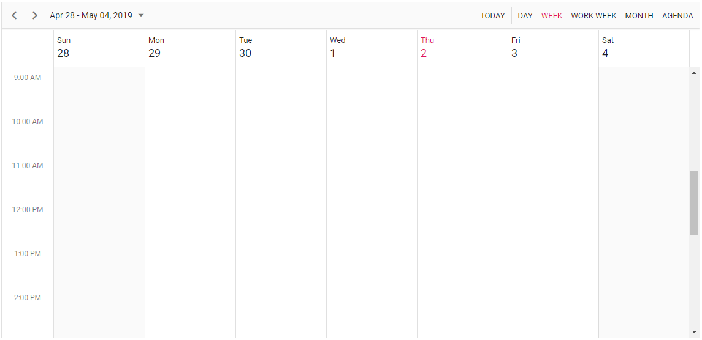

# Getting Started with Blazor Scheduler Component

This section briefly explains about how to include a simple Scheduler Component in your Blazor Server-Side and Client-Side application. You can refer to our Getting Started with [Blazor Server-Side Scheduler](../getting-started/blazor-server-side-visual-studio-2019/) and [Blazor WebAssembly Scheduler](how-to/blazor-web-assembly-scheduler) documentation pages for configuration specifications..

To get start quickly with Blazor Scheduler, you can check on this video:



## Importing Syncfusion Blazor component in the application

You can use any one of the below standards to install the Syncfusion Blazor library in your application.

### Using Syncfusion Blazor individual NuGet Packages [New standard]

> Starting with Volume 4, 2020 (v18.4.0.30) release, Syncfusion provides [individual NuGet packages](https://blazor.syncfusion.com/documentation/nuget-packages/) for our Syncfusion Blazor components. We highly recommend this new standard for your Blazor production applications. Refer to [this section](https://blazor.syncfusion.com/documentation/nuget-packages/#benefits-of-using-individual-nuget-packages) to know the benefits of the individual NuGet packages.

1. Install **Syncfusion.Blazor.Schedule** NuGet package to the application using the `NuGet Package Manager`.

2. You can add the client-side style resources from [NuGet](https://blazor.syncfusion.com/documentation/appearance/themes#static-web-assets) package in the `<head>` element of the **~/Pages/_Host.cshtml** page.

    ```html
    <head>
        ....
        ....
        <link href="_content/Syncfusion.Blazor.Themes/bootstrap4.css" rel="stylesheet" />
    </head>
    ```

    W> `Syncfusion.Blazor` package should not be installed along with [individual NuGet packages](https://blazor.syncfusion.com/documentation/nuget-packages/). Hence, you have to add the above `Syncfusion.Blazor.Themes` static web assets (styles) in the application.

### Using Syncfusion.Blazor NuGet Package [Old standard]

W> If you prefer the above new standard (individual NuGet packages), then skip this section. Using both old and new standards in the same application will throw ambiguous compilation errors.

1. Install **Syncfusion.Blazor** NuGet package to the newly created application by using the `NuGet Package Manager`.

2. You can add the client-side style resources through CDN or from NuGet package in the `<head>` element of the **~/Pages/_Host.cshtml** page.

    ```html
    <head>
        ....
        ....
        <link href="_content/Syncfusion.Blazor/styles/bootstrap4.css" rel="stylesheet" />
         @*<link href="https://cdn.syncfusion.com/blazor/{{ site.blazorversion }}/styles/bootstrap4.css" rel="stylesheet" />*@
    </head>
    ```

    > For Internet Explorer 11 kindly refer the polyfills. Refer the [documentation](../common/how-to/render-blazor-server-app-in-ie/) for more information.

    ```html
        <head>
            ...
                <link href="https://cdn.syncfusion.com/blazor/{{ site.blazorversion }}/styles/bootstrap4.css" rel="stylesheet" />
                <script src="https://github.com/Daddoon/Blazor.Polyfill/releases/download/3.0.1/blazor.polyfill.min.js"></script>
            ...
        </head>
    ```

## Adding component package to the application

Open `~/_Imports.razor` file and import the `Syncfusion.Blazor.Schedule` package.

```cshtml
@using Syncfusion.Blazor.Schedule
```

## Add SyncfusionBlazor service in Startup file

Open the **Startup.cs** file and add services required by Syncfusion components using  **services.AddSyncfusionBlazor()** method. Add this method in the **ConfigureServices** function as follows.

```csharp
using Syncfusion.Blazor;

namespace BlazorApplication
{
    public class Startup
    {
        ....
        ....
            public void ConfigureServices(IServiceCollection services)
        {
            ....
            ....
            services.AddSyncfusionBlazor();
        }
    }
}
```

## Initialize the Scheduler component

The [Blazor Scheduler](https://www.syncfusion.com/blazor-components/blazor-scheduler/) component can be rendered on the page by defining the `SfSchedule` tag helper. And also, define the required Scheduler views in the `ScheduleView` tag helper. Add the following code example to your `index.razor` page which is available within the `~/Pages/` folder, to initialize the Scheduler component.

```cshtml
@using Syncfusion.Blazor.Schedule

<SfSchedule TValue=AppointmentData>
    <ScheduleViews>
        <ScheduleView Option="View.Day"></ScheduleView>
        <ScheduleView Option="View.Week"></ScheduleView>
        <ScheduleView Option="View.WorkWeek"></ScheduleView>
        <ScheduleView Option="View.Month"></ScheduleView>
        <ScheduleView Option="View.Agenda"></ScheduleView>
    </ScheduleViews>
</SfSchedule>
@code {
    public class AppointmentData
    {
        public int Id { get; set; }
        public string Subject { get; set; }
        public string Location { get; set; }
        public DateTime StartTime { get; set; }
        public DateTime EndTime { get; set; }
        public string Description { get; set; }
        public bool IsAllDay { get; set; }
        public string RecurrenceRule { get; set; }
        public string RecurrenceException { get; set; }
        public Nullable<int> RecurrenceID { get; set; }
    }
}
```

The output of the above code will display the empty scheduler as shown in the following image.



## Populating appointments

To populate the Scheduler with appointments, bind the event data to it by assigning the `DataSource` property under `ScheduleEventSettings`.

```cshtml
@using Syncfusion.Blazor.Schedule

<SfSchedule TValue="AppointmentData" Height="650px" @bind-SelectedDate="@CurrentDate">
    <ScheduleEventSettings DataSource="@DataSource"></ScheduleEventSettings>
    <ScheduleViews>
        <ScheduleView Option="View.Day"></ScheduleView>
        <ScheduleView Option="View.Week"></ScheduleView>
        <ScheduleView Option="View.WorkWeek"></ScheduleView>
        <ScheduleView Option="View.Month"></ScheduleView>
        <ScheduleView Option="View.Agenda"></ScheduleView>
    </ScheduleViews>
</SfSchedule>

@code{
    DateTime CurrentDate = new DateTime(2020, 2, 14);
    List<AppointmentData> DataSource = new List<AppointmentData>
    {
        new AppointmentData { Id = 1, Subject = "Paris", StartTime = new DateTime(2020, 2, 13, 10, 0, 0) , EndTime = new DateTime(2020, 2, 13, 12, 0, 0) },
        new AppointmentData { Id = 2, Subject = "Germany", StartTime = new DateTime(2020, 2, 15, 10, 0, 0) , EndTime = new DateTime(2020, 2, 15, 12, 0, 0) }
    };
    public class AppointmentData
    {
        public int Id { get; set; }
        public string Subject { get; set; }
        public string Location { get; set; }
        public DateTime StartTime { get; set; }
        public DateTime EndTime { get; set; }
        public string Description { get; set; }
        public bool IsAllDay { get; set; }
        public string RecurrenceRule { get; set; }
        public string RecurrenceException { get; set; }
        public Nullable<int> RecurrenceID { get; set; }
    }
}
```

The scheduler with the appointments will be rendered as shown in the following image.


## Setting date

The [Blazor Scheduler](https://www.syncfusion.com/blazor-components/blazor-scheduler/) usually displays the system date as its current date. To change the current date of Scheduler with specific date, define the two-way binding for `SelectedDate` property.

```cshtml
@using Syncfusion.Blazor.Schedule

<SfSchedule TValue="AppointmentData" Height="650px" @bind-SelectedDate="@CurrentDate">
    <ScheduleViews>
        <ScheduleView Option="View.Day"></ScheduleView>
        <ScheduleView Option="View.Week"></ScheduleView>
        <ScheduleView Option="View.WorkWeek"></ScheduleView>
        <ScheduleView Option="View.Month"></ScheduleView>
        <ScheduleView Option="View.Agenda"></ScheduleView>
    </ScheduleViews>
</SfSchedule>
@code{
    DateTime CurrentDate = new DateTime(2020, 1, 10);
    public class AppointmentData
    {
        public int Id { get; set; }
        public string Subject { get; set; }
        public string Location { get; set; }
        public DateTime StartTime { get; set; }
        public DateTime EndTime { get; set; }
        public string Description { get; set; }
        public bool IsAllDay { get; set; }
        public string RecurrenceRule { get; set; }
        public string RecurrenceException { get; set; }
        public Nullable<int> RecurrenceID { get; set; }
    }
}
```

## Setting view

The Scheduler displays `Week` view by default. To change the current view, define the applicable view name to the two-way binding of `CurrentView` property. The applicable view names are,

* Day
* Week
* WorkWeek
* Month
* Agenda
* MonthAgenda
* TimelineDay
* TimelineWeek
* TimelineWorkWeek
* TimelineMonth
* TimelineYear
* Year

```cshtml
@using Syncfusion.Blazor.Schedule

<SfSchedule TValue="AppointmentData" Height="650px" @bind-CurrentView="@CurrentView">
    <ScheduleViews>
        <ScheduleView Option="View.Day"></ScheduleView>
        <ScheduleView Option="View.Week"></ScheduleView>
        <ScheduleView Option="View.WorkWeek"></ScheduleView>
        <ScheduleView Option="View.Month"></ScheduleView>
        <ScheduleView Option="View.Agenda"></ScheduleView>
    </ScheduleViews>
</SfSchedule>
@code{
    View CurrentView = View.Month;
    public class AppointmentData
    {
        public int Id { get; set; }
        public string Subject { get; set; }
        public string Location { get; set; }
        public DateTime StartTime { get; set; }
        public DateTime EndTime { get; set; }
        public string Description { get; set; }
        public bool IsAllDay { get; set; }
        public string RecurrenceRule { get; set; }
        public string RecurrenceException { get; set; }
        public Nullable<int> RecurrenceID { get; set; }
    }
}
```

## Individual view customization

Each individual Scheduler views can be customized with its own options such as setting different start and end hour on Week and Work Week views, whereas hiding the weekend days on Month view alone which can be achieved by defining the `ScheduleView`.

```cshtml
@using Syncfusion.Blazor.Schedule

<SfSchedule TValue="AppointmentData" Height="650px" @bind-SelectedDate="@CurrentDate">
    <ScheduleViews>
        <ScheduleView Option="View.Week" StartHour="07:00" EndHour="15:00"></ScheduleView>
        <ScheduleView Option="View.WorkWeek" StartHour="10:00" EndHour="18:00"></ScheduleView>
        <ScheduleView Option="View.Month" MaxEventsPerRow="2" ShowWeekend="false"></ScheduleView>
    </ScheduleViews>
</SfSchedule>
@code{
    DateTime CurrentDate = new DateTime(2020, 2, 13);
    public class AppointmentData
    {
        public int Id { get; set; }
        public string Subject { get; set; }
        public string Location { get; set; }
        public DateTime StartTime { get; set; }
        public DateTime EndTime { get; set; }
        public string Description { get; set; }
        public bool IsAllDay { get; set; }
        public string RecurrenceRule { get; set; }
        public string RecurrenceException { get; set; }
        public Nullable<int> RecurrenceID { get; set; }
    }
}
```

> You can refer to our [Blazor Scheduler](https://www.syncfusion.com/blazor-components/blazor-scheduler/) feature tour page for its groundbreaking feature representations. You can also explore our [Blazor Scheduler example](https://blazor.syncfusion.com/demos/scheduler/overview?theme=bootstrap4/) to understand how to manage appointments with multiple resources.

## See Also

1. [Getting Started with Syncfusion Blazor for client-side in .NET Core CLI](../getting-started/blazor-webassembly-dotnet-cli/)
2. [Getting Started with Syncfusion Blazor for client-side in Visual Studio 2019](../getting-started/blazor-webassembly-visual-studio-2019/)
3. [Getting Started with Syncfusion Blazor for server-side in .NET Core CLI](../getting-started/blazor-server-side-dotnet-cli/)