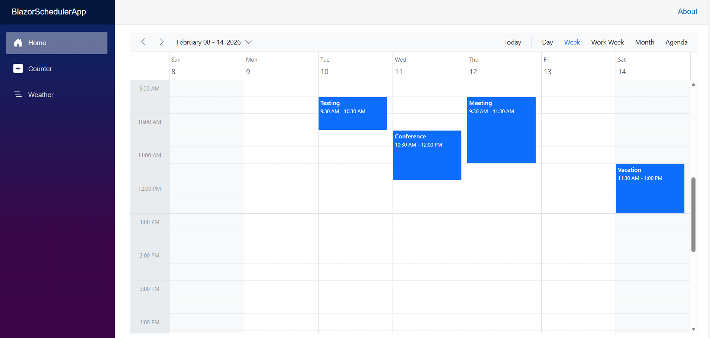

# Connect Syncfusion Blazor Scheduler with GraphQL using Hot Chocolate

GraphQL is a query language that allows applications to request exactly the data needed, nothing more and nothing less. Unlike traditional REST APIs that return fixed data structures, GraphQL enables the client to specify the shape and content of the response.

**Traditional REST APIs** and **GraphQL** differ mainly in how data is requested and returned: **REST APIs expose** multiple endpoints that return fixed data structures, often including unnecessary fields and requiring several requests to fetch related data, while **GraphQL** uses a single endpoint where queries define the exact fields needed, enabling precise responses and allowing related data to be retrieved efficiently in one request. This makes **GraphQL** especially useful for **Blazor Scheduler integration**, the **reason** is data‑centric UI components require well‑structured and selective datasets to support efficient operations, reduce network calls, and improve overall performance.

**Key GraphQL Concepts**

- **Queries**: A query is a request to read data. Queries do not modify data; they only retrieve it.
- **Mutations**: A mutation is a request to modify data. Mutations create, update, or delete records.
- **Resolvers**: Each query or mutation is handled by a resolver, which is a function responsible for fetching data or executing an operation. **Query resolvers** handle **read operations**, while **mutation resolvers** handle **write operations**.
- **Schema**: Defines the structure of the API. The schema describes available data types, the fields within those types, and the operations that can be executed. Query definitions specify how data can be retrieved, and mutation definitions specify how data can be modified. 

[Hot Chocolate](https://chillicream.com/docs/hotchocolate/v15) is an open‑source GraphQL server framework for .NET. Hot Chocolate enables the creation of GraphQL APIs using ASP.NET Core and integrates seamlessly with modern .NET applications, including Blazor.

## Prerequisites

Install the following software and packages before starting the process:

| Software/Package | Version | Purpose |
|-----------------|---------|---------|
| Visual Studio 2026 | 18.0 or later | Development IDE with Blazor workload |
| .NET SDK | net8.0 or compatible | Runtime and build tools |
| HotChocolate.AspNetCore | 15.1.12 or later | GraphQL server framework |
| Syncfusion.Blazor.Schedule | 32.2.4 | SCheduler component |
| Syncfusion.Blazor.Themes | 32.2.4 | Styling for Scheduler |

## Setting Up the GraphQL Backend

### Step 1: Create a New ASP.NET Core Empty Project as the GraphQL Server

Create a **Blazor Web App** using Visual Studio 2026 or .NET CLI.

**Using Visual Studio 2026 or later:**

1. Open **Visual Studio 2026** (or newer).
2. Go to **File → New → Project**.
3. Search for and select **ASP.NET Core Empty** (C#).
4. Name the project (example: `GraphQLServer`).
5. Select **.NET 8.0** as the target framework
6. Click **Create**

**Using .NET CLI:**
```bash
dotnet new web -o GraphQLServer
cd GraphQLServer
```

This creates a minimal ASP.NET Core app with just `Program.cs`.

### Step 2: Install the Required NuGet Package using .NET CLI

1. Open a terminal in the project directory and run:

    ```bash
    dotnet add package HotChocolate.AspNetCore --version 15.1.12
    ```

### Step 3: Configuring the GraphQL server app

1. Create GraphQLQuery and GraphQLMutation classes to define the GraphQL resolver and mutation methods, respectively.
2. Implement the following configuration code to set up GraphQL query and mutation types and enable CORS.

    [program.cs]
    ```csharp
    var builder = WebApplication.CreateBuilder(args); 

    builder.Services.AddGraphQLServer()
        .AddQueryType<GraphQLQuery>()
        .AddMutationType<GraphQLMutation>(); 

    builder.Services.AddCors(options => 
    { 
       options.AddPolicy("AllowSpecificOrigin", builder => 
       {
           builder.WithOrigins("http://localhost:xxxx") // xxxx represents Blazor app port no
           .AllowAnyHeader() 
            .AllowAnyMethod() 
            .AllowCredentials().Build(); 
        });
    });
    var app = builder.Build(); 

    app.UseCors("AllowSpecificOrigin");

    app.UseRouting();

    app.MapGraphQL();

    app.Run();
    ```
### Step 4: Create a Data Source for Appointments and define resolver

The following code creates a simple in-memory data source with a list of `Appointment` objects in the `GraphQLQuery` class and define the return type to bind data to the Blazor Scheduler, the resolver must return data using the `ReturnType<T>` class with `Count`, `Result`, and `Aggregates` properties.  
This data will be used to populate the Blazor Scheduler.

[`GraphQLQuery.cs`]

```csharp
public class GraphQLQuery
{
    public static List<Appointment> Appointments { get; set; } = GetAppointmentsList();

    private static List<Appointment> GetAppointmentsList()
    {
        var data = new List<Appointment>();

        // IST offset (UTC+5:30)
        var istOffset = TimeSpan.FromHours(5.5);

        data.Add(new Appointment()
        {
            Id = 1,
            Subject = "Testing",
            StartTime = new DateTime(2026, 2, 10, 9, 30, 0) - istOffset,
            EndTime = new DateTime(2026, 2, 10, 10, 30, 0) - istOffset
        });

        data.Add(new Appointment()
        {
            Id = 2,
            Subject = "Conference",
            StartTime = new DateTime(2026, 2, 11, 10, 30, 0) - istOffset,
            EndTime = new DateTime(2026, 2, 11, 12, 0, 0) - istOffset
        });

        data.Add(new Appointment()
        {
            Id = 3,
            Subject = "Meeting",
            StartTime = new DateTime(2026, 2, 12, 9, 30, 0) - istOffset,
            EndTime = new DateTime(2026, 2, 12, 11, 30, 0) - istOffset
        });

        data.Add(new Appointment()
        {
            Id = 4,
            Subject = "Vacation",
            StartTime = new DateTime(2026, 2, 14, 11, 30, 0) - istOffset,
            EndTime = new DateTime(2026, 2, 14, 13, 0, 0) - istOffset
        });

        return data;
    }
    public ReturnType<Appointment> AppointmentsData(DataManagerRequest dataManager)
    {
        IEnumerable<Appointment> result = Appointments;
        int count = result.Count();
        return dataManager.RequiresCounts ? new ReturnType<Appointment>() { Result = result, Count = count } : new ReturnType<Appointment>() { Result = result };
    }
}
```
**Explanation**

- Appointments is a static list that holds all appointment records.
- GetAppointmentsList() creates sample data with 4 appointments in February 2026.
- Dates are adjusted to IST (Indian Standard Time) by subtracting the 5.5-hour offset from UTC.
- This in-memory list serves as your data source — later you can replace it with a database or external service.
- The Scheduler will read from this list via the GraphQL query resolver.

### Step 5: Return data with required format
To bind data to the Blazor Scheduler component, the resolver function must return the data in a specific structure using the `ReturnType<T>` class.This class tells the Scheduler how many appointments exist (`Count`) and which appointments to show (`Result`).

[ReturnType.cs]
```csharp
public class ReturnType<T>	
{
    public int Count { get; set; }
    public IEnumerable<T> Result { get; set; }
}
```
**Why this format is required**

- Count - Tells the Scheduler how many appointments match the current view/date range.
- Result - The actual list of appointments the Scheduler will show as events on the calendar.

### Step 6: Create resolver function argument classes
The GraphQL query will be passed from the Scheduler with the dataManager property. So, to accept this parameter in the resolver function, we have to create the DataManagerRequest class, and the necessary classes required for the DataManagerRequest properties.

Refer to the following code examples.

[DataManagerRequest.cs]

DataManagerRequest class

```csharp
public class DataManagerRequest {
 [GraphQLName("Skip")] 
  public int Skip { get; set; }
  
  [GraphQLName("Take")] 
  public int Take { get; set; } 
  
  [GraphQLName("RequiresCounts")]
  public bool RequiresCounts { get; set; } = false; 
  
  [GraphQLName("Params")] 
  [GraphQLType(typeof(AnyType))] 
  public IDictionary<string, object> Params { get; set; } 
     
  [GraphQLName("Distinct")]
  public List<string>? Distinct { get; set; }
  
  [GraphQLName("ServerSideGroup")]
  public bool? ServerSideGroup { get; set; }
  
  [GraphQLName("LazyLoad")]
  public bool? LazyLoad { get; set; }
  
  [GraphQLName("LazyExpandAllGroup")]
  public bool? LazyExpandAllGroup { get; set; }
}
```

Appointment class

```csharp
public class Appointment
{
    [GraphQLName("Id")]
    public int Id { get; set; }
    
    [GraphQLName("Subject")]
    public string Subject { get; set; }
    
    [GraphQLName("Location")]
    public string? Location { get; set; }
    
    [GraphQLName("StartTime")]
    public DateTime StartTime { get; set; }

    [GraphQLName("EndTime")]
    public DateTime EndTime { get; set; }

    [GraphQLName("Description")]
    public string? Description { get; set; }
    
    [GraphQLName("IsAllDay")]
    public bool? IsAllDay { get; set; }

    [GraphQLName("RecurrenceRule")]
    public string? RecurrenceRule { get; set; }        

    [GraphQLName("RecurrenceException")]
    public string? RecurrenceException { get; set; }    

    [GraphQLName("RecurrenceID")]
    public int? RecurrenceID { get; set; }   
}
```
### Step 7: GraphQL Mutation Resolvers

A **GraphQL mutation resolver** is a method in the backend that handles write requests (data modifications) from the client. While queries only read data, mutations create, update, or delete records. When the Blazor Scheduler performs add, edit, or delete operations, it sends a GraphQL mutation to the server. The mutation resolver receives this request, processes it, and persists the changes to the data source.

In simple terms, a **GraphQL mutation** asks for a change, and a **resolver** is the one who makes it.

[GraphQLMutation.cs]

```csharp

public class GraphQLMutation
{
    // CREATE - Insert a new appointment
    public Appointment CreateAppointment(
        Appointment appointment,
        int index,
        string action,
        [GraphQLType(typeof(AnyType))] IDictionary<string, object>? additionalParameters)
    {
        if (appointment.Id <= 0)
        {
            appointment.Id = GraphQLQuery.Appointments
                .Select(a => a.Id)
                .DefaultIfEmpty(0)
                .Max() + 1;
        }
        GraphQLQuery.Appointments.Insert(index, appointment);
        return appointment;
    }

    // UPDATE - Update existing appointment by Id
    public Appointment UpdateAppointment(
        Appointment appointment,
        string action,
        string primaryColumnName,
        int primaryColumnValue,
        [GraphQLType(typeof(AnyType))] IDictionary<string, object>? additionalParameters)
    {
        var existing = GraphQLQuery.Appointments.FirstOrDefault(x => x.Id == primaryColumnValue);
        if (existing == null) return new Appointment();

        existing.Subject = appointment.Subject;
        existing.Location = appointment.Location;
        existing.StartTime = appointment.StartTime;
        existing.EndTime = appointment.EndTime;
        existing.Description = appointment.Description;
        existing.IsAllDay = appointment.IsAllDay;
        existing.RecurrenceID = appointment.RecurrenceID;
        existing.RecurrenceRule = appointment.RecurrenceRule ?? existing.RecurrenceRule;

        if (!string.IsNullOrEmpty(existing.RecurrenceRule))
        {
            var set = new HashSet<string>(StringComparer.Ordinal);
            if (!string.IsNullOrWhiteSpace(existing.RecurrenceException))
                foreach (var t in existing.RecurrenceException.Split(',', StringSplitOptions.RemoveEmptyEntries))
                    set.Add(t.Trim());
            if (!string.IsNullOrWhiteSpace(appointment.RecurrenceException))
                foreach (var t in appointment.RecurrenceException.Split(',', StringSplitOptions.RemoveEmptyEntries))
                    set.Add(t.Trim());

            existing.RecurrenceException = set.Count == 0 ? null : string.Join(",", set);
        }
        else
        {
            existing.RecurrenceException = appointment.RecurrenceException;
        }

        return existing;
    }

    // DELETE - Remove appointment by Id
    public Appointment DeleteAppointment(
        int primaryColumnValue,
        string action,
        string primaryColumnName,
        [GraphQLType(typeof(AnyType))] IDictionary<string, object>? additionalParameters)
    {
        var toDelete = GraphQLQuery.Appointments.FirstOrDefault(x => x.Id == primaryColumnValue);
        if (toDelete != null) GraphQLQuery.Appointments.Remove(toDelete);
        return toDelete ?? new Appointment();
    }

    // BATCH - Handle multiple adds, changes, deletes in one call 
    public List<Appointment> BatchAppointment(
        List<Appointment>? added,
        List<Appointment>? changed,
        List<Appointment>? deleted,
        string? action = null,
        string? primaryColumnName = null,
        [GraphQLType(typeof(AnyType))] IDictionary<string, object>? additionalParameters = null)
    {
        var results = new List<Appointment>();
        added ??= new List<Appointment>();
        changed ??= new List<Appointment>();
        deleted ??= new List<Appointment>();

        string? act = action;
        if (string.IsNullOrWhiteSpace(act) && additionalParameters != null)
        {
            if (additionalParameters.TryGetValue("currentAction", out var v1) && v1 is string s1 && !string.IsNullOrWhiteSpace(s1))
                act = s1;
            else if (additionalParameters.TryGetValue("requestType", out var v2) && v2 is string s2 && !string.IsNullOrWhiteSpace(s2))
                act = s2;
        }
        bool IsAction(string name) => !string.IsNullOrWhiteSpace(act) && act.Equals(name, StringComparison.OrdinalIgnoreCase);

        bool hasChangedParent = changed.Any(c =>
            !string.IsNullOrEmpty(c.RecurrenceRule) ||
            GraphQLQuery.Appointments.Any(p => p.Id == c.Id && !string.IsNullOrEmpty(p.RecurrenceRule)));

        bool hasDeletedEdited = deleted.Any(d => d.RecurrenceID.HasValue);
        bool isSeriesEdit = IsAction("EditSeries") || (hasChangedParent && hasDeletedEdited);

        // ---------------- DELETES ----------------
        foreach (var d in deleted)
        {
            var target = GraphQLQuery.Appointments.FirstOrDefault(a => a.Id == d.Id);
            if (target == null) continue;

            bool isEditedOccurrence = target.RecurrenceID.HasValue;
            bool isSeriesParent = !string.IsNullOrEmpty(target.RecurrenceRule);

            if (isSeriesEdit && isEditedOccurrence)
            {
                GraphQLQuery.Appointments.RemoveAll(a => a.Id == target.Id);

                var parent = GraphQLQuery.Appointments.FirstOrDefault(a => a.Id == target.RecurrenceID!.Value);
                if (parent != null && !string.IsNullOrWhiteSpace(parent.RecurrenceException))
                {
                    var tokens = parent.RecurrenceException
                        .Split(',', StringSplitOptions.RemoveEmptyEntries)
                        .Select(t => t.Trim())
                        .ToList();

                    var iso = (target.StartTime.Kind == DateTimeKind.Utc ? target.StartTime : target.StartTime.ToUniversalTime()).ToString("o");
                    tokens.RemoveAll(t => string.Equals(t, iso, StringComparison.Ordinal));

                    if (!string.IsNullOrWhiteSpace(target.RecurrenceException))
                    {
                        foreach (var tkn in target.RecurrenceException.Split(',', StringSplitOptions.RemoveEmptyEntries))
                        {
                            var tt = tkn.Trim();
                            tokens.RemoveAll(t => string.Equals(t, tt, StringComparison.Ordinal));
                        }
                    }

                    parent.RecurrenceException = tokens.Count == 0 ? null : string.Join(",", tokens);
                }

                results.Add(target);
                continue;
            }

            if (isEditedOccurrence && IsAction("DeleteOccurrence"))
            {
                GraphQLQuery.Appointments.RemoveAll(a => a.Id == target.Id);
                results.Add(target);
                continue;
            }

            if (isSeriesParent && IsAction("DeleteSeries"))
            {
                var removed = GraphQLQuery.Appointments
                    .Where(a => a.Id == target.Id || a.RecurrenceID == target.Id)
                    .ToList();

                GraphQLQuery.Appointments.RemoveAll(a => a.Id == target.Id || a.RecurrenceID == target.Id);
                results.AddRange(removed);
                continue;
            }

            if (!isSeriesEdit)
            {
                GraphQLQuery.Appointments.RemoveAll(a => a.Id == target.Id);
                results.Add(target);
            }
        }

        // ---------------- UPDATES ----------------
        foreach (var u in changed)
        {
            var existing = GraphQLQuery.Appointments.FirstOrDefault(x => x.Id == u.Id);

            if (existing == null)
            {
                if (u.Id <= 0)
                    u.Id = GraphQLQuery.Appointments.Select(a => a.Id).DefaultIfEmpty(0).Max() + 1;

                GraphQLQuery.Appointments.Add(u);
                results.Add(u);
                continue;
            }

            bool isParent = !string.IsNullOrEmpty(existing.RecurrenceRule) || !string.IsNullOrEmpty(u.RecurrenceRule);

            existing.Subject = u.Subject ?? existing.Subject;
            existing.Location = u.Location ?? existing.Location;
            existing.StartTime = u.StartTime;
            existing.EndTime = u.EndTime;
            existing.Description = u.Description ?? existing.Description;
            existing.IsAllDay = u.IsAllDay ?? existing.IsAllDay;
            existing.RecurrenceRule = u.RecurrenceRule ?? existing.RecurrenceRule;

            if (isParent)
            {
                if (!isSeriesEdit)
                    existing.RecurrenceException = u.RecurrenceException ?? existing.RecurrenceException;
            }
            else
            {
                existing.RecurrenceException = u.RecurrenceException ?? existing.RecurrenceException;
            }

            existing.RecurrenceID = u.RecurrenceID ?? existing.RecurrenceID;
            results.Add(existing);
        }

        // ---------------- ADDS ----------------
        foreach (var a in added)
        {
            if (a.Id <= 0)
            {
                a.Id = GraphQLQuery.Appointments
                    .Select(x => x.Id)
                    .DefaultIfEmpty(0)
                    .Max() + 1;
            }
            GraphQLQuery.Appointments.Add(a);
            results.Add(a);
        }

        return results;
    }
}
```
A mutation resolver is a C# method decorated with GraphQL attributes that:

- **Receives input parameters** from the Scheduler (new/modified appointment data, primary key value, etc.).
- **Processes the operation** (validation, time conflict checks, data modification).
- **Persists changes** to the data source (in-memory list, database, file, external service).
- **Returns results** to the client (updated appointment record or success/failure status).

**Typical operations handled by mutation resolvers in Scheduler:**

| Operation       | Triggered when...                                 | Resolver method example     | Primary parameters received                     |
|-----------------|---------------------------------------------------|-----------------------------|-------------------------------------------------|
| **Create**      | User clicks "Add" or double-clicks to create     | `CreateAppointment`         | `appointment` (new record), `index`, `action`   |
| **Update**      | User edits an existing appointment and saves     | `UpdateAppointment`         | `appointment` (updated record), `primaryColumnValue` (Id), `primaryColumnName` |
| **Delete**      | User selects appointment and clicks "Delete"     | `DeleteAppointment`         | `primaryColumnValue` (Id), `primaryColumnName`  |
| **BatchUpdate** |Editing/deleting **single occurrence** of recurring event<br>| `BatchAppointment`          | `added`: [AppointmentInput!]<br>`changed`: [AppointmentInput!]<br>`deleted`: [AppointmentInput!]<br>`action`: String (optional, e.g. "batch")<br>`primaryColumnName`: String (optional)<br>`additionalParameters`: Any (optional) |

The GraphQL Mutation class has been successfully created and is ready to handle all data modification operations from the Syncfusion Blazor Scheduler.

---

## Integrating Syncfusion Blazor Scheduler

### Step 1: Create a Blazor Web App

Create a **Blazor Web App** using Visual Studio 2026 or .NET CLI.

**Using Visual Studio 2026 or later:**
1. Open Visual Studio 2026
2. Click **Create a new project**
3. Search for **Blazor Web App** template
4. Configure project name as **BlazorSchedulerApp**
5. Select **.NET 8.0** as the target framework
6. Set **Interactive render mode** to **Server**
7. Set **Interactivity location** to **Per page/component**
8. Click **Create**

**Using .NET CLI:**
```bash
dotnet new blazor -n BlazorSchedulerApp --interactivity Server
cd BlazorSchedulerApp
```

> Configure the Interactive render mode to **InteractiveServer** during project creation as the Scheduler requires interactivity for CRUD operations.

### Step 2: Install Required NuGet Packages and Configure Blazor Scheduler Component with GraphQL

Before installing the necessary NuGet packages, a new Blazor Web Application must be created using the default template. This template automatically generates essential starter files—such as `Program.cs`, `appsettings.json`, the `wwwroot` folder, and the `Components` folder.

For this guide, a Blazor application named **BlazorSchedulerApp** has been created. Once the project is set up, the next step involves installing the required NuGet packages. NuGet packages are software libraries that add functionality to the application.

#### Using .NET CLI

Open a terminal in the project directory and run:

```bash
dotnet add package Syncfusion.Blazor.Schedule
dotnet add package Syncfusion.Blazor.Themes
```

#### Project File Reference

The installed packages are reflected in the `BlazorSchedulerApp.csproj` file:

```xml
<ItemGroup>
    <PackageReference Include="Syncfusion.Blazor.Schedule" Version="32.2.4" />
    <PackageReference Include="Syncfusion.Blazor.Themes" Version="32.2.4" />
</ItemGroup>
```

All required packages are now installed.

> **Note**: After installing packages, build the project to ensure all dependencies are restored correctly: `dotnet build`

#### Import the required namespaces in the `Components/_Imports.razor` file:

```csharp
@using Syncfusion.Blazor
@using Syncfusion.Blazor.Schedule
@using Syncfusion.Blazor.Data
```

#### Add the Syncfusion stylesheet and scripts in the `Components/App.razor` file. Find the `<head>` section and add:

```html
<!-- Syncfusion Blazor Stylesheet -->
<link href="_content/Syncfusion.Blazor.Themes/bootstrap5.3.css" rel="stylesheet" />

<!-- Syncfusion Blazor Scripts -->
<script src="_content/Syncfusion.Blazor.Core/scripts/syncfusion-blazor.min.js" type="text/javascript"></script>
```
For this project, the bootstrap5.3 theme is used. A different theme can be selected or the existing theme can be customized based on project requirements. Refer to the [Syncfusion Blazor Components Appearance](https://blazor.syncfusion.com/documentation/appearance/themes) documentation to learn more about theming and customization options.

#### Register Syncfusion<sup style="font-size:70%">&reg;</sup> Blazor Service

Register the Syncfusion<sup style="font-size:70%">&reg;</sup> Blazor Service in the **Program.cs** file of your Blazor Web App.

```csharp
using Syncfusion.Blazor;

var builder = WebApplication.CreateBuilder(args);

// Add services to the container.
builder.Services.AddRazorComponents()
    .AddInteractiveServerComponents()
    .AddInteractiveWebAssemblyComponents();

builder.Services.AddSyncfusionBlazor();

var app = builder.Build();

```

Syncfusion components are now configured and ready to use. For additional guidance, refer to the Scheduler component’s [getting‑started](https://blazor.syncfusion.com/documentation/scheduler/getting-started-webapp) documentation.

### Step 3: Create the Data Model

A data model is a C# class that represents the structure of a database table. This model defines the properties that correspond to the columns in the `Appointments` table.

```csharp

public class Appointment
{
    public int Id { get; set; }

    public string Subject { get; set; }

    public string? Location { get; set; }

    public DateTime StartTime { get; set; }

    public DateTime EndTime { get; set; }

    public string? Description { get; set; }

    public bool? IsAllDay { get; set; }

    public string? RecurrenceRule { get; set; }

    public string? RecurrenceException { get; set; }

    public int? RecurrenceID { get; set; }
}
```

#### Explanation:

- The `[Key]` attribute marks the `Id` property as the primary key (a unique identifier for each record).
- Each property represents a column in the database table.
- The `?` symbol indicates that a property is nullable (can be empty).

The data model has been successfully created.

### Step 4: Update the Blazor Scheduler

The `Home.razor` component will display the appointment data in a Syncfusion Blazor Scheduler with CRUD operations capabilities.

**Instructions:**

1. Open the file named `Home.razor` in the `Components/Pages` folder.
2. Add the following code to create a basic Scheduler:
[Home.razor]

    ```cshtml
    @page "/"
    @rendermode InteractiveServer
    
    <SfSchedule TValue="Appointment" 
                 @bind-SelectedDate="@CurrentDate" 
                 Width="100%" 
                 Height="650px">
        
        <ScheduleViews>
            <ScheduleView Option="View.Day"></ScheduleView>
            <ScheduleView Option="View.Week"></ScheduleView>
            <ScheduleView Option="View.WorkWeek"></ScheduleView>
            <ScheduleView Option="View.Month"></ScheduleView>
            <ScheduleView Option="View.Agenda"></ScheduleView>
        </ScheduleViews>
    
        <ScheduleEventSettings TValue="Appointment" AllowEditFollowingEvents="true">
            <SfDataManager Url="http://localhost:5070/graphql"
                           Adaptor="Adaptors.GraphQLAdaptor"
                           GraphQLAdaptorOptions="@adaptorOptions">
            </SfDataManager>
        </ScheduleEventSettings>
    
    </SfSchedule>
    
    @code {
        // GraphQLAdaptorOptions will be added in the next step
    }
    ```

### Component Explanation:

- **`@rendermode InteractiveServer`**: Enables interactive server-side rendering for the component, allowing real-time updates and user interactions (such as adding, editing, or deleting appointments) without full page reloads.
- **`<SfSchedule>`**: The main Scheduler component that displays appointments in various calendar views (Day, Week, Work Week, Month, Agenda, etc.).
- **`<ScheduleViews>`**: Defines the available view options for the Scheduler. Each `<ScheduleView>` specifies a supported calendar layout (e.g., Day, Week, Month).
- **`<ScheduleEventSettings>`**: Configures how events (appointments) are bound and managed. This is where data binding (via `SfDataManager`) and CRUD settings are typically placed.


The `SfDataManager` component connects the Scheduler to the GraphQL backend using the adaptor options configured below:

```cshtml
<SfDataManager Url="http://localhost:xxxx/graphql" 
               GraphQLAdaptorOptions="@adaptorOptions" 
               Adaptor="Adaptors.GraphQLAdaptor"> // xxxx repesents backend port no
</SfDataManager>
```

**Component Attributes Explained:**

| Attribute | Purpose | Value |
|-----------|---------|-------|
| `Url` | GraphQL endpoint location | `http://localhost:5070/graphql` (must match backend port) |
| `GraphQLAdaptorOptions` | References the adaptor configuration object | `@adaptorOptions` (defined in next heading) |
| `Adaptor` | Specifies adaptor type to use | `Adaptors.GraphQLAdaptor` (tells Syncfusion to use GraphQL adaptor) |

---

### Step 5: Configure GraphQL Adaptor and Data Binding

The GraphQL adaptor is a bridge that connects the Syncfusion Blazor Scheduler with the GraphQL backend. The adaptor translates Scheduler operations into GraphQL queries and mutations. When the user interacts with the Scheduler, the adaptor automatically sends the appropriate GraphQL request to the backend, receives the response, and updates the Scheduler display.

**What is a GraphQL Adaptor?**

An adaptor is a translator between two different systems. The GraphQL adaptor specifically:

- Receives interaction events generated by the Scheduler, including Add, Edit, Delete operations.
- Converts these actions into GraphQL query or mutation syntax.
- Sends the **GraphQL request** to the backend **GraphQL endpoint**.
- Receives the response data from the backend.
- Formats the response back into a structure the Scheduler understands.
- Updates the Scheduler display with the new data.

The adaptor enables bidirectional communication between the frontend (Scheduler) and backend (GraphQL server).

---

**GraphQL Adaptor Configuration**

The `@code` block in `Home.razor` contains C# code that configures how the adaptor behaves. This configuration is critical because it defines:

- Which GraphQL query to use for reading data.
- Which GraphQL mutations to use for creating, updating, and deleting data.
- How to connect to the GraphQL backend endpoint.

**Instructions:**

1. Open the `Home.razor` file located at `Components/Pages/Home.razor`.
2. Scroll to the `@code` block at the bottom of the file.
3. Add the following complete configuration:

    [Home.razor]
    ```csharp
    @code {
      private DateTime CurrentDate = new DateTime(2026, 2, 12);
      /// <summary>
      /// GraphQLAdaptorOptions configures how the Scheduler communicates with the GraphQL backend.
      /// This object contains the query, mutation operations, and endpoint URL.
      /// </summary>
      private GraphQLAdaptorOptions adaptorOptions = new GraphQLAdaptorOptions
      {
        Query = @"
                query appointmentsData($dataManager: DataManagerRequestInput!){
                    appointmentsData(dataManager: $dataManager) {
                        count,
                        result { 
                            Id, 
                            Subject, 
                            Location, 
                            StartTime, 
                            EndTime, 
                            Description, 
                            IsAllDay,
                            RecurrenceRule,
                            RecurrenceException,
                            RecurrenceID
    
                        }
                    }
                }",
    
        Mutation = new GraphQLMutation
        {
          Insert = @"
                    mutation create($record: AppointmentInput!, $index: Int!, $action: String!, $additionalParameters: Any) {
                      createAppointment(appointment: $record, index: $index, action: $action, additionalParameters: $additionalParameters) {
                        Id, Subject, Location, StartTime, EndTime, Description, IsAllDay,RecurrenceRule,RecurrenceException,RecurrenceID
                      }
                    }",
    
          Update = @"
                    mutation update($record: AppointmentInput!, $action: String!, $primaryColumnName: String!, $primaryColumnValue: Int!, $additionalParameters: Any) {
                      updateAppointment(appointment: $record, action: $action, primaryColumnName: $primaryColumnName, primaryColumnValue: $primaryColumnValue, additionalParameters: $additionalParameters) {
                        Id, Subject, Location, StartTime, EndTime, Description, IsAllDay,RecurrenceRule,RecurrenceException,RecurrenceID
                      }
                    }",
    
          Delete = @"
                    mutation delete($primaryColumnValue: Int!, $action: String!, $primaryColumnName: String!, $additionalParameters: Any) {
                      deleteAppointment(primaryColumnValue: $primaryColumnValue, action: $action, primaryColumnName: $primaryColumnName, additionalParameters: $additionalParameters) {
                        Id, Subject, Location, StartTime, EndTime, Description, IsAllDay,RecurrenceRule,RecurrenceException,RecurrenceID
                      }
                    }",
          Batch = @"
        mutation batch(
          $added: [AppointmentInput!],
          $changed: [AppointmentInput!],
          $deleted: [AppointmentInput!], 
          $action: String,
          $primaryColumnName: String,
          $additionalParameters: Any
        ) {
          batchAppointment(
            added: $added,
            changed: $changed,
            deleted: $deleted,
            action: $action,
            primaryColumnName: $primaryColumnName,
            additionalParameters: $additionalParameters
          ) {
            Id
            Subject
            Location
            StartTime
            EndTime
            Description
            IsAllDay
            RecurrenceRule
            RecurrenceException
            RecurrenceID
          }
        }"
        },
    
    
        ResolverName = "AppointmentsData"
      };
    }
    ```
**GraphQL Query Structure Explained in Detail**

The Query property is critical for understanding how data flows. Let's break down each component:

```
query appointmentsData($dataManager: DataManagerRequestInput!){}
```

**Line Breakdown:**
- `query` - GraphQL keyword indicating a read operation
- `appointmentsData` - Name of the query (must match resolver name with camelCase)
- `($dataManager: DataManagerRequestInput!)` - Parameter declaration
  - `$dataManager` - Variable name (referenced as $dataManager throughout the query)
  - `: DataManagerRequestInput!` - Type specification
  - `!` - Exclamation mark means this parameter is **required** (not optional)

```
appointmentsData(dataManager: $dataManager) {}
```

**Line Breakdown:**
- `appointmentsData(...)` - Calls the resolver method in backend
- `dataManager: $dataManager` - Passes the $dataManager variable to the resolver

    ```
    count
    result {
        Id, 
        Subject, 
        Location, 
        StartTime, 
        EndTime, 
        Description, 
        IsAllDay
    }
    ```
- **`count`**  
  Returns the **total number of appointments** that match the current query criteria.  
  - Example: If 30 total appointments exist in the visible date range, `count = 30`.  
  - The Scheduler uses this to understand the scope of data (though it usually loads only the visible window and relies on date-range filtering).

- **`result`**  
  Contains the **array of appointment records** that match the current request (typically filtered by the visible date range).  
  - `{ ... }` — List of fields to return for each appointment.  
  - **Each field must exactly match** the property names in your C# `Appointment` class (case-sensitive).  
  - Only the requested fields are returned (no over-fetching).  
  - The Scheduler binds these fields directly to render events on the calendar:  
    - `Id` → unique identifier  
    - `Subject` → event title  
    - `Location` → optional event location  
    - `StartTime` / `EndTime` → event timing (must be ISO 8601 format)  
    - `Description` → optional event details  
    - `IsAllDay` → determines if the event spans the full day
    - `RecurrenceRule` → string that defines the repeat pattern (iCalendar RRULE format, e.g., "FREQ=DAILY;INTERVAL=1;COUNT=10").
    - `RecurrenceException` → string containing comma-separated dates/times (in UTC format like yyyyMMdd or yyyyMMddTHHmmssZ) to exclude from the series.
    - `RecurrenceID` → nullable integer (int?) that links an edited/deleted occurrence back to its parent recurring series.
---

**Response Structure Example**

When the backend executes the query, it returns a **JSON response** in this exact structure:

```json
{
  "data": {
    "appointmentsData": {
      "count": 4,
      "result": [
        {
          "Id": 1,
          "Subject": "Testing",
          "Location": null,
          "StartTime": "2026-02-10T09:30:00",
          "EndTime": "2026-02-10T10:30:00",
          "Description": null,
          "IsAllDay": false,
          "RecurrenceRule": null,
          "RecurrenceException": null,
          "RecurrenceID": null
        },
        {
          "Id": 2,
          "Subject": "Conference (Recurring)",
          "Location": null,
          "StartTime": "2026-02-11T10:30:00",
          "EndTime": "2026-02-11T12:00:00",
          "Description": null,
          "IsAllDay": false,
          "RecurrenceRule": "FREQ=DAILY;INTERVAL=1;COUNT=5",
          "RecurrenceException": null,
          "RecurrenceID": null
        },
        {
          "Id": 3,
          "Subject": "Meeting",
          "Location": null,
          "StartTime": "2026-02-12T09:30:00",
          "EndTime": "2026-02-12T11:30:00",
          "Description": null,
          "IsAllDay": false,
          "RecurrenceRule": null,
          "RecurrenceException": null,
          "RecurrenceID": null
        },
        {
          "Id": 4,
          "Subject": "Vacation",
          "Location": null,
          "StartTime": "2026-02-14T11:30:00",
          "EndTime": "2026-02-14T13:00:00",
          "Description": null,
          "IsAllDay": false,
          "RecurrenceRule": null,
          "RecurrenceException": null,
          "RecurrenceID": null
        }
      ]
    }
  }
}
```
**Response Structure Explanation:**

| Part | Purpose | Example |
|------|---------|---------|
| `data` | Root object containing the query result | Always present in successful response |
| `appointmentsData` | Matches the query name (camelCase) | Contains count and result |
| `count` | Total number of records available | 4 (in this example) |
| `result` | Array of AppointmentRecord objects | [ {...}, {...}, {...}, {...} ] |
| Each field in result | Matches GraphQL query field names | Field values from database |

**Understanding GraphQL Mutations for the Scheduler**

**What is a mutation?**  
A mutation is just a way to **change data** on the server — like adding a new appointment, editing one, or deleting one.

In your Scheduler app:

- When you **create** a new appointment → you use a **create** mutation.
- When you **edit** an existing appointment → you use an **update** mutation.
- When you **delete** an appointment → you use a **delete** mutation.
- When you **create**, **edit**, and **delete** collections of an appointment → you use a **batch** mutation.

## Running the Application

**Build the Application**

1. Open the terminal.
2. Navigate to the **GraphQL server project** directory (e.g., `GraphQLServer`)..
3. Run the following command:

    ```powershell
    dotnet build
    ```
4. Navigate to the **Blazor App project** directory (e.g., `BlazorSchedulerApp`) and Build the Blazor project:
    ```powershell
    dotnet build
    ```
**Run the Application**

1. First, run the GraphQL server (this must be running before the Blazor app):
    - Navigate to the GraphQL server project folder(e.g., GraphQLServer).
    - Execute:


    ```powershell
    dotnet run
    ```
- Now listening on: http://localhost:5070 (or similar — check the console output)
- Note the HTTP port (e.g. 5070) — you'll need it for the Blazor app.


2. In a separate terminal, run the Blazor Scheduler application:
    - Navigate to the Blazor project folder (e.g., BlazorSchedulerApp).
    - Execute:


    ```powershell
        dotnet run
    ```
- The Blazor app will typically start on http://localhost:5194 (or similar — check the console output).

**Access the Application**

1. Open a web browser.
2. Navigate to `https://localhost:5194` (or the port shown in the terminal).
3. The Scheduler Application is now running and ready to use.

    

---

## Complete Sample Repository

A complete, working sample implementation is available in the [GitHub repository](https://github.com/SyncfusionExamples/How-to-integrate-Syncfusion-Blazor-Scheduler-with-GraphQL).

---
## Summary

This guide demonstrates how to:

1. Setting Up the GraphQL Backend. [🔗](#setting-up-the-graphql-backend)
2. Integrating Syncfusion Blazor Scheduler. [🔗](#integrating-syncfusion-blazor-scheduler)
3. Running the Application. [🔗](#running-the-application)
4. Complete Sample Repository. [🔗](#complete-sample-repository)

The application now provides a complete solution for managing Appointments with a modern Syncfusion Blazor Scheduler integrated with a Hot Chocolate GraphQL backend.