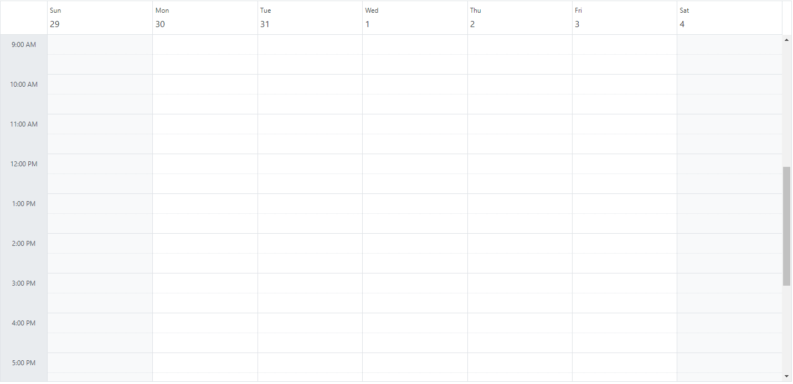
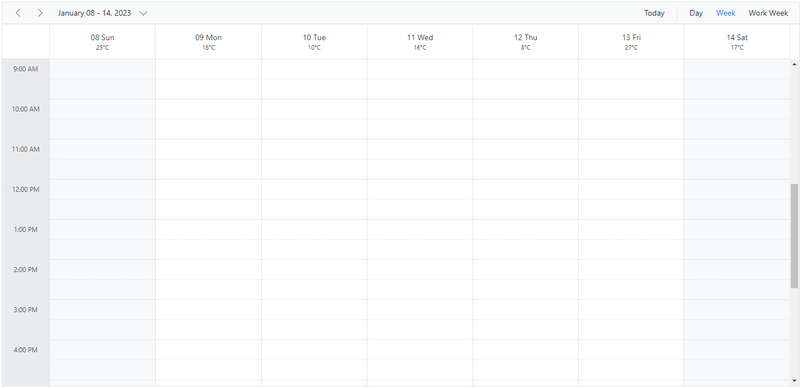

# Header Customization in Blazor Scheduler Component

The header part of Scheduler can be customized easily with the built-in options available.

## Show or Hide header bar

By default, the header bar holds the date and view navigation options, through which the user can switch between the dates and various views. This header bar can be hidden from the UI by setting `false` to the [`ShowHeaderBar`](https://help.syncfusion.com/cr/blazor/Syncfusion.Blazor.Schedule.SfSchedule-1.html#Syncfusion_Blazor_Schedule_SfSchedule_1_ShowHeaderBar) property. It's default value is `true`.

```cshtml
@using Syncfusion.Blazor.Schedule

<SfSchedule TValue="AppointmentData" ShowHeaderBar="false" Height="550px" @bind-SelectedDate="@CurrentDate">
    <ScheduleViews>
        <ScheduleView Option="View.Day"></ScheduleView>
        <ScheduleView Option="View.Week"></ScheduleView>
        <ScheduleView Option="View.WorkWeek"></ScheduleView>
        <ScheduleView Option="View.Month"></ScheduleView>
        <ScheduleView Option="View.Agenda"></ScheduleView>
    </ScheduleViews>
</SfSchedule>

@code{
    DateTime CurrentDate = new DateTime(2023, 1, 31);
    public class AppointmentData
    {
        public int Id { get; set; }
        public string Subject { get; set; }
        public string Location { get; set; }
        public DateTime StartTime { get; set; }
        public DateTime EndTime { get; set; }
        public string Description { get; set; }
        public bool IsAllDay { get; set; }
        public string RecurrenceRule { get; set; }
        public string RecurrenceException { get; set; }
        public Nullable<int> RecurrenceID { get; set; }
    }
}
```



## How to Display the View Options Within the Header Bar Popup

By default, the header bar holds the view navigation options, through which users can switch between various views. These view options can be moved to the header bar popup by setting [`EnableAdaptiveUI`](https://help.syncfusion.com/cr/blazor/Syncfusion.Blazor.Schedule.SfSchedule-1.html#Syncfusion_Blazor_Schedule_SfSchedule_1_EnableAdaptiveUI) property to `true`.

```cshtml
@using Syncfusion.Blazor.Schedule

<SfSchedule TValue="AppointmentData" EnableAdaptiveUI="true" Height="550px" @bind-SelectedDate="@CurrentDate">
 <ScheduleEventSettings DataSource="@DataSource"></ScheduleEventSettings>
    <ScheduleViews>
        <ScheduleView Option="View.Day"></ScheduleView>
        <ScheduleView Option="View.Week"></ScheduleView>
        <ScheduleView Option="View.WorkWeek"></ScheduleView>
        <ScheduleView Option="View.Month"></ScheduleView>
        <ScheduleView Option="View.Agenda"></ScheduleView>
    </ScheduleViews>
</SfSchedule>

@code{
    DateTime CurrentDate = new DateTime(2023, 6, 30);
     List<AppointmentData> DataSource = new List<AppointmentData>
    {
        new AppointmentData { Id = 1, Subject = "Meeting", StartTime = new DateTime(2023, 6, 30, 9, 30, 0) , EndTime = new DateTime(2023, 6, 30, 12, 0, 0) }
    };
    public class AppointmentData
    {
        public int Id { get; set; }
        public string Subject { get; set; }
        public string Location { get; set; }
        public DateTime StartTime { get; set; }
        public DateTime EndTime { get; set; }
        public string Description { get; set; }
        public bool IsAllDay { get; set; }
        public string RecurrenceRule { get; set; }
        public string RecurrenceException { get; set; }
        public Nullable<int> RecurrenceID { get; set; }
    }
}
```


The Scheduler with view options within the header bar popup will be rendered as shown in the following image.


N> Refer [here](./resources#adaptive-ui-in-desktop) to know more about adaptive UI in resources scheduler.

## Date Header Customization

The Scheduler UI elements that display date text on all views are considered date header cells. The date header cells of the Scheduler can be customized using [`DateHeaderTemplate`](https://help.syncfusion.com/cr/blazor/Syncfusion.Blazor.Schedule.ScheduleTemplates.html#Syncfusion_Blazor_Schedule_ScheduleTemplates_DateRangeTemplate ). The [`DateHeaderTemplate`](https://help.syncfusion.com/cr/blazor/Syncfusion.Blazor.Schedule.ScheduleTemplates.html#Syncfusion_Blazor_Schedule_ScheduleTemplates_DateRangeTemplate) option is used to customize the date header cells of day, week and work-week views.

```cshtml
@using Syncfusion.Blazor.Schedule
@using System.Globalization

<SfSchedule TValue="AppointmentData" Width="100%" CssClass="schedule-date-header-template" Height="650px" @bind-SelectedDate="@CurrentDate">
    <ScheduleTemplates>
        <DateHeaderTemplate>
            <div class="date-text">@(getDateHeaderText((context as TemplateContext).Date))</div>
            @{
                @switch ((int)(context as TemplateContext).Date.DayOfWeek)
                {
                    case 0:
                        <div class="weather-text">25&deg;C</div>
                        break;
                    case 1:
                        <div class="weather-text">18&deg;C</div>
                        break;
                    case 2:
                        <div class="weather-text">10&deg;C</div>
                        break;
                    case 3:
                        <div class="weather-text">16&deg;C</div>
                        break;
                    case 4:
                        <div class="weather-text">8&deg;C</div>
                        break;
                    case 5:
                        <div class="weather-text">27&deg;C</div>
                        break;
                    case 6:
                        <div class="weather-text">17&deg;C</div>
                        break;
                }
            }
        </DateHeaderTemplate>
    </ScheduleTemplates>
    <ScheduleViews>
        <ScheduleView Option="View.Day"></ScheduleView>
        <ScheduleView Option="View.Week"></ScheduleView>
        <ScheduleView Option="View.WorkWeek"></ScheduleView>
    </ScheduleViews>
</SfSchedule>

@code {
    DateTime CurrentDate = new DateTime(2023, 1, 10);
    public static string getDateHeaderText(DateTime date)
    {
        return date.ToString("dd ddd", CultureInfo.CurrentCulture);
    }
    public class AppointmentData
    {
        public int Id { get; set; }
        public string Subject { get; set; }
        public string Location { get; set; }
        public DateTime StartTime { get; set; }
        public DateTime EndTime { get; set; }
        public string Description { get; set; }
        public bool IsAllDay { get; set; }
        public string RecurrenceRule { get; set; }
        public string RecurrenceException { get; set; }
        public Nullable<int> RecurrenceID { get; set; }
    }
}
<style>
    .schedule-date-header-template.e-schedule .e-vertical-view .e-header-cells {
        padding: 0;
        text-align: center !important;
    }

    .schedule-date-header-template.e-schedule .date-text {
        font-size: 14px;
    }

    .schedule-date-header-template.e-schedule.e-device .date-text {
        font-size: 12px;
    }

    .schedule-date-header-template.e-schedule .weather-image {
        width: 20px;
        height: 20px;
        background-position: center center;
        background-repeat: no-repeat;
        background-size: cover;
    }

    .schedule-date-header-template.e-schedule .weather-text {
        font-size: 11px;
    }
</style>
```
 



### Customization Using OnRenderCell Event

The date header can be customized by using [`OnRenderCell`](https://help.syncfusion.com/cr/blazor/Syncfusion.Blazor.Schedule.ScheduleEvents-1.html#Syncfusion_Blazor_Schedule_ScheduleEvents_1_OnRenderCell) event. In the [`OnRenderCell`](https://help.syncfusion.com/cr/blazor/Syncfusion.Blazor.Schedule.ScheduleEvents-1.html#Syncfusion_Blazor_Schedule_ScheduleEvents_1_OnRenderCell), the argument `RenderCellEventArgs` returns the `ElementType` as `DateHeader` when the date header is rendering.

```cshtml
@using Syncfusion.Blazor.Schedule

<SfSchedule TValue="AppointmentData" Width="100%" Height="550px" @bind-SelectedDate="@CurrentDate">
    <ScheduleEvents TValue="AppointmentData" OnRenderCell="OnRenderCell"></ScheduleEvents>
    <ScheduleEventSettings DataSource="@DataSource"></ScheduleEventSettings>
    <ScheduleViews>
        <ScheduleView Option="View.Day"></ScheduleView>
        <ScheduleView Option="View.Week"></ScheduleView>
        <ScheduleView Option="View.WorkWeek"></ScheduleView>
        <ScheduleView Option="View.Month"></ScheduleView>
        <ScheduleView Option="View.Agenda"></ScheduleView>
    </ScheduleViews>
</SfSchedule>
<style>
    .e-schedule .e-vertical-view .e-date-header-wrap table tbody td.e-header-cells {
        background-color: ivory;
    }
</style>

@code{
    private DateTime CurrentDate = new DateTime(2020, 3, 10);
    public string[] CustomClass = { "custom-class" };
    public void OnRenderCell(RenderCellEventArgs args)
    {
        //Here you can customize with your code
        if (args.ElementType == ElementType.DateHeader)
        {
            args.CssClasses = new List<string>(CustomClass);
        }
    }
    List<AppointmentData> DataSource = new List<AppointmentData>
    {
        new AppointmentData { Id = 1, Subject = "Meeting", StartTime = new DateTime(2020, 3, 10, 9, 30, 0) , EndTime = new DateTime(2020, 3, 10, 12, 0, 0) }
    };
    public class AppointmentData
    {
        public int Id { get; set; }
        public string Subject { get; set; }
        public string Location { get; set; }
        public DateTime StartTime { get; set; }
        public DateTime EndTime { get; set; }
        public string Description { get; set; }
        public bool IsAllDay { get; set; }
        public string RecurrenceRule { get; set; }
        public string RecurrenceException { get; set; }
        public Nullable<int> RecurrenceID { get; set; }
    }
}
```


## Customizing the Date Range Text

The [`dateRangeTemplate`](https://help.syncfusion.com/cr/blazor/Syncfusion.Blazor.Schedule.ScheduleTemplates.html#Syncfusion_Blazor_Schedule_ScheduleTemplates_DateRangeTemplate) option allows customization of the text content of the date range displayed in the scheduler. By default, the date range text is determined by the scheduler view being used. However, the `dateRangeTemplate` option can be used to override the default text and specify custom text to be displayed.

The [`dateRangeTemplate`](https://help.syncfusion.com/cr/blazor/Syncfusion.Blazor.Schedule.ScheduleTemplates.html#Syncfusion_Blazor_Schedule_ScheduleTemplates_DateRangeTemplate) property includes `startDate`, `endDate` and `currentView` options, allowing for customization of the date range text.

```cshtml
@using Syncfusion.Blazor.Schedule
@using System.Globalization

<SfSchedule TValue="AppointmentData" Width="100%" Height="650px" @bind-SelectedDate="@CurrentDate">
    <ScheduleTemplates>
        <DateRangeTemplate>
            @((context as DateRangeTemplateContext).StartDate.ToString("dd MMMM yyyy", CultureInfo.CurrentCulture)) - @((context as DateRangeTemplateContext).EndDate.ToString("dd MMMM yyyy", CultureInfo.CurrentCulture))
        </DateRangeTemplate>
    </ScheduleTemplates>
    <ScheduleViews>
        <ScheduleView Option="View.Day"></ScheduleView>
        <ScheduleView Option="View.Week"></ScheduleView>
        <ScheduleView Option="View.WorkWeek"></ScheduleView>
    </ScheduleViews>
</SfSchedule>

@code {
    DateTime CurrentDate = new DateTime(2023, 1, 10);
    
    public class AppointmentData
    {
        public int Id { get; set; }
        public string Subject { get; set; }
        public string Location { get; set; }
        public DateTime StartTime { get; set; }
        public DateTime EndTime { get; set; }
        public string Description { get; set; }
        public bool IsAllDay { get; set; }
        public string RecurrenceRule { get; set; }
        public string RecurrenceException { get; set; }
        public Nullable<int> RecurrenceID { get; set; }
    }
}
```



## Timeline Year Header Customization

The day header cells and month header cells can be customized in the TimelineYear view of the Scheduler using [`DayHeaderTemplate`](https://help.syncfusion.com/cr/blazor/Syncfusion.Blazor.Schedule.ScheduleTemplates.html#Syncfusion_Blazor_Schedule_ScheduleTemplates_DayHeaderTemplate) and [`MonthHeaderTemplate`](https://help.syncfusion.com/cr/blazor/Syncfusion.Blazor.Schedule.ScheduleTemplates.html#Syncfusion_Blazor_Schedule_ScheduleTemplates_MonthHeaderTemplate). The [`DayHeaderTemplate`](https://help.syncfusion.com/cr/blazor/Syncfusion.Blazor.Schedule.ScheduleTemplates.html#Syncfusion_Blazor_Schedule_ScheduleTemplates_DayHeaderTemplate) option is used to customize the day header cells of the TimelineYear view in both Vertical and Horizontal orientations. The [`MonthHeaderTemplate`](https://help.syncfusion.com/cr/blazor/Syncfusion.Blazor.Schedule.ScheduleTemplates.html#Syncfusion_Blazor_Schedule_ScheduleTemplates_MonthHeaderTemplate) option is used to customize the month header cells of the TimelineYear view in both Vertical and Horizontal orientations.

```cshtml
@using Syncfusion.Blazor.Schedule
@using System.Globalization

<div>
    <SfSchedule TValue="AppointmentData" Width="100%" Height="550px" @bind-SelectedDate="@CurrentDate">
        <ScheduleTemplates>
            <DayHeaderTemplate>
                <div>@(getDayHeaderText((context as TemplateContext).Date))
                </div>
            </DayHeaderTemplate>
            <MonthHeaderTemplate>
                <div>@(getMonthHeaderText((context as TemplateContext).Date))</div>
            </MonthHeaderTemplate>
        </ScheduleTemplates>
        <ScheduleViews>
            <ScheduleView Option="View.TimelineYear" MaxEventsPerRow="2" Orientation="Orientation.Vertical" DisplayName="Vertical Year">
            </ScheduleView>
            <ScheduleView Option="View.TimelineYear" MaxEventsPerRow="2" Orientation="Orientation.Horizontal" DisplayName="Horizontal Year">
            </ScheduleView>
        </ScheduleViews>
        <ScheduleEventSettings DataSource="@DataSource"></ScheduleEventSettings>
    </SfSchedule>
</div>


@code{
    private DateTime CurrentDate = new DateTime(2023, 3, 10);
    public static string getDayHeaderText(DateTime date)
    {
        return date.ToString("dddd", CultureInfo.InvariantCulture);
    }
    public static string getMonthHeaderText(DateTime date)
    {
        return date.ToString("MMM", CultureInfo.InvariantCulture);
    }
    List<AppointmentData> DataSource = new List<AppointmentData>
{
        new AppointmentData { Id = 1, Subject = "Meeting", StartTime = new DateTime(2023, 3, 4, 0, 0, 0) , EndTime = new DateTime(2023, 3, 5, 0, 0, 0) },
        new AppointmentData { Id = 2, Subject = "Conference", StartTime = new DateTime(2023, 5, 1, 9, 30, 0) , EndTime = new DateTime(2023, 5, 1, 12, 0, 0) },
        new AppointmentData { Id = 3, Subject = "Seminar", StartTime = new DateTime(2023, 1, 2, 9, 30, 0) , EndTime = new DateTime(2023, 1, 2, 12, 0, 0) }
    };
    public class AppointmentData
    {
        public int Id { get; set; }
        public string Subject { get; set; }
        public string Location { get; set; }
        public DateTime StartTime { get; set; }
        public DateTime EndTime { get; set; }
        public string Description { get; set; }
        public bool IsAllDay { get; set; }
        public string RecurrenceRule { get; set; }
        public string RecurrenceException { get; set; }
        public Nullable<int> RecurrenceID { get; set; }
    }
}
```



## Customizing Header Indent Cells

It is possible to customize the header indent cells using the [`HeaderIndentTemplate`](https://help.syncfusion.com/cr/blazor/Syncfusion.Blazor.Schedule.ScheduleTemplates.html#Syncfusion_Blazor_Schedule_ScheduleTemplates_HeaderIndentTemplate) option and change the look and appearance in both the vertical and timeline views. In vertical views, the header indent cells can be customized at the hierarchy level and the resource header left indent cell can be customized in timeline views using the template option.

**Example:** To customize the header left indent cell to display resources text, refer to the below code example.

```cshtml
@using Syncfusion.Blazor.Schedule

<SfSchedule TValue="AppointmentData" Height="550px" @bind-SelectedDate="@CurrentDate">
    <ScheduleGroup Resources="@Resources"></ScheduleGroup>
    <ScheduleResources>
        <ScheduleResource TItem="ResourceData" TValue="int[]" DataSource="@OwnersData" Field="OwnerId" Title="Owner" Name="Owners" TextField="OwnerText" IdField="Id" GroupIDField="OwnerGroupId" ColorField="OwnerColor" AllowMultiple="true"></ScheduleResource>
    </ScheduleResources>
    <ScheduleEventSettings DataSource="@DataSource"></ScheduleEventSettings>
        <ScheduleTemplates>
            <HeaderIndentTemplate>
                <div class='e-resource-text'>
                    <div class="text">Resources</div>
                </div>
            </HeaderIndentTemplate>
        </ScheduleTemplates>
    <ScheduleViews>
        <ScheduleView Option="View.Day"></ScheduleView>
        <ScheduleView Option="View.Week"></ScheduleView>
        <ScheduleView Option="View.WorkWeek"></ScheduleView>
        <ScheduleView Option="View.TimelineWeek"></ScheduleView>
        <ScheduleView Option="View.TimelineMonth"></ScheduleView>
    </ScheduleViews>
</SfSchedule>

<style>
    .e-schedule .e-timeline-view .e-resource-left-td {
        vertical-align: bottom;
    }

    .e-schedule .e-timeline-view .e-resource-left-td .e-resource-text,
    .e-schedule .e-timeline-month-view .e-resource-left-td .e-resource-text {
        font-weight: 500;
        padding: 0;
    }

    .e-schedule .e-timeline-view .e-resource-left-td .e-resource-text > div {
        border-right: 1px solid rgba(0, 0, 0, 0.12);
        border-top: 1px solid rgba(0, 0, 0, 0.12);
        flex: 0 0 33.3%;
        font-weight: 500;
        height: 36px;
        line-height: 34px;
        padding-left: 50px;
    }

    .e-schedule .e-timeline-month-view .e-resource-left-td .e-resource-text > div {
        border-right: 1px solid rgba(0, 0, 0, 0.12);
        flex: 0 0 33.3%;
        font-weight: 500;
        height: 38px;
        line-height: 34px;
        padding-left: 50px;
    }

    .e-schedule .e-vertical-view .e-left-indent-wrap table tbody td.e-resource-cells {
        border-bottom-color: rgba(0, 0, 0, 0.12);
    }

    .e-schedule .e-vertical-view .e-left-indent-wrap table tbody td.e-resource-cells .e-resource-text {
        font-weight: 500;
    }

    .e-schedule .e-vertical-view .e-left-indent-wrap table tbody td.e-header-cells .e-resource-text,
    .e-schedule .e-vertical-view .e-left-indent-wrap table tbody td.e-all-day-cells .e-resource-text {
        display: none;
    }
    </style>

@code{
    DateTime CurrentDate = new DateTime(2023, 1, 31);
    public string[] Resources { get; set; } = { "Rooms", "Owners" };
    public List<ResourceData> RoomData { get; set; } = new List<ResourceData>
    {
        new ResourceData{ RoomText = "ROOM 1", Id = 1, RoomColor = "#cb6bb2" },
        new ResourceData{ RoomText = "ROOM 2", Id = 2, RoomColor = "#56ca85" }
    };
    public List<ResourceData> OwnersData { get; set; } = new List<ResourceData>
    {
        new ResourceData{ OwnerText = "Nancy", Id = 1, OwnerGroupId = 1, OwnerColor = "#ffaa00" },
        new ResourceData{ OwnerText = "Steven", Id = 2, OwnerGroupId = 2, OwnerColor = "#f8a398" },
        new ResourceData{ OwnerText = "Michael", Id = 3, OwnerGroupId = 1, OwnerColor = "#7499e1" }
    };
    List<AppointmentData> DataSource = new List<AppointmentData>
    {
        new AppointmentData { Id = 1, Subject = "Meeting", StartTime = new DateTime(2023, 1, 31, 9, 30, 0) , EndTime = new DateTime(2023, 1, 31, 11, 0, 0), OwnerId = 1, RoomId = 1 }
    };
    public class AppointmentData
    {
        public int Id { get; set; }
        public string Subject { get; set; }
        public string Location { get; set; }
        public DateTime StartTime { get; set; }
        public DateTime EndTime { get; set; }
        public string Description { get; set; }
        public bool IsAllDay { get; set; }
        public string RecurrenceRule { get; set; }
        public string RecurrenceException { get; set; }
        public Nullable<int> RecurrenceID { get; set; }
        public int OwnerId { get; set; }
        public int RoomId { get; set; }
    }
    public class ResourceData
    {
        public int Id { get; set; }
        public string RoomText { get; set; }
        public string RoomColor { get; set; }
        public string OwnerText { get; set; }
        public string OwnerColor { get; set; }
        public int OwnerGroupId { get; set; }
    }
}
```


