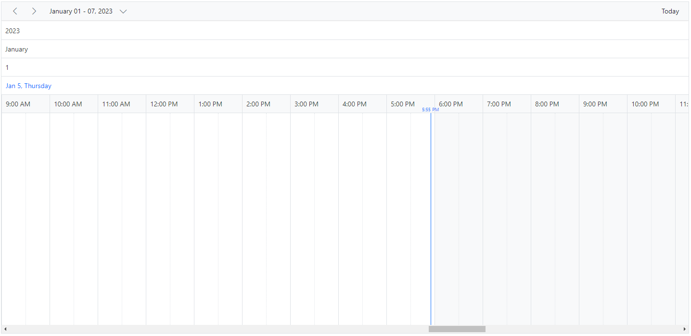
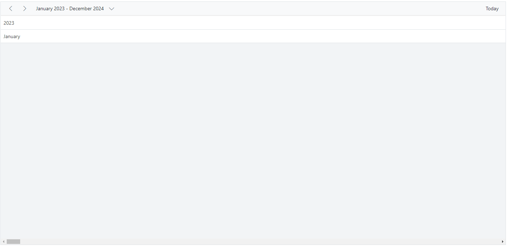
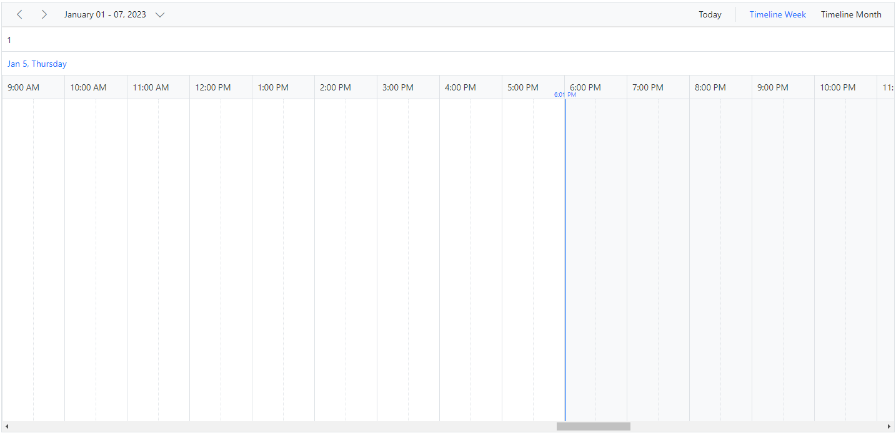
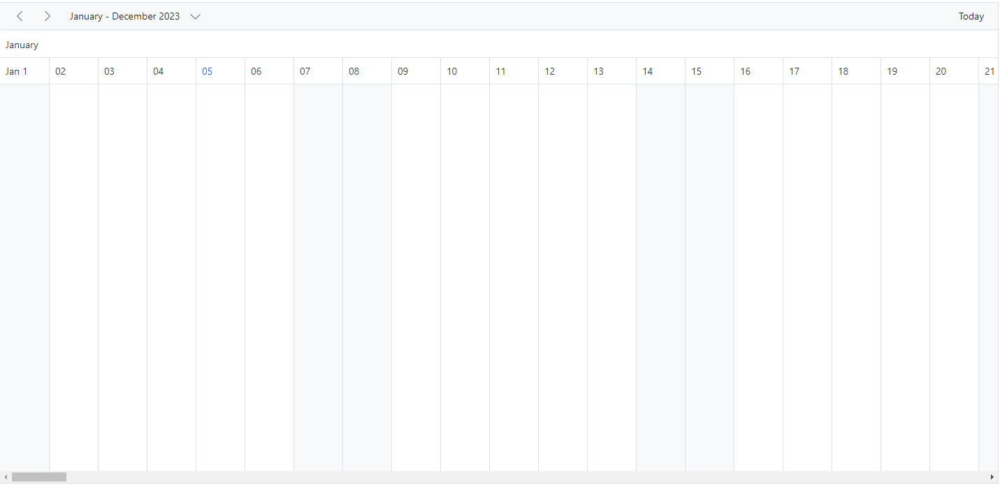
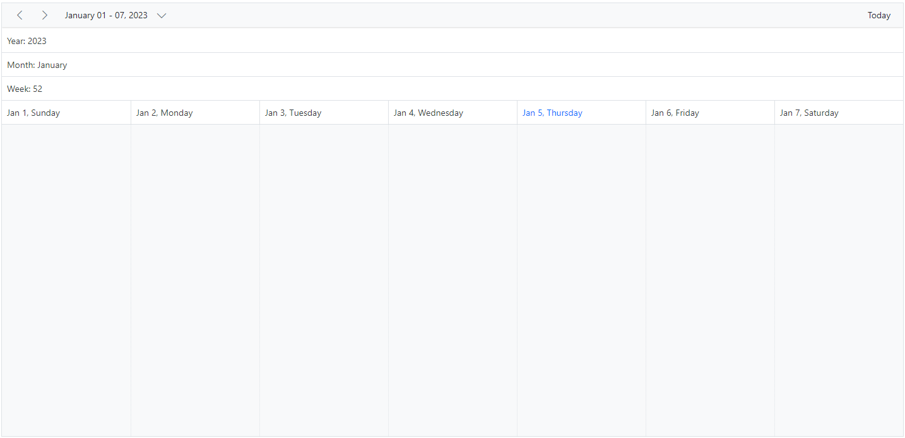

# Timeline Header Rows in Blazor Scheduler Component

The Timeline views can have additional header rows other than its default date and time header rows. It is possible to show individual header rows for displaying year, month and week separately using the [`ScheduleHeaderRow`](https://help.syncfusion.com/cr/blazor/Syncfusion.Blazor.Schedule.ScheduleHeaderRows.html) which is applicable only on the timeline views. The possible rows which can be added using [`ScheduleHeaderRow`](https://help.syncfusion.com/cr/blazor/Syncfusion.Blazor.Schedule.ScheduleHeaderRows.html) are as follows.

* `Year`
* `Month`
* `Week`
* `Date`
* `Hour`

For a quick start on customizing the header rows of timeline views in the Scheduler, refer to this video:



N> The `Hour` row is not applicable for Timeline month view.

```cshtml
@using Syncfusion.Blazor.Schedule

<SfSchedule TValue="AppointmentData" Height="650px">
    <ScheduleHeaderRows>
        <ScheduleHeaderRow Option="HeaderRowType.Year"></ScheduleHeaderRow>
        <ScheduleHeaderRow Option="HeaderRowType.Month"></ScheduleHeaderRow>
        <ScheduleHeaderRow Option="HeaderRowType.Week"></ScheduleHeaderRow>
        <ScheduleHeaderRow Option="HeaderRowType.Date"></ScheduleHeaderRow>
        <ScheduleHeaderRow Option="HeaderRowType.Hour"></ScheduleHeaderRow>
    </ScheduleHeaderRows>
    <ScheduleViews>
        <ScheduleView Option="View.TimelineWeek" MaxEventsPerRow="10"></ScheduleView>
    </ScheduleViews>
</SfSchedule>

@code{
    public class AppointmentData
    {
        public int Id { get; set; }
        public string Subject { get; set; }
        public string Location { get; set; }
        public DateTime StartTime { get; set; }
        public DateTime EndTime { get; set; }
        public string Description { get; set; }
        public bool IsAllDay { get; set; }
        public string RecurrenceRule { get; set; }
        public string RecurrenceException { get; set; }
        public Nullable<int> RecurrenceID { get; set; }
    }
}
```




## Display Year and Month Rows in Timeline Views

To display the timeline Scheduler simply with year and month names alone, define the option `Year` and `Month` within the [`ScheduleHeaderRow`](https://help.syncfusion.com/cr/blazor/Syncfusion.Blazor.Schedule.ScheduleHeaderRows.html) property.

```cshtml
@using Syncfusion.Blazor.Schedule

<SfSchedule TValue="AppointmentData" Height="650px">
    <ScheduleHeaderRows>
        <ScheduleHeaderRow Option="HeaderRowType.Year"></ScheduleHeaderRow>
        <ScheduleHeaderRow Option="HeaderRowType.Month"></ScheduleHeaderRow>
    </ScheduleHeaderRows>
    <ScheduleViews>
        <ScheduleView Option="View.TimelineMonth" MaxEventsPerRow="10" Interval="24"></ScheduleView>
    </ScheduleViews>
</SfSchedule>
@code{
    public class AppointmentData
    {
        public int Id { get; set; }
        public string Subject { get; set; }
        public string Location { get; set; }
        public DateTime StartTime { get; set; }
        public DateTime EndTime { get; set; }
        public string Description { get; set; }
        public bool IsAllDay { get; set; }
        public string RecurrenceRule { get; set; }
        public string RecurrenceException { get; set; }
        public Nullable<int> RecurrenceID { get; set; }
    }
}
```




## Display Week Numbers in Timeline Views


The week number can be displayed in a separate header row of the timeline Scheduler by setting `Week` option within [`ScheduleHeaderRow`](https://help.syncfusion.com/cr/blazor/Syncfusion.Blazor.Schedule.ScheduleHeaderRows.html) property.

```cshtml
@using Syncfusion.Blazor.Schedule

<SfSchedule TValue="AppointmentData" Height="650px">
    <ScheduleHeaderRows>
        <ScheduleHeaderRow Option="HeaderRowType.Week"></ScheduleHeaderRow>
        <ScheduleHeaderRow Option="HeaderRowType.Date"></ScheduleHeaderRow>
        <ScheduleHeaderRow Option="HeaderRowType.Hour"></ScheduleHeaderRow>
    </ScheduleHeaderRows>
    <ScheduleViews>
        <ScheduleView Option="View.TimelineWeek" MaxEventsPerRow="10"></ScheduleView>
        <ScheduleView Option="View.TimelineMonth" MaxEventsPerRow="10"></ScheduleView>
    </ScheduleViews>
</SfSchedule>
@code{
    public class AppointmentData
    {
        public int Id { get; set; }
        public string Subject { get; set; }
        public string Location { get; set; }
        public DateTime StartTime { get; set; }
        public DateTime EndTime { get; set; }
        public string Description { get; set; }
        public bool IsAllDay { get; set; }
        public string RecurrenceRule { get; set; }
        public string RecurrenceException { get; set; }
        public Nullable<int> RecurrenceID { get; set; }
    }
}
```




## Timeline View Displaying Dates of a Complete Year

A complete year can be displayed in a timeline view by setting the`Interval` value as 12 and defining **TimelineMonth** view option within the [`ScheduleView`](https://help.syncfusion.com/cr/blazor/Syncfusion.Blazor.Schedule.ScheduleViews.html) tag helper.

```cshtml
@using Syncfusion.Blazor.Schedule

<SfSchedule TValue="AppointmentData" Height="650px">
    <ScheduleHeaderRows>
        <ScheduleHeaderRow Option="HeaderRowType.Month"></ScheduleHeaderRow>
        <ScheduleHeaderRow Option="HeaderRowType.Date"></ScheduleHeaderRow>
    </ScheduleHeaderRows>
    <ScheduleViews>
        <ScheduleView Option="View.TimelineMonth" MaxEventsPerRow="10" Interval="12"></ScheduleView>
    </ScheduleViews>
</SfSchedule>
@code{
    public class AppointmentData
    {
        public int Id { get; set; }
        public string Subject { get; set; }
        public string Location { get; set; }
        public DateTime StartTime { get; set; }
        public DateTime EndTime { get; set; }
        public string Description { get; set; }
        public bool IsAllDay { get; set; }
        public string RecurrenceRule { get; set; }
        public string RecurrenceException { get; set; }
        public Nullable<int> RecurrenceID { get; set; }
    }
}
```




## Customizing the Header Rows Using Template

The text of the header rows can be customized and display any images or format text on each individual header rows using the built-in [`Template`](https://help.syncfusion.com/cr/blazor/Syncfusion.Blazor.Schedule.ScheduleHeaderRow.html#Syncfusion_Blazor_Schedule_ScheduleHeaderRow_Template) option available within the [`ScheduleHeaderRow`](https://help.syncfusion.com/cr/blazor/Syncfusion.Blazor.Schedule.ScheduleHeaderRow.html).

```cshtml
@using Syncfusion.Blazor.Schedule
@using System.Globalization
<p>Timeline header rows</p>
<SfSchedule TValue="AppointmentData" Height="650px">
    <ScheduleHeaderRows>
        <ScheduleHeaderRow Option="HeaderRowType.Year">
            <Template>
                <div class="date-text">Year: @(getYearText((context as TemplateContext).Date))</div>
            </Template>
        </ScheduleHeaderRow>
        <ScheduleHeaderRow Option="HeaderRowType.Month">
            <Template>
                <div class="date-text">Month: @(getMonthText((context as TemplateContext).Date))</div>
            </Template>
        </ScheduleHeaderRow>
        <ScheduleHeaderRow Option="HeaderRowType.Week">
            <Template>
                <div class="date-text">Week: @(getWeekText((context as TemplateContext).Date))</div>
            </Template>
        </ScheduleHeaderRow>
        <ScheduleHeaderRow Option="HeaderRowType.Date"></ScheduleHeaderRow>
    </ScheduleHeaderRows>
    <ScheduleViews>
        <ScheduleView Option="View.TimelineWeek" MaxEventsPerRow="10"></ScheduleView>
    </ScheduleViews>
</SfSchedule>
@code{
    public class AppointmentData
    {
        public int Id { get; set; }
        public string Subject { get; set; }
        public string Location { get; set; }
        public DateTime StartTime { get; set; }
        public DateTime EndTime { get; set; }
        public string Description { get; set; }
        public bool IsAllDay { get; set; }
        public string RecurrenceRule { get; set; }
        public string RecurrenceException { get; set; }
        public Nullable<int> RecurrenceID { get; set; }
    }
    public static string getYearText(DateTime date)
    {
        return date.ToString("yyyy", CultureInfo.InvariantCulture);
    }
    public static string getMonthText(DateTime date)
    {
        return date.ToString("MMMM", CultureInfo.InvariantCulture);
    }
    public static string getWeekText(DateTime date)
    {
        return CultureInfo.InvariantCulture.Calendar.GetWeekOfYear(date, CalendarWeekRule.FirstFourDayWeek, DayOfWeek.Monday).ToString();
    }
}
```


