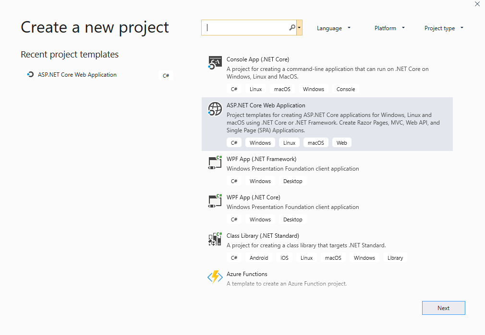
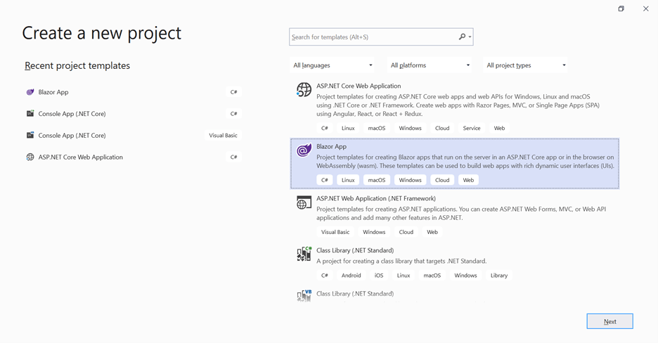
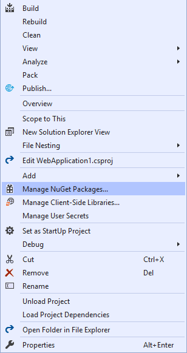

# Blazor Scheduler Component in WebAssembly (WASM) App

This article provides a step-by-step instructions to configure Syncfusion Blazor Scheduler in a simple Blazor WebAssembly application using [Visual Studio 2019](https://visualstudio.microsoft.com/vs/).

**Note**: Starting with version 17.4.0.39 (2019 Volume 4), you need to include a valid license key (either paid or trial key) within your applications. Please refer to this [help topic](https://help.syncfusion.com/common/essential-studio/licensing/license-key#blazor) for more information.

## Prerequisites

* [Visual Studio 2019](https://visualstudio.microsoft.com/vs/)
* [.NET Core SDK 3.1.8](https://dotnet.microsoft.com/download/dotnet-core/3.1) / [.NET 5.0 SDK](https://dotnet.microsoft.com/download/dotnet/5.0)

> **.NET Core SDK 3.1.8** requires Visual Studio 2019 16.7 or later. <br /> **.NET 5.0** requires Visual Studio 2019 16.8 or later.

## Create a Blazor WebAssembly project in Visual Studio 2019

1. Choose **Create a new project** from the Visual Studio dashboard.

    

2. Select **Blazor App** from the template, and then click **Next** button.

    

3. Now, the project configuration window will popup. Click **Create** button to create a new project with the default project configuration.

    

4. Select the target Framework **ASP.NET Core 3.1** or **.NET 5.0** at the top of the application based on the required target.

     

5. Choose **Blazor WebAssembly App** from the dashboard, and then click **Create** button to create a new Blazor WebAssembly application.

    

## Installing Syncfusion Blazor packages in the application

You can use any one of the below standard to install the Syncfusion Blazor library in your application.

### Using Syncfusion Blazor individual NuGet Packages [New standard]

> Starting with Volume 4, 2020 (v18.4.0.30) release, Syncfusion provides [individual NuGet packages](https://blazor.syncfusion.com/documentation/nuget-packages/) for our Syncfusion Blazor components. We highly recommend this new standard for your Blazor production applications. Refer to [this section](https://blazor.syncfusion.com/documentation/nuget-packages/#benefits-of-using-individual-nuget-packages) to know the benefits of the individual NuGet packages.

1. Now, install **Syncfusion.Blazor.Schedule** NuGet package to the new application using the `NuGet Package Manager`. For more details about available NuGet packages, refer to the [Individual NuGet Packages](https://blazor.syncfusion.com/documentation/nuget-packages/) documentation.

2. Right-click the project,and then select Manage NuGet Packages.

    

3. Search **Syncfusion.Blazor.Schedule** keyword in the Browse tab and install **Syncfusion.Blazor.Schedule** NuGet package in the application.

    

4. The Syncfusion Blazor Schedule package will be included in the newly created project once the installation process is completed.

5. Add the Syncfusion bootstrap4 theme in the `<head>` element of the **~/wwwroot/index.html** page.

    ```html
    <head>
        ....
        ....
        <link href="_content/Syncfusion.Blazor.Themes/bootstrap4.css" rel="stylesheet" />
    </head>
    ```

    W> `Syncfusion.Blazor` package should not be installed along with [individual NuGet packages](https://blazor.syncfusion.com/documentation/nuget-packages/). Hence, the above `Syncfusion.Blazor.Themes` static web assets (styles) has to be added in the application.

### Using Syncfusion.Blazor NuGet Package [Old standard]

W> If you prefer the above new standard (individual NuGet packages), then skip this section. Using both old and new standards in the same application will throw ambiguous compilation errors.

1. Now, install **Syncfusion.Blazor** NuGet package to the newly created application by using the `NuGet Package Manager`. Right-click the project and then select Manage NuGet Packages.

    

2. Search **Syncfusion.Blazor** keyword in the Browse tab and install **Syncfusion.Blazor** NuGet package in the application.

    

3. The Syncfusion Blazor package will be installed in the project once the installation process is completed.

4. Add the Syncfusion bootstrap4 theme in the `<head>` element of the **~/wwwroot/index.html** page.

    ```html
    <head>
        ....
        ....
         <link href="_content/Syncfusion.Blazor/styles/bootstrap4.css" rel="stylesheet" />
    </head>
    ```
    > The same theme file can be referred through the CDN version by using [https://cdn.syncfusion.com/blazor/{{ site.blazorversion }}/styles/bootstrap4.css](https://cdn.syncfusion.com/blazor/18.4.30/styles/bootstrap4.css).

## Adding Syncfusion Blazor component and running the application

1. Open **~/_Imports.razor** file and import the `Syncfusion.Blazor` namespace.

    ```cshtml
    @using Syncfusion.Blazor
    @using Syncfusion.Blazor.Schedule
    ```

2. Open the **~/Program.cs** file and register the Syncfusion Blazor Service.

    ```c#
    using Syncfusion.Blazor;

    namespace WebApplication1
    {
        public class Program
        {
            public static async Task Main(string[] args)
            {
                ....
                ....
                builder.Services.AddSyncfusionBlazor();
                await builder.Build().RunAsync();
            }
        }
    }
    ```

## Initialize the Scheduler component

The [Blazor Scheduler](https://www.syncfusion.com/blazor-components/blazor-scheduler/) component can be rendered on the page by defining the `SfSchedule` tag helper. And also, define the required Scheduler views in the `ScheduleView` tag helper. Add the following code example to your `index.razor` page which is available within the `~/Pages/` folder, to initialize the Scheduler component.

```cshtml
@using Syncfusion.Blazor.Schedule

<SfSchedule TValue="AppointmentData" Height="650px" @bind-SelectedDate="@CurrentDate">
    <ScheduleEventSettings DataSource="@DataSource"></ScheduleEventSettings>
    <ScheduleViews>
        <ScheduleView Option="View.Day"></ScheduleView>
        <ScheduleView Option="View.Week"></ScheduleView>
        <ScheduleView Option="View.WorkWeek"></ScheduleView>
        <ScheduleView Option="View.Month"></ScheduleView>
        <ScheduleView Option="View.Agenda"></ScheduleView>
    </ScheduleViews>
</SfSchedule>

@code{
    DateTime CurrentDate = new DateTime(2020, 2, 14);
    List<AppointmentData> DataSource = new List<AppointmentData>
    {
        new AppointmentData { Id = 1, Subject = "Paris", StartTime = new DateTime(2020, 2, 13, 10, 0, 0) , EndTime = new DateTime(2020, 2, 13, 12, 0, 0) },
        new AppointmentData { Id = 2, Subject = "Germany", StartTime = new DateTime(2020, 2, 15, 10, 0, 0) , EndTime = new DateTime(2020, 2, 15, 12, 0, 0) }
    };
    public class AppointmentData
    {
        public int Id { get; set; }
        public string Subject { get; set; }
        public string Location { get; set; }
        public DateTime StartTime { get; set; }
        public DateTime EndTime { get; set; }
        public string Description { get; set; }
        public bool IsAllDay { get; set; }
        public string RecurrenceRule { get; set; }
        public string RecurrenceException { get; set; }
        public Nullable<int> RecurrenceID { get; set; }
    }
}
```


> Refer to our [Blazor Scheduler](https://www.syncfusion.com/blazor-components/blazor-scheduler/) feature tour page for its groundbreaking feature representations. You can also explore our [Blazor Scheduler example](https://blazor.syncfusion.com/demos/scheduler/overview?theme=bootstrap4/) to understand how to manage appointments with multiple resources.