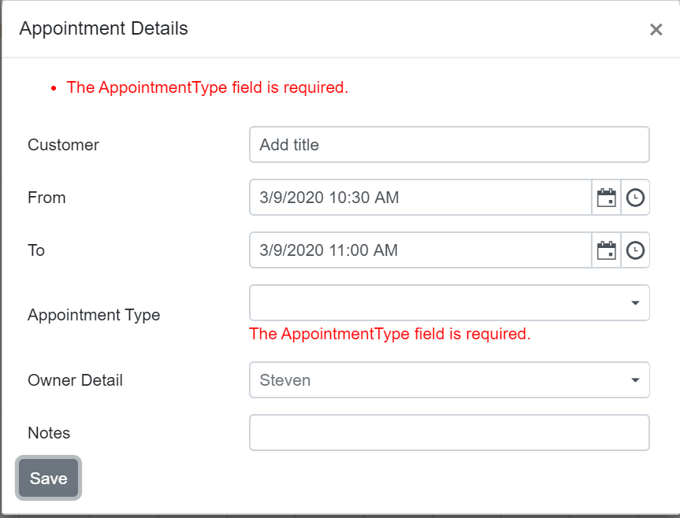

# Custom Editor with Validation in Blazor Scheduler Component

By default, the Blazor Scheduler offers field validation for its built-in appointment properties. To implement validation for custom fields within the Scheduler or to enhance existing validations, a custom editor can be leveraged. This can be achieved effectively using Data Annotations to define validation rules on your model properties, coupled with a custom UI for the editor.

Data Annotations enable defining validation rules directly on model classes or their properties, facilitating data validation and displaying informative messages to end-users. This mechanism is enabled by referencing the `System.ComponentModel.DataAnnotations` namespace. In the following example, the Syncfusion<sup style="font-size:70%">&reg;</sup> Blazor Dialog component is used to render a custom editor, allowing for the saving or updating of appointments with integrated validation.

```cshtml
@using Newtonsoft.Json
@using Syncfusion.Blazor.Schedule
@using Syncfusion.Blazor.Calendars
@using Syncfusion.Blazor.DropDowns
@using Syncfusion.Blazor.Inputs
@using Syncfusion.Blazor.Popups
@using System.ComponentModel.DataAnnotations

<SfSchedule @ref="ScheduleRef" TValue="AppointmentData" Width="100%" Height="650px" SelectedDate="@(new DateTime(2020, 3, 11))">
    <ScheduleEvents TValue="AppointmentData" OnPopupOpen="PopupOpen"></ScheduleEvents>
    <ScheduleGroup Resources="@Resources"></ScheduleGroup>
    <ScheduleResources>
        <ScheduleResource TValue="int[]" TItem="ResourceData" DataSource="@OwnersData" Field="OwnerId" Title="Owner" Name="Owners" TextField="OwnerText" IdField="Id" ColorField="OwnerColor" AllowMultiple="true"></ScheduleResource>
    </ScheduleResources>
    <ScheduleEventSettings DataSource="@DataSource"></ScheduleEventSettings>
    <ScheduleViews>
        <ScheduleView Option="View.Day"></ScheduleView>
        <ScheduleView Option="View.Week"></ScheduleView>
        <ScheduleView Option="View.WorkWeek"></ScheduleView>
        <ScheduleView Option="View.Month"></ScheduleView>
        <ScheduleView Option="View.Agenda"></ScheduleView>
    </ScheduleViews>
</SfSchedule>

<SfDialog @bind-Visible="@DialogVisibility" IsModal="true" Width="575px" ShowCloseIcon="true">
    <DialogTemplates>
        <Header> <div>Appointment Details</div> </Header>
        <Content>
            <EditForm Model="AppointmentValidation" OnValidSubmit="@OnValidSubmit">
                <DataAnnotationsValidator />
                <ValidationSummary />
                <table class="custom-event-editor" width="550px" cellpadding="5">
                    <tbody>
                        <tr>
                            <td class="e-textlabel">Customer</td>
                            <td colspan="4">
                                <SfTextBox @ref="SubjectObj" @bind-Value="@AppointmentValidation.Subject"></SfTextBox>
                                <ValidationMessage For="@(() => AppointmentValidation.Subject)" />
                            </td>
                        </tr>
                        <tr>
                            <td class="e-textlabel">From</td>
                            <td colspan="4">
                                <SfDateTimePicker TValue="DateTime?" ID="Start" @bind-Value="@AppointmentValidation.StartTime"></SfDateTimePicker>
                                <ValidationMessage For="@(() => AppointmentValidation.StartTime)" />
                            </td>
                        </tr>
                        <tr>
                            <td class="e-textlabel">To</td>
                            <td colspan="4">
                                <SfDateTimePicker TValue="DateTime?" ID="End" @bind-Value="@AppointmentValidation.EndTime"></SfDateTimePicker>
                                <ValidationMessage For="@(() => AppointmentValidation.EndTime)" />
                            </td>
                        </tr>
                        <tr>
                            <td class="e-textlabel">Appointment Type</td>
                            <td colspan="4">
                                <SfDropDownList TValue="int?" @bind-Value="@AppointmentValidation.AppointmentType" ID="OwnerId" DataSource="@AppointmentTypes" TItem="AppointmentType">
                                    <DropDownListFieldSettings Value="Id" Text="Text"></DropDownListFieldSettings>
                                </SfDropDownList>
                                <ValidationMessage For="@(() => AppointmentValidation.AppointmentType)" />
                            </td>
                        </tr>
                        <tr>
                            <td class="e-textlabel">Owner Detail</td>
                            <td colspan="4">
                                <SfDropDownList TValue="int" @bind-Value="@AppointmentValidation.OwnerId" ID="IdOwnersData" DataSource="@OwnersData" TItem="ResourceData">
                                    <DropDownListFieldSettings Value="Id" Text="OwnerText"></DropDownListFieldSettings>
                                </SfDropDownList>
                                <ValidationMessage For="@(() => AppointmentValidation.OwnerId)" />
                            </td>
                        </tr>
                        <tr>
                            <td class="e-textlabel">Notes</td>
                            <td colspan="4">
                                <SfTextBox @ref="NotesObj" @bind-Value="@AppointmentValidation.Description"></SfTextBox>
                                <ValidationMessage For="@(() => AppointmentValidation.Description)" />
                            </td>
                        </tr>
                    </tbody>
                </table>
                <button type="submit" class="e-btn">Save</button>
            </EditForm>
        </Content>
    </DialogTemplates>
</SfDialog>

@code{
    SfTextBox SubjectObj;
    SfTextBox NotesObj;
    private string Action;
    Boolean DialogVisibility = false;
    private int Id;
    SfSchedule<AppointmentData> ScheduleRef;

    private string[] Resources { get; set; } = { "Owners" };
    List<AppointmentData> DataSource = new List<AppointmentData>
    {
        new AppointmentData { Id = 1, Subject = "Meeting", StartTime = new DateTime(2020, 1, 31, 9, 30, 0) , EndTime = new DateTime(2020, 1, 31, 11, 0, 0), OwnerId = 1 }
    };
    private List<ResourceData> OwnersData { get; set; } = new List<ResourceData>
    {
        new ResourceData{ OwnerText = "Nancy", Id = 1, OwnerColor = "#ffaa00" },
        new ResourceData{ OwnerText = "Steven", Id = 2, OwnerColor = "#f8a398" },
        new ResourceData{ OwnerText = "Michael", Id = 3, OwnerColor = "#7499e1" }
    };
    List<AppointmentType> AppointmentTypes = new List<AppointmentType>() {
        new AppointmentType{ Id= 0, Text= "Not started" },
        new AppointmentType{ Id= 1, Text= "In progress" },
        new AppointmentType{ Id= 2, Text= "Completed" }
    };

    public AppointmentData AppointmentValidation = new AppointmentData();

    private async void OnValidSubmit() //triggers on save button click
    {
        DialogVisibility = false;
        AppointmentData EventData = new AppointmentData();
        EventData.Subject = AppointmentValidation.Subject;
        EventData.EndTime = (DateTime)AppointmentValidation.EndTime;
        EventData.StartTime = (DateTime)AppointmentValidation.StartTime;
        EventData.Description = AppointmentValidation.Description;
        EventData.OwnerId = AppointmentValidation.OwnerId;
        EventData.AppointmentType = AppointmentValidation.AppointmentType;
        EventData.Id = Id;
        if (Action == "CellClick")
        {
            await ScheduleRef.AddEventAsync(EventData); //to add new appointment
        }
        else
        {
            await ScheduleRef.SaveEventAsync(EventData); // to save the existing appointment
        }
    }

    private void PopupOpen(PopupOpenEventArgs<AppointmentData> args)
    {
        if (args.Type == PopupType.Editor)
        {
            args.Cancel = true; //to prevent the default editor window
            this.Action = args.Data.Id == 0 ? "CellClick" : "AppointmentClick"; //to check whether the window opens on cell or appointment
            if (Action == "CellClick")
            {
                AppointmentValidation.StartTime = args.Data.StartTime;
                AppointmentValidation.EndTime = args.Data.EndTime;
                AppointmentValidation.Description = args.Data.Description;
                AppointmentValidation.OwnerId = args.Data.OwnerId;
                Random random = new Random();
                Id = random.Next(2, 1000);
            }
            else
            {
                Id = args.Data.Id;
                AppointmentValidation.StartTime = args.Data.StartTime;
                AppointmentValidation.EndTime = args.Data.EndTime;
                AppointmentValidation.AppointmentType = args.Data.AppointmentType;
                AppointmentValidation.OwnerId = args.Data.OwnerId;
            }
            AppointmentValidation.Description = args.Data.Description == null ? "" : args.Data.Description;
            AppointmentValidation.Subject = args.Data.Subject == null ? "Add title" : args.Data.Subject;
            DialogVisibility = true;
        }
        if (args.Type == PopupType.QuickInfo)
        {
            args.Cancel = true;
        }
    }

    class GroupData
    {
        public int OwnerId { get; set; }
    }

    public class ResourceData
    {
        public int Id { get; set; }
        public string OwnerText { get; set; }
        public string OwnerColor { get; set; }
    }

    public class AppointmentType
    {
        public int Id { get; set; }
        public string Text { get; set; }
    }

    public class AppointmentData
    {
        public int Id { get; set; }
        [Required]
        [StringLength(16, ErrorMessage = "Identifier too long (16 character limit).")]
        public string Subject { get; set; }
        [Required]
        public int? AppointmentType { get; set; }
        [Required]
        public DateTime? StartTime { get; set; }
        [Required]
        public DateTime? EndTime { get; set; }
        [Required]
        public int OwnerId { get; set; }
        public string Location { get; set; }
        public string EventType { get; set; }
        public string Description { get; set; }
        public bool IsAllDay { get; set; }
    }
}
<style>
    .custom-event-editor td {
        padding: 7px;
        padding-right: 16px;
    }
</style>
```


The validation is applied on clicking the save button with empty fields as in the following image.


