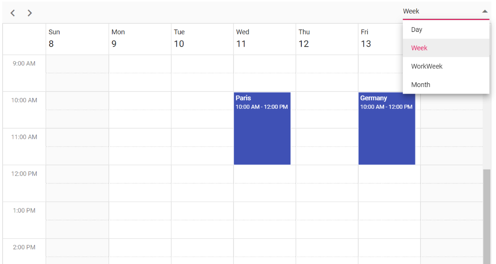

# Custom Header in Blazor Scheduler Component

The Scheduler header bar can be hidden by setting `false` to `ShowHeaderBar` and use Syncfusion<sup style="font-size:70%">&reg;</sup> Toolbar control to customize our own header. In the following code example, the Scheduler views can be changed by using the Dropdowns available in the custom Header.

```cshtml
@using Syncfusion.Blazor.Schedule
@using Syncfusion.Blazor.Navigations
@using Syncfusion.Blazor.DropDowns

<SfToolbar>
    <ToolbarItems>
        <ToolbarItem Align="ItemAlign.Left" PrefixIcon="previous" OnClick="@Clicked" TooltipText="Previous"></ToolbarItem>
        <ToolbarItem Align="ItemAlign.Left" PrefixIcon="next" OnClick="@Clicked" TooltipText="Next"></ToolbarItem>
        <ToolbarItem Type="ItemType.Separator"></ToolbarItem>
        <ToolbarItem Type="ItemType.Input" Align="ItemAlign.Right">
            <Template>
                <SfDropDownList TItem="Views" TValue="string" ID="Views" DataSource="@ViewsList" Width="120" @bind-Index="@index">
                    <DropDownListEvents TItem="Views" TValue="string" ValueChange="OnValueChange"></DropDownListEvents>
                    <DropDownListFieldSettings Value="Text"></DropDownListFieldSettings>
                </SfDropDownList>
            </Template>
        </ToolbarItem>
    </ToolbarItems>
</SfToolbar>

<SfSchedule @bind-SelectedDate="@DateValue" TValue="AppointmentData" @bind-CurrentView="@MyView" Height="650px" ShowHeaderBar="false">
    <ScheduleEventSettings DataSource="@DataSource"></ScheduleEventSettings>
    <ScheduleViews>
        <ScheduleView Option="View.Day"></ScheduleView>
        <ScheduleView Option="View.Week"></ScheduleView>
        <ScheduleView Option="View.WorkWeek"></ScheduleView>
        <ScheduleView Option="View.Month"></ScheduleView>
        <ScheduleView Option="View.Agenda"></ScheduleView>
    </ScheduleViews>
</SfSchedule>

<style>
    .previous:before {
        content: '\e937';
    }

    .next:before {
        content: '\e956'
    }
</style>

@code{
    public DateTime DateValue { get; set; } = new DateTime(2020, 2, 11);
    public View MyView = View.Week;
    private int? index = 1;
    public void Clicked(ClickEventArgs args)
    {
        int addDay = 7;
        if (MyView == View.Day) addDay = 1;
        if (MyView == View.Week) addDay = 7;
        if (MyView == View.WorkWeek) addDay = 5;
        if (MyView == View.Month) addDay = 30;
        if (args.Item.PrefixIcon == "previous")
        {
            DateValue = DateValue.AddDays(-addDay);
        }
        if (args.Item.PrefixIcon == "next")
        {
            DateValue = DateValue.AddDays(addDay);
        }
    }
    public void OnValueChange(ChangeEventArgs<string, Views> args)
    {
        this.MyView = (View)Enum.Parse(typeof(View), args.Value);
    }
    public class Views
    {
        public string ID { get; set; }
        public string Text { get; set; }
    }
    List<Views> ViewsList = new List<Views> {
        new Views() { ID= "1", Text= "Day" },
        new Views() { ID= "2", Text= "Week" },
        new Views() { ID= "3", Text= "WorkWeek" },
        new Views() { ID= "4", Text= "Month" }
    };
    List<AppointmentData> DataSource = new List<AppointmentData>
    {
        new AppointmentData { Id = 1, Subject = "Paris", StartTime = new DateTime(2020, 2, 11, 10, 0, 0) , EndTime = new DateTime(2020, 2, 11, 12, 0, 0) },
        new AppointmentData { Id = 2, Subject = "Germany", StartTime = new DateTime(2020, 2, 13, 10, 0, 0) , EndTime = new DateTime(2020, 2, 13, 12, 0, 0) }
    };
    public class AppointmentData
    {
        public int Id { get; set; }
        public string Subject { get; set; }
        public string Location { get; set; }
        public DateTime StartTime { get; set; }
        public DateTime EndTime { get; set; }
        public string Description { get; set; }
        public bool IsAllDay { get; set; }
        public string RecurrenceRule { get; set; }
        public string RecurrenceException { get; set; }
        public Nullable<int> RecurrenceID { get; set; }
    }
}
```


