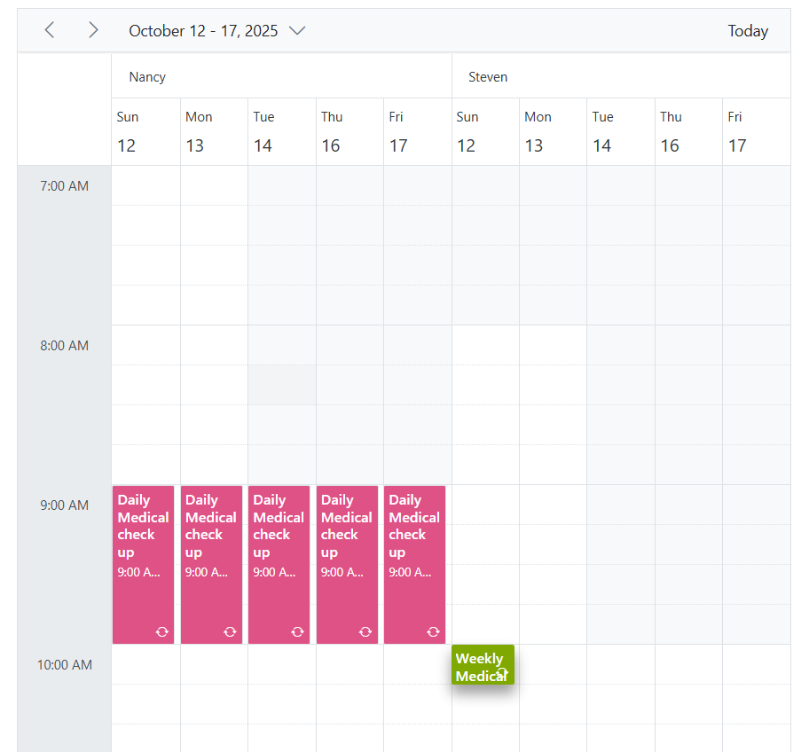

# Different Work Hours for Each Day in Blazor Scheduler Component

The Blazor Scheduler component allows for the customization of work hours, visually highlighting specific cell ranges to represent available working times. To implement custom work hours, the `SetWorkHoursAsync` method is used. Before applying new custom work hours, it is often necessary to clear any previously defined default work hours using the `ResetWorkHoursAsync` method.

In the following example, custom work hours are set for individual days of the week and for different doctor resources. This demonstrates how the Scheduler can reflect complex scheduling requirements.

```cshtml
@using Syncfusion.Blazor.Schedule

<SfSchedule @ref="@ScheduleRef" TValue=AppointmentData CurrentView="View.Week" Timezone="@TimeZone" ShowWeekend="false" WorkDays="@WorkingDays">
    <ScheduleTimeScale Interval="@IntervalInMinutes" SlotCount="4"></ScheduleTimeScale>
    <ScheduleGroup Resources="@Resources"></ScheduleGroup>
    <ScheduleResources>
        <ScheduleResource TItem="DoctorData" TValue="int" DataSource="@DoctorsData" Field="DoctorID" Title="Doctor" Name="Doctors" TextField="Text" IdField="Id" ColorField="Color"></ScheduleResource>
    </ScheduleResources>
    <ScheduleViews>
        <ScheduleView Option="View.Week" StartHour="@StartTime" EndHour="@EndTime"></ScheduleView>
    </ScheduleViews>
    <ScheduleEventSettings DataSource="@TimeSlots"></ScheduleEventSettings>
    <ScheduleEvents TValue="AppointmentData" Created="OnCreated" ActionCompleted="OnActionCompleted" DataBound="OnDataBound"></ScheduleEvents>
</SfSchedule>

@code {
    SfSchedule<AppointmentData>? ScheduleRef;
    public string TimeZone { get; set; } = "UTC";
    public int[] WorkingDays { get; set; } = { 0, 1, 2, 4, 5 };
    public int IntervalInMinutes { get; set; } = 60;
    public string StartTime { get; set; } = "07:00";
    public string EndTime { get; set; } = "17:00";
    public bool IsLayoutChanged = false;
    public string[] Resources { get; set; } = { "Doctors" };
    public List<DoctorData> DoctorsData { get; set; } = new List<DoctorData> {
        new DoctorData{ Text = "Nancy", Id= 1, Color = "#df5286" },
        new DoctorData{ Text = "Steven", Id= 2, Color = "#7fa900" }
    };
    List<AppointmentData> TimeSlots = new List<AppointmentData>
    {
        new AppointmentData { Id = 1, Subject = "Daily Medical check up", StartTime = new DateTime(2022, 7, 17, 14, 30, 0) , EndTime = new DateTime(2022, 7, 17, 15, 30, 0), RecurrenceRule = "FREQ=WEEKLY;BYDAY=SU,MO,TU,TH,FR,SA;INTERVAL=1;", DoctorID = 1 },
        new AppointmentData { Id = 2, Subject = "Weekly Medical check up", StartTime = new DateTime(2022, 7, 17, 15, 30, 0) , EndTime = new DateTime(2022, 7, 17, 15, 45, 0), RecurrenceRule = "FREQ=WEEKLY;BYDAY=SU;INTERVAL=1;", DoctorID = 2 }
    };
    private async Task OnCreated() {
        await SetWorkHours(); // Setting work hours after the intial rendering
    }
    private void OnActionCompleted(ActionEventArgs<AppointmentData> args)
    {
        // Enabling the IsLayoutChanged for setting up the work hours
        if (args.ActionType == ActionType.ViewNavigate || args.ActionType == ActionType.DateNavigate)
        {
            IsLayoutChanged = true;
        }
    }
    private async Task OnDataBound(DataBoundEventArgs<AppointmentData> args)
    {
        if (IsLayoutChanged)
        {           
            await SetWorkHours();  // Setting work hours once view or date range changed.
        }
    }
    private async Task SetWorkHours()
    {
        // Getting current view dates
        List <DateTime> CurrentViewDates = ScheduleRef.GetCurrentViewDates();
        List<DateTime> Sunday = new List<DateTime> { CurrentViewDates[0] };
        List<DateTime> Monday = new List<DateTime> { CurrentViewDates[1] };
        List<DateTime> TuesDay = new List<DateTime> { CurrentViewDates[2] };
        List<DateTime> ThursDay = new List<DateTime> { CurrentViewDates[3] };
        List<DateTime> Friday = new List<DateTime> { CurrentViewDates[4] };

        // Removing work hours from the Scheduler
        await ScheduleRef.ResetWorkHoursAsync(CurrentViewDates);

        // Setting work hours to Doctor one
        await ScheduleRef.SetWorkHoursAsync(Sunday, "07:00", "12:00", 0);
        await ScheduleRef.SetWorkHoursAsync(Monday, "07:00", "12:00", 0);
        await ScheduleRef.SetWorkHoursAsync(TuesDay, "09:00", "14:00", 0);        
        await ScheduleRef.SetWorkHoursAsync(ThursDay, "09:00", "17:00", 0);
        await ScheduleRef.SetWorkHoursAsync(Friday, "09:00", "17:00", 0);

        // Setting work hours to Doctor two
        await ScheduleRef.SetWorkHoursAsync(Sunday, "08:00", "13:00", 1);
        await ScheduleRef.SetWorkHoursAsync(Monday, "08:00", "13:00", 1);
        await ScheduleRef.SetWorkHoursAsync(TuesDay, "10:00", "15:00", 1);        
        await ScheduleRef.SetWorkHoursAsync(ThursDay, "10:00", "16:00", 1);
        await ScheduleRef.SetWorkHoursAsync(Friday, "10:00", "16:00", 1);
    }
    public class AppointmentData
    {
        public int Id { get; set; }
        public string? Subject { get; set; }
        public string? Location { get; set; }
        public DateTime StartTime { get; set; }
        public DateTime EndTime { get; set; }
        public string? Description { get; set; }
        public bool IsAllDay { get; set; }
        public bool IsBlock { get; set; }
        public string? RecurrenceRule { get; set; }
        public string? RecurrenceException { get; set; }
        public Nullable<int> RecurrenceID { get; set; }
        public int DoctorID { get; set; }
    }
    public class DoctorData
    {
        public int Id { get; set; }
        public string? Text { get; set; }
        public string? Color { get; set; }
    }
}
```


