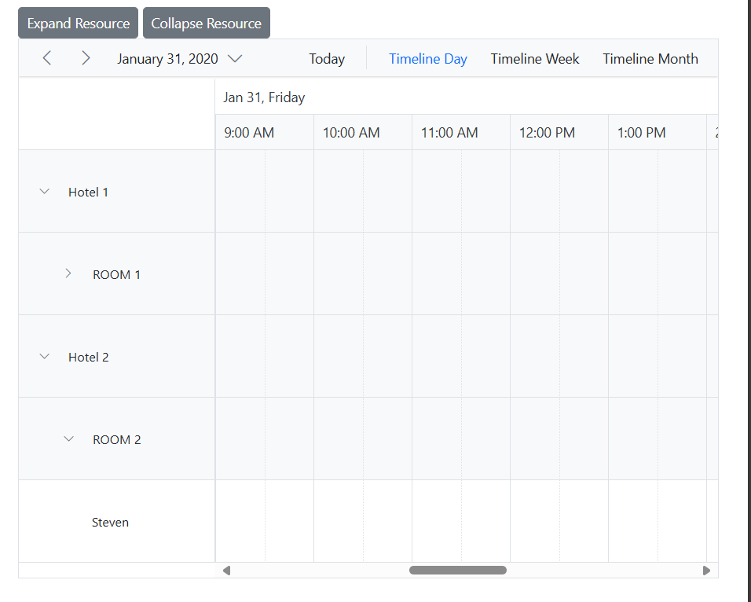

# Expand and Collapse Resource Dynamically in Blazor Scheduler Component

The Blazor Scheduler provides interactive expand/collapse functionality for resources in its timeline views, typically controlled by UI icons. Additionally, resources can be programmatically expanded or collapsed using the public methods `ExpandResourceAsync` and `CollapseResourceAsync`, respectively. This offers flexible control over the resource display.

The following example demonstrates how to dynamically expand and collapse the `Room 1` resource using external buttons. This is particularly useful for controlling nested resources within a grouped timeline view.

```cshtml
@using Syncfusion.Blazor.Schedule
@using Syncfusion.Blazor.Buttons

<SfButton Content="Expand Resource" OnClick="OnExpandButton"></SfButton>
<SfButton Content="Collapse Resource" OnClick="OnCollapseButton"></SfButton>

<SfSchedule @ref="ScheduleRef" TValue="AppointmentData" Height="550px" @bind-SelectedDate="@CurrentDate">
    <ScheduleGroup Resources="@Resources"></ScheduleGroup>
    <ScheduleResources>
        <ScheduleResource TItem="ResourceData" TValue="int" DataSource="@HotelData" Field="HotelId" Title="Hotel" Name="Hotels" TextField="HotelText" IdField="Id" ColorField="HotelColor" AllowMultiple="false"></ScheduleResource>
        <ScheduleResource TItem="ResourceData" TValue="int" DataSource="@RoomData" Field="RoomId" Title="Room" Name="Rooms" TextField="RoomText" IdField="Id" ColorField="RoomColor"
                          GroupIDField="RoomGroupId" AllowMultiple="false"></ScheduleResource>
        <ScheduleResource TItem="ResourceData" TValue="int[]" DataSource="@OwnersData" Field="OwnerId" Title="Owner" Name="Owners" TextField="OwnerText" IdField="Id" GroupIDField="OwnerGroupId" ColorField="OwnerColor" AllowMultiple="true"></ScheduleResource>
    </ScheduleResources>
    <ScheduleEventSettings DataSource="@DataSource"></ScheduleEventSettings>
    <ScheduleViews>
        <ScheduleView Option="View.TimelineDay"></ScheduleView>
        <ScheduleView Option="View.TimelineWeek"></ScheduleView>
        <ScheduleView Option="View.TimelineMonth"></ScheduleView>
    </ScheduleViews>
</SfSchedule>

@code{
    DateTime CurrentDate = new DateTime(2020, 1, 31);
    SfSchedule<AppointmentData> ScheduleRef;
    public string[] Resources { get; set; } = { "Hotels", "Rooms", "Owners" };
    public List<ResourceData> HotelData { get; set; } = new List<ResourceData>
    {
        new ResourceData{ HotelText = "Hotel 1", Id = 1, HotelColor = "#f8a398" },
        new ResourceData{ HotelText = "Hotel 2", Id = 2, HotelColor = "#ffaa00" }
    };
    public List<ResourceData> RoomData { get; set; } = new List<ResourceData>
    {
        new ResourceData{ RoomText = "ROOM 1", Id = 1, RoomGroupId = 1, RoomColor = "#cb6bb2" },
        new ResourceData{ RoomText = "ROOM 2", Id = 2, RoomGroupId = 2, RoomColor = "#56ca85" }
    };
    public List<ResourceData> OwnersData { get; set; } = new List<ResourceData>
    {
        new ResourceData{ OwnerText = "Nancy", Id = 1, OwnerGroupId = 1, OwnerColor = "#ffaa00" },
        new ResourceData{ OwnerText = "Steven", Id = 2, OwnerGroupId = 2, OwnerColor = "#f8a398" },
        new ResourceData{ OwnerText = "Michael", Id = 3, OwnerGroupId = 1, OwnerColor = "#7499e1" }
    };
    List<AppointmentData> DataSource = new List<AppointmentData>
    {
        new AppointmentData { Id = 1, Subject = "Meeting", StartTime = new DateTime(2020, 1, 31, 9, 30, 0) , EndTime = new DateTime(2020, 1, 31, 11, 0, 0),
         OwnerId = 1, RoomId = 1, HotelId = 1 }
    };
    private async Task OnCollapseButton()
    {
        await this.ScheduleRef.CollapseResourceAsync(1, "Rooms");
    }
    private async Task OnExpandButton()
    {
        await this.ScheduleRef.ExpandResourceAsync(1, "Rooms");
    }
    public class AppointmentData
    {
        public int Id { get; set; }
        public string Subject { get; set; }
        public string Location { get; set; }
        public DateTime StartTime { get; set; }
        public DateTime EndTime { get; set; }
        public string Description { get; set; }
        public bool IsAllDay { get; set; }
        public string RecurrenceRule { get; set; }
        public string RecurrenceException { get; set; }
        public Nullable<int> RecurrenceID { get; set; }
        public int OwnerId { get; set; }
        public int RoomId { get; set; }
        public int HotelId { get; set; }
    }
    public class ResourceData
    {
        public int Id { get; set; }
        public string HotelText { get; set; }
        public string HotelColor { get; set; }
        public string RoomText { get; set; }
        public string RoomColor { get; set; }
        public string OwnerText { get; set; }
        public string OwnerColor { get; set; }
        public int RoomGroupId { get; set; }
        public int OwnerGroupId { get; set; }
    }
}
```


