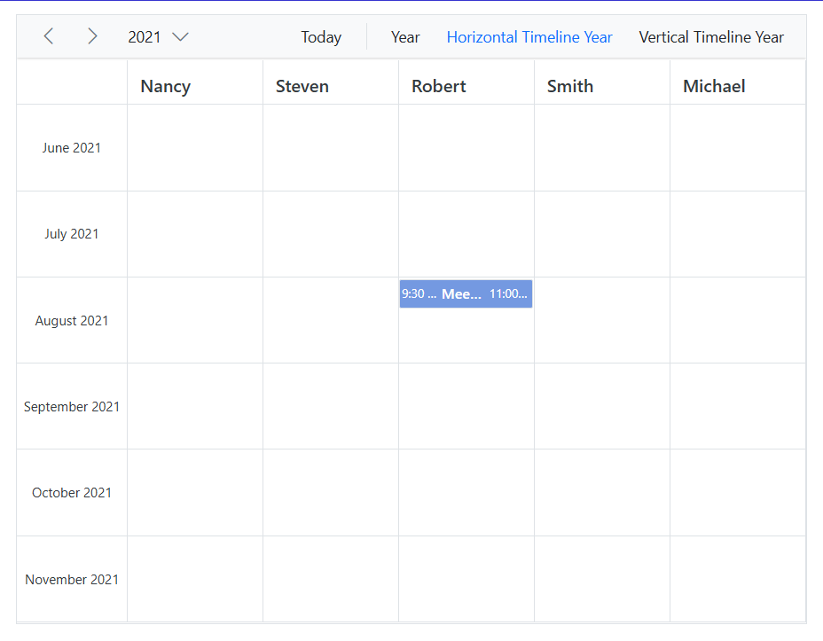

# Configure Half-Yearly View in Blazor Scheduler Component

The year view of the Scheduler displays all 365 days and their associated appointments for a given year. This view can be customized to show a specific range of months, such as a half-yearly view, using the following properties:

* [FirstMonthOfYear](https://help.syncfusion.com/cr/blazor/Syncfusion.Blazor.Schedule.SfSchedule-1.html#Syncfusion_Blazor_Schedule_SfSchedule_1_FirstMonthOfYear)
* [MonthsCount](https://help.syncfusion.com/cr/blazor/Syncfusion.Blazor.Schedule.SfSchedule-1.html#Syncfusion_Blazor_Schedule_SfSchedule_1_MonthsCount)
* [MonthHeaderTemplate](https://help.syncfusion.com/cr/blazor/Syncfusion.Blazor.Schedule.ScheduleTemplates.html#Syncfusion_Blazor_Schedule_ScheduleTemplates_MonthHeaderTemplate)

In the following code example, a half-yearly view is configured to render only the last six months of a year. To begin the view from June, `FirstMonthOfYear` is set to `6`, and `MonthsCount` is set to `6` to display a total of six months (June to November). The `MonthHeaderTemplate` is used to format the month and year in a localized string.

```cshtml
@using Syncfusion.Blazor.Schedule
@using System.Globalization

<SfSchedule TValue="AppointmentData" Height="550px" @bind-SelectedDate="@CurrentDate" FirstMonthOfYear="6" MonthsCount="6">
    <ScheduleTemplates>
        <ResourceHeaderTemplate>
            @{
                var resourceData = (context as TemplateContext).ResourceData as ResourceData;
                <div class='template-wrap'>
                    <div class="resource-details">
                        <div class="resource-name">@(resourceData.OwnerText)</div>
                    </div>
                </div>
            }
        </ResourceHeaderTemplate>
        <MonthHeaderTemplate>
            @{
                <div>@(monthHeaderTemplate((context as TemplateContext).Date))</div>
            }
        </MonthHeaderTemplate>
    </ScheduleTemplates>
    <ScheduleGroup Resources="@Resources"></ScheduleGroup>
    <ScheduleResources>
        <ScheduleResource TItem="ResourceData" TValue="int" DataSource="@OwnersData" Field="OwnerId" Title="Owner" Name="Owners" TextField="OwnerText" IdField="Id" ColorField="OwnerColor" AllowMultiple="true"></ScheduleResource>
    </ScheduleResources>
    <ScheduleEventSettings DataSource="@DataSource"></ScheduleEventSettings>
    <ScheduleViews>
        <ScheduleView Option="View.Year"></ScheduleView>
        <ScheduleView MaxEventsPerRow="2" Option="View.TimelineYear" Orientation="Orientation.Horizontal" DisplayName="Horizontal Timeline Year" IsSelected="true"></ScheduleView>
        <ScheduleView MaxEventsPerRow="3" Option="View.TimelineYear" Orientation="Orientation.Vertical" DisplayName="Vertical Timeline Year"></ScheduleView>
    </ScheduleViews>
</SfSchedule>
@code{
    DateTime CurrentDate = new DateTime(2021, 7, 31);
    public string[] Resources { get; set; } = { "Owners" };
    public static string monthHeaderTemplate(DateTime date)
    {
        return date.ToString("MMMM yyyy", CultureInfo.CurrentCulture);
    }
    List<AppointmentData> DataSource = new List<AppointmentData>
{
        new AppointmentData { Id = 1, Subject = "Meeting", StartTime = new DateTime(2021, 8, 31, 9, 30, 0) , EndTime = new DateTime(2021, 8, 31, 11, 0, 0), OwnerId= 3 }
    };
    public List<ResourceData> OwnersData { get; set; } = new List<ResourceData>
{
        new ResourceData{ OwnerText = "Nancy", Id = 1, OwnerColor = "#ffaa00" },
        new ResourceData{ OwnerText = "Steven", Id = 2, OwnerColor = "#f8a398" },
        new ResourceData{ OwnerText = "Robert", Id = 3, OwnerColor = "#7499e1" },
        new ResourceData{ OwnerText = "Smith", Id = 4, OwnerColor = "#5978ee" },
        new ResourceData{ OwnerText = "Michael", Id = 5, OwnerColor = "#df5286" }
    };
    public class AppointmentData
    {
        public int Id { get; set; }
        public string Subject { get; set; }
        public string Location { get; set; }
        public DateTime StartTime { get; set; }
        public DateTime EndTime { get; set; }
        public string Description { get; set; }
        public bool IsAllDay { get; set; }
        public string RecurrenceRule { get; set; }
        public string RecurrenceException { get; set; }
        public Nullable<int> RecurrenceID { get; set; }
        public int OwnerId { get; set; }
    }
    public class ResourceData
    {
        public int Id { get; set; }
        public string OwnerText { get; set; }
        public string OwnerColor { get; set; }
    }
}
<style>
    .e-schedule .e-vertical-view .e-resource-cells {
        height: 62px;
    }

    .e-schedule .template-wrap {
        display: flex;
        text-align: left;
    }

        .e-schedule .template-wrap .resource-details {
            padding-left: 10px;
        }

            .e-schedule .template-wrap .resource-details .resource-name {
                font-size: 16px;
                font-weight: 500;
                margin-top: 5px;
            }

    .e-schedule.e-device .template-wrap .resource-details .resource-name {
        font-size: inherit;
        font-weight: inherit;
    }

    .e-schedule.e-device .e-resource-tree-popup .e-fullrow {
        height: 50px;
    }
</style>

```


