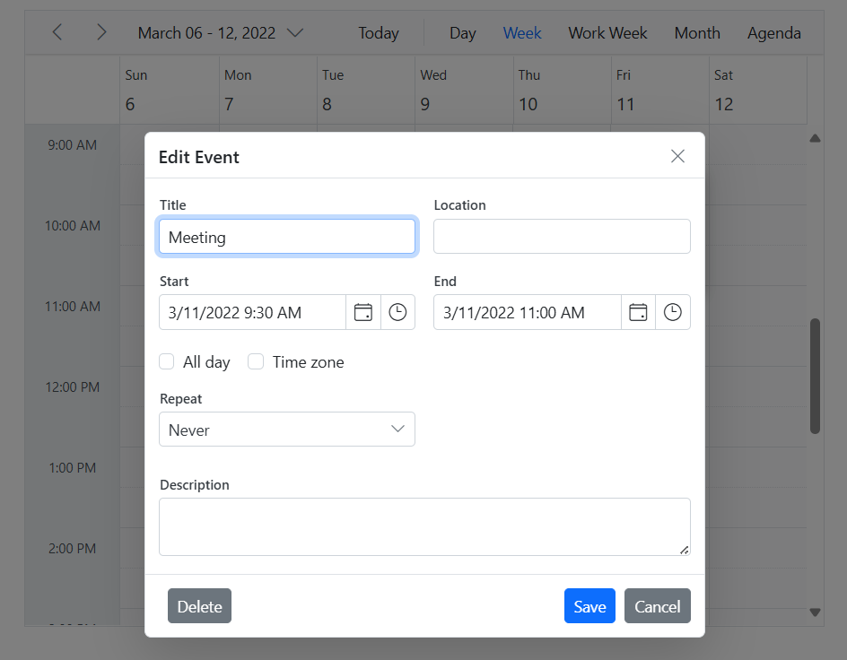

# Open Editor Window on Single Click in Blazor Scheduler Component

By default, the Scheduler's editor window opens when a cell or an existing appointment is double-clicked. To enhance user experience or streamline workflows, the editor can be configured to open on a single click. This is achieved by utilizing the `OpenEditorAsync` public method within the `OnCellClick` and `OnEventClick` Scheduler events.

```cshtml
@using Syncfusion.Blazor.Schedule

<SfSchedule @ref="ScheduleRef" TValue="AppointmentData" ShowQuickInfo="false" Height="550px" @bind-SelectedDate="@CurrentDate">
    <ScheduleEventSettings DataSource="@DataSource"></ScheduleEventSettings>
    <ScheduleEvents TValue="AppointmentData" OnCellClick="OnCellClick" OnEventClick="OnEventClick"></ScheduleEvents>
    <ScheduleViews>
        <ScheduleView Option="View.Day"></ScheduleView>
        <ScheduleView Option="View.Week"></ScheduleView>
        <ScheduleView Option="View.WorkWeek"></ScheduleView>
        <ScheduleView Option="View.Month"></ScheduleView>
        <ScheduleView Option="View.Agenda"></ScheduleView>
    </ScheduleViews>
</SfSchedule>

@code{
    DateTime CurrentDate = new DateTime(2022, 3, 11);
    SfSchedule<AppointmentData> ScheduleRef;
    public async Task OnCellClick(CellClickEventArgs args)
    {
        args.Cancel = true;
        await ScheduleRef.OpenEditorAsync(args, CurrentAction.Add); //to open the editor window on cell click
    }
    public async Task OnEventClick(EventClickArgs<AppointmentData> args)
    {
        args.Cancel = true;
        CurrentAction action = CurrentAction.Save;
        if(args.Event.RecurrenceRule != null)
        {
            action = CurrentAction.EditOccurrence;
        }
        await ScheduleRef.OpenEditorAsync(args.Event, action); //to open the editor window on event click
    }
    List<AppointmentData> DataSource = new List<AppointmentData>
    {
        new AppointmentData{ Id = 1, Subject = "Meeting", StartTime = new DateTime(2022, 3, 11, 9, 30, 0) , EndTime = new DateTime(2022, 3, 11, 11, 0, 0)}
    };
    public class AppointmentData
    {
        public int Id { get; set; }
        public string Subject { get; set; }
        public string Location { get; set; }
        public DateTime StartTime { get; set; }
        public DateTime EndTime { get; set; }
        public string Description { get; set; }
        public bool IsAllDay { get; set; }
        public string RecurrenceRule { get; set; }
        public string RecurrenceException { get; set; }
        public Nullable<int> RecurrenceID { get; set; }
    }
}
```




