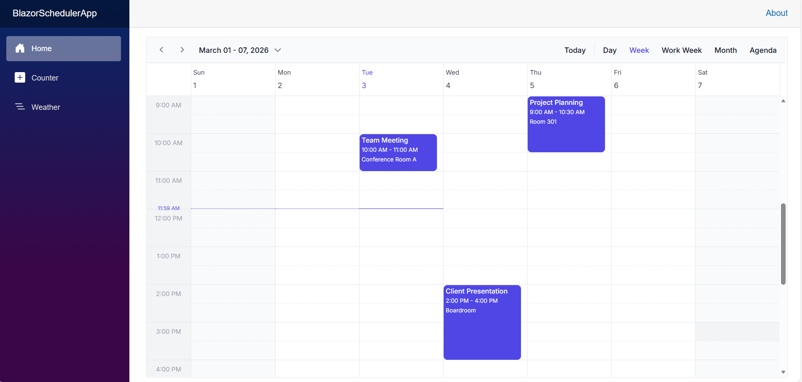

# Connecting ASP.NET Core Minimal API to Syncfusion Blazor Scheduler Component

The Syncfusion<sup style="font-size:70%">&reg;</sup> Blazor Scheduler component supports binding data from ASP.NET Core [Minimal API](https://learn.microsoft.com/en-us/aspnet/core/fundamentals/minimal-apis) endpoints hosted within the same application. This approach enables seamless integration of appointment data with full CRUD (Create, Read, Update, Delete) functionality without requiring a separate backend project.

This documentation explains how to create a Blazor Server application that hosts Minimal API endpoints in the same project, enabling the Scheduler component to perform CRUD operations on in-memory appointment data through RESTful HTTP requests.

## Prerequisites

Before starting, ensure you have the following installed:

- **.NET SDK 8.0 or later** 
- **Visual Studio 2022 (v17.8+) or later** or **Visual Studio Code** with C# extension

## Binding data from Minimal API endpoints

This section explains how to create an ASP.NET Core Minimal API backend within a Blazor Server application and bind appointment data to the Syncfusion<sup style="font-size:70%">&reg;</sup> Blazor Scheduler component. The following steps demonstrate the actual project creation flow.

### Step 1: Create a Blazor Web App

Create a **Blazor Web App** using Visual Studio 2022 or .NET CLI.

**Using Visual Studio 2022:**
1. Open Visual Studio 2022
2. Click **Create a new project**
3. Search for **Blazor Web App** template
4. Configure project name as **BlazorSchedulerApp**
5. Select **.NET 8.0** as the target framework
6. Set **Interactive render mode** to **Server**
7. Set **Interactivity location** to **Per page/component**
8. Click **Create**

**Using .NET CLI:**
```bash
dotnet new blazor -n BlazorSchedulerApp --interactivity Server
cd BlazorSchedulerApp
```

> Configure the Interactive render mode to **InteractiveServer** during project creation as the Scheduler requires interactivity for CRUD operations.

### Step 2: Install Required NuGet Packages

Install the Syncfusion Blazor packages using the .NET CLI:

**Using .NET CLI:**
```bash
dotnet add package Syncfusion.Blazor.Schedule
dotnet add package Syncfusion.Blazor.Themes
```

> After installing packages, build the project to ensure all dependencies are restored correctly: `dotnet build`

### Step 3: Create the Appointment Model

Create a model class to represent scheduler appointments with all required properties.




    namespace BlazorSchedulerApp.Models;

    public class AppointmentData
    {
        public int Id { get; set; }
        public string Subject { get; set; } = "Add Title";
        public string Location { get; set; } = string.Empty;
        public DateTime StartTime { get; set; }
        public DateTime EndTime { get; set; }
        public string Description { get; set; } = string.Empty;
        public bool IsAllDay { get; set; }
        public string? RecurrenceRule { get; set; }
        public int? RecurrenceID { get; set; }
        public string? RecurrenceException { get; set; }
    }



**Key Properties Explanation:**

- **Id**: Primary key for the appointment (auto-generated by API)
- **Subject**: Title of the appointment
- **StartTime/EndTime**: Date and time range for the appointment
- **Location**: Where the appointment takes place
- **IsAllDay**: Flag for all-day events
- **RecurrenceRule**: Rule for recurring appointments (e.g., daily, weekly)
- **RecurrenceID**: Links recurring appointment instances
- **RecurrenceException**: Handles exceptions in recurring series

> **Note**: All properties use default values to avoid null reference issues. The API will handle generating unique IDs for new appointments.

### Step 4: Create the Appointment Service

Implement a service layer to handle HTTP communication with the Minimal API endpoints.




    using BlazorSchedulerApp.Models;
    using System.Net.Http.Json;

    namespace BlazorSchedulerApp.Services;

    public class AppointmentService
    {
        private readonly HttpClient _httpClient;

        public AppointmentService(HttpClient httpClient)
        {
            _httpClient = httpClient;
        }

        /// <summary>
        /// Retrieves all appointments from the API
        /// </summary>
        public async Task<List<AppointmentData>> GetAppointmentsAsync()
        {
            try
            {
                var result = await _httpClient.GetFromJsonAsync<List<AppointmentData>>("/api/appointments");
                return result ?? new List<AppointmentData>();
            }
            catch (Exception ex)
            {
                Console.WriteLine($"Error fetching appointments: {ex.Message}");
                return new List<AppointmentData>();
            }
        }

        /// <summary>
        /// Retrieves a single appointment by ID
        /// </summary>
        public async Task<AppointmentData?> GetAppointmentByIdAsync(int id)
        {
            try
            {
                return await _httpClient.GetFromJsonAsync<AppointmentData>($"/api/appointments/{id}");
            }
            catch (Exception ex)
            {
                Console.WriteLine($"Error fetching appointment: {ex.Message}");
                return null;
            }
        }

        /// <summary>
        /// Creates a new appointment via the API
        /// </summary>
        public async Task<AppointmentData?> CreateAppointmentAsync(AppointmentData appointment)
        {
            try
            {
                var response = await _httpClient.PostAsJsonAsync("/api/appointments", appointment);
                if (response.IsSuccessStatusCode)
                {
                    return await response.Content.ReadFromJsonAsync<AppointmentData>();
                }
                return null;
            }
            catch (Exception ex)
            {
                Console.WriteLine($"Error creating appointment: {ex.Message}");
                return null;
            }
        }

        /// <summary>
        /// Updates an existing appointment via the API
        /// </summary>
        public async Task<bool> UpdateAppointmentAsync(int id, AppointmentData appointment)
        {
            try
            {
                var response = await _httpClient.PutAsJsonAsync($"/api/appointments/{id}", appointment);
                return response.IsSuccessStatusCode;
            }
            catch (Exception ex)
            {
                Console.WriteLine($"Error updating appointment: {ex.Message}");
                return false;
            }
        }

        /// <summary>
        /// Deletes an appointment via the API
        /// </summary>
        public async Task<bool> DeleteAppointmentAsync(int id)
        {
            try
            {
                var response = await _httpClient.DeleteAsync($"/api/appointments/{id}");
                return response.IsSuccessStatusCode;
            }
            catch (Exception ex)
            {
                Console.WriteLine($"Error deleting appointment: {ex.Message}");
                return false;
            }
        }
    }




### Step 5: Configure Application Services and Create Minimal API Endpoints

Update `Program.cs` to register services, configure HttpClient, and define Minimal API endpoints for CRUD operations.




    using BlazorSchedulerApp.Components;
    using BlazorSchedulerApp.Models;
    using BlazorSchedulerApp.Services;
    using Microsoft.AspNetCore.Components;
    using Syncfusion.Blazor;

    var builder = WebApplication.CreateBuilder(args);

    // Add services to the container.
    builder.Services.AddRazorComponents()
        .AddInteractiveServerComponents();

    // Add HttpClient for AppointmentService
    builder.Services.AddScoped(sp =>
    {
        var navigationManager = sp.GetRequiredService<NavigationManager>();
        return new HttpClient
        {
            BaseAddress = new Uri(navigationManager.BaseUri)
        };
    });
    builder.Services.AddScoped<AppointmentService>();

    // Add Syncfusion Blazor service
    builder.Services.AddSyncfusionBlazor();

    // Configure CORS
    builder.Services.AddCors(options =>
    {
        options.AddDefaultPolicy(policy =>
        {
            policy.AllowAnyOrigin()
                  .AllowAnyMethod()
                  .AllowAnyHeader();
        });
    });

    var app = builder.Build();

    // In-memory data storage for appointments
    var appointments = new List<AppointmentData>
    {
        new AppointmentData
        {
            Id = 1,
            Subject = "Team Meeting",
            Location = "Conference Room A",
            StartTime = DateTime.Today.AddHours(10),
            EndTime = DateTime.Today.AddHours(11),
            Description = "Weekly team sync-up meeting"
        },
        new AppointmentData
        {
            Id = 2,
            Subject = "Client Presentation",
            Location = "Boardroom",
            StartTime = DateTime.Today.AddDays(1).AddHours(14),
            EndTime = DateTime.Today.AddDays(1).AddHours(16),
            Description = "Quarterly review with client"
        },
        new AppointmentData
        {
            Id = 3,
            Subject = "Project Planning",
            Location = "Room 301",
            StartTime = DateTime.Today.AddDays(2).AddHours(9),
            EndTime = DateTime.Today.AddDays(2).AddHours(10).AddMinutes(30),
            Description = "Planning session for new project"
        }
    };

    // Configure the HTTP request pipeline.
    if (!app.Environment.IsDevelopment())
    {
        app.UseExceptionHandler("/Error", createScopeForErrors: true);
        app.UseHsts();
    }

    app.UseHttpsRedirection();
    app.UseAntiforgery();
    app.UseCors();

    // ============= Minimal API Endpoints for Appointments =============

    // GET: Get all appointments
    app.MapGet("/api/appointments", () =>
    {
        return Results.Ok(appointments);
    })
    .WithName("GetAppointments");

    // GET: Get appointment by ID
    app.MapGet("/api/appointments/{id}", (int id) =>
    {
        var appointment = appointments.FirstOrDefault(a => a.Id == id);
        return appointment is not null ? Results.Ok(appointment) : Results.NotFound();
    })
    .WithName("GetAppointmentById");

    // POST: Create new appointment
    app.MapPost("/api/appointments", (AppointmentData appointment) =>
    {
        appointment.Id = appointments.Any() ? appointments.Max(a => a.Id) + 1 : 1;
        appointments.Add(appointment);
        return Results.Created($"/api/appointments/{appointment.Id}", appointment);
    })
    .WithName("CreateAppointment");

    // PUT: Update appointment
    app.MapPut("/api/appointments/{id}", (int id, AppointmentData updatedAppointment) =>
    {
        var appointment = appointments.FirstOrDefault(a => a.Id == id);
        if (appointment is null)
            return Results.NotFound();

        appointment.Subject = updatedAppointment.Subject;
        appointment.Location = updatedAppointment.Location;
        appointment.StartTime = updatedAppointment.StartTime;
        appointment.EndTime = updatedAppointment.EndTime;
        appointment.Description = updatedAppointment.Description;
        appointment.IsAllDay = updatedAppointment.IsAllDay;
        appointment.RecurrenceRule = updatedAppointment.RecurrenceRule;
        appointment.RecurrenceID = updatedAppointment.RecurrenceID;
        appointment.RecurrenceException = updatedAppointment.RecurrenceException;

        return Results.Ok(appointment);
    })
    .WithName("UpdateAppointment");

    // DELETE: Delete appointment
    app.MapDelete("/api/appointments/{id}", (int id) =>
    {
        var appointment = appointments.FirstOrDefault(a => a.Id == id);
        if (appointment is null)
            return Results.NotFound();

        appointments.Remove(appointment);
        return Results.NoContent();
    })
    .WithName("DeleteAppointment");

    // ============= End of Minimal API Endpoints =============

    app.MapStaticAssets();
    app.MapRazorComponents<App>()
        .AddInteractiveServerRenderMode();

    app.Run();




**Minimal API Benefits:**

- No controllers or routing configuration required
- Lightweight and performant
- Easy to understand and maintain
- Perfect for small APIs within the same application

### Step 6: Register Syncfusion Namespaces

Add required namespaces in `_Imports.razor`:




    @using System.Net.Http
    @using System.Net.Http.Json
    @using Microsoft.AspNetCore.Components.Forms
    @using Microsoft.AspNetCore.Components.Routing
    @using Microsoft.AspNetCore.Components.Web
    @using static Microsoft.AspNetCore.Components.Web.RenderMode
    @using Microsoft.AspNetCore.Components.Web.Virtualization
    @using Microsoft.JSInterop
    @using BlazorSchedulerApp
    @using BlazorSchedulerApp.Components
    @using BlazorSchedulerApp.Components.Layout
    @using BlazorSchedulerApp.Models
    @using BlazorSchedulerApp.Services
    @using Syncfusion.Blazor
    @using Syncfusion.Blazor.Schedule




> **Note**: These namespaces make Syncfusion components and your models available throughout the application without needing to add `@using` directives in every file.

### Step 7: Add Syncfusion Theme and Scripts

Update `App.razor` to include Syncfusion theme CSS and required JavaScript.




    <!DOCTYPE html>
    <html lang="en">

    <head>
        <meta charset="utf-8" />
        <meta name="viewport" content="width=device-width, initial-scale=1.0" />
        <base href="/" />
        <ResourcePreloader />
        <link rel="stylesheet" href="@Assets["lib/bootstrap/dist/css/bootstrap.min.css"]" />
        <link rel="stylesheet" href="@Assets["app.css"]" />
        <link rel="stylesheet" href="@Assets["BlazorSchedulerApp.styles.css"]" />
        <link href="_content/Syncfusion.Blazor.Themes/tailwind3.css" rel="stylesheet" />
        <ImportMap />
        <link rel="icon" type="image/png" href="favicon.png" />
        <HeadOutlet />
    </head>

    <body>
        <Routes />
        <ReconnectModal />
        <script src="@Assets["_framework/blazor.web.js"]"></script>
        <script src="_content/Syncfusion.Blazor.Core/scripts/syncfusion-blazor.min.js" type="text/javascript"></script>
    </body>

    </html>



**Theme Options:**

You can change the theme by replacing `tailwind3.css` with any of these options:
- `bootstrap5.3.css` - Bootstrap 5.3 theme
- `material3.css` - Material Design 3 theme
- `fluent.css` - Microsoft Fluent Design theme
- `fluent2.css` - Microsoft Fluent Design 2 theme

**Critical: Syncfusion JavaScript File**

The line `<script src="_content/Syncfusion.Blazor.Core/scripts/syncfusion-blazor.min.js" type="text/javascript"></script>` is **REQUIRED** for Syncfusion components to work with InteractiveServer render mode. Without this script:
- You'll see errors like `"Could not find 'sfBlazor.Toolbar.initialize' ('sfBlazor' was undefined)"`
- Components will fail to initialize and throw JavaScript interop exceptions
- The Scheduler will not render properly

This script enables the JavaScript interop layer that Syncfusion components need for client-side functionality.

### Step 8: Create the Scheduler Component

Replace the contents of `Home.razor` with the following Blazor Scheduler component that provides full CRUD functionality.




    @page "/"
    @rendermode InteractiveServer
    @inject AppointmentService AppointmentService
    
    <PageTitle>Appointment Scheduler</PageTitle>
    
    <div class="scheduler-container">
    
        <SfSchedule TValue="AppointmentData" 
                    @ref="ScheduleRef"
                    Height="650px" 
                    @bind-SelectedDate="@CurrentDate"
                    @bind-CurrentView="@CurrentView"
                    ShowQuickInfo="true"
                    AllowDragAndDrop="true"
                    AllowResizing="true">
            
            <ScheduleViews>
                <ScheduleView Option="View.Day"></ScheduleView>
                <ScheduleView Option="View.Week"></ScheduleView>
                <ScheduleView Option="View.WorkWeek"></ScheduleView>
                <ScheduleView Option="View.Month"></ScheduleView>
                <ScheduleView Option="View.Agenda"></ScheduleView>
            </ScheduleViews>
    
            <ScheduleEventSettings TValue="AppointmentData" 
                                  DataSource="@Appointments">
            </ScheduleEventSettings>
    
            <ScheduleEvents TValue="AppointmentData"
                           OnActionBegin="OnActionBegin">
            </ScheduleEvents>
        </SfSchedule>
    </div>
    
    @code {
        private SfSchedule<AppointmentData>? ScheduleRef;
        private DateTime CurrentDate = DateTime.Today;
        private View CurrentView = View.Week;
        private List<AppointmentData> Appointments = new();
    
        protected override async Task OnInitializedAsync()
        {
            await LoadAppointments();
        }
    
        private async Task LoadAppointments()
        {
            Appointments = await AppointmentService.GetAppointmentsAsync();
            StateHasChanged();
        }
    
        private async Task OnActionBegin(ActionEventArgs<AppointmentData> args)
        {
            try
            {
                if (args.ActionType == ActionType.EventCreate && args.AddedRecords != null && args.AddedRecords.Any())
                {
                    foreach (var appointment in args.AddedRecords)
                    {
                        var created = await AppointmentService.CreateAppointmentAsync(appointment);
                        if (created != null)
                        {
                            // Update the appointment with the server-generated ID
                            appointment.Id = created.Id;
                        }
                    }
                }
                else if (args.ActionType == ActionType.EventChange && args.ChangedRecords != null && args.ChangedRecords.Any())
                {
                    foreach (var appointment in args.ChangedRecords)
                    {
                        await AppointmentService.UpdateAppointmentAsync(appointment.Id, appointment);
                    }
                }
                else if (args.ActionType == ActionType.EventRemove && args.DeletedRecords != null && args.DeletedRecords.Any())
                {
                    foreach (var appointment in args.DeletedRecords)
                    {
                        await AppointmentService.DeleteAppointmentAsync(appointment.Id);
                    }
                }
            }
            catch (Exception ex)
            {
                Console.WriteLine($"Error in OnActionBegin: {ex.Message}");
                args.Cancel = true;
            }
        }
    
    }




**Key Implementation Details:**

- **@rendermode InteractiveServer**: Enables server-side interactivity required for CRUD operations
- **OnActionBegin**: Handles all CRUD operations by calling the AppointmentService
- **OnPopupOpen**: Sets default values when opening the appointment editor
- **Default Title Logic**: Automatically sets "Add Title" for appointments with empty subjects
- **Error Handling**: Cancels the operation if an error occurs to prevent data inconsistency

**Why Use OnActionBegin?**

The `OnActionBegin` event fires before any Scheduler action completes, allowing you to:
1. Intercept the operation and call your own API
2. Add custom validation and business logic
3. Handle errors gracefully
4. Control exactly when and how data is saved


### Step 9: Run the Application

With all components in place, you're ready to run the application.

**Step 1: Build the Application**

Ensure there are no compilation errors:

```bash
dotnet build
```

**Step 2: Run the Application**

Start the application:

```bash
dotnet run
```

Or use watch mode for automatic reload during development:

```bash
dotnet watch
```

**Step 3: Access the Scheduler**

The application will start at `http://localhost:5235` (or the port configured in your `launchSettings.json`).

Open your browser and navigate to:
```
http://localhost:5235/scheduler
```


## Output Preview

*Image illustrating the Syncfusion Blazor Scheduler with Minimal API*

## Complete Sample Repository

A complete, working sample implementation is available in the [GitHub repository.](https://github.com/SyncfusionExamples/How-to-integrate-Syncfusion-Blazor-Scheduler-with-MinimalAPI.%E2%80%A6)

## Troubleshooting

### JavaScript Errors: 'sfBlazor' is undefined

**Issue**: Errors like `Could not find 'sfBlazor.Toolbar.initialize'`

**Fix**: Add Syncfusion script in `App.razor` before `</body>`:
```html
<script src="_content/Syncfusion.Blazor.Core/scripts/syncfusion-blazor.min.js" type="text/javascript"></script>
```

### API Returns 404 Not Found

**Issue**: API calls fail with 404 errors

**Fix**: 
- Ensure endpoints are defined **before** `app.MapRazorComponents<App>()` in `Program.cs`
- Verify routes match (e.g., `/api/appointments`)
- Check browser console for actual URL

### Service Injection Error

**Issue**: `Cannot provide a value for property 'AppointmentService'`

**Fix**: 
- Register service in `Program.cs`: `builder.Services.AddScoped<AppointmentService>();`
- Add `@inject AppointmentService AppointmentService` in `Scheduler.razor`
- Rebuild project

### Theme Not Applying

**Issue**: Scheduler looks unstyled

**Fix**:
- Verify theme CSS in `App.razor`: `_content/Syncfusion.Blazor.Themes/tailwind3.css`
- Clear browser cache
- Check Syncfusion.Blazor.Themes package is installed

### Duplicate Appointments Created

**Issue**: Creating one appointment makes multiple copies

**Fix**:
- Remove duplicate `OnActionBegin` handlers
- Don't call `LoadAppointments()` inside `OnActionBegin`
- Let Scheduler manage the appointments list

### Navigation Controls Don't Work

**Issue**: View switching buttons unresponsive

**Fix**:
- Check `@bind-CurrentView` and `@bind-SelectedDate` are set
- Don't cancel navigation actions in `OnActionBegin`
- Verify Syncfusion script is loaded

To learn more about the functionality of the Schedule component, refer to the [documentation](https://blazor.syncfusion.com/documentation/scheduler/getting-started).

