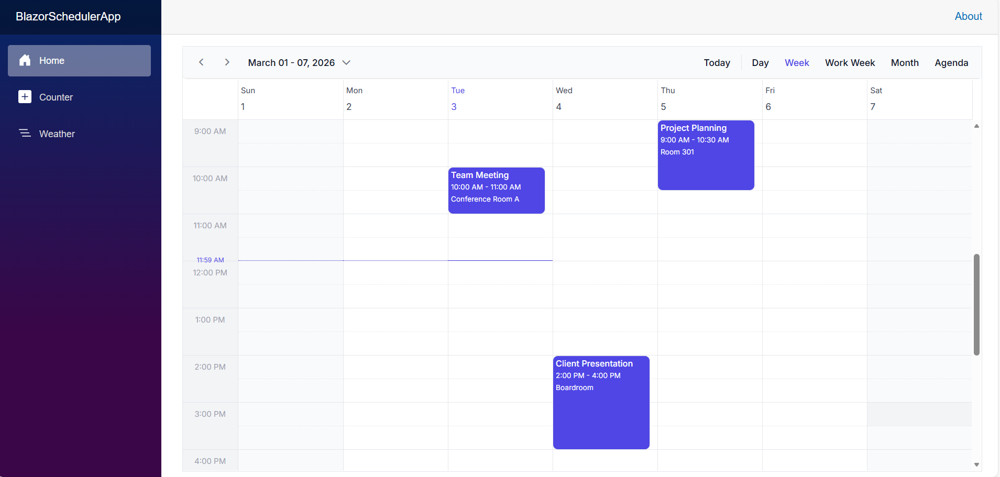

# Connecting ASP.NET Core Minimal API to Scheduler Component

The Syncfusion<sup style="font-size:70%">&reg;</sup> Blazor Scheduler component supports binding data from ASP.NET Core [Minimal API](https://learn.microsoft.com/en-us/aspnet/core/fundamentals/minimal-apis) endpoints hosted within the same application. This approach enables seamless integration of appointment data with full CRUD (Create, Read, Update, Delete) functionality without requiring a separate backend project.

This documentation explains how to create a Blazor Server application that hosts Minimal API endpoints in the same project, enabling the Scheduler component to perform CRUD operations on in-memory appointment data through RESTful HTTP requests.

## Prerequisites

Install the following software and packages before starting the process:

| Software/Package | Version | Purpose |
|-----------------|---------|---------|
| Visual Studio 2026 | 18.0 or later | Development IDE with Blazor workload |
| .NET SDK | net10.0 or compatible | Runtime and build tools |
| Syncfusion.Blazor.Schedule | Latest Version | Scheduler component |
| Syncfusion.Blazor.Themes | Latest Version | Styling for Scheduler |

## Binding data from Minimal API endpoints

This section explains how to create an ASP.NET Core Minimal API backend within a Blazor Server application and bind appointment data to the Syncfusion<sup style="font-size:70%">&reg;</sup> Blazor Scheduler component. The following steps demonstrate the actual project creation flow.

### Step 1: Create a Blazor Web App

Create a **Blazor Web App** using Visual Studio 2026 or .NET CLI.

**Using Visual Studio 2026:**
1. Open Visual Studio 2026
2. Click **Create a new project**
3. Search for **Blazor Web App** template
4. Configure project name as **BlazorSchedulerApp**
5. Select **.NET 10.0** as the target framework
6. Set **Interactive render mode** to **Server**
7. Set **Interactivity location** to **Per page/component**
8. Click **Create**

**Using .NET CLI:**
```bash
dotnet new blazor -n BlazorSchedulerApp --interactivity Server
cd BlazorSchedulerApp
```

> Configure the Interactive render mode to **InteractiveServer** during project creation as the Scheduler requires interactivity for CRUD operations.

### Step 2: Install Required NuGet Packages

Install the Syncfusion Blazor packages using the .NET CLI:

**Using .NET CLI:**
```bash
dotnet add package Syncfusion.Blazor.Schedule
dotnet add package Syncfusion.Blazor.Themes
```
The installed packages are reflected in the `BlazorSchedulerApp.csproj` file:

```xml
<ItemGroup>
    <PackageReference Include="Syncfusion.Blazor.Schedule" Version="*" />
    <PackageReference Include="Syncfusion.Blazor.Themes" Version="*" />
</ItemGroup>
```
> After installing packages, build the project to ensure all dependencies are restored correctly: `dotnet build`

### Step 3: Add Import Namespaces

Open the **Components/_Imports.razor** file and import the `Syncfusion.Blazor` and `Syncfusion.Blazor.Schedule` namespaces.

```cshtml
@using Syncfusion.Blazor   
@using Syncfusion.Blazor.Schedule
```

### Step 4: Add stylesheet and script resources

The theme stylesheet and script can be accessed from NuGet through [Static Web Assets](https://blazor.syncfusion.com/documentation/appearance/themes#static-web-assets). Include the stylesheet reference in the `<head>` section and the script reference at the end of the `<body>` in the **/Components/App.razor** file as shown below:

```html
<head>
    ....
    <link href="_content/Syncfusion.Blazor.Themes/tailwind3.css" rel="stylesheet" />
</head>

<body>
    ....
    <script src="_content/Syncfusion.Blazor.Core/scripts/syncfusion-blazor.min.js" type="text/javascript"></script>
</body>
```

### Step 5: Create the Appointment Model

Create a model class to represent scheduler appointments with all required properties.


[Models/AppointmentData.cs]

```csharp
namespace BlazorSchedulerApp.Models;

public class AppointmentData
{
    public int Id { get; set; }
    public string Subject { get; set; }
    public string Location { get; set; } = string.Empty;
    public DateTime StartTime { get; set; }
    public DateTime EndTime { get; set; }
    public string Description { get; set; } = string.Empty;
    public bool IsAllDay { get; set; }
    public string? RecurrenceRule { get; set; }
    public int? RecurrenceID { get; set; }
    public string? RecurrenceException { get; set; }
}
```

Open the **Components/_Imports.razor** file and import the `BlazorSchedulerApp.Models` namespaces.

```cshtml
@using BlazorSchedulerApp.Models
```

**Key Properties Explanation:**

- **Id**: Primary key for the appointment (auto-generated by API)
- **Subject**: Title of the appointment
- **StartTime/EndTime**: Date and time range for the appointment
- **Location**: Where the appointment takes place
- **IsAllDay**: Flag for all-day events
- **RecurrenceRule**: Rule for recurring appointments (e.g., daily, weekly)
- **RecurrenceID**: Links recurring appointment instances
- **RecurrenceException**: Handles exceptions in recurring series

> **Note**: All properties use default values to avoid null reference issues. The API will handle generating unique IDs for new appointments.

### Step 6: Create the Appointment Service

Implement a service layer to handle HTTP communication with the Minimal API endpoints.

[Services/AppointmentService]

```csharp
using BlazorSchedulerApp.Models;
using System.Net.Http.Json;

namespace BlazorSchedulerApp.Services;

public class AppointmentService
{
    private readonly HttpClient _httpClient;

    public AppointmentService(HttpClient httpClient)
    {
        _httpClient = httpClient;
    }

    /// <summary>
    /// Retrieves all appointments from the API
    /// </summary>
    public async Task<List<AppointmentData>> GetAppointmentsAsync()
    {
        try
        {
            var result = await _httpClient.GetFromJsonAsync<List<AppointmentData>>("/api/appointments");
            return result ?? new List<AppointmentData>();
        }
        catch (Exception ex)
        {
            Console.WriteLine($"Error fetching appointments: {ex.Message}");
            return new List<AppointmentData>();
        }
    }

    /// <summary>
    /// Retrieves a single appointment by ID
    /// </summary>
    public async Task<AppointmentData?> GetAppointmentByIdAsync(int id)
    {
        try
        {
            return await _httpClient.GetFromJsonAsync<AppointmentData>($"/api/appointments/{id}");
        }
        catch (Exception ex)
        {
            Console.WriteLine($"Error fetching appointment: {ex.Message}");
            return null;
        }
    }

    /// <summary>
    /// Creates a new appointment via the API
    /// </summary>
    public async Task<AppointmentData?> CreateAppointmentAsync(AppointmentData appointment)
    {
        try
        {
            var response = await _httpClient.PostAsJsonAsync("/api/appointments", appointment);
            if (response.IsSuccessStatusCode)
            {
                return await response.Content.ReadFromJsonAsync<AppointmentData>();
            }
            return null;
        }
        catch (Exception ex)
        {
            Console.WriteLine($"Error creating appointment: {ex.Message}");
            return null;
        }
    }

    /// <summary>
    /// Updates an existing appointment via the API
    /// </summary>
    public async Task<bool> UpdateAppointmentAsync(int id, AppointmentData appointment)
    {
        try
        {
            var response = await _httpClient.PutAsJsonAsync($"/api/appointments/{id}", appointment);
            return response.IsSuccessStatusCode;
        }
        catch (Exception ex)
        {
            Console.WriteLine($"Error updating appointment: {ex.Message}");
            return false;
        }
    }

    /// <summary>
    /// Deletes an appointment via the API
    /// </summary>
    public async Task<bool> DeleteAppointmentAsync(int id)
    {
        try
        {
            var response = await _httpClient.DeleteAsync($"/api/appointments/{id}");
            return response.IsSuccessStatusCode;
        }
        catch (Exception ex)
        {
            Console.WriteLine($"Error deleting appointment: {ex.Message}");
            return false;
        }
    }
}
```

Open the **Components/_Imports.razor** file and import the `BlazorSchedulerApp.Services` namespaces.

```cshtml
@using BlazorSchedulerApp.Services
```

### Step 7: Configure Application Services

The `Program.cs` file must be updated to register required services, including Syncfusion Blazor components, HttpClient, CORS, and Razor components.This section configures the foundational services used across the Scheduler application.

[Program.cs]

```csharp
using BlazorSchedulerApp.Components;
using BlazorSchedulerApp.Models;
using BlazorSchedulerApp.Services;
using Microsoft.AspNetCore.Components;
using Syncfusion.Blazor;

var builder = WebApplication.CreateBuilder(args);

// Add services to the container.
builder.Services.AddRazorComponents()
    .AddInteractiveServerComponents();

// Add HttpClient for AppointmentService
builder.Services.AddScoped(sp =>
{
    var navigationManager = sp.GetRequiredService<NavigationManager>();
    return new HttpClient
    {
        BaseAddress = new Uri(navigationManager.BaseUri)
    };
});
builder.Services.AddScoped<AppointmentService>();

// Add Syncfusion Blazor service
builder.Services.AddSyncfusionBlazor();

// Configure CORS
builder.Services.AddCors(options =>
{
    options.AddDefaultPolicy(policy =>
    {
        policy.AllowAnyOrigin()
              .AllowAnyMethod()
              .AllowAnyHeader();
    });
});

var app = builder.Build();

// In-memory data storage for appointments
var appointments = new List<AppointmentData>
{
    new AppointmentData
    {
        Id = 1,
        Subject = "Team Meeting",
        Location = "Conference Room A",
        StartTime = DateTime.Today.AddHours(10),
        EndTime = DateTime.Today.AddHours(11),
        Description = "Weekly team sync-up meeting"
    },
    new AppointmentData
    {
        Id = 2,
        Subject = "Client Presentation",
        Location = "Boardroom",
        StartTime = DateTime.Today.AddDays(1).AddHours(14),
        EndTime = DateTime.Today.AddDays(1).AddHours(16),
        Description = "Quarterly review with client"
    },
    new AppointmentData
    {
        Id = 3,
        Subject = "Project Planning",
        Location = "Room 301",
        StartTime = DateTime.Today.AddDays(2).AddHours(9),
        EndTime = DateTime.Today.AddDays(2).AddHours(10).AddMinutes(30),
        Description = "Planning session for new project"
    }
};

// Configure the HTTP request pipeline.
if (!app.Environment.IsDevelopment())
{
    app.UseExceptionHandler("/Error", createScopeForErrors: true);
    app.UseHsts();
}

app.UseHttpsRedirection();
app.UseAntiforgery();
app.UseCors();
```

### Step 8: Create Minimal API Endpoints

Update `Program.cs` to define Minimal API endpoints for CRUD operations.

[Program.cs]

```csharp
// GET: Get all appointments
app.MapGet("/api/appointments", () =>
{
    return Results.Ok(appointments);
})
.WithName("GetAppointments");

// GET: Get appointment by ID
app.MapGet("/api/appointments/{id}", (int id) =>
{
    var appointment = appointments.FirstOrDefault(a => a.Id == id);
    return appointment is not null ? Results.Ok(appointment) : Results.NotFound();
})
.WithName("GetAppointmentById");

// POST: Create new appointment
app.MapPost("/api/appointments", (AppointmentData appointment) =>
{
    appointment.Id = appointments.Any() ? appointments.Max(a => a.Id) + 1 : 1;
    appointments.Add(appointment);
    return Results.Created($"/api/appointments/{appointment.Id}", appointment);
})
.WithName("CreateAppointment");

// PUT: Update appointment
app.MapPut("/api/appointments/{id}", (int id, AppointmentData updatedAppointment) =>
{
    var appointment = appointments.FirstOrDefault(a => a.Id == id);
    if (appointment is null)
        return Results.NotFound();

    appointment.Subject = updatedAppointment.Subject;
    appointment.Location = updatedAppointment.Location;
    appointment.StartTime = updatedAppointment.StartTime;
    appointment.EndTime = updatedAppointment.EndTime;
    appointment.Description = updatedAppointment.Description;
    appointment.IsAllDay = updatedAppointment.IsAllDay;
    appointment.RecurrenceRule = updatedAppointment.RecurrenceRule;
    appointment.RecurrenceID = updatedAppointment.RecurrenceID;
    appointment.RecurrenceException = updatedAppointment.RecurrenceException;

    return Results.Ok(appointment);
})
.WithName("UpdateAppointment");

// DELETE: Delete appointment
app.MapDelete("/api/appointments/{id}", (int id) =>
{
    var appointment = appointments.FirstOrDefault(a => a.Id == id);
    if (appointment is null)
        return Results.NotFound();

    appointments.Remove(appointment);
    return Results.NoContent();
})
.WithName("DeleteAppointment");

// ============= End of Minimal API Endpoints =============

app.MapStaticAssets();
app.MapRazorComponents<App>()
    .AddInteractiveServerRenderMode();

app.Run();
```

**Minimal API Benefits:**

- No controllers or routing configuration required
- Lightweight and performant
- Easy to understand and maintain
- Perfect for small APIs within the same application


### Step 9: Create the Scheduler Component

Replace the contents of `Home.razor` with the following Blazor Scheduler component that provides full CRUD functionality.

[Home.razor]

```cshtml
@page "/"
@rendermode InteractiveServer
@inject AppointmentService AppointmentService
    
<PageTitle>Appointment Scheduler</PageTitle>
    
<div class="scheduler-container">
    
    <SfSchedule TValue="AppointmentData" 
                @ref="ScheduleRef"
                Height="650px" 
                @bind-SelectedDate="@CurrentDate"
                @bind-CurrentView="@CurrentView"
                ShowQuickInfo="true">
            
        <ScheduleViews>
            <ScheduleView Option="View.Day"></ScheduleView>
            <ScheduleView Option="View.Week"></ScheduleView>
            <ScheduleView Option="View.WorkWeek"></ScheduleView>
            <ScheduleView Option="View.Month"></ScheduleView>
            <ScheduleView Option="View.Agenda"></ScheduleView>
        </ScheduleViews>
    
        <ScheduleEventSettings TValue="AppointmentData" DataSource="@Appointments">
        </ScheduleEventSettings>
    
        <ScheduleEvents TValue="AppointmentData" OnActionBegin="OnActionBegin">
        </ScheduleEvents>
    </SfSchedule>
</div>
    
@code {
    private SfSchedule<AppointmentData>? ScheduleRef;
    private DateTime CurrentDate = DateTime.Today;
    private View CurrentView = View.Week;
    private List<AppointmentData> Appointments = new();

    protected override async Task OnInitializedAsync()
    {
        await LoadAppointments();
    }

    private async Task LoadAppointments()
    {
        Appointments = await AppointmentService.GetAppointmentsAsync();
        StateHasChanged();
    }

    private async Task OnActionBegin(ActionEventArgs<AppointmentData> args)
    {
        try
        {
            if (args.ActionType == ActionType.EventCreate && args.AddedRecords != null && args.AddedRecords.Any())
            {
                foreach (var appointment in args.AddedRecords)
                {
                    var created = await AppointmentService.CreateAppointmentAsync(appointment);
                    if (created != null)
                    {
                        // Update the appointment with the server-generated ID
                        appointment.Id = created.Id;
                    }
                }
            }
            else if (args.ActionType == ActionType.EventChange && args.ChangedRecords != null && args.ChangedRecords.Any())
            {
                foreach (var appointment in args.ChangedRecords)
                {
                    await AppointmentService.UpdateAppointmentAsync(appointment.Id, appointment);
                }
            }
            else if (args.ActionType == ActionType.EventRemove && args.DeletedRecords != null && args.DeletedRecords.Any())
            {
                foreach (var appointment in args.DeletedRecords)
                {
                    await AppointmentService.DeleteAppointmentAsync(appointment.Id);
                }
            }
        }
        catch (Exception ex)
        {
            Console.WriteLine($"Error in OnActionBegin: {ex.Message}");
            args.Cancel = true;
        }
    }

}
```

**Key Implementation Details:**

- **@rendermode InteractiveServer**: Enables server-side interactivity required for CRUD operations
- **OnActionBegin**: Handles all CRUD operations by calling the AppointmentService
- **OnPopupOpen**: Sets default values when opening the appointment editor
- **Default Title Logic**: Automatically sets "Add Title" for appointments with empty subjects
- **Error Handling**: Cancels the operation if an error occurs to prevent data inconsistency

**Why Use OnActionBegin?**

The `OnActionBegin` event fires before any Scheduler action completes, allowing you to:
1. Intercept the operation and call your own API
2. Add custom validation and business logic
3. Handle errors gracefully
4. Control exactly when and how data is saved


### Step 10: Run the Application

**Step 1: Build the Application**

Ensure there are no compilation errors:

```bash
dotnet build
```

**Step 2: Run the Application**

Start the application:

```bash
dotnet run
```

Or use watch mode for automatic reload during development:

```bash
dotnet watch
```

**Step 3: Access the Scheduler**

The application will start at `http://localhost:5175` (or the port configured in your `launchSettings.json`).

Open your browser and navigate to:
```
http://localhost:5175
```


## Output Preview

*Image illustrating the Syncfusion Blazor Scheduler with Minimal API*

## Complete Sample Repository

A complete, working sample implementation is available in the [GitHub repository.](https://github.com/SyncfusionExamples/How-to-integrate-Syncfusion-Blazor-Scheduler-with-MinimalAPI)

## Troubleshooting

### JavaScript Errors: 'sfBlazor' is undefined

**Issue**: Errors like `Could not find 'sfBlazor.Toolbar.initialize'`

**Fix**: Add Syncfusion script in `App.razor` before `</body>`:
```html
<script src="_content/Syncfusion.Blazor.Core/scripts/syncfusion-blazor.min.js" type="text/javascript"></script>
```

### API Returns 404 Not Found

**Issue**: API calls fail with 404 errors

**Fix**: 
- Ensure endpoints are defined **before** `app.MapRazorComponents<App>()` in `Program.cs`
- Verify routes match (e.g., `/api/appointments`)
- Check browser console for actual URL

### Service Injection Error

**Issue**: `Cannot provide a value for property 'AppointmentService'`

**Fix**: 
- Register service in `Program.cs`: `builder.Services.AddScoped<AppointmentService>();`
- Add `@inject AppointmentService AppointmentService` in `Scheduler.razor`
- Rebuild project

### Theme Not Applying

**Issue**: Scheduler looks unstyled

**Fix**:
- Verify theme CSS in `App.razor`: `_content/Syncfusion.Blazor.Themes/tailwind3.css`
- Clear browser cache
- Check Syncfusion.Blazor.Themes package is installed

To learn more about the functionality of the Schedule component, refer to the [documentation](https://blazor.syncfusion.com/documentation/scheduler/getting-started).
