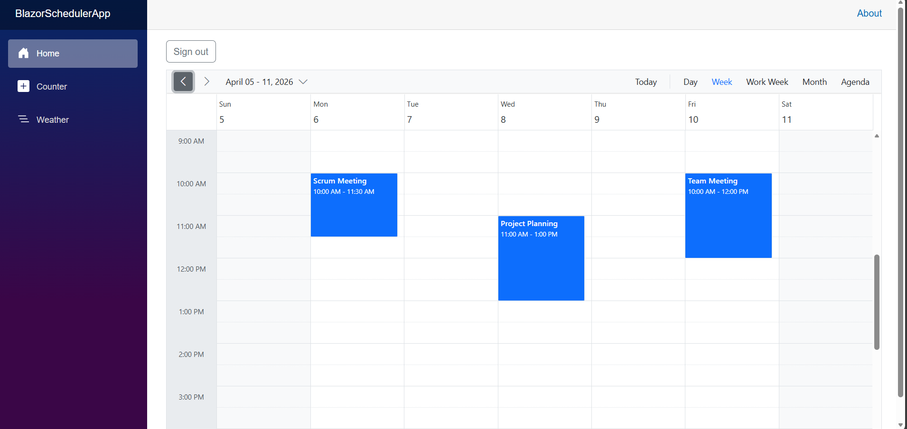
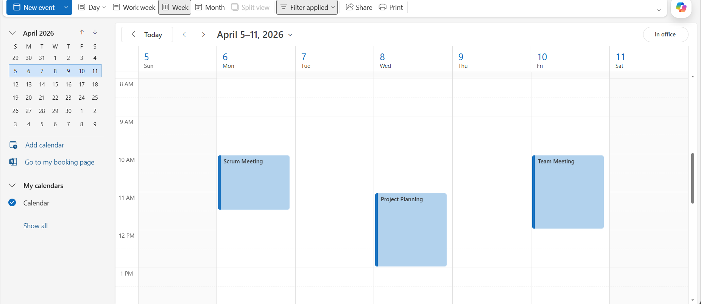

# Syncfusion Blazor Scheduler with Microsoft Outlook Integration

The Syncfusion [Blazor Scheduler](https://www.syncfusion.com/blazor-components/blazor-scheduler) integrated with Microsoft Outlook Calendar provides a complete and powerful solution for managing events directly from a web application. By leveraging Microsoft Graph API and Azure Active Directory (Microsoft Entra ID) authentication, the application enables seamless two‑way synchronization between the Scheduler component and the user’s Outlook calendar, delivering an efficient and interactive scheduling experience.

**What is Microsoft Graph API?**

[Microsoft Graph API](https://learn.microsoft.com/en-us/graph/overview) is a RESTful web API that enables applications to access Microsoft 365 services, including Outlook Calendar, Mail, OneDrive, Teams, and more. It provides a unified programmability model that allows developers to interact with data across multiple Microsoft services through a single endpoint. For calendar operations, Graph API offers comprehensive capabilities for creating, reading, updating, and deleting events, managing recurring events, handling time zones, and accessing mailbox settings.

**What is Azure Active Directory (Microsoft Entra ID)?**

[Azure Active Directory (Microsoft Entra ID)](https://learn.microsoft.com/en-us/azure/active-directory/fundamentals/active-directory-whatis) is Microsoft's cloud-based identity and access management service. It enables secure authentication and authorization for applications accessing Microsoft services. Azure AD(Microsoft Entra ID) uses the OAuth 2.0 protocol to grant applications permission to access user data on their behalf. For this integration, Azure AD(Microsoft Entra ID) handles user sign-in and provides access tokens that authenticate requests to the Microsoft Graph API.

## Prerequisites

Install the following software and packages before starting the process:

| Software/Package | Version | Purpose |
|-----------------|---------|---------|
| [Visual Studio 2022](https://visualstudio.microsoft.com/downloads/) | 17.14 or later | Development IDE with Blazor workload |
| [.NET SDK](https://dotnet.microsoft.com/en-us/) | net8.0 or compatible | Runtime and build tools |
| [Syncfusion.Blazor](https://www.nuget.org/packages/Syncfusion.Blazor/)| Latest Version | Scheduler component |
| [Microsoft.Identity.Web](https://www.nuget.org/packages/Microsoft.Identity.Web/)| 4.5.0 | Library that simplifies Azure AD(Microsoft Entra ID) authentication in ASP.NET Core |
| [Microsoft.Identity.Web.UI](https://www.nuget.org/packages/Microsoft.Identity.Web.UI/)| 4.5.0 | Provides ready‑made UI pages for Azure AD(Microsoft Entra ID) sign‑in in ASP.NET Core |


## Setting up Azure AD(Microsoft Entra ID) App Registration

Before integrating the Scheduler with Outlook, an Azure AD(Microsoft Entra ID) application must be registered to enable authentication and authorize access to the user's calendar data.

### Step 1: Register a new application in Azure Portal

**Instructions:**

1. Navigate to the [Azure Portal](https://portal.azure.com/) and sign in with your Microsoft 365 account.

2. In the left navigation pane, select **Microsoft Entra ID** > **App registrations** > **New registration**.

3. Enter the application details:
   - **Name**: Enter a descriptive name for your application (e.g., "Blazor Scheduler Outlook Integration").
   - **Supported account types**: Select the appropriate option based on your requirements:
     - **Accounts in any organizational directory and personal Microsoft accounts** (recommended for broad compatibility).
     - Or choose a more restrictive option based on your organization's needs.
   - **Redirect URI**: Select **Web** and enter `http://localhost:5050` (or your application's URL).

4. Click **Register** to create the application.

### Step 2: Configure API permissions

After registration, configure the permissions required to access Outlook Calendar data.

**Instructions:**

1. In the application's overview page, select **API permissions** from the left menu.

2. Click **Add a permission** > **Microsoft Graph** > **Delegated permissions**.

3. Add the following permissions:
   - **User.Read** - Read user's basic profile information.
   - **Calendars.Read** - Read user's calendar events.
   - **Calendars.ReadWrite** - Create, read, update, and delete calendar events.

4. Click **Add permissions** to save the configuration.

5. (Optional but recommended) Click **Grant admin consent for [Your Organization]** to pre-approve these permissions for all users.


### Step 3: Create a Client Secret

You must create a **Client Secret** for server-side authentication with Microsoft Identity.

**Instructions:**

1. Go to **Certificates & secrets** in the left menu.
2. Under **Client secrets**, click **New client secret**.
3. Provide:
   - **Description**: e.g., *"BlazorAppSecret"*
   - **Expires**: Choose 6 months, 12 months, or 24 months.
4. Click **Add**.


### Step 4: Note the Azure AD(Microsoft Entra ID) Configuration Values

**Instructions:**

1. From the application's **Overview** page in the Azure Portal, copy the following values:
   - **Application (client) ID**
   - **Directory (tenant) ID**

2. You can find your tenant's **domain name** in Switch Directory:
   - From the **profile icon (top‑right) → Switch Directory**, where the domain name appears under each directory you belong to.  
   - Use this value for the **`Domain`** field in your configuration.

3. Go to **Certificates & secrets** and Copy the **Secret Value** .

4. Keep this values secure, as it will be referenced in the `appsettings.json` file.

---

## Integrating Syncfusion Blazor Scheduler

### Step 1: Create a Blazor Web App

Create a **Blazor Web App** using Visual Studio 2022

**Using Visual Studio 2022 or later:**
1. Open Visual Studio 2022
2. Click **Create a new project**
3. Search for **Blazor Web App** template
4. Configure project name as **BlazorSchedulerApp**
5. Select **.NET 8.0** as the target framework
6. Set **Interactive render mode** to **Server**
7. Set **Interactivity location** to **Per page/component**
8. Click **Create**

> Configure the Interactive render mode to **InteractiveServer** during project creation as the Scheduler requires interactivity for CRUD operations.

### Step 2: Install Required NuGet Packages and Configure Blazor Scheduler Component with GraphQL

Before installing the necessary NuGet packages, a new Blazor Web Application must be created using the default template. This template automatically generates essential starter files—such as `Program.cs`, `appsettings.json`, the `wwwroot` folder, and the `Components` folder.

For this guide, a Blazor application named **BlazorSchedulerApp** has been created. Once the project is set up, the next step involves installing the required NuGet packages. NuGet packages are software libraries that add functionality to the application.

To add the **Blazor Scheduler** component with Microsoft Outlook in the app, open the NuGet package manager in Visual Studio (*Tools → NuGet Package Manager → Manage NuGet Packages for Solution*), then search and install [Syncfusion.Blazor](https://www.nuget.org/packages/Syncfusion.Blazor/), [Microsoft.Identity.Web](https://www.nuget.org/packages/Microsoft.Identity.Web/) and [Microsoft.Identity.Web.UI](https://www.nuget.org/packages/Microsoft.Identity.Web.UI/).


Alternatively, run the following commands in the Package Manager Console to achieve the same.

```
Install-Package Syncfusion.Blazor
Install-Package Microsoft.Identity.Web
Install-Package Microsoft.Identity.Web.UI

```

#### Project File Reference

The installed packages are reflected in the `BlazorSchedulerApp.csproj` file:

```xml
<ItemGroup>
    <PackageReference Include="Microsoft.Identity.Web" Version="4.5.0" />
    <PackageReference Include="Microsoft.Identity.Web.UI" Version="4.5.0" />
    <PackageReference Include="Syncfusion.Blazor" Version="*" />
</ItemGroup>
```

All required packages are now installed.

> **Note**: After installing packages, build the project to ensure all dependencies are restored correctly: `dotnet build`

#### Import the required namespaces in the `Components/_Imports.razor` file:

```csharp
@using Syncfusion.Blazor
@using Syncfusion.Blazor.Schedule
@using Microsoft.Identity.Web
```

#### Add the Syncfusion stylesheet and scripts in the `Components/App.razor` file. Find the `<head>` section and `<body>`section to add:

```html
<head>
    <!-- Syncfusion Blazor Stylesheet -->
    <link href="_content/Syncfusion.Blazor/styles/bootstrap5.css" rel="stylesheet" />
</head>
<body>

    <!-- Syncfusion Blazor Scripts -->
    <script src="_content/Syncfusion.Blazor/scripts/syncfusion-blazor.min.js"></script>

</body>
```
For this project, the bootstrap5 theme is used. A different theme can be selected or the existing theme can be customized based on project requirements. Refer to the [Syncfusion Blazor Components Appearance](https://blazor.syncfusion.com/documentation/appearance/themes) documentation to learn more about theming and customization options.

### Step 3: Configure Authentication, Token Caching, UI, and Blazor Services in Program.cs

The `Program.cs` file is responsible for configuring authentication, distributed token caching, Microsoft Identity integration, Syncfusion components, and server‑side Blazor services. This configuration ensures Azure AD(Microsoft Entra ID) authentication, MSAL token acquisition, and required UI components are properly set up for the application.

#### Instructions:

1. Open the `Program.cs` file at the project root.
2. Add the following code:

    [Program.cs]

    ```csharp
    using BlazorSchedulerApp.Components;
    using Microsoft.AspNetCore.Authentication.OpenIdConnect;
    using Microsoft.Identity.Web;
    using Microsoft.Identity.Web.UI;
    using Syncfusion.Blazor;
    using Microsoft.Extensions.Caching.Distributed;
    using BlazorSchedulerApp.Services;

    var builder = WebApplication.CreateBuilder(args);

    // Razor / Blazor
    builder.Services.AddRazorComponents().AddInteractiveServerComponents();
    builder.Services.AddRazorPages();
    builder.Services.AddServerSideBlazor()
        .AddMicrosoftIdentityConsentHandler(); 

    builder.Services.AddCascadingAuthenticationState();

    // Simple file-based distributed cache for local/dev token cache persistence.
    // This allows .AddDistributedTokenCaches() to persist MSAL tokens across restarts
    builder.Services.AddSingleton<IDistributedCache>(sp =>
        new FileDistributedCache(Path.Combine(AppContext.BaseDirectory, "msal_cache")));

    builder.Services
        .AddAuthentication(OpenIdConnectDefaults.AuthenticationScheme)
        .AddMicrosoftIdentityWebApp(builder.Configuration.GetSection("AzureAd"))
        .EnableTokenAcquisitionToCallDownstreamApi(
             new[] { "Calendars.Read", "Calendars.ReadWrite" })
        .AddDistributedTokenCaches();  

    // UI pages (/MicrosoftIdentity/Account/SignIn etc.)
    builder.Services.AddControllersWithViews()
        .AddMicrosoftIdentityUI();

    builder.Services.AddSyncfusionBlazor();
    builder.Services.AddHttpContextAccessor();

    // HttpClient
    builder.Services.AddHttpClient();
    
    var app = builder.Build();
    
    if (!app.Environment.IsDevelopment())
    {
        app.UseExceptionHandler("/Error", createScopeForErrors: true);
        app.UseHsts();
    }
    
    app.UseHttpsRedirection();
    app.UseStaticFiles();
    
    app.UseAuthentication();
    app.UseAuthorization();
    
    app.MapControllers();
    app.UseAntiforgery();
    
    app.MapStaticAssets();
    app.MapRazorComponents<App>()
        .AddInteractiveServerRenderMode();
    
    app.Run();

    ```

#### Explanation:

- **`AddMicrosoftIdentityWebApp()`** – Enables Azure AD(Microsoft Entra ID) authentication using the `AzureAd` config.
- **`EnableTokenAcquisitionToCallDownstreamApi()` + `AddDistributedTokenCaches()`** – Gets and persists MSAL tokens for calling Microsoft Graph.
- **`FileDistributedCache`** – Simple local token cache (use Redis/SQL in production).
- **`AddMicrosoftIdentityUI()`** – Adds built-in sign-in/sign-out pages.
- **Blazor Setup** – `AddRazorComponents()`, `AddInteractiveServerComponents()`, and `AddServerSideBlazor().AddMicrosoftIdentityConsentHandler()` enable interactive UI and consent handling.
- **Middleware** – `UseAuthentication()` and `UseAuthorization()` secure the app.

### Step 4: Configure Authentication

Update an `appsettings.json` file to hold your Azure AD(Microsoft Entra ID) settings used by the application.  
Update the placeholders with your tenant and app registration details.

[appsettings.json]

```json
{
  "AzureAd": {
    "Instance": "https://login.microsoftonline.com/",
    "Domain": "{domain name}",
    "TenantId": "{ tenant id }",
    "ClientId": "{ client id }",
    "ClientSecret": "{ secret key }",
    "CallbackPath": "/signin-oidc"
  },
  "Logging": {
    "LogLevel": {
      "Default": "Information",
      "Microsoft.AspNetCore": "Warning"
    }
  },
  "AllowedHosts": "*"
}
```

### Explanation of the JSON Configuration

- **`Instance`**  
  Specifies the base URL used by Azure AD(Microsoft Entra ID) for authentication.  
  For public Azure tenants, this is always:  
  `https://login.microsoftonline.com/`

- **`Domain`**  
  The Azure AD(Microsoft Entra ID) domain associated with your directory.  
  This can be found in:  
  - **Profile icon → Switch Directory** (shown under each directory)
    Example: `example.onmicrosoft.com`

- **`TenantId`**  
  The unique identifier (GUID) for your Azure AD(Microsoft Entra ID) tenant.  
  Found in **Microsoft Entra ID → Overview → Tenant ID**.

- **`ClientId`**  
  The **Application (client) ID** of your registered app.  
  Found in **Azure AD(Microsoft Entra ID) → App registrations → Your App → Overview**.

- **`ClientSecret`**  
  A secret key generated under  
  **Azure AD(Microsoft Entra ID) → App registrations → Certificates & secrets**.  
  This is used by the server to authenticate securely with Azure AD(Microsoft Entra ID).  
  *(Copy and store immediately, it cannot be viewed again.)*

- **`CallbackPath`**  
  The redirect URI path used after authentication.  
  Must match the Redirect URI configured in Azure AD(Microsoft Entra ID).  
  Example for Blazor Server: `/signin-oidc`


### Step 5: Create the Service Class

The `FileDistributedCache` class provides a lightweight, file‑based implementation of `IDistributedCache` used for local or development scenarios. It allows Microsoft Identity Web to persist MSAL tokens across application restarts without requiring external cache providers such as Redis or SQL Server. This is suitable for development environments but not recommended for production applications.

#### Instructions:

1. Create a new folder named **Services** in the Blazor application project.
2. Inside the **Services** folder, create a new file named `FileDistributedCache.cs`.
3. Define the `FileDistributedCache` class with the following code:

    [FileDistributedCache.cs]

    ```csharp
    using System;
    using System.IO;
    using System.Text;
    using System.Threading;
    using System.Threading.Tasks;
    using Microsoft.Extensions.Caching.Distributed;

    namespace BlazorSchedulerApp.Services
    {
        // Minimal file-backed IDistributedCache for local/dev scenarios.
        // Not recommended for production: use Redis/SQL distributed cache instead.
        public class FileDistributedCache : IDistributedCache
        {
            private readonly string _directory;

            public FileDistributedCache(string directory)
            {
                _directory = directory ?? throw new ArgumentNullException(nameof(directory));
                Directory.CreateDirectory(_directory);
            }

            private string FilePathForKey(string key)
            {
                var sanitized = Convert.ToBase64String(Encoding.UTF8.GetBytes(key))
                    .Replace('/', '_')
                    .Replace('+', '-')
                    .TrimEnd('=');
                return Path.Combine(_directory, sanitized + ".bin");
            }

            public byte[] Get(string key)
            {
                var path = FilePathForKey(key);
                if (!File.Exists(path)) return null;
                return File.ReadAllBytes(path);
            }

            public Task<byte[]> GetAsync(string key, CancellationToken token = default)
                => Task.FromResult(Get(key));

            public void Refresh(string key)
            {
                // No refresh semantics for simple file cache.
            }

            public Task RefreshAsync(string key, CancellationToken token = default)
            {
                return Task.CompletedTask;
            }

            public void Remove(string key)
            {
                var path = FilePathForKey(key);
                if (File.Exists(path)) File.Delete(path);
            }

            public Task RemoveAsync(string key, CancellationToken token = default)
            {
                Remove(key);
                return Task.CompletedTask;
            }

            public void Set(string key, byte[] value, DistributedCacheEntryOptions options)
            {
                var path = FilePathForKey(key);
                File.WriteAllBytes(path, value ?? Array.Empty<byte>());
            }

            public Task SetAsync(string key, byte[] value, DistributedCacheEntryOptions options, CancellationToken token = default)
            {
                Set(key, value, options);
                return Task.CompletedTask;
            }
        }
    }        
        
    ```

### Step 6: Update the Blazor Scheduler

The `Home.razor` component is responsible for rendering the Syncfusion Scheduler UI and integrating it with Microsoft Graph. It enables authenticated users to view, create, update, and delete calendar events directly from the Blazor interface.

**Instructions:**

1. Open the file named `Home.razor` in the `Components/Pages` folder.
2. Add the following code to create a basic Scheduler:
[Home.razor]

    ```cshtml
    @page "/"
    @rendermode InteractiveServer

    @using System.Globalization
    @using System.Net.Http
    @using System.Net.Http.Headers
    @using System.Text
    @using Microsoft.Identity.Client
    @using Microsoft.AspNetCore.Components.Authorization
    @using Newtonsoft.Json
    @using Newtonsoft.Json.Linq
    @using Syncfusion.Blazor.Schedule

    @inject IHttpClientFactory HttpClientFactory
    @inject ITokenAcquisition TokenAcquisition
    @inject AuthenticationStateProvider AuthState
    @inject MicrosoftIdentityConsentAndConditionalAccessHandler ConsentHandler
    @inject NavigationManager Nav

    <div style="display:flex; gap:8px; align-items:center; margin-bottom:12px;">
        <AuthorizeView>
            <Authorized>
                <button class="btn btn-outline-secondary" @onclick="SignOut">Sign out</button>
            </Authorized>
            <NotAuthorized>
                <button class="btn btn-primary" @onclick="SignIn">Sign in with Microsoft</button>
            </NotAuthorized>
        </AuthorizeView>
    </div>

    <SfSchedule TValue="AppointmentData"
                Height="650px"
                Timezone="Asia/Kolkata"
                @bind-SelectedDate="CurrentDate"
                @bind-CurrentView="CurrentView">
        <ScheduleEventSettings DataSource="@DataSource"></ScheduleEventSettings>

        <ScheduleViews>
            <ScheduleView Option="View.Day" />
            <ScheduleView Option="View.Week" />
            <ScheduleView Option="View.WorkWeek" />
            <ScheduleView Option="View.Month" />
            <ScheduleView Option="View.Agenda" />
        </ScheduleViews>

        <ScheduleEvents TValue="AppointmentData"
                        OnActionBegin="OnActionBegin"
                        ActionCompleted="OnActionCompleted">
        </ScheduleEvents>
    </SfSchedule>

    @code {
        // --- SIMPLE CONFIG ---
        private const string WindowsTz   = "India Standard Time"; 
        private const int    DAYS_PAST   = 90;
        private const int    DAYS_FUTURE = 90;

        private DateTime CurrentDate = DateTime.Today;
        private View     CurrentView = View.Month;

        // The Scheduler’s bound data (simple model)
        private List<AppointmentData> DataSource = new();

        // ---------- Sign in / Sign out ----------
        private void SignIn()
        {
            // Triggers OpenIdConnect challenge via Microsoft.Identity.Web UI endpoints
            Nav.NavigateTo("MicrosoftIdentity/Account/SignIn", forceLoad: true);
        }

        private void SignOut()
        {
            // Triggers sign-out (clears cookies, ends session)
            Nav.NavigateTo("MicrosoftIdentity/Account/SignOut", forceLoad: true);
        }

        // ---- Helper: are we authenticated? ----
        private async Task<bool> IsUserAuthenticatedAsync()
        {
            var auth = await AuthState.GetAuthenticationStateAsync();
            return auth?.User?.Identity is { IsAuthenticated: true };
        }

        protected override async Task OnAfterRenderAsync(bool firstRender)
        {
            if (!firstRender) return;

            try
            {
                if (await IsUserAuthenticatedAsync())
                {
                    await LoadEventsAsync();
                }
            }
            catch (MicrosoftIdentityWebChallengeUserException ex)
            {
                ConsentHandler.HandleException(ex);
            }
            catch (MsalUiRequiredException ex)
            {
                ConsentHandler.HandleException(ex);
            }
        }

        // Keep begin lightweight
        private Task OnActionBegin(ActionEventArgs<AppointmentData> args) => Task.CompletedTask;

        // Handle create / update / delete after the Scheduler commits its change
        private async Task OnActionCompleted(ActionEventArgs<AppointmentData> args)
        {
            // Ignore navigation actions
            if (args.ActionType is ActionType.DateNavigate or ActionType.ViewNavigate)
            {
                return;
            }

            if (args.ActionType is not (ActionType.EventCreate or ActionType.EventChange or ActionType.EventRemove))
                return;

            // ✅ Guard: avoid token acquisition when user is not signed in
            if (!await IsUserAuthenticatedAsync())
            {
                return;
            }

            var client = await GetBearerClientAsync(new[] { "Calendars.ReadWrite" });
            if (client is null) return;

            client.DefaultRequestHeaders.Remove("Prefer");
            client.DefaultRequestHeaders.Add("Prefer", $"outlook.timezone=\"{WindowsTz}\"");

            try
            {
                // CREATE
                if (args.AddedRecords is { Count: > 0 })
                {
                    foreach (var rec in args.AddedRecords)
                    {
                        var payload = ToGraphEvent(rec);
                        using var content = new StringContent(JsonConvert.SerializeObject(payload), Encoding.UTF8, "application/json");
                        using var resp = await client.PostAsync("https://graph.microsoft.com/v1.0/me/events", content);
                        if (!resp.IsSuccessStatusCode) continue;

                        var body = JObject.Parse(await resp.Content.ReadAsStringAsync());
                        rec.GraphId = body["id"]?.ToString() ?? string.Empty;
                        rec.Id      = rec.GraphId; // keep UI Id = Graph Id for simplicity
                    }
                }

                // UPDATE
                if (args.ChangedRecords is { Count: > 0 })
                {
                    foreach (var rec in args.ChangedRecords)
                    {
                        var payload = ToGraphEvent(rec);
                        using var content = new StringContent(JsonConvert.SerializeObject(payload), Encoding.UTF8, "application/json");

                        if (string.IsNullOrWhiteSpace(rec.GraphId))
                        {
                            // No Graph id? create instead
                            using var create = await client.PostAsync("https://graph.microsoft.com/v1.0/me/events", content);
                            if (!create.IsSuccessStatusCode) continue;
                            var body = JObject.Parse(await create.Content.ReadAsStringAsync());
                            rec.GraphId = body["id"]?.ToString() ?? string.Empty;
                            rec.Id      = rec.GraphId;
                        }
                        else
                        {
                            using var req  = new HttpRequestMessage(HttpMethod.Patch, $"https://graph.microsoft.com/v1.0/me/events/{rec.GraphId}") { Content = content };
                            using var resp = await client.SendAsync(req);
                            // keep UI optimistic; we skip extra reads
                        }
                    }
                }

                // DELETE
                if (args.DeletedRecords is { Count: > 0 })
                {
                    foreach (var rec in args.DeletedRecords)
                    {
                        if (!string.IsNullOrWhiteSpace(rec.GraphId))
                        {
                            await client.DeleteAsync($"https://graph.microsoft.com/v1.0/me/events/{rec.GraphId}");
                        }
                        DataSource.RemoveAll(e => e.Id == rec.Id || e.GraphId == rec.GraphId || ReferenceEquals(e, rec));
                    }
                }

                await InvokeAsync(StateHasChanged);
            }
            catch
            {
                // intentionally minimal error handling to keep code simple
            }
        }

        // ------- SIMPLE LOAD: ±90 days window (single request, $top=1000) -------
        private async Task LoadEventsAsync()
        {
            // ✅ Guard: avoid token acquisition when not authenticated
            if (!await IsUserAuthenticatedAsync())
            {
                return;
            }

            var startLocal = DateTime.Today.AddDays(-DAYS_PAST);
            var endLocal   = DateTime.Today.AddDays(DAYS_FUTURE);

            var tz = TimeZoneInfo.FindSystemTimeZoneById(WindowsTz);
            var startUtc = TimeZoneInfo.ConvertTimeToUtc(DateTime.SpecifyKind(startLocal, DateTimeKind.Unspecified), tz);
            var endUtc   = TimeZoneInfo.ConvertTimeToUtc(DateTime.SpecifyKind(endLocal,   DateTimeKind.Unspecified), tz);

            var client = await GetBearerClientAsync(new[] { "Calendars.Read" });
            if (client is null) return;

            client.DefaultRequestHeaders.Remove("Prefer");
            client.DefaultRequestHeaders.Add("Prefer", $"outlook.timezone=\"{WindowsTz}\"");

            var url =
                "https://graph.microsoft.com/v1.0/me/calendarView" +
                $"?startDateTime={Uri.EscapeDataString(startUtc.ToString("o"))}" +
                $"&endDateTime={Uri.EscapeDataString(endUtc.ToString("o"))}" +
                $"&$select=id,subject,start,end,isAllDay" +
                $"&$orderby=start/dateTime&$top=1000";

            try
            {
                using var resp = await client.GetAsync(url, HttpCompletionOption.ResponseHeadersRead);
                if (!resp.IsSuccessStatusCode) return;

                var json = await resp.Content.ReadAsStringAsync();
                var root = JObject.Parse(json);

                var list = new List<AppointmentData>(256);
                var items = (JArray?)root["value"] ?? new JArray();

                foreach (var e in items)
                {
                    var id       = (string?)e["id"] ?? string.Empty;
                    var subject  = (string?)e["subject"] ?? string.Empty;
                    var startStr = (string?)e["start"]?["dateTime"]; // wall-clock per Prefer header
                    var endStr   = (string?)e["end"]?["dateTime"];

                    DateTime.TryParse(startStr, out var startLocalParsed);
                    DateTime.TryParse(endStr,   out var endLocalParsed);

                    // Mark Local to help the Scheduler render correctly
                    startLocalParsed = DateTime.SpecifyKind(startLocalParsed, DateTimeKind.Local);
                    endLocalParsed   = DateTime.SpecifyKind(endLocalParsed,   DateTimeKind.Local);

                    list.Add(new AppointmentData
                    {
                        Id        = string.IsNullOrEmpty(id) ? Guid.NewGuid().ToString() : id,
                        GraphId   = id,
                        Subject   = subject,
                        StartTime = startLocalParsed,
                        EndTime   = endLocalParsed
                    });
                }

                DataSource = list.OrderBy(e => e.StartTime).ToList();
                await InvokeAsync(StateHasChanged);
            }
            catch
            {
                // minimal error handling to keep the sample short
            }
        }

        private static object ToGraphEvent(AppointmentData rec)
        {
            // Minimal JSON body understood by Graph (time strings without 'Z', paired with timeZone).
            return new
            {
                subject = string.IsNullOrWhiteSpace(rec.Subject) ? "(No subject)" : rec.Subject,
                start   = new { dateTime = rec.StartTime.ToString("yyyy-MM-ddTHH:mm:ss", CultureInfo.InvariantCulture), timeZone = WindowsTz },
                end     = new { dateTime = rec.EndTime  .ToString("yyyy-MM-ddTHH:mm:ss", CultureInfo.InvariantCulture), timeZone = WindowsTz },
                body    = new { contentType = "text", content = rec.Subject ?? string.Empty }
            };
        }

        private async Task<HttpClient?> GetBearerClientAsync(string[] scopes)
        {
            // Don’t call TokenAcquisition unless the user is authenticated
            if (!await IsUserAuthenticatedAsync())
            {
                return null;
            }

            string token;
            try
            {
                token = await TokenAcquisition.GetAccessTokenForUserAsync(scopes);
            }
            catch (MicrosoftIdentityWebChallengeUserException ex)
            {
                // Kick off interactive consent / re-auth
                ConsentHandler.HandleException(ex);
                return null;
            }
            catch (MsalUiRequiredException ex)
            {
                // Kick off interactive re-auth
                ConsentHandler.HandleException(ex);
                return null;
            }

            var client = HttpClientFactory.CreateClient();
            client.DefaultRequestHeaders.Authorization = new AuthenticationHeaderValue("Bearer", token);
            return client;
        }

        // --- Simple model bound to Syncfusion Scheduler ---
        public class AppointmentData
        {
            public string   Id        { get; set; } = string.Empty; // UI Id
            public string   GraphId   { get; set; } = string.Empty; // Microsoft Graph event id
            public string   Subject   { get; set; }
            public DateTime StartTime { get; set; }
            public DateTime EndTime   { get; set; }
        }
    }
    ```

### Component Explanation:

- **`@rendermode InteractiveServer`**  
  Enables Blazor interactive server‑side rendering, allowing real‑time UI updates for Scheduler actions such as create, edit, and delete without page reloads.

- **Authentication Buttons (`SignIn` / `SignOut`)**  
  Uses Microsoft Identity UI endpoints to trigger Azure AD(Microsoft Entra ID) sign‑in and sign‑out flows through NavigationManager.

- **`AuthorizeView`**  
  Shows the correct UI depending on whether the user is authenticated (Sign Out button) or not (Sign In button).

- **`<SfSchedule>`**  
  Renders the Syncfusion Scheduler component and binds it to appointment data (`DataSource`). Supports multiple calendar views and CRUD operations.

- **`ScheduleViews`**  
  Defines available view modes for the Scheduler (Day, Week, WorkWeek, Month, Agenda).

- **CRUD Handling (`OnActionBegin`, `OnActionCompleted`)**  
  Detects create, update, and delete operations in the scheduler and syncs them with Microsoft Graph Calendar events.

- **`LoadEventsAsync()`**  
  Loads calendar events from Microsoft Graph within a ±90‑day window and converts them into Scheduler‑compatible appointment objects.

- **`GetBearerClientAsync()`**  
  Acquires an access token using Microsoft.Identity.Web, builds an authenticated `HttpClient`, and handles consent challenges automatically.

- **Graph Event Conversion (`ToGraphEvent`)**  
  Maps Scheduler appointments into the minimal JSON structure required by Microsoft Graph when creating or updating events.

- **Appointment Model (`AppointmentData`)**  
  Local data model bound to Syncfusion Scheduler, including Graph event IDs, subject, and start/end times.


### Step 7: Build and Run the Application

With the Scheduler component implemented and Outlook calendar integration configured, the application is now ready to run.

#### Build the Application

Ensure there are no compilation errors:

```bash
dotnet build
```

#### Run the Application

Start the application:

```bash
dotnet run
```

Or use watch mode for automatic reload during development:

```bash
dotnet watch
```


#### Access the Scheduler

The application will start on a port configured in `launchSettings.json` (typically `http://localhost:5050`).

Open your browser and navigate to:
```
http://localhost:5050
```

> **Note**: Replace `5050` with the actual port number shown in the terminal output when the application starts.

You can now perform CRUD operations on the scheduler:
- **Create**: Click on a time slot or use the "+" button
- **Edit**: Double-click an appointment or click and select "Edit"
- **Delete**: Click an appointment and select "Delete"
- **Drag & Drop**: Move appointments to different time slots
- **Resize**: Extend or shorten appointment duration

All calendar operations (create, update, delete) are automatically synced with Microsoft Graph and reflected in the user's Outlook calendar.

## Output Preview

*Image illustrating the Syncfusion Blazor Scheduler*


*Image illustrating Outlook calendar events displayed in the Syncfusion Blazor Scheduler and synced through Microsoft Graph.*


## Complete Sample Repository

A complete, working sample implementation is available in the [GitHub repository.](https://github.com/SyncfusionExamples/blazor-scheduler-with-microsoft-graph-using-azure-ad)

## Summary

This guide demonstrates how to:

1. Setting up Azure AD(Microsoft Entra ID) App Registration. [🔗](#setting-up-azure-admicrosoft-entra-id-app-registration)
2. Integrating Syncfusion Blazor Scheduler
. [🔗](#integrating-syncfusion-blazor-scheduler)
3. Build and Run the Application. [🔗](#step-7-build-and-run-the-application)
4. Complete Sample Repository. [🔗](#complete-sample-repository)

The application now provides a complete solution for managing appointments using a modern Syncfusion Blazor Scheduler fully integrated with Microsoft Graph for real-time calendar synchronization