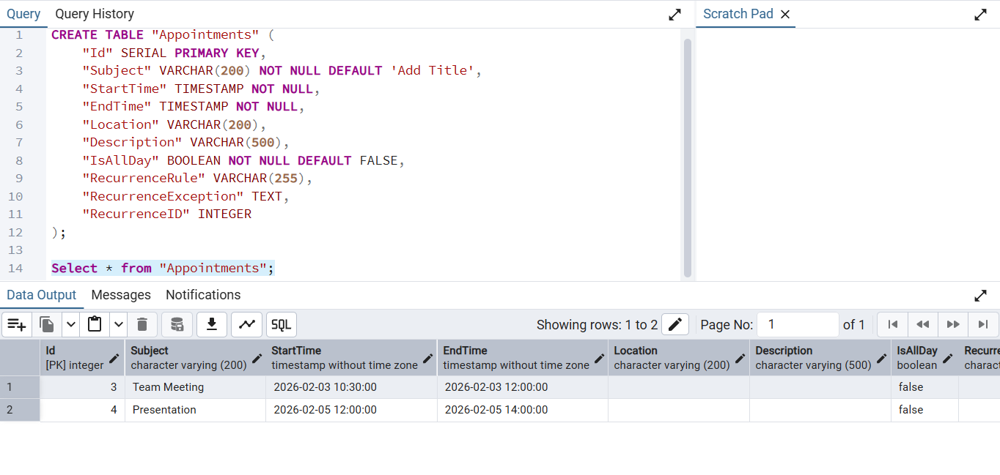

# Connecting PostgreSQL to Blazor Scheduler Using Entity Framework

The Syncfusion® Blazor Scheduler component supports binding data from a PostgreSQL database using Entity Framework Core (EF Core). This modern approach provides a more maintainable and type-safe alternative to raw SQL queries for managing appointments and calendar events.

## What is Entity Framework Core?

Entity Framework Core (EF Core) is a software tool that simplifies database operations in .NET applications. It serves as a bridge between C# code and databases like PostgreSQL.

### Key Benefits of Entity Framework Core

**Automatic SQL Generation**: Entity Framework Core generates optimized SQL queries automatically, eliminating the need to write raw SQL code.

**Type Safety**: Work with strongly-typed objects instead of raw SQL strings, reducing errors.

**Built-in Security**: Automatic parameterization prevents SQL injection attacks.

**Version Control for Databases**: Manage database schema changes version-by-version through migrations.

**Familiar Syntax**: Use LINQ (Language Integrated Query) syntax, which is more intuitive than raw SQL strings.

## What is Npgsql Entity Framework Core Provider?

The `Npgsql.EntityFrameworkCore.PostgreSQL` package is the official Entity Framework Core provider for PostgreSQL. It acts as a bridge between Entity Framework Core and PostgreSQL, allowing applications to read, write, update, and delete appointment data in a PostgreSQL database.

## Prerequisites

Ensure the following software and packages are installed before proceeding:

| Software/Package | Version | Purpose |
|-----------------|---------|---------|
| Visual Studio 2022 | 17.8 or later | Development IDE with Blazor workload |
| .NET SDK | 9.0 or later | Runtime and build tools |
| PostgreSQL Server | 14 or later | Database server |
| pgAdmin 4 | Latest | PostgreSQL GUI management tool |
| Syncfusion.Blazor.Schedule | 32.1.25 or later | Scheduler and UI components |
| Syncfusion.Blazor.Themes | 32.1.25 or later | Styling for Scheduler components |
| Npgsql.EntityFrameworkCore.PostgreSQL | 9.0.2 or later | PostgreSQL provider for Entity Framework Core |
| Microsoft.EntityFrameworkCore.Design | 9.0.0 or later | Design-time tools for migrations |

## Setting Up the PostgreSQL Environment for Entity Framework Core

### Step 1: Create a Blazor Web App

Create a **Blazor Web App** using Visual Studio 2022 or .NET CLI.

**Using Visual Studio 2022 or later:**
1. Open Visual Studio 2022
2. Click **Create a new project**
3. Search for **Blazor Web App** template
4. Configure project name as **BlazorSchedulerApp**
5. Select **.NET 9.0** as the target framework
6. Set **Interactive render mode** to **Server**
7. Set **Interactivity location** to **Per page/component**
8. Click **Create**

**Using .NET CLI:**
```bash
dotnet new blazor -n BlazorSchedulerApp --interactivity Server
cd BlazorSchedulerApp
```

> Configure the Interactive render mode to **InteractiveServer** during project creation as the Scheduler requires interactivity for CRUD operations.

### Step 2: Install Required NuGet Packages

Before installing the necessary NuGet packages, a new Blazor Web Application must be created using the default template. This template automatically generates essential starter files—such as `Program.cs`, `appsettings.json`, the `wwwroot` folder, and the `Components` folder.

For this guide, a Blazor application named **BlazorSchedulerApp** has been created. Once the project is set up, the next step involves installing the required NuGet packages. NuGet packages are software libraries that add functionality to the application. These packages enable Entity Framework Core and PostgreSQL integration.

#### Method 1: Using Package Manager Console

1. Open Visual Studio 2022.
2. Navigate to **Tools** → **NuGet Package Manager** → **Package Manager Console**.
3. Run the following commands:

```powershell
Install-Package Syncfusion.Blazor.Schedule
Install-Package Syncfusion.Blazor.Themes
Install-Package Npgsql.EntityFrameworkCore.PostgreSQL 
Install-Package Microsoft.EntityFrameworkCore.Design
```

#### Method 2: Using .NET CLI

Open a terminal in the project directory and run:

```bash
dotnet add package Syncfusion.Blazor.Schedule
dotnet add package Syncfusion.Blazor.Themes
dotnet add package Npgsql.EntityFrameworkCore.PostgreSQL
dotnet add package Microsoft.EntityFrameworkCore.Design
```

#### Project File Reference

The installed packages are reflected in the `BlazorSchedulerApp.csproj` file:

```xml
<ItemGroup>
    <PackageReference Include="Npgsql.EntityFrameworkCore.PostgreSQL" Version="10.0.2" />
    <PackageReference Include="Microsoft.EntityFrameworkCore.Design" Version="10.0.0">
      <IncludeAssets>runtime; build; native; contentfiles; analyzers; buildtransitive</IncludeAssets>
      <PrivateAssets>all</PrivateAssets>
    </PackageReference>
    <PackageReference Include="Syncfusion.Blazor.Schedule" Version="32.2.3" />
    <PackageReference Include="Syncfusion.Blazor.Themes" Version="32.2.3" />
</ItemGroup>
```

All required packages are now installed.

> **Note**: After installing packages, build the project to ensure all dependencies are restored correctly: `dotnet build`

### Step 3: Create the Data Model

A data model is a C# class that represents the structure of a database table. This model defines the properties that correspond to the columns in the `Appointments` table.

#### Instructions:

1. Create a new folder named **Models** in the Blazor application project.
2. Inside the **Models** folder, create a new file named `Appointment.cs`.
3. Define the `Appointment` class with the following code:




    using System.ComponentModel.DataAnnotations;

    namespace BlazorSchedulerApp.Models
    {
        /// <summary>
        /// Represents an appointment record mapped to the 'Appointments' table in the database.
        /// This model defines the structure of appointment-related data used throughout the application.
        /// </summary>
        public class Appointment
        {
            /// <summary>
            /// Gets or sets the unique identifier for the appointment record.
            /// This is the primary key and auto-incremented by the database.
            /// </summary>
            [Key]
            public int Id { get; set; }

            /// <summary>
            /// Gets or sets the subject or title of the appointment.
            /// Maximum length of 200 characters.
            /// </summary>
            [StringLength(200)]
            public string Subject { get; set; } = string.Empty;

            /// <summary>
            /// Gets or sets the detailed description of the appointment.
            /// Maximum length of 500 characters.
            /// </summary>
            [StringLength(500)]
            public string Description { get; set; } = string.Empty;

            /// <summary>
            /// Gets or sets the start date and time of the appointment.
            /// This field is required.
            /// </summary>
            [Required]
            public DateTime StartTime { get; set; }

            /// <summary>
            /// Gets or sets the end date and time of the appointment.
            /// This field is required.
            /// </summary>
            [Required]
            public DateTime EndTime { get; set; }

            /// <summary>
            /// Gets or sets the location where the appointment takes place.
            /// Maximum length of 200 characters.
            /// </summary>
            [StringLength(200)]
            public string Location { get; set; } = string.Empty;

            /// <summary>
            /// Gets or sets a value indicating whether the appointment spans the entire day.
            /// </summary>
            public bool IsAllDay { get; set; }

            /// <summary>
            /// Gets or sets the recurrence rule for repeating appointments.
            /// Uses iCalendar RRULE format (e.g., "FREQ=DAILY;INTERVAL=1").
            /// Maximum length of 50 characters.
            /// </summary>
            [StringLength(50)]
            public string RecurrenceRule { get; set; } = string.Empty;

            /// <summary>
            /// Gets or sets the ID of the parent appointment in a recurrence series.
            /// Links recurring appointment instances to their parent.
            /// </summary>
            public int? RecurrenceID { get; set; }

            /// <summary>
            /// Gets or sets the exception dates for recurring appointments.
            /// Stores dates when the recurring appointment should not occur.
            /// </summary>
            public string? RecurrenceException { get; set; }

            /// <summary>
            /// points to parent series Id 
            /// </summary>
            public int? FollowingID { get; set; }
        }
    }



#### Explanation:

- The `[Key]` attribute marks the `Id` property as the primary key (a unique identifier for each record).
- Each property represents a column in the database table.
- The `?` symbol indicates that a property is nullable (can be empty).
- The model includes comprehensive XML documentation for each property.
- `StringLength` attributes enforce maximum character limits for text fields.
- The model supports recurring appointments through `RecurrenceRule`, `RecurrenceID`, and `RecurrenceException` properties.

The data model has been successfully created.

> **Note**: The `Subject` property does not have the `[Required]` attribute to allow empty titles. The service layer will provide a default value "Add Title" if the subject is empty.

### Step 4: Configure the DbContext

A `DbContext` is a special class that manages the connection between the application and the PostgreSQL database. It handles all database operations such as saving, updating, deleting, and retrieving appointment data.

#### Instructions:

1. Create a new folder named **Data** in the Blazor application project.
2. Inside the **Data** folder, create a new file named `ApplicationDbContext.cs`.
3. Define the `ApplicationDbContext` class with the following code:




    using Microsoft.EntityFrameworkCore;
    using BlazorSchedulerApp.Models;

    namespace BlazorSchedulerApp.Data
    {
        /// <summary>
        /// DbContext for Appointment entity
        /// Manages database connections and entity configurations for the Appointment Scheduler
        /// This context bridges the application with PostgreSQL database
        /// </summary>
        public class ApplicationDbContext : DbContext
        {
            /// <summary>
            /// Initializes a new instance of the ApplicationDbContext class.
            /// </summary>
            /// <param name="options">The options to be used by a DbContext</param>
            public ApplicationDbContext(DbContextOptions<ApplicationDbContext> options)
                : base(options)
            {
            }

            /// <summary>
            /// Gets or sets the DbSet for Appointment entities.
            /// Represents the collection of all appointments in the database.
            /// </summary>
            public DbSet<Appointment> Appointments { get; set; } = null!;

            /// <summary>
            /// Configures the entity mappings, constraints, and database-specific configurations.
            /// This method is called by Entity Framework Core during model creation.
            /// </summary>
            /// <param name="modelBuilder">Provides a simple API for configuring the EF model</param>
            protected override void OnModelCreating(ModelBuilder modelBuilder)
            {
                base.OnModelCreating(modelBuilder);

                // Configure the Appointment entity
                modelBuilder.Entity<Appointment>(entity =>
                {
                    // Define primary key
                    entity.HasKey(e => e.Id);

                    // Configure string properties with max length constraints
                    entity.Property(e => e.Subject)
                        .IsRequired()
                        .HasMaxLength(200);

                    entity.Property(e => e.Description)
                        .HasMaxLength(500);

                    entity.Property(e => e.Location)
                        .HasMaxLength(200);

                    // Configure required date/time properties
                    entity.Property(e => e.StartTime)
                        .IsRequired();

                    entity.Property(e => e.EndTime)
                        .IsRequired();

                    // Configure recurrence-related properties
                    entity.Property(e => e.RecurrenceRule)
                        .HasMaxLength(50);
                    // Helpful index: find all edited occurrences for a parent quickly
                    entity.HasIndex(e => e.RecurrenceID);
                
                    entity.Property(x => x.FollowingID);

                    entity.HasIndex(x => x.FollowingID);
                });
            }
        }
    }



#### Explanation:

- The `DbContext` class inherits from Entity Framework's `DbContext` base class.
- The `Appointments` property represents the `Appointments` table in the database.
- The `OnModelCreating` method configures how the database columns should behave (maximum length, required/optional).
- By convention, Entity Framework Core will create a table named `Appointments` based on the `DbSet<Appointment>` property name.

#### Why the DbContext is Required:

1. It connects the application to the PostgreSQL database.
2. It manages all database operations.
3. It maps C# models to actual database tables.
4. It configures how data should be validated and stored.

Without this class, Entity Framework Core will not know where to save data or how to interact with the `Appointments` table. The DbContext has been successfully configured.

### Step 5: Configure the Connection String

A connection string contains the information needed to connect the application to the PostgreSQL database, including the server address, database name, and authentication credentials.

#### Instructions:

1. Open the `appsettings.json` file in the project root.
2. Update the `ConnectionStrings` section with the PostgreSQL connection details:

    ```json
    {
      "ConnectionStrings": {
        "DefaultConnection": "Host=localhost;Port=5432;Database=SchedulerEvents;Username=postgres;Password=your_password"
      },
      "Logging": {
        "LogLevel": {
          "Default": "Information",
          "Microsoft.AspNetCore": "Warning"
        }
      },
      "AllowedHosts": "*"
    }
    ```

#### Connection String Components:

| Component | Description |
|-----------|-------------|
| Host | The address of the PostgreSQL server (localhost for local development) |
| Port | The port number on which PostgreSQL is running (default is 5432) |
| Database | The database name (in this case, SchedulerEvents) |
| Username | The PostgreSQL username (default is postgres) |
| Password | The password for the PostgreSQL user account |

> **Important**: Replace `your_password` with your actual PostgreSQL password.

> **Security Note**: For production environments, store sensitive credentials in environment variables or Azure Key Vault instead of storing them in `appsettings.json`. Example: `Password=${DB_PASSWORD}` and set the environment variable `DB_PASSWORD` on the deployment server.

The database connection string has been configured successfully.

### Step 6: Create the Service Class

A service class is an intermediary layer that handles all database operations. This class uses Entity Framework Core to communicate with the PostgreSQL database.

#### Instructions:

1. Create a new folder named **Services** in the Blazor application project.
2. Inside the **Services** folder, create a new file named `AppointmentService.cs`.
3. Define the `AppointmentService` class with the following code:




    using Microsoft.EntityFrameworkCore;
    using BlazorSchedulerApp.Data;
    using BlazorSchedulerApp.Models;

    namespace BlazorSchedulerApp.Services
    {
        /// <summary>
        /// Service class for Appointment entity using Entity Framework Core
        /// Handles all CRUD operations and business logic for appointments
        /// Communicates with PostgreSQL database through ApplicationDbContext
        /// </summary>
        public class AppointmentService
        {
            private readonly ApplicationDbContext _context;

            public AppointmentService(ApplicationDbContext context)
            {
                _context = context;
            }

            /// <summary>
            /// Retrieves all appointments from the database
            /// </summary>
            /// <returns>List of all appointments</returns>
            public async Task<List<Appointment>> GetAllAppointmentsAsync()
            {
                try
                {
                    return await _context.Appointments.ToListAsync();
                }
                catch (Exception ex)
                {
                    Console.WriteLine($"Error getting appointments: {ex.Message}");
                    return new List<Appointment>();
                }
            }

            /// <summary>
            /// Retrieves a single appointment by ID
            /// </summary>
            /// <param name="id">The appointment ID to retrieve</param>
            /// <returns>The appointment if found, otherwise null</returns>
            public async Task<Appointment?> GetAppointmentByIdAsync(int id)
            {
                try
                {
                    return await _context.Appointments.FindAsync(id);
                }
                catch (Exception ex)
                {
                    Console.WriteLine($"Error getting appointment: {ex.Message}");
                    return null;
                }
            }

            /// <summary>
            /// Creates a new appointment in the database
            /// </summary>
            /// <param name="appointment">The appointment model to add</param>
            /// <returns>The created appointment with database-generated ID</returns>
            public async Task<Appointment> CreateAppointmentAsync(Appointment appointment)
            {
                try
                {
                    // Reset Id to 0 to let database generate it
                    appointment.Id = 0;

                    // Provide default subject if empty
                    if (string.IsNullOrWhiteSpace(appointment.Subject))
                    {
                        appointment.Subject = "Add Title";
                    }

                    _context.Appointments.Add(appointment);
                    await _context.SaveChangesAsync();
                    return appointment;
                }
                catch (Exception ex)
                {
                    Console.WriteLine($"Error creating appointment: {ex.Message}");
                    throw;
                }
            }

            /// <summary>
            /// Updates an existing appointment in the database
            /// </summary>
            /// <param name="appointment">The appointment model with updated values</param>
            /// <returns>The updated appointment</returns>
            public async Task<Appointment> UpdateAppointmentAsync(Appointment appointment)
            {
                try
                {
                    // Provide default subject if empty
                    if (string.IsNullOrWhiteSpace(appointment.Subject))
                    {
                        appointment.Subject = "Add Title";
                    }

                    // Detach any existing tracked entity with same Id to avoid tracking conflicts
                    var existingEntity = _context.Appointments.Local
                        .FirstOrDefault(e => e.Id == appointment.Id);
                    if (existingEntity != null)
                    {
                        _context.Entry(existingEntity).State = EntityState.Detached;
                    }

                    _context.Entry(appointment).State = EntityState.Modified;
                    await _context.SaveChangesAsync();
                    return appointment;
                }
                catch (Exception ex)
                {
                    Console.WriteLine($"Error updating appointment: {ex.Message}");
                    throw;
                }
            }

            /// <summary>
            /// Deletes an appointment from the database
            /// </summary>
            /// <param name="id">The appointment ID to delete</param>
            /// <returns>True if deletion was successful, otherwise false</returns>
            public async Task<bool> DeleteAppointmentAsync(int id)
            {
                try
                {
                    var appointment = await _context.Appointments.FindAsync(id);
                    if (appointment != null)
                    {
                        _context.Appointments.Remove(appointment);
                        await _context.SaveChangesAsync();
                        return true;
                    }
                    return false;
                }
                catch (Exception ex)
                {
                    Console.WriteLine($"Error deleting appointment: {ex.Message}");
                    return false;
                }
            }
        }
    }



#### Service Layer Benefits:

- Encapsulates database logic away from UI components
- Provides error handling and logging
- Allows for easier testing and maintenance
- Handles Entity Framework change tracking issues

#### Error Handling in Service:

Each method includes try-catch blocks to:
- Log errors to console for debugging
- Prevent application crashes
- Return safe default values (empty list, null, false)

The service class has been created successfully.

### Step 7: Register Services in Program.cs

The `Program.cs` file is where application services are registered and configured. This file must be updated to enable Entity Framework Core with PostgreSQL and the service pattern.

#### Instructions:

1. Open the `Program.cs` file at the project root.
2. Add the following code:




    using BlazorSchedulerApp.Components;
    using BlazorSchedulerApp.Data;
    using BlazorSchedulerApp.Services;
    using Microsoft.EntityFrameworkCore;
    using Syncfusion.Blazor;

    // Configure AppContext to handle DateTime timestamps for PostgreSQL
    // This prevents double UTC conversion issues
    AppContext.SetSwitch("Npgsql.EnableLegacyTimestampBehavior", true);

    var builder = WebApplication.CreateBuilder(args);

    // Add services to the container
    builder.Services.AddRazorComponents()
        .AddInteractiveServerComponents();

    // ========== SYNCFUSION BLAZOR CONFIGURATION ==========
    // Register Syncfusion Blazor service
    builder.Services.AddSyncfusionBlazor();

    // ========== ENTITY FRAMEWORK CORE CONFIGURATION ==========
    // Get connection string from appsettings.json
    var connectionString = builder.Configuration.GetConnectionString("DefaultConnection");

    if (string.IsNullOrEmpty(connectionString))
    {
        throw new InvalidOperationException("Connection string 'DefaultConnection' not found in configuration.");
    }

    // Register DbContext with PostgreSQL provider (Npgsql)
    builder.Services.AddDbContext<ApplicationDbContext>(options =>
    {
        options.UseNpgsql(connectionString);

        // Enable detailed error messages in development
        if (builder.Environment.IsDevelopment())
        {
            options.EnableSensitiveDataLogging();
            options.EnableDetailedErrors();
        }
    });

    // Register Application Services for dependency injection
    builder.Services.AddScoped<AppointmentService>();
    // =======================================================

    var app = builder.Build();

    // Configure the HTTP request pipeline
    if (!app.Environment.IsDevelopment())
    {
        app.UseExceptionHandler("/Error", createScopeForErrors: true);
        app.UseHsts();
    }

    app.UseHttpsRedirection();
    app.UseAntiforgery();

    app.MapStaticAssets();
    app.MapRazorComponents<App>()
        .AddInteractiveServerRenderMode();

    app.Run();




#### Explanation:

- **`AppContext.SetSwitch("Npgsql.EnableLegacyTimestampBehavior", true)`**: Prevents PostgreSQL from automatically converting DateTime to UTC, avoiding timezone offset issues.
- **`AddSyncfusionBlazor()`**: Registers Syncfusion Blazor components (Scheduler, themes, etc.).
- **`AddDbContext<ApplicationDbContext>`**: Registers the DbContext with PostgreSQL as the database provider using `UseNpgsql()`.
- **Connection String Validation**: Ensures the connection string is configured before attempting to connect.
- **`EnableSensitiveDataLogging()`**: Enabled in development to log detailed information about database operations (useful for debugging).
- **`EnableDetailedErrors()`**: Provides more detailed error messages during development.
- **`AddScoped<AppointmentService>`**: Registers the service as a scoped service, creating a new instance for each HTTP request.
- **`AddRazorComponents()` and `AddInteractiveServerComponents()`**: Enables Blazor server-side rendering with interactive components.

The service registration has been completed successfully.

## Integrating Syncfusion Blazor Scheduler

### Step 1: Install and Configure Blazor Scheduler Components

Syncfusion is a library that provides pre-built UI components like Scheduler, which is used to display and manage calendar events and appointments.

#### Instructions:

1. The `Syncfusion.Blazor.Schedule` package was installed in Step 2 of the previous section.

2. Import the required namespaces in the `Components/_Imports.razor` file:




    @using System.Net.Http
    @using System.Net.Http.Json
    @using Microsoft.AspNetCore.Components.Forms
    @using Microsoft.AspNetCore.Components.Routing
    @using Microsoft.AspNetCore.Components.Web
    @using static Microsoft.AspNetCore.Components.Web.RenderMode
    @using Microsoft.AspNetCore.Components.Web.Virtualization
    @using Microsoft.JSInterop
    @using BlazorSchedulerApp
    @using BlazorSchedulerApp.Components
    @using BlazorSchedulerApp.Components.Layout
    @using BlazorSchedulerApp.Models
    @using BlazorSchedulerApp.Services
    @using Syncfusion.Blazor
    @using Syncfusion.Blazor.Schedule
    @using Syncfusion.Blazor.Data
    



3. Add the Syncfusion stylesheet and scripts in the `Components/App.razor` file. Find the `<head>` section and add:




    <!DOCTYPE html>
    <html lang="en">

    <head>
        <meta charset="utf-8" />
        <meta name="viewport" content="width=device-width, initial-scale=1.0" />
        <base href="/" />
        <ResourcePreloader />
        <link rel="stylesheet" href="@Assets["lib/bootstrap/dist/css/bootstrap.min.css"]" />
        <link rel="stylesheet" href="@Assets["app.css"]" />
        <link rel="stylesheet" href="@Assets["BlazorSchedulerApp.styles.css"]" />

        <!-- Syncfusion Blazor Stylesheet -->
        <link href="_content/Syncfusion.Blazor.Themes/bootstrap5.3.css" rel="stylesheet" />

        <ImportMap />
        <link rel="icon" type="image/png" href="favicon.png" />
        <HeadOutlet />
    </head>

    <body>
        <Routes />
        <ReconnectModal />
        <script src="@Assets["_framework/blazor.web.js"]"></script>

        <!-- Syncfusion Blazor Scripts -->
        <script src="_content/Syncfusion.Blazor.Core/scripts/syncfusion-blazor.min.js" type="text/javascript"></script>
    </body>

    </html>
    



#### Theme Options:

- `bootstrap5.3.css` - Bootstrap 5.3 theme (used in this example)
- `material3.css` - Material Design 3 theme
- `fluent.css` - Microsoft Fluent Design theme
- `tailwind3.css` - Tailwind CSS theme

For this project, the **bootstrap5.3** theme is used. A different theme can be selected or the existing theme can be customized based on project requirements. Refer to the [Syncfusion Blazor Components Appearance documentation](https://blazor.syncfusion.com/documentation/appearance/themes) to learn more about theming and customization options.

> **Critical**: The Syncfusion JavaScript file (`syncfusion-blazor.min.js`) is **REQUIRED** for Syncfusion components to work with InteractiveServer render mode. Without this script, you'll see JavaScript interop errors.

Syncfusion components are now configured and ready to use. For additional guidance, refer to the [Scheduler component's getting-started documentation](https://blazor.syncfusion.com/documentation/scheduler/getting-started).

### Step 2: Create and Apply Database Migrations

Before creating the Scheduler component, generate Entity Framework Core migrations to create the database schema.

#### Instructions:

1. **use pgAdmin or psql to create database**:

    ```sql
    CREATE DATABASE "SchedulerEvents";
    ```

2. **Generate the migration**. Open a terminal in the project directory and run:

    ```bash
    cd BlazorSchedulerApp
    dotnet ef migrations add InitialCreate
    ```

This creates three files in the `Migrations/` folder:
- `<timestamp>_InitialCreate.cs` - Contains Up() and Down() methods for schema changes
- `<timestamp>_InitialCreate.Designer.cs` - Migration metadata
- `ApplicationDbContextModelSnapshot.cs` - Current model state snapshot

> **Note**: The `<timestamp>` is automatically generated by EF Core based on the current date and time. Your files will have a different timestamp.

3. **Apply the migration** to create tables in the database:

    ```bash
    dotnet ef database update
    ```

**What happens during update:**
1. Connects to PostgreSQL using connection string from `appsettings.json`
2. Creates `__EFMigrationsHistory` table to track applied migrations
3. Executes the Up() method from InitialCreate migration
4. Creates `Appointments` table with all columns and constraints

> **Note**: The "Failed executing DbCommand" message on first run is normal. It means the `__EFMigrationsHistory` table doesn't exist yet. EF Core will create it automatically.

4. **Verify migration success** using pgAdmin or psql:

```bash
psql -U postgres -d SchedulerEvents -c "\dt"
```

The database schema has been created successfully.

### Step 3: Create the Scheduler Component

The Scheduler component will display appointment data in a Syncfusion Blazor Scheduler with full CRUD (Create, Read, Update, Delete) capabilities and multiple calendar views.

#### Instructions:

1. Create a new file named `Scheduler.razor` in the `Components/Pages` folder.
2. Add the following code to create the Scheduler:




    @page "/"
    @rendermode InteractiveServer
    @inject AppointmentService AppointmentService

    <PageTitle>Appointment Scheduler</PageTitle>

    <SfSchedule TValue="Appointment"
                @ref="scheduleRef"
                Height="650px"
                @bind-SelectedDate="currentDate"
                @bind-CurrentView="currentView"
                ShowQuickInfo="true">

        <ScheduleViews>
            <ScheduleView Option="View.Day"></ScheduleView>
            <ScheduleView Option="View.Week"></ScheduleView>
            <ScheduleView Option="View.WorkWeek"></ScheduleView>
            <ScheduleView Option="View.Month"></ScheduleView>
            <ScheduleView Option="View.Agenda"></ScheduleView>
        </ScheduleViews>

        <!-- Data is now bound through DataManager + CustomAdaptor -->
        <ScheduleEventSettings TValue="Appointment">
            <SfDataManager AdaptorInstance="@typeof(CustomAdaptor)" Adaptor="Adaptors.CustomAdaptor"></SfDataManager>
        </ScheduleEventSettings>

    </SfSchedule>

    @code {
        private SfSchedule<Appointment>? scheduleRef;
        private DateTime currentDate = DateTime.Today;
        private View currentView = View.Week;

        protected override void OnInitialized()
        {
            // Make your DI service available to the CustomAdaptor (created by Syncfusion internally)
            CustomAdaptor.AppointmentService = AppointmentService;
        }

        /// <summary>
        /// CustomAdaptor bridges the Scheduler's DataManager with your EF Core service.
        /// It handles read and CRUD operations by calling AppointmentService.
        /// </summary>
        public class CustomAdaptor : DataAdaptor
        {
            /// <summary>
            /// Set in OnInitialized() above so the adaptor can use DI-backed service.
            /// </summary>
            public static AppointmentService? AppointmentService { get; set; }

            public override async Task<object> ReadAsync(DataManagerRequest dataManagerRequest, string? key = null)
            {
                if (AppointmentService is null)
                    throw new InvalidOperationException("AppointmentService is not initialized.");

                // Fetch all appointments. (You can add server-side filtering/paging if needed.)
                var data = await AppointmentService.GetAllAppointmentsAsync();

                // Return result + total count when RequiresCounts is true
                return dataManagerRequest.RequiresCounts
                    ? new DataResult { Result = data, Count = data.Count }
                    : (object)data;
            }

            public override async Task<object> InsertAsync(DataManager dataManager, object data, string key)
            {
                if (AppointmentService is null)
                    throw new InvalidOperationException("AppointmentService is not initialized.");

                var item = data as Appointment ?? throw new ArgumentException("InsertAsync received invalid data type.");
                // Persist and return the created entity with DB-generated Id
                var created = await AppointmentService.CreateAppointmentAsync(item);
                return created;
            }

            public override async Task<object> UpdateAsync(DataManager dataManager, object data, string keyField, string key)
            {
                if (AppointmentService is null)
                    throw new InvalidOperationException("AppointmentService is not initialized.");

                var item = data as Appointment ?? throw new ArgumentException("UpdateAsync received invalid data type.");

                // Optional validation: ensure EndTime >= StartTime
                if (item.EndTime < item.StartTime)
                    throw new ArgumentException("End time cannot be earlier than start time.");

                var updated = await AppointmentService.UpdateAppointmentAsync(item);
                return updated;
            }

            public override async Task<object> RemoveAsync(DataManager dataManager, object data, string keyField, string key)
            {
                if (AppointmentService is null)
                    throw new InvalidOperationException("AppointmentService is not initialized.");

                // For Scheduler, "data" is the key value (Id). It can be int or string.
                int id;
                if (data is int directId)
                {
                    id = directId;
                }
                else if (!int.TryParse(data?.ToString(), out id))
                {
                    throw new ArgumentException("RemoveAsync received invalid key value.");
                }

                await AppointmentService.DeleteAppointmentAsync(id);
                return data;
            }
            public override async Task<object> BatchUpdateAsync(DataManager dataManager,object changedRecords, object addedRecords, object deletedRecords,string keyField, string key, int? dropIndex)
             {
                 if (AppointmentService is null)
                     throw new InvalidOperationException("AppointmentService is not initialized.");

                 // Cast the payloads defensively
                 var changed = (changedRecords as IEnumerable<object>)?.Cast<Appointment>()?.ToList() ?? new();
                 var added = (addedRecords as IEnumerable<object>)?.Cast<Appointment>()?.ToList() ?? new();
                 var deleted = (deletedRecords as IEnumerable<object>)?.Cast<Appointment>()?.ToList() ?? new();

                 foreach (var a in changed)
                     await AppointmentService.UpdateAppointmentAsync(a);

                 foreach (var a in added)
                     await AppointmentService.CreateAppointmentAsync(a);

                 foreach (var a in deleted)
                     await AppointmentService.DeleteAppointmentAsync(a.Id);

                 var data = await AppointmentService.GetAllAppointmentsAsync();
                 return new DataResult { Result = data, Count = data.Count };
             }
        }
    }



#### Component Explanation:

- **`@inject AppointmentService`**  
  Injects the backend service that performs all CRUD operations on the PostgreSQL database using Entity Framework Core.

- **`<SfSchedule>`**  
  The main Scheduler component that displays appointments in calendar format and supports multiple view modes.

- **`<ScheduleViews>`**  
  Defines the list of calendar views (Day, Week, WorkWeek, Month, Agenda) available for selection.

- **`<ScheduleEventSettings>`**  
  Configures the appointment model, enables create/edit/delete actions, and connects the Scheduler to the data source.

- **`<SfDataManager>`**  
  Binds the Scheduler to the **CustomAdaptor**, which handles data communication.  
  It enables automatic calls for Read, Insert, Update, and Delete operations.

- **`CustomAdaptor`**  
  A custom class derived from `DataAdaptor` that executes all database operations by calling the injected `AppointmentService`.  
  It handles `ReadAsync`, `InsertAsync`, `UpdateAsync`,`RemoveAsync`, and `BatchUpdateAsync`.

- **`OnInitialized`**  
  Assigns the injected `AppointmentService` to the CustomAdaptor so the Scheduler can access database logic when loading.

#### Key Implementation Details:

- **CustomAdaptor**: Handles all database operations (Read, Insert, Update, Delete) directly through EF Core  
- **SfDataManager**: Automatically triggers the adaptor methods whenever the Scheduler performs an action  
- **Scheduler UI**: Updates immediately, while the adaptor persists changes to PostgreSQL

**Event Flow:**

1. User creates, edits, or deletes an appointment in the Scheduler  
2. **SfDataManager** detects the action and triggers the corresponding method in the **CustomAdaptor**  
3. The Scheduler UI updates immediately without waiting for any database response  
4. **CustomAdaptor** executes the required database operation (`InsertAsync`, `UpdateAsync`, `RemoveAsync`) through `AppointmentService`  
5. After saving, the updated appointment data (including database-generated ID) is returned to the Scheduler for syncing
``
The Scheduler component has been created successfully.

### Step 4: Build and Run the Application

With the Scheduler component created and database configured, you're ready to run the application.

#### Build the Application

Ensure there are no compilation errors:

```bash
dotnet build
```

#### Run the Application

Start the application:

```bash
dotnet run
```

Or use watch mode for automatic reload during development:

```bash
dotnet watch
```

#### Access the Scheduler

The application will start on a port configured in `launchSettings.json` (typically `http://localhost:5xxx`).

Open your browser and navigate to:
```
http://localhost:5075/scheduler

```

> **Note**: Replace `<port>` with the actual port number shown in the terminal output when the application starts.

You can now perform CRUD operations on the scheduler:
- **Create**: Click on a time slot or use the "+" button
- **Edit**: Double-click an appointment or click and select "Edit"
- **Delete**: Click an appointment and select "Delete"
- **Drag & Drop**: Move appointments to different time slots
- **Resize**: Extend or shorten appointment duration

All operations are automatically saved to the PostgreSQL database.

## Output Preview

*Image illustrating the Syncfusion Blazor Scheduler*


*Image illustrating the events of Syncfusion Blazor Scheduler in PostgreSQL*

## Complete Sample Repository

A complete, working sample implementation is available in the [GitHub repository.](https://github.com/SyncfusionExamples/How-to-integrate-Syncfusion-Blazor-Scheduler-with-Postgre)

## Troubleshooting

### JavaScript Interop Errors

**Error**: `Could not find 'sfBlazor.Toolbar.initialize'` or `'sfBlazor' was undefined`

**Solution**: Add Syncfusion JavaScript file in `App.razor` before closing `</body>` tag:
```html
<script src="_content/Syncfusion.Blazor.Core/scripts/syncfusion-blazor.min.js" type="text/javascript"></script>
```

### Database Connection Failed

**Error**: Cannot connect to PostgreSQL database

**Solutions**:
- Verify PostgreSQL service is running: `pg_ctl status`
- Check connection string in `appsettings.json`
- Ensure `SchedulerEvents` database exists
- Confirm username and password are correct
- Test connection using pgAdmin

### Migration Errors

**Error**: `dotnet ef database update` fails

**Solutions**:
- Ensure PostgreSQL is running and database exists
- Verify user has CREATE TABLE permissions
- Check password in connection string
- Delete `Migrations` folder and run: `dotnet ef migrations add InitialCreate` (if corrupted)

> **Note**: The error `relation "__EFMigrationsHistory" does not exist` on first run is normal.

### Timezone Issues

**Error**: Appointment times are incorrect (offset by several hours)

**Solution**: Add this line at the top of `Program.cs`:
```csharp
AppContext.SetSwitch("Npgsql.EnableLegacyTimestampBehavior", true);
```

### Appointments Not Persisting

**Error**: Appointments disappear after page refresh

**Solutions**:
- Check browser console (F12) for JavaScript errors
- Verify `OnActionCompleted` calls service methods correctly
- Check PostgreSQL logs for SQL errors
- Ensure database connection is working

### Scheduler Not Loading

**Error**: Spinner shows indefinitely

**Solutions**:
- Check that `AppointmentService` is registered in `Program.cs`
- Verify database connection string is correct
- Check console for errors in `LoadAppointments()` method
- Ensure migrations have been applied: `dotnet ef database update`

## Summary

This documentation has demonstrated how to:

1. Set up a PostgreSQL database and integrate it with Entity Framework Core  
2. Create the `Appointment` data model and configure the `ApplicationDbContext`  
3. Configure the PostgreSQL connection string in `appsettings.json`  
4. Implement a service layer (`AppointmentService`) for all CRUD operations  
5. Register Syncfusion, DbContext, and services in `Program.cs`  
6. Build a Blazor Scheduler component connected through `SfDataManager`  
7. Use a CustomAdaptor to handle all database persistence while keeping the Scheduler UI responsive

The application now provides a professional appointment scheduling system with:
- Multiple calendar views (Day, Week, Month, Agenda)
- Full CRUD operations
- Database persistence with PostgreSQL
- Type-safe queries with Entity Framework Core
- Responsive UI without page refreshes

## Additional Resources

- [Syncfusion Blazor Scheduler Documentation](https://blazor.syncfusion.com/documentation/scheduler/getting-started)
- [Entity Framework Core Documentation](https://docs.microsoft.com/en-us/ef/core/)
- [Npgsql Entity Framework Core Provider](https://www.npgsql.org/efcore/)
- [PostgreSQL Documentation](https://www.postgresql.org/docs/)

---
