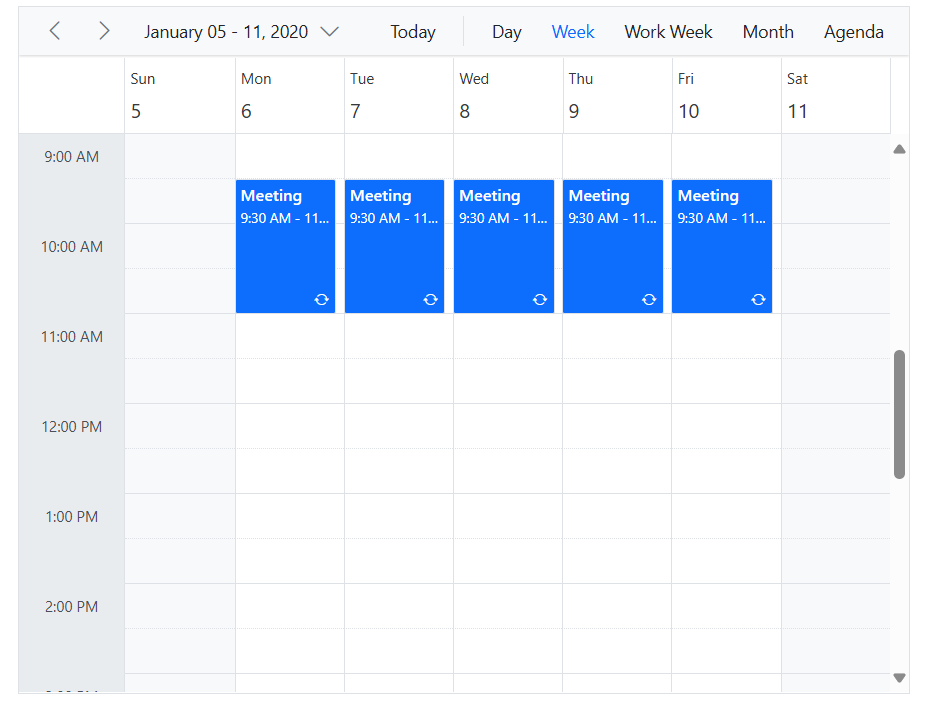
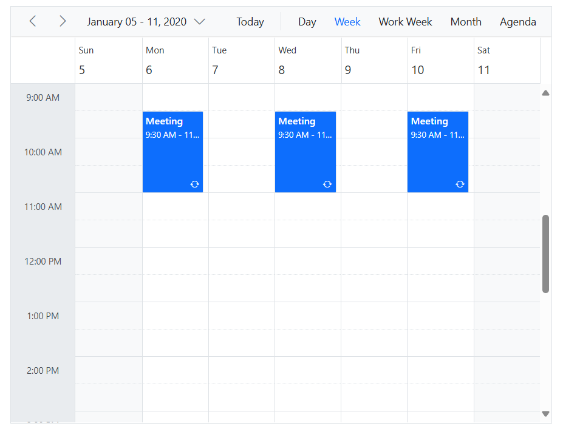
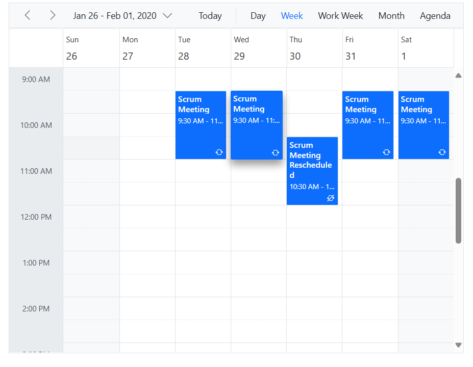
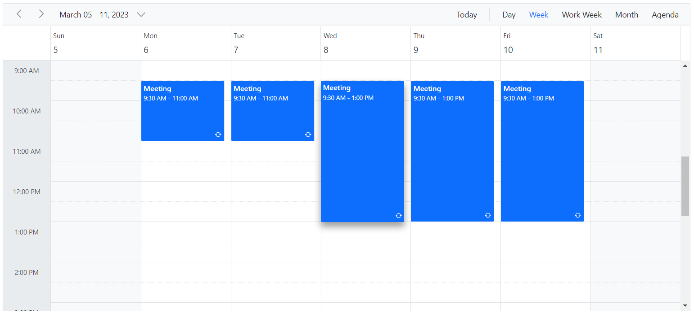

# Recurring Events in Blazor Scheduler Component

It represents an appointment that is created for a certain time interval and occurring repeatedly on a daily, weekly, monthly or yearly basis at the same time interval based on the provided recurrence rule. Usually, the recurring events are indicated by a repeat marker at the bottom-right position.

N>Set [`RecurrenceRule`](https://help.syncfusion.com/cr/blazor/Syncfusion.Blazor.Schedule.FieldRecurrenceRule.html) property to create recurring events.

## Recurrence Options and Rules

Events can be repeated on a daily, weekly, monthly or yearly basis based on the recurrence rule which accepts the string value. The following details should be assigned to the [`RecurrenceRule`](https://help.syncfusion.com/cr/blazor/Syncfusion.Blazor.Schedule.FieldRecurrenceRule.html) property to generate the recurring instances.

* Repeat type - daily/weekly/monthly/yearly.
* The number of times it needs to be repeated.
* The interval duration.
* The time period to render the appointment, etc.

There are four repeat types available namely,

* **Daily** - Creates the recurring instances on daily basis.
* **Weekly** - Creates the recurring instances on weekly basis for the selected days.
* **Monthly** - Creates the recurring instances on monthly basis for the selected months and other provided recurrence criteria.
* **Yearly** - Creates the recurring instances on yearly basis.

## Recurrence Properties

 The properties based on which the recurrence appointments are created with its respective time period are depicted in the following table. Also, the valid rule string can be referred from [iCalendar](https://datatracker.ietf.org/doc/html/rfc5545#section-3.3.10) specifications.

 N> Refer [iCalendar](https://datatracker.ietf.org/doc/html/rfc5545#section-3.3.10) specifications for valid recurrence rule string.

| Property | Purpose | Example |
|-------|---------| --------- |
| FREQ | Maintains the repeat type (Daily, Weekly, Monthly, Yearly) value of the appointment. | FREQ=DAILY;INTERVAL=1|
| INTERVAL | Maintains the interval value of the appointments. When the daily appointment is created at an interval of 2, the appointments are rendered on the days Monday, Wednesday and Friday (Creates an appointment on all days by leaving the interval of one day gap). | FREQ=DAILY;INTERVAL=2|
| COUNT | It holds the appointment’s count value. When the COUNT value is 10, then 10 instances of appointments are created in the recurrence series. | FREQ=DAILY;INTERVAL=1;COUNT=10|
| UNTIL | This property holds the end date value (in ISO format) denoting when the recurrence actually ends. | FREQ=DAILY;INTERVAL=1;UNTIL=20200530T041343Z;|
| BYDAY | It holds the day value(s), representing on which the appointments actually renders. Create the weekly appointment, and select the day(s) from the day options (Monday/Tuesday/Wednesday/Thursday/Friday/Saturday/Sunday). When Monday is selected, the first two letters of the selected day "MO" is saved in the BYDAY property. When multiple days are selected, the values are separated by commas. | FREQ=WEEKLY;INTERVAL=1;BYDAY=MO,WE;COUNT=10|
| BYMONTHDAY | This property is used to store the date value of the Month, while creating the Month recurrence appointment. When a Monthly recurrence appointment is created for every 3rd day of the month, then BYMONTHDAY holds the value 3 and creates the appointment on 3rd day of every month. | FREQ=MONTHLY;BYMONTHDAY=3;INTERVAL=1;COUNT=10|
| BYMONTH | This property is used to store the index value of the selected Month while creating the yearly appointments. When the yearly appointment is created on June month, the index value of June month 6 will get stored in the BYMONTH field. The appointment is created on every 6th month of a year. | FREQ=YEARLY;BYMONTHDAY=16;BYMONTH=6;INTERVAL=1;COUNT=10|
| BYSETPOS | This property is used to store the index value of the week. When the monthly appointment is created in second week of a month, the index value of the second week (2) is stored in BYSETPOS. | FREQ=MONTHLY;BYDAY=MO;BYSETPOS=2;COUNT=10|

N> Default recurrence-related validation has been included for recurring appointments, similar to that available in Outlook. Validation typically occurs during the creation, editing, dragging, dropping, or resizing of recurring appointments, and also if any single occurrence changes.

## Creating a Recurring Event

The following example depicts how to create a recurring event on Scheduler with the specific recurrence rule. In the following example, an event is made to repeat on daily mode and ends after 5 occurrences.

```cshtml
@using Syncfusion.Blazor.Schedule

<SfSchedule TValue="AppointmentData" Height="550px" @bind-SelectedDate="@CurrentDate">
    <ScheduleEventSettings DataSource="@DataSource"></ScheduleEventSettings>
    <ScheduleViews>
        <ScheduleView Option="View.Day"></ScheduleView>
        <ScheduleView Option="View.Week"></ScheduleView>
        <ScheduleView Option="View.WorkWeek"></ScheduleView>
        <ScheduleView Option="View.Month"></ScheduleView>
        <ScheduleView Option="View.Agenda"></ScheduleView>
    </ScheduleViews>
</SfSchedule>

@code{
    DateTime CurrentDate = new DateTime(2020, 1, 9);
    List<AppointmentData> DataSource = new List<AppointmentData>
    {
        new AppointmentData { Id = 1, Subject = "Meeting", StartTime = new DateTime(2020, 1, 6, 9, 30, 0) , EndTime = new DateTime(2020, 1, 6, 11, 0, 0),
        RecurrenceRule = "FREQ=DAILY;INTERVAL=1;COUNT=5" }
    };
    public class AppointmentData
    {
        public int Id { get; set; }
        public string Subject { get; set; }
        public DateTime StartTime { get; set; }
        public DateTime EndTime { get; set; }
        public bool IsAllDay { get; set; }
        public string RecurrenceRule { get; set; }
        public Nullable<int> RecurrenceID { get; set; }
        public string RecurrenceException { get; set; }
    }
}
```




## Adding Exceptions

A few instance of the recurrence series can be excluded on specific dates, by adding those exceptional dates to the [`RecurrenceException`](https://help.syncfusion.com/cr/blazor/Syncfusion.Blazor.Schedule.FieldRecurrenceException.html) field. These date values should be given in the ISO date time format with no hyphens(-) separating the date elements.

For example, 7th January 2020 can be represented as 20200107. Also, the time part being represented in UTC format needs to add "Z" after the time portion with no space. "09:30 AM" is therefore represented as "040000Z".

```cshtml
@using Syncfusion.Blazor.Schedule

<SfSchedule TValue="AppointmentData" Height="550px" @bind-SelectedDate="@CurrentDate">
    <ScheduleEventSettings DataSource="@DataSource"></ScheduleEventSettings>
    <ScheduleViews>
        <ScheduleView Option="View.Day"></ScheduleView>
        <ScheduleView Option="View.Week"></ScheduleView>
        <ScheduleView Option="View.WorkWeek"></ScheduleView>
        <ScheduleView Option="View.Month"></ScheduleView>
        <ScheduleView Option="View.Agenda"></ScheduleView>
    </ScheduleViews>
</SfSchedule>

@code{
    DateTime CurrentDate = new DateTime(2020, 1, 6);
    List<AppointmentData> DataSource = new List<AppointmentData>
    {
        new AppointmentData { Id = 1, Subject = "Meeting", StartTime = new DateTime(2020, 1, 6, 9, 30, 0) , EndTime = new DateTime(2020, 1, 6, 11, 0, 0),
        RecurrenceRule = "FREQ=DAILY;INTERVAL=1;COUNT=5", RecurrenceException = "20200107T040000Z,20200109T040000Z" }
    };
    public class AppointmentData
    {
        public int Id { get; set; }
        public string Subject { get; set; }
        public DateTime StartTime { get; set; }
        public DateTime EndTime { get; set; }
        public bool IsAllDay { get; set; }
        public string RecurrenceRule { get; set; }
        public string RecurrenceException { get; set; }
        public Nullable<int> RecurrenceID { get; set; }
    }
}
```




## Editing an Occurrence from a Series

To dynamically edit a particular occurrence from an event series and display it on the initial load of Scheduler, the edited occurrence needs to be added as a new event to the dataSource collection, with an additional [`RecurrenceID`](https://help.syncfusion.com/cr/blazor/Syncfusion.Blazor.Schedule.FieldRecurrenceId.html) field defined to it. The [`RecurrenceID`](https://help.syncfusion.com/cr/blazor/Syncfusion.Blazor.Schedule.FieldRecurrenceId.html) field of edited occurrence usually maps the ID value of the parent event.

In this example, a recurring instance that displays on the date 30th January 2020 is edited with different timings. Therefore, this particular date is excluded from the parent recurring event that repeats from 28th January 2020 to 1st February 2020. This can be done by adding the [`RecurrenceException`](https://help.syncfusion.com/cr/blazor/Syncfusion.Blazor.Schedule.FieldRecurrenceException.html) field with the excluded date value on the parent event. Also, the edited occurrence event which is created as a new event should carry the [`RecurrenceID`](https://help.syncfusion.com/cr/blazor/Syncfusion.Blazor.Schedule.FieldRecurrenceId.html) field pointing to the parent event's [`Id`](https://help.syncfusion.com/cr/blazor/Syncfusion.Blazor.Schedule.ScheduleField.html#Syncfusion_Blazor_Schedule_ScheduleField_Id) value.

```cshtml
@using Syncfusion.Blazor.Schedule

<SfSchedule TValue="AppointmentData" Height="550px" @bind-SelectedDate="@CurrentDate">
    <ScheduleEventSettings DataSource="@DataSource"></ScheduleEventSettings>
    <ScheduleViews>
        <ScheduleView Option="View.Day"></ScheduleView>
        <ScheduleView Option="View.Week"></ScheduleView>
        <ScheduleView Option="View.WorkWeek"></ScheduleView>
        <ScheduleView Option="View.Month"></ScheduleView>
        <ScheduleView Option="View.Agenda"></ScheduleView>
    </ScheduleViews>
</SfSchedule>

@code{
    DateTime CurrentDate = new DateTime(2020, 1, 31);
    List<AppointmentData> DataSource = new List<AppointmentData>
    {
        new AppointmentData { Id = 1, Subject = "Scrum Meeting", StartTime = new DateTime(2020, 1, 28, 9, 30, 0) , EndTime = new DateTime(2020, 1, 28, 11, 0, 0),
        RecurrenceRule = "FREQ=DAILY;INTERVAL=1;COUNT=5", RecurrenceException = "20200130T040000Z" },
        new AppointmentData { Id = 2, Subject = "Scrum Meeting Rescheduled", StartTime = new DateTime(2020, 1, 30, 10, 30, 0) , EndTime = new DateTime(2020, 1, 30, 12, 0, 0), RecurrenceID = 1 }
    };
    public class AppointmentData
    {
        public int Id { get; set; }
        public string Subject { get; set; }
        public DateTime StartTime { get; set; }
        public DateTime EndTime { get; set; }
        public bool IsAllDay { get; set; }
        public string RecurrenceRule { get; set; }
        public string RecurrenceException { get; set; }
        public Nullable<int> RecurrenceID { get; set; }
    }
}
```




## Edit/Delete Following Recurrence Events

The Scheduler allows editing of subsequent recurrence events by setting the [`AllowEditFollowingEvents`](https://help.syncfusion.com/cr/blazor/Syncfusion.Blazor.Schedule.ScheduleEventSettings-1.html#Syncfusion_Blazor_Schedule_ScheduleEventSettings_1_AllowEditFollowingEvents) property to `true` within the [`ScheduleEventSettings`](https://help.syncfusion.com/cr/blazor/Syncfusion.Blazor.Schedule.ScheduleEventSettings-1.html) tag. Once subsequent recurrence events are edited or deleted, they will be considered as a separate series, and changes will not reflect in the parent series. In the following code example, if any recurrence event is edited or deleted using the "following events" option, the edit or delete action is applied to further recurrence events in the series.

N>To edit/delete following recurrence events into the scheduler, set [`AllowEditFollowingEvents`](https://help.syncfusion.com/cr/blazor/Syncfusion.Blazor.Schedule.ScheduleEventSettings-1.html#Syncfusion_Blazor_Schedule_ScheduleEventSettings_1_AllowEditFollowingEvents) field to **true** in [`ScheduleEventSettings`](https://help.syncfusion.com/cr/blazor/Syncfusion.Blazor.Schedule.ScheduleEventSettings-1.html).

```cshtml
@using Syncfusion.Blazor.Schedule

<SfSchedule TValue="AppointmentData" Width="100%" Height="550px" @bind-SelectedDate="@CurrentDate">
    <ScheduleEventSettings DataSource="@DataSource" AllowEditFollowingEvents="true"></ScheduleEventSettings>
    <ScheduleViews>
        <ScheduleView Option="View.Day"></ScheduleView>
        <ScheduleView Option="View.Week"></ScheduleView>
        <ScheduleView Option="View.WorkWeek"></ScheduleView>
        <ScheduleView Option="View.Month"></ScheduleView>
        <ScheduleView Option="View.Agenda"></ScheduleView>
    </ScheduleViews>
</SfSchedule>

@code{
    DateTime CurrentDate = new DateTime(2020, 3, 10);
    List<AppointmentData> DataSource = new List<AppointmentData>
    {
        new AppointmentData { Id = 1, Subject = "Meeting", StartTime = new DateTime(2020, 3, 9, 9, 30, 0) , EndTime = new DateTime(2020, 3, 9, 11, 0, 0), RecurrenceRule = "FREQ=DAILY;INTERVAL=1;COUNT=5" }
    };
    public class AppointmentData
    {
        public int Id { get; set; }
        public string Subject { get; set; }
        public string Location { get; set; }
        public DateTime StartTime { get; set; }
        public DateTime EndTime { get; set; }
        public string Description { get; set; }
        public bool IsAllDay { get; set; }
        public string RecurrenceRule { get; set; }
        public string RecurrenceException { get; set; }
        public Nullable<int> RecurrenceID { get; set; }
    }
}
```




## Daily Frequency

| Description | Example |
|-------------|---------|
| Daily recurring event that never ends | FREQ=DAILY; INTERVAL=1 |
| Daily recurring event that ends after 5 occurrences | FREQ=DAILY; INTERVAL=1; COUNT=5 |
| Daily recurring event that ends exactly on 12/12/2020 | FREQ=DAILY; INTERVAL=1; UNTIL=20201212T041343Z |
| Daily event that recurs on alternative days and repeats for 10 occurrences | FREQ=DAILY; INTERVAL=2; COUNT=10 |

## Weekly Frequency

| Description | Example |
|-------------|---------|
| Weekly recurring event that repeats on every Monday, Wednesday and Friday and never ends | FREQ=WEEKLY; INTERVAL=1; BYDAY=MO,WE,FR |
| Repeats every week Thursday and ends after 10 occurrences | FREQ=WEEKLY; INTERVAL=1; BYDAY=TH; COUNT=10 |
| Repeats every week Monday and ends on 12/12/2020 | FREQ=WEEKLY; INTERVAL=1; BYDAY=MO; UNTIL=20201212T041343Z |
| Repeats on Monday, Wednesday and Friday of alternative weeks and ends after 10 occurrences | FREQ=WEEKLY; INTERVAL=2; BYDAY=MO, WE, FR; COUNT=10 |

## Monthly Frequency

| Description | Example |
|-------------|---------|
| Monthly recurring event that repeats on every 15th day of a month and never ends | FREQ=MONTHLY; BYMONTHDAY=15; INTERVAL=1 |
| Monthly recurring event that repeats on every 16th day of a month and ends after 10 occurrences | FREQ=MONTHLY; BYMONTHDAY=16; INTERVAL=1; COUNT=10 |
| Repeats every 17th day of a month and ends on 12/12/2020 | FREQ=MONTHLY; BYMONTHDAY=17; INTERVAL=1; UNTIL=20201212T041343Z |
| Repeats every 2nd Friday of a month and never ends | FREQ=MONTHLY; BYDAY=FR; BYSETPOS=2; INTERVAL=1 |
| Repeats every 4th Wednesday of a month and ends after 10 occurrences | FREQ=MONTHLY; BYDAY=WE; BYSETPOS=4; INTERVAL=1; COUNT=10 |
| Repeats every 4th Friday of a month and ends on 12/12/2020 | FREQ=MONTHLY; BYDAY=FR; BYSETPOS=4; INTERVAL=1; UNTIL=20201212T041343Z; |

## Yearly Frequency

| Description | Example |
|-------------|---------|
| Yearly event that repeats on every 15th day of December month and never ends | FREQ=YEARLY; BYMONTHDAY=15; BYMONTH=12; INTERVAL=1 |
| Event that repeats on every 10th day of December month and ends after 10 occurrences | FREQ=YEARLY; BYMONTHDAY=10; BYMONTH=12; INTERVAL=1; COUNT=10 |
| Repeats on every 12th day of December month and ends on 12/12/2025 | FREQ=YEARLY; BYMONTHDAY=12; BYMONTH=12; INTERVAL=1; UNTIL=20251212T041343Z |
| Repeats on every 3rd Friday of December month and never ends | FREQ=YEARLY; BYDAY=FR; BYMONTH=12; BYSETPOS=3; INTERVAL=1 |
| Repeats on every 3rd Tuesday of December month and ends after 10 occurrences | FREQ=YEARLY; BYDAY=TU; BYMONTH=12; BYSETPOS=3; INTERVAL=1; COUNT=10 |
| Repeats on every 4th Wednesday of December month and ends on 12/12/2028 | FREQ=YEARLY; BYDAY=WE; BYMONTH=12; BYSETPOS=4; INTERVAL=1; UNTIL=20281212T041343Z |

## Recurrence Validation

The built-in validation support has been added by default for recurring appointments during its creation, edit, drag and drop or resize action. The following are the possible validation alerts that displays on Scheduler while creating or editing the recurring events.

| Validation messages | Description |
|-------|---------|
| The recurrence pattern is not valid. | This alert will be raised when the selected recurrence rule value is not valid. For example, when selecting an end date value (using the `Until` option) for a recurring event that occurs before its start date, an alert will pop up indicating that the chosen pattern is invalid. |
| The changes made to specific instances of this series will be canceled and those events will match the series again. | This alert will be raised when attempting to edit the entire series after one of its occurrences has already been edited. For example, if there are five occurrences and one of them is already edited, attempting to edit the entire series will trigger this validation alert. |
| The duration of the event must be shorter than how frequently it occurs. Shorten the duration, or change the recurrence pattern in the recurrence event editor. | This validation will occur if the event duration is longer than its selected frequency. For example, if a recurring appointment is created with a two-day duration in `Daily` frequency with no intervals set, this alert may appear. |
| Some months have fewer than the selected date. For these months, the occurrence will fall on the last date of the month. | When attempting to create a recurring appointment for the 31st of every month, an alert will be issued for months that do not have 31 days. |
| Two occurrences of the same event cannot occur on the same day. | This validation will occur when attempting to edit or move a single occurrence to a date where another occurrence of the same event is already present. |