# Resources and Grouping in Blazor Scheduler Component

[Resources and grouping](https://www.syncfusion.com/blazor-components/blazor-scheduler/multiple-resources) support allows the Scheduler to be shared by multiple resources. Also, the appointments of each resources are displayed under relevant resources. Each resource in the Scheduler is arranged in a column or row wise order, with individual spacing to display all its respective appointments on a single page. It also supports the multiple levels of grouping of resources, thus enabling the categorization of resources in a hierarchical structure and shows it either in expandable groups (Timeline views) or else vertical hierarchy one after the other (Calendar views).

It is also possible to assign one or more resources to the same appointment, by allowing multiple selection of resource options available in the event editor window.

The Scheduler groups the resources based on different criteria. It includes grouping appointments based on resources, grouping resources based on dates, and timeline scheduling. Also, the data for resources bind with Scheduler either as a local JSON collection or URL, retrieving data from remote data services.

## Resource fields

The default options available within the [`Resources`](https://help.syncfusion.com/cr/blazor/Syncfusion.Blazor.Schedule.Resource.html) collection are as follows,

| Field name | Type    | Description     |
|------------|---------| --------------- |
| [`Field`](https://help.syncfusion.com/cr/blazor/Syncfusion.Blazor.Schedule.Resource.html#Syncfusion_Blazor_Schedule_Resource_Field) | string | A value that binds to the resource field of event object. |
| [`Title`](https://help.syncfusion.com/cr/blazor/Syncfusion.Blazor.Schedule.Resource.html#Syncfusion_Blazor_Schedule_Resource_Title) | string | It holds the title of the resource field to be displayed on the event editor window. |
| [`Name`](https://help.syncfusion.com/cr/blazor/Syncfusion.Blazor.Schedule.Resource.html#Syncfusion_Blazor_Schedule_Resource_Name) | string | A unique resource name used for differentiating various resource objects while grouping. |
| [`AllowMultiple`](https://help.syncfusion.com/cr/blazor/Syncfusion.Blazor.Schedule.Resource.html#Syncfusion_Blazor_Schedule_Resource_AllowMultiple) | bool | When set to `true`, allows multiple selection of resource names, thus creating multiple instances of same appointment for the selected resources. |
| [`DataSource`](https://help.syncfusion.com/cr/blazor/Syncfusion.Blazor.Schedule.Resource.html#Syncfusion_Blazor_Schedule_Resource_DataSource) | Object | Assigns the resource [`DataSource`](https://help.syncfusion.com/cr/blazor/Syncfusion.Blazor.Schedule.ScheduleResource-2.html#Syncfusion_Blazor_Schedule_ScheduleResource_2_DataSource), where data can be passed either as an array of JavaScript objects, or else can create an instance of [DataManager](https://help.syncfusion.com/cr/blazor/Syncfusion.Blazor.Data.SfDataManager.html) in case of processing remote data and can be assigned to the `DataSource` property. With the remote data assigned to `DataSource`, check the available [Adaptors](https://blazor.syncfusion.com/documentation/data/adaptors) to customize the data processing. |
| [`Query`](https://help.syncfusion.com/cr/blazor/Syncfusion.Blazor.Schedule.Resource.html#Syncfusion_Blazor_Schedule_Resource_Query) | query | Defines the external [Query](https://help.syncfusion.com/cr/blazor/Syncfusion.Blazor.Data.Query.html) that will be executed along with the data processing. |
| [`IdField`](https://help.syncfusion.com/cr/blazor/Syncfusion.Blazor.Schedule.Resource.html#Syncfusion_Blazor_Schedule_Resource_IdField) | string/int/Guid | Binds the resource ID field name from the resources `DataSource`. |
| [`ExpandedField`](https://help.syncfusion.com/cr/blazor/Syncfusion.Blazor.Schedule.Resource.html#Syncfusion_Blazor_Schedule_Resource_ExpandedField) | string | Binds the `ExpandedField` name from the resources `DataSource`. It usually holds boolean value which decide whether the resource of timeline views is in collapse or expand state on initial load. |
| [`TextField`](https://help.syncfusion.com/cr/blazor/Syncfusion.Blazor.Schedule.Resource.html#Syncfusion_Blazor_Schedule_Resource_TextField) | string | Binds the text field name from the resources `DataSource`. It usually holds the resource names. |
| [`GroupIDField`](https://help.syncfusion.com/cr/blazor/Syncfusion.Blazor.Schedule.Resource.html#Syncfusion_Blazor_Schedule_Resource_GroupIDField) | string | Binds the group ID field name from the resource `DataSource`. It usually holds the value of resource IDs of parent level resources. |
| [`ColorField`](https://help.syncfusion.com/cr/blazor/Syncfusion.Blazor.Schedule.Resource.html#Syncfusion_Blazor_Schedule_Resource_ColorField) | string | Binds the color field name from the resource `DataSource`. The color value mapped in this field will be applied to the events of resources. |
| [`StartHourField`](https://help.syncfusion.com/cr/blazor/Syncfusion.Blazor.Schedule.Resource.html#Syncfusion_Blazor_Schedule_Resource_StartHourField) | string | Binds the start hour field name from the resource `DataSource`. It allows to provide different work start hour for the resources. |
| [`EndHourField`](https://help.syncfusion.com/cr/blazor/Syncfusion.Blazor.Schedule.Resource.html#Syncfusion_Blazor_Schedule_Resource_EndHourField) | string | Binds the end hour field name from the resource `DataSource`. It allows to provide different work end hour for the resources. |
| [`WorkDaysField`](https://help.syncfusion.com/cr/blazor/Syncfusion.Blazor.Schedule.Resource.html#Syncfusion_Blazor_Schedule_Resource_WorkDaysField) | string | Binds the work days field name from the resources `DataSource`. It allows to provide different working days collection for the resources. |
| [`CssClassField`](https://help.syncfusion.com/cr/blazor/Syncfusion.Blazor.Schedule.Resource.html#Syncfusion_Blazor_Schedule_Resource_CssClassField) | string | Binds the custom CSS class field name from the resources `DataSource`. It maps the CSS class written for the specific resources and applies it to the events of those resources. |

## Resource data binding

The data for resources can bind with Scheduler either as list of object collection or a service URL, retrieving resource data from remote data services. The `TItem` in the [`ScheduleResource`](https://help.syncfusion.com/cr/blazor/Syncfusion.Blazor.Schedule.Resource.html) holds the generic class model of resource DataSource and `TValue` holds the generic type of resource id which need to be in array when [`AllowMultiple`](https://help.syncfusion.com/cr/blazor/Syncfusion.Blazor.Schedule.Resource.html#Syncfusion_Blazor_Schedule_Resource_AllowMultiple) is set to true.

The following code example depicts how to bind the list of object collection to the [`DataSource`](https://help.syncfusion.com/cr/blazor/Syncfusion.Blazor.Schedule.Resource.html#Syncfusion_Blazor_Schedule_Resource_DataSource) of Resource collection.

```cshtml
@using Syncfusion.Blazor.Schedule

<SfSchedule TValue="AppointmentData" Height="650px" @bind-SelectedDate="@CurrentDate">
    <ScheduleResources>
        <ScheduleResource TItem="ResourceData" TValue="int" DataSource="@OwnerData" Field="OwnerId" Title="Owner" Name="Owner" TextField="Text" IdField="Id" ColorField="Color"></ScheduleResource>
    </ScheduleResources>
    <ScheduleViews>
        <ScheduleView Option="View.Day"></ScheduleView>
        <ScheduleView Option="View.Week"></ScheduleView>
        <ScheduleView Option="View.WorkWeek"></ScheduleView>
        <ScheduleView Option="View.Month"></ScheduleView>
        <ScheduleView Option="View.Agenda"></ScheduleView>
    </ScheduleViews>
</SfSchedule>

@code{
    DateTime CurrentDate = new DateTime(2022, 6, 1  );
    public List<ResourceData> OwnerData { get; set; } = new List<ResourceData> {
        new ResourceData{ Text = "Nancy", Id= 1, Color = "#df5286" },
        new ResourceData{ Text = "Steven", Id= 2, Color = "#7fa900" },
        new ResourceData{ Text = "Robert", Id= 3, Color = "#ea7a57" }
    };
    public class AppointmentData
    {
        public int Id { get; set; }
        public string Subject { get; set; }
        public string Location { get; set; }
        public DateTime StartTime { get; set; }
        public DateTime EndTime { get; set; }
        public string Description { get; set; }
        public bool IsAllDay { get; set; }
        public string RecurrenceRule { get; set; }
        public string RecurrenceException { get; set; }
        public Nullable<int> RecurrenceID { get; set; }
        public int OwnerId { get; set; }
    }
    public class ResourceData
    {
        public int Id { get; set; }
        public string Text { get; set; }
        public string Color { get; set; }
    }
}
```

### Binding ExpandoObject

Scheduler is a generic component which is strongly bound to a model type. There are cases when the model type is unknown during compile type. In such cases data can be bound to the scheduler as list of [**ExpandoObject**](https://learn.microsoft.com/en-us/dotnet/api/system.dynamic.expandoobject?view=net-6.0).

**ExpandoObject** can be bound to the [`DataSource`](https://help.syncfusion.com/cr/blazor/Syncfusion.Blazor.Schedule.Resource.html#Syncfusion_Blazor_Schedule_Resource_DataSource) option of the scheduler within the [`ScheduleResource`](https://help.syncfusion.com/cr/blazor/Syncfusion.Blazor.Schedule.ScheduleResource-2.html) tag. Scheduler can also perform all kind of supported data operations and editing in ExpandoObject.

```csharp
@using System.Dynamic
@using Syncfusion.Blazor.Schedule
<SfSchedule TValue="AppointmentData" Height="550px" @bind-SelectedDate="@CurrentDate">
    <ScheduleGroup Resources="@Resources"></ScheduleGroup>
    <ScheduleResources>
        <ScheduleResource TItem="ExpandoObject" TValue="int" DataSource="@ResourceCollection" Field="OwnerId" Title="Owner" Name="Owners" TextField="OwnerText" IdField="Id" ColorField="OwnerColor" AllowMultiple="false"></ScheduleResource>
    </ScheduleResources>
    <ScheduleEventSettings DataSource="@DataSource"></ScheduleEventSettings>
    <ScheduleViews>
        <ScheduleView Option="View.Day"></ScheduleView>
        <ScheduleView Option="View.Week"></ScheduleView>
        <ScheduleView Option="View.WorkWeek"></ScheduleView>
        <ScheduleView Option="View.Month"></ScheduleView>
        <ScheduleView Option="View.Agenda"></ScheduleView>
    </ScheduleViews>
</SfSchedule>
@code {
    DateTime CurrentDate = new DateTime(2022, 6, 1);
    public string[] Resources { get; set; } = { "Owners" };
    public List<ExpandoObject> ResourceCollection = new List<ExpandoObject>() { };
    List<AppointmentData> DataSource = new List<AppointmentData>
     {
    new AppointmentData { Id = 1, Subject = "Meeting", StartTime = new DateTime(2022, 6, 1, 9, 0, 0) , EndTime = new DateTime(2022, 6, 1, 11, 0, 0), OwnerId = 1  }
    };
    protected override void OnInitialized()
    {
        var colors = new string[] { "#ff8787", "#9775fa", "#748ffc" };
        for (int a = 1; a <= 3; a++)
        {
            dynamic d = new ExpandoObject();
            d.Id = a;
            d.OwnerText = "Resource" + a;
            d.OwnerColor = colors[a - 1];
            ResourceCollection.Add(d);
        }
    }

    public class AppointmentData
    {
        public int Id { get; set; }
        public string Subject { get; set; }
        public string Location { get; set; }
        public DateTime StartTime { get; set; }
        public DateTime EndTime { get; set; }
        public string Description { get; set; }
        public bool IsAllDay { get; set; }
        public string RecurrenceRule { get; set; }
        public string RecurrenceException { get; set; }
        public Nullable<int> RecurrenceID { get; set; }
        public string StartTimezone { get; set; }
        public string EndTimezone { get; set; }
        public int OwnerId { get; set; }
    }
}
```

## Binding DynamicObject

Scheduler is a generic component which is strongly bound to a model type. There are cases when the model type is unknown during compile type. In such cases data can be bound to the scheduler as list of  [**DynamicObject**](https://learn.microsoft.com/en-us/dotnet/api/system.dynamic.dynamicobject?view=net-6.0).

**DynamicObject** can be bound to the [`DataSource`](https://help.syncfusion.com/cr/blazor/Syncfusion.Blazor.Schedule.Resource.html#Syncfusion_Blazor_Schedule_Resource_DataSource) option of the scheduler within the [`ScheduleResource`](https://help.syncfusion.com/cr/blazor/Syncfusion.Blazor.Schedule.Resource.html) tag. Scheduler can also perform all kinds of supported data operations and editing in DynamicObject.

N> The [`GetDynamicMemberNames`](https://learn.microsoft.com/en-us/dotnet/api/system.dynamic.dynamicobject.getdynamicmembernames?view=net-8.0) method of DynamicObject class must be overridden and return the property names to perform data operation and editing while using DynamicObject.

```csharp
@using System.Dynamic
@using Syncfusion.Blazor.Schedule

<SfSchedule TValue="AppointmentData" Height="550px" @bind-SelectedDate="@CurrentDate">
    <ScheduleGroup Resources="@Resources"></ScheduleGroup>
    <ScheduleResources>
        <ScheduleResource TItem="DynamicDictionary" TValue="int" DataSource="@ResourceCollection" Field="OwnerId" Title="Owner" Name="Owners" TextField="OwnerText" IdField="Id" ColorField="OwnerColor" AllowMultiple="false"></ScheduleResource>
    </ScheduleResources>
    <ScheduleEventSettings DataSource="@DataSource"></ScheduleEventSettings>
    <ScheduleViews>
        <ScheduleView Option="View.Day"></ScheduleView>
        <ScheduleView Option="View.Week"></ScheduleView>
        <ScheduleView Option="View.WorkWeek"></ScheduleView>
        <ScheduleView Option="View.Month"></ScheduleView>
        <ScheduleView Option="View.Agenda"></ScheduleView>
    </ScheduleViews>
</SfSchedule>
@code {
    DateTime CurrentDate = new DateTime(2020, 3, 10);
    public string[] Resources { get; set; } = { "Owners" };
    List<AppointmentData> DataSource = new List<AppointmentData> 
    {
    new AppointmentData { Id = 1, Subject = "Meeting", StartTime = new DateTime(2020, 3, 9, 9, 0, 0) , EndTime = new DateTime(2020, 3, 9, 11, 0, 0), OwnerId = 1  }
    };
    public List<DynamicDictionary> ResourceCollection = new List<DynamicDictionary>() { };
    protected override void OnInitialized()
    {
        var colors = new string[] { "#ff8787", "#9775fa", "#748ffc" };
        for (int a = 1; a <= 3; a++)
        {
            dynamic d = new DynamicDictionary();
            d.Id = a;
            d.OwnerText = "Resource" + a;
            d.OwnerColor = colors[a - 1];
            ResourceCollection.Add(d);
        }
    }
    public class DynamicDictionary : System.Dynamic.DynamicObject
    {
        Dictionary<string, object> dictionary = new Dictionary<string, object>();
        public override bool TryGetMember(GetMemberBinder binder, out object result)
        {
            string name = binder.Name;
            return dictionary.TryGetValue(name, out result);
        }
        public override bool TrySetMember(SetMemberBinder binder, object value)
        {
            dictionary[binder.Name] = value;
            return true;
        }
        public override System.Collections.Generic.IEnumerable<string> GetDynamicMemberNames()
        {
            return this.dictionary?.Keys;
        }
    }
    public class AppointmentData
    {
        public int Id { get; set; }
        public string Subject { get; set; }
        public string Location { get; set; }
        public DateTime StartTime { get; set; }
        public DateTime EndTime { get; set; }
        public string Description { get; set; }
        public bool IsAllDay { get; set; }
        public string RecurrenceRule { get; set; }
        public string RecurrenceException { get; set; }
        public Nullable<int> RecurrenceID { get; set; }
        public int OwnerId { get; set; }
    }
}
```

## Binding ObservableCollection

This [ObservableCollection](https://learn.microsoft.com/en-us/dotnet/api/system.collections.objectmodel.observablecollection-1?view=netframework-4.8) (dynamic data collection) provides notifications when items are added, removed and moved. The implement [INotifyCollectionChanged](https://learn.microsoft.com/en-us/dotnet/api/system.collections.specialized.inotifycollectionchanged?view=netframework-4.8) notifies when dynamic changes of add,remove, move and clear the collection. The implement [INotifyPropertyChanged](https://learn.microsoft.com/en-us/dotnet/api/system.componentmodel.inotifypropertychanged?view=netframework-4.8) notifies when property value has changed in client side.
Here, ResourceData class implements the interface of **INotifyPropertyChanged** and it raises the event when RoomText and OwnerText property value was changed.

```csharp
@using Syncfusion.Blazor.Schedule
@using Syncfusion.Blazor.Buttons
@using System.Collections.ObjectModel;
@using System.ComponentModel;

<SfButton @onclick="AddRecord">Add Data</SfButton>
<SfButton @onclick="DeleteRecord">Delete Data</SfButton>
<SfButton @onclick="UpdateRecord">Update Data</SfButton>

<SfSchedule TValue="AppointmentData" Height="550px" @bind-SelectedDate="@CurrentDate">
    <ScheduleGroup Resources="@Resources"></ScheduleGroup>
    <ScheduleResources>
        <ScheduleResource TItem="ResourceData" TValue="int" DataSource="@ObservableRoomData" Field="RoomId" Title="Room" Name="Rooms" TextField="RoomText" IdField="Id" ColorField="RoomColor" AllowMultiple="false"></ScheduleResource>
        <ScheduleResource TItem="ResourceData" TValue="int[]" DataSource="@ObservableOwnersData" Field="OwnerId" Title="Owner" Name="Owners" TextField="OwnerText" IdField="Id" GroupIDField="OwnerGroupId" ColorField="OwnerColor" AllowMultiple="true"></ScheduleResource>
    </ScheduleResources>
    <ScheduleEventSettings DataSource="@DataSource"></ScheduleEventSettings>
    <ScheduleViews>
        <ScheduleView Option="View.Day"></ScheduleView>
        <ScheduleView Option="View.Week"></ScheduleView>
        <ScheduleView Option="View.WorkWeek"></ScheduleView>
        <ScheduleView Option="View.Month"></ScheduleView>
        <ScheduleView Option="View.Agenda"></ScheduleView>
    </ScheduleViews>
</SfSchedule>


@code{
    DateTime CurrentDate = new DateTime(2022, 6, 1);
    int roomId = 2;
    int ownerId = 3;
    public string[] Resources { get; set; } = { "Rooms", "Owners" };
    public ObservableCollection<ResourceData> ObservableRoomData { get; set; }
    public ObservableCollection<ResourceData> ObservableOwnersData { get; set; }

    protected override void OnInitialized()
    {
        ObservableRoomData = new ObservableCollection<ResourceData>(GetRoomData());
        ObservableOwnersData = new ObservableCollection<ResourceData>(GetOwnersData());
    }
    private static List<ResourceData> GetRoomData()
    {
        List<ResourceData> roomData = new List<ResourceData>
        {
            new ResourceData{ RoomText = "ROOM 1", Id = 1, RoomColor = "#cb6bb2" },
            new ResourceData{ RoomText = "ROOM 2", Id = 2, RoomColor = "#56ca85" }
        };
        return roomData;
    }

    private static List<ResourceData> GetOwnersData()
    {
        List<ResourceData> ownersData = new List<ResourceData>
        {
            new ResourceData{ OwnerText = "Nancy", Id = 1, OwnerGroupId = 1, OwnerColor = "#ffaa00" },
            new ResourceData{ OwnerText = "Steven", Id = 2, OwnerGroupId = 2, OwnerColor = "#f8a398" },
            new ResourceData{ OwnerText = "Michael", Id = 3, OwnerGroupId = 1, OwnerColor = "#7499e1" }
        };
        return ownersData;
    }

    List<AppointmentData> DataSource = new List<AppointmentData>
     {
        new AppointmentData { Id = 1, Subject = "Meeting", StartTime = new DateTime(2022, 6, 1, 9, 30, 0) , EndTime = new DateTime(2022, 6, 1, 11, 0, 0), OwnerId = 1, RoomId = 1 }
    };


    public void AddRecord()
    {
        ownerId++;
        ObservableOwnersData.Add(new ResourceData() { OwnerText = "Nancy", Id = ownerId, OwnerGroupId = 1, OwnerColor = "#ffaa00" });
    }
    public void DeleteRecord()
    {
        if (ObservableOwnersData.Count() != 0)
        {
            ObservableOwnersData.Remove(ObservableOwnersData.First());
        }
    }
    public void UpdateRecord()
    {
        if (ObservableOwnersData.Count() != 0)
        {
            var data = ObservableOwnersData.First();
            data.OwnerText = "Updated Name";
        }
    }

    public class AppointmentData
    {
        public int Id { get; set; }
        public string Subject { get; set; }
        public string Location { get; set; }
        public DateTime StartTime { get; set; }
        public DateTime EndTime { get; set; }
        public string Description { get; set; }
        public bool IsAllDay { get; set; }
        public string RecurrenceRule { get; set; }
        public string RecurrenceException { get; set; }
        public Nullable<int> RecurrenceID { get; set; }
        public int OwnerId { get; set; }
        public int RoomId { get; set; }
    }
    public class ResourceData : INotifyPropertyChanged
    {
        public int Id { get; set; }
        private string roomText { get; set; }
        public string RoomText
        {
            get { return roomText; }
            set
            {
                this.roomText = value;
                NotifyPropertyChanged("RoomText");
            }
        }
        public string RoomColor { get; set; }
        private string ownerText { get; set; }
        public string OwnerText
        {
            get { return ownerText; }
            set
            {
                this.ownerText = value;
                NotifyPropertyChanged("OwnerText");
            }
        }
        public string OwnerColor { get; set; }
        public int OwnerGroupId { get; set; }

        public event PropertyChangedEventHandler PropertyChanged;
        private void NotifyPropertyChanged(string propertyName)
        {
            var handler = PropertyChanged;
            if (handler != null)
            {
                handler(this, new PropertyChangedEventArgs(propertyName));
            }
        }
    }
}
```

## Scheduler with multiple resources

It is possible to display the Scheduler in default mode without visually showcasing all the resources in it, but allowing to assign the required resources to the appointments through the event editor resource options.

The appointments belonging to the different resources will be displayed altogether on the default Scheduler, which will be differentiated based on the resource color assigned in the **Resources** (depicting to which resource that particular appointment belongs) collection.

To get start quickly about multiple resource on scheduler, you can check on this video:



**Example:** To display default Scheduler with multiple resource options in the event editor, ignore the group option and simply define the [`ScheduleResource`](https://help.syncfusion.com/cr/blazor/Syncfusion.Blazor.Schedule.Resource.html) with all its internal options.

```cshtml
@using Syncfusion.Blazor.Schedule

<SfSchedule TValue="AppointmentData" Height="550px" @bind-SelectedDate="@CurrentDate">
    <ScheduleResources>
        <ScheduleResource TItem="ResourceData" TValue="int[]" DataSource="@OwnersData" Field="OwnerId" Title="Owner" Name="Owners" TextField="OwnerText" IdField="Id" ColorField="OwnerColor" AllowMultiple="true"></ScheduleResource>
    </ScheduleResources>
    <ScheduleEventSettings DataSource="@DataSource"></ScheduleEventSettings>
    <ScheduleViews>
        <ScheduleView Option="View.Day"></ScheduleView>
        <ScheduleView Option="View.Week"></ScheduleView>
        <ScheduleView Option="View.WorkWeek"></ScheduleView>
        <ScheduleView Option="View.Month"></ScheduleView>
        <ScheduleView Option="View.Agenda"></ScheduleView>
    </ScheduleViews>
</SfSchedule>
@code{
    DateTime CurrentDate = new DateTime(2023, 6, 1);
    List<AppointmentData> DataSource = new List<AppointmentData>
    {
        new AppointmentData { Id = 1, Subject = "Meeting", StartTime = new DateTime(2023, 6, 1, 9, 30, 0) , EndTime = new DateTime(2023, 6, 1, 11, 0, 0), OwnerId = 1 },
        new AppointmentData { Id = 2, Subject = "Swimming", StartTime = new DateTime(2023, 6, 1, 9, 30, 0) , EndTime = new DateTime(2023, 6, 1, 11, 0, 0), OwnerId = 2 },
        new AppointmentData { Id = 3, Subject = "Movie", StartTime = new DateTime(2023, 6, 2, 10, 0, 0) , EndTime = new DateTime(2023, 6, 2, 12, 0, 0), OwnerId = 3 }
    };
    public List<ResourceData> OwnersData { get; set; } = new List<ResourceData>
    {
        new ResourceData{ OwnerText = "Nancy", Id = 1, OwnerColor = "#ffaa00" },
        new ResourceData{ OwnerText = "Steven", Id = 2, OwnerColor = "#f8a398" },
        new ResourceData{ OwnerText = "Michael", Id = 3, OwnerColor = "#7499e1" }
    };
    public class AppointmentData
    {
        public int Id { get; set; }
        public string Subject { get; set; }
        public string Location { get; set; }
        public DateTime StartTime { get; set; }
        public DateTime EndTime { get; set; }
        public string Description { get; set; }
        public bool IsAllDay { get; set; }
        public string RecurrenceRule { get; set; }
        public string RecurrenceException { get; set; }
        public Nullable<int> RecurrenceID { get; set; }
        public int OwnerId { get; set; }
    }
    public class ResourceData
    {
        public int Id { get; set; }
        public string OwnerText { get; set; }
        public string OwnerColor { get; set; }
    }
}
```
The following image shows the appointment rendering on the multiple resource Scheduler.

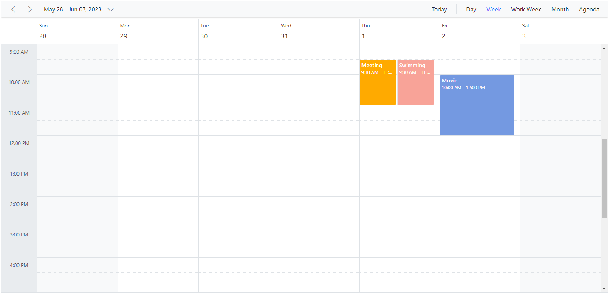

N> Setting [`AllowMultiple`](https://help.syncfusion.com/cr/blazor/Syncfusion.Blazor.Schedule.Resource.html#Syncfusion_Blazor_Schedule_Resource_AllowMultiple) to `true` in the above code example allows to select multiple resources from the event editor and also creates multiple copies of the same appointment in the Scheduler for each resources while rendering.

## Resource grouping

Resource grouping support allows the Scheduler to group the resources in a hierarchical structure both as an expandable groups (Timeline views) and as vertical hierarchy displaying resources one after the other (Resources view).

To get start quickly about grouping multiple resource on scheduler, you can check on this video:



Scheduler supports both single and multiple levels of resource grouping that can be customized both in timeline and vertical Scheduler views.

### Vertical resource view

The following code example displays how the multiple resources are grouped and its events are portrayed in the default calendar views.

```cshtml
@using Syncfusion.Blazor.Schedule

<SfSchedule TValue="AppointmentData" Height="550px" @bind-SelectedDate="@CurrentDate">
    <ScheduleGroup Resources="@Resources"></ScheduleGroup>
    <ScheduleResources>
        <ScheduleResource TItem="ResourceData" TValue="int" DataSource="@RoomData" Field="RoomId" Title="Room" Name="Rooms" TextField="RoomText" IdField="Id" ColorField="RoomColor" AllowMultiple="false"></ScheduleResource>
        <ScheduleResource TItem="ResourceData" TValue="int[]" DataSource="@OwnersData" Field="OwnerId" Title="Owner" Name="Owners" TextField="OwnerText" IdField="Id" GroupIDField="OwnerGroupId" ColorField="OwnerColor" AllowMultiple="true"></ScheduleResource>
    </ScheduleResources>
    <ScheduleEventSettings DataSource="@DataSource"></ScheduleEventSettings>
    <ScheduleViews>
        <ScheduleView Option="View.Day"></ScheduleView>
        <ScheduleView Option="View.Week"></ScheduleView>
        <ScheduleView Option="View.WorkWeek"></ScheduleView>
        <ScheduleView Option="View.Month"></ScheduleView>
        <ScheduleView Option="View.Agenda"></ScheduleView>
    </ScheduleViews>
</SfSchedule>
@code{
    DateTime CurrentDate = new DateTime(2023, 6, 1);
    public string[] Resources { get; set; } = { "Rooms", "Owners" };
    public List<ResourceData> RoomData { get; set; } = new List<ResourceData>
    {
        new ResourceData{ RoomText = "ROOM 1", Id = 1, RoomColor = "#cb6bb2" },
        new ResourceData{ RoomText = "ROOM 2", Id = 2, RoomColor = "#56ca85" }
    };
    public List<ResourceData> OwnersData { get; set; } = new List<ResourceData>
    {
        new ResourceData{ OwnerText = "Nancy", Id = 1, OwnerGroupId = 1, OwnerColor = "#ffaa00" },
        new ResourceData{ OwnerText = "Steven", Id = 2, OwnerGroupId = 2, OwnerColor = "#f8a398" },
        new ResourceData{ OwnerText = "Michael", Id = 3, OwnerGroupId = 1, OwnerColor = "#7499e1" }
    };
    List<AppointmentData> DataSource = new List<AppointmentData>
     {
        new AppointmentData { Id = 1, Subject = "Meeting", StartTime = new DateTime(2023, 6, 1, 9, 30, 0) , EndTime = new DateTime(2023, 6, 1, 11, 0, 0), OwnerId = 1, RoomId = 1 }
    };
    public class AppointmentData
    {
        public int Id { get; set; }
        public string Subject { get; set; }
        public string Location { get; set; }
        public DateTime StartTime { get; set; }
        public DateTime EndTime { get; set; }
        public string Description { get; set; }
        public bool IsAllDay { get; set; }
        public string RecurrenceRule { get; set; }
        public string RecurrenceException { get; set; }
        public Nullable<int> RecurrenceID { get; set; }
        public int OwnerId { get; set; }
        public int RoomId { get; set; }
    }
    public class ResourceData
    {
        public int Id { get; set; }
        public string RoomText { get; set; }
        public string RoomColor { get; set; }
        public string OwnerText { get; set; }
        public string OwnerColor { get; set; }
        public int OwnerGroupId { get; set; }
    }
}
```

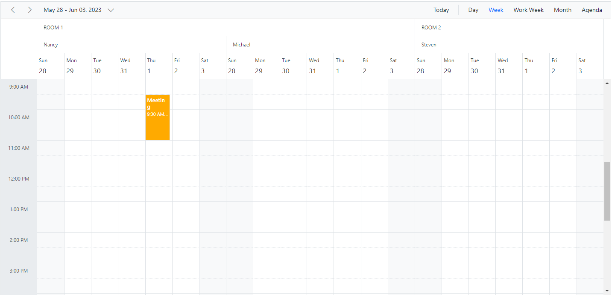

### Timeline resource view

The following code example depicts how to group the multiple resources on Timeline Scheduler views and its relevant events are displayed accordingly under those resources.

```cshtml
@using Syncfusion.Blazor.Schedule

<SfSchedule TValue="AppointmentData" Height="550px" @bind-SelectedDate="@CurrentDate">
    <ScheduleGroup Resources="@Resources"></ScheduleGroup>
    <ScheduleResources>
        <ScheduleResource TItem="ResourceData" TValue="int" DataSource="@RoomData" Field="RoomId" Title="Room" Name="Rooms" TextField="RoomText" IdField="Id" ColorField="RoomColor" AllowMultiple="false"></ScheduleResource>
        <ScheduleResource TItem="ResourceData" TValue="int[]" DataSource="@OwnersData" Field="OwnerId" Title="Owner" Name="Owners" TextField="OwnerText" IdField="Id" GroupIDField="OwnerGroupId" ColorField="OwnerColor" AllowMultiple="true"></ScheduleResource>
    </ScheduleResources>
    <ScheduleEventSettings DataSource="@DataSource"></ScheduleEventSettings>
    <ScheduleViews>
        <ScheduleView Option="View.TimelineWeek" MaxEventsPerRow="2"></ScheduleView>
        <ScheduleView Option="View.TimelineMonth" MaxEventsPerRow="2"></ScheduleView>
        <ScheduleView Option="View.Agenda"></ScheduleView>
    </ScheduleViews>
</SfSchedule>
@code{
    DateTime CurrentDate = new DateTime(2023, 6, 1);
    public string[] Resources { get; set; } = { "Rooms", "Owners" };
    public List<ResourceData> RoomData { get; set; } = new List<ResourceData>
    {
        new ResourceData{ RoomText = "ROOM 1", Id = 1, RoomColor = "#cb6bb2" },
        new ResourceData{ RoomText = "ROOM 2", Id = 2, RoomColor = "#56ca85" }
    };
    public List<ResourceData> OwnersData { get; set; } = new List<ResourceData>
    {
        new ResourceData{ OwnerText = "Nancy", Id = 1, OwnerGroupId = 1, OwnerColor = "#ffaa00" },
        new ResourceData{ OwnerText = "Steven", Id = 2, OwnerGroupId = 2, OwnerColor = "#f8a398" },
        new ResourceData{ OwnerText = "Michael", Id = 3, OwnerGroupId = 1, OwnerColor = "#7499e1" }
    };
    List<AppointmentData> DataSource = new List<AppointmentData>
     {
        new AppointmentData { Id = 1, Subject = "Meeting", StartTime = new DateTime(2023, 6, 1, 9, 30, 0) , EndTime = new DateTime(2023, 6, 1, 11, 0, 0), OwnerId = 1, RoomId = 1 }
    };
    public class AppointmentData
    {
        public int Id { get; set; }
        public string Subject { get; set; }
        public string Location { get; set; }
        public DateTime StartTime { get; set; }
        public DateTime EndTime { get; set; }
        public string Description { get; set; }
        public bool IsAllDay { get; set; }
        public string RecurrenceRule { get; set; }
        public string RecurrenceException { get; set; }
        public Nullable<int> RecurrenceID { get; set; }
        public int OwnerId { get; set; }
        public int RoomId { get; set; }
    }
    public class ResourceData
    {
        public int Id { get; set; }
        public string RoomText { get; set; }
        public string RoomColor { get; set; }
        public string OwnerText { get; set; }
        public string OwnerColor { get; set; }
        public int OwnerGroupId { get; set; }
    }
}
```
The following image shows the multiple resources rendering on the Timeline view Scheduler.


### Grouping single-level resources

This kind of grouping allows the Scheduler to display all the resources at a single level simultaneously. The appointments mapped under resources will be displayed with the colors as per the [`ColorField`](https://help.syncfusion.com/cr/blazor/Syncfusion.Blazor.Schedule.Resource.html#Syncfusion_Blazor_Schedule_Resource_ColorField) defined on the resources collection.

**Example:** To display the Scheduler with single level resource grouping,

```cshtml
@using Syncfusion.Blazor.Schedule

<SfSchedule TValue="AppointmentData" Height="550px" @bind-SelectedDate="@CurrentDate">
    <ScheduleGroup Resources="@Resources"></ScheduleGroup>
    <ScheduleResources>
        <ScheduleResource TItem="ResourceData" TValue="int[]" DataSource="@OwnersData" Field="OwnerId" Title="Owner" Name="Owners" TextField="OwnerText" IdField="Id" ColorField="OwnerColor" AllowMultiple="true"></ScheduleResource>
    </ScheduleResources>
    <ScheduleEventSettings DataSource="@DataSource"></ScheduleEventSettings>
    <ScheduleViews>
        <ScheduleView Option="View.Day"></ScheduleView>
        <ScheduleView Option="View.Week"></ScheduleView>
        <ScheduleView Option="View.WorkWeek"></ScheduleView>
        <ScheduleView Option="View.Month"></ScheduleView>
        <ScheduleView Option="View.Agenda"></ScheduleView>
    </ScheduleViews>
</SfSchedule>
@code{
    DateTime CurrentDate = new DateTime(2023, 6, 1);
    public string[] Resources { get; set; } = { "Owners" };
    List<AppointmentData> DataSource = new List<AppointmentData>
     {
        new AppointmentData { Id = 1, Subject = "Meeting", StartTime = new DateTime(2023, 6, 1, 9, 30, 0) , EndTime = new DateTime(2023, 6, 1, 11, 0, 0), OwnerId = 1 },
        new AppointmentData { Id = 2, Subject = "Swimming", StartTime = new DateTime(2023, 6, 2, 10, 30, 0) , EndTime = new DateTime(2023, 6, 2, 12, 30, 0), OwnerId = 2 },
        new AppointmentData { Id = 3, Subject = "Movie", StartTime = new DateTime(2023, 6, 3, 10, 0, 0) , EndTime = new DateTime(2023,6 , 3, 12, 0, 0), OwnerId = 3 }
    };
    public List<ResourceData> OwnersData { get; set; } = new List<ResourceData>
    {
        new ResourceData{ OwnerText = "Nancy", Id = 1, OwnerColor = "#ffaa00" },
        new ResourceData{ OwnerText = "Steven", Id = 2, OwnerColor = "#f8a398" },
        new ResourceData{ OwnerText = "Michael", Id = 3, OwnerColor = "#7499e1" }
    };
    public class AppointmentData
    {
        public int Id { get; set; }
        public string Subject { get; set; }
        public string Location { get; set; }
        public DateTime StartTime { get; set; }
        public DateTime EndTime { get; set; }
        public string Description { get; set; }
        public bool IsAllDay { get; set; }
        public string RecurrenceRule { get; set; }
        public string RecurrenceException { get; set; }
        public Nullable<int> RecurrenceID { get; set; }
        public int OwnerId { get; set; }
    }
    public class ResourceData
    {
        public int Id { get; set; }
        public string OwnerText { get; set; }
        public string OwnerColor { get; set; }
    }
}
```
The following image display the Scheduler with single level resource grouping.


N> The `Name` field defined in the **Resources** collection namely `Owners` will be mapped within the [`Group`](https://help.syncfusion.com/cr/blazor/Syncfusion.Blazor.Schedule.ScheduleGroup.html) property, in order to enable the grouping option with those resource levels on the Scheduler.

### Grouping multi-level resources

It is possible to group the resources of Scheduler in multiple levels, by mapping the child resources to each parent resource. In the following example, there are 2 levels of resources, on which the second level resources are defined with [`GroupIDField`](https://help.syncfusion.com/cr/blazor/Syncfusion.Blazor.Schedule.Resource.html#Syncfusion_Blazor_Schedule_Resource_GroupIDField) mapping to the first level resource's ID so as to establish the parent-child relationship between them.

```cshtml
@using Syncfusion.Blazor.Schedule

<SfSchedule TValue="AppointmentData" Height="550px" @bind-SelectedDate="@CurrentDate">
    <ScheduleGroup Resources="@Resources"></ScheduleGroup>
    <ScheduleResources>
        <ScheduleResource TItem="ResourceData" TValue="int" DataSource="@HotelData" Field="HotelId" Title="Hotel" Name="Hotels" TextField="HotelText" IdField="Id" ColorField="HotelColor" AllowMultiple="false"></ScheduleResource>
        <ScheduleResource TItem="ResourceData" TValue="int" DataSource="@RoomData" Field="RoomId" Title="Room" Name="Rooms" TextField="RoomText" IdField="Id" ColorField="RoomColor"
                          GroupIDField="RoomGroupId" AllowMultiple="false"></ScheduleResource>
        <ScheduleResource TItem="ResourceData" TValue="int[]" DataSource="@OwnersData" Field="OwnerId" Title="Owner" Name="Owners" TextField="OwnerText" IdField="Id" GroupIDField="OwnerGroupId" ColorField="OwnerColor" AllowMultiple="true"></ScheduleResource>
    </ScheduleResources>
    <ScheduleEventSettings DataSource="@DataSource"></ScheduleEventSettings>
    <ScheduleViews>
        <ScheduleView Option="View.Day"></ScheduleView>
        <ScheduleView Option="View.Week"></ScheduleView>
        <ScheduleView Option="View.WorkWeek"></ScheduleView>
        <ScheduleView Option="View.Month"></ScheduleView>
        <ScheduleView Option="View.Agenda"></ScheduleView>
    </ScheduleViews>
</SfSchedule>
@code{
    DateTime CurrentDate = new DateTime(2023, 6, 1);
    public string[] Resources { get; set; } = { "Hotels", "Rooms", "Owners" };
    public List<ResourceData> HotelData { get; set; } = new List<ResourceData>
    {
        new ResourceData{ HotelText = "Hotel 1", Id = 1, HotelColor = "#f8a398" },
        new ResourceData{ HotelText = "Hotel 2", Id = 2, HotelColor = "#ffaa00" }
    };
    public List<ResourceData> RoomData { get; set; } = new List<ResourceData>
    {
        new ResourceData{ RoomText = "ROOM 1", Id = 1, RoomGroupId = 1, RoomColor = "#cb6bb2" },
        new ResourceData{ RoomText = "ROOM 2", Id = 2, RoomGroupId = 2, RoomColor = "#56ca85" }
    };
    public List<ResourceData> OwnersData { get; set; } = new List<ResourceData>
    {
        new ResourceData{ OwnerText = "Nancy", Id = 1, OwnerGroupId = 1, OwnerColor = "#ffaa00" },
        new ResourceData{ OwnerText = "Steven", Id = 2, OwnerGroupId = 2, OwnerColor = "#f8a398" },
        new ResourceData{ OwnerText = "Michael", Id = 3, OwnerGroupId = 1, OwnerColor = "#7499e1" }
    };
    List<AppointmentData> DataSource = new List<AppointmentData>
    {
        new AppointmentData { Id = 1, Subject = "Meeting", StartTime = new DateTime(2023, 6, 2, 9, 30, 0) , EndTime = new DateTime(2023, 6, 2, 11, 0, 0),
         OwnerId = 1, RoomId = 1, HotelId = 1 }
    };
    public class AppointmentData
    {
        public int Id { get; set; }
        public string Subject { get; set; }
        public string Location { get; set; }
        public DateTime StartTime { get; set; }
        public DateTime EndTime { get; set; }
        public string Description { get; set; }
        public bool IsAllDay { get; set; }
        public string RecurrenceRule { get; set; }
        public string RecurrenceException { get; set; }
        public Nullable<int> RecurrenceID { get; set; }
        public int OwnerId { get; set; }
        public int RoomId { get; set; }
        public int HotelId { get; set; }
    }
    public class ResourceData
    {
        public int Id { get; set; }
        public string HotelText { get; set; }
        public string HotelColor { get; set; }
        public string RoomText { get; set; }
        public string RoomColor { get; set; }
        public string OwnerText { get; set; }
        public string OwnerColor { get; set; }
        public int RoomGroupId { get; set; }
        public int OwnerGroupId { get; set; }
    }
}
```
The following image displays the resources of Scheduler in multi levels.


### One-to-One grouping

In multi-level grouping, Scheduler usually groups the resources on the child level based on the [`GroupIDField`](https://help.syncfusion.com/cr/blazor/Syncfusion.Blazor.Schedule.Resource.html#Syncfusion_Blazor_Schedule_Resource_GroupIDField) that maps with the [`IdField`](https://help.syncfusion.com/cr/blazor/Syncfusion.Blazor.Schedule.Resource.html#Syncfusion_Blazor_Schedule_Resource_IdField) field of parent level resources (as [`ByGroupID`](https://help.syncfusion.com/cr/blazor/Syncfusion.Blazor.Schedule.ScheduleGroup.html#Syncfusion_Blazor_Schedule_ScheduleGroup_ByGroupID) set to true by default). There are also option which allows to group all the child resource(s) against each of its parent resource(s). To enable this kind of grouping, set `false` to the [`ByGroupID`](https://help.syncfusion.com/cr/blazor/Syncfusion.Blazor.Schedule.ScheduleGroup.html#Syncfusion_Blazor_Schedule_ScheduleGroup_ByGroupID) option within the [`Group`](https://help.syncfusion.com/cr/blazor/Syncfusion.Blazor.Schedule.ScheduleGroup.html) property. In the following code example, there are two levels of resources, on which all the resources at the child level is mapped one to one with each resource on the first level.

```cshtml
@using Syncfusion.Blazor.Schedule

<SfSchedule TValue="AppointmentData" Height="550px" @bind-SelectedDate="@CurrentDate">
    <ScheduleGroup ByGroupID="false" Resources="@Resources"></ScheduleGroup>
    <ScheduleResources>
        <ScheduleResource TItem="ResourceData" TValue="int" DataSource="@RoomData" Field="RoomId" Title="Room" Name="Rooms" TextField="RoomText" IdField="Id"
                          ColorField="RoomColor" AllowMultiple="false"></ScheduleResource>
        <ScheduleResource TItem="ResourceData" TValue="int[]" DataSource="@OwnersData" Field="OwnerId" Title="Owner" Name="Owners" TextField="OwnerText" IdField="Id" ColorField="OwnerColor" AllowMultiple="true"></ScheduleResource>
    </ScheduleResources>
    <ScheduleEventSettings DataSource="@DataSource"></ScheduleEventSettings>
    <ScheduleViews>
        <ScheduleView Option="View.Day"></ScheduleView>
        <ScheduleView Option="View.Week"></ScheduleView>
        <ScheduleView Option="View.WorkWeek"></ScheduleView>
        <ScheduleView Option="View.Month"></ScheduleView>
        <ScheduleView Option="View.Agenda"></ScheduleView>
    </ScheduleViews>
</SfSchedule>
@code{
    DateTime CurrentDate = new DateTime(2023, 6, 1);
    public string[] Resources { get; set; } = { "Rooms", "Owners" };
    public List<ResourceData> RoomData { get; set; } = new List<ResourceData>
    {
        new ResourceData{ RoomText = "ROOM 1", Id = 1, RoomColor = "#cb6bb2" },
        new ResourceData{ RoomText = "ROOM 2", Id = 2, RoomColor = "#56ca85" }
    };
    public List<ResourceData> OwnersData { get; set; } = new List<ResourceData>
    {
        new ResourceData{ OwnerText = "Nancy", Id = 1, OwnerColor = "#ffaa00" },
        new ResourceData{ OwnerText = "Steven", Id = 2, OwnerColor = "#f8a398" }
    };
    List<AppointmentData> DataSource = new List<AppointmentData>
    {
        new AppointmentData { Id = 1, Subject = "Meeting", StartTime = new DateTime(2023, 6, 2, 9, 30, 0) , EndTime = new DateTime(2023, 6, 2, 11, 0, 0), OwnerId = 1, RoomId = 1 }
    };
    public class AppointmentData
    {
        public int Id { get; set; }
        public string Subject { get; set; }
        public string Location { get; set; }
        public DateTime StartTime { get; set; }
        public DateTime EndTime { get; set; }
        public string Description { get; set; }
        public bool IsAllDay { get; set; }
        public string RecurrenceRule { get; set; }
        public string RecurrenceException { get; set; }
        public Nullable<int> RecurrenceID { get; set; }
        public int OwnerId { get; set; }
        public int RoomId { get; set; }
    }
    public class ResourceData
    {
        public int Id { get; set; }
        public string RoomText { get; set; }
        public string RoomColor { get; set; }
        public string OwnerText { get; set; }
        public string OwnerColor { get; set; }
    }
}
```

The following image depicts how the scheduler will render when [`ByGroupID`](https://help.syncfusion.com/cr/blazor/Syncfusion.Blazor.Schedule.ScheduleGroup.html#Syncfusion_Blazor_Schedule_ScheduleGroup_ByGroupID) sets as false.

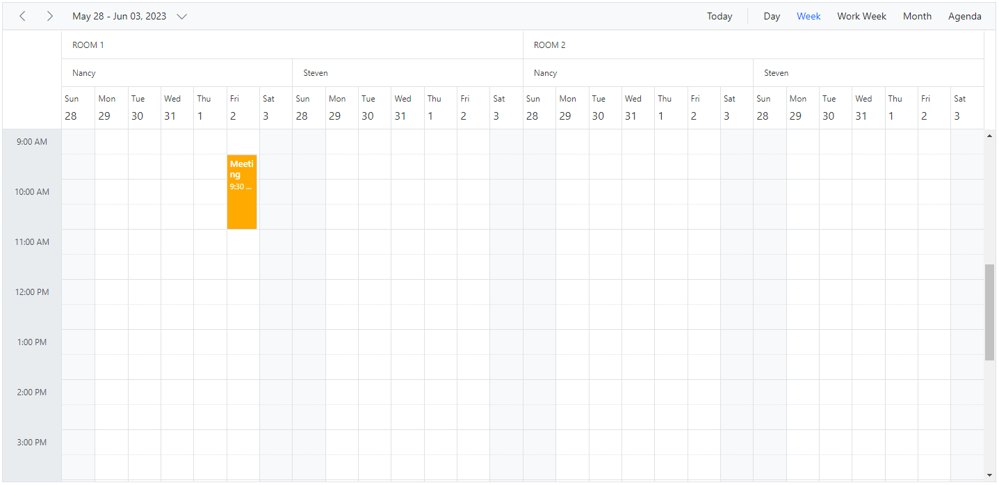

### Grouping resources by date

It groups the number of resources under each date and is applicable only on the calendar views such as Day, Week, Work Week, Month, Agenda and Month-Agenda. To enable such grouping, set [`ByDate`](https://help.syncfusion.com/cr/blazor/Syncfusion.Blazor.Schedule.ScheduleGroup.html#Syncfusion_Blazor_Schedule_ScheduleGroup_ByDate) option to `true` within the [`Group`](https://help.syncfusion.com/cr/blazor/Syncfusion.Blazor.Schedule.ScheduleGroup.html) property.

**Example:** To display the Scheduler with resources grouped by date,

```cshtml
@using Syncfusion.Blazor.Schedule

<SfSchedule TValue="AppointmentData" Height="550px" @bind-SelectedDate="@CurrentDate">
    <ScheduleGroup ByDate="true" Resources="@Resources"></ScheduleGroup>
    <ScheduleResources>
        <ScheduleResource TItem="ResourceData" TValue="int[]" DataSource="@OwnersData" Field="OwnerId" Title="Owner" Name="Owners" TextField="OwnerText" IdField="Id"
                          GroupIDField="OwnerGroupId" ColorField="OwnerColor" AllowMultiple="true"></ScheduleResource>
    </ScheduleResources>
    <ScheduleEventSettings DataSource="@DataSource"></ScheduleEventSettings>
    <ScheduleViews>
        <ScheduleView Option="View.Day"></ScheduleView>
        <ScheduleView Option="View.Week"></ScheduleView>
        <ScheduleView Option="View.WorkWeek"></ScheduleView>
        <ScheduleView Option="View.Month"></ScheduleView>
        <ScheduleView Option="View.Agenda"></ScheduleView>
    </ScheduleViews>
</SfSchedule>
@code{
    private DateTime CurrentDate = new DateTime(2023, 6, 1);
    public string[] Resources { get; set; } = { "Owners" };
    public List<ResourceData> OwnersData { get; set; } = new List<ResourceData>
{
        new ResourceData{ OwnerText = "Nancy", Id = 1, OwnerColor = "#ffaa00" },
        new ResourceData{ OwnerText = "Steven", Id = 2, OwnerColor = "#f8a398" },
        new ResourceData{ OwnerText = "Michael", Id = 3, OwnerColor = "#7499e1" }
    };
    List<AppointmentData> DataSource = new List<AppointmentData>
    {
        new AppointmentData { Id = 1, Subject = "Meeting", StartTime = new DateTime(2023, 6, 2, 9, 30, 0) , EndTime = new DateTime(2023, 6, 2, 11, 0, 0), OwnerId = 1 }
    };
    public class AppointmentData
    {
        public int Id { get; set; }
        public string Subject { get; set; }
        public string Location { get; set; }
        public DateTime StartTime { get; set; }
        public DateTime EndTime { get; set; }
        public string Description { get; set; }
        public bool IsAllDay { get; set; }
        public string RecurrenceRule { get; set; }
        public string RecurrenceException { get; set; }
        public Nullable<int> RecurrenceID { get; set; }
        public int OwnerId { get; set; }
    }
    public class ResourceData
    {
        public int Id { get; set; }
        public string OwnerText { get; set; }
        public string OwnerColor { get; set; }
    }
}
```


N> This kind of grouping by date is not applicable on any of the **timeline views**.

## Working with shared events

Multiple resources can share the same events, thus allowing the CRUD action made on it to reflect on all other shared instances simultaneously. To enable such option, set [`AllowGroupEdit`](https://help.syncfusion.com/cr/blazor/Syncfusion.Blazor.Schedule.ScheduleGroup.html#Syncfusion_Blazor_Schedule_ScheduleGroup_AllowGroupEdit) option to `true` within the [`Group`](https://help.syncfusion.com/cr/blazor/Syncfusion.Blazor.Schedule.ScheduleGroup.html) property. With this property enabled, a single appointment will be maintained within the appointment collection, even if it is shared by more than one resource  whereas the resource fields of such appointment will be in array which hold the IDs of the multiple resources.

N> Any actions such as create, edit or delete held on any one of the shared event instances, will be reflected on all other related instances visible on the UI.

**Example:** To edit all the resource events simultaneously,

```cshtml
@using Syncfusion.Blazor.Schedule

<SfSchedule TValue="AppointmentData" Height="550px" @bind-SelectedDate="@CurrentDate">
    <ScheduleGroup AllowGroupEdit="true" Resources="@Resources"></ScheduleGroup>
    <ScheduleResources>
        <ScheduleResource TItem="ResourceData" TValue="int[]" DataSource="@ConferenceData" Field="ConferenceId" Title="Attendees" Name="Conferences" TextField="Text" IdField="Id" ColorField="Color" AllowMultiple="true"></ScheduleResource>
    </ScheduleResources>
    <ScheduleEventSettings DataSource="@DataSource"></ScheduleEventSettings>
    <ScheduleViews>
        <ScheduleView Option="View.Day"></ScheduleView>
        <ScheduleView Option="View.Week"></ScheduleView>
        <ScheduleView Option="View.WorkWeek"></ScheduleView>
        <ScheduleView Option="View.Month"></ScheduleView>
        <ScheduleView Option="View.Agenda"></ScheduleView>
    </ScheduleViews>
</SfSchedule>

@code{
    DateTime CurrentDate = new DateTime(2023, 6, 1);
    public string[] Resources { get; set; } = { "Conferences" };
    List<AppointmentData> DataSource = new List<AppointmentData>
    {
        new AppointmentData { Id = 1, Subject = "Meeting", StartTime = new DateTime(2023, 6, 2, 9, 30, 0) , EndTime = new DateTime(2023, 6, 2, 11, 0, 0),
        ConferenceId = new int[] { 1, 2, 3 } }
    };
    public List<ResourceData> ConferenceData { get; set; } = new List<ResourceData>
    {
        new ResourceData{ Text = "Margaret", Id = 1, Color = "#1aaa55"},
        new ResourceData{ Text = "Robert", Id = 2, Color = "#357cd2"},
        new ResourceData{ Text = "Laura", Id = 3, Color = "#7fa900"}
    };
    public class AppointmentData
    {
        public int Id { get; set; }
        public string Subject { get; set; }
        public string Location { get; set; }
        public DateTime StartTime { get; set; }
        public DateTime EndTime { get; set; }
        public string Description { get; set; }
        public bool IsAllDay { get; set; }
        public string RecurrenceRule { get; set; }
        public string RecurrenceException { get; set; }
        public Nullable<int> RecurrenceID { get; set; }
        public int[] ConferenceId { get; set; }
    }
    public class ResourceData
    {
        public int Id { get; set; }
        public string Text { get; set; }
        public string Color { get; set; }
    }
}
```

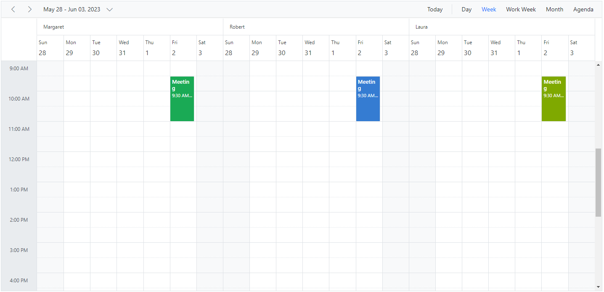

## Simple resource header customization

It is possible to customize the resource header cells using built-in template option and change the look and appearance of it in both the vertical and timeline view modes. All the resource related fields and other information can be accessed within the resource header template option.

**Example:** To customize the resource header and display it along with designation and image, refer the following code example.

```cshtml
@using Syncfusion.Blazor.Schedule

<SfSchedule TValue="AppointmentData" Width="100%" Height="650px" @bind-SelectedDate="@CurrentDate">
    <ScheduleTemplates>
        <ResourceHeaderTemplate>
            @{
                var resourceData = (context as TemplateContext).ResourceData as ResourceData;
                <div class='template-wrap'>
                    <div class="resource-image"></div>
                    <div class="resource-details">
                        <div class="resource-name">@(resourceData.Text)</div>
                        <div class="resource-designation">@(resourceData.Designation)</div>
                    </div>
                </div>
            }
        </ResourceHeaderTemplate>
    </ScheduleTemplates>
    <ScheduleGroup Resources="@Resources"></ScheduleGroup>
    <ScheduleResources>
        <ScheduleResource TItem="ResourceData" TValue="int" DataSource="@DoctorsData" Field="DoctorId" Title="Doctor Name" Name="Doctors" TextField="Text" IdField="Id" ColorField="Color"></ScheduleResource>
    </ScheduleResources>
    <ScheduleViews>
        <ScheduleView Option="View.Day"></ScheduleView>
        <ScheduleView Option="View.Week"></ScheduleView>
        <ScheduleView Option="View.WorkWeek"></ScheduleView>
        <ScheduleView Option="View.Month"></ScheduleView>
        <ScheduleView Option="View.Agenda"></ScheduleView>
    </ScheduleViews>
</SfSchedule>
@code{
    DateTime CurrentDate = new DateTime(2023, 6, 1);
    public string[] Resources { get; set; } = { "Doctors" };
    public List<ResourceData> DoctorsData { get; set; } = new List<ResourceData>
    {
        new ResourceData{ Text = "Will Smith", Id = 1, Color = "#ea7a57", Designation = "Cardiologist", Image = "will-smith" },
        new ResourceData{ Text = "Alice", Id = 2, Color = "rgb(53, 124, 210)", Designation = "Neurologist", Image = "alice"  },
        new ResourceData{ Text = "Robson", Id = 3, Color = "#7fa900", Designation = "Orthopedic Surgeon", Image = "robson"  }
    };
    public class AppointmentData
    {
        public int Id { get; set; }
        public string Subject { get; set; }
        public string Location { get; set; }
        public DateTime StartTime { get; set; }
        public DateTime EndTime { get; set; }
        public string Description { get; set; }
        public bool IsAllDay { get; set; }
        public string RecurrenceRule { get; set; }
        public string RecurrenceException { get; set; }
        public Nullable<int> RecurrenceID { get; set; }
        public int DoctorId { get; set; }
    }
    public class ResourceData
    {
        public int Id { get; set; }
        public string Text { get; set; }
        public string Designation { get; set; }
        public string Color { get; set; }
        public string Image { get; set; }
    }
}
<style>
    .e-schedule .e-vertical-view .e-resource-cells {
        height: 62px;
    }

    .e-schedule .template-wrap {
        display: flex;
        text-align: left;
    }

    .e-schedule .template-wrap .resource-image img {
        width: 45px;
        height: 45px;
    }

    .e-schedule .template-wrap .resource-details {
        padding-left: 10px;
    }

    .e-schedule .template-wrap .resource-details .resource-name {
        font-size: 16px;
        font-weight: 500;
        margin-top: 5px;
    }

    .e-schedule.e-device .template-wrap .resource-details .resource-name {
        font-size: inherit;
        font-weight: inherit;
    }

    .e-schedule.e-device .e-resource-tree-popup .e-fullrow {
        height: 50px;
    }

    .e-schedule.e-device .template-wrap .resource-details .resource-designation {
        display: none;
    }
</style>
```

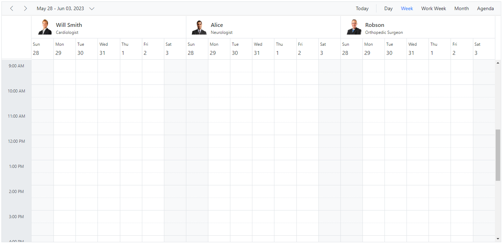

N> To customize the resource header in compact mode properly make use of the class `e-device` as in the code example.


## Customizing resource header with multiple columns

It is possible to customize the resource headers to display with multiple columns such as Room, Type and Capacity. The following code example depicts the way to achieve it and is applicable only on timeline views.

```cshtml
@using Syncfusion.Blazor.Schedule

<SfSchedule TValue="AppointmentData" Width="100%" Height="650px" @bind-SelectedDate="@CurrentDate" @bind-CurrentView="@CurrentView">
    <ScheduleWorkHours Start="08:00" End="18:00"></ScheduleWorkHours>
    <ScheduleTimeScale SlotCount="1" Interval="60"></ScheduleTimeScale>
    <ScheduleGroup Resources="@GroupData"></ScheduleGroup>
    <ScheduleResources>
        <ScheduleResource TItem="ResourceData" TValue="int[]" DataSource="@OwnersData" Field="OwnerId" Title="OwnerType" Name="Owner" TextField="Text" IdField="Id" GroupIDField="OwnerGroupId" ColorField="Ownercolor" AllowMultiple="true"></ScheduleResource>
    </ScheduleResources>
    <ScheduleTemplates>
        <ResourceHeaderTemplate>
            @{
                var resourceData = (context as TemplateContext).ResourceData as ResourceData;
                <div class='template-wrap'>
                    <div class="room-name">@(resourceData.Text)</div>
                    <div class="room-capacity">@(resourceData.Capacity)</div>
                    <div class="room-type">@(resourceData.Type)</div>
                    <div class="room-avail">@(resourceData.Availability)</div>
                </div>
            }
        </ResourceHeaderTemplate>
    </ScheduleTemplates>
    <ScheduleEventSettings DataSource="@DataSource"></ScheduleEventSettings>
    <ScheduleViews>
        <ScheduleView Option="View.TimelineWeek" MaxEventsPerRow="2"></ScheduleView>
        <ScheduleView Option="View.TimelineMonth" MaxEventsPerRow="2"></ScheduleView>
    </ScheduleViews>
</SfSchedule>

@code{
    DateTime CurrentDate = new DateTime(2023, 6, 1);
    private View CurrentView = View.TimelineWeek;
    public string[] GroupData { get; set; } = { "Owner" };

    public List<ResourceData> OwnersData { get; set; } = new List<ResourceData> {
        new ResourceData{ Text = "Jammy", Id = 1, OwnerGroupId = 1, Ownercolor = "#ea7a57", Capacity = 20, Type = "Conference" , Availability = 10 },
        new ResourceData{ Text = "Tweety", Id = 2, OwnerGroupId = 2, Ownercolor = "#7fa900", Capacity = 7, Type = "Cabin", Availability = 5 },
        new ResourceData{ Text = "Nestle", Id = 3, OwnerGroupId = 1, Ownercolor = "#865fcf", Capacity = 5, Type = "Cabin", Availability = 2 },
        new ResourceData{ Text = "Phoenix", Id = 4, OwnerGroupId = 2, Ownercolor = "#fec200", Capacity = 15, Type = "Conference", Availability = 12 },
        new ResourceData{ Text = "Rick Roll", Id = 5, OwnerGroupId = 1, Ownercolor = "#865fcf", Capacity = 20, Type = "Conference", Availability = 7 },
        new ResourceData{ Text = "Rainbow", Id = 6, OwnerGroupId = 2, Ownercolor = "#1aaa55", Capacity = 8, Type = "Cabin", Availability = 3 }

    };
    public class ResourceData
    {
        public int Id { get; set; }
        public string Text { get; set; }
        public int OwnerGroupId { get; set; }
        public string RoomColor { get; set; }
        public string Ownercolor { get; set; }
        public int Capacity { get; set; }
        public string Type { get; set; }
        public int Availability { get; set; }
    }
    List<AppointmentData> DataSource = new List<AppointmentData>
{
        new AppointmentData { Id = 1, Subject = "Meeting", StartTime = new DateTime(2023, 6, 16, 9, 30, 0) , EndTime = new DateTime(2023, 6, 16, 11, 0, 0),
        OwnerId = 1 }

    };
    public class AppointmentData
    {
        public int Id { get; set; }
        public string Subject { get; set; }
        public string Location { get; set; }
        public DateTime StartTime { get; set; }
        public DateTime EndTime { get; set; }
        public string Description { get; set; }
        public bool IsAllDay { get; set; }
        public string RecurrenceRule { get; set; }
        public string RecurrenceException { get; set; }
        public Nullable<int> RecurrenceID { get; set; }
        public int OwnerId { get; set; }
    }
}
<style>
    .e-schedule .e-timeline-month-view .e-resource-left-td,
    .e-schedule .e-timeline-view .e-resource-left-td {
        vertical-align: bottom;
        width: 350px;
    }

    .e-schedule.e-device .e-timeline-month-view .e-resource-left-td,
    .e-schedule.e-device .e-timeline-view .e-resource-left-td {
        width: 75px;
    }

    .e-schedule .e-timeline-month-view .e-resource-left-td .e-resource-text,
    .e-schedule .e-timeline-view .e-resource-left-td .e-resource-text {
        display: flex;
        font-weight: 500;
        padding: 0;
    }

        .e-schedule .e-timeline-month-view .e-resource-left-td .e-resource-text > div,
        .e-schedule .e-timeline-view .e-resource-left-td .e-resource-text > div {
            border-right: 1px solid rgba(0, 0, 0, 0.12);
            border-top: 1px solid rgba(0, 0, 0, 0.12);
            flex: 0 0 20%;
            font-weight: 500;
            height: 36px;
            line-height: 34px;
            padding-left: 5px;
        }

            .e-schedule .e-timeline-month-view .e-resource-left-td .e-resource-text > div:first-child,
            .e-schedule .e-timeline-view .e-resource-left-td .e-resource-text > div:first-child {
                flex: 0 0 40%;
            }

            .e-schedule .e-timeline-month-view .e-resource-left-td .e-resource-text > div:last-child,
            .e-schedule .e-timeline-view .e-resource-left-td .e-resource-text > div:last-child {
                border-right: 0;
            }

    .e-schedule .e-schedule-table > tbody > tr > td {
        width: 100%;
    }

    .e-schedule .e-timeline-view .e-resource-collapse,
    .e-schedule .e-timeline-month-view .e-resource-collapse {
        margin-top: 23px;
    }

    .e-schedule .e-parent-node .room-type {
        flex: 0 0 20.8% !important;
    }

    .e-schedule .e-parent-node .room-capacity {
        flex: 0 0 20.8% !important;
    }

    .e-schedule .e-parent-node .room-name {
        flex: 0 0 37.8% !important;
    }

    .e-schedule .e-parent-node .room-avail {
        flex: 0 0 20.8% !important;
    }

    .e-schedule .e-timeline-view .e-resource-tree-icon,
    .e-schedule .e-timeline-month-view .e-resource-tree-icon {
        margin-top: 22px !important;
    }

    .e-schedule .template-wrap {
        display: flex;
        height: 100%;
        text-align: left;
    }

    .e-schedule .e-resource-cells .e-blazor-template {
        height: 100%;
    }

    .e-schedule .template-wrap > div {
        border-right: 1px solid rgba(0, 0, 0, 0.12);
        flex: 0 0 20%;
        font-weight: 500;
        line-height: 58px;
        overflow: hidden;
        padding-left: 5px;
        text-overflow: ellipsis;
    }

        .e-schedule .template-wrap > div:first-child {
            flex: 0 0 40%;
        }

        .e-schedule .template-wrap > div:last-child {
            border-right: 0;
        }

    .e-schedule .e-timeline-view .e-resource-cells,
    .e-schedule .e-timeline-month-view .e-resource-cells {
        padding-left: 0;
    }

    .e-schedule .e-timeline-view .e-date-header-wrap table col,
    .e-schedule .e-timeline-view .e-content-wrap table col {
        width: 100px;
    }

    .e-schedule .e-read-only {
        opacity: .8;
    }

    @@media (max-width: 550px) {
        .e-schedule .e-timeline-view .e-resource-left-td {
            width: 100px;
        }

            .e-schedule .e-timeline-view .e-resource-left-td .e-resource-text > div,
            .e-schedule .template-wrap > div {
                flex: 0 0 100%;
            }

                .e-schedule .template-wrap > div:first-child {
                    border-right: 0;
                }

                .e-schedule .e-timeline-view .e-resource-left-td .e-resource-text > div:first-child {
                    border-right: 0;
                }

        .e-schedule .room-type,
        .e-schedule .room-capacity {
            display: none;
        }
    }
</style>
```

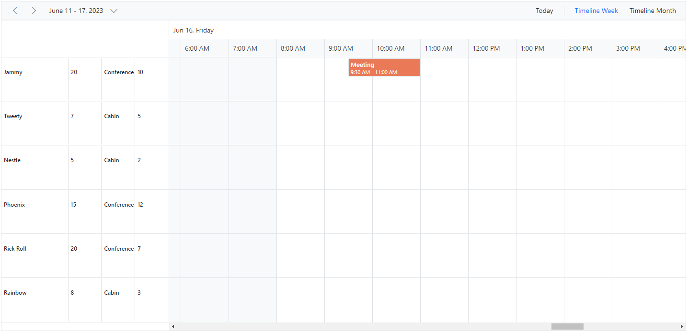

## Expand and collapse resource fields

It is possible to expand and collapse the resource field. By default, resource fields are expanded with their child fields. This behavior can be customized using the [`ExpandedField`](https://help.syncfusion.com/cr/blazor/Syncfusion.Blazor.Schedule.Resource.html#Syncfusion_Blazor_Schedule_Resource_ExpandedField) property. When [`ExpandedField`](https://help.syncfusion.com/cr/blazor/Syncfusion.Blazor.Schedule.Resource.html#Syncfusion_Blazor_Schedule_Resource_ExpandedField) property in resources dataSource is set to `false`, it restricts the resource fields from expanding. By default, [`ExpandedField`](https://help.syncfusion.com/cr/blazor/Syncfusion.Blazor.Schedule.Resource.html#Syncfusion_Blazor_Schedule_Resource_ExpandedField) value set to `true`.

```cshtml
@using Syncfusion.Blazor.Schedule

<SfSchedule TValue="AppointmentData" Height="550px" @bind-SelectedDate="@CurrentDate">
    <ScheduleGroup Resources="@Resources"></ScheduleGroup>
    <ScheduleResources>
        <ScheduleResource TItem="ResourceData" TValue="int" DataSource="@RoomData" Field="RoomId" Title="Room" Name="Rooms" TextField="RoomText" IdField="Id" ColorField="RoomColor" AllowMultiple="false" ExpandedField="IsExpand"></ScheduleResource>
        <ScheduleResource TItem="ResourceData" TValue="int[]" DataSource="@OwnersData" Field="OwnerId" Title="Owner" Name="Owners" TextField="OwnerText" IdField="Id" GroupIDField="OwnerGroupId" ColorField="OwnerColor" AllowMultiple="true"></ScheduleResource>
    </ScheduleResources>
    <ScheduleEventSettings DataSource="@DataSource"></ScheduleEventSettings>
    <ScheduleViews>
        <ScheduleView Option="View.TimelineWeek" MaxEventsPerRow="2"></ScheduleView>
        <ScheduleView Option="View.TimelineMonth" MaxEventsPerRow="2"></ScheduleView>
        <ScheduleView Option="View.Agenda"></ScheduleView>
    </ScheduleViews>
</SfSchedule>
@code{
    private DateTime CurrentDate = new DateTime(2023, 6, 1);
    public string[] Resources { get; set; } = { "Rooms", "Owners" };
    public List<ResourceData> RoomData { get; set; } = new List<ResourceData>
    {
        new ResourceData{ RoomText = "ROOM 1", Id = 1, RoomColor = "#cb6bb2",IsExpand=true},
        new ResourceData{ RoomText = "ROOM 2", Id = 2, RoomColor = "#56ca85" , IsExpand=false }
    };
    public List<ResourceData> OwnersData { get; set; } = new List<ResourceData>
    {
        new ResourceData{ OwnerText = "Nancy", Id = 1, OwnerGroupId = 1, OwnerColor = "#ffaa00" },
        new ResourceData{ OwnerText = "Steven", Id = 2, OwnerGroupId = 2, OwnerColor = "#f8a398" },
        new ResourceData{ OwnerText = "Michael", Id = 3, OwnerGroupId = 1, OwnerColor = "#7499e1" }
    };
    List<AppointmentData> DataSource = new List<AppointmentData>
    {
        new AppointmentData { Id = 1, Subject = "Meeting", StartTime = new DateTime(2023, 6, 2, 9, 30, 0) , EndTime = new DateTime(2023, 6, 2, 11, 0, 0), OwnerId = 1, RoomId = 1 }
    };
    public class AppointmentData
    {
        public int Id { get; set; }
        public string Subject { get; set; }
        public string Location { get; set; }
        public DateTime StartTime { get; set; }
        public DateTime EndTime { get; set; }
        public string Description { get; set; }
        public bool IsAllDay { get; set; }
        public string RecurrenceRule { get; set; }
        public string RecurrenceException { get; set; }
        public Nullable<int> RecurrenceID { get; set; }
        public int OwnerId { get; set; }
        public int RoomId { get; set; }
    }
    public class ResourceData
    {
        public int Id { get; set; }
        public string RoomText { get; set; }
        public string RoomColor { get; set; }
        public string OwnerText { get; set; }
        public string OwnerColor { get; set; }
        public int OwnerGroupId { get; set; }
        public bool IsExpand { get; set; }
    }
}
```


## Displaying tooltip for resource headers

It is possible to display tooltip over the resource headers showing the resource information. By default, there won't be any tooltip displayed on the resource headers, and to enable it, you need to assign the customized template design to the [`HeaderTooltipTemplate`](https://help.syncfusion.com/cr/blazor/Syncfusion.Blazor.Schedule.ScheduleGroup.html#Syncfusion_Blazor_Schedule_ScheduleGroup_HeaderTooltipTemplate) option within the [`ScheduleGroup`](https://help.syncfusion.com/cr/blazor/Syncfusion.Blazor.Schedule.ScheduleGroup.html).

```cshtml
@using Syncfusion.Blazor.Schedule

<SfSchedule TValue="AppointmentData" Height="550px" @bind-SelectedDate="@CurrentDate">
    <ScheduleGroup Resources="@Resources">
        <HeaderTooltipTemplate>
            @{
                var resourceData = (context as TemplateContext).ResourceData as ResourceData;
                <div class='template-wrap'>
                    <div class="resource-image"></div>
                    <div class="resource-details">
                        <div class="resource-name">@(resourceData.Text)</div>
                    </div>
                </div>
            }
        </HeaderTooltipTemplate>
    </ScheduleGroup>
    <ScheduleResources>
        <ScheduleResource TValue="int[]" TItem="ResourceData" DataSource="@ConferenceData" Field="ConferenceId" Title="Attendees" Name="Conferences" TextField="Text" IdField="Id" ColorField="Color" AllowMultiple="true"></ScheduleResource>
    </ScheduleResources>
    <ScheduleEventSettings DataSource="@DataSource"></ScheduleEventSettings>
    <ScheduleViews>
        <ScheduleView Option="View.Day"></ScheduleView>
        <ScheduleView Option="View.Week"></ScheduleView>
        <ScheduleView Option="View.WorkWeek"></ScheduleView>
        <ScheduleView Option="View.Month"></ScheduleView>
        <ScheduleView Option="View.Agenda"></ScheduleView>
    </ScheduleViews>
</SfSchedule>

@code{
    DateTime CurrentDate = new DateTime(2023, 6, 1);
    public string[] Resources { get; set; } = { "Conferences" };
    List<AppointmentData> DataSource = new List<AppointmentData>
    {
       new AppointmentData { Id = 1, Subject = "Meeting", StartTime = new DateTime(2023, 6, 16, 9, 30, 0) , EndTime = new DateTime(2023, 6, 16, 11, 0, 0),
       ConferenceId = 1 }
    };
    public List<ResourceData> ConferenceData { get; set; } = new List<ResourceData>
    {
        new ResourceData{ Text = "Margaret", Id = 1, Color = "#1aaa55", Image= "margaret" },
        new ResourceData{ Text = "Robert", Id = 2, Color = "#357cd2", Image= "robert" },
        new ResourceData{ Text = "Laura", Id = 3, Color = "#7fa900", Image= "laura" }
    };
    public class AppointmentData
    {
        public int Id { get; set; }
        public string Subject { get; set; }
        public string Location { get; set; }
        public DateTime StartTime { get; set; }
        public DateTime EndTime { get; set; }
        public string Description { get; set; }
        public bool IsAllDay { get; set; }
        public string RecurrenceRule { get; set; }
        public string RecurrenceException { get; set; }
        public Nullable<int> RecurrenceID { get; set; }
        public int ConferenceId { get; set; }
    }
    public class ResourceData
    {
        public int Id { get; set; }
        public string Image { get; set; }
        public string Text { get; set; }
        public string Color { get; set; }
    }
}
```

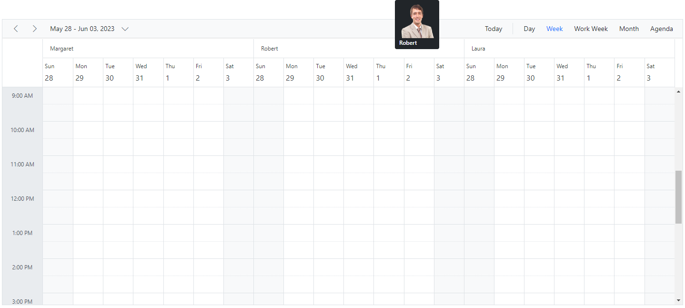

## Choosing between resource colors for appointments

By default, the colors defined on the top level resources collection will be applied for the events. In case, if you want to apply specific resource color to events irrespective of its top-level parent resource color, it can be achieved by defining [`ResourceColorField`](https://help.syncfusion.com/cr/blazor/Syncfusion.Blazor.Schedule.IScheduleEventSettings.html#Syncfusion_Blazor_Schedule_IScheduleEventSettings_ResourceColorField) option within the [`EventSettings`](https://help.syncfusion.com/cr/blazor/Syncfusion.Blazor.Schedule.IScheduleEventSettings.html) property.

```cshtml
@using Syncfusion.Blazor.Schedule
@using Syncfusion.Blazor.Buttons

<SfRadioButton Label="Hotels" Name="Select" Value="Hotels" @bind-Checked="@ResourceColor"></SfRadioButton>
<SfRadioButton Label="Rooms" Name="Select" Value="Rooms" @bind-Checked="@ResourceColor"></SfRadioButton>
<SfRadioButton Label="Owners" Name="Select" Value="Owners" @bind-Checked="@ResourceColor"></SfRadioButton>

<SfSchedule TValue="AppointmentData" Height="550px" @bind-SelectedDate="@CurrentDate">
    <ScheduleGroup Resources="@Resources"></ScheduleGroup>
    <ScheduleResources>
        <ScheduleResource TItem="ResourceData" TValue="int" DataSource="@HotelData" Field="HotelId" Title="Hotel" Name="Hotels" TextField="HotelText" IdField="Id" ColorField="HotelColor" AllowMultiple="false"></ScheduleResource>
        <ScheduleResource TItem="ResourceData" TValue="int" DataSource="@RoomData" Field="RoomId" Title="Room" Name="Rooms" TextField="RoomText" IdField="Id"
                          ColorField="RoomColor" GroupIDField="RoomGroupId" AllowMultiple="false"></ScheduleResource>
        <ScheduleResource TItem="ResourceData" TValue="int[]" DataSource="@OwnersData" Field="OwnerId" Title="Owner" Name="Owners" TextField="OwnerText" IdField="Id"
                          GroupIDField="OwnerGroupId" ColorField="OwnerColor" AllowMultiple="true"></ScheduleResource>
    </ScheduleResources>
    <ScheduleEventSettings DataSource="@DataSource" ResourceColorField="@ResourceColor"></ScheduleEventSettings>
    <ScheduleViews>
        <ScheduleView Option="View.Day"></ScheduleView>
        <ScheduleView Option="View.Week"></ScheduleView>
        <ScheduleView Option="View.WorkWeek"></ScheduleView>
        <ScheduleView Option="View.Month"></ScheduleView>
        <ScheduleView Option="View.Agenda"></ScheduleView>
    </ScheduleViews>
</SfSchedule>

@code{
    DateTime CurrentDate = new DateTime(2023, 6, 1);
    public string ResourceColor { get; set; } = "Rooms";
    public string[] Resources { get; set; } = { "Hotels", "Rooms", "Owners" };
    public List<ResourceData> HotelData { get; set; } = new List<ResourceData>
    {
        new ResourceData{ HotelText = "Hotel 1", Id = 1, HotelColor = "#f8a398" },
        new ResourceData{ HotelText = "Hotel 2", Id = 2, HotelColor = "#ffaa00" }
    };
    public List<ResourceData> RoomData { get; set; } = new List<ResourceData>
    {
        new ResourceData{ RoomText = "ROOM 1", Id = 1, RoomGroupId = 1, RoomColor = "#cb6bb2" },
        new ResourceData{ RoomText = "ROOM 2", Id = 2, RoomGroupId = 2, RoomColor = "#56ca85" }
    };
    public List<ResourceData> OwnersData { get; set; } = new List<ResourceData>
    {
        new ResourceData{ OwnerText = "Nancy", Id = 1, OwnerGroupId = 1, OwnerColor = "#ffaa00" },
        new ResourceData{ OwnerText = "Steven", Id = 2, OwnerGroupId = 2, OwnerColor = "#f8a398" },
        new ResourceData{ OwnerText = "Michael", Id = 3, OwnerGroupId = 1, OwnerColor = "#7499e1" }
    };
    List<AppointmentData> DataSource = new List<AppointmentData>
    {
            new AppointmentData { Id = 1, Subject = "Meeting", StartTime = new DateTime(2023, 6, 16, 9, 30, 0) , EndTime = new DateTime(2023, 6, 16, 11, 0, 0),
            OwnerId = 1, RoomId = 1, HotelId = 1 }
    };
    public class AppointmentData
    {
        public int Id { get; set; }
        public string Subject { get; set; }
        public string Location { get; set; }
        public DateTime StartTime { get; set; }
        public DateTime EndTime { get; set; }
        public string Description { get; set; }
        public bool IsAllDay { get; set; }
        public string RecurrenceRule { get; set; }
        public string RecurrenceException { get; set; }
        public Nullable<int> RecurrenceID { get; set; }
        public int OwnerId { get; set; }
        public int RoomId { get; set; }
        public int HotelId { get; set; }
    }
    public class ResourceData
    {
        public int Id { get; set; }
        public string HotelText { get; set; }
        public string RoomText { get; set; }
        public string OwnerText { get; set; }
        public string HotelColor { get; set; }
        public string RoomColor { get; set; }
        public string OwnerColor { get; set; }
        public int RoomGroupId { get; set; }
        public int OwnerGroupId { get; set; }
    }
}
```


N> The value of the [`ResourceColorField`](https://help.syncfusion.com/cr/blazor/Syncfusion.Blazor.Schedule.IScheduleEventSettings.html#Syncfusion_Blazor_Schedule_IScheduleEventSettings_ResourceColorField) field should be mapped with the `Name` value given within the [`ScheduleResource`](https://help.syncfusion.com/cr/blazor/Syncfusion.Blazor.Schedule.Resource.html).

## Setting different working days and hours for resources

Each resource in the Scheduler can have different working hours as well as different working days set to it. There are default options available within the [`ScheduleResource`](https://help.syncfusion.com/cr/blazor/Syncfusion.Blazor.Schedule.Resource.html) collection, to customize the default working hours and days of the Scheduler.

* [Using the work day field for different work days](#Set-different-work-days)
* [Using the start hour and end hour fields for different work hours](#Set-different-work-hours)

### Set different work days

Different working days can be set for the resources of Scheduler using the [`WorkDaysField`](https://help.syncfusion.com/cr/blazor/Syncfusion.Blazor.Schedule.Resource.html#Syncfusion_Blazor_Schedule_Resource_WorkDaysField) property which maps the working days field from the resource dataSource. This field accepts the collection of day indexes (from 0 to 6) of a week. By default, it is set to [1, 2, 3, 4, 5] and in the following example, each resource has been set with different values and therefore each of them will render only those working days. This option is applicable only on the calendar views and is not applicable on timeline views.

```cshtml
@using Syncfusion.Blazor.Schedule

<SfSchedule TValue="AppointmentData" Height="550px" @bind-SelectedDate="@CurrentDate" @bind-CurrentView="@CurrentView">
    <ScheduleGroup Resources="@Resources"></ScheduleGroup>
    <ScheduleResources>
        <ScheduleResource TItem="ResourceData" TValue="int" DataSource="@DoctorsData" Field="DoctorId" Title="Doctor Name" Name="Doctors" TextField="Text"
                          IdField="Id" ColorField="Color" WorkDaysField="WorkDays"></ScheduleResource>
    </ScheduleResources>
    <ScheduleViews>
        <ScheduleView Option="View.Day"></ScheduleView>
        <ScheduleView Option="View.Week"></ScheduleView>
        <ScheduleView Option="View.WorkWeek"></ScheduleView>
        <ScheduleView Option="View.Month"></ScheduleView>
        <ScheduleView Option="View.Agenda"></ScheduleView>
    </ScheduleViews>
</SfSchedule>

@code{
    DateTime CurrentDate = new DateTime(2023, 6, 1);
    View CurrentView = View.WorkWeek;
    public string[] Resources { get; set; } = { "Doctors" };
    public List<ResourceData> DoctorsData { get; set; } = new List<ResourceData>
    {
        new ResourceData{ Text = "Will Smith", Id = 1, Color = "#ea7a57", WorkDays = new int[] { 1, 2, 4, 5 } },
        new ResourceData{ Text = "Alice", Id = 2, Color = "rgb(53, 124, 210)", WorkDays = new int[] { 1, 3, 5 } },
        new ResourceData{ Text = "Robson", Id = 3, Color = "#7fa900" }
    };
    public class AppointmentData
    {
        public int Id { get; set; }
        public string Subject { get; set; }
        public string Location { get; set; }
        public DateTime StartTime { get; set; }
        public DateTime EndTime { get; set; }
        public string Description { get; set; }
        public bool IsAllDay { get; set; }
        public string RecurrenceRule { get; set; }
        public string RecurrenceException { get; set; }
        public Nullable<int> RecurrenceID { get; set; }
        public int DoctorId { get; set; }
    }
    public class ResourceData
    {
        public int Id { get; set; }
        public string Text { get; set; }
        public string Color { get; set; }
        public int[] WorkDays { get; set; }
    }
}
```

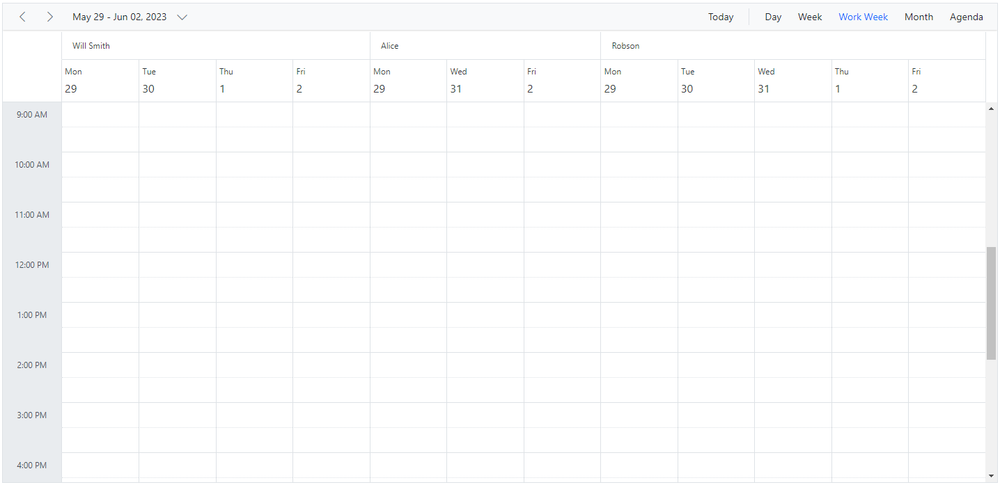

### Set different work hours

Different `working Hours` can be set for the resources of Scheduler using the [`StartHourField`](https://help.syncfusion.com/cr/blazor/Syncfusion.Blazor.Schedule.Resource.html#Syncfusion_Blazor_Schedule_Resource_StartHourField) and [`EndHourField`](https://help.syncfusion.com/cr/blazor/Syncfusion.Blazor.Schedule.Resource.html#Syncfusion_Blazor_Schedule_Resource_EndHourField) property which maps the `startHourField` and `endHourField` field from the resource dataSource.

* [`StartHourField`](https://help.syncfusion.com/cr/blazor/Syncfusion.Blazor.Schedule.Resource.html#Syncfusion_Blazor_Schedule_Resource_StartHourField) - Denotes the start time of the working/business hour in a day.
* [`EndHourField`](https://help.syncfusion.com/cr/blazor/Syncfusion.Blazor.Schedule.Resource.html#Syncfusion_Blazor_Schedule_Resource_EndHourField) - Denotes the end time limit of the working/business hour in a day.

Working hours indicates the work hour duration of a day, which is highlighted visually with active color over the work cells. Each resource on the Scheduler can be defined with its own set of working hours as depicted in the following example.

```cshtml
@using Syncfusion.Blazor.Schedule

<SfSchedule TValue="AppointmentData" Height="650px" @bind-SelectedDate="@CurrentDate">
    <ScheduleGroup Resources="@Resources"></ScheduleGroup>
    <ScheduleResources>
        <ScheduleResource TItem="ResourceData" TValue="int" DataSource="@DoctorsData" Field="DoctorId" Title="Doctor Name" Name="Doctors" TextField="Text" IdField="Id"
                          ColorField="Color" WorkDaysField="WorkDays" StartHourField="StartHour" EndHourField="EndHour"></ScheduleResource>
    </ScheduleResources>
    <ScheduleViews>
        <ScheduleView Option="View.Day"></ScheduleView>
        <ScheduleView Option="View.Week"></ScheduleView>
        <ScheduleView Option="View.WorkWeek"></ScheduleView>
        <ScheduleView Option="View.Month"></ScheduleView>
        <ScheduleView Option="View.Agenda"></ScheduleView>
    </ScheduleViews>
</SfSchedule>

@code{
    DateTime CurrentDate = new DateTime(2023, 6, 1);
    public string[] Resources { get; set; } = { "Doctors" };
    public List<ResourceData> DoctorsData { get; set; } = new List<ResourceData>
    {
        new ResourceData{ Text = "Will Smith", Id = 1, Color = "#ea7a57", StartHour = "07:00", EndHour = "13:00"},
        new ResourceData{ Text = "Alice", Id = 2, Color = "rgb(53, 124, 210)", StartHour = "09:00", EndHour = "17:00"},
        new ResourceData{ Text = "Robson", Id = 3, Color = "#7fa900", StartHour = "08:00", EndHour = "16:00"}
    };
    public class AppointmentData
    {
        public int Id { get; set; }
        public string Subject { get; set; }
        public string Location { get; set; }
        public DateTime StartTime { get; set; }
        public DateTime EndTime { get; set; }
        public string Description { get; set; }
        public bool IsAllDay { get; set; }
        public string RecurrenceRule { get; set; }
        public string RecurrenceException { get; set; }
        public Nullable<int> RecurrenceID { get; set; }
        public int DoctorId { get; set; }
    }
    public class ResourceData
    {
        public int Id { get; set; }
        public string Text { get; set; }
        public string Color { get; set; }
        public string StartHour { get; set; }
        public string EndHour { get; set; }
    }
}
```

In this example, a resource named `Will Smith` is depicted with working hours ranging from 7.00 AM to 1.00 PM and is visually illustrated with active colors, whereas the other two resources have different working hours set.

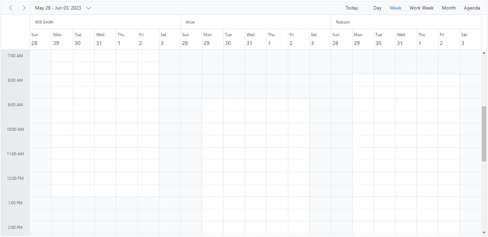

### Hide non-working days when grouped by date

In Scheduler, you can set custom work days for each resource and group the Scheduler by date to display these work days. By default, the Scheduler will show all days when it is grouped by date, even if they are not included in the custom work days for the resources. However, you can use the [HideNonWorkingDays](https://help.syncfusion.com/cr/blazor/Syncfusion.Blazor.Schedule.ScheduleGroup.html#Syncfusion_Blazor_Schedule_ScheduleGroup_HideNonWorkingDays) property to only display the custom work days in the Scheduler.
To use the [HideNonWorkingDays](https://help.syncfusion.com/cr/blazor/Syncfusion.Blazor.Schedule.ScheduleGroup.html#Syncfusion_Blazor_Schedule_ScheduleGroup_HideNonWorkingDays) property, you need to include it in the configuration options for your Scheduler component. Set the value of[HideNonWorkingDays](https://help.syncfusion.com/cr/blazor/Syncfusion.Blazor.Schedule.ScheduleGroup.html#Syncfusion_Blazor_Schedule_ScheduleGroup_HideNonWorkingDays) to `true` to enable this feature.
**Example:** To display the Scheduler with resources grouped by date for custom working days,
 
```cshtml
@using Syncfusion.Blazor.Schedule
    <SfSchedule TValue="ResourceData" Width="100%" Height="650px">
        <ScheduleGroup ByDate="true" HideNonWorkingDays="@HideNonWorkingDays" Resources="@groupData"></ScheduleGroup>
        <ScheduleResources>
            <ScheduleResource TItem="ResourceData" TValue="int[]" DataSource="@OwnersData" Field="TaskId" Title="Assignee" Name="Owners" TextField="Text" IdField="Id" ColorField="Color" WorkDaysField="WorkDays" AllowMultiple="true"></ScheduleResource>
        </ScheduleResources>
        <ScheduleEventSettings DataSource="@dataSource"></ScheduleEventSettings>
    </SfSchedule>
@code{
    private bool HideNonWorkingDays { get; set; } = true;
    private string[] groupData = new string[] { "Owners" };
    private List<ResourceData> OwnersData { get; set; } = new List<ResourceData> {
        new ResourceData { Text = "Alice", Id= 1, Color = "#df5286", WorkDays = new int[] { 1, 2, 3, 4} },
        new ResourceData { Text = "Smith", Id= 2, Color = "#5978ee", WorkDays = new int[] { 2, 3, 5 } }
    };
    private List<ResourceData> dataSource = new List<ResourceData>()
    {
        new ResourceData
        {
            Id = 1,
            Subject = "Workflow Analysis",
            StartTime = new DateTime(DateTime.Today.Year, DateTime.Today.Month, DateTime.Today.Day, 9, 30, 0).AddDays(1),
            EndTime = new DateTime(DateTime.Today.Year, DateTime.Today.Month,DateTime.Today.Day, 12, 0, 0).AddDays(1),
            IsAllDay = false,
            ProjectId = 1,
            TaskId = 2
        },
        new ResourceData
        {
            Id = 2,
            Subject = "Requirement planning",
            StartTime = new DateTime(DateTime.Today.Year, DateTime.Today.Month, DateTime.Today.Day, 12, 30, 0),
            EndTime = new DateTime(DateTime.Today.Year, DateTime.Today.Month, DateTime.Today.Day, 14, 45, 0),
            IsAllDay = false,
            ProjectId = 1,
            TaskId = 1
        },
        new ResourceData
        {
            Id = 1,
            Subject = "Quality Analysis",
            StartTime = new DateTime(DateTime.Today.Year, DateTime.Today.Month, DateTime.Today.Day, 10, 0, 0).AddDays(1),
            EndTime = new DateTime(DateTime.Today.Year, DateTime.Today.Month, DateTime.Today.Day, 12, 30, 0).AddDays(1),
            IsAllDay = false,
            ProjectId = 1,
            TaskId = 1
        },
        new ResourceData
        {
            Id = 1,
            Subject = "Release planing",
            StartTime = new DateTime(DateTime.Today.Year, DateTime.Today.Month, DateTime.Today.Day, 10, 0, 0).AddDays(-1),
            EndTime = new DateTime(DateTime.Today.Year, DateTime.Today.Month, DateTime.Today.Day, 12, 30, 0).AddDays(-1),
            IsAllDay = false,
            ProjectId = 1,
            TaskId = 1
        }
    };
    public class ResourceData
    {
        public string Text { get; set; }
        public int Id { get; set; }
        public string Color { get; set; }
        public int[] WorkDays { get; set; }
        public string Subject { get; set; }
        public DateTime StartTime { get; set; }
        public DateTime EndTime { get; set; }
        public Nullable<bool> IsAllDay { get; set; }
        public int ProjectId { get; set; }
        public int TaskId { get; set; }
    }
}
```

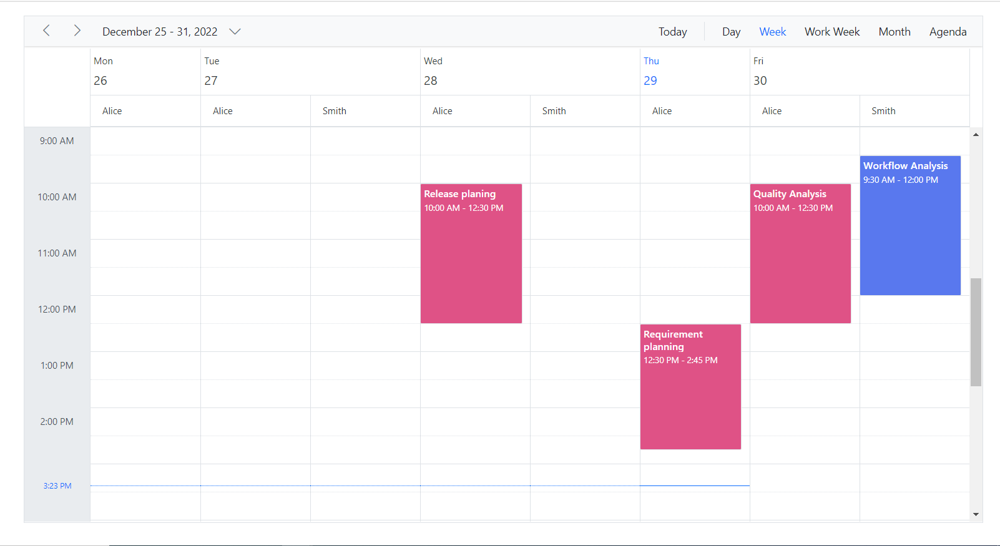

N>  The [HideNonWorkingDays](https://help.syncfusion.com/cr/blazor/Syncfusion.Blazor.Schedule.ScheduleGroup.html#Syncfusion_Blazor_Schedule_ScheduleGroup_HideNonWorkingDays) property only applies,
when the Scheduler is grouped by [ByDate](https://help.syncfusion.com/cr/blazor/Syncfusion.Blazor.Schedule.ScheduleGroup.html#Syncfusion_Blazor_Schedule_ScheduleGroup_ByDate)

### Hide non-working days when grouped by date

In Scheduler, you can set custom work days for each resource and group the Scheduler by date to display these work days. By default, the Scheduler will show all days when it is grouped by date, even if they are not included in the custom work days for the resources. However, you can use the [HideNonWorkingDays](https://help.syncfusion.com/cr/blazor/Syncfusion.Blazor.Schedule.ScheduleGroup.html#Syncfusion_Blazor_Schedule_ScheduleGroup_HideNonWorkingDays) property to only display the custom work days in the Scheduler.

To use the [HideNonWorkingDays](https://help.syncfusion.com/cr/blazor/Syncfusion.Blazor.Schedule.ScheduleGroup.html#Syncfusion_Blazor_Schedule_ScheduleGroup_HideNonWorkingDays) property, you need to include it in the configuration options for your Scheduler component. Set the value of [HideNonWorkingDays](https://help.syncfusion.com/cr/blazor/Syncfusion.Blazor.Schedule.ScheduleGroup.html#Syncfusion_Blazor_Schedule_ScheduleGroup_HideNonWorkingDays) to `true` to enable this feature.

**Example:** To display the Scheduler with resources grouped by date for custom working days,
 
```cshtml
@using Syncfusion.Blazor.Schedule

    <SfSchedule TValue="ResourceData" Width="100%" Height="650px">
        <ScheduleGroup ByDate="true" HideNonWorkingDays="@HideNonWorkingDays" Resources="@groupData"></ScheduleGroup>
        <ScheduleResources>
            <ScheduleResource TItem="ResourceData" TValue="int[]" DataSource="@OwnersData" Field="TaskId" Title="Assignee" Name="Owners" TextField="Text" IdField="Id" ColorField="Color" WorkDaysField="WorkDays" AllowMultiple="true"></ScheduleResource>
        </ScheduleResources>
        <ScheduleEventSettings DataSource="@dataSource"></ScheduleEventSettings>
    </SfSchedule>
@code{
    private bool HideNonWorkingDays { get; set; } = true;
    private string[] groupData = new string[] { "Owners" };
    private List<ResourceData> OwnersData { get; set; } = new List<ResourceData> {
        new ResourceData { Text = "Alice", Id= 1, Color = "#df5286", WorkDays = new int[] { 1, 2, 3, 4} },
        new ResourceData { Text = "Smith", Id= 2, Color = "#5978ee", WorkDays = new int[] { 2, 3, 5 } }
    };
    private List<ResourceData> dataSource = new List<ResourceData>()
    {
        new ResourceData
        {
            Id = 1,
            Subject = "Workflow Analysis",
            StartTime = new DateTime(DateTime.Today.Year, DateTime.Today.Month, DateTime.Today.Day, 9, 30, 0).AddDays(1),
            EndTime = new DateTime(DateTime.Today.Year, DateTime.Today.Month,DateTime.Today.Day, 12, 0, 0).AddDays(1),
            IsAllDay = false,
            ProjectId = 1,
            TaskId = 2
        },
        new ResourceData
        {
            Id = 2,
            Subject = "Requirement planning",
            StartTime = new DateTime(DateTime.Today.Year, DateTime.Today.Month, DateTime.Today.Day, 12, 30, 0),
            EndTime = new DateTime(DateTime.Today.Year, DateTime.Today.Month, DateTime.Today.Day, 14, 45, 0),
            IsAllDay = false,
            ProjectId = 1,
            TaskId = 1
        },
        new ResourceData
        {
            Id = 1,
            Subject = "Quality Analysis",
            StartTime = new DateTime(DateTime.Today.Year, DateTime.Today.Month, DateTime.Today.Day, 10, 0, 0).AddDays(1),
            EndTime = new DateTime(DateTime.Today.Year, DateTime.Today.Month, DateTime.Today.Day, 12, 30, 0).AddDays(1),
            IsAllDay = false,
            ProjectId = 1,
            TaskId = 1
        },
        new ResourceData
        {
            Id = 1,
            Subject = "Release planing",
            StartTime = new DateTime(DateTime.Today.Year, DateTime.Today.Month, DateTime.Today.Day, 10, 0, 0).AddDays(-1),
            EndTime = new DateTime(DateTime.Today.Year, DateTime.Today.Month, DateTime.Today.Day, 12, 30, 0).AddDays(-1),
            IsAllDay = false,
            ProjectId = 1,
            TaskId = 1
        }
    };
    public class ResourceData
    {
        public string Text { get; set; }
        public int Id { get; set; }
        public string Color { get; set; }
        public int[] WorkDays { get; set; }
        public string Subject { get; set; }
        public DateTime StartTime { get; set; }
        public DateTime EndTime { get; set; }
        public Nullable<bool> IsAllDay { get; set; }
        public int ProjectId { get; set; }
        public int TaskId { get; set; }
    }
}
```

N>  The [HideNonWorkingDays](https://help.syncfusion.com/cr/blazor/Syncfusion.Blazor.Schedule.ScheduleGroup.html#Syncfusion_Blazor_Schedule_ScheduleGroup_HideNonWorkingDays) property only applies,
when the Scheduler is grouped by [ByDate](https://help.syncfusion.com/cr/blazor/Syncfusion.Blazor.Schedule.ScheduleGroup.html#Syncfusion_Blazor_Schedule_ScheduleGroup_ByDate)

## Compact view in mobile

Although the Scheduler views are designed keeping in mind the responsiveness of the control in mobile devices, however when using Scheduler with multiple resources - it is difficult to view all the resources and its relevant events at once on the mobile. Therefore, a new compact mode has been introduced specially for displaying multiple resources of Scheduler on mobile devices. By default, this mode is enabled while using Scheduler with multiple resources on the mobile devices. If in case, you need to disable this compact mode, set `false` to the [`EnableCompactView`](https://help.syncfusion.com/cr/blazor/Syncfusion.Blazor.Schedule.ScheduleGroup.html#Syncfusion_Blazor_Schedule_ScheduleGroup_EnableCompactView) option within the [`ScheduleGroup`](https://help.syncfusion.com/cr/blazor/Syncfusion.Blazor.Schedule.ScheduleGroup.html). Disabling this option will display the exact desktop mode of Scheduler view on mobile devices.

With this compact view enabled on mobile, you can view only single resource at a time and to switch to other resources, there is a TreeView at the left listing out all other available resources - clicking on which will display that particular resource and its related appointments.


## Adaptive UI in desktop

By default, the Scheduler layout adapts automatically in the desktop and mobile devices with appropriate UI changes. In case, if the user wants to display the Adaptive scheduler in desktop mode with adaptive enhancements, then the property [`EnableAdaptiveUI`](https://help.syncfusion.com/cr/blazor/Syncfusion.Blazor.Schedule.SfSchedule-1.html#Syncfusion_Blazor_Schedule_SfSchedule_1_EnableAdaptiveUI) can be set to true. Enabling this option will display the exact mobile mode of Scheduler view on desktop devices.

Some of the default changes made for compact Scheduler to render in desktop devices are as follows,
* View options displayed in the Navigation drawer.
* Plus icon is added to the header for new event creation.
* Today icon is added to the header instead of the Today button.
* With Multiple resources  only one resource has been shown to enhance the view experience of resource events details clearly. To switch to other resources, there is a TreeView on the left that lists all other available resources, clicking on which will display that particular resource and its related events.

To get start quickly about adaptive UI in our Scheduler, you can check on this video:



```cshtml
@using Syncfusion.Blazor.Schedule

<SfSchedule TValue="AppointmentData" Width="100%" Height="650px" @bind-SelectedDate="@CurrentDate" @bind-CurrentView="@CurrentView" EnableAdaptiveUI="true">
    <ScheduleGroup Resources="@GroupData"></ScheduleGroup>
    <ScheduleResources>
        <ScheduleResource TItem="ResourceData" TValue="int" DataSource="@ProjectData" Field="ProjectId" Title="Choose Project" Name="Projects" TextField="Text" IdField="Id" ColorField="Color"></ScheduleResource>
        <ScheduleResource TItem="ResourceData" TValue="int[]" DataSource="@TaskData" Field="TaskId" Title="Category" Name="Categories" TextField="Text" IdField="Id" GroupIDField="GroupId" ColorField="Color" AllowMultiple="true"></ScheduleResource>
    </ScheduleResources>
    <ScheduleViews>
        <ScheduleView Option="View.Day"></ScheduleView>
        <ScheduleView Option="View.Week"></ScheduleView>
        <ScheduleView Option="View.Month"></ScheduleView>
    </ScheduleViews>
    <ScheduleEventSettings DataSource="@DataSource"></ScheduleEventSettings>
</SfSchedule>

@code{
    private View CurrentView = View.Month;
    public DateTime CurrentDate = new DateTime(2023, 6, 1);
    List<AppointmentData> DataSource = new List<AppointmentData>
    {
         new AppointmentData { Id = 1, Subject = "Meeting", StartTime = new DateTime(2023, 6, 16, 9, 30, 0) , EndTime = new DateTime(2023, 6, 16, 11, 0, 0), ProjectId = 1, TaskId = 1 }
    };
    private string[] GroupData = new string[] { "Projects", "Categories" };
    private List<ResourceData> ProjectData { get; set; } = new List<ResourceData> {
        new ResourceData {Text = "PROJECT 1", Id= 1, Color= "#cb6bb2"},
        new ResourceData {Text = "PROJECT 2", Id= 2, Color= "#56ca85"},
        new ResourceData {Text = "PROJECT 3", Id= 3, Color= "#df5286"}
    };
    private List<ResourceData> TaskData { get; set; } = new List<ResourceData> {
        new ResourceData { Text = "Nancy", Id= 1, GroupId = 1, Color = "#df5286" },
        new ResourceData { Text = "Steven", Id= 2, GroupId = 1, Color = "#7fa900" },
        new ResourceData { Text = "Robert", Id= 3, GroupId = 2, Color = "#ea7a57" },
        new ResourceData { Text = "Smith", Id= 4, GroupId = 2, Color = "#5978ee" },
        new ResourceData { Text = "Michael", Id= 5, GroupId = 3, Color = "#df5286" },
        new ResourceData { Text = "Root", Id= 6, GroupId = 3, Color = "#00bdae" }
    };
    public class ResourceData
    {
        public string Text { get; set; }
        public int Id { get; set; }
        public int GroupId { get; set; }
        public string Color { get; set; }
    }
    public class AppointmentData
    {
        public int Id { get; set; }
        public string Subject { get; set; }
        public string Location { get; set; }
        public DateTime StartTime { get; set; }
        public DateTime EndTime { get; set; }
        public string Description { get; set; }
        public bool IsAllDay { get; set; }
        public string RecurrenceRule { get; set; }
        public string RecurrenceException { get; set; }
        public Nullable<int> RecurrenceID { get; set; }
        public int ProjectId { get; set; }
        public int TaskId { get; set; }
    }
}
```

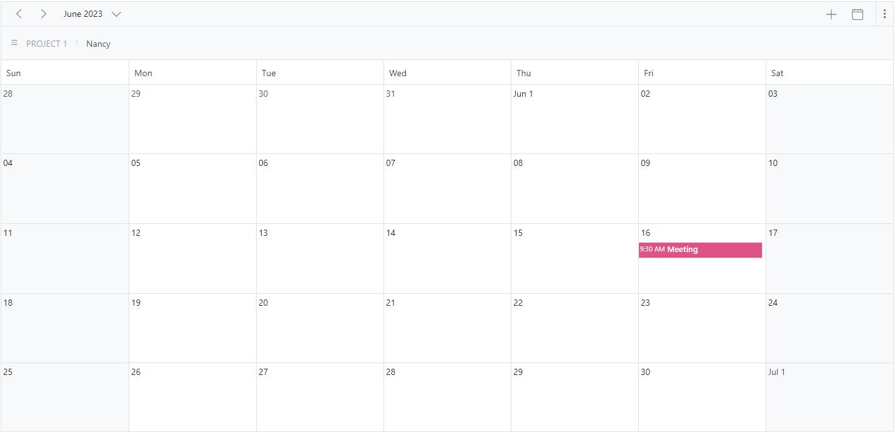

## See also

[How to use blazor Scheduler to create an Airfare Calendar] (https://www.youtube.com/watch?v=QlzdcZTmOrU-0)
[How to expand or collapse a resource programmatically](./how-to/expand-collapse-resource-dynamically)