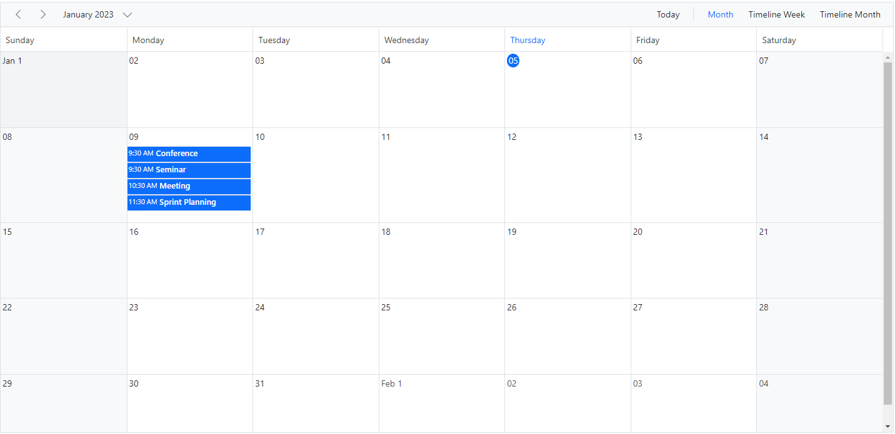
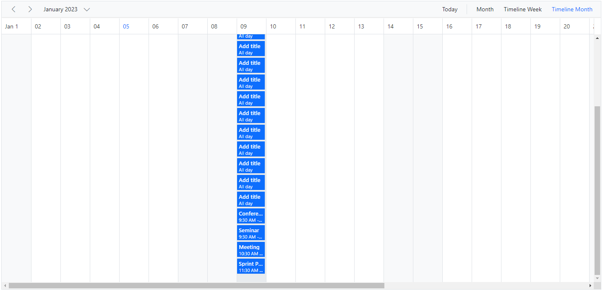
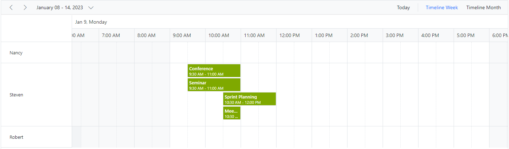
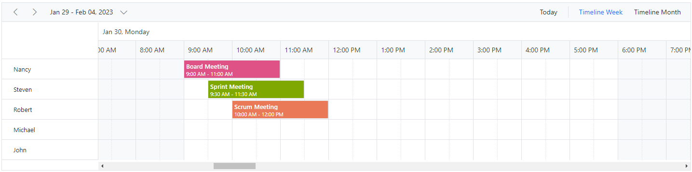

# Row Auto Height in Blazor Scheduler Component

By default, row heights in Scheduler Timeline views are static. This means that when multiple overlapping appointments occupy the same time range, a `+n more` text indicator is displayed. With this feature enabled, all overlapping appointments present in those specific time ranges can be viewed by auto-adjusting the row height based on the appointment count, instead of displaying `+n more` text indicators.

To enable auto row height adjustments on Scheduler Timeline views and Month view, set `true` to the [`EnableAutoRowHeight`](https://help.syncfusion.com/cr/blazor/Syncfusion.Blazor.Schedule.SfSchedule-1.html#Syncfusion_Blazor_Schedule_SfSchedule_1_EnableAutoRowHeight) property whose default value is `false`.

N> This auto row height adjustment is applicable only on all the Timeline views as well as on the calendar Month view.

Now, let's see how it works on those applicable views with examples.

When the feature [`EnableAutoRowHeight`](https://help.syncfusion.com/cr/blazor/Syncfusion.Blazor.Schedule.SfSchedule-1.html#Syncfusion_Blazor_Schedule_SfSchedule_1_EnableAutoRowHeight) is enabled, the row height gets auto-adjusted based on the number of overlapping events occupied on the same time range, which is demonstrated in the following example.

For a quick start on row auto height in the Scheduler, refer to this video:



```cshtml
@using Syncfusion.Blazor.Schedule

<SfSchedule TValue="AppointmentData" Height="650px" EnableAutoRowHeight="true">
    <ScheduleViews>
        <ScheduleEventSettings DataSource="@DataSource"></ScheduleEventSettings>
        <ScheduleView Option="View.Month"></ScheduleView>
        <ScheduleView Option="View.TimelineWeek"></ScheduleView>
        <ScheduleView Option="View.TimelineMonth"></ScheduleView>
    </ScheduleViews>
</SfSchedule>
@code{
    DateTime CurrentDate = new DateTime(2023, 1, 8);
    List<AppointmentData> DataSource = new List<AppointmentData>
    {
        new AppointmentData { Id = 1, Subject = "Meeting", StartTime = new DateTime(2023, 1, 9, 10, 30, 0) , EndTime = new DateTime(2023, 1, 9, 11, 0, 0) },
        new AppointmentData { Id = 2, Subject = "Conference", StartTime = new DateTime(2023, 1, 9, 9, 30, 0) , EndTime = new DateTime(2023, 1, 9, 11, 0, 0) },
        new AppointmentData { Id = 3, Subject = "Seminar", StartTime = new DateTime(2023, 1, 9, 9, 30, 0) , EndTime = new DateTime(2023, 1, 9, 11, 0, 0) },
        new AppointmentData { Id = 4, Subject = "Sprint Planning", StartTime = new DateTime(2023, 1, 9, 11, 30, 0) , EndTime = new DateTime(2023, 1, 9, 12, 0, 0) }
    };
    public class AppointmentData
    {
        public int Id { get; set; }
        public string Subject { get; set; }
        public string Location { get; set; }
        public DateTime StartTime { get; set; }
        public DateTime EndTime { get; set; }
        public string Description { get; set; }
        public bool IsAllDay { get; set; }
        public string RecurrenceRule { get; set; }
        public string RecurrenceException { get; set; }
        public Nullable<int> RecurrenceID { get; set; }
    }
}
```






## Timeline Views with Multiple Resources

```cshtml
@using Syncfusion.Blazor.Schedule

<SfSchedule TValue="AppointmentData" Height="650px" EnableAutoRowHeight="true">
    <ScheduleGroup Resources="@Resources"></ScheduleGroup>
    <ScheduleResources>
        <ScheduleResource TItem="ResourceData" TValue="int" DataSource="@OwnerData" Field="OwnerId" Title="Owner" Name="Owner" TextField="Text" IdField="Id" ColorField="Color"></ScheduleResource>
    </ScheduleResources>
    <ScheduleEventSettings DataSource="@DataSource"></ScheduleEventSettings>
    <ScheduleViews>
        <ScheduleView Option="View.TimelineWeek"></ScheduleView>
        <ScheduleView Option="View.TimelineMonth"></ScheduleView>
    </ScheduleViews>
</SfSchedule>

@code{
    DateTime CurrentDate = new DateTime(2023, 1, 9);
    public string[] Resources { get; set; } = { "Owner" };
    private List<ResourceData> OwnerData { get; set; } = new List<ResourceData> {
        new ResourceData { Text = "Nancy", Id= 1, Color = "#df5286" },
        new ResourceData { Text = "Steven", Id= 2, Color = "#7fa900" },
        new ResourceData { Text = "Robert", Id= 3, Color = "#ea7a57" }
    };
    List<AppointmentData> DataSource = new List<AppointmentData>
    {
        new AppointmentData { Id = 1, OwnerId = 2,Subject = "Meeting", StartTime = new DateTime(2023, 1, 9, 10, 30, 0) , EndTime = new DateTime(2023, 1, 9, 11, 0, 0) },
        new AppointmentData { Id = 2, OwnerId = 2,Subject = "Conference", StartTime = new DateTime(2023, 1, 9, 9, 30, 0) , EndTime = new DateTime(2023, 1, 9, 11, 0, 0) },
        new AppointmentData { Id = 3, OwnerId = 2,Subject = "Seminar", StartTime = new DateTime(2023, 1, 9, 9, 30, 0) , EndTime = new DateTime(2023, 1, 9, 11, 0, 0) },
        new AppointmentData { Id = 4, OwnerId = 2, Subject = "Sprint Planning", StartTime = new DateTime(2023, 1, 9, 10, 30, 0) , EndTime = new DateTime(2023, 1, 9, 12, 0, 0) }
    };
    public class ResourceData
    {
        public int Id { get; set; }
        public string Text { get; set; }
        public string Color { get; set; }
    }
    public class AppointmentData
    {
        public int Id { get; set; }
        public string Subject { get; set; }
        public string Location { get; set; }
        public DateTime StartTime { get; set; }
        public DateTime EndTime { get; set; }
        public string Description { get; set; }
        public bool IsAllDay { get; set; }
        public string RecurrenceRule { get; set; }
        public string RecurrenceException { get; set; }
        public Nullable<int> RecurrenceID { get; set; }
        public int OwnerId { get; set; }
    }
}
```




## Appointments Occupying Entire Cell

By default, with the feature [`EnableAutoRowHeight`](https://help.syncfusion.com/cr/blazor/Syncfusion.Blazor.Schedule.SfSchedule-1.html#Syncfusion_Blazor_Schedule_SfSchedule_1_EnableAutoRowHeight), there will be a space in the bottom of the cell when appointment is rendered. To avoid this space, set true to the property [`IgnoreWhitespace`](https://help.syncfusion.com/cr/blazor/Syncfusion.Blazor.Schedule.IScheduleEventSettings.html#Syncfusion_Blazor_Schedule_IScheduleEventSettings_IgnoreWhitespace) with [`ScheduleEventSettings`](https://help.syncfusion.com/cr/blazor/Syncfusion.Blazor.Schedule.IScheduleEventSettings.html) tag helper whereas its default property value is false.

```cshtml

@using Syncfusion.Blazor.Schedule

<SfSchedule TValue="AppointmentData" Height="350px" EnableAutoRowHeight="true" @bind-SelectedDate="@CurrentDate">
    <ScheduleGroup Resources="@Resources"></ScheduleGroup>
    <ScheduleResources>
        <ScheduleResource TItem="ResourceData" TValue="int" DataSource="@OwnerData" Field="OwnerId" Title="Owner" Name="Owner" TextField="Text" IdField="Id" ColorField="Color"></ScheduleResource>
    </ScheduleResources>
    <ScheduleEventSettings DataSource="@DataSource" IgnoreWhitespace="true"></ScheduleEventSettings>
    <ScheduleViews>
        <ScheduleView Option="View.TimelineWeek"></ScheduleView>
        <ScheduleView Option="View.TimelineMonth"></ScheduleView>
    </ScheduleViews>
</SfSchedule>

@code{
    DateTime CurrentDate = new DateTime(2023, 1, 30);
    public string[] Resources { get; set; } = { "Owner" };
    private List<ResourceData> OwnerData { get; set; } = new List<ResourceData>
{
        new ResourceData { Text = "Nancy", Id= 1, Color = "#df5286" },
        new ResourceData { Text = "Steven", Id= 2, Color = "#7fa900" },
        new ResourceData { Text = "Robert", Id= 3, Color = "#ea7a57" },
        new ResourceData { Text = "Michael", Id= 4, Color = "#df5286" },
        new ResourceData { Text = "John", Id= 5, Color = "#7fa900" }
    };
    private List<AppointmentData> DataSource = new List<AppointmentData>
{
        new AppointmentData {  Id = 1, Subject = "Board Meeting", StartTime = new DateTime(2023, 1, 30, 9, 0, 0), EndTime = new DateTime(2023, 1, 30, 11, 0, 0), OwnerId = 1},
        new AppointmentData {  Id = 2, Subject = "Sprint Meeting", StartTime = new DateTime(2023, 1, 30, 9, 30, 0), EndTime = new DateTime(2023, 1, 30, 11, 30, 0), OwnerId = 2},
        new AppointmentData {  Id = 3, Subject = "Scrum Meeting", StartTime = new DateTime(2023, 1, 30, 10, 0, 0), EndTime = new DateTime(2023, 1, 30, 12, 0, 0), OwnerId = 3}
    };
    public class ResourceData
    {
        public int Id { get; set; }
        public string Text { get; set; }
        public string Color { get; set; }
    }
    public class AppointmentData
    {
        public int Id { get; set; }
        public string Subject { get; set; }
        public string Location { get; set; }
        public DateTime StartTime { get; set; }
        public DateTime EndTime { get; set; }
        public string Description { get; set; }
        public bool IsAllDay { get; set; }
        public string RecurrenceRule { get; set; }
        public string RecurrenceException { get; set; }
        public Nullable<int> RecurrenceID { get; set; }
        public int OwnerId { get; set; }
    }
}
```




N> The property [`IgnoreWhitespace`](https://help.syncfusion.com/cr/blazor/Syncfusion.Blazor.Schedule.IScheduleEventSettings.html#Syncfusion_Blazor_Schedule_IScheduleEventSettings_IgnoreWhitespace) will be applicable only when [`EnableAutoRowHeight`](https://help.syncfusion.com/cr/blazor/Syncfusion.Blazor.Schedule.SfSchedule-1.html#Syncfusion_Blazor_Schedule_SfSchedule_1_EnableAutoRowHeight) feature is enabled in the Scheduler.